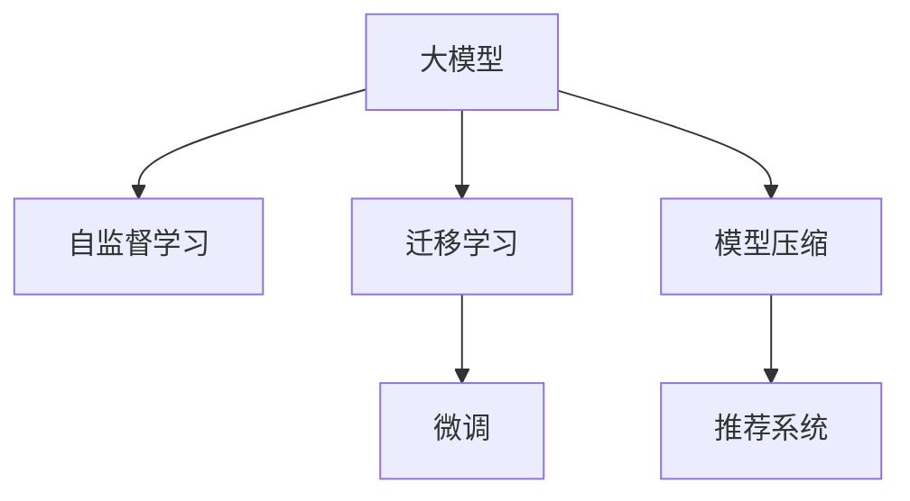

                 

## 1. 背景介绍

推荐系统在电子商务、内容分发、社交网络等多个领域得到广泛应用，对用户的个性化需求进行精准推荐，极大地提升了用户体验和平台转化率。然而，推荐系统在实时性能上仍面临诸多挑战，如处理海量请求、保证推荐结果的及时性和准确性等。大模型的出现，为推荐系统提供了全新的技术解决方案。

### 1.1 推荐系统的发展历程

推荐系统经历了从基于协同过滤、基于内容的推荐到基于深度学习、基于图神经网络的演进过程，每一步都伴随着技术的发展和数据的积累。早期的协同过滤、基于内容的推荐方法基于用户和物品的显式特征，存在稀疏性、冷启动等问题。深度学习方法将用户和物品表示为向量，通过神经网络结构挖掘特征之间的隐式关系，取得了更好的推荐效果。图神经网络进一步利用图结构关系，将推荐模型从一跳关系扩展到多跳关系，提升了推荐系统的全局理解能力。

然而，深度学习推荐模型往往依赖于大量的用户行为数据和复杂的模型训练过程，导致训练时间长、部署复杂、实时性能较差。近年来，大模型在推荐系统中的应用逐渐增多，以TensorFlow、PyTorch等为代表的深度学习框架，为推荐系统带来了新的突破。

### 1.2 大模型的优势

大模型通过大规模无标签数据进行预训练，获得了丰富的特征表示，具有如下优势：

1. **泛化能力更强**：大模型在大规模数据上进行预训练，具有更强的泛化能力，可以在各种推荐场景下取得较好的效果。
2. **参数共享优化**：大模型中各层参数可以共享，在微调时只需更新少量参数，减少了计算量和存储空间。
3. **自监督学习**：大模型可以通过自监督任务进行预训练，无需标注数据即可获取通用特征表示。
4. **跨领域迁移**：大模型在特定领域进行微调后，可以用于多个相关领域的推荐，减少了重复开发的工作量。
5. **模型压缩与优化**：大模型通常具备高效的模型压缩和优化技术，如量化、剪枝等，能够减少资源消耗，提高实时性能。

## 2. 核心概念与联系

### 2.1 核心概念概述

推荐系统和大模型在推荐算法和模型训练上有着紧密的联系。通过大模型在推荐系统中的应用，可以显著提升推荐系统的实时性能，同时保持模型的精度和泛化能力。

- **推荐系统**：通过分析用户行为数据，为用户推荐个性化的商品、内容、服务等的系统。
- **大模型**：通过大规模无标签数据进行预训练，具有强大的特征表示能力的模型。
- **自监督学习**：利用未标注数据进行训练，使模型学习到普遍特征。
- **迁移学习**：将在大规模数据上预训练的知识迁移到特定领域，提升模型的泛化能力。
- **微调**：通过下游任务的有标签数据进行优化，使模型适应具体场景。
- **模型压缩**：通过量化、剪枝等方法减小模型体积，提升模型性能。

### 2.2 核心概念原理和架构的 Mermaid 流程图



## 3. 核心算法原理 & 具体操作步骤

### 3.1 算法原理概述

利用大模型提升推荐系统的实时性能，主要通过以下几个步骤：

1. **数据预处理**：收集用户行为数据和物品属性数据，并进行特征工程。
2. **大模型预训练**：在大规模无标签数据上，使用自监督任务进行预训练。
3. **微调**：在特定领域的推荐数据上进行微调，适应推荐场景。
4. **模型压缩**：对微调后的模型进行优化和压缩，减小存储空间和计算量。
5. **实时推荐**：将优化后的模型部署到实时推荐系统中，进行快速响应和高效推理。

### 3.2 算法步骤详解

#### 3.2.1 数据预处理

数据预处理是推荐系统的基础，包括数据清洗、特征提取、特征选择等环节。通过数据预处理，可以提高推荐模型的泛化能力和准确性。

#### 3.2.2 大模型预训练

大模型预训练是大模型提升推荐系统实时性能的关键步骤。通过自监督学习任务，模型可以学习到通用特征表示。常用的自监督任务包括：

- **掩码语言模型**：将文本序列中的某些词用特殊标记掩码，模型预测被掩码的词。
- **掩码图像模型**：将图像序列中的某些像素用特殊标记掩码，模型预测被掩码的像素。
- **掩码视频模型**：将视频序列中的某些帧用特殊标记掩码，模型预测被掩码的帧。

#### 3.2.3 微调

微调是利用大模型提升推荐系统实时性能的重要手段。通过在特定领域的推荐数据上进行微调，模型可以学习到推荐场景中的特定特征，提高推荐效果。

#### 3.2.4 模型压缩

模型压缩是大模型在推荐系统中应用的最后一步。通过模型压缩技术，可以减小模型的体积和计算量，提升推荐系统的实时性能。常用的模型压缩方法包括：

- **量化**：将浮点数模型转换为定点数模型，减小存储空间。
- **剪枝**：去除模型中的冗余参数，减小计算量。
- **知识蒸馏**：利用教师模型对学生模型进行训练，减小模型体积。

#### 3.2.5 实时推荐

实时推荐系统需要高效、稳定的处理能力，以保证推荐结果的实时性和准确性。通过优化模型推理流程，可以提升推荐系统的性能。

## 4. 数学模型和公式 & 详细讲解 & 举例说明

### 4.1 数学模型构建

推荐系统通常使用协同过滤、基于内容的推荐、深度学习推荐等方法，其中深度学习推荐模型最为流行。以下以深度学习推荐模型为例，介绍数学模型的构建过程。

推荐系统可以表示为三元组 $(U, I, R)$，其中 $U$ 表示用户集合，$I$ 表示物品集合，$R$ 表示用户对物品的评分。推荐系统可以表示为：

$$
P_{\theta}(u, i) = softmax(\theta^T [u, i])
$$

其中 $\theta$ 为模型参数，$u$ 和 $i$ 分别为用户和物品的向量表示。模型的目标是最小化预测误差，即：

$$
\min_{\theta} \sum_{(u, i) \in \mathcal{R}} \text{loss}(P_{\theta}(u, i), R(u, i))
$$

其中 $\text{loss}$ 为损失函数，$\mathcal{R}$ 为样本集合。

### 4.2 公式推导过程

推荐模型的训练过程通常采用随机梯度下降(SGD)算法，目标是最小化损失函数。训练过程可以表示为：

$$
\theta \leftarrow \theta - \eta \nabla_{\theta} \mathcal{L}(\theta)
$$

其中 $\eta$ 为学习率，$\nabla_{\theta} \mathcal{L}(\theta)$ 为目标函数对模型参数的梯度。

### 4.3 案例分析与讲解

以电影推荐系统为例，介绍推荐模型在大模型中的应用。

假设有一个电影推荐系统，包含用户 $U = \{1, 2, \ldots, m\}$ 和电影 $I = \{1, 2, \ldots, n\}$，用户对电影的评分 $R$ 为1到5的整数。可以使用深度学习模型进行推荐，模型输入为用户的兴趣表示和电影的特征表示，输出为用户对电影的评分概率。

假设用户的兴趣表示为 $u$，电影的特征表示为 $i$，则推荐模型的目标函数为：

$$
\min_{\theta} \sum_{(u, i) \in \mathcal{R}} \text{loss}(P_{\theta}(u, i), R(u, i))
$$

其中 $\text{loss}$ 为交叉熵损失函数。训练过程可以使用SGD算法进行优化。

## 5. 项目实践：代码实例和详细解释说明

### 5.1 开发环境搭建

在进行推荐系统开发前，需要准备好开发环境。以下是使用Python进行TensorFlow开发的环境配置流程：

1. 安装Anaconda：从官网下载并安装Anaconda，用于创建独立的Python环境。
2. 创建并激活虚拟环境：
```bash
conda create -n tf-env python=3.7
conda activate tf-env
```
3. 安装TensorFlow：根据CUDA版本，从官网获取对应的安装命令。例如：
```bash
conda install tensorflow=2.3
```
4. 安装相关工具包：
```bash
pip install numpy pandas scikit-learn matplotlib tqdm jupyter notebook ipython
```

完成上述步骤后，即可在`tf-env`环境中开始推荐系统开发。

### 5.2 源代码详细实现

以下是使用TensorFlow构建推荐系统的代码实现：

```python
import tensorflow as tf
from tensorflow.keras import layers, models

# 构建模型
input_user = layers.Input(shape=(1,), name='user')
input_item = layers.Input(shape=(1,), name='item')

# 用户嵌入层
user_embedding = layers.Embedding(input_dim=num_users, output_dim=embedding_dim)(input_user)

# 物品嵌入层
item_embedding = layers.Embedding(input_dim=num_items, output_dim=embedding_dim)(input_item)

# 用户和物品的向量相乘
concat = layers.Concatenate()([user_embedding, item_embedding])

# 全连接层
dense = layers.Dense(1, activation='sigmoid')(concat)

# 输出模型
model = models.Model(inputs=[input_user, input_item], outputs=dense)

# 编译模型
model.compile(optimizer='adam', loss='binary_crossentropy', metrics=['accuracy'])

# 训练模型
model.fit([user_data, item_data], rating_data, epochs=num_epochs, batch_size=batch_size)

# 评估模型
test_loss, test_acc = model.evaluate([test_user_data, test_item_data], test_rating_data)
print(f'Test accuracy: {test_acc:.2f}')
```

### 5.3 代码解读与分析

**输入层和嵌入层**：
- 使用`Input`层定义输入特征，包括用户特征和物品特征。
- 使用`Embedding`层将高维稀疏特征转换为低维稠密向量，便于模型处理。

**全连接层**：
- 使用`Dense`层进行特征融合，生成用户对物品的评分预测。
- 使用`sigmoid`激活函数输出预测结果，取值范围在0到1之间，表示推荐概率。

**模型编译与训练**：
- 使用`compile`方法编译模型，设置优化器、损失函数和评估指标。
- 使用`fit`方法训练模型，设置训练次数和批次大小。

**模型评估**：
- 使用`evaluate`方法评估模型在测试集上的性能，输出预测准确率。

## 6. 实际应用场景

### 6.1 电商平台推荐系统

电商平台推荐系统通过分析用户的浏览、购买、评价等行为数据，为用户推荐商品，提高购物体验和转化率。大模型的应用可以提升推荐系统的实时性能，同时保持推荐结果的个性化和多样性。

在实际应用中，大模型可以在大规模无标签商品数据上进行预训练，学习到商品的通用特征。然后，在特定用户的浏览和购买行为数据上进行微调，得到用户对商品的个性化评分预测。最终，通过优化和压缩模型，实现高效实时推荐。

### 6.2 内容分发平台推荐系统

内容分发平台如视频网站、新闻网站等，通过分析用户的行为数据，为用户推荐内容，提高用户粘性和平台流量。大模型的应用可以提升推荐系统的实时性能，同时保持内容的个性化和多样化。

在实际应用中，大模型可以在大规模无标签视频、文章等数据上进行预训练，学习到内容的通用特征。然后，在特定用户的浏览和互动行为数据上进行微调，得到用户对内容的个性化评分预测。最终，通过优化和压缩模型，实现高效实时推荐。

### 6.3 社交网络推荐系统

社交网络推荐系统通过分析用户的社交关系和兴趣，为用户推荐好友、文章、活动等，增加用户互动和平台活跃度。大模型的应用可以提升推荐系统的实时性能，同时保持推荐的个性化和多样性。

在实际应用中，大模型可以在大规模无标签社交网络数据上进行预训练，学习到用户的通用特征。然后，在特定用户的社交关系和兴趣数据上进行微调，得到用户对好友、文章、活动的个性化评分预测。最终，通过优化和压缩模型，实现高效实时推荐。

### 6.4 未来应用展望

大模型在推荐系统中的应用前景广阔，未来可以进一步拓展到更多领域。

1. **推荐场景多样化**：推荐系统可以拓展到音乐、游戏、教育等更多领域，提升用户体验和平台价值。
2. **实时性能提升**：通过优化和压缩模型，可以实现更加高效的实时推荐，满足用户即时需求。
3. **跨领域迁移**：大模型可以在不同领域的推荐场景中应用，减少重复开发的工作量。
4. **用户行为预测**：利用大模型进行用户行为预测，为推荐系统提供更多数据驱动的决策依据。
5. **隐私保护**：通过差分隐私等技术，保护用户隐私，同时提升推荐系统的安全性。

## 7. 工具和资源推荐

### 7.1 学习资源推荐

为了帮助开发者系统掌握大模型在推荐系统中的应用，以下是一些优质的学习资源：

1. 《深度学习推荐系统》书籍：介绍深度学习在推荐系统中的应用，包括模型构建、训练优化、推荐评估等。
2. 《推荐系统实战》书籍：通过具体案例介绍推荐系统的开发和部署，适合实践学习。
3. CS294《推荐系统》课程：斯坦福大学开设的推荐系统课程，涵盖推荐系统的基本原理和算法。
4. Kaggle推荐系统竞赛：通过竞赛实践，学习推荐系统开发和评估的最佳实践。
5. HuggingFace官方文档：提供大模型预训练和微调的技术细节和样例代码。

### 7.2 开发工具推荐

高效的开发离不开优秀的工具支持。以下是几款用于推荐系统开发的工具：

1. TensorFlow：由Google主导开发的深度学习框架，具有灵活的计算图和高效的分布式训练能力。
2. PyTorch：由Facebook主导的深度学习框架，支持动态计算图和丰富的模型优化工具。
3. TFX：由Google开发的推荐系统开源平台，支持模型训练、评估、部署等全流程管理。
4. TensorBoard：TensorFlow配套的可视化工具，可实时监测模型训练状态，提供丰富的图表呈现方式。
5. TensorFlow Serving：TensorFlow的推理服务，支持模型部署和实时推理。

### 7.3 相关论文推荐

大模型在推荐系统中的应用，得益于学界的持续研究。以下是几篇奠基性的相关论文，推荐阅读：

1. Wide & Deep Learning for Recommender Systems：介绍Wide & Deep模型，结合宽特征和深学习模型，提升推荐系统的表现。
2. Neural Factorization Machines for Recommender Systems：介绍神经因子机模型，结合神经网络和矩阵分解，提升推荐系统的泛化能力。
3. Deep Interest Evolution for Recommender Systems：介绍深度兴趣演化模型，通过自适应兴趣演化机制，提升推荐系统的个性化能力。
4. Learning Compressed Sensing Recurrent Neural Networks for Recommender Systems：介绍压缩感知递归神经网络模型，通过压缩感知技术提升推荐系统的实时性能。

## 8. 总结：未来发展趋势与挑战

### 8.1 研究成果总结

利用大模型提升推荐系统的实时性能，已经成为推荐系统发展的重要方向。通过大模型的应用，推荐系统可以提升实时性能，同时保持模型的精度和泛化能力。大模型的应用还拓展了推荐系统的应用场景，提升了用户体验和平台价值。

### 8.2 未来发展趋势

未来，大模型在推荐系统中的应用将呈现以下几个趋势：

1. **模型规模增大**：随着计算资源和数据规模的增加，大模型的规模将进一步增大，提升推荐系统的性能。
2. **跨领域迁移能力增强**：大模型在多个领域的迁移能力将进一步提升，减少重复开发的工作量。
3. **实时性能优化**：通过优化和压缩模型，可以实现更高效的实时推荐，提升用户体验。
4. **个性化和多样性增强**：利用大模型，可以实现更加个性化和多样化的推荐，提高用户满意度和平台粘性。
5. **隐私保护和安全保障**：通过差分隐私等技术，保护用户隐私和数据安全。

### 8.3 面临的挑战

尽管大模型在推荐系统中的应用已经取得显著成效，但仍然面临一些挑战：

1. **计算资源需求高**：大模型需要大量的计算资源进行训练和推理，对硬件要求较高。
2. **数据质量要求高**：大模型对数据质量要求较高，需要大规模高质量数据进行训练。
3. **模型复杂度高**：大模型的结构复杂，容易出现过拟合和泛化能力不足的问题。
4. **实时性能瓶颈**：推荐系统的实时性能要求高，大模型的推理速度和计算量需要进一步优化。
5. **用户隐私保护**：在推荐系统中应用大模型，需要考虑用户隐私和数据安全问题。

### 8.4 研究展望

未来，针对大模型在推荐系统中的应用，可以从以下几个方面进行进一步研究：

1. **高效模型压缩**：通过量化、剪枝等技术，实现高效模型压缩，提升推荐系统的实时性能。
2. **跨领域知识融合**：将不同领域的知识与大模型结合，提升推荐系统的全局理解能力。
3. **多任务学习**：通过多任务学习，提升推荐系统的泛化能力和性能。
4. **联邦学习**：通过联邦学习技术，实现分布式推荐系统，提升数据利用效率。
5. **隐私保护**：通过差分隐私等技术，保护用户隐私，同时提升推荐系统的安全性。

## 9. 附录：常见问题与解答

**Q1：大模型在推荐系统中的优势是什么？**

A: 大模型在推荐系统中的优势主要体现在以下几个方面：
1. **泛化能力更强**：大模型在大规模数据上进行预训练，具有更强的泛化能力，可以在各种推荐场景下取得较好的效果。
2. **参数共享优化**：大模型中各层参数可以共享，在微调时只需更新少量参数，减少了计算量和存储空间。
3. **自监督学习**：大模型可以通过自监督任务进行预训练，无需标注数据即可获取通用特征表示。
4. **跨领域迁移**：大模型在特定领域进行微调后，可以用于多个相关领域的推荐，减少了重复开发的工作量。
5. **模型压缩**：大模型通常具备高效的模型压缩和优化技术，如量化、剪枝等，能够减少资源消耗，提高实时性能。

**Q2：大模型在推荐系统中如何进行数据预处理？**

A: 大模型在推荐系统中的数据预处理主要包括：
1. **数据清洗**：去除数据中的噪声和异常值，提高数据质量。
2. **特征工程**：提取和构造用户和物品的特征，进行向量化处理。
3. **特征选择**：选择对推荐结果有重要影响的特征，减小数据维度和计算量。

**Q3：大模型在推荐系统中的微调策略有哪些？**

A: 大模型在推荐系统中的微调策略包括：
1. **全参数微调**：更新模型中的所有参数，适应推荐场景。
2. **参数高效微调**：只更新模型中的少量参数，减小计算量和存储空间。
3. **知识蒸馏**：利用教师模型对学生模型进行训练，提升学生模型的泛化能力。

**Q4：如何评估推荐系统的性能？**

A: 推荐系统的性能评估指标包括：
1. **准确率**：推荐系统预测的准确率，即预测结果与真实结果的一致性。
2. **召回率**：推荐系统预测的召回率，即预测结果中包含真实结果的比例。
3. **F1分数**：准确率和召回率的调和平均数，综合评估推荐系统的性能。
4. **均方误差**：预测结果与真实结果之间的均方误差，评估预测的准确度。
5. **用户满意度**：用户对推荐结果的主观评价，通过问卷调查等手段进行评估。

**Q5：如何优化推荐系统的实时性能？**

A: 优化推荐系统的实时性能主要通过以下几个方面：
1. **模型压缩**：通过量化、剪枝等技术，减小模型的体积和计算量。
2. **分布式训练**：利用分布式训练技术，加速模型的训练过程。
3. **缓存机制**：利用缓存机制，减少重复计算和数据读取，提升推理速度。
4. **并行推理**：利用并行推理技术，提高推理的并发度和效率。

---

作者：禅与计算机程序设计艺术 / Zen and the Art of Computer Programming

