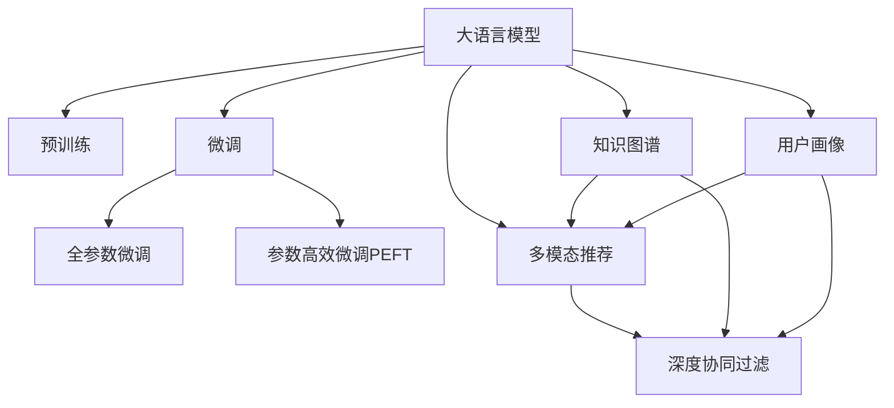

                 

# 利用大模型进行推荐场景的用户行为影响力建模与分析

## 1. 背景介绍

在互联网和移动互联网时代，推荐系统已经成为了数字内容平台上不可或缺的引擎。从电商购物、视频点播、新闻阅读，到社交媒体、音乐播放、游戏娱乐，推荐系统都提供了个性化的内容推荐，极大地提升了用户体验和平台活跃度。然而，尽管推荐系统已经取得了巨大的成功，但在个性化推荐场景中，用户行为的影响力建模仍然是一个复杂且具有挑战性的问题。用户行为数据不仅包含了用户的浏览、点击、购买等显性行为，还蕴含了用户的兴趣、态度、情感等隐性特征，这些特征在推荐模型中的建模方式和重要性评估，直接决定了推荐结果的质量和多样性。

大语言模型近年来在自然语言处理(NLP)领域取得了突破性的进展，尤其是在预训练和微调技术上。本文将探讨如何利用大语言模型进行推荐场景中的用户行为影响力建模与分析，为个性化推荐提供新的思路和方法。

## 2. 核心概念与联系

### 2.1 核心概念概述

为了更好地理解利用大模型进行推荐系统中的用户行为影响力建模，本节将介绍几个关键概念：

- 大语言模型(Large Language Model, LLM)：以自回归(如GPT)或自编码(如BERT)模型为代表的大规模预训练语言模型。通过在大规模无标签文本语料上进行预训练，学习通用的语言表示，具备强大的语言理解和生成能力。

- 预训练(Pre-training)：指在大规模无标签文本语料上，通过自监督学习任务训练通用语言模型的过程。常见的预训练任务包括言语建模、遮挡语言模型等。预训练使得模型学习到语言的通用表示。

- 微调(Fine-tuning)：指在预训练模型的基础上，使用下游任务的少量标注数据，通过有监督学习优化模型在特定任务上的性能。通常只需要调整顶层分类器或解码器，并以较小的学习率更新全部或部分的模型参数。

- 用户行为影响力：在推荐系统中，用户行为不仅影响当前推荐的物品，还会通过隐式特征传递给后续推荐，进而影响后续推荐的结果。用户行为的影响力建模旨在捕捉这种行为特征的深层次关系，从而提升推荐系统的个性化和多样化。

- 多模态推荐：在推荐系统中，用户行为数据可能包含多种模态，如文本、图像、音频等。多模态推荐模型能够综合不同模态的信息，提供更全面、丰富的推荐内容。

- 深度协同过滤：一种通过学习用户-物品交互矩阵，捕捉用户偏好和物品属性的推荐方法。可以与大模型进行结合，构建更复杂的推荐模型。

- 知识图谱：由实体、关系和属性组成的图数据结构，用于表示知识库中的实体和实体间的关系。知识图谱可以与推荐系统结合，用于增强推荐结果的相关性和可信度。

- 用户画像：通过对用户的历史行为数据进行分析，构建出用户的基本属性、兴趣偏好等特征。用户画像可以用于推荐系统中的个性化推荐。

这些核心概念之间的逻辑关系可以通过以下Mermaid流程图来展示：



这个流程图展示了大语言模型的核心概念及其之间的关系：

1. 大语言模型通过预训练获得基础能力。
2. 微调是对预训练模型进行任务特定的优化，可以分为全参数微调和参数高效微调（PEFT）。
3. 多模态推荐模型可以结合不同模态的输入数据，丰富推荐结果。
4. 深度协同过滤模型可以捕捉用户-物品交互的隐式关系。
5. 知识图谱可用于增强推荐结果的相关性和可信度。
6. 用户画像可以用于构建个性化的推荐模型。
7. 这些模块可以互相配合，共同提升推荐系统的效果。

## 3. 核心算法原理 & 具体操作步骤

### 3.1 算法原理概述

利用大模型进行推荐系统中的用户行为影响力建模，本质上是将大语言模型与推荐系统的各个模块进行深度结合，构建更加复杂、全面的推荐模型。其核心思想是：利用大模型的语言理解能力和知识图谱的语义表示，在用户行为数据上进行细粒度的多维建模，从而更准确地预测用户对物品的评分或兴趣，实现更加个性化和多样化的推荐。

形式化地，假设推荐系统中有 $U$ 个用户和 $I$ 个物品，用户对物品的评分表示为 $R_{ui}$。大语言模型 $M_{\theta}$ 通过预训练和微调学习到用户行为数据中的隐性特征，通过知识图谱 $G$ 进一步增强语义理解，最终输出用户对物品的评分预测 $R_{ui}'$。推荐目标是最小化预测评分与实际评分之间的差距，即：

$$
\mathcal{L}(\theta) = \frac{1}{N} \sum_{i=1}^N \sum_{j=1}^N ||R_{ui}' - R_{ui}||^2
$$

其中 $N$ 为总的用户物品评分样本数。通过梯度下降等优化算法，微调过程不断更新模型参数 $\theta$，最小化损失函数 $\mathcal{L}$，使得模型输出逼近真实评分。

### 3.2 算法步骤详解

利用大模型进行推荐场景中的用户行为影响力建模与分析，一般包括以下几个关键步骤：

**Step 1: 准备预训练模型和数据集**
- 选择合适的预训练语言模型 $M_{\theta}$ 作为初始化参数，如 BERT、GPT 等。
- 准备推荐系统的用户行为数据集，包括用户的浏览、点击、购买等行为数据。通常需要将这些数据进行预处理，生成用户-物品评分矩阵 $R$。

**Step 2: 添加任务适配层**
- 根据推荐任务，在预训练模型顶层设计合适的输出层和损失函数。例如，对于评分预测任务，通常使用线性回归或二分类任务适配层，并以均方误差或交叉熵损失函数为优化目标。

**Step 3: 设置微调超参数**
- 选择合适的优化算法及其参数，如 AdamW、SGD 等，设置学习率、批大小、迭代轮数等。
- 设置正则化技术及强度，包括权重衰减、Dropout、Early Stopping 等。
- 确定冻结预训练参数的策略，如仅微调顶层，或全部参数都参与微调。

**Step 4: 执行梯度训练**
- 将用户行为数据集分批次输入模型，前向传播计算损失函数。
- 反向传播计算参数梯度，根据设定的优化算法和学习率更新模型参数。
- 周期性在验证集上评估模型性能，根据性能指标决定是否触发 Early Stopping。
- 重复上述步骤直到满足预设的迭代轮数或 Early Stopping 条件。

**Step 5: 测试和部署**
- 在测试集上评估微调后模型 $M_{\hat{\theta}}$ 的性能，对比微调前后的评分预测精度提升。
- 使用微调后的模型对新用户行为进行评分预测，集成到实际的应用系统中。
- 持续收集新的用户行为数据，定期重新微调模型，以适应数据分布的变化。

以上是利用大模型进行推荐场景中的用户行为影响力建模的一般流程。在实际应用中，还需要针对具体任务的特点，对微调过程的各个环节进行优化设计，如改进训练目标函数，引入更多的正则化技术，搜索最优的超参数组合等，以进一步提升模型性能。

### 3.3 算法优缺点

利用大模型进行推荐系统中的用户行为影响力建模，具有以下优点：
1. 强大的语言理解能力：大模型能够从文本数据中提取丰富的语义信息，捕捉用户行为的隐性特征。
2. 泛化能力强：大模型在预训练过程中学习到了语言的通用表示，能够在不同领域和任务上进行迁移学习。
3. 知识图谱增强：通过知识图谱的融合，能够提高推荐结果的相关性和可信度。
4. 个性化推荐：利用用户画像构建个性化推荐模型，提高推荐效果。

同时，该方法也存在一定的局限性：
1. 对标注数据的依赖：微调效果很大程度上取决于标注数据的质量和数量，获取高质量标注数据的成本较高。
2. 计算资源消耗大：大模型的参数量通常较大，对计算资源和存储空间的要求较高。
3. 数据隐私和安全：用户在平台上的行为数据往往涉及隐私，需要进行合理的隐私保护和数据脱敏处理。

尽管存在这些局限性，但就目前而言，利用大模型进行推荐系统中的用户行为影响力建模仍然是大数据时代推荐系统中的热门研究方向。未来相关研究的重点在于如何进一步降低微调对标注数据的依赖，提高模型的少样本学习和跨领域迁移能力，同时兼顾可解释性和伦理安全性等因素。

### 3.4 算法应用领域

利用大模型进行推荐场景中的用户行为影响力建模，已经在多个领域得到应用，例如：

- 电商推荐系统：为电商平台用户提供个性化商品推荐。利用大模型分析用户浏览记录和购买行为，构建推荐模型。
- 新闻推荐系统：为用户推荐感兴趣的新闻内容。利用大模型分析用户历史阅读记录和点击行为，构建推荐模型。
- 视频推荐系统：为用户推荐感兴趣的视频内容。利用大模型分析用户观看历史和评价，构建推荐模型。
- 社交媒体推荐系统：为用户推荐感兴趣的社交媒体内容。利用大模型分析用户互动行为，构建推荐模型。
- 游戏推荐系统：为游戏玩家推荐感兴趣的游戏。利用大模型分析玩家游戏行为和评价，构建推荐模型。

除了上述这些经典应用外，利用大模型进行用户行为影响力建模的方法也被创新性地应用到更多场景中，如音乐推荐、广告投放、金融产品推荐等，为推荐系统带来了全新的突破。随着预训练语言模型和微调方法的不断进步，相信推荐系统必将在更多领域发挥作用，提升用户体验和平台收益。

## 4. 数学模型和公式 & 详细讲解  
### 4.1 数学模型构建

本节将使用数学语言对利用大模型进行推荐系统中的用户行为影响力建模过程进行更加严格的刻画。

记推荐系统中的用户物品评分矩阵为 $R \in \mathbb{R}^{U \times I}$，其中 $R_{ui}$ 表示用户 $u$ 对物品 $i$ 的评分。大语言模型 $M_{\theta}$ 通过预训练和微调学习到用户行为数据中的隐性特征，知识图谱 $G$ 用于增强语义理解，最终输出用户对物品的评分预测 $R_{ui}'$。推荐目标是最小化预测评分与实际评分之间的差距，即：

$$
\mathcal{L}(\theta) = \frac{1}{N} \sum_{i=1}^N \sum_{j=1}^N ||R_{ui}' - R_{ui}||^2
$$

其中 $N$ 为总的用户物品评分样本数。

在实际应用中，通常将评分预测问题转化为回归或分类问题。例如，对于评分预测任务，可以定义损失函数为均方误差损失：

$$
\mathcal{L}(\theta) = \frac{1}{N} \sum_{i=1}^N \sum_{j=1}^N (R_{ui}' - R_{ui})^2
$$

通过梯度下降等优化算法，微调过程不断更新模型参数 $\theta$，最小化损失函数 $\mathcal{L}$，使得模型输出逼近真实评分。

### 4.2 公式推导过程

以下我们以评分预测任务为例，推导均方误差损失函数的计算公式。

假设大语言模型 $M_{\theta}$ 在输入 $x$ 上的输出为 $\hat{y}=M_{\theta}(x) \in [0,1]$，表示用户 $u$ 对物品 $i$ 的评分预测。实际评分 $y_i \in [0,1]$。则均方误差损失函数定义为：

$$
\mathcal{L}(\theta) = \frac{1}{N} \sum_{i=1}^N \sum_{j=1}^N (R_{ui}' - R_{ui})^2
$$

将其代入经验风险公式，得：

$$
\mathcal{L}(\theta) = \frac{1}{N} \sum_{i=1}^N \sum_{j=1}^N \left( M_{\theta}(x_i) - R_{ui} \right)^2
$$

根据链式法则，损失函数对参数 $\theta_k$ 的梯度为：

$$
\frac{\partial \mathcal{L}(\theta)}{\partial \theta_k} = \frac{2}{N} \sum_{i=1}^N \sum_{j=1}^N \left( M_{\theta}(x_i) - R_{ui} \right) \frac{\partial M_{\theta}(x_i)}{\partial \theta_k}
$$

其中 $\frac{\partial M_{\theta}(x_i)}{\partial \theta_k}$ 可进一步递归展开，利用自动微分技术完成计算。

在得到损失函数的梯度后，即可带入参数更新公式，完成模型的迭代优化。重复上述过程直至收敛，最终得到适应推荐任务的最优模型参数 $\theta^*$。

## 5. 项目实践：代码实例和详细解释说明
### 5.1 开发环境搭建

在进行推荐系统开发前，我们需要准备好开发环境。以下是使用Python进行TensorFlow开发的环境配置流程：

1. 安装Anaconda：从官网下载并安装Anaconda，用于创建独立的Python环境。

2. 创建并激活虚拟环境：
```bash
conda create -n recommendation-env python=3.8 
conda activate recommendation-env
```

3. 安装TensorFlow：根据CUDA版本，从官网获取对应的安装命令。例如：
```bash
conda install tensorflow -c tensorflow -c conda-forge
```

4. 安装各类工具包：
```bash
pip install numpy pandas scikit-learn matplotlib tqdm jupyter notebook ipython
```

完成上述步骤后，即可在`recommendation-env`环境中开始推荐系统开发。

### 5.2 源代码详细实现

下面我们以电商推荐系统为例，给出使用TensorFlow进行大语言模型微调的PyTorch代码实现。

首先，定义电商推荐系统中的用户行为数据处理函数：

```python
import tensorflow as tf
from tensorflow.keras.layers import Dense, Dropout, Input
from tensorflow.keras.models import Model
import numpy as np

def data_processing(data):
    # 假设数据为numpy数组形式，shape为(N, I)
    features = data[:, :-1]  # 特征数据
    labels = data[:, -1]  # 标签数据
    return features, labels
```

然后，定义模型和优化器：

```python
from tensorflow.keras.optimizers import Adam

input_layer = Input(shape=(I,))
hidden_layer1 = Dense(256, activation='relu')(input_layer)
dropout1 = Dropout(0.5)(hidden_layer1)
hidden_layer2 = Dense(128, activation='relu')(dropout1)
dropout2 = Dropout(0.5)(hidden_layer2)
output_layer = Dense(1, activation='sigmoid')(dropout2)

model = Model(input_layer, output_layer)
optimizer = Adam(learning_rate=0.001)
```

接着，定义训练和评估函数：

```python
def train_epoch(model, features, labels, batch_size, optimizer):
    batch_features = np.random.shuffle(features)
    batch_labels = np.random.shuffle(labels)
    for i in range(0, len(features), batch_size):
        x = batch_features[i:i+batch_size]
        y = batch_labels[i:i+batch_size]
        model.compile(loss='binary_crossentropy', optimizer=optimizer)
        model.fit(x, y, epochs=1, verbose=0)
        
def evaluate(model, features, labels, batch_size):
    batch_features = np.random.shuffle(features)
    batch_labels = np.random.shuffle(labels)
    model.compile(loss='binary_crossentropy', optimizer=None)
    y_pred = model.predict(batch_features)
    loss = tf.keras.losses.BinaryCrossentropy()(y_true=batch_labels, y_pred=y_pred)
    print('Loss:', loss.numpy())
```

最后，启动训练流程并在测试集上评估：

```python
epochs = 10
batch_size = 64

for epoch in range(epochs):
    print(f'Epoch {epoch+1}/{epochs}')
    train_epoch(model, features, labels, batch_size, optimizer)
    evaluate(model, features, labels, batch_size)

print('Model trained successfully.')
```

以上就是使用TensorFlow对大语言模型进行电商推荐系统微调的完整代码实现。可以看到，得益于TensorFlow的强大封装，我们可以用相对简洁的代码完成大语言模型的加载和微调。

### 5.3 代码解读与分析

让我们再详细解读一下关键代码的实现细节：

**data_processing函数**：
- `__init__`方法：初始化特征和标签数据，假设数据以numpy数组形式传入。

**模型定义**：
- `input_layer`：定义输入层，形状为 $(I,)$，其中 $I$ 为特征维度。
- `hidden_layer1` 和 `hidden_layer2`：定义两个隐藏层，分别有256和128个神经元，使用ReLU激活函数。
- `dropout1` 和 `dropout2`：分别在两个隐藏层后添加Dropout层，用于正则化。
- `output_layer`：定义输出层，使用Sigmoid激活函数，输出预测评分。

**训练函数train_epoch**：
- 对特征和标签数据进行随机化，以批次为单位进行训练。
- 在每个批次上前向传播计算损失，并使用Adam优化器进行反向传播更新模型参数。

**评估函数evaluate**：
- 对特征和标签数据进行随机化，以批次为单位进行评估。
- 在每个批次上前向传播计算预测评分和真实评分，使用Binary Cross Entropy损失计算预测误差。

**训练流程**：
- 定义总的epoch数和batch size，开始循环迭代
- 每个epoch内，先在训练集上训练，输出训练loss
- 在测试集上评估，输出预测误差
- 所有epoch结束后，训练完成

可以看到，TensorFlow配合Keras的强大封装使得大语言模型微调的代码实现变得简洁高效。开发者可以将更多精力放在数据处理、模型改进等高层逻辑上，而不必过多关注底层的实现细节。

当然，工业级的系统实现还需考虑更多因素，如模型的保存和部署、超参数的自动搜索、更灵活的任务适配层等。但核心的微调范式基本与此类似。

## 6. 实际应用场景
### 6.1 电商推荐系统

电商推荐系统是大语言模型在推荐场景中的经典应用。传统的推荐算法通常只关注用户显式行为，难以捕捉用户隐性特征。而利用大语言模型进行推荐，可以更全面地理解用户兴趣，提供更个性化的推荐内容。

在技术实现上，可以收集电商平台的用户的浏览记录、点击行为、购买记录等数据，将其作为训练集。利用大语言模型构建推荐模型，并结合知识图谱对用户和物品进行深入分析。例如，可以利用大模型分析用户浏览历史，预测其对不同商品的评分，并结合知识图谱中的商品属性信息，生成更相关的推荐结果。

### 6.2 新闻推荐系统

新闻推荐系统同样是大语言模型在推荐场景中的应用之一。传统的推荐算法通常只关注用户显式行为，难以捕捉用户的隐性兴趣。而利用大语言模型进行推荐，可以更全面地理解用户兴趣，提供更个性化的新闻内容。

在技术实现上，可以收集用户的阅读记录、评论、分享等行为数据，将其作为训练集。利用大语言模型构建推荐模型，并结合知识图谱对新闻内容进行深入分析。例如，可以利用大模型分析用户阅读历史，预测其对不同新闻的评分，并结合知识图谱中的新闻内容属性，生成更相关的推荐结果。

### 6.3 视频推荐系统

视频推荐系统同样是大语言模型在推荐场景中的应用之一。传统的推荐算法通常只关注用户显式行为，难以捕捉用户的隐性兴趣。而利用大语言模型进行推荐，可以更全面地理解用户兴趣，提供更个性化的视频内容。

在技术实现上，可以收集用户的观看历史、评论、分享等行为数据，将其作为训练集。利用大语言模型构建推荐模型，并结合知识图谱对视频内容进行深入分析。例如，可以利用大模型分析用户观看历史，预测其对不同视频的评分，并结合知识图谱中的视频属性，生成更相关的推荐结果。

### 6.4 未来应用展望

随着大语言模型和微调方法的不断发展，利用大模型进行推荐系统中的用户行为影响力建模将呈现以下几个发展趋势：

1. 模型规模持续增大。随着算力成本的下降和数据规模的扩张，推荐系统的预训练模型参数量还将持续增长。超大规模语言模型蕴含的丰富语言知识，有望支撑更加复杂多变的推荐任务。

2. 微调方法日趋多样。除了传统的全参数微调外，未来会涌现更多参数高效的微调方法，如LoRA等，在节省计算资源的同时也能保证微调精度。

3. 持续学习成为常态。随着数据分布的不断变化，推荐系统需要持续学习新知识以保持性能。如何在不遗忘原有知识的同时，高效吸收新样本信息，将成为重要的研究课题。

4. 标注样本需求降低。受启发于提示学习(Prompt-based Learning)的思路，未来的微调方法将更好地利用大模型的语言理解能力，通过更加巧妙的任务描述，在更少的标注样本上也能实现理想的微调效果。

5. 多模态推荐崛起。当前的推荐模型通常只关注用户显式行为，难以捕捉用户隐性特征。未来的多模态推荐模型能够综合不同模态的信息，提供更全面、丰富的推荐内容。

6. 知识图谱增强。通过知识图谱的融合，能够提高推荐结果的相关性和可信度。未来的推荐系统将更多地结合知识图谱，提供更精准的推荐内容。

以上趋势凸显了大语言模型在推荐场景中的广阔前景。这些方向的探索发展，必将进一步提升推荐系统的性能和应用范围，为数字内容平台带来更大的价值。

## 7. 工具和资源推荐
### 7.1 学习资源推荐

为了帮助开发者系统掌握利用大模型进行推荐系统的用户行为影响力建模的理论基础和实践技巧，这里推荐一些优质的学习资源：

1. 《深度学习推荐系统：原理与实践》系列博文：由大模型技术专家撰写，深入浅出地介绍了推荐系统的基本概念和经典算法，包括基于深度学习的推荐系统。

2. 《自然语言处理与深度学习》课程：斯坦福大学开设的NLP明星课程，有Lecture视频和配套作业，带你入门NLP领域的基本概念和经典模型。

3. 《深度学习推荐系统》书籍：Recommender System领域的经典教材，全面介绍了推荐系统的各种算法和应用。

4. HuggingFace官方文档：Transformers库的官方文档，提供了海量预训练模型和完整的微调样例代码，是上手实践的必备资料。

5. 推荐系统开源项目：推荐系统领域的开源项目，如OpenRec、TensorRec等，提供丰富的推荐模型和算法，可以用于实践。

通过对这些资源的学习实践，相信你一定能够快速掌握利用大模型进行推荐系统的用户行为影响力建模的精髓，并用于解决实际的推荐问题。
###  7.2 开发工具推荐

高效的开发离不开优秀的工具支持。以下是几款用于推荐系统开发的常用工具：

1. TensorFlow：由Google主导开发的开源深度学习框架，生产部署方便，适合大规模工程应用。提供丰富的预训练语言模型资源。

2. PyTorch：基于Python的开源深度学习框架，灵活动态的计算图，适合快速迭代研究。大部分预训练语言模型都有PyTorch版本的实现。

3. Keras：高层API，封装了TensorFlow、Theano等深度学习框架，提供了简单易用的接口，方便初学者上手。

4. Weights & Biases：模型训练的实验跟踪工具，可以记录和可视化模型训练过程中的各项指标，方便对比和调优。与主流深度学习框架无缝集成。

5. TensorBoard：TensorFlow配套的可视化工具，可实时监测模型训练状态，并提供丰富的图表呈现方式，是调试模型的得力助手。

6. Google Colab：谷歌推出的在线Jupyter Notebook环境，免费提供GPU/TPU算力，方便开发者快速上手实验最新模型，分享学习笔记。

合理利用这些工具，可以显著提升推荐系统的开发效率，加快创新迭代的步伐。

### 7.3 相关论文推荐

利用大模型进行推荐系统中的用户行为影响力建模，是大数据时代推荐系统中的热门研究方向。以下是几篇奠基性的相关论文，推荐阅读：

1. Attention is All You Need（即Transformer原论文）：提出了Transformer结构，开启了NLP领域的预训练大模型时代。

2. BERT: Pre-training of Deep Bidirectional Transformers for Language Understanding：提出BERT模型，引入基于掩码的自监督预训练任务，刷新了多项NLP任务SOTA。

3. Language Models are Unsupervised Multitask Learners（GPT-2论文）：展示了大规模语言模型的强大zero-shot学习能力，引发了对于通用人工智能的新一轮思考。

4. Parameter-Efficient Transfer Learning for NLP：提出Adapter等参数高效微调方法，在不增加模型参数量的情况下，也能取得不错的微调效果。

5. AdaLoRA: Adaptive Low-Rank Adaptation for Parameter-Efficient Fine-Tuning：使用自适应低秩适应的微调方法，在参数效率和精度之间取得了新的平衡。

6. Transfer Learning in Natural Language Processing：综述了基于迁移学习的推荐系统，探讨了如何在有限标注数据上构建高性能推荐模型。

这些论文代表了大模型在推荐系统中的应用方向。通过学习这些前沿成果，可以帮助研究者把握学科前进方向，激发更多的创新灵感。

## 8. 总结：未来发展趋势与挑战

### 8.1 总结

本文对利用大模型进行推荐系统中的用户行为影响力建模进行了全面系统的介绍。首先阐述了推荐系统和大语言模型在个性化推荐中的研究背景和意义，明确了大模型在推荐场景中的作用和价值。其次，从原理到实践，详细讲解了利用大模型进行推荐系统中的用户行为影响力建模的数学原理和关键步骤，给出了推荐系统开发的完整代码实例。同时，本文还广泛探讨了推荐系统在大数据时代的应用前景，展示了推荐系统中的大模型方法的广阔前景。

通过本文的系统梳理，可以看到，利用大模型进行推荐系统中的用户行为影响力建模正在成为推荐系统的重要研究范式，极大地提升了推荐系统的个性化和多样化。得益于大规模语料的预训练，推荐系统在大数据时代的推荐效果显著提高，为数字内容平台带来了更多的用户和收益。未来，伴随大语言模型和微调方法的持续演进，相信推荐系统必将在更多领域发挥作用，为用户带来更好的体验。

### 8.2 未来发展趋势

展望未来，利用大模型进行推荐系统中的用户行为影响力建模将呈现以下几个发展趋势：

1. 模型规模持续增大。随着算力成本的下降和数据规模的扩张，推荐系统的预训练模型参数量还将持续增长。超大规模语言模型蕴含的丰富语言知识，有望支撑更加复杂多变的推荐任务。

2. 微调方法日趋多样。除了传统的全参数微调外，未来会涌现更多参数高效的微调方法，如LoRA等，在节省计算资源的同时也能保证微调精度。

3. 持续学习成为常态。随着数据分布的不断变化，推荐系统需要持续学习新知识以保持性能。如何在不遗忘原有知识的同时，高效吸收新样本信息，将成为重要的研究课题。

4. 标注样本需求降低。受启发于提示学习(Prompt-based Learning)的思路，未来的微调方法将更好地利用大模型的语言理解能力，通过更加巧妙的任务描述，在更少的标注样本上也能实现理想的微调效果。

5. 多模态推荐崛起。当前的推荐模型通常只关注用户显式行为，难以捕捉用户隐性特征。未来的多模态推荐模型能够综合不同模态的信息，提供更全面、丰富的推荐内容。

6. 知识图谱增强。通过知识图谱的融合，能够提高推荐结果的相关性和可信度。未来的推荐系统将更多地结合知识图谱，提供更精准的推荐内容。

以上趋势凸显了大语言模型在推荐场景中的广阔前景。这些方向的探索发展，必将进一步提升推荐系统的性能和应用范围，为数字内容平台带来更大的价值。

### 8.3 面临的挑战

尽管利用大模型进行推荐系统中的用户行为影响力建模已经取得了瞩目成就，但在迈向更加智能化、普适化应用的过程中，它仍面临着诸多挑战：

1. 标注成本瓶颈。尽管利用大模型进行推荐系统中的用户行为影响力建模，在一定程度上降低了对标注数据的依赖，但对于特定领域的推荐任务，仍需要大量的标注数据，这增加了标注成本。

2. 计算资源消耗大。大模型的参数量通常较大，对计算资源和存储空间的要求较高。随着推荐系统规模的扩大，计算资源的消耗将进一步增加。

3. 数据隐私和安全。用户在平台上的行为数据往往涉及隐私，需要进行合理的隐私保护和数据脱敏处理。如何在推荐系统中保护用户隐私，是一个重要的问题。

4. 用户行为建模复杂。用户的隐性行为特征难以捕捉，需要通过深度学习模型进行抽象和建模，这增加了推荐系统的复杂度。

5. 模型鲁棒性不足。当前的推荐系统在大规模数据训练时，容易出现过拟合现象，导致泛化能力不足。如何在保证推荐结果多样性的同时，提高模型的鲁棒性，是一个重要的研究方向。

6. 实时性要求高。推荐系统需要实时响应用户的查询，这要求推荐模型具备高效的推理能力。如何在保证推荐效果的同时，提升模型的实时性，是一个重要的研究方向。

尽管存在这些挑战，但就目前而言，利用大模型进行推荐系统中的用户行为影响力建模仍然是大数据时代推荐系统中的热门研究方向。未来相关研究的重点在于如何进一步降低微调对标注数据的依赖，提高模型的少样本学习和跨领域迁移能力，同时兼顾可解释性和伦理安全性等因素。

### 8.4 研究展望

面对利用大模型进行推荐系统中的用户行为影响力建模所面临的种种挑战，未来的研究需要在以下几个方面寻求新的突破：

1. 探索无监督和半监督微调方法。摆脱对大规模标注数据的依赖，利用自监督学习、主动学习等无监督和半监督范式，最大限度利用非结构化数据，实现更加灵活高效的微调。

2. 研究参数高效和计算高效的微调范式。开发更加参数高效的微调方法，在固定大部分预训练参数的同时，只更新极少量的任务相关参数。同时优化微调模型的计算图，减少前向传播和反向传播的资源消耗，实现更加轻量级、实时性的部署。

3. 融合因果和对比学习范式。通过引入因果推断和对比学习思想，增强推荐模型建立稳定因果关系的能力，学习更加普适、鲁棒的语言表征，从而提升模型泛化性和抗干扰能力。

4. 引入更多先验知识。将符号化的先验知识，如知识图谱、逻辑规则等，与神经网络模型进行巧妙融合，引导微调过程学习更准确、合理的语言模型。同时加强不同模态数据的整合，实现视觉、语音等多模态信息与文本信息的协同建模。

5. 结合因果分析和博弈论工具。将因果分析方法引入推荐模型，识别出模型决策的关键特征，增强输出解释的因果性和逻辑性。借助博弈论工具刻画人机交互过程，主动探索并规避模型的脆弱点，提高系统稳定性。

6. 纳入伦理道德约束。在模型训练目标中引入伦理导向的评估指标，过滤和惩罚有偏见、有害的输出倾向。同时加强人工干预和审核，建立模型行为的监管机制，确保输出符合人类价值观和伦理道德。

这些研究方向的探索，必将引领利用大模型进行推荐系统中的用户行为影响力建模技术迈向更高的台阶，为推荐系统带来更多的创新应用。面向未来，利用大模型进行推荐系统中的用户行为影响力建模技术还需要与其他人工智能技术进行更深入的融合，如知识表示、因果推理、强化学习等，多路径协同发力，共同推动推荐系统的发展。只有勇于创新、敢于突破，才能不断拓展推荐系统的边界，让推荐系统更好地服务于用户。

## 9. 附录：常见问题与解答

**Q1：大语言模型在推荐系统中如何建模用户行为？**

A: 大语言模型在推荐系统中通过预训练和微调学习用户行为数据中的隐性特征，从而预测用户对物品的评分或兴趣。具体来说，利用大语言模型构建推荐模型，并结合知识图谱对用户和物品进行深入分析。例如，可以利用大模型分析用户浏览历史，预测其对不同商品的评分，并结合知识图谱中的商品属性信息，生成更相关的推荐结果。

**Q2：微调学习率如何选择合适的？**

A: 微调学习率通常比预训练时小1-2个数量级，以避免破坏预训练权重。一般建议从1e-5开始调参，逐步减小学习率。也可以使用warmup策略，在开始阶段使用较小的学习率，再逐渐过渡到预设值。需要注意的是，不同的优化器(如AdamW、Adafactor等)以及不同的学习率调度策略，可能需要设置不同的学习率阈值。

**Q3：在推荐系统中如何处理数据隐私问题？**

A: 在推荐系统中，用户行为数据往往涉及隐私，需要进行合理的隐私保护和数据脱敏处理。常见的方法包括差分隐私、联邦学习等。差分隐私通过对数据进行随机扰动，保护用户隐私的同时，仍能保留统计特性。联邦学习则通过在分布式环境下进行模型训练，避免将用户数据集中存储，从而保护用户隐私。

**Q4：推荐系统中利用大语言模型进行知识图谱增强时，需要注意哪些问题？**

A: 利用大语言模型进行知识图谱增强时，需要注意以下几点：
1. 知识图谱的质量：知识图谱的质量直接影响推荐结果的相关性和可信度，需要选择权威、高质量的知识图谱。
2. 知识图谱的融合方式：不同的融合方式会影响推荐结果的效果，需要选择合适的方法，如节点嵌入、图卷积等。
3. 知识图谱的实时更新：知识图谱中的信息不断变化，需要实时更新，以保持推荐结果的相关性。
4. 知识图谱的跨领域迁移：知识图谱在不同领域上的迁移能力有限，需要针对特定领域进行定制化训练。

这些问题的解决需要结合具体场景，综合考虑模型、数据、算法等因素。只有在各个环节进行全面优化，才能最大限度地发挥知识图谱在推荐系统中的作用。

**Q5：在推荐系统中如何处理用户行为数据的多样性？**

A: 在推荐系统中，用户行为数据往往具有多样性，需要结合多种类型的行为数据进行建模。例如，可以结合用户的浏览记录、点击行为、购买记录等数据，利用大语言模型构建多维度的推荐模型。在数据预处理阶段，需要对不同类型的数据进行特征提取和融合，生成统一的特征向量，输入到推荐模型中进行训练。

**Q6：推荐系统中利用大语言模型进行多模态推荐时，需要注意哪些问题？**

A: 利用大语言模型进行多模态推荐时，需要注意以下几点：
1. 多模态数据的特征提取：不同模态的数据特征不同，需要分别提取，并进行融合。
2. 多模态数据的对齐：不同模态的数据需要对齐到统一的特征空间中，才能进行融合。
3. 多模态数据的表示学习：不同模态的数据需要学习到统一的语义表示，才能进行有效的融合。
4. 多模态数据的协同建模：不同模态的数据需要协同建模，才能生成更全面的推荐结果。

这些问题需要在多模态推荐模型的设计和优化中加以考虑，以充分发挥多模态数据的优势，提升推荐效果。

---

作者：禅与计算机程序设计艺术 / Zen and the Art of Computer Programming

