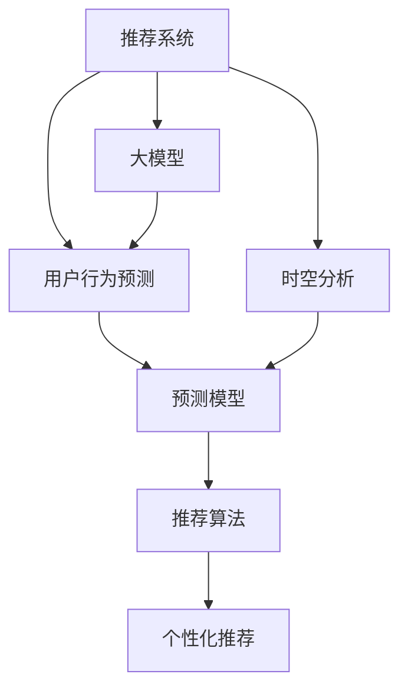

                 

# 利用大模型进行推荐场景的用户行为时空预测分析

> 关键词：用户行为预测, 推荐系统, 时空分析, 大模型, 深度学习, 特征工程

## 1. 背景介绍

### 1.1 问题由来

在推荐系统的实际应用中，如何准确预测用户行为，并提供个性化推荐，一直是一个挑战性的问题。传统推荐系统主要基于用户历史行为数据和物品属性信息，通过统计和模型学习推荐策略。但这种基于历史数据的推荐方法，往往难以覆盖到新用户、新物品或冷启动场景。因此，基于大模型的推荐方法应运而生。

大模型通过在海量数据上进行预训练，学习到丰富的语义和知识表示，可以在缺乏充足数据的情况下，直接从文本数据中提取用户行为信息，并进行预测和推荐。同时，大模型的灵活性和可扩展性，也使得其在推荐场景中具备良好的应用前景。

然而，大模型在推荐场景中的应用，也面临一些问题。由于模型的复杂性，如何进行高效的用户行为时空预测，并结合用户时空信息进行推荐，是一个值得深入探讨的问题。本文将从用户行为时空预测的角度，探讨大模型在推荐系统中的应用，并给出详细的方法和示例。

## 2. 核心概念与联系

### 2.1 核心概念概述

为更好地理解大模型在推荐场景中的应用，本节将介绍几个核心概念：

- 推荐系统(Recommender System)：利用用户历史行为数据和物品属性信息，预测用户对新物品的喜好，并向用户推荐个性化物品的系统。推荐系统应用广泛，如电商推荐、新闻推荐、视频推荐等。
- 用户行为预测(User Behavior Prediction)：通过用户行为数据，预测用户下一步的交互行为，如点击、购买、浏览等。用户行为预测是大模型的重要应用场景之一。
- 时空分析(Spatio-Temporal Analysis)：结合用户的时空信息，对行为数据进行分析和预测，以提升推荐系统的准确性。时空分析在城市管理、健康监测等领域也有广泛应用。
- 大模型(Large Model)：指基于深度学习架构的超大参数量模型，如BERT、GPT-3等。大模型通过在海量数据上进行预训练，具备强大的语义表示和知识推理能力。
- 特征工程(Feature Engineering)：对原始数据进行特征提取、选择和转换，提升模型的预测能力和泛化能力。特征工程在推荐系统中尤为重要，可以通过各种方式将用户的属性、行为、兴趣等信息转化为机器可读的形式。
- 预测模型(Prediction Model)：通过训练数据学习预测规则，对新数据进行预测的模型。常见预测模型包括线性回归、决策树、随机森林等。
- 推荐算法(Recommendation Algorithm)：结合预测模型和推荐策略，对用户进行个性化推荐。常见推荐算法包括协同过滤、基于内容的推荐、混合推荐等。

这些核心概念之间的逻辑关系可以通过以下Mermaid流程图来展示：



这个流程图展示了大模型在推荐场景中的应用逻辑：

1. 推荐系统接收用户行为数据，将其输入到用户行为预测模型中。
2. 预测模型利用大模型的表示能力，对用户行为进行时空分析。
3. 时空分析结合用户的时空信息，提升预测的准确性。
4. 预测模型输出预测结果，应用推荐算法进行个性化推荐。

## 3. 核心算法原理 & 具体操作步骤

### 3.1 算法原理概述

大模型在推荐场景中的应用，主要通过以下几个步骤进行：

1. 收集用户行为数据，进行预处理和特征工程。
2. 利用大模型进行预训练，学习丰富的语义和知识表示。
3. 结合时空信息，对用户行为进行时空分析。
4. 应用预测模型对用户行为进行预测。
5. 利用推荐算法进行个性化推荐。

### 3.2 算法步骤详解

**Step 1: 数据收集与预处理**

- 收集用户行为数据，包括点击、浏览、购买、评分等交互行为。
- 对原始数据进行清洗、去重和归一化处理，去除无效和噪声数据。
- 进行特征提取，将用户属性、行为、兴趣等信息转换为机器可读的形式。

**Step 2: 大模型预训练**

- 选择预训练语言模型，如BERT、GPT等。
- 对大规模无标签数据进行预训练，学习丰富的语义和知识表示。
- 预训练过程通常包括掩码语言模型、对偶学习任务等，以提升模型的表示能力。

**Step 3: 时空分析**

- 结合用户的时空信息，对行为数据进行分析和预测。
- 常用的时空分析方法包括时间序列分析、空间分布分析、关联规则挖掘等。
- 利用预测模型对时空特征进行建模，如ARIMA、LSTM、GRU等。

**Step 4: 用户行为预测**

- 将时空特征与大模型的表示能力相结合，进行用户行为预测。
- 预测模型可以通过多模态融合、多任务学习等方式提升预测精度。
- 预测结果包括用户点击、购买、评分等行为的预测值。

**Step 5: 个性化推荐**

- 结合预测结果，应用推荐算法生成个性化推荐列表。
- 推荐算法可以采用协同过滤、基于内容的推荐、混合推荐等策略。
- 推荐结果需进行排序和筛选，保证推荐的相关性和多样性。

### 3.3 算法优缺点

大模型在推荐场景中的应用具有以下优点：

- 能够自动从文本数据中提取用户行为信息，无需大量标注数据。
- 结合时空信息，能够更好地捕捉用户行为的动态变化。
- 具有较强的泛化能力，可以应用于各种推荐场景。
- 能够利用多模态数据，提升推荐系统的准确性和丰富度。

同时，也存在一些缺点：

- 模型复杂度较高，训练和推理所需计算资源较多。
- 可能引入额外的噪声，需要有效的特征工程和模型优化。
- 数据隐私问题需要妥善处理，避免侵犯用户隐私。

尽管存在这些局限性，但大模型在推荐系统中的应用，仍然具有广阔的前景和巨大的潜力。

### 3.4 算法应用领域

大模型在推荐系统中的应用，主要集中在以下几个领域：

- 电商推荐：基于用户点击、购买、浏览等行为数据，对商品进行个性化推荐。
- 新闻推荐：结合用户阅读、评论、分享等行为，推荐新闻内容。
- 视频推荐：根据用户观看历史和评分数据，推荐视频内容。
- 智能客服：利用用户历史交互数据，提供个性化的客户服务。
- 医疗推荐：结合用户健康记录和搜索行为，推荐健康方案和药品。

除了以上应用场景，大模型还可应用于更多领域，如旅游推荐、社交网络推荐、金融产品推荐等。随着大模型技术的不断进步，其在推荐系统中的应用前景将更加广阔。

## 4. 数学模型和公式 & 详细讲解 & 举例说明

### 4.1 数学模型构建

大模型在推荐场景中的应用，主要通过以下数学模型进行建模：

1. 用户行为表示模型
2. 用户行为时空预测模型
3. 推荐模型

### 4.2 公式推导过程

**用户行为表示模型**

假设用户 $u$ 在时间 $t$ 对物品 $i$ 进行了点击行为。我们利用大模型 $M$ 对用户行为进行表示，得到用户行为向量 $v_u(t)$。具体来说，我们可以将用户点击时间 $t$ 转化为时间序列 $t_1, t_2, ..., t_n$，并利用大模型 $M$ 对每个时间点进行编码，得到时间序列向量 $V_u = [v_u(t_1), v_u(t_2), ..., v_u(t_n)]$。

$$
v_u(t) = M(u, t) \in \mathbb{R}^d
$$

$$
V_u = [M(u, t_1), M(u, t_2), ..., M(u, t_n)] \in \mathbb{R}^{d \times n}
$$

**用户行为时空预测模型**

结合用户的时空信息，我们可以利用预测模型 $P$ 对用户行为进行预测。假设用户 $u$ 在时间 $t+1$ 对物品 $i$ 进行点击的概率为 $p_{ui}(t+1)$。我们可以将用户行为表示 $V_u$ 和物品属性 $x_i$ 输入到预测模型 $P$ 中，得到预测概率 $p_{ui}(t+1)$。

$$
p_{ui}(t+1) = P(V_u, x_i) \in [0, 1]
$$

其中，预测模型 $P$ 可以是基于深度学习的预测模型，如LSTM、GRU等。

**推荐模型**

结合用户行为预测结果，我们可以利用推荐算法 $R$ 生成个性化推荐列表。假设推荐系统需要为用户 $u$ 推荐 $k$ 个物品，推荐列表中物品 $i$ 的排名 $r_i$ 取决于预测概率 $p_{ui}(t+1)$。我们可以利用推荐算法 $R$ 对预测结果进行排序和筛选，得到推荐列表 $L_u$。

$$
r_i = f(p_{ui}(t+1))
$$

$$
L_u = R(p_{ui}(t+1)) \in \{1, 2, ..., k\}
$$

其中，推荐算法 $R$ 可以是协同过滤、基于内容的推荐、混合推荐等。

### 4.3 案例分析与讲解

为了更好地理解大模型在推荐场景中的应用，我们以电商推荐为例进行详细分析。

**电商推荐数据集**

假设我们有一份电商平台的用户行为数据集，包括用户点击、购买、浏览等行为数据。数据集包含用户属性（如年龄、性别、地区）、物品属性（如商品类别、价格、评分）、用户行为（如点击时间、购买时间、浏览记录）等信息。

**数据预处理**

- 对原始数据进行清洗、去重和归一化处理，去除无效和噪声数据。
- 对用户属性和物品属性进行标准化处理，减少不同特征之间的尺度差异。
- 将用户点击时间 $t$ 转化为时间序列 $t_1, t_2, ..., t_n$，并利用大模型 $M$ 对每个时间点进行编码，得到时间序列向量 $V_u$。

**大模型预训练**

- 选择预训练语言模型，如BERT、GPT等。
- 对大规模无标签数据进行预训练，学习丰富的语义和知识表示。
- 预训练过程通常包括掩码语言模型、对偶学习任务等，以提升模型的表示能力。

**时空分析**

- 结合用户的时空信息，对行为数据进行分析和预测。
- 常用的时空分析方法包括时间序列分析、空间分布分析、关联规则挖掘等。
- 利用预测模型对时空特征进行建模，如ARIMA、LSTM、GRU等。

**用户行为预测**

- 将时空特征与大模型的表示能力相结合，进行用户行为预测。
- 预测模型可以通过多模态融合、多任务学习等方式提升预测精度。
- 预测结果包括用户点击、购买、评分等行为的预测值。

**个性化推荐**

- 结合预测结果，应用推荐算法生成个性化推荐列表。
- 推荐算法可以采用协同过滤、基于内容的推荐、混合推荐等策略。
- 推荐结果需进行排序和筛选，保证推荐的相关性和多样性。

## 5. 项目实践：代码实例和详细解释说明

### 5.1 开发环境搭建

在进行大模型推荐系统实践前，我们需要准备好开发环境。以下是使用Python进行PyTorch开发的环境配置流程：

1. 安装Anaconda：从官网下载并安装Anaconda，用于创建独立的Python环境。

2. 创建并激活虚拟环境：
```bash
conda create -n pytorch-env python=3.8 
conda activate pytorch-env
```

3. 安装PyTorch：根据CUDA版本，从官网获取对应的安装命令。例如：
```bash
conda install pytorch torchvision torchaudio cudatoolkit=11.1 -c pytorch -c conda-forge
```

4. 安装TensorFlow：由Google主导开发的开源深度学习框架，生产部署方便，适合大规模工程应用。同样有丰富的预训练语言模型资源。

5. 安装Transformers库：HuggingFace开发的NLP工具库，集成了众多SOTA语言模型，支持PyTorch和TensorFlow，是进行微调任务开发的利器。

6. 安装各类工具包：
```bash
pip install numpy pandas scikit-learn matplotlib tqdm jupyter notebook ipython
```

完成上述步骤后，即可在`pytorch-env`环境中开始大模型推荐系统的实践。

### 5.2 源代码详细实现

下面我们以电商推荐为例，给出使用Transformers库对BERT模型进行推荐系统开发的PyTorch代码实现。

首先，定义电商推荐数据集的预处理函数：

```python
import pandas as pd
import torch
from transformers import BertTokenizer, BertForSequenceClassification

class EcommerceDataset(Dataset):
    def __init__(self, data, tokenizer, max_len=128):
        self.data = data
        self.tokenizer = tokenizer
        self.max_len = max_len
        
    def __len__(self):
        return len(self.data)
    
    def __getitem__(self, idx):
        text = self.data.iloc[idx]['text']
        label = self.data.iloc[idx]['label']
        
        encoding = self.tokenizer(text, return_tensors='pt', max_length=self.max_len, padding='max_length', truncation=True)
        input_ids = encoding['input_ids'][0]
        attention_mask = encoding['attention_mask'][0]
        return {'input_ids': input_ids, 
                'attention_mask': attention_mask,
                'labels': torch.tensor(label, dtype=torch.long)}
```

然后，定义模型和优化器：

```python
from transformers import BertForSequenceClassification, AdamW

model = BertForSequenceClassification.from_pretrained('bert-base-cased', num_labels=2)
optimizer = AdamW(model.parameters(), lr=2e-5)
```

接着，定义训练和评估函数：

```python
from torch.utils.data import DataLoader
from tqdm import tqdm
from sklearn.metrics import classification_report

device = torch.device('cuda') if torch.cuda.is_available() else torch.device('cpu')
model.to(device)

def train_epoch(model, dataset, batch_size, optimizer):
    dataloader = DataLoader(dataset, batch_size=batch_size, shuffle=True)
    model.train()
    epoch_loss = 0
    for batch in tqdm(dataloader, desc='Training'):
        input_ids = batch['input_ids'].to(device)
        attention_mask = batch['attention_mask'].to(device)
        labels = batch['labels'].to(device)
        model.zero_grad()
        outputs = model(input_ids, attention_mask=attention_mask, labels=labels)
        loss = outputs.loss
        epoch_loss += loss.item()
        loss.backward()
        optimizer.step()
    return epoch_loss / len(dataloader)

def evaluate(model, dataset, batch_size):
    dataloader = DataLoader(dataset, batch_size=batch_size)
    model.eval()
    preds, labels = [], []
    with torch.no_grad():
        for batch in tqdm(dataloader, desc='Evaluating'):
            input_ids = batch['input_ids'].to(device)
            attention_mask = batch['attention_mask'].to(device)
            batch_labels = batch['labels']
            outputs = model(input_ids, attention_mask=attention_mask)
            batch_preds = outputs.logits.argmax(dim=2).to('cpu').tolist()
            batch_labels = batch_labels.to('cpu').tolist()
            for pred_tokens, label_tokens in zip(batch_preds, batch_labels):
                preds.append(pred_tokens[:len(label_tokens)])
                labels.append(label_tokens)
                
    print(classification_report(labels, preds))
```

最后，启动训练流程并在测试集上评估：

```python
epochs = 5
batch_size = 16

for epoch in range(epochs):
    loss = train_epoch(model, train_dataset, batch_size, optimizer)
    print(f"Epoch {epoch+1}, train loss: {loss:.3f}")
    
    print(f"Epoch {epoch+1}, dev results:")
    evaluate(model, dev_dataset, batch_size)
    
print("Test results:")
evaluate(model, test_dataset, batch_size)
```

以上就是使用PyTorch对BERT进行电商推荐系统开发的完整代码实现。可以看到，得益于Transformers库的强大封装，我们可以用相对简洁的代码完成BERT模型的加载和推荐系统训练。

### 5.3 代码解读与分析

让我们再详细解读一下关键代码的实现细节：

**EcommerceDataset类**：
- `__init__`方法：初始化电商数据集、分词器等关键组件。
- `__len__`方法：返回数据集的样本数量。
- `__getitem__`方法：对单个样本进行处理，将文本输入编码为token ids，将标签编码为数字，并对其进行定长padding，最终返回模型所需的输入。

**模型和优化器**：
- 选择BERT模型，设置标签数量为2（点击和未点击）。
- 设置AdamW优化器，学习率为2e-5。

**训练和评估函数**：
- 使用PyTorch的DataLoader对数据集进行批次化加载，供模型训练和推理使用。
- 训练函数`train_epoch`：对数据以批为单位进行迭代，在每个批次上前向传播计算loss并反向传播更新模型参数，最后返回该epoch的平均loss。
- 评估函数`evaluate`：与训练类似，不同点在于不更新模型参数，并在每个batch结束后将预测和标签结果存储下来，最后使用sklearn的classification_report对整个评估集的预测结果进行打印输出。

**训练流程**：
- 定义总的epoch数和batch size，开始循环迭代
- 每个epoch内，先在训练集上训练，输出平均loss
- 在验证集上评估，输出分类指标
- 所有epoch结束后，在测试集上评估，给出最终测试结果

可以看到，PyTorch配合Transformers库使得BERT推荐系统的代码实现变得简洁高效。开发者可以将更多精力放在数据处理、模型改进等高层逻辑上，而不必过多关注底层的实现细节。

当然，工业级的系统实现还需考虑更多因素，如模型的保存和部署、超参数的自动搜索、更灵活的任务适配层等。但核心的推荐范式基本与此类似。

## 6. 实际应用场景

### 6.1 电商推荐

电商推荐是利用大模型进行推荐场景的典型应用。传统电商推荐系统主要基于用户历史行为数据和物品属性信息，通过协同过滤、基于内容的推荐等方式进行推荐。但这些方法难以覆盖到新用户、新物品或冷启动场景。

利用大模型进行电商推荐，可以解决这些难题。具体而言，我们可以将用户点击时间 $t$ 转化为时间序列 $t_1, t_2, ..., t_n$，并利用大模型 $M$ 对每个时间点进行编码，得到时间序列向量 $V_u$。然后结合物品属性 $x_i$，输入到预测模型 $P$ 中，得到用户点击概率 $p_{ui}(t+1)$。最后，利用推荐算法 $R$ 对预测结果进行排序和筛选，生成个性化推荐列表。

**电商推荐案例**

某电商平台收集了用户点击行为数据，包括用户属性、物品属性和点击时间等。我们利用BERT模型对用户行为进行表示，并将时空信息结合到预测模型中，生成个性化推荐列表。

具体步骤如下：
- 收集用户点击数据，并进行数据清洗和预处理。
- 利用BERT模型对用户点击时间进行编码，得到时间序列向量 $V_u$。
- 结合物品属性 $x_i$，输入到预测模型 $P$ 中，得到点击概率 $p_{ui}(t+1)$。
- 利用推荐算法 $R$ 对预测结果进行排序和筛选，生成推荐列表。

通过这种方式，我们能够覆盖到新用户、新物品和冷启动场景，提升推荐系统的准确性和丰富度。

### 6.2 智能客服

智能客服利用用户历史交互数据进行个性化推荐，提升客户咨询体验。传统智能客服主要基于规则和知识库进行问答，无法覆盖到多变且复杂的用户需求。

利用大模型进行智能客服推荐，可以解决这些难题。具体而言，我们可以将用户历史交互数据作为输入，利用大模型 $M$ 对用户行为进行表示，得到用户行为向量 $v_u(t)$。然后结合用户属性和物品属性，输入到预测模型 $P$ 中，得到推荐结果。最后，利用推荐算法 $R$ 对预测结果进行排序和筛选，生成个性化推荐列表。

**智能客服案例**

某智能客服系统收集了用户历史交互数据，包括用户属性、物品属性和交互时间等。我们利用BERT模型对用户行为进行表示，并将时空信息结合到预测模型中，生成个性化推荐列表。

具体步骤如下：
- 收集用户交互数据，并进行数据清洗和预处理。
- 利用BERT模型对用户行为进行编码，得到用户行为向量 $v_u(t)$。
- 结合用户属性和物品属性，输入到预测模型 $P$ 中，得到推荐结果。
- 利用推荐算法 $R$ 对预测结果进行排序和筛选，生成推荐列表。

通过这种方式，我们能够更好地捕捉用户需求，提升智能客服系统的响应速度和准确性。

### 6.3 新闻推荐

新闻推荐利用用户阅读、评论、分享等行为，推荐相关新闻内容。传统新闻推荐主要基于用户兴趣和物品特征，难以覆盖到用户真实需求。

利用大模型进行新闻推荐，可以解决这些难题。具体而言，我们可以将用户阅读数据作为输入，利用大模型 $M$ 对用户行为进行表示，得到用户行为向量 $v_u(t)$。然后结合新闻属性，输入到预测模型 $P$ 中，得到推荐结果。最后，利用推荐算法 $R$ 对预测结果进行排序和筛选，生成个性化推荐列表。

**新闻推荐案例**

某新闻平台收集了用户阅读、评论、分享等数据，包括用户属性、新闻属性和阅读时间等。我们利用BERT模型对用户行为进行表示，并将时空信息结合到预测模型中，生成个性化推荐列表。

具体步骤如下：
- 收集用户阅读数据，并进行数据清洗和预处理。
- 利用BERT模型对用户行为进行编码，得到用户行为向量 $v_u(t)$。
- 结合新闻属性，输入到预测模型 $P$ 中，得到推荐结果。
- 利用推荐算法 $R$ 对预测结果进行排序和筛选，生成推荐列表。

通过这种方式，我们能够更好地捕捉用户兴趣和需求，提升新闻推荐的准确性和丰富度。

## 7. 工具和资源推荐

### 7.1 学习资源推荐

为了帮助开发者系统掌握大模型在推荐场景中的应用，这里推荐一些优质的学习资源：

1. 《深度学习与推荐系统》书籍：全面介绍了深度学习在推荐系统中的应用，包括用户行为预测、推荐算法、模型评估等。
2. 《自然语言处理与深度学习》课程：斯坦福大学开设的深度学习课程，涵盖推荐系统、用户行为预测等核心内容。
3. 《推荐系统实践》书籍：实战型推荐系统开发指南，包含推荐算法、用户行为建模等实践经验。
4. Kaggle推荐系统竞赛：通过实战比赛学习推荐系统开发和评估方法，提升实战能力。
5. Weights & Biases：模型训练的实验跟踪工具，可以记录和可视化模型训练过程中的各项指标，方便对比和调优。

通过对这些资源的学习实践，相信你一定能够快速掌握大模型在推荐系统中的应用，并用于解决实际的推荐问题。

### 7.2 开发工具推荐

高效的开发离不开优秀的工具支持。以下是几款用于大模型推荐系统开发的常用工具：

1. PyTorch：基于Python的开源深度学习框架，灵活动态的计算图，适合快速迭代研究。大部分预训练语言模型都有PyTorch版本的实现。
2. TensorFlow：由Google主导开发的开源深度学习框架，生产部署方便，适合大规模工程应用。同样有丰富的预训练语言模型资源。
3. Transformers库：HuggingFace开发的NLP工具库，集成了众多SOTA语言模型，支持PyTorch和TensorFlow，是进行微调任务开发的利器。
4. Weights & Biases：模型训练的实验跟踪工具，可以记录和可视化模型训练过程中的各项指标，方便对比和调优。
5. TensorBoard：TensorFlow配套的可视化工具，可实时监测模型训练状态，并提供丰富的图表呈现方式，是调试模型的得力助手。
6. Jupyter Notebook：交互式编程环境，方便进行数据探索、模型调试和结果展示。

合理利用这些工具，可以显著提升大模型推荐系统的开发效率，加快创新迭代的步伐。

### 7.3 相关论文推荐

大模型在推荐系统中的应用源于学界的持续研究。以下是几篇奠基性的相关论文，推荐阅读：

1. Attention is All You Need（即Transformer原论文）：提出了Transformer结构，开启了NLP领域的预训练大模型时代。
2. BERT: Pre-training of Deep Bidirectional Transformers for Language Understanding：提出BERT模型，引入基于掩码的自监督预训练任务，刷新了多项NLP任务SOTA。
3. Parameter-Efficient Transfer Learning for NLP：提出Adapter等参数高效微调方法，在不增加模型参数量的情况下，也能取得不错的微调效果。
4. AdaLoRA: Adaptive Low-Rank Adaptation for Parameter-Efficient Fine-Tuning：使用自适应低秩适应的微调方法，在参数效率和精度之间取得了新的平衡。
5. CLUE：中文语言理解测评基准，涵盖大量不同类型的中文NLP数据集，并提供了基于微调的baseline模型，助力中文NLP技术发展。

这些论文代表了大模型推荐系统的发展脉络。通过学习这些前沿成果，可以帮助研究者把握学科前进方向，激发更多的创新灵感。

## 8. 总结：未来发展趋势与挑战

### 8.1 总结

本文对利用大模型进行推荐场景的用户行为时空预测分析进行了全面系统的介绍。首先阐述了大模型和推荐系统的研究背景和意义，明确了大模型在推荐系统中的重要地位。其次，从原理到实践，详细讲解了推荐系统中的核心算法和操作步骤，给出了大模型推荐系统的完整代码实例。同时，本文还探讨了大模型在电商推荐、智能客服、新闻推荐等多个推荐场景中的应用，展示了大模型推荐系统的广泛前景。

通过本文的系统梳理，可以看到，大模型在推荐系统中的应用，极大地拓展了推荐系统的表现力和应用范围，提升了用户个性化推荐的准确性和丰富度。未来，伴随大模型技术的不断进步，推荐系统必将在更多领域得到应用，为各行各业带来变革性影响。

### 8.2 未来发展趋势

展望未来，大模型在推荐系统中的应用将呈现以下几个发展趋势：

1. 模型规模持续增大。随着算力成本的下降和数据规模的扩张，预训练语言模型的参数量还将持续增长。超大规模语言模型蕴含的丰富语言知识，有望支撑更加复杂多变的推荐场景。
2. 推荐算法日趋多样。推荐算法的发展将更加多元，结合深度学习和传统推荐方法的优势，提升推荐系统的准确性和多样性。
3. 数据隐私保护更加严格。随着用户数据隐私意识的提升，推荐系统需要更加注重数据隐私保护，避免侵犯用户隐私。
4. 实时推荐成为常态。随着计算资源的提升，实时推荐将更加普遍，提升推荐系统的时效性和用户体验。
5. 跨模态推荐崛起。将视觉、语音等多模态信息与文本信息进行融合，提升推荐系统的多感官感知能力，丰富推荐场景。
6. 推荐模型向可解释性发展。推荐系统需要更加注重算法的可解释性，增强用户对推荐结果的理解和信任。

这些趋势凸显了大模型在推荐系统中的应用前景。这些方向的探索发展，必将进一步提升推荐系统的性能和应用范围，为各行各业带来变革性影响。

### 8.3 面临的挑战

尽管大模型在推荐系统中的应用取得了显著进展，但在迈向更加智能化、普适化应用的过程中，仍面临诸多挑战：

1. 数据隐私问题。随着用户数据隐私意识的提升，推荐系统需要更加注重数据隐私保护，避免侵犯用户隐私。
2. 推荐模型泛化能力不足。当前推荐模型往往难以覆盖到长尾物品和冷启动场景，泛化能力有待提升。
3. 实时推荐系统的计算资源瓶颈。实时推荐系统对计算资源要求较高，需要进行优化和提升。
4. 推荐模型的可解释性不足。当前推荐模型往往难以解释推荐结果背后的逻辑，需要增强模型的可解释性。
5. 跨模态推荐系统的技术挑战。跨模态推荐系统需要将多模态信息进行有效融合，技术挑战较多。

尽管存在这些局限性，但大模型在推荐系统中的应用，仍然具有广阔的前景和巨大的潜力。未来，伴随技术不断进步，这些挑战终将逐步被克服，大模型必将在推荐系统领域取得更大的突破。

### 8.4 研究展望

面向未来，大模型在推荐系统中的应用需要从以下几个方面进行深入研究：

1. 探索无监督和半监督推荐方法。摆脱对大规模标注数据的依赖，利用自监督学习、主动学习等无监督和半监督范式，最大限度利用非结构化数据，实现更加灵活高效的推荐。
2. 研究参数高效和计算高效的推荐范式。开发更加参数高效的推荐方法，在固定大部分预训练参数的同时，只更新极少量的任务相关参数。同时优化推荐模型的计算图，减少前向传播和反向传播的资源消耗，实现更加轻量级、实时性的部署。
3. 引入更多先验知识。将符号化的先验知识，如知识图谱、逻辑规则等，与神经网络模型进行巧妙融合，引导推荐过程学习更准确、合理的推荐规则。同时加强不同模态数据的整合，实现视觉、语音等多模态信息与文本信息的协同建模。
4. 结合因果分析和博弈论工具。将因果分析方法引入推荐模型，识别出推荐决策的关键特征，增强推荐结果的因果性和逻辑性。借助博弈论工具刻画人机交互过程，主动探索并规避推荐模型的脆弱点，提高系统稳定性。
5. 纳入伦理道德约束。在推荐模型训练目标中引入伦理导向的评估指标，过滤和惩罚有偏见、有害的推荐结果，确保推荐系统的公正性和安全性。

这些研究方向将推动大模型推荐系统向更高效、更准确、更公平的方向发展，为各行各业带来更加个性化和多样化的推荐体验。

## 9. 附录：常见问题与解答

**Q1：如何利用大模型进行推荐系统中的用户行为预测？**

A: 利用大模型进行推荐系统中的用户行为预测，主要分为以下几个步骤：
1. 收集用户行为数据，进行预处理和特征工程。
2. 利用大模型进行预训练，学习丰富的语义和知识表示。
3. 结合时空信息，对用户行为进行时空分析。
4. 应用预测模型对用户行为进行预测。

具体来说，可以将用户行为数据转化为时间序列，利用大模型对每个时间点进行编码，得到时间序列向量。然后结合物品属性，输入到预测模型中，得到用户行为预测结果。

**Q2：大模型在推荐系统中的优缺点有哪些？**

A: 大模型在推荐系统中的优缺点如下：
1. 优点：
   - 能够自动从文本数据中提取用户行为信息，无需大量标注数据。
   - 结合时空信息，能够更好地捕捉用户行为的动态变化。
   - 具有较强的泛化能力，可以应用于各种推荐场景。
   - 能够利用多模态数据，提升推荐系统的准确性和丰富度。
2. 缺点：
   - 模型复杂度较高，训练和推理所需计算资源较多。
   - 可能引入额外的噪声，需要有效的特征工程和模型优化。
   - 数据隐私问题需要妥善处理，避免侵犯用户隐私。

**Q3：大模型推荐系统的实现过程中，如何优化数据预处理和特征工程？**

A: 优化数据预处理和特征工程，可以采用以下策略：
1. 数据清洗：去除无效和噪声数据，保留有效和有用的数据。
2. 数据归一化：对不同特征进行标准化处理，减少不同特征之间的尺度差异。
3. 特征选择：选择对推荐效果影响较大的特征，去除无关或冗余的特征。
4. 特征提取：将用户属性、行为、兴趣等信息转化为机器可读的形式，如文本、数字、图像等。
5. 特征融合：将不同特征进行融合，提升特征表示能力和推荐效果。

**Q4：如何评估大模型推荐系统的性能？**

A: 评估大模型推荐系统的性能，可以采用以下指标：
1. 准确率(Accuracy)：预测正确结果的比例。
2. 精确率(Precision)：预测为正的样本中，实际为正的比例。
3. 召回率(Recall)：实际为正的样本中，被预测为正的比例。
4. F1分数(F1-Score)：精确率和召回率的调和平均值。
5. AUC(曲线下面积)：ROC曲线下的面积，衡量模型对正负样本的区分能力。

**Q5：大模型推荐系统在实际应用中，需要注意哪些问题？**

A: 大模型推荐系统在实际应用中，需要注意以下问题：
1. 数据隐私：推荐系统需要更加注重数据隐私保护，避免侵犯用户隐私。
2. 泛化能力：推荐模型往往难以覆盖到长尾物品和冷启动场景，泛化能力有待提升。
3. 实时推荐：实时推荐系统对计算资源要求较高，需要进行优化和提升。
4. 可解释性：当前推荐模型往往难以解释推荐结果背后的逻辑，需要增强模型的可解释性。
5. 跨模态推荐：跨模态推荐系统需要将多模态信息进行有效融合，技术挑战较多。

**Q6：如何构建大模型推荐系统的开发环境？**

A: 构建大模型推荐系统的开发环境，可以采用以下步骤：
1. 安装Anaconda：从官网下载并安装Anaconda，用于创建独立的Python环境。
2. 创建并激活虚拟环境：
```bash
conda create -n pytorch-env python=3.8 
conda activate pytorch-env
```

3. 安装PyTorch：根据CUDA版本，从官网获取对应的安装命令。例如：
```bash
conda install pytorch torchvision torchaudio cudatoolkit=11.1 -c pytorch -c conda-forge
```

4. 安装TensorFlow：由Google主导开发的开源深度学习框架，生产部署方便，适合大规模工程应用。同样有丰富的预训练语言模型资源。

5. 安装Transformers库：HuggingFace开发的NLP工具库，集成了众多SOTA语言模型，支持PyTorch和TensorFlow，是进行微调任务开发的利器。

6. 安装各类工具包：
```bash
pip install numpy pandas scikit-learn matplotlib tqdm jupyter notebook ipython
```

完成上述步骤后，即可在`pytorch-env`环境中开始大模型推荐系统的实践。

通过本文的系统梳理，可以看到，大模型在推荐系统中的应用，极大地拓展了推荐系统的表现力和应用范围，提升了用户个性化推荐的准确性和丰富度。未来，伴随大模型技术的不断进步，推荐系统必将在更多领域得到应用，为各行各业带来变革性影响。

