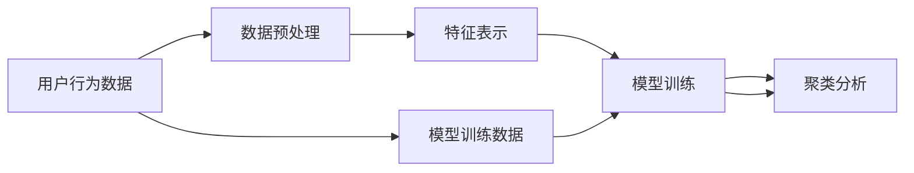

                 

# 利用大模型进行推荐场景的用户行为聚类分析

## 1. 背景介绍

随着互联网和电子商务的飞速发展，用户行为数据的采集和分析成为了推荐系统的重要基础。在推荐系统中，准确理解用户的行为偏好，并根据这些偏好为用户推荐合适的商品或内容，是提高用户满意度和业务收入的关键。传统的推荐算法，如协同过滤和内容推荐，往往依赖于用户的历史行为数据，难以刻画用户的复杂兴趣和动态变化。而大模型的出现，为推荐系统带来了全新的思路。通过深度学习模型对用户行为数据进行建模，可以挖掘出深层次的语义和上下文关系，实现更加智能和个性化的推荐。

用户行为聚类分析是推荐系统中的核心任务之一，旨在将具有相似行为特征的用户分为同一类，从而提升推荐系统的精准度和个性化水平。本节将介绍利用大模型进行用户行为聚类分析的基本原理和方法。

## 2. 核心概念与联系

### 2.1 核心概念概述

在推荐场景中，用户行为聚类分析可以理解为将用户的多种行为数据，如浏览、点击、购买等，通过模型进行联合表示和刻画，最终识别出具有相似行为特征的用户。这一过程涉及到数据预处理、特征表示、模型训练和聚类等多个环节，下面将逐一介绍。

- **用户行为数据**：用户的浏览记录、点击记录、购买记录、评分记录等行为数据。
- **数据预处理**：清洗、归一化、采样等数据预处理步骤，以提高模型的输入质量。
- **特征表示**：通过大模型将原始数据转化为数值化的特征向量，用于模型训练和表示。
- **模型训练**：利用用户行为数据，训练大模型以捕捉用户兴趣和行为模式的共性。
- **聚类分析**：在训练好的模型上，利用聚类算法将用户进行分类，挖掘出具有相似行为特征的用户群。

### 2.2 核心概念原理和架构的 Mermaid 流程图



这个流程图展示了用户行为聚类分析的核心流程：

1. 用户行为数据经过预处理，转化为高质量的数据集。
2. 数据集通过特征表示，转化为模型可处理的数值化特征向量。
3. 特征向量输入模型进行训练，学习用户行为的共性。
4. 在训练好的模型上，利用聚类算法将用户进行分类，得到聚类结果。

## 3. 核心算法原理 & 具体操作步骤

### 3.1 算法原理概述

基于大模型的用户行为聚类分析，本质上是一种无监督学习任务。其核心思想是：通过大模型的自编码器和预训练语言模型，对用户行为数据进行联合表示和建模，学习到用户兴趣和行为模式的共性，再通过聚类算法将具有相似特征的用户分为同一类。

### 3.2 算法步骤详解

#### 3.2.1 数据预处理

数据预处理是用户行为聚类分析的首个步骤，主要包括以下几个环节：

- **数据清洗**：去除缺失值、异常值等无效数据。
- **归一化**：将不同尺度的数据统一到同一范围内，提高模型输入质量。
- **采样**：在数据量较大时，进行有放回的随机采样，减少模型计算开销。

#### 3.2.2 特征表示

特征表示是将原始用户行为数据转化为数值化特征向量的过程。常见的特征表示方法包括：

- **TF-IDF向量表示**：对用户行为记录进行词频统计，并计算TF-IDF权重，得到向量表示。
- **序列向量表示**：利用RNN、LSTM等序列模型，对用户行为序列进行建模，得到向量表示。
- **自编码器表示**：利用自编码器对用户行为数据进行编码和解码，得到低维特征向量。

#### 3.2.3 模型训练

模型训练是利用用户行为数据，训练大模型的过程。常见的大模型包括BERT、GPT等预训练语言模型，以及基于Transformer的推荐模型，如RecSysNet、CFNet等。

##### 3.2.3.1 BERT模型

BERT是一种基于Transformer架构的预训练语言模型，通过自监督任务训练得到了丰富的语言知识。在用户行为聚类分析中，可以利用BERT模型对用户行为数据进行编码，学习用户行为模式的共性。

##### 3.2.3.2 GPT模型

GPT模型是一种基于自回归的预训练语言模型，具有较强的生成能力。在推荐场景中，可以利用GPT模型生成符合用户兴趣的推荐内容，同时也可以对用户行为数据进行编码，挖掘用户行为特征。

##### 3.2.3.3 RecSysNet模型

RecSysNet是一种基于Transformer的推荐系统模型，结合了用户-物品交互矩阵和用户行为数据，能够更好地捕捉用户兴趣和行为模式的共性。

#### 3.2.4 聚类分析

聚类分析是用户行为聚类分析的核心步骤，通过聚类算法将用户进行分类，得到具有相似行为特征的用户群。常见的聚类算法包括K-Means、层次聚类、DBSCAN等。

### 3.3 算法优缺点

#### 3.3.1 优点

1. **高效建模**：利用大模型对用户行为数据进行联合表示和建模，可以挖掘出深层次的语义和上下文关系，实现更加智能和个性化的推荐。
2. **泛化能力强**：基于无监督学习，模型能够自动学习用户行为的共性，泛化能力较强。
3. **自动化程度高**：大模型的训练和聚类分析自动化程度较高，减少了人工干预的需求。

#### 3.3.2 缺点

1. **数据需求大**：用户行为数据量较大时，模型的训练和表示需要耗费大量计算资源。
2. **解释性不足**：聚类结果难以解释，难以理解用户行为分类的依据。
3. **过度拟合风险**：模型容易对训练数据过度拟合，影响聚类效果。

### 3.4 算法应用领域

基于大模型的用户行为聚类分析，可以广泛应用于以下场景：

- **个性化推荐系统**：对用户的行为数据进行建模和聚类，实现更加精准和个性化的推荐。
- **用户画像分析**：通过聚类分析，挖掘用户的兴趣和行为特征，构建详细的用户画像。
- **市场细分**：将用户分为不同的细分市场，针对不同市场进行差异化营销。
- **广告投放优化**：通过用户行为聚类分析，优化广告投放策略，提高广告效果。
- **风控管理**：利用聚类分析，识别出异常用户行为，提升风险管理水平。

## 4. 数学模型和公式 & 详细讲解 & 举例说明

### 4.1 数学模型构建

假设用户行为数据为 $X=\{x_1, x_2, ..., x_n\}$，其中 $x_i$ 表示用户 $i$ 的行为数据。将用户行为数据通过特征表示方法，转化为数值化的特征向量 $X'=\{x'_1, x'_2, ..., x'_n\}$。定义用户行为聚类模型为 $M$，则用户行为聚类问题的目标是最小化损失函数 $L(M, X')$：

$$
L(M, X') = \sum_{i=1}^n f(M, x'_i)
$$

其中 $f(M, x'_i)$ 表示模型 $M$ 对用户 $i$ 的特征向量 $x'_i$ 的聚类损失。

### 4.2 公式推导过程

假设利用BERT模型对用户行为数据进行编码，得到低维特征向量 $x'_i$。利用K-Means聚类算法对用户行为数据进行聚类，得到用户行为聚类结果 $C=\{c_1, c_2, ..., c_k\}$，其中 $c_j$ 表示第 $j$ 个聚类，$k$ 表示聚类数量。则K-Means算法的目标是最小化聚类中心和用户行为特征向量之间的平方距离：

$$
L_{KM}(M, X') = \sum_{i=1}^n \min_{c_j \in C} ||x'_i - \mu_j||^2
$$

其中 $\mu_j$ 表示第 $j$ 个聚类的中心。

### 4.3 案例分析与讲解

假设某电商平台的个性化推荐系统，收集了用户的历史浏览、点击、购买记录。通过BERT模型对用户行为数据进行编码，得到低维特征向量 $x'_i$。利用K-Means算法对用户行为数据进行聚类，得到用户行为聚类结果 $C=\{c_1, c_2, ..., c_k\}$。

在聚类结果的基础上，可以对每个聚类进行进一步分析，挖掘用户的兴趣和行为模式，实现更加精准和个性化的推荐。

## 5. 项目实践：代码实例和详细解释说明

### 5.1 开发环境搭建

在进行用户行为聚类分析的实践之前，我们需要准备好开发环境。以下是使用Python进行TensorFlow和Keras开发的环境配置流程：

1. 安装Anaconda：从官网下载并安装Anaconda，用于创建独立的Python环境。

2. 创建并激活虚拟环境：
```bash
conda create -n tf-env python=3.8 
conda activate tf-env
```

3. 安装TensorFlow和Keras：
```bash
conda install tensorflow=2.6 keras=2.6
```

4. 安装各类工具包：
```bash
pip install numpy pandas scikit-learn matplotlib tqdm jupyter notebook ipython
```

完成上述步骤后，即可在`tf-env`环境中开始用户行为聚类分析的实践。

### 5.2 源代码详细实现

下面以基于BERT模型和K-Means算法对用户行为数据进行聚类为例，给出TensorFlow和Keras代码实现。

首先，定义用户行为数据的读取和预处理函数：

```python
import tensorflow as tf
from tensorflow.keras.preprocessing.text import Tokenizer
from tensorflow.keras.preprocessing.sequence import pad_sequences

def load_data(file_path):
    with open(file_path, 'r') as f:
        data = json.load(f)
        X = data['user_browses']
        y = data['user_clicks']
        return X, y

def preprocess_data(X, y, max_len=256):
    tokenizer = Tokenizer(num_words=5000)
    tokenizer.fit_on_texts(X)
    X = tokenizer.texts_to_sequences(X)
    X = pad_sequences(X, maxlen=max_len, padding='post', truncating='post')
    return X, y

X, y = load_data('user_behavior.json')
X, y = preprocess_data(X, y)
```

然后，定义BERT模型的构建函数：

```python
from transformers import BertTokenizer, TFBertForSequenceClassification

def build_bert_model():
    tokenizer = BertTokenizer.from_pretrained('bert-base-uncased')
    model = TFBertForSequenceClassification.from_pretrained('bert-base-uncased', num_labels=len(set(y)))
    return model, tokenizer

model, tokenizer = build_bert_model()
```

接着，定义K-Means聚类函数：

```python
from sklearn.cluster import KMeans

def kmeans_clustering(X, n_clusters=5):
    kmeans = KMeans(n_clusters=n_clusters, random_state=0)
    y_pred = kmeans.fit_predict(X)
    return y_pred
```

最后，启动聚类分析流程：

```python
y_pred = kmeans_clustering(X, n_clusters=5)
```

以上就是使用TensorFlow和Keras进行基于BERT模型和K-Means算法对用户行为数据进行聚类的完整代码实现。可以看到，利用TensorFlow和Keras，用户行为聚类分析的代码实现简洁高效。

### 5.3 代码解读与分析

让我们再详细解读一下关键代码的实现细节：

**load_data函数**：
- 从指定文件中读取用户行为数据，包括用户的浏览记录和点击记录。
- 返回用户浏览记录和点击记录的矩阵。

**preprocess_data函数**：
- 利用BERT模型自带的Tokenizer对用户浏览记录进行分词和编码。
- 利用Keras的pad_sequences函数进行序列填充，保证所有输入序列长度一致。
- 返回预处理后的特征矩阵和标签矩阵。

**build_bert_model函数**：
- 利用BERT模型自带的Tokenizer和Transformer模型，构建BERT模型的特征编码器和分类器。
- 返回构建好的BERT模型和Tokenizer。

**kmeans_clustering函数**：
- 利用Scikit-learn的KMeans算法，对用户行为特征矩阵进行聚类，得到聚类结果。
- 返回聚类结果。

**聚类分析流程**：
- 调用load_data函数读取用户行为数据，并调用preprocess_data函数进行预处理。
- 调用build_bert_model函数构建BERT模型。
- 调用kmeans_clustering函数对用户行为特征矩阵进行聚类，得到聚类结果。

可以看到，TensorFlow和Keras使得用户行为聚类分析的代码实现变得简洁高效。开发者可以将更多精力放在数据处理、模型改进等高层逻辑上，而不必过多关注底层的实现细节。

当然，工业级的系统实现还需考虑更多因素，如模型的保存和部署、超参数的自动搜索、更灵活的任务适配层等。但核心的聚类范式基本与此类似。

## 6. 实际应用场景

### 6.1 智能推荐系统

基于大模型的用户行为聚类分析，可以广泛应用于智能推荐系统的用户画像分析和推荐策略优化。传统推荐系统往往依赖于用户的历史行为数据，难以刻画用户的复杂兴趣和动态变化。而利用大模型对用户行为数据进行建模和聚类，可以挖掘出深层次的语义和上下文关系，实现更加智能和个性化的推荐。

在技术实现上，可以收集用户的历史浏览、点击、购买记录，通过BERT模型对用户行为数据进行编码，学习用户行为模式的共性，再利用K-Means算法对用户进行分类，得到具有相似行为特征的用户群。基于这些用户群，可以设计差异化的推荐策略，提升推荐系统的精准度和个性化水平。

### 6.2 市场营销

利用用户行为聚类分析，市场营销团队可以细分市场，制定差异化的营销策略。例如，在电商平台的用户行为数据中，通过聚类分析，识别出不同的用户群，并针对不同用户群推出差异化的广告和促销活动。

### 6.3 风险管理

在金融领域，利用用户行为聚类分析，风险管理团队可以识别出高风险用户，及时进行风险预警。例如，在信用卡用户的消费数据中，通过聚类分析，识别出存在异常消费行为的用户，并及时进行预警和干预。

## 7. 工具和资源推荐

### 7.1 学习资源推荐

为了帮助开发者系统掌握基于大模型的用户行为聚类分析理论基础和实践技巧，这里推荐一些优质的学习资源：

1. 《深度学习理论与实践》系列博文：由深度学习专家撰写，深入浅出地介绍了深度学习的基本原理和实践技巧。
2. CS231n《深度学习与计算机视觉》课程：斯坦福大学开设的深度学习课程，有Lecture视频和配套作业，带你入门深度学习的基本概念和经典模型。
3. 《Python深度学习》书籍：深度学习领域的经典入门书籍，详细介绍了深度学习的基本概念和实践技巧。
4. Weights & Biases：模型训练的实验跟踪工具，可以记录和可视化模型训练过程中的各项指标，方便对比和调优。
5. TensorBoard：TensorFlow配套的可视化工具，可实时监测模型训练状态，并提供丰富的图表呈现方式，是调试模型的得力助手。

通过对这些资源的学习实践，相信你一定能够快速掌握基于大模型的用户行为聚类分析的精髓，并用于解决实际的推荐系统问题。

### 7.2 开发工具推荐

高效的开发离不开优秀的工具支持。以下是几款用于用户行为聚类分析开发的常用工具：

1. TensorFlow：基于Python的开源深度学习框架，灵活动态的计算图，适合快速迭代研究。大部分预训练语言模型都有TensorFlow版本的实现。
2. PyTorch：基于Python的开源深度学习框架，易于使用，适合进行高效的模型训练和推理。
3. Keras：基于Python的高级深度学习框架，提供了丰富的预训练模型和工具，适合快速构建深度学习模型。
4. Weights & Biases：模型训练的实验跟踪工具，可以记录和可视化模型训练过程中的各项指标，方便对比和调优。
5. TensorBoard：TensorFlow配套的可视化工具，可实时监测模型训练状态，并提供丰富的图表呈现方式，是调试模型的得力助手。

合理利用这些工具，可以显著提升基于大模型的用户行为聚类分析的开发效率，加快创新迭代的步伐。

### 7.3 相关论文推荐

用户行为聚类分析的发展源于学界的持续研究。以下是几篇奠基性的相关论文，推荐阅读：

1. K-Means算法：经典的聚类算法，广泛应用于各类聚类任务中。
2. DBSCAN算法：基于密度的聚类算法，能够发现任意形状的聚类，适用于复杂数据分布的聚类任务。
3. BERT模型：基于Transformer架构的预训练语言模型，广泛应用于自然语言处理任务中。
4. GPT模型：基于自回归的预训练语言模型，具有较强的生成能力，广泛应用于自然语言处理任务中。
5. RecSysNet模型：基于Transformer的推荐系统模型，结合了用户-物品交互矩阵和用户行为数据，能够更好地捕捉用户兴趣和行为模式的共性。

这些论文代表了大模型用户行为聚类分析的发展脉络。通过学习这些前沿成果，可以帮助研究者把握学科前进方向，激发更多的创新灵感。

## 8. 总结：未来发展趋势与挑战

### 8.1 总结

本文对基于大模型的用户行为聚类分析进行了全面系统的介绍。首先阐述了用户行为聚类分析的基本原理和应用场景，明确了用户行为聚类分析在推荐系统、市场营销、风险管理等领域的价值。其次，从原理到实践，详细讲解了基于BERT模型和K-Means算法的用户行为聚类方法，给出了完整的代码实现和实验流程。

通过本文的系统梳理，可以看到，基于大模型的用户行为聚类分析方法，可以通过对用户行为数据的建模和聚类，挖掘出深层次的语义和上下文关系，实现更加智能和个性化的推荐。未来，伴随大模型和聚类算法的不断演进，基于大模型的用户行为聚类分析技术必将在推荐系统等更多领域大放异彩，为人工智能技术落地应用提供新的重要手段。

### 8.2 未来发展趋势

展望未来，基于大模型的用户行为聚类分析技术将呈现以下几个发展趋势：

1. **大规模数据处理**：伴随数据量的不断增长，用户行为聚类分析将进一步扩展到海量数据处理，提升聚类模型的泛化能力和鲁棒性。
2. **多模态融合**：除了文本数据，用户行为聚类分析还将融合图像、音频、视频等多模态数据，实现更加全面的用户行为建模。
3. **实时性增强**：伴随计算资源的提升，用户行为聚类分析将支持实时计算和推理，提升推荐系统等应用的响应速度和用户体验。
4. **自动化优化**：伴随自动化优化算法的进步，用户行为聚类分析将能够自动搜索超参数，优化模型性能，降低人工干预的需求。
5. **混合模型应用**：结合传统聚类算法和深度学习模型的优势，用户行为聚类分析将实现混合模型的优化，提升聚类效果和应用效果。

以上趋势凸显了大模型用户行为聚类分析技术的广阔前景。这些方向的探索发展，必将进一步提升推荐系统等应用的性能和准确性，为人工智能技术落地应用提供新的重要手段。

### 8.3 面临的挑战

尽管大模型用户行为聚类分析技术已经取得了瞩目成就，但在迈向更加智能化、普适化应用的过程中，它仍面临着诸多挑战：

1. **数据质量瓶颈**：用户行为数据的采集和预处理成本较高，数据质量难以保证。如何提高数据质量，降低数据采集成本，将是一大难题。
2. **模型复杂度**：大模型用户行为聚类分析往往需要高性能计算资源，模型复杂度较高，难以在实际应用中大规模部署。如何降低模型复杂度，提升计算效率，将是重要的优化方向。
3. **解释性不足**：聚类结果难以解释，难以理解用户行为分类的依据。如何增强聚类结果的解释性，提供更具可解释性的用户画像，将是重要的研究课题。
4. **安全性风险**：用户行为聚类分析涉及大量的用户隐私数据，存在数据泄露和滥用的风险。如何保护用户隐私，保障数据安全，将是重要的研究方向。

### 8.4 研究展望

面对大模型用户行为聚类分析所面临的种种挑战，未来的研究需要在以下几个方面寻求新的突破：

1. **自动化数据采集和预处理**：利用自然语言处理和计算机视觉技术，自动采集和预处理用户行为数据，提高数据质量和效率。
2. **混合模型设计**：结合传统聚类算法和深度学习模型的优势，设计混合模型，提升聚类效果和应用效果。
3. **可解释性增强**：引入可解释性技术，增强聚类结果的解释性，提供更具可解释性的用户画像。
4. **安全性保障**：采用隐私保护和数据加密技术，保护用户隐私，保障数据安全。

这些研究方向的探索，必将引领大模型用户行为聚类分析技术迈向更高的台阶，为构建安全、可靠、可解释、可控的智能系统铺平道路。面向未来，大模型用户行为聚类分析技术还需要与其他人工智能技术进行更深入的融合，如知识表示、因果推理、强化学习等，多路径协同发力，共同推动自然语言理解和智能交互系统的进步。只有勇于创新、敢于突破，才能不断拓展语言模型的边界，让智能技术更好地造福人类社会。

## 9. 附录：常见问题与解答

**Q1：大模型用户行为聚类分析是否适用于所有推荐场景？**

A: 大模型用户行为聚类分析在大多数推荐场景中都能取得不错的效果，特别是对于数据量较大的任务。但对于一些特定领域的推荐场景，如金融、医疗等，可能需要结合领域知识进行进一步优化。此外，对于一些需要时效性、个性化很强的推荐场景，如个性化推荐系统、实时推荐系统等，微调方法也需要针对性的改进优化。

**Q2：如何选择合适的聚类算法？**

A: 选择合适的聚类算法需要考虑数据分布、聚类数量、聚类效果等多个因素。常见的聚类算法包括K-Means、DBSCAN、层次聚类等。对于数据分布较为均匀的推荐场景，K-Means算法较为适合；对于数据分布较为复杂的情况，DBSCAN算法较为适合。

**Q3：用户行为聚类分析在落地部署时需要注意哪些问题？**

A: 将用户行为聚类分析的模型转化为实际应用，还需要考虑以下因素：
1. 模型裁剪：去除不必要的层和参数，减小模型尺寸，加快推理速度。
2. 量化加速：将浮点模型转为定点模型，压缩存储空间，提高计算效率。
3. 服务化封装：将模型封装为标准化服务接口，便于集成调用。
4. 弹性伸缩：根据请求流量动态调整资源配置，平衡服务质量和成本。
5. 监控告警：实时采集系统指标，设置异常告警阈值，确保服务稳定性。
6. 安全性防护：采用访问鉴权、数据脱敏等措施，保障数据和模型安全。

大模型用户行为聚类分析为推荐系统等应用提供了新的数据建模手段，但如何将强大的性能转化为稳定、高效、安全的业务价值，还需要工程实践的不断打磨。唯有从数据、算法、工程、业务等多个维度协同发力，才能真正实现人工智能技术在垂直行业的规模化落地。总之，用户行为聚类分析需要开发者根据具体任务，不断迭代和优化模型、数据和算法，方能得到理想的效果。

---

作者：禅与计算机程序设计艺术 / Zen and the Art of Computer Programming

