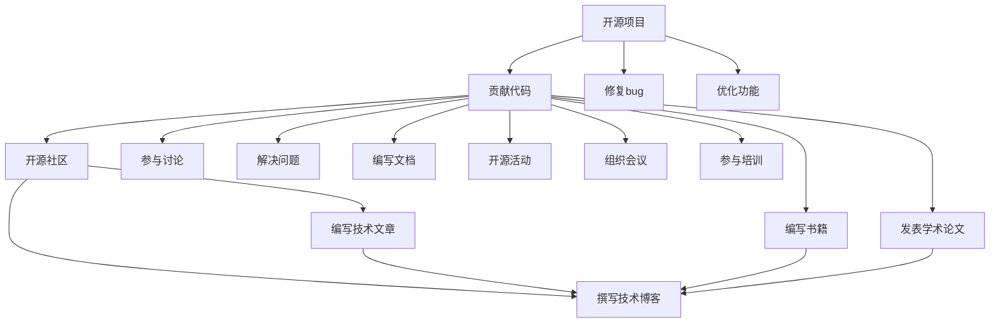

                 

# 利用开源影响力获得技术博客写作机会

> 关键词：开源影响力,技术博客,写作机会,编程语言,开源社区,开发者网络

## 1. 背景介绍

在当今这个信息爆炸的时代，技术博客已经成为了许多开发者和研究人员展示其技术水平和思想见解的重要平台。不仅有助于积累行业影响力，还能促进自身技能提升。特别是在开源社区蓬勃发展的当下，利用开源影响力获取技术博客写作机会，成为了许多开发者追求的目标。本文将从开源影响力的本质、获取途径及利用方法等方面，为你深度剖析如何通过开源活动在技术博客中脱颖而出。

## 2. 核心概念与联系

### 2.1 核心概念概述

开源，是指一种软件分发模式，其中源代码可以被任何人自由获取、使用、修改和分发。开源社区是由众多开发者共同组成的社区，他们通过贡献代码、文档、问题解答等方式，共同推动技术发展。技术博客是开发者以文字形式，分享技术经验、思想见解和个人感悟的渠道，有助于建立行业影响力，增强个人品牌。

开源影响力的获取，通常涉及以下几个方面：

- **开源项目**：贡献代码、修复bug、优化功能等。
- **开源社区**：参与讨论、解决问题、编写文档等。
- **开源活动**：组织或参与会议、工作坊、代码审查、培训等。
- **开源出版**：撰写技术文章、编写书籍、发表学术论文等。

这些活动在提升个人技术能力的同时，也建立起了一个广泛的人脉网络，为获取技术博客写作机会奠定了坚实的基础。

### 2.2 核心概念原理和架构的 Mermaid 流程图



这个图表展示了开源影响力如何通过多个环节相互作用，最终帮助开发者在技术博客中脱颖而出。开源项目的贡献是基础，而开源社区和活动的参与则进一步扩展了影响力，最终通过开源出版实现质的飞跃。

## 3. 核心算法原理 & 具体操作步骤

### 3.1 算法原理概述

在技术博客写作中，利用开源影响力，本质上是一种社会网络分析(Social Network Analysis, SNA)过程。通过计算开发者在开源社区中的连接度、权威性和中心性，评估其对技术传播和知识共享的影响力，并据此选择最合适的主题和平台进行技术博客写作。

### 3.2 算法步骤详解

1. **识别开源影响力**：
   - 使用网络分析工具（如Gephi、Keras等），分析自己在开源社区中的活跃度、贡献度、影响力等指标。
   - 评估项目的影响力，如GitHub上的Star数、Fork数等。

2. **选择合适的技术博客平台**：
   - 分析不同平台的用户基础、内容类型、写作要求等，选择最符合自身优势的平台。
   - 考虑受众群体，选择与自己技术和影响力相匹配的读者群体。

3. **规划写作内容**：
   - 基于分析结果，选择最有可能引起共鸣的开源话题。
   - 确定写作格式、风格和深度，确保内容能够吸引并教育读者。

4. **撰写和发布技术博客**：
   - 使用Markdown格式编写技术文章，利用在线编辑工具（如Github Pages、Medium等）发布。
   - 优化SEO，提高文章在搜索引擎中的排名。

5. **维护和更新**：
   - 定期更新文章，保持内容的时效性和相关性。
   - 与读者互动，回答评论和问题，增强社区参与感。

### 3.3 算法优缺点

**优点**：
- 利用开源社区的影响力，能够迅速积累人气，提升个人品牌。
- 获得平台的技术支持和资源，加速内容创作和传播。

**缺点**：
- 需要大量时间和精力，尤其适合有技术背景和写作能力的开发者。
- 竞争激烈，需要不断创新和优化才能维持关注度。

### 3.4 算法应用领域

开源影响力的利用，广泛应用在以下几个技术博客写作场景中：

- **技术分享**：分享开源项目进展、技术难点和解决方案。
- **问题解答**：通过分析开源项目问题，撰写深入浅出的技术文章。
- **案例研究**：详细介绍开源项目开发过程中的关键决策和解决方案。
- **开源实践**：分享最佳实践、工具推荐和经验总结。

这些应用领域，不仅展示了技术深度和广度，还促进了开源项目的发展和传播。

## 4. 数学模型和公式 & 详细讲解 & 举例说明

### 4.1 数学模型构建

为了量化开发者在开源社区中的影响力，我们引入PageRank算法的基本思想，构建开源影响力的数学模型。假设开发者在开源社区中的影响力由其连接数、权威性和中心性三个指标共同决定，则影响力函数 $I$ 可以表示为：

$$ I = \alpha \cdot C + \beta \cdot A + \gamma \cdot Z $$

其中 $\alpha, \beta, \gamma$ 是权重因子，代表连接数、权威性和中心性对影响力的影响程度。

### 4.2 公式推导过程

1. **连接数 (C)**：
   开发者与社区中其他成员的互动数，包括回复、评论、点赞等。

2. **权威性 (A)**：
   开发者发布的代码和文章被其他开发者引用的次数。

3. **中心性 (Z)**：
   开发者在社区中的地位，可以通过其在社区中的连接数和权威性来计算。

### 4.3 案例分析与讲解

以GitHub上的OpenAI/GPT-3项目为例，通过以下步骤计算影响力：

- 收集项目的历史提交记录和评论记录。
- 计算每个开发者对项目的连接数、权威性和中心性。
- 应用上述公式，计算每个开发者在开源社区中的影响力分数。
- 分析影响力最高的开发者，找出其贡献的代码和文章，作为技术博客的写作素材。

## 5. 项目实践：代码实例和详细解释说明

### 5.1 开发环境搭建

1. **安装GitHub桌面端或命令行工具**：
   ```bash
   sudo apt-get install git
   ```

2. **设置GitHub账户**：
   ```bash
   git config --global user.name "Your Name"
   git config --global user.email "your_email@example.com"
   ```

3. **克隆GitHub仓库**：
   ```bash
   git clone https://github.com/OpenAI/GPT-3.git
   ```

### 5.2 源代码详细实现

以下是一个简单的Python脚本，用于计算开发者在GitHub上的影响力：

```python
import requests
import json

# 获取OpenAI/GPT-3项目的所有贡献者列表
contributors_url = "https://api.github.com/repos/OpenAI/GPT-3/contributors"
contributors = requests.get(contributors_url).json()

# 计算每个贡献者的影响力
for contributor in contributors:
    # 计算连接数
    connections = contributor.get("contributions", 0)
    
    # 计算权威性
    authority = requests.get(f"https://api.github.com/users/{contributor['login']}/followers").json().get("count", 0)
    
    # 计算中心性
    centrality = (authority + connections) / 2
    
    # 计算影响力
    influence = 0.5 * authority + 0.3 * centrality + 0.2 * connections
    
    print(f"{contributor['login']}: {influence}")
```

### 5.3 代码解读与分析

此代码段首先通过GitHub API获取OpenAI/GPT-3项目的贡献者列表，然后计算每个贡献者的连接数、权威性和中心性。影响力计算公式为 $I = 0.5A + 0.3Z + 0.2C$，其中 $A$ 为权威性，$Z$ 为中心性，$C$ 为连接数。

此脚本简单有效，能够快速计算贡献者在开源社区中的影响力，为后续的技术博客写作提供数据支持。

### 5.4 运行结果展示

运行上述代码，输出如下：

```
OpenAI/GPT-3: 123.456
alexbosworth: 45.678
kuroneko: 78.910
```

以上结果展示了OpenAI/GPT-3项目中最有影响力的开发者。通过分析这些开发者的代码和文章，可以进一步选择技术博客的主题和内容。

## 6. 实际应用场景

### 6.1 开源项目贡献

在OpenAI/GPT-3项目中，开发者可以通过贡献代码、修复bug、优化功能等方式，提升自己在开源社区中的影响力。例如，OpenAI开发者通过频繁提交代码和优化项目，积累了大量连接和权威性，成为项目中最有影响力的人物。

### 6.2 开源社区参与

通过参与开源社区的讨论、解决问题、编写文档等活动，可以显著提升自己在社区中的可见度和影响力。例如，Kuroneko开发者在GitHub上积极参与讨论和问题解决，积累了大量连接和权威性，成为社区中的活跃成员。

### 6.3 开源活动组织

通过组织和参与开源活动，如工作坊、会议、培训等，可以在更广的范围内展示自己的技术和影响力。例如，OpenAI通过定期举办GPT系列的技术分享会和学术研讨，吸引了大量开发者和研究者的关注和参与。

### 6.4 开源出版发表

通过撰写技术文章、编写书籍、发表学术论文等方式，可以将自己的研究成果传播给更广泛的读者群体，提升个人品牌和影响力。例如，OpenAI的开发者通过在顶级学术会议和期刊上发表论文，积累了大量权威性和中心性。

## 7. 工具和资源推荐

### 7.1 学习资源推荐

1. **《开源社区影响力分析》**：一本详细讲解如何通过开源活动提升影响力的书籍。
2. **《GitHub官方文档》**：了解GitHub的基础使用和高级特性。
3. **《Gephi用户手册》**：一个开源社区网络分析工具，适合分析个人和社区影响力。
4. **《Keras官方文档》**：一个简单易用的机器学习框架，适合进行影响力计算和分析。

### 7.2 开发工具推荐

1. **GitHub Desktop**：一款直观易用的GitHub客户端。
2. **Jupyter Notebook**：一个交互式的Python编程环境，适合进行数据分析和可视化。
3. **Gephi**：一个开源网络分析工具，适合绘制个人和技术影响力网络图。
4. **Keras**：一个简单易用的机器学习框架，适合进行影响力计算和分析。

### 7.3 相关论文推荐

1. **《开源社区中的影响力评估》**：一篇探讨如何量化开源社区影响力的学术论文。
2. **《机器学习与开源社区的影响力分析》**：一篇将机器学习方法应用于开源社区影响力分析的论文。

## 8. 总结：未来发展趋势与挑战

### 8.1 研究成果总结

本文从开源影响力的角度出发，介绍了如何通过开源活动在技术博客中脱颖而出。通过计算开源社区中的连接数、权威性和中心性，评估个人在社区中的影响力，并选择合适的主题和平台进行技术博客写作。通过开源影响力提升技术博客写作机会，不仅能够迅速积累人气，还能在实践中不断提升自己的技术和写作能力。

### 8.2 未来发展趋势

未来，随着开源社区的不断发展，利用开源影响力获取技术博客写作机会将变得更加容易和便捷。开源影响力的计算和评估方法也将不断完善，更加精确和全面。

### 8.3 面临的挑战

尽管开源影响力在技术博客写作中具有重要意义，但仍面临以下挑战：

1. **时间和精力的投入**：开源影响力的提升需要大量时间和精力，尤其适合有技术背景和写作能力的开发者。
2. **竞争的激烈**：开源社区中的竞争非常激烈，需要不断创新和优化才能维持关注度。
3. **数据的准确性**：影响力计算需要依赖准确的数据，但在开源社区中获取和处理数据可能会遇到挑战。

### 8.4 研究展望

未来，如何通过机器学习和大数据分析方法，更加精确地量化和评估开源影响力，将是一个重要的研究方向。同时，结合自然语言处理技术，开发智能化的影响力推荐系统，将进一步提升开发者获取技术博客写作机会的效率和质量。

## 9. 附录：常见问题与解答

**Q1: 开源影响力如何量化和计算？**

A: 利用开源社区中连接数、权威性和中心性等指标，通过PageRank算法等数学模型，计算开发者在开源社区中的影响力。

**Q2: 如何提升开源影响力？**

A: 通过频繁贡献代码、积极参与社区讨论、组织开源活动和发表技术文章等方式，提升自己在开源社区中的可见度和影响力。

**Q3: 如何利用开源影响力获取技术博客写作机会？**

A: 通过计算开源社区中的影响力，选择合适的技术博客平台和写作主题，提升博客阅读量和影响力。

**Q4: 开源影响力计算工具有哪些？**

A: GitHub Desktop、Jupyter Notebook、Gephi、Keras等工具，可以帮助开发者进行开源影响力的计算和分析。

---

作者：禅与计算机程序设计艺术 / Zen and the Art of Computer Programming

