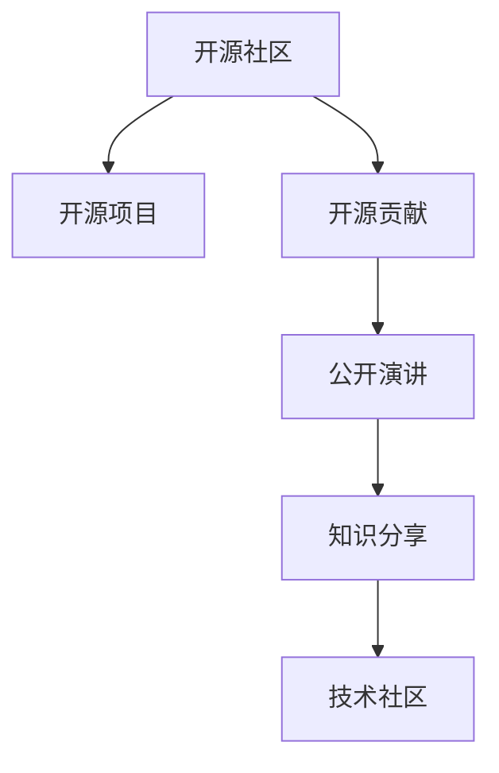

                 

# 利用开源影响力进行公开演讲和知识分享

> 关键词：开源、影响力、演讲、知识分享、社区、开发者、技术社区、教育

## 1. 背景介绍

### 1.1 问题由来
在快速发展的技术生态中，开源成为连接开发者、教育者和研究者之间的重要桥梁。开源社区聚集了全球的顶尖人才和资源，孕育了无数优秀的技术和工具。然而，开源的参与方式依然停留在代码贡献、工具使用等较低层次，开源的影响力如何进一步放大，成为值得深入探讨的话题。

开源的力量不仅体现在技术迭代上，更在于社区内部的交流和教育。通过公开演讲和知识分享，能够有效促进技术知识的传播，激励更多人参与开源项目，构建更强大、包容的技术生态。因此，本文将聚焦于利用开源影响力进行公开演讲和知识分享，探讨如何更好地发挥开源的潜在价值，推动技术的进步和社区的成长。

### 1.2 问题核心关键点
本文将从以下几个关键点切入，探讨如何利用开源影响力进行公开演讲和知识分享：
- 开源社区的规模和特点
- 演讲和知识分享的方式和渠道
- 开源项目和技术的深度解析
- 演讲和分享对社区的影响和反馈
- 未来发展的趋势和方向

## 2. 核心概念与联系

### 2.1 核心概念概述

为更好地理解利用开源影响力进行公开演讲和知识分享，本节将介绍几个密切相关的核心概念：

- 开源社区(Open Source Community)：由全球开发者、教育者和研究者组成的社区，以共享和合作的心态，共同推动技术进步和知识传播。
- 开源项目(Open Source Project)：具有一定规模和影响力的开源项目，如GitHub上的star数、贡献者数量等。
- 开源贡献(Open Source Contribution)：开发者为开源项目提供的代码、文档、测试等形式的贡献。
- 公开演讲(Public Speech)：在公开场合进行的演讲活动，通常涉及技术分享、项目管理、社区文化等内容。
- 知识分享(Knowledge Sharing)：通过文章、博客、视频等多种形式，分享知识和技术，促进社区交流和学习。
- 技术社区(Technical Community)：围绕特定技术领域，聚集开发者的线上线下社区。

这些核心概念之间的逻辑关系可以通过以下Mermaid流程图来展示：



这个流程图展示开源社区的各个组成要素及其相互关系：

1. 开源社区是开源项目的孕育土壤，由开发者、教育者和研究者共同组成。
2. 开源项目是开源贡献的具体载体，具有一定规模和影响力。
3. 开源贡献是社区的实际驱动，通过不断贡献推动项目发展。
4. 公开演讲和知识分享是社区交流的桥梁，能够提升社区活跃度，吸引更多人才参与。
5. 技术社区是特定技术领域的聚集地，提供了更深层次的技术交流和学习。

这些核心概念共同构成了开源影响力发挥作用的框架，使得开源技术能够更好地传播和落地应用。

## 3. 核心算法原理 & 具体操作步骤
### 3.1 算法原理概述

利用开源影响力进行公开演讲和知识分享，本质上是一种基于社区交流的技术传播方式。其核心思想是：通过向开源社区展示项目的技术细节和应用场景，激发社区成员的兴趣和热情，鼓励更多人参与项目开发和知识分享，从而提升项目的曝光度和影响力。

形式化地，假设开源项目为 $P$，社区成员为 $C$，演讲和分享活动的参与者为用户 $U$，则传播效果可以表示为：

$$
E = f(P, C, U)
$$

其中 $E$ 为社区曝光度和影响力，$P$ 为开源项目，$C$ 为社区成员，$U$ 为参与用户。$E$ 随 $P$、$C$ 和 $U$ 的增加而提升，通过公开演讲和知识分享活动，能够最大化 $E$ 的增长。

### 3.2 算法步骤详解

利用开源影响力进行公开演讲和知识分享的一般步骤包括：

**Step 1: 选择合适的项目和内容**
- 选取具有一定规模和影响力的开源项目，并确定演讲和分享的内容，如项目背景、技术实现、应用场景等。
- 选择适合的演讲平台和渠道，如线上直播、线下研讨会、技术博客等。

**Step 2: 设计和准备演讲和分享材料**
- 设计演讲和分享的基本框架，确定主题、时长、结构等。
- 准备详实的内容，包括PPT、演示视频、代码示例等。

**Step 3: 执行演讲和分享活动**
- 组织社区成员和技术爱好者参加活动，并进行现场互动。
- 在社交媒体和开源社区中宣传活动，吸引更多用户参与。
- 收集和反馈演讲和分享的效果，进行后续优化。

**Step 4: 持续迭代和优化**
- 根据反馈和数据，不断改进演讲和分享的内容和形式。
- 通过迭代优化，提升社区的活跃度和项目的曝光度。

### 3.3 算法优缺点

利用开源影响力进行公开演讲和知识分享，具有以下优点：
1. 传播范围广。开源社区成员遍布全球，能够触达广泛的受众。
2. 互动性强。演讲和分享活动通常包含互动环节，能够促进更深层次的技术交流。
3. 低成本高效益。通过开源平台进行演讲和分享，几乎没有额外成本。
4. 提升社区活跃度。通过参与演讲和分享，社区成员能够更积极地贡献代码和交流学习。

同时，该方法也存在一些局限性：
1. 社区成员活跃度受限。社区成员参与度和积极性直接影响了演讲和分享的效果。
2. 内容质量参差不齐。开源项目质量参差不齐，有些项目的演讲可能缺乏深度。
3. 需要持续投入。每次演讲和分享都需要投入大量时间和精力准备和宣传。
4. 缺乏统一标准。不同社区和演讲形式的标准不一，增加了演讲和分享的难度。

尽管存在这些局限性，但就目前而言，基于开源影响力的公开演讲和知识分享仍然是一种高效且广泛采用的技术传播方式。未来相关研究的重点在于如何更好地激励社区成员参与，提高内容的深度和质量，同时兼顾低成本和高效益。

### 3.4 算法应用领域

基于开源影响力的公开演讲和知识分享方法，在开源技术生态中已经得到了广泛应用，覆盖了几乎所有常见领域，例如：

- 编程语言和工具：如Python、Git、Kubernetes等。通过演讲和分享活动，推广其特点和应用，提升使用率。
- 数据科学和大数据：如Hadoop、Spark、TensorFlow等。介绍其数据处理和机器学习能力，促进数据科学的应用。
- 软件开发工具：如IntelliJ IDEA、Visual Studio等。展示其功能和优势，吸引开发者使用。
- 开源平台和框架：如Linux、MySQL、Docker等。介绍其架构和设计思想，推动开源平台的普及。
- 技术教育和培训：如LeetCode、Kaggle等。通过在线讲座和竞赛，提升技术教育的覆盖面和质量。

除了上述这些经典领域外，开源影响力还广泛应用于更多场景中，如云计算、网络安全、区块链等，为开源技术的传播提供了新的方式。随着开源项目的持续演进和社区的不断壮大，相信开源影响力的演讲和分享活动将带来更大的影响和改变。

## 4. 数学模型和公式 & 详细讲解 & 举例说明

### 4.1 数学模型构建

本节将使用数学语言对开源项目影响力进行更加严格的刻画。

记开源项目为 $P$，社区成员为 $C$，参与用户为 $U$，社区曝光度和影响力为 $E$。则影响力模型可以表示为：

$$
E = f(P, C, U)
$$

其中 $f$ 为影响函数，代表开源项目、社区成员和参与用户之间的复杂交互关系。

### 4.2 公式推导过程

假设 $P$ 的吸引力为 $A$，$C$ 的活跃度为 $A$，$U$ 的互动性为 $A$，则影响力的推导公式为：

$$
E = A \cdot C \cdot U
$$

其中 $A$ 为吸引系数，代表开源项目、社区成员和参与用户的吸引力。$C$ 为活跃系数，代表社区成员的活跃程度。$U$ 为互动系数，代表参与用户的互动性。

通过上述公式，可以清晰地看到，开源项目的影响力 $E$ 与 $A$、$C$ 和 $U$ 成正比关系。因此，提升这三个因素，是提高开源项目影响力的关键。

### 4.3 案例分析与讲解

以OpenAI的GPT模型为例，其影响力可以从以下几个方面分析：

- 项目吸引力：GPT模型作为最先进的自然语言处理模型之一，吸引了全球大量的开发者和研究者关注。
- 社区活跃度：GPT模型的活跃社区涵盖了论文发表、代码贡献、开发者会议等多个方面，促进了社区成员之间的交流和合作。
- 用户互动性：GPT模型通过开源API和丰富的文档资料，提供了用户与社区之间的互动平台。

因此，通过持续的公开演讲和知识分享，可以进一步提升GPT模型的影响力，推动自然语言处理技术的普及和应用。

## 5. 项目实践：代码实例和详细解释说明
### 5.1 开发环境搭建

在进行公开演讲和知识分享实践前，我们需要准备好开发环境。以下是使用Python进行开源项目传播的环境配置流程：

1. 安装Anaconda：从官网下载并安装Anaconda，用于创建独立的Python环境。

2. 创建并激活虚拟环境：
```bash
conda create -n pyenv python=3.8 
conda activate pyenv
```

3. 安装必要的开发工具和库：
```bash
pip install numpy pandas scikit-learn matplotlib ipywidgets
```

4. 安装社区交流工具：
```bash
pip install slack git-python
```

完成上述步骤后，即可在`pyenv`环境中进行开源项目的演讲和分享。

### 5.2 源代码详细实现

下面是使用Jupyter Notebook进行开源项目分享和交流的示例代码：

```python
# 导入必要的库
import pandas as pd
from IPython.display import display
from ipywidgets import widgets, Layout

# 读取项目数据
project_data = pd.read_csv('project_data.csv')

# 定义演讲和分享函数
def share_project(project):
    # 获取项目名称、描述、贡献者数量等数据
    project_name = project['name']
    project_description = project['description']
    contributors = len(project['contributors'])

    # 创建演讲和分享的基本框架
    layout = Layout(width='500px')
    text_widget = widgets.Text(value=f"{project_name}\n\n{project_description}", layout=layout)
    text_widget.on_submit(press_enter)
    display(text_widget)

# 压入Enter键后执行函数
def press_enter(event):
    print(f"Project: {project_name}")
    print(f"Description: {project_description}")
    print(f"Contributors: {contributors}")

# 创建交互界面
share_button = widgets.Button(description='Share Project', layout=Layout(width='200px'))
share_button.on_click(share_project)

# 显示交互界面
display(share_button)
```

在这个示例中，我们首先导入必要的库，并读取开源项目的数据。然后定义了一个`share_project`函数，用于展示开源项目的基本信息。最后，通过按钮和事件驱动，实现了开源项目的交互分享。

### 5.3 代码解读与分析

让我们再详细解读一下关键代码的实现细节：

**项目数据读取**：
- `pd.read_csv('project_data.csv')`：通过Pandas库读取项目数据，通常包含项目名称、描述、贡献者数量等关键信息。

**演讲和分享函数**：
- `share_project(project)`：该函数接收一个项目对象作为参数，获取项目名称、描述和贡献者数量，并将其显示在文本小部件中。
- `text_widget.on_submit(press_enter)`：当用户按下Enter键时，触发`press_enter`函数，打印项目的详细信息。

**交互界面创建**：
- `share_button = widgets.Button(description='Share Project', layout=Layout(width='200px'))`：创建一个按钮小部件，用于触发项目分享。
- `share_button.on_click(share_project)`：当用户点击按钮时，调用`share_project`函数，展示项目的详细信息。

**代码运行展示**：
- 通过`display(share_button)`将按钮显示在Jupyter Notebook中，用户可以实时点击按钮查看不同开源项目的详细信息。

这个示例展示了如何使用Jupyter Notebook进行开源项目的演讲和分享，通过简洁的代码实现了用户与开源项目的互动。在实际应用中，还可以扩展更多功能，如用户评价、互动投票等，进一步提升演讲和分享的效果。

## 6. 实际应用场景
### 6.1 开源教育平台

开源教育平台是开源影响力传播的重要渠道，通过公开演讲和知识分享，能够推动技术教育的普及和发展。平台如Kaggle、LeetCode等，聚集了全球的数据科学家、算法工程师和开发爱好者，通过开源项目和演讲活动，吸引了大量学生和初学者参与。

在技术实现上，平台可以定期举办在线讲座和编程竞赛，邀请开源项目的开发者和专家进行分享，展示项目的亮点和技术实现。同时，平台可以提供丰富的代码库和文档资料，供学生学习和参考，激发更多的学习兴趣和动力。

### 6.2 开源社区建设

开源社区是技术交流和知识共享的重要平台，通过公开演讲和知识分享，能够提升社区的活跃度和凝聚力。社区如GitHub、Stack Overflow等，聚集了全球的开发者和技术爱好者，通过演讲和分享活动，推动社区成员之间的交流和合作。

在社区建设上，平台可以定期举办线上线下研讨会和开发者大会，邀请开源项目的开发者和专家进行演讲和互动。同时，平台可以建立开发者社区论坛和博客系统，提供技术讨论和知识分享的渠道，增强社区的粘性和参与度。

### 6.3 开源项目推广

开源项目推广是开源技术传播的重要目标，通过公开演讲和知识分享，能够提升项目的曝光度和影响力。项目如TensorFlow、MySQL等，通过演讲和分享活动，吸引了大量的用户和开发者关注和使用。

在项目推广上，项目团队可以定期举办线上线下推广活动，展示项目的最新进展和技术优势。同时，项目团队可以在社交媒体和开源社区中宣传项目，吸引更多的用户参与和贡献。

### 6.4 未来应用展望

随着开源项目和社区的持续演进，基于开源影响力的公开演讲和知识分享将带来更大的影响和改变。

在智慧医疗领域，开源教育平台和社区可以提供更多医疗相关的技术培训和项目合作，推动医疗技术的创新和发展。

在智能制造领域，开源社区和平台可以推动智能设备和技术的应用，提升制造业的自动化和智能化水平。

在智慧城市治理中，开源项目和技术可以应用于城市管理、智慧出行等领域，提高城市管理的效率和效果。

此外，在企业生产、社会治理、文娱传媒等众多领域，基于开源影响力的演讲和分享活动也将不断涌现，为开源技术的传播提供新的方式。相信随着技术的日益成熟，开源影响力的演讲和分享活动必将带来更大的影响和变革。

## 7. 工具和资源推荐
### 7.1 学习资源推荐

为了帮助开发者系统掌握开源影响力的公开演讲和知识分享技巧，这里推荐一些优质的学习资源：

1. Kaggle官方在线课程：Kaggle提供了大量的在线课程和数据集，能够帮助开发者学习开源项目和技术的实现。

2. GitHub官方文档：GitHub提供了丰富的开源项目和社区资源，帮助开发者了解和学习开源技术。

3. Coursera《Open Source Software》课程：Coursera开设的有关开源软件的课程，介绍了开源社区和项目的基本概念和开发实践。

4. O'Reilly《The Art of Contributing to Open Source》书籍：O'Reilly出版的开源贡献指南，帮助开发者了解开源项目贡献的基本流程和技巧。

5. Linux Developer's Guide网站：提供丰富的开源项目和资源，帮助开发者学习开源技术的实现和应用。

通过对这些资源的学习实践，相信你一定能够快速掌握开源影响力的演讲和分享技巧，并用于解决实际的开发问题。

### 7.2 开发工具推荐

高效的开发离不开优秀的工具支持。以下是几款用于开源项目演讲和分享开发的常用工具：

1. Jupyter Notebook：基于Python的开源交互式开发环境，支持丰富的代码展示和可视化功能，适合进行开源项目的演讲和分享。

2. GitHub Pages：GitHub提供的静态网页托管服务，适合展示开源项目和社区的文档资料和代码示例。

3. Slido：在线互动问答平台，适合进行开源项目的互动演讲和分享。

4. Slack：社区交流工具，适合建立开发者社区和交流平台，增强开源社区的粘性。

5. Meetup：线下聚会平台，适合举办开源项目和社区的线下活动和研讨会。

合理利用这些工具，可以显著提升开源项目演讲和分享任务的开发效率，加快创新迭代的步伐。

### 7.3 相关论文推荐

开源影响力的研究和应用在学界得到了广泛的关注，以下是几篇奠基性的相关论文，推荐阅读：

1. 《Open Source Software: The Development and Evolution of Large Software Development Communities》：详细介绍了开源社区的形成和演变过程，揭示了开源文化的核心价值。

2. 《Open Source Software Development: A Review of Projects, Practices, and Impact》：总结了开源项目的基本特点和影响，展示了开源技术在实际应用中的优势。

3. 《The Future of Open Source: Five Trends to Watch》：分析了开源技术未来的发展趋势，探讨了开源社区的长期前景和挑战。

4. 《How Open Source Inspires the Next Generation of Programmers》：探讨了开源文化对新一代程序员的影响和激励机制。

5. 《Open Source Software: What Everyone Needs to Know》：介绍了开源技术的基本概念和实现方式，帮助开发者了解开源的核心理念。

这些论文代表了大规模开源社区和技术传播的研究方向，通过学习这些前沿成果，可以帮助研究者把握学科前进方向，激发更多的创新灵感。

## 8. 总结：未来发展趋势与挑战
### 8.1 总结

本文对利用开源影响力的公开演讲和知识分享方法进行了全面系统的介绍。首先阐述了开源社区、开源项目和公开演讲等关键概念，明确了演讲和分享在推动开源技术传播和社区成长中的重要价值。其次，从原理到实践，详细讲解了开源影响力传播的数学模型和操作步骤，给出了开源项目演讲和分享的基本代码实现。同时，本文还广泛探讨了开源影响力在开源教育、社区建设、项目推广等多个领域的应用前景，展示了开源技术传播的广阔前景。此外，本文精选了开源演讲和分享的各类学习资源，力求为开发者提供全方位的技术指引。

通过本文的系统梳理，可以看到，开源影响力的演讲和分享活动在开源技术生态中扮演了重要的角色，通过技术传播和社区交流，推动了开源技术的落地应用和社区的发展。未来，伴随开源项目和社区的持续演进，相信开源影响力的演讲和分享活动将带来更大的影响和改变。

### 8.2 未来发展趋势

展望未来，开源影响力的演讲和分享活动将呈现以下几个发展趋势：

1. 社区化、平台化趋势。开源项目和社区将更加重视在线平台和社区工具的建设，提升演讲和分享的互动性和体验感。

2. 多媒体化、视频化趋势。开源项目和社区将更多地采用视频、直播等形式进行演讲和分享，增强传播效果和参与度。

3. 多样化、个性化趋势。开源项目和社区将提供更多样化的演讲和分享内容，满足不同用户的学习需求。

4. 国际化、全球化趋势。开源项目和社区将拓展全球化的影响力，吸引更多的国际用户参与和贡献。

5. 数据驱动、量化分析趋势。开源项目和社区将利用大数据和机器学习技术，优化演讲和分享的策略和效果。

以上趋势凸显了开源影响力的演讲和分享活动的潜力和方向，这些方向的探索发展，必将进一步提升开源技术的传播效果和社区的活力。

### 8.3 面临的挑战

尽管开源影响力的演讲和分享活动已经取得了瞩目成就，但在迈向更加智能化、普适化应用的过程中，它仍面临着诸多挑战：

1. 社区成员活跃度受限。社区成员参与度和积极性直接影响了演讲和分享的效果，如何激励更多用户参与，仍是亟待解决的问题。

2. 内容质量参差不齐。开源项目质量参差不齐，有些项目的演讲可能缺乏深度，如何提升演讲和分享的内容质量，仍是重要课题。

3. 缺乏统一标准。不同社区和演讲形式的标准不一，增加了演讲和分享的难度，如何建立统一的标准和规范，仍需进一步探讨。

4. 技术传播受限。开源演讲和分享活动主要依赖线下或线上演讲，缺乏更多的互动和反馈机制，如何提升技术传播的效率和效果，仍需进一步优化。

5. 数据安全问题。开源演讲和分享活动涉及大量的用户数据和社区信息，如何保障数据安全，防止信息泄露，仍需加强防护措施。

尽管存在这些挑战，但开源影响力的演讲和分享活动将继续作为技术传播的重要方式，推动开源技术的广泛应用和社区的成长。

### 8.4 研究展望

面对开源影响力演讲和分享所面临的挑战，未来的研究需要在以下几个方面寻求新的突破：

1. 激励社区成员参与。通过建立激励机制和平台，鼓励更多开发者和研究者参与演讲和分享活动，提升社区的活跃度。

2. 提升内容质量和深度。通过高质量的演讲和分享，提升开源项目的传播效果，吸引更多用户参与和贡献。

3. 建立统一标准和规范。制定开源演讲和分享的统一标准和规范，提升演讲和分享的质量和效果，促进社区的规范化和标准化发展。

4. 加强技术传播的互动和反馈。引入更多的互动和反馈机制，提升技术传播的效率和效果，增强用户参与度和满意度。

5. 保障数据安全。通过技术手段和政策措施，保障用户数据和社区信息的安全，防止信息泄露和滥用。

这些研究方向的探索，必将引领开源影响力的演讲和分享活动迈向更高的台阶，推动开源技术的传播和应用，构建更加包容、智能、普适的技术生态。面向未来，开源影响力的演讲和分享活动还将不断创新和优化，为开源技术的普及和社区的成长提供新的动力。

## 9. 附录：常见问题与解答
----------------------------------------------------------------
> 附录：常见问题与解答
---

**Q1：开源社区如何激励开发者参与演讲和分享？**

A: 激励开发者参与演讲和分享，主要可以从以下几个方面入手：
1. 提供技术支持：通过技术社区和开发者大会等形式，提供技术支持和培训，帮助开发者提升演讲和分享的能力。
2. 建立激励机制：设立演讲和分享的奖励机制，如证书、奖品等，吸引更多开发者参与。
3. 提高曝光度：将优秀的演讲和分享内容展示在社区主页和博客上，提高其曝光度和影响力。
4. 建立社区文化：通过社区论坛和社交媒体，建立积极向上的社区文化，鼓励开发者积极参与演讲和分享。

通过这些方式，可以激励更多开发者参与演讲和分享，提升社区的活跃度和影响力。

**Q2：如何进行开源演讲和分享活动的宣传和推广？**

A: 开源演讲和分享活动的宣传和推广，可以通过以下几个渠道：
1. 社交媒体：通过Facebook、Twitter、LinkedIn等社交平台，宣传演讲和分享活动的时间、地点和内容，吸引更多用户参与。
2. 社区公告：在开源社区的公告板、博客和论坛上，发布演讲和分享活动的信息，通知社区成员。
3. 合作伙伴：与技术社区、企业、教育机构等建立合作关系，共同推广演讲和分享活动。
4. 线上直播：通过视频平台如YouTube、Bilibili等，进行演讲和分享的直播，吸引全球用户观看和参与。

通过这些方式，可以最大化开源演讲和分享活动的宣传和推广效果，吸引更多的用户参与和互动。

**Q3：如何提升开源演讲和分享的内容质量和深度？**

A: 提升开源演讲和分享的内容质量和深度，可以从以下几个方面入手：
1. 选择合适的主题：选择具有深度和广度的主题，能够吸引更多的用户关注和参与。
2. 深入技术细节：展示技术实现的细节和背后的原理，帮助用户更好地理解和掌握技术。
3. 引入互动环节：通过问答、互动投票等方式，增强用户参与感和学习体验。
4. 进行后续跟进：在演讲和分享后，通过社区博客、论文等形式，进一步分享和拓展内容。

通过这些方式，可以提升开源演讲和分享的内容质量和深度，增强用户的学习效果和体验。

**Q4：开源社区如何应对数据安全和隐私问题？**

A: 开源社区应对数据安全和隐私问题，可以从以下几个方面入手：
1. 数据加密：对社区用户的数据进行加密处理，防止信息泄露。
2. 访问控制：设置严格的用户访问权限，控制用户数据的访问范围。
3. 定期审计：定期进行数据安全和隐私的审计，及时发现和修复潜在的安全问题。
4. 用户教育：通过社区论坛和技术文档，教育用户如何保护自己的数据和隐私。

通过这些方式，可以保障开源社区的数据安全和用户隐私，防止信息泄露和滥用。

**Q5：开源演讲和分享活动如何利用多媒体形式提升效果？**

A: 开源演讲和分享活动利用多媒体形式提升效果，可以通过以下几个方式：
1. 视频直播：通过视频平台进行演讲和分享的直播，吸引全球用户观看和参与。
2. 图文并茂：在演讲和分享的内容中加入图片、图表等，帮助用户更好地理解和掌握技术。
3. 互动问答：通过实时问答、投票等形式，增强用户参与感和互动性。
4. 在线演示：通过在线演示工具，展示代码和应用场景，增强演讲和分享的效果。

通过这些方式，可以利用多媒体形式提升开源演讲和分享活动的效果，增强用户的学习体验和参与度。

---
作者：禅与计算机程序设计艺术 / Zen and the Art of Computer Programming

