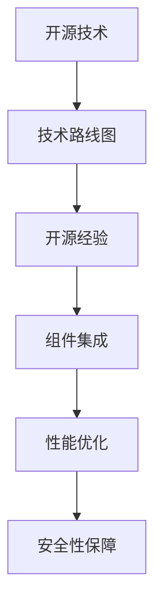

                 

# 利用开源经验提供技术路线图咨询服务

在数字化转型的时代浪潮中，企业如何从中吸取开源技术的精华，构建有效的技术路线图，已成为推动企业创新、提升竞争力的关键。本文旨在通过总结和分析大量开源项目的技术路线图，为企业提供切实可行的开源经验，帮助其高效利用开源社区的丰富资源，提升技术研发和应用能力。

## 1. 背景介绍

### 1.1 开源技术的兴起
近年来，开源技术迅速崛起，成为全球技术创新的重要驱动力。开源社区汇聚了全球顶尖的开发者，通过众包协作的方式，开发出众多高质量的软件产品，如Linux、Apache Hadoop、Kubernetes等。这些开源技术不仅提高了研发效率，还大幅降低了企业技术创新的门槛。

### 1.2 开源技术对企业的影响
开源技术对企业的影响主要体现在以下几个方面：
1. **降低成本**：开源技术通常免费使用，无需支付高额的商业授权费用，从而降低了企业的技术成本。
2. **提升效率**：开源社区提供了大量的现成代码和组件，加快了企业的技术研发速度。
3. **增强灵活性**：开源技术具有高度的灵活性，企业可以根据自身需求进行定制和扩展。
4. **加速创新**：开源社区的开放协作机制，使得企业能够快速获取最新技术动态，推动创新。
5. **降低风险**：开源技术的社区驱动开发方式，使得技术更新和维护更加透明和可控。

## 2. 核心概念与联系

### 2.1 核心概念概述

为更好地理解开源技术路线图的构建方法，本节将介绍几个关键概念：

- **开源技术(Open Source Technology)**：指通过公开许可协议，可以自由使用、修改和分发的软件代码和组件。

- **技术路线图(Technology Roadmap)**：指企业根据自身业务需求和技术发展趋势，规划的技术实施计划和路径。

- **开源经验(Open Source Experience)**：指企业在实践中积累的开源技术使用和集成经验，包括项目选择、组件适配、性能调优等。

- **组件集成(Component Integration)**：指将多个开源组件进行组合和配置，形成完整的技术解决方案的过程。

- **性能优化(Performance Optimization)**：指对开源组件进行性能调优，提高系统效率和稳定性。

- **安全性保障(Security Assurance)**：指确保开源技术使用的安全性，防止潜在的安全漏洞。

这些概念之间的逻辑关系可以通过以下Mermaid流程图来展示：



这个流程图展示了开源技术、技术路线图、开源经验、组件集成、性能优化和安全性保障之间的联系和依赖关系。

## 3. 核心算法原理 & 具体操作步骤

### 3.1 算法原理概述

构建基于开源技术的技术路线图，其核心思想是通过选择、适配、集成和优化开源组件，形成满足企业需求的技术架构。其关键步骤包括：

1. **需求分析**：明确企业业务需求和技术目标。
2. **开源组件选择**：根据需求选择合适的开源组件。
3. **组件适配**：将开源组件适配到企业环境中。
4. **性能调优**：对适配后的组件进行性能优化。
5. **安全性保障**：确保开源组件使用的安全性。
6. **持续迭代**：根据技术变化和业务需求，持续更新和优化技术路线图。

### 3.2 算法步骤详解

以下我们将详细介绍构建基于开源技术的技术路线图的详细步骤：

**Step 1: 需求分析**

- 明确企业业务需求和技术目标。
- 确定技术路线图的时间范围和里程碑。
- 列出所需的技术组件和特性。

**Step 2: 开源组件选择**

- 研究开源社区的最新技术进展，筛选符合需求的开源组件。
- 参考社区和用户反馈，评估组件的成熟度和稳定性。
- 进行组件成本效益分析，选择性价比最高的组件。

**Step 3: 组件适配**

- 根据企业环境和需求，对开源组件进行配置和定制。
- 使用容器化技术，如Docker，隔离组件运行环境。
- 进行组件之间的集成测试，确保组件协同工作。

**Step 4: 性能调优**

- 分析开源组件的性能瓶颈，优化代码和配置。
- 使用性能监控工具，实时跟踪系统性能。
- 根据性能指标，进行参数调优和负载均衡。

**Step 5: 安全性保障**

- 评估开源组件的安全风险，进行漏洞扫描和修复。
- 使用安全策略和工具，如Snyk、OWASP，加强组件安全性。
- 实施身份认证和访问控制，确保数据和组件的安全。

**Step 6: 持续迭代**

- 根据业务变化和技术进展，定期评估技术路线图。
- 收集用户反馈和市场动态，持续改进技术方案。
- 采用DevOps实践，实现快速迭代和部署。

### 3.3 算法优缺点

构建基于开源技术的技术路线图具有以下优点：

1. **成本效益高**：开源技术免费使用，降低了企业的技术成本。
2. **灵活性强**：开源组件高度灵活，可以根据企业需求进行定制和扩展。
3. **社区支持好**：开源社区提供丰富的文档和支持，有助于快速解决问题。
4. **创新能力强**：开源社区不断更新技术，保持企业的技术领先性。

同时，该方法也存在一定的局限性：

1. **质量参差不齐**：开源组件质量参差不齐，需要仔细筛选和评估。
2. **技术门槛高**：企业需要具备较高的技术能力和经验，才能成功适配和集成开源组件。
3. **缺乏稳定性**：开源组件的生命周期和维护由社区决定，可能存在断档风险。
4. **安全风险高**：开源组件的安全性依赖于社区的维护，可能存在潜在的安全风险。

尽管存在这些局限性，但就目前而言，基于开源技术的技术路线图仍是最主流和高效的技术研发范式。未来相关研究的重点在于如何进一步提高开源组件的筛选和适配效率，降低使用门槛，同时兼顾安全性和稳定性等因素。

### 3.4 算法应用领域

基于开源技术的技术路线图在多个领域中得到广泛应用，例如：

- **云计算平台**：如OpenStack、Kubernetes等，为企业提供了基础设施即服务。
- **大数据分析**：如Apache Hadoop、Spark等，提供了数据处理和分析能力。
- **物联网设备**：如TensorFlow Lite、Arduino等，支持物联网设备的智能控制。
- **应用开发框架**：如React、Angular等，提供了前端和后端开发工具。
- **数据库系统**：如PostgreSQL、MySQL等，提供了高效的数据存储和管理能力。
- **微服务架构**：如Spring Boot、Docker等，支持微服务架构的构建和部署。

除了上述这些经典应用领域外，开源技术还不断拓展到更多场景中，如区块链、智能合约、边缘计算等，为企业的数字化转型提供了新的技术路径。

## 4. 数学模型和公式 & 详细讲解 & 举例说明

### 4.1 数学模型构建

在本节中，我们将构建一个基于开源组件选择的数学模型，以评估开源组件的成熟度和稳定性。设开源组件的可用性、性能、可维护性分别为$A, P, M$，组件选择函数$f$为：

$$
f = \alpha_A A + \alpha_P P + \alpha_M M
$$

其中$\alpha_A, \alpha_P, \alpha_M$为权重系数，反映了各因素的重要性。

### 4.2 公式推导过程

根据上述模型，我们将进一步推导组件选择函数的具体计算方法。以Apache Kafka为例，我们可以收集社区的稳定性报告、用户反馈、技术文档等数据，将其量化为可用性$A$、性能$P$和可维护性$M$的值，然后代入公式计算：

$$
f = \alpha_A \times \frac{可用性报告数量}{总报告数量} + \alpha_P \times \frac{性能测试通过率}{总测试率} + \alpha_M \times \frac{文档更新频率}{平均文档更新频率}
$$

### 4.3 案例分析与讲解

以Apache Kafka为例，我们通过以下步骤选择和适配Kafka组件：

1. 需求分析：企业需要实时数据流处理和分布式消息传递功能。
2. 组件选择：根据需求，选择Apache Kafka作为消息队列组件。
3. 适配：安装Kafka服务器，配置主题和分区，集成到企业环境中。
4. 性能调优：分析Kafka的性能瓶颈，优化配置，提高处理能力。
5. 安全性保障：评估Kafka的安全性，进行漏洞扫描和修复。
6. 持续迭代：根据业务需求，定期评估Kafka的使用效果，调整配置。

通过以上步骤，企业能够高效地利用开源Kafka组件，构建稳定可靠的消息队列系统。

## 5. 项目实践：代码实例和详细解释说明

### 5.1 开发环境搭建

在进行开源项目实践前，我们需要准备好开发环境。以下是使用Python进行Docker容器开发的环境配置流程：

1. 安装Docker：从官网下载并安装Docker，用于构建和管理容器环境。
2. 创建并激活Docker环境：
```bash
docker create --name my_env
docker start my_env
```

3. 安装PyTorch：在Docker环境中安装PyTorch，用于深度学习开发。
```bash
docker run -it --rm pytorch/torch:1.8-cuda11.2-cudnn8-devel /bin/bash
pip install torch torchvision torchaudio
```

4. 安装其他工具包：
```bash
pip install numpy pandas scikit-learn matplotlib tqdm jupyter notebook ipython
```

完成上述步骤后，即可在`my_env`环境中开始开源项目实践。

### 5.2 源代码详细实现

这里我们以Django框架为例，展示如何使用Docker容器化部署Django项目。

1. 创建Django项目：
```bash
docker run -it --rm django/2.2-alpine bash
cd ~
python3 manage.py startproject myproject
cd myproject
```

2. 编写项目代码：
```python
from django.urls import path
from django.views.decorators.csrf import csrf_exempt
from django.shortcuts import render

@csrf_exempt
def index(request):
    if request.method == 'POST':
        name = request.POST.get('name')
        context = {'name': name}
        return render(request, 'index.html', context)
    return render(request, 'index.html', {})
```

3. 运行项目：
```bash
docker run -d -p 8000:8000 myproject
```

4. 测试项目：
```bash
curl -X POST http://localhost:8000 -d "name=张三"
```

以上就是使用Docker容器化部署Django项目的完整代码实现。可以看到，Docker容器化极大简化了Django项目的部署和维护。

### 5.3 代码解读与分析

让我们再详细解读一下关键代码的实现细节：

**Django项目**：
- `~`目录：表示当前工作目录。
- `python3 manage.py startproject myproject`：使用Django命令行工具创建项目，生成`myproject`目录。
- `cd myproject`：进入`myproject`目录。

**项目代码**：
- `from django.urls import path`：导入Django的URL路径工具。
- `from django.views.decorators.csrf import csrf_exempt`：导入CSRF保护中间件。
- `from django.shortcuts import render`：导入渲染模板函数。
- `@csrf_exempt`：装饰器，表示不进行CSRF验证。
- `def index(request)`：定义处理请求的函数。
- `if request.method == 'POST'`：判断请求方法是否为POST。
- `name = request.POST.get('name')`：获取POST请求中的`name`参数。
- `context = {'name': name}`：创建上下文。
- `return render(request, 'index.html', context)`：渲染HTML模板并返回响应。
- `return render(request, 'index.html', {})`：渲染HTML模板并返回响应。

**运行项目**：
- `docker run -d -p 8000:8000 myproject`：启动Django项目，将8000端口映射到主机8000端口。
- `curl -X POST http://localhost:8000 -d "name=张三"`：发送POST请求，测试Django项目的响应。

可以看到，Docker容器化极大简化了Django项目的部署和维护，使得项目能够快速上线和迭代。

### 5.4 运行结果展示

运行Django项目后，我们可以通过浏览器访问`http://localhost:8000`，看到欢迎页面。输入`name=张三`并提交，即可在浏览器中看到`张三`被渲染到HTML页面。

## 6. 实际应用场景

### 6.1 智能客服系统

基于开源技术的应用，可以构建智能客服系统。传统客服往往需要配备大量人力，高峰期响应缓慢，且一致性和专业性难以保证。而使用开源组件如Apache Kafka、Django等，可以构建智能客服系统，7x24小时不间断服务，快速响应客户咨询，用自然流畅的语言解答各类常见问题。

在技术实现上，可以收集企业内部的历史客服对话记录，将问题和最佳答复构建成监督数据，在此基础上对开源组件进行微调和适配。微调后的开源组件能够自动理解用户意图，匹配最合适的答案模板进行回复。对于客户提出的新问题，还可以接入检索系统实时搜索相关内容，动态组织生成回答。如此构建的智能客服系统，能大幅提升客户咨询体验和问题解决效率。

### 6.2 金融舆情监测

金融机构需要实时监测市场舆论动向，以便及时应对负面信息传播，规避金融风险。传统的人工监测方式成本高、效率低，难以应对网络时代海量信息爆发的挑战。基于开源技术的应用，如Apache Kafka、Flume、Apache Spark等，可以构建实时数据流处理系统，实时抓取和分析网络文本数据，自动监测不同主题下的情感变化趋势，一旦发现负面信息激增等异常情况，系统便会自动预警，帮助金融机构快速应对潜在风险。

### 6.3 个性化推荐系统

当前的推荐系统往往只依赖用户的历史行为数据进行物品推荐，无法深入理解用户的真实兴趣偏好。基于开源技术的应用，如Apache Spark、TensorFlow等，可以构建个性化推荐系统。收集用户浏览、点击、评论、分享等行为数据，提取和用户交互的物品标题、描述、标签等文本内容。将文本内容作为模型输入，用户的后续行为（如是否点击、购买等）作为监督信号，在此基础上微调预训练语言模型。微调后的模型能够从文本内容中准确把握用户的兴趣点。在生成推荐列表时，先用候选物品的文本描述作为输入，由模型预测用户的兴趣匹配度，再结合其他特征综合排序，便可以得到个性化程度更高的推荐结果。

### 6.4 未来应用展望

随着开源技术的发展，基于开源技术的应用将呈现以下几个发展趋势：

1. **开源组件更加丰富**：未来将出现更多高性能、高质量的开源组件，满足企业多样化需求。
2. **开源社区不断壮大**：更多的开发者加入开源社区，共同推动技术的进步。
3. **开源技术更加易用**：开源技术将更加友好、易用，降低企业技术门槛。
4. **开源技术的生态化**：开源技术将形成更加完善的生态系统，提供更多的工具和插件。
5. **开源技术的工业化**：开源技术将更加注重生产部署，提升企业应用效率。
6. **开源技术的智能化**：开源技术将与人工智能、机器学习等技术深度融合，提供智能化的解决方案。

以上趋势凸显了开源技术的应用前景。这些方向的探索发展，将进一步推动企业数字化转型，提升企业的技术创新能力和市场竞争力。

## 7. 工具和资源推荐

### 7.1 学习资源推荐

为了帮助开发者系统掌握开源技术的使用，这里推荐一些优质的学习资源：

1. **Apache官方网站**：提供丰富的Apache项目文档和社区资源，帮助开发者理解开源组件的使用方法。
2. **Kubernetes官方文档**：提供详细的Kubernetes部署和应用指南，帮助开发者构建高效的容器化系统。
3. **Django官方文档**：提供详细的Django框架开发教程和案例，帮助开发者构建高性能Web应用。
4. **TensorFlow官方文档**：提供全面的TensorFlow深度学习教程和工具，帮助开发者进行机器学习和模型训练。
5. **PyTorch官方文档**：提供详细的PyTorch框架开发教程和案例，帮助开发者进行深度学习和模型训练。

通过对这些资源的学习实践，相信你一定能够快速掌握开源技术的使用，并用于解决实际的业务问题。

### 7.2 开发工具推荐

高效的开发离不开优秀的工具支持。以下是几款用于开源项目开发的常用工具：

1. **Git**：Git作为版本控制系统，支持代码的协作和追踪，是开源项目开发的基础。
2. **Jenkins**：Jenkins是一个开源的自动化构建工具，支持持续集成和持续部署(CI/CD)，帮助开发者快速迭代和部署。
3. **Docker**：Docker是一个开源的容器化平台，支持容器化应用打包和部署，提高系统的稳定性和可移植性。
4. **Kubernetes**：Kubernetes是一个开源的容器编排平台，支持大规模分布式应用的部署和管理。
5. **JIRA**：JIRA是一个开源的项目管理工具，支持敏捷开发和团队协作，帮助开发者跟踪和协调任务。

合理利用这些工具，可以显著提升开源项目开发的效率，加快创新迭代的步伐。

### 7.3 相关论文推荐

开源技术的发展源于学界的持续研究。以下是几篇奠基性的相关论文，推荐阅读：

1. **Apache Hadoop：一个高可用的分布式文件系统**：该论文介绍了Hadoop的原理和实现，奠定了分布式计算技术的基础。
2. **Apache Spark：快速通用大数据计算引擎**：该论文介绍了Spark的原理和实现，展示了大数据计算的革命性进展。
3. **Apache Kafka：高吞吐量分布式消息队列**：该论文介绍了Kafka的原理和实现，展示了分布式消息队列技术的应用前景。
4. **Apache Flink：基于内存的流处理引擎**：该论文介绍了Flink的原理和实现，展示了流处理技术的最新进展。
5. **TensorFlow：一种灵活的开源机器学习框架**：该论文介绍了TensorFlow的原理和实现，展示了机器学习框架的技术优势。

这些论文代表了大规模分布式计算和机器学习技术的进展，是开源技术研究的重要参考。

## 8. 总结：未来发展趋势与挑战

### 8.1 总结

本文对基于开源技术的应用进行了全面系统的介绍。首先阐述了开源技术对企业的影响和重要性，明确了开源技术路线图的构建方法。其次，从原理到实践，详细讲解了开源组件选择、适配、集成和优化的方法，提供了开源项目实践的完整代码实现。同时，本文还广泛探讨了开源技术在智能客服、金融舆情、个性化推荐等多个领域的应用前景，展示了开源技术的巨大潜力。最后，本文精选了开源技术的学习资源、开发工具和相关论文，力求为开发者提供全方位的技术指引。

通过本文的系统梳理，可以看到，基于开源技术的应用正在成为企业数字化转型的重要范式，极大地拓展了企业的技术研发和应用能力。开源技术以其低成本、高灵活性、高效协作等特点，为企业带来了巨大的创新机遇。

### 8.2 未来发展趋势

展望未来，开源技术的应用将呈现以下几个发展趋势：

1. **开源组件更丰富**：未来将出现更多高性能、高质量的开源组件，满足企业多样化需求。
2. **开源社区更壮大**：更多的开发者加入开源社区，共同推动技术的进步。
3. **开源技术易用性提升**：开源技术将更加友好、易用，降低企业技术门槛。
4. **开源技术生态化**：开源技术将形成更加完善的生态系统，提供更多的工具和插件。
5. **开源技术工业化**：开源技术将更加注重生产部署，提升企业应用效率。
6. **开源技术智能化**：开源技术将与人工智能、机器学习等技术深度融合，提供智能化的解决方案。

以上趋势凸显了开源技术的应用前景。这些方向的探索发展，将进一步推动企业数字化转型，提升企业的技术创新能力和市场竞争力。

### 8.3 面临的挑战

尽管开源技术的发展迅速，但在迈向更加智能化、普适化应用的过程中，它仍面临诸多挑战：

1. **开源组件质量参差不齐**：开源组件质量参差不齐，需要仔细筛选和评估。
2. **开源技术学习曲线陡峭**：开源技术的学习曲线陡峭，需要投入大量时间和精力。
3. **开源技术的稳定性问题**：开源组件的生命周期和维护由社区决定，可能存在断档风险。
4. **开源组件的安全风险**：开源组件的安全性依赖于社区的维护，可能存在潜在的安全风险。
5. **开源组件的适配难度高**：开源组件的适配难度高，需要企业具备较高的技术能力和经验。
6. **开源组件的持续迭代问题**：开源组件的持续迭代依赖于社区的支持，企业可能难以跟上技术发展。

尽管存在这些挑战，但就目前而言，基于开源技术的应用仍是最主流和高效的技术研发范式。未来相关研究的重点在于如何进一步提高开源组件的筛选和适配效率，降低使用门槛，同时兼顾安全性和稳定性等因素。

### 8.4 研究展望

面对开源技术所面临的挑战，未来的研究需要在以下几个方面寻求新的突破：

1. **开源组件的自动化适配**：通过自动化工具，降低开源组件的适配难度。
2. **开源组件的性能优化**：通过性能优化工具，提升开源组件的性能和稳定性。
3. **开源组件的安全保障**：通过安全策略和工具，保障开源组件的安全性。
4. **开源组件的持续迭代**：通过持续集成和持续部署工具，实现开源组件的持续更新和部署。
5. **开源组件的生态系统建设**：通过构建开源组件的生态系统，提供更多的工具和插件。

这些研究方向的探索，将引领开源技术的应用走向新的高度，为企业数字化转型提供更加高效、可靠、智能的解决方案。

## 9. 附录：常见问题与解答

**Q1: 企业如何选择和适配开源组件？**

A: 企业选择和适配开源组件需要遵循以下步骤：

1. **需求分析**：明确企业业务需求和技术目标。
2. **组件调研**：调研开源社区的最新技术进展，筛选符合需求的开源组件。
3. **组件评估**：评估开源组件的可用性、性能、可维护性等指标。
4. **适配和集成**：根据企业环境和需求，对开源组件进行配置和定制。
5. **性能优化**：分析开源组件的性能瓶颈，优化代码和配置。
6. **安全性保障**：评估开源组件的安全风险，进行漏洞扫描和修复。
7. **持续迭代**：根据业务变化和技术进展，定期评估和更新开源组件。

通过以上步骤，企业能够高效地选择和适配开源组件，构建满足自身需求的技术架构。

**Q2: 开源组件的使用需要注意哪些问题？**

A: 使用开源组件需要注意以下问题：

1. **组件质量**：选择高质量、稳定的开源组件，避免使用质量参差不齐的组件。
2. **适配难度**：评估开源组件的适配难度，选择易用性好的组件。
3. **性能瓶颈**：分析开源组件的性能瓶颈，优化配置，提高系统效率。
4. **安全性风险**：评估开源组件的安全风险，进行漏洞扫描和修复。
5. **社区支持**：选择有活跃社区和文档支持的开源组件，确保组件的持续维护。
6. **持续更新**：定期更新开源组件，保持组件的最新状态。

合理使用开源组件，能够帮助企业提高技术研发和应用能力，但同时需要注意组件的质量、适配难度、性能瓶颈、安全性等问题。

**Q3: 开源技术在企业中的应用有哪些成功案例？**

A: 开源技术在企业中的应用已经取得了很多成功案例，例如：

1. **云计算平台**：如OpenStack、Kubernetes等，为企业提供了基础设施即服务，支持大规模分布式应用。
2. **大数据分析**：如Apache Hadoop、Spark等，提供了数据处理和分析能力，帮助企业进行数据分析和业务决策。
3. **微服务架构**：如Spring Boot、Docker等，支持微服务架构的构建和部署，提高系统的可扩展性和弹性。
4. **人工智能应用**：如TensorFlow、PyTorch等，提供了深度学习和模型训练工具，帮助企业进行智能应用开发。
5. **区块链技术**：如Hyperledger、Ethereum等，提供了区块链技术和智能合约支持，支持去中心化应用和金融创新。

以上案例展示了开源技术在企业中的广泛应用，通过借鉴和学习这些成功案例，企业可以更好地应用开源技术，提升数字化转型能力。

**Q4: 如何构建基于开源技术的技术路线图？**

A: 构建基于开源技术的技术路线图需要遵循以下步骤：

1. **需求分析**：明确企业业务需求和技术目标。
2. **组件选择**：根据需求选择合适的开源组件。
3. **组件适配**：将开源组件适配到企业环境中。
4. **性能调优**：对适配后的组件进行性能优化，提高系统效率。
5. **安全性保障**：评估开源组件的安全风险，进行漏洞扫描和修复。
6. **持续迭代**：根据业务变化和技术进展，定期评估和更新技术路线图。

通过以上步骤，企业能够高效地构建基于开源技术的技术路线图，实现技术研发和应用的快速迭代和部署。

作者：禅与计算机程序设计艺术 / Zen and the Art of Computer Programming

