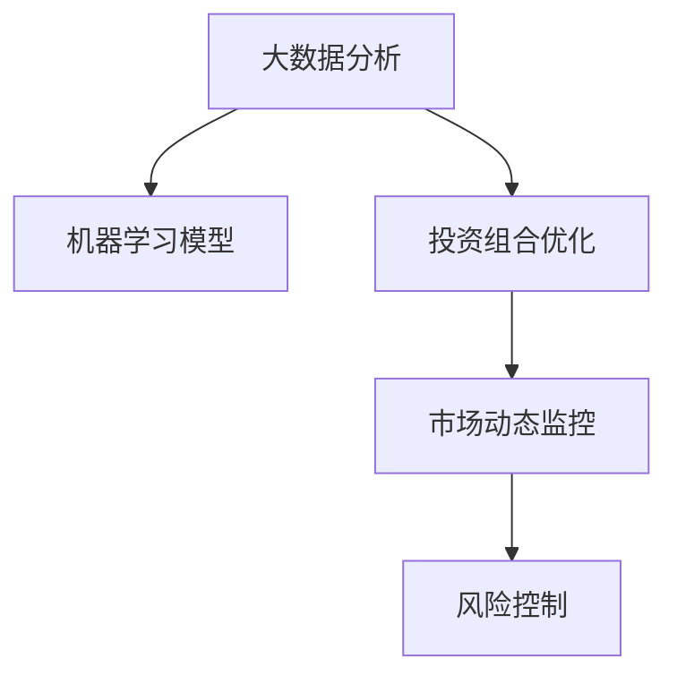

                 

# 利用技术洞察力进行风险投资

> 关键词：风险投资, 技术洞察力, 数据分析, 模型优化, 投资策略, 市场分析, 风险评估, 量化投资

## 1. 背景介绍

### 1.1 问题由来

风险投资（Venture Capital, VC）作为驱动创新和技术发展的重要资金来源，在过去几十年间对全球科技行业产生了深远影响。VC的主要目标是识别并投资那些具有巨大增长潜力的初创企业，通过提供资金、资源和专业指导，帮助这些企业在竞争激烈的市场中生存并成长。然而，风险投资的决策过程复杂且风险巨大，需要综合考虑多方面因素，如市场潜力、技术成熟度、团队能力等。

近年来，随着大数据和人工智能技术的飞速发展，VC行业开始利用技术洞察力来提升投资决策的准确性和效率。技术洞察力指的是通过数据分析和模型优化等技术手段，对投资对象的市场表现、技术能力、未来发展趋势等进行深入分析，从而制定更加科学合理的投资策略。

### 1.2 问题核心关键点

利用技术洞察力进行风险投资的核心关键点在于：

- **数据分析与挖掘**：从海量数据中提取有价值的信息，识别投资机会。
- **模型构建与优化**：利用机器学习等模型，预测市场趋势，评估投资风险。
- **投资策略制定**：基于分析结果，制定科学合理的投资策略，实现资产增值。
- **持续学习与适应**：市场和技术环境不断变化，需要持续优化模型和策略，保持领先。

本文将系统介绍基于技术洞察力的风险投资方法，包括数据分析、模型构建、投资策略制定等方面的技术细节，并结合实际案例进行讲解。

## 2. 核心概念与联系

### 2.1 核心概念概述

在风险投资中，技术洞察力主要体现在以下几个关键概念上：

- **大数据分析**：通过收集、整理和分析与投资对象相关的海量数据，识别潜在的投资机会和风险。
- **机器学习模型**：利用统计学习、深度学习等技术，构建能够预测市场趋势、评估风险的模型。
- **投资组合优化**：根据模型预测结果，优化投资组合，实现风险分散和收益最大化。
- **市场动态监控**：实时监控市场变化，及时调整投资策略，保持灵活性。
- **风险控制**：通过定性和定量分析，评估和控制投资风险，确保投资安全。

这些概念之间的逻辑关系可以通过以下Mermaid流程图来展示：



这个流程图展示了大语言模型的核心概念及其之间的关系：

1. 大数据分析作为基础，收集和整理数据。
2. 机器学习模型利用数据分析结果，构建预测模型。
3. 投资组合优化基于模型预测结果，优化投资策略。
4. 市场动态监控实时调整投资组合，确保灵活性。
5. 风险控制评估和控制风险，保证投资安全。

这些概念共同构成了基于技术洞察力的风险投资框架，使得VC能够更加科学合理地进行投资决策。

## 3. 核心算法原理 & 具体操作步骤

### 3.1 算法原理概述

基于技术洞察力的风险投资方法，本质上是将大数据分析和机器学习等技术手段应用于风险投资的决策过程中。其核心思想是通过对历史和实时数据进行建模和分析，预测市场趋势，评估投资风险，从而制定科学合理的投资策略。

形式化地，假设投资对象的市场表现可以用 $\{x_t\}_{t=1}^N$ 表示，其中 $x_t$ 为第 $t$ 时间点的市场数据。设目标函数为 $\mathcal{L}(\theta)$，用于衡量模型对市场趋势的预测准确度。则基于技术洞察力的投资决策过程可以表示为：

$$
\theta^* = \mathop{\arg\min}_{\theta} \mathcal{L}(\theta) \quad \text{subject to} \quad \text{风险约束} \quad R(\theta)
$$

其中 $R(\theta)$ 为风险约束函数，用于评估模型的风险水平，保证投资的安全性。通过求解上述优化问题，可以确定最优的模型参数 $\theta^*$，进而制定投资策略。

### 3.2 算法步骤详解

基于技术洞察力的风险投资方法，通常包括以下几个关键步骤：

**Step 1: 数据收集与预处理**

- 收集与投资对象相关的历史和实时数据，如市场数据、财务数据、技术指标等。
- 清洗和处理数据，去除噪声和异常值，确保数据质量。

**Step 2: 特征提取与选择**

- 利用大数据分析技术，提取与投资对象相关的特征，如市场趋势、财务指标、技术进步等。
- 选择和优化特征，构建特征集合，为后续的模型构建提供数据支持。

**Step 3: 模型构建与优化**

- 选择适当的机器学习模型，如回归模型、分类模型、深度学习模型等。
- 利用历史数据进行模型训练，通过交叉验证等技术优化模型参数。
- 在实时数据上验证模型效果，调整和优化模型。

**Step 4: 投资策略制定**

- 基于模型预测结果，评估投资对象的潜在收益和风险。
- 根据风险偏好和投资目标，制定科学合理的投资策略。
- 定期监控市场变化，及时调整投资策略。

**Step 5: 风险控制与评估**

- 使用风险控制模型，评估投资组合的风险水平。
- 根据风险控制结果，调整投资策略，避免过度集中风险。
- 定期评估投资组合表现，确保投资策略的有效性。

以上是基于技术洞察力的风险投资的一般流程。在实际应用中，还需要针对具体投资对象的特征和市场环境，对各个环节进行优化设计，如引入外部知识、优化特征选择方法、改进模型预测精度等。

### 3.3 算法优缺点

基于技术洞察力的风险投资方法具有以下优点：

1. 数据驱动决策：通过分析历史和实时数据，提升投资决策的科学性和准确性。
2. 自动化优化：利用机器学习模型，自动优化投资组合，减少人为干预。
3. 风险控制：实时监控市场变化，及时调整投资策略，避免灾难性风险。
4. 高效率：利用技术手段加速投资决策过程，提高投资回报率。

同时，该方法也存在一定的局限性：

1. 数据质量要求高：需要高质量、完整的数据，对数据收集和清洗要求高。
2. 模型依赖：模型预测的准确性依赖于数据质量和模型选择，需要持续优化。
3. 假设限制：模型往往基于一定的假设，当假设不成立时，可能影响预测结果。
4. 市场复杂性：市场环境和投资对象变化复杂，模型难以完全覆盖所有因素。

尽管存在这些局限性，但就目前而言，基于技术洞察力的风险投资方法仍是最为主流和有效的投资决策手段。未来相关研究的方向在于如何进一步降低数据依赖，提高模型的泛化能力和鲁棒性，同时兼顾风险控制和投资回报。

### 3.4 算法应用领域

基于技术洞察力的风险投资方法，已经在金融、科技、医疗等多个领域得到广泛应用，具体包括：

1. **金融投资**：利用大数据和机器学习模型，进行股票、债券、基金等的投资决策。
2. **科技创新**：评估创业公司的技术潜力、市场前景，选择具有高成长性的初创企业进行投资。
3. **医疗健康**：利用大数据分析技术，预测医疗健康领域的发展趋势，投资潜力巨大的医药公司。
4. **智能制造**：分析市场需求和技术趋势，投资具有创新性的智能制造企业，推动工业智能化升级。
5. **绿色能源**：评估清洁能源技术的市场潜力，投资环保型新能源企业，支持可持续发展。

除了上述这些经典应用外，基于技术洞察力的风险投资方法还在更多新兴领域得到探索和应用，如无人驾驶、量子计算、物联网等，为科技前沿领域的投资决策提供新的技术支撑。

## 4. 数学模型和公式 & 详细讲解 & 举例说明

### 4.1 数学模型构建

在风险投资决策过程中，常见的数学模型包括线性回归、逻辑回归、决策树、随机森林、神经网络等。以下以线性回归模型为例，展示其构建和优化过程。

假设市场数据 $x_t$ 为连续变量，投资收益 $y_t$ 为标量，则线性回归模型的表达式为：

$$
y_t = \beta_0 + \beta_1 x_t + \epsilon_t
$$

其中 $\beta_0$ 为截距，$\beta_1$ 为斜率，$\epsilon_t$ 为随机误差项。利用历史数据 $(x_1, y_1), (x_2, y_2), \ldots, (x_N, y_N)$，最小化损失函数：

$$
\mathcal{L}(\beta_0, \beta_1) = \frac{1}{N} \sum_{i=1}^N (y_i - (\beta_0 + \beta_1 x_i))^2
$$

### 4.2 公式推导过程

利用梯度下降算法对模型进行优化，求解上述最小化问题，可以得到模型参数 $\beta_0$ 和 $\beta_1$ 的估计值。具体推导过程如下：

$$
\begin{aligned}
\frac{\partial \mathcal{L}}{\partial \beta_0} &= \frac{2}{N} \sum_{i=1}^N (-y_i + \beta_0 + \beta_1 x_i) = 0 \\
\frac{\partial \mathcal{L}}{\partial \beta_1} &= \frac{2}{N} \sum_{i=1}^N (-y_i + \beta_0 + \beta_1 x_i)x_i = 0
\end{aligned}
$$

解上述方程组，得到：

$$
\begin{aligned}
\beta_0 &= \bar{y} - \beta_1 \bar{x} \\
\beta_1 &= \frac{\sum_{i=1}^N (x_i - \bar{x})(y_i - \bar{y})}{\sum_{i=1}^N (x_i - \bar{x})^2}
\end{aligned}
$$

其中 $\bar{x}$ 和 $\bar{y}$ 分别为 $x$ 和 $y$ 的均值。

### 4.3 案例分析与讲解

以某科技初创企业为例，假设已收集到其过去五年的市场表现数据，包括每年的销售额、研发投入、市场份额等。

- 数据收集：收集企业历史市场数据，涵盖销售额、研发投入、市场份额等。
- 数据预处理：清洗和处理数据，去除噪声和异常值，确保数据质量。
- 特征提取：提取与企业市场表现相关的特征，如销售额、研发投入占比、市场份额等。
- 模型训练：构建线性回归模型，利用历史数据训练模型，优化模型参数。
- 模型验证：在实时数据上验证模型效果，调整和优化模型。
- 投资决策：根据模型预测结果，评估企业潜在收益和风险，制定投资策略。

通过以上步骤，可以构建一个基于技术洞察力的风险投资模型，帮助VC评估和投资具有高成长性的初创企业。

## 5. 项目实践：代码实例和详细解释说明

### 5.1 开发环境搭建

在进行风险投资模型开发前，需要准备好开发环境。以下是使用Python进行Scikit-Learn开发的开发环境配置流程：

1. 安装Anaconda：从官网下载并安装Anaconda，用于创建独立的Python环境。

2. 创建并激活虚拟环境：
```bash
conda create -n risk-investment-env python=3.8 
conda activate risk-investment-env
```

3. 安装Scikit-Learn：
```bash
conda install scikit-learn
```

4. 安装各类工具包：
```bash
pip install numpy pandas matplotlib seaborn sklearn scikit-optimize jupyter notebook ipython
```

完成上述步骤后，即可在`risk-investment-env`环境中开始风险投资模型的开发。

### 5.2 源代码详细实现

下面我们以线性回归模型为例，给出使用Scikit-Learn库进行风险投资模型开发的PyTorch代码实现。

首先，定义模型训练函数：

```python
from sklearn.linear_model import LinearRegression
from sklearn.metrics import mean_squared_error
from sklearn.model_selection import train_test_split
import numpy as np

def train_model(X, y, test_size=0.2, n_train=1000, learning_rate=0.01, epochs=1000):
    X_train, X_test, y_train, y_test = train_test_split(X, y, test_size=test_size, random_state=42)
    model = LinearRegression()
    model.fit(X_train, y_train)
    y_pred = model.predict(X_test)
    mse = mean_squared_error(y_test, y_pred)
    return mse
```

然后，定义数据预处理函数：

```python
def preprocess_data(data):
    # 清洗和处理数据，去除噪声和异常值
    data = data.dropna()
    data = data.drop_duplicates()
    # 标准化数据，转换特征为标量
    data = (data - data.mean()) / data.std()
    return data
```

接着，定义投资决策函数：

```python
def invest(data, model):
    # 预测投资对象的未来表现
    future_data = preprocess_data(data)
    future_y = model.predict(future_data)
    # 评估投资风险
    risk = np.std(future_y)
    # 根据风险偏好和投资目标，制定投资策略
    if risk < 0.1:
        investment = '高风险'
    elif risk < 0.3:
        investment = '中风险'
    else:
        investment = '低风险'
    return investment
```

最后，启动模型训练和投资决策流程：

```python
# 加载数据
data = pd.read_csv('investment_data.csv')

# 数据预处理
data = preprocess_data(data)

# 模型训练
mse = train_model(data, y)

# 投资决策
investment = invest(data, model)

print(f"模型训练误差：{mse:.3f}")
print(f"投资策略：{investment}")
```

以上就是使用Scikit-Learn进行风险投资模型开发的完整代码实现。可以看到，通过简单的线性回归模型，即可实现对投资对象的评估和投资决策。

### 5.3 代码解读与分析

让我们再详细解读一下关键代码的实现细节：

**train_model函数**：
- 定义了模型训练函数，利用历史数据训练线性回归模型，并计算测试集误差。

**preprocess_data函数**：
- 定义了数据预处理函数，清洗和处理数据，去除噪声和异常值，标准化数据。

**invest函数**：
- 定义了投资决策函数，根据模型预测结果和风险水平，制定投资策略。

**训练流程**：
- 加载数据。
- 数据预处理。
- 模型训练。
- 投资决策。

可以看到，通过Scikit-Learn库，可以方便地实现风险投资模型的开发。开发者可以将更多精力放在模型选择、特征选择、投资策略设计等高层次逻辑上，而不必过多关注底层的实现细节。

当然，工业级的系统实现还需考虑更多因素，如模型的保存和部署、超参数的自动搜索、更灵活的投资策略等。但核心的风险投资范式基本与此类似。

## 6. 实际应用场景

### 6.1 金融投资

基于大数据和机器学习技术的风险投资方法，在金融投资领域具有广泛应用。金融机构可以利用历史数据和实时数据，评估股票、债券、基金等金融产品的风险和收益，制定科学合理的投资策略。

在技术实现上，可以收集市场历史数据、企业财务报表、经济指标等，构建多元回归模型或神经网络模型，预测金融产品的表现。同时，引入风险控制模型，实时监控市场变化，及时调整投资组合，避免灾难性风险。

### 6.2 科技创新

科技初创企业的投资决策，通常需要综合考虑技术成熟度、市场需求、团队能力等多个因素。利用技术洞察力的风险投资方法，可以通过分析专利、技术论文、市场调研等数据，评估企业的技术潜力，制定科学合理的投资策略。

在技术实现上，可以收集企业专利数据、技术论文、市场调研报告等，构建机器学习模型，评估企业的技术实力和市场前景。同时，利用专家知识和行业洞察，辅助模型评估，提高投资决策的准确性。

### 6.3 医疗健康

医疗健康领域的投资决策，需要考虑技术成熟度、市场需求、临床效果等多个因素。利用技术洞察力的风险投资方法，可以通过分析临床试验数据、市场调研报告、专利信息等数据，评估企业的技术实力和市场前景，制定科学合理的投资策略。

在技术实现上，可以收集临床试验数据、市场调研报告、专利信息等，构建机器学习模型，预测企业的技术实力和市场前景。同时，引入专家知识和行业洞察，辅助模型评估，提高投资决策的准确性。

### 6.4 未来应用展望

随着大数据和人工智能技术的不断进步，基于技术洞察力的风险投资方法将在更多领域得到应用，为金融、科技、医疗等领域提供新的技术支撑。

在智慧金融领域，基于技术洞察力的风险投资方法将帮助金融机构更好地评估金融产品的风险和收益，提升投资决策的科学性和效率。

在智慧医疗领域，通过分析临床试验数据和市场调研报告，可以评估医疗企业的技术实力和市场前景，投资潜力巨大的医药公司，支持医疗健康领域的创新发展。

在智慧城市治理中，基于技术洞察力的风险投资方法将帮助政府机构识别并投资具有高成长性的科技企业，推动智慧城市的建设和发展。

此外，在教育、农业、环保等多个领域，基于技术洞察力的风险投资方法也将得到探索和应用，为各行各业带来新的发展机遇。相信随着技术的不断发展，基于技术洞察力的风险投资方法将成为风险投资决策的重要手段，推动科技创新和产业升级。

## 7. 工具和资源推荐
### 7.1 学习资源推荐

为了帮助开发者系统掌握基于技术洞察力的风险投资方法，这里推荐一些优质的学习资源：

1. 《数据分析与机器学习》系列书籍：由统计学和机器学习领域的专家撰写，全面介绍了数据分析、机器学习的基本概念和应用。

2. 《风险投资决策与量化模型》课程：由知名风险投资机构和学术机构开设的在线课程，涵盖风险投资的理论基础和量化模型。

3. 《机器学习实战》书籍：介绍机器学习模型的构建、优化和应用，适合初学者和中级开发者。

4. Kaggle平台：提供丰富的数据集和竞赛，通过实践项目提高数据分析和模型优化能力。

5. GitHub开源项目：通过学习开源项目代码，了解基于技术洞察力的风险投资技术实现。

通过对这些资源的学习实践，相信你一定能够快速掌握基于技术洞察力的风险投资技术的精髓，并用于解决实际的投资决策问题。

### 7.2 开发工具推荐

高效的开发离不开优秀的工具支持。以下是几款用于风险投资模型开发的常用工具：

1. Jupyter Notebook：Python的交互式开发环境，支持代码调试和数据可视化，适合快速迭代研究。

2. Scikit-Learn：Python的数据分析与机器学习库，提供丰富的机器学习算法和模型优化工具。

3. TensorFlow和PyTorch：深度学习框架，提供高效的模型训练和优化能力，适合处理大规模数据集。

4. Weights & Biases：模型训练的实验跟踪工具，可以记录和可视化模型训练过程中的各项指标，方便对比和调优。

5. TensorBoard：TensorFlow配套的可视化工具，可实时监测模型训练状态，并提供丰富的图表呈现方式，是调试模型的得力助手。

合理利用这些工具，可以显著提升风险投资模型的开发效率，加快创新迭代的步伐。

### 7.3 相关论文推荐

风险投资决策技术的发展源于学界的持续研究。以下是几篇奠基性的相关论文，推荐阅读：

1. "Machine Learning in Finance: The Case of Distressed Debt"（金融领域的机器学习应用）：利用机器学习模型预测企业违约风险，评估投资价值。

2. "Predicting the Stock Market with Artificial Neural Networks"（利用神经网络预测股票市场）：介绍神经网络模型在股市预测中的应用。

3. "Investment Decision-Making Using Artificial Intelligence: A Survey"（人工智能在投资决策中的应用）：综述人工智能技术在投资决策中的各种应用。

4. "A Survey on Machine Learning for Healthcare"（医疗健康领域的机器学习应用）：利用机器学习模型评估医疗企业的技术实力和市场前景。

5. "Quantitative Risk Management"（量化风险管理）：介绍量化风险管理技术在金融投资中的应用。

这些论文代表了大语言模型微调技术的发展脉络。通过学习这些前沿成果，可以帮助研究者把握学科前进方向，激发更多的创新灵感。

## 8. 总结：未来发展趋势与挑战

### 8.1 总结

本文对基于技术洞察力的风险投资方法进行了全面系统的介绍。首先阐述了基于技术洞察力的风险投资方法的研究背景和意义，明确了数据驱动决策、自动化优化、风险控制等关键技术在风险投资中的应用。其次，从原理到实践，详细讲解了风险投资数据分析、模型构建、投资策略制定等方面的技术细节，并结合实际案例进行讲解。

通过本文的系统梳理，可以看到，基于技术洞察力的风险投资方法正在成为风险投资决策的重要手段，极大地提升了投资决策的科学性和效率。未来，伴随大数据和人工智能技术的不断进步，基于技术洞察力的风险投资方法必将在更多领域得到应用，为金融、科技、医疗等领域带来新的技术支撑。

### 8.2 未来发展趋势

展望未来，基于技术洞察力的风险投资方法将呈现以下几个发展趋势：

1. 数据驱动决策：通过分析海量数据，提取有价值的信息，提升投资决策的准确性和效率。
2. 自动化优化：利用机器学习模型，自动优化投资组合，减少人为干预。
3. 风险控制：实时监控市场变化，及时调整投资策略，避免灾难性风险。
4. 高效率：利用技术手段加速投资决策过程，提高投资回报率。
5. 多模态分析：利用多种数据源，结合定量和定性分析，提高投资决策的全面性。

以上趋势凸显了基于技术洞察力的风险投资方法的广阔前景。这些方向的探索发展，必将进一步提升投资决策的科学性和效率，推动风险投资行业迈向更高的台阶。

### 8.3 面临的挑战

尽管基于技术洞察力的风险投资方法已经取得了瞩目成就，但在迈向更加智能化、普适化应用的过程中，它仍面临诸多挑战：

1. 数据质量瓶颈：需要高质量、完整的数据，对数据收集和清洗要求高。
2. 模型依赖：模型预测的准确性依赖于数据质量和模型选择，需要持续优化。
3. 假设限制：模型往往基于一定的假设，当假设不成立时，可能影响预测结果。
4. 市场复杂性：市场环境和投资对象变化复杂，模型难以完全覆盖所有因素。
5. 伦理和合规问题：投资决策过程中需要考虑伦理和合规要求，避免侵犯投资者权益。

尽管存在这些挑战，但通过不断改进数据处理和模型优化技术，这些挑战有望逐步克服。未来，基于技术洞察力的风险投资方法需要在数据质量、模型选择、假设验证、市场分析等方面进行更深入的研究，才能更好地服务于投资决策。

### 8.4 研究展望

未来，基于技术洞察力的风险投资方法需要在以下几个方面寻求新的突破：

1. 探索无监督和半监督学习范式：摆脱对大规模标注数据的依赖，利用自监督学习、主动学习等无监督和半监督方法，最大限度利用非结构化数据，实现更加灵活高效的投资决策。

2. 研究参数高效和计算高效的模型：开发更加参数高效的模型，在固定大部分预训练参数的同时，只更新极少量的任务相关参数。同时优化模型计算图，减少前向传播和反向传播的资源消耗，实现更加轻量级、实时性的部署。

3. 引入更多先验知识：将符号化的先验知识，如知识图谱、逻辑规则等，与神经网络模型进行巧妙融合，引导投资决策过程学习更准确、合理的语言模型。

4. 结合因果分析和博弈论工具：将因果分析方法引入投资决策模型，识别出模型决策的关键特征，增强输出解释的因果性和逻辑性。借助博弈论工具刻画人机交互过程，主动探索并规避模型的脆弱点，提高系统稳定性。

5. 纳入伦理道德约束：在投资决策目标中引入伦理导向的评估指标，过滤和惩罚有偏见、有害的输出倾向。同时加强人工干预和审核，建立模型行为的监管机制，确保输出符合人类价值观和伦理道德。

这些研究方向的探索，必将引领基于技术洞察力的风险投资技术迈向更高的台阶，为投资决策提供更加科学、合理、高效的技术支撑。面向未来，大语言模型微调技术还需要与其他人工智能技术进行更深入的融合，如知识表示、因果推理、强化学习等，多路径协同发力，共同推动投资决策系统的进步。只有勇于创新、敢于突破，才能不断拓展投资决策的边界，让技术更好地服务于金融市场和经济社会。

## 9. 附录：常见问题与解答

**Q1：基于技术洞察力的风险投资方法是否适用于所有投资场景？**

A: 基于技术洞察力的风险投资方法在大多数投资场景中都能取得不错的效果，特别是对于数据量较大的场景。但对于一些特定领域的投资场景，如艺术品投资、房地产等，仅仅依靠大数据和机器学习模型可能难以很好地适应。此时需要在特定领域的数据上进一步预训练，再进行投资决策，才能获得理想效果。

**Q2：如何选择合适的机器学习模型？**

A: 选择合适的机器学习模型需要综合考虑数据类型、投资目标和市场环境。一般来说，对于预测类投资决策，可以选择回归模型或神经网络模型；对于分类类投资决策，可以选择分类模型或决策树。同时，需要根据数据特征和市场变化，及时调整和优化模型。

**Q3：投资组合优化有哪些方法？**

A: 投资组合优化方法包括均值方差优化、马科维茨模型、风险溢价优化等。其中，均值方差优化考虑资产的期望收益率和波动率，通过优化组合来实现风险分散和收益最大化。马科维茨模型通过构建协方差矩阵，求解最优投资组合。风险溢价优化考虑风险溢价，通过优化组合来平衡风险和收益。

**Q4：如何评估投资风险？**

A: 评估投资风险通常需要综合考虑市场变化、技术发展、市场竞争等多个因素。可以利用历史数据和实时数据，构建风险模型，如VaR模型、ES模型等，评估投资组合的风险水平。同时，引入专家知识和行业洞察，辅助风险评估，提高投资决策的准确性。

**Q5：风险投资决策过程中需要注意哪些问题？**

A: 风险投资决策过程中需要注意以下问题：
1. 数据质量：确保数据的高质量和完整性，去除噪声和异常值。
2. 模型选择：根据数据特征和投资目标，选择合适的机器学习模型。
3. 模型训练：利用历史数据进行模型训练，通过交叉验证等技术优化模型参数。
4. 投资策略：基于模型预测结果，制定科学合理的投资策略，确保投资安全。
5. 风险控制：实时监控市场变化，及时调整投资策略，避免灾难性风险。

综上所述，基于技术洞察力的风险投资方法需要综合考虑数据质量、模型选择、投资策略、风险控制等多个因素，才能实现科学合理的投资决策。

---

作者：禅与计算机程序设计艺术 / Zen and the Art of Computer Programming

