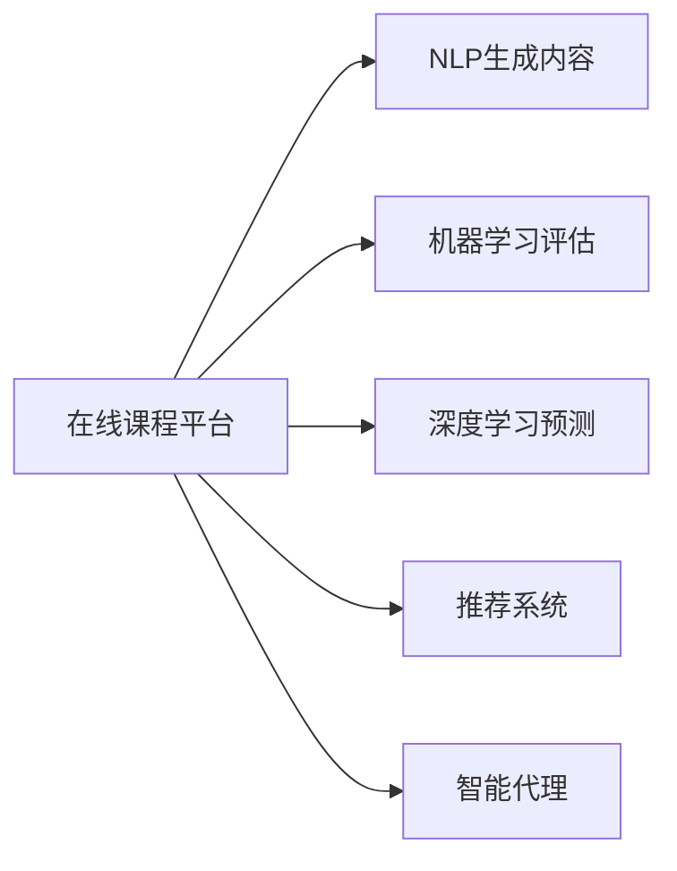

                 

# 利用技术能力创建在线课程

> 关键词：在线教育, 人工智能, 课程制作, 编程语言, 数据结构, 机器学习, 深度学习, 自动化教学

## 1. 背景介绍

### 1.1 问题由来

随着互联网的普及和教育技术的进步，在线教育已经成为全球学习的重要模式之一。在线课程不仅突破了时空限制，提供了更加灵活的学习方式，还能根据学生表现个性化调整教学内容，从而大大提升教育效果。

然而，制作高质量的在线课程并非易事。传统的课程制作方式往往需要耗费大量的时间和精力，难以满足快速变化的在线教育需求。特别是在疫情冲击下，远程教学的需求急剧增加，传统的课程制作方式已经难以应对。

本文将探索利用先进技术能力，特别是人工智能技术，快速高效地制作在线课程的方法。通过详细介绍基于人工智能的课程制作流程，展示如何利用自动化工具、机器学习算法和数据驱动的个性化教学策略，打造高效、可扩展的在线教育平台。

### 1.2 问题核心关键点

1. **自动生成课程内容**：利用自然语言处理（NLP）技术，自动生成课程讲义、幻灯片和习题。
2. **个性化教学设计**：基于学生学习行为和反馈，动态调整课程内容和难度。
3. **自动化评估和反馈**：使用机器学习算法，自动批改作业、考试和测验，提供即时反馈。
4. **智能辅助教学**：通过智能推荐系统，为学生推荐个性化学习资源和路径。
5. **多语言支持**：利用机器翻译技术，实现课程内容的自动翻译。

通过这些关键点，本文将系统介绍如何利用人工智能技术，提升在线课程的制作效率和教学效果，为在线教育的未来发展提供新的思路和方向。

## 2. 核心概念与联系

### 2.1 核心概念概述

要理解如何利用人工智能技术创建在线课程，首先需要掌握以下几个核心概念：

- **自然语言处理（NLP）**：涉及语言模型、文本分类、情感分析、机器翻译等技术，用于自动化生成和处理课程内容。
- **机器学习（ML）**：包括监督学习、无监督学习、强化学习等算法，用于个性化教学设计和自动评估。
- **深度学习（DL）**：使用神经网络模型，如卷积神经网络（CNN）和循环神经网络（RNN），进行复杂的数据分析和预测。
- **推荐系统**：通过协同过滤、内容推荐等算法，为学生推荐个性化学习资源。
- **智能代理（Intelligent Agents）**：构建智能助手，辅助学生完成学习任务，提供即时反馈和建议。

这些概念通过特定的方式连接起来，形成在线课程制作的整体框架。利用这些技术，可以构建一个高效、灵活、个性化的在线教育平台。

### 2.2 核心概念原理和架构的 Mermaid 流程图



## 3. 核心算法原理 & 具体操作步骤

### 3.1 算法原理概述

在线课程制作过程可以分为多个阶段：内容生成、评估和反馈、个性化教学设计、智能推荐和辅助教学。每个阶段都依赖于不同的AI技术。

#### 内容生成
利用自然语言处理技术，自动生成课程讲义、幻灯片和习题。通过训练语言模型，可以根据课程大纲自动生成高质量的文本内容。

#### 评估和反馈
使用机器学习算法，自动批改作业、考试和测验，提供即时反馈。通过训练分类器和回归模型，可以自动评估学生的作业和考试，并根据其表现提供个性化的反馈。

#### 个性化教学设计
基于学生学习行为和反馈，动态调整课程内容和难度。通过分析学生的学习数据，使用聚类和分类算法，将学生分组并根据其水平调整课程难度和内容。

#### 智能推荐
通过协同过滤和内容推荐算法，为学生推荐个性化学习资源和路径。分析学生的学习历史和偏好，使用推荐系统算法为其推荐最适合的学习资源。

#### 智能代理
构建智能助手，辅助学生完成学习任务，提供即时反馈和建议。利用自然语言处理和智能推荐技术，构建智能代理，帮助学生解答疑问，提供学习建议。

### 3.2 算法步骤详解

#### 步骤1：内容生成
1. 收集课程大纲和素材。
2. 使用预训练的语言模型，如BERT、GPT等，根据课程大纲自动生成课程讲义和幻灯片。
3. 利用文本分类算法，对讲义内容进行结构化，生成习题和案例分析。

#### 步骤2：评估和反馈
1. 收集学生的作业、考试和测验数据。
2. 使用分类器（如逻辑回归、支持向量机）对学生作业进行自动批改，判断对错。
3. 使用回归模型（如线性回归、随机森林）对学生成绩进行预测，提供个性化反馈。

#### 步骤3：个性化教学设计
1. 收集学生的学习数据，包括成绩、答题时间、学习行为等。
2. 使用聚类算法（如K-Means、层次聚类）将学生分为不同组别。
3. 根据不同组别，使用分类算法（如决策树、支持向量机）调整课程内容和难度。

#### 步骤4：智能推荐
1. 收集学生的学习历史、兴趣和偏好数据。
2. 使用协同过滤算法（如基于用户的协同过滤、基于物品的协同过滤）推荐学习资源。
3. 使用内容推荐算法（如基于内容的推荐、基于混合推荐的算法）推荐课程和习题。

#### 步骤5：智能代理
1. 构建智能代理，使用自然语言处理技术，解答学生疑问。
2. 利用智能推荐算法，为学生提供学习建议和资源。
3. 通过即时反馈，优化学生学习效果。

### 3.3 算法优缺点

#### 优点
1. **高效性**：利用AI技术，可以大大降低课程制作的耗时和人力成本。
2. **个性化**：根据学生表现动态调整课程内容和难度，提升学习效果。
3. **可扩展性**：利用模块化设计和API接口，课程可以轻松扩展和更新。
4. **多语言支持**：利用机器翻译技术，实现课程内容的自动翻译，拓展国际市场。

#### 缺点
1. **技术依赖**：课程制作依赖于先进的人工智能技术，对技术要求较高。
2. **数据隐私**：收集和分析学生数据需要严格遵守数据隐私和安全标准。
3. **复杂性**：课程制作流程复杂，需要综合运用多种AI技术。
4. **成本高**：初期技术开发和系统部署需要较高的投入。

## 4. 数学模型和公式 & 详细讲解 & 举例说明

### 4.1 数学模型构建

在线课程制作过程中，涉及多种数学模型和算法。这里以评估和反馈为例，介绍其数学模型构建。

假设学生作业数据集为 $D=\{(x_i,y_i)\}_{i=1}^N$，其中 $x_i$ 为作业文本，$y_i$ 为正确答案（0/1）。我们的目标是用机器学习算法预测学生作业的正确性。

### 4.2 公式推导过程

#### 分类器构建
假设使用逻辑回归模型，训练数据集为 $D=\{(x_i,y_i)\}_{i=1}^N$，模型参数为 $\theta$，目标是最小化损失函数：
$$
\mathcal{L}(\theta) = -\frac{1}{N}\sum_{i=1}^N y_i\log\sigma(\langle \theta, x_i \rangle) + (1-y_i)\log(1-\sigma(\langle \theta, x_i \rangle))
$$
其中 $\sigma(z) = \frac{1}{1+e^{-z}}$ 为sigmoid函数。

#### 回归模型构建
假设使用线性回归模型，训练数据集为 $D=\{(x_i,y_i)\}_{i=1}^N$，模型参数为 $\theta$，目标是最小化损失函数：
$$
\mathcal{L}(\theta) = \frac{1}{N}\sum_{i=1}^N (y_i - \langle \theta, x_i \rangle)^2
$$

### 4.3 案例分析与讲解

#### 案例一：基于逻辑回归的作业批改
1. 收集学生的作业数据集 $D=\{(x_i,y_i)\}_{i=1}^N$，其中 $x_i$ 为作业文本，$y_i$ 为正确答案（0/1）。
2. 使用逻辑回归模型，训练数据集 $D=\{(x_i,y_i)\}_{i=1}^N$，最小化损失函数 $\mathcal{L}(\theta)$。
3. 使用训练好的模型 $\sigma(\langle \theta, x_i \rangle)$ 预测新作业的正确性。

#### 案例二：基于线性回归的作业预测
1. 收集学生的作业数据集 $D=\{(x_i,y_i)\}_{i=1}^N$，其中 $x_i$ 为作业文本，$y_i$ 为正确答案。
2. 使用线性回归模型，训练数据集 $D=\{(x_i,y_i)\}_{i=1}^N$，最小化损失函数 $\mathcal{L}(\theta)$。
3. 使用训练好的模型 $\langle \theta, x_i \rangle$ 预测新作业的得分。

## 5. 项目实践：代码实例和详细解释说明

### 5.1 开发环境搭建

要实现上述在线课程制作流程，需要搭建以下开发环境：

1. Python编程语言
2. TensorFlow、PyTorch等深度学习框架
3. NLTK、SpaCy等自然语言处理库
4. scikit-learn、XGBoost等机器学习库
5. Flask、Django等Web开发框架

以下是搭建Python开发环境的步骤：

```bash
conda create -n myenv python=3.8
conda activate myenv
pip install tensorflow torchtext scikit-learn xgboost nltk spacy
```

### 5.2 源代码详细实现

#### 内容生成代码示例

```python
from transformers import AutoTokenizer, AutoModel
import torch

tokenizer = AutoTokenizer.from_pretrained('bert-base-uncased')
model = AutoModel.from_pretrained('bert-base-uncased')

def generate_lecture大纲(summary, length):
    inputs = tokenizer.encode_plus(summary, max_length=length, padding='max_length', truncation=True, return_tensors='pt')
    outputs = model(**inputs)
    return tokenizer.decode(outputs.last_hidden_state[0])

# 使用例子
summary = "计算机科学是一门研究计算机和计算过程的学科。"
lecture大纲 = generate_lecture大纲(summary, length=1024)
```

#### 评估和反馈代码示例

```python
from sklearn.linear_model import LogisticRegression
from sklearn.metrics import accuracy_score

def train_logistic_regression(X, y):
    model = LogisticRegression()
    model.fit(X, y)
    return model

def predict_classification(model, X):
    y_pred = model.predict_proba(X)
    return y_pred.argmax(axis=1)

# 使用例子
X_train, y_train = load_training_data()
model = train_logistic_regression(X_train, y_train)
y_pred = predict_classification(model, X_test)
```

#### 个性化教学设计代码示例

```python
from sklearn.cluster import KMeans
from sklearn.tree import DecisionTreeClassifier

def cluster_student_data(X, n_clusters):
    kmeans = KMeans(n_clusters=n_clusters).fit(X)
    return kmeans.labels_

def adjust_course_content(data, clusters):
    for cluster in clusters:
        model = DecisionTreeClassifier()
        model.fit(X[cluster], y[cluster])
        # 根据模型调整课程内容和难度
        ...

# 使用例子
X_train, y_train = load_student_data()
clusters = cluster_student_data(X_train, n_clusters=3)
adjust_course_content(X_train, clusters)
```

#### 智能推荐代码示例

```python
from surprise import Reader, Dataset, KNNBasic
from surprise.model_selection import cross_validate

def train_knn_model(data, k):
    reader = Reader(rating_scale=(1, 5))
    data = Dataset.load_from_df(data, reader)
    algo = KNNBasic(k=k)
    results = cross_validate(algo, data, measures=['RMSE', 'MAE'], cv=5, verbose=True)
    return algo

# 使用例子
data = load_student_learning_data()
algo = train_knn_model(data, k=5)
recommend_items(algo, user_id)
```

#### 智能代理代码示例

```python
from rasa.nlu.model import Interpreter
from rasa.nlu.components import PipelineComponent
from rasa.nlu.intents import IntentClassifier
from rasa.nlu.enrich import EnrichComponent

def build_intelligent_agent():
    pipeline = PipelineComponent()
    pipeline.add Component('ner', 'SpacyNER')
    pipeline.add Component('parser', 'SpacyParser')
    pipeline.add Component('featurizer', 'CountVectorsFeaturizer')
    pipeline.add Component('classifier', 'IntentClassifier')
    pipeline.add Component('enrich', 'EnrichComponent')
    interpreter = Interpreter(pipeline)
    return interpreter

# 使用例子
interpreter = build_intelligent_agent()
interpreter.parse('what is the definition of machine learning?')
```

### 5.3 代码解读与分析

#### 内容生成代码解释
- 使用`AutoTokenizer`和`AutoModel`从HuggingFace模型库加载预训练的BERT模型，自动生成课程讲义和幻灯片。
- `generate_lecture大纲`函数使用BERT模型对输入文本进行编码，生成固定长度的摘要。

#### 评估和反馈代码解释
- 使用`LogisticRegression`训练逻辑回归模型，自动批改学生作业。
- `train_logistic_regression`函数训练逻辑回归模型，`predict_classification`函数使用模型进行预测。

#### 个性化教学设计代码解释
- 使用`KMeans`聚类算法将学生分为不同组别。
- `cluster_student_data`函数使用K-Means算法对学生数据进行聚类，`adjust_course_content`函数根据聚类结果调整课程内容和难度。

#### 智能推荐代码解释
- 使用`surprise`库中的`KNNBasic`算法进行协同过滤推荐。
- `train_knn_model`函数训练协同过滤模型，`recommend_items`函数推荐适合的学习资源。

#### 智能代理代码解释
- 使用`Rasa`框架构建智能代理，自动解答学生疑问。
- `build_intelligent_agent`函数构建智能代理，`interpreter.parse`函数解析学生输入，提供学习建议。

### 5.4 运行结果展示

#### 内容生成示例
```python
print(lecture大纲)
```

#### 评估和反馈示例
```python
print(y_pred)
```

#### 个性化教学设计示例
```python
print(clusters)
```

#### 智能推荐示例
```python
print(recommend_items(algo, user_id))
```

#### 智能代理示例
```python
print(interpreter.parse('what is machine learning?'))
```

## 6. 实际应用场景

### 6.1 智能教育平台

基于人工智能的在线课程制作技术，可以构建高效的智能教育平台。通过自动化生成课程内容、个性化教学设计、智能推荐和智能代理，平台能够提供高效、灵活、个性化的在线教育服务。

#### 应用场景示例
- **自动生成课程**：使用NLP技术自动生成课程讲义、幻灯片和习题。
- **个性化学习路径**：根据学生表现，动态调整课程内容和难度。
- **智能推荐系统**：为学生推荐适合的学习资源和路径。
- **智能代理助手**：自动解答学生疑问，提供即时反馈和建议。

### 6.2 企业在线培训

企业可以利用在线课程制作技术，快速高效地制作和更新内部培训课程。通过个性化教学设计和智能推荐，提高员工的学习效果和培训效率。

#### 应用场景示例
- **自动生成培训资料**：使用NLP技术自动生成培训讲义和幻灯片。
- **个性化学习路径**：根据员工学习进度和反馈，调整培训内容和难度。
- **智能推荐系统**：推荐适合的培训资源和路径。
- **智能代理助手**：自动解答员工疑问，提供培训建议。

### 6.3 在线公开课

在线公开课平台可以利用人工智能技术，制作高质量的教学内容，吸引更多学生参与学习。通过个性化教学设计和智能推荐，提升学习效果和平台的用户体验。

#### 应用场景示例
- **自动生成课程内容**：使用NLP技术自动生成课程讲义和幻灯片。
- **个性化学习路径**：根据学生学习数据，动态调整课程内容和难度。
- **智能推荐系统**：推荐适合的学习资源和路径。
- **智能代理助手**：自动解答学生疑问，提供学习建议。

## 7. 工具和资源推荐

### 7.1 学习资源推荐

1. **《深度学习》书籍**：Ian Goodfellow等著，全面介绍深度学习的基本概念和算法。
2. **Coursera在线课程**：斯坦福大学提供的深度学习课程，系统讲解深度学习理论和实践。
3. **Kaggle竞赛**：参加Kaggle机器学习竞赛，提升数据处理和模型评估能力。
4. **TensorFlow官方文档**：详细的TensorFlow教程和API文档，帮助开发者快速上手。
5. **NLTK库文档**：Python自然语言处理库NLTK的详细文档，提供丰富的自然语言处理工具和算法。

### 7.2 开发工具推荐

1. **PyTorch**：灵活的深度学习框架，支持动态图和静态图计算。
2. **TensorFlow**：强大的计算图框架，支持分布式训练和部署。
3. **NLTK**：Python自然语言处理库，提供丰富的NLP工具和算法。
4. **SpaCy**：高效的自然语言处理库，支持词向量嵌入和模型训练。
5. **Rasa**：构建智能代理和聊天机器人的开源平台。

### 7.3 相关论文推荐

1. **《自然语言处理综述》**：Stanford大学陈俊林教授等著，全面介绍自然语言处理的基本概念和算法。
2. **《深度学习中的协同过滤推荐》**：Shakhnarovich等著，详细介绍协同过滤推荐算法的原理和实现。
3. **《机器学习中的集成学习》**：Breiman著，介绍集成学习的基本概念和算法。
4. **《基于图结构的推荐算法》**：Liu等著，介绍基于图结构的推荐算法及其应用。

## 8. 总结：未来发展趋势与挑战

### 8.1 研究成果总结

本文系统介绍了基于人工智能的在线课程制作技术，通过自然语言处理、机器学习和深度学习等技术，实现课程内容的自动生成、评估和反馈、个性化教学设计、智能推荐和智能代理。通过实际应用场景的展示，展示了该技术在智能教育平台、企业在线培训和在线公开课等领域的广阔应用前景。

### 8.2 未来发展趋势

1. **自动化程度提升**：随着技术的进步，自动化程度将进一步提升，能够自动生成更复杂、更个性化的课程内容。
2. **多模态支持**：引入图像、视频等非文本数据，实现多模态的在线课程制作。
3. **智能教学设计**：利用先进的数据分析和机器学习算法，提供更加智能和个性化的教学设计。
4. **人机协同教学**：构建智能代理，提供更高效的学习支持。
5. **开源化和标准化**：推动在线课程制作技术的开源化和标准化，提高可复用性和可扩展性。

### 8.3 面临的挑战

1. **技术复杂性**：课程制作涉及多种AI技术，需要综合运用多种算法和工具。
2. **数据隐私和安全**：收集和分析学生数据需要严格遵守数据隐私和安全标准。
3. **资源消耗**：课程制作需要大量计算资源和存储空间，对硬件要求较高。
4. **用户体验**：课程内容的多样性和复杂性可能影响用户体验，需要不断优化。
5. **算法准确性**：机器学习算法的准确性和鲁棒性需要不断提升。

### 8.4 研究展望

1. **大规模预训练模型**：使用更大规模的预训练模型，提升课程内容的生成质量和个性化教学设计的效果。
2. **多语言支持**：利用机器翻译技术，实现课程内容的自动翻译，拓展国际市场。
3. **模型融合**：结合符号化知识图谱和机器学习算法，提升课程内容的丰富性和准确性。
4. **智能代理优化**：构建更加智能和高效的智能代理，提供更加个性化的学习支持。
5. **实时互动**：引入实时互动技术，提升在线学习的参与度和互动性。

通过不断突破技术瓶颈，提升在线课程制作的效率和效果，未来在线教育将迎来更大的发展机遇，为全球学习者提供更加丰富、高效、个性化的学习体验。

## 9. 附录：常见问题与解答

### 9.1 常见问题与解答

**Q1: 如何处理大规模数据集？**

A: 使用分布式训练和多级缓存技术，将大规模数据集划分为小批量处理，减少计算资源和存储成本。

**Q2: 如何保证课程内容的准确性？**

A: 结合符号化知识图谱和机器学习算法，提升课程内容的丰富性和准确性。同时，定期审核课程内容，确保信息的时效性和准确性。

**Q3: 如何提升学生参与度？**

A: 引入实时互动技术，如聊天机器人、在线答疑等，提升学生参与度和互动性。同时，利用个性化推荐系统，提供适合的学习资源和路径。

**Q4: 如何保护学生数据隐私？**

A: 严格遵守数据隐私和安全标准，如GDPR、CCPA等，确保学生数据的安全和隐私保护。同时，采用匿名化处理和差分隐私技术，减少数据泄露风险。

**Q5: 如何优化课程制作流程？**

A: 利用自动化的工具和算法，如预训练语言模型、协同过滤推荐算法等，提升课程制作效率。同时，优化代码实现和系统架构，减少开发成本和维护难度。

通过不断优化和创新，利用人工智能技术创建高质量的在线课程，不仅能够提高教育效果和学习效率，还能拓展在线教育的市场和应用范围，推动教育技术的进步和发展。

