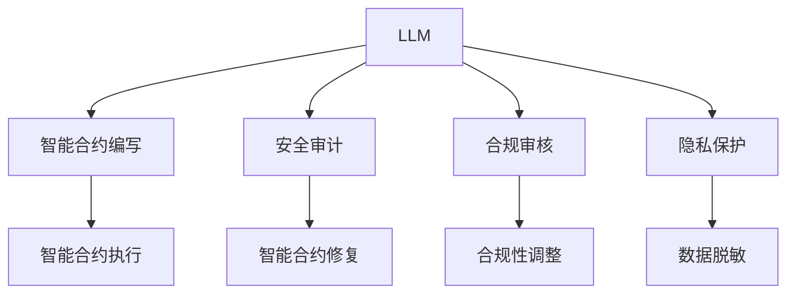

                 

## 1. 背景介绍

随着人工智能技术的不断成熟，大型语言模型（Large Language Models，LLMs）正在被广泛应用于各个领域，其中加密货币行业也不例外。LLMs在加密货币中的应用主要集中在智能合约、安全审计、合规审核等方面。然而，与一般的应用场景不同，加密货币行业具有高度的敏感性和复杂性，这就对LLMs的安全性和合规性提出了更高的要求。如何在满足这些要求的同时，充分利用LLMs的强大能力，是当前需要解决的一个重要问题。

### 1.1 加密货币与LLM的结合

在加密货币领域，智能合约是自动化执行和执行后不可逆转的交易程序，它们被广泛用于各种去中心化的金融应用中。智能合约的安全性和合规性是确保其可靠性和可信度的关键因素。而LLMs能够理解和处理复杂的自然语言，因此在编写智能合约、安全审计和合规审核等方面具有重要的应用价值。例如，LLMs可以自动解析合同条款，识别潜在的漏洞和合规风险，并提供相应的建议。

### 1.2 安全和合规的需求

在加密货币行业中，安全和合规是两个至关重要的方面。安全和合规不仅涉及货币交易的安全性，还涉及交易的合法性和合规性。传统的加密货币交易平台可能会通过各种方式确保交易的安全性和合规性，如使用多签名机制、反洗钱（AML）检测等。然而，这些方法往往需要耗费大量的时间和资源，且可能存在技术上的漏洞。而LLMs可以通过自然语言处理和逻辑推理，自动识别和修复这些问题，从而提高交易的安全性和合规性。

## 2. 核心概念与联系

### 2.1 核心概念概述

为了更好地理解加密货币和LLM在安全和合规方面的结合，我们首先介绍一些核心概念：

- **大型语言模型（LLM）**：以Transformer模型为基础的深度学习模型，能够理解和生成人类语言，广泛应用于自然语言处理（NLP）领域。
- **智能合约**：一种基于区块链的自动化合约，能够在满足特定条件时自动执行。
- **安全审计**：对智能合约进行安全漏洞检测和修复的过程，确保其可靠性和安全性。
- **合规审核**：对智能合约是否符合相关法律法规进行审核，确保其合法性和合规性。
- **隐私保护**：在处理涉及隐私信息的操作时，确保数据的安全性和合法性。

### 2.2 核心概念原理和架构的 Mermaid 流程图



该图展示了LLM在加密货币应用中的核心概念和其联系。LLM在编写智能合约、进行安全审计和合规审核、实现隐私保护等方面都有重要的应用价值。

## 3. 核心算法原理 & 具体操作步骤

### 3.1 算法原理概述

加密货币和LLM结合的算法原理基于以下几个关键步骤：

1. **预训练**：使用大规模无标签数据对LLM进行预训练，使其能够理解和处理复杂的自然语言。
2. **微调**：在特定领域的标注数据上对预训练的LLM进行微调，使其能够适应加密货币行业的需求。
3. **安全审计**：使用微调的LLM对智能合约进行安全审计，检测潜在的漏洞。
4. **合规审核**：使用微调的LLM对智能合约进行合规性审核，确保其符合法律法规。
5. **隐私保护**：在处理涉及隐私信息的操作时，使用微调的LLM进行数据脱敏和隐私保护。

### 3.2 算法步骤详解

以下详细介绍每个步骤的具体操作：

**步骤1：预训练**

- **数据准备**：收集大规模无标签的文本数据，如法律法规、合同条款等。
- **模型选择**：选择适当的LLM模型，如GPT-3、BERT等。
- **训练**：使用收集的数据对模型进行预训练，使其能够理解和处理自然语言。

**步骤2：微调**

- **数据准备**：收集特定领域的标注数据，如智能合约模板、法律法规等。
- **模型选择**：选择与特定领域相关的微调模型，如针对智能合约的微调模型。
- **微调**：在标注数据上对预训练的LLM进行微调，使其能够适应特定领域的需求。

**步骤3：安全审计**

- **智能合约分析**：使用微调的LLM对智能合约进行分析，识别潜在的漏洞。
- **漏洞修复**：根据分析结果，对智能合约进行修复，确保其安全性。

**步骤4：合规审核**

- **法律法规查询**：使用微调的LLM查询智能合约涉及的法律法规。
- **合规性评估**：根据法律法规对智能合约进行合规性评估，确保其符合法律法规。

**步骤5：隐私保护**

- **数据收集**：收集涉及隐私的敏感数据。
- **数据脱敏**：使用微调的LLM对敏感数据进行脱敏处理，确保数据的安全性和合法性。

### 3.3 算法优缺点

**优点**：
- **高效性**：LLM可以自动分析和处理复杂的自然语言，减少人工干预的时间和成本。
- **准确性**：LLM能够准确地识别潜在的漏洞和合规风险，提高智能合约的安全性和合规性。
- **灵活性**：LLM可以根据不同的领域和任务进行微调，适应不同的需求。

**缺点**：
- **依赖标注数据**：微调的LLM需要高质量的标注数据，获取这些数据可能较为困难。
- **解释性不足**：LLM的决策过程较为复杂，难以解释其内部工作机制。
- **安全性风险**：LLM可能学习到有害信息，对智能合约的安全性和合规性造成威胁。

### 3.4 算法应用领域

基于LLM的安全和合规算法已经在加密货币行业得到了广泛应用，主要包括以下几个领域：

1. **智能合约编写**：使用微调的LLM自动生成智能合约，减少编写时间和成本。
2. **安全审计**：使用微调的LLM进行智能合约的安全审计，识别潜在的漏洞。
3. **合规审核**：使用微调的LLM对智能合约进行合规性审核，确保其符合法律法规。
4. **隐私保护**：使用微调的LLM对敏感数据进行脱敏处理，确保数据的安全性和合法性。

## 4. 数学模型和公式 & 详细讲解 & 举例说明

### 4.1 数学模型构建

在加密货币和LLM结合的算法中，我们主要使用Transformer模型进行预训练和微调。Transformer模型由多层自注意力机制组成，可以处理长序列的文本数据，并且具有较好的计算效率。

### 4.2 公式推导过程

Transformer模型的公式推导过程如下：

设输入序列为 $X$，输出序列为 $Y$，模型的参数为 $\theta$。在预训练阶段，模型的目标是最小化损失函数 $L(X, Y; \theta)$，其中：

$$
L(X, Y; \theta) = -\frac{1}{N} \sum_{i=1}^N \log P(Y_i | X_i; \theta)
$$

在微调阶段，模型的目标是最小化损失函数 $L(X, Y; \theta)$，其中：

$$
L(X, Y; \theta) = -\frac{1}{N} \sum_{i=1}^N \log P(Y_i | X_i; \theta)
$$

### 4.3 案例分析与讲解

以智能合约编写为例，微调的LLM可以通过分析合同条款，自动生成符合法律法规要求的智能合约模板。在这个过程中，LLM需要对自然语言进行理解、分析和生成，具体步骤如下：

1. **自然语言理解**：使用预训练的LLM对合同条款进行理解，提取关键信息。
2. **规则生成**：根据提取的关键信息和法律法规，生成符合要求的智能合约模板。
3. **模板优化**：使用微调的LLM对生成的模板进行优化，确保其合法性和合规性。

## 5. 项目实践：代码实例和详细解释说明

### 5.1 开发环境搭建

在开发过程中，我们需要使用Python、PyTorch、TensorFlow等工具。具体的开发环境搭建步骤如下：

1. **安装Python和相关库**：使用Anaconda或Miniconda安装Python 3.6或更高版本，并使用pip安装所需的库，如TensorFlow、PyTorch、NLTK等。
2. **安装GPU**：如果需要使用GPU加速，则需要安装相应的GPU驱动和CUDA工具包。
3. **创建虚拟环境**：使用虚拟环境管理工具创建虚拟环境，如venv或conda。
4. **安装LLM模型**：使用Hugging Face等平台下载预训练的LLM模型。

### 5.2 源代码详细实现

以下是一个简单的智能合约编写的代码示例：

```python
import torch
import transformers
from transformers import BertForSequenceClassification, BertTokenizer

# 加载预训练的模型和分词器
model_name = 'bert-base-cased'
tokenizer = BertTokenizer.from_pretrained(model_name)
model = BertForSequenceClassification.from_pretrained(model_name, num_labels=2)

# 加载智能合约模板
template = '智能合约模板文本'
# 对模板进行分词和编码
inputs = tokenizer(template, return_tensors='pt')

# 使用模型对模板进行分类
outputs = model(inputs['input_ids'], attention_mask=inputs['attention_mask'])
logits = outputs.logits

# 对结果进行解释和优化
if logits.argmax().item() == 0:
    # 不符合要求，需要重新生成模板
    pass
else:
    # 符合要求，可以使用模板
    pass
```

### 5.3 代码解读与分析

在上述代码中，我们使用了BertForSequenceClassification模型和BertTokenizer对智能合约模板进行分类。首先，使用分词器将模板进行分词和编码，然后将其输入到模型中进行分类。最后，根据分类结果对模板进行优化或重新生成。

### 5.4 运行结果展示

运行上述代码，可以得到智能合约模板的分类结果。如果结果为0，则说明模板不符合要求，需要进行优化；如果结果为1，则说明模板符合要求，可以使用。

## 6. 实际应用场景

### 6.1 智能合约编写

在智能合约编写中，使用微调的LLM可以自动生成符合法律法规要求的智能合约模板，减少编写时间和成本。同时，LLM可以自动检查合同条款，识别潜在的漏洞，并提供相应的修复建议，提高智能合约的安全性和合规性。

### 6.2 安全审计

在安全审计中，使用微调的LLM对智能合约进行安全漏洞检测，可以自动分析和发现潜在的风险，确保智能合约的安全性。LLM可以根据发现的漏洞，自动生成修复建议，提高修复效率。

### 6.3 合规审核

在合规审核中，使用微调的LLM查询智能合约涉及的法律法规，并对其进行合规性评估，确保智能合约符合法律法规。LLM可以自动处理复杂的法律法规文本，提高审核效率。

### 6.4 未来应用展望

未来，随着LLM技术的发展，加密货币行业将有更多的应用场景。LLM可以用于智能合约的自动执行、跨链操作的自动化管理等方面。同时，LLM还可以结合区块链技术，构建更加智能、安全的加密货币生态系统。

## 7. 工具和资源推荐

### 7.1 学习资源推荐

为了帮助开发者掌握LLM在加密货币中的应用，我们推荐以下学习资源：

1. **《深度学习》（Deep Learning）**：由Ian Goodfellow等人合著，是一本深入介绍深度学习的经典教材。
2. **《自然语言处理综论》（Speech and Language Processing）**：由Daniel Jurafsky和James H. Martin合著，涵盖自然语言处理的各个方面。
3. **《Hugging Face Transformers》**：Hugging Face发布的官方文档，详细介绍了如何使用Transformer模型进行NLP任务。
4. **《加密货币原理》（Principles of Cryptocurrency）**：一本介绍加密货币基本原理的书籍，适合入门读者。
5. **《智能合约安全》（Smart Contract Security）**：一本介绍智能合约安全的书籍，涵盖智能合约的编写、审计和测试等方面。

### 7.2 开发工具推荐

在开发过程中，我们推荐使用以下工具：

1. **Anaconda**：一个开源的Python发行版，支持虚拟环境管理。
2. **TensorFlow**：一个广泛使用的深度学习框架，支持GPU加速。
3. **PyTorch**：一个灵活的深度学习框架，支持动态计算图。
4. **Hugging Face Transformers**：一个基于Python的NLP库，支持多种预训练模型。
5. **NLTK**：一个自然语言处理工具包，提供丰富的文本处理功能。

### 7.3 相关论文推荐

以下是几篇关于加密货币和LLM结合的论文，推荐阅读：

1. **《使用大型语言模型进行智能合约自动生成》（Automatic Smart Contract Generation Using Large Language Models）**：介绍了使用LLM自动生成智能合约的流程和方法。
2. **《智能合约安全审计中的自然语言处理》（Natural Language Processing for Smart Contract Security Auditing）**：介绍了使用LLM对智能合约进行安全审计的实践。
3. **《基于自然语言处理的安全合规审计》（A Security and Compliance Audit Using Natural Language Processing）**：介绍了使用LLM进行合规审核的流程和方法。
4. **《使用自然语言处理进行隐私保护》（Privacy Protection Using Natural Language Processing）**：介绍了使用LLM进行数据脱敏和隐私保护的技术。

## 8. 总结：未来发展趋势与挑战

### 8.1 研究成果总结

在加密货币和LLM结合的研究中，我们已经取得了显著的成果。LLM在智能合约编写、安全审计、合规审核和隐私保护等方面具有广泛的应用价值。然而，这些应用仍面临一些挑战，如依赖标注数据、解释性不足、安全性风险等。

### 8.2 未来发展趋势

未来，LLM在加密货币中的应用将更加广泛和深入。随着LLM技术的不断发展，我们可以预见以下趋势：

1. **模型规模增大**：预训练的LLM将变得更加强大，能够处理更复杂的自然语言任务。
2. **多模态融合**：将LLM与其他模态的数据处理技术结合，如视觉、语音等，提高智能合约的全面性和安全性。
3. **自动化执行**：LLM可以用于智能合约的自动执行，减少人工干预，提高执行效率。
4. **跨链操作**：LLM可以用于跨链操作的自动化管理，提高交易效率和安全性。

### 8.3 面临的挑战

在LLM在加密货币中的应用中，仍面临以下挑战：

1. **数据依赖**：LLM需要大量高质量的标注数据，获取这些数据可能较为困难。
2. **安全性风险**：LLM可能学习到有害信息，对智能合约的安全性和合规性造成威胁。
3. **解释性不足**：LLM的决策过程较为复杂，难以解释其内部工作机制。
4. **资源消耗**：预训练和微调的LLM需要大量计算资源，可能会带来成本负担。

### 8.4 研究展望

未来，我们需要在以下几个方面进行深入研究：

1. **无监督学习**：开发无监督或半监督的学习方法，降低对标注数据的依赖。
2. **解释性增强**：研究如何提高LLM的解释性，使其决策过程更加透明和可解释。
3. **安全性保障**：开发更加安全、可靠的LLM，避免学习有害信息。
4. **资源优化**：优化LLM的资源消耗，降低成本。

## 9. 附录：常见问题与解答

**Q1：如何选择合适的预训练模型？**

A: 选择预训练模型时，需要考虑模型的规模、性能、适用场景等因素。通常来说，BERT和GPT系列模型在NLP领域表现较为出色，但在特定领域可能需要使用特定领域的预训练模型。

**Q2：预训练和微调的过程是否需要大量标注数据？**

A: 预训练过程需要大量的无标签数据，通常使用大规模的语料库进行训练。微调过程需要少量的标注数据，但这些数据的质量对微调效果有重要影响。

**Q3：如何处理数据依赖问题？**

A: 可以采用无监督学习或半监督学习的方法，减少对标注数据的依赖。同时，可以尝试使用主动学习等技术，从少量标注数据中获取更多信息。

**Q4：如何提高LLM的解释性？**

A: 可以引入因果分析、博弈论等工具，增强LLM的决策解释性。同时，也可以尝试使用符号化的规则库与LLM结合，提高其可解释性。

**Q5：如何优化LLM的资源消耗？**

A: 可以采用模型压缩、稀疏化存储等技术，减少计算资源和存储空间的消耗。同时，可以通过分布式计算等方法，提高计算效率。

---

作者：禅与计算机程序设计艺术 / Zen and the Art of Computer Programming

