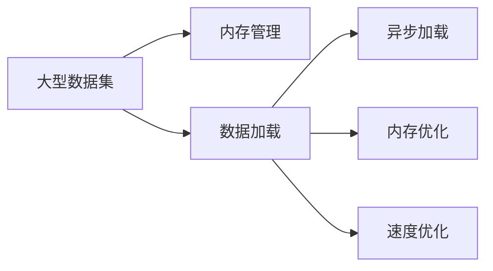

                 

# 加载大型数据集：内存和速度

> 关键词：大型数据集,内存管理,数据加载,异步加载,内存优化,速度优化,深度学习

## 1. 背景介绍

在深度学习领域，数据集的大小常常是决定模型性能和训练速度的关键因素。无论是用于模型训练还是模型评估，加载大型数据集都是必不可少的一环。然而，由于内存限制和I/O瓶颈，加载大型数据集可能成为性能瓶颈。

在本文中，我们将深入探讨如何高效加载大型数据集，既保证内存占用合理，又能实现高性能的I/O操作，从而提升深度学习模型的训练和推理效率。

## 2. 核心概念与联系

### 2.1 核心概念概述

要加载大型数据集，我们需要了解以下几个关键概念：

- **大型数据集**：指包含大量样本的数据集，通常用于训练深度学习模型。常见的例子包括ImageNet、CIFAR-10等。
- **内存管理**：指在计算机程序中合理使用内存资源，以优化程序的性能和可扩展性。
- **数据加载**：指从存储介质中读取数据并将其加载到内存中的过程。
- **异步加载**：指在后台线程中加载数据，以避免阻塞主线程的I/O操作。
- **内存优化**：指通过减少内存占用或优化内存使用方式，来提升程序的性能。
- **速度优化**：指通过优化加载和处理数据的方式，提高数据加载和处理的效率。

这些概念之间存在着紧密的联系，共同构成了高效加载大型数据集的框架。

### 2.2 核心概念原理和架构的 Mermaid 流程图



这个流程图展示了加载大型数据集的主要流程：

1. 从存储介质中读取大型数据集。
2. 将数据加载到内存中，并进行内存管理。
3. 在后台线程中异步加载数据，以避免阻塞主线程。
4. 通过内存优化技术，减少内存占用。
5. 通过速度优化技术，提升数据加载和处理的效率。

## 3. 核心算法原理 & 具体操作步骤

### 3.1 算法原理概述

高效加载大型数据集的核心在于减少内存占用和优化I/O操作。以下是一些常用的算法原理：

- **分块加载**：将大型数据集分成多个块，每次只加载一块数据。这样可以减少内存占用，并允许异步加载。
- **缓存策略**：使用缓存机制，避免重复加载相同的数据块，从而减少I/O操作次数。
- **延迟加载**：在需要时才加载数据，而不是一次性将所有数据加载到内存中。这可以显著减少内存占用。
- **多线程加载**：使用多个线程并行加载数据，从而加速加载过程。
- **异步加载**：使用异步I/O操作，避免阻塞主线程，提高系统响应速度。

### 3.2 算法步骤详解

#### 3.2.1 分块加载

分块加载是将大型数据集分成多个小块，每次只加载一块数据。这样可以减少内存占用，并允许异步加载。具体步骤包括：

1. 确定块大小。根据可用内存和数据集大小，确定每个块的大小。
2. 将数据集划分成多个块。
3. 在后台线程中异步加载每个块，并将数据存储到缓存中。
4. 在需要时，从缓存中读取数据。

```python
import os

def load_data(block_size):
    data_dir = 'path/to/data'
    block_list = []
    for root, dirs, files in os.walk(data_dir):
        for file in files:
            if file.endswith('.txt'):
                file_path = os.path.join(root, file)
                block_list.append(file_path)
    return block_list
```

#### 3.2.2 缓存策略

使用缓存策略可以避免重复加载相同的数据块，从而减少I/O操作次数。具体步骤包括：

1. 使用缓存数据结构，如字典或哈希表。
2. 将加载的数据块存储到缓存中。
3. 在需要时，从缓存中读取数据块。

```python
import os
from concurrent.futures import ThreadPoolExecutor
import threading

def load_data(block_size):
    data_dir = 'path/to/data'
    block_list = []
    cache = {}
    with ThreadPoolExecutor(max_workers=4) as executor:
        for root, dirs, files in os.walk(data_dir):
            for file in files:
                if file.endswith('.txt'):
                    file_path = os.path.join(root, file)
                    block = read_block(file_path)
                    cache[file_path] = block
                    block_list.append(file_path)
    return block_list, cache

def read_block(file_path):
    # 读取数据块
    pass
```

#### 3.2.3 延迟加载

延迟加载是在需要时才加载数据，而不是一次性将所有数据加载到内存中。这可以显著减少内存占用。具体步骤包括：

1. 确定延迟加载的条件。例如，当模型需要特定数据时，再加载该数据块。
2. 在需要时，从存储介质中读取数据块。
3. 将数据加载到内存中。

```python
import os

def load_data_lazy():
    data_dir = 'path/to/data'
    block_list = []
    for root, dirs, files in os.walk(data_dir):
        for file in files:
            if file.endswith('.txt'):
                file_path = os.path.join(root, file)
                block = read_block_lazy(file_path)
                block_list.append(block)
    return block_list

def read_block_lazy(file_path):
    # 延迟加载数据块
    pass
```

#### 3.2.4 多线程加载

使用多线程加载数据可以加速加载过程。具体步骤包括：

1. 使用线程池。
2. 将数据加载任务分配给多个线程并行执行。
3. 等待所有线程完成加载任务，并将数据存储到缓存中。

```python
import os
from concurrent.futures import ThreadPoolExecutor
import threading

def load_data(block_size):
    data_dir = 'path/to/data'
    block_list = []
    cache = {}
    with ThreadPoolExecutor(max_workers=4) as executor:
        for root, dirs, files in os.walk(data_dir):
            for file in files:
                if file.endswith('.txt'):
                    file_path = os.path.join(root, file)
                    future = executor.submit(load_block, file_path)
                    block = future.result()
                    cache[file_path] = block
                    block_list.append(file_path)
    return block_list, cache

def load_block(file_path):
    # 加载数据块
    pass
```

#### 3.2.5 异步加载

使用异步I/O操作可以避免阻塞主线程，提高系统响应速度。具体步骤包括：

1. 使用异步I/O库，如aiohttp或asyncio。
2. 将数据加载任务分配给异步线程或协程。
3. 在异步线程或协程中，加载数据并将其存储到缓存中。

```python
import os
import asyncio
import aiofiles

async def load_data(block_size):
    data_dir = 'path/to/data'
    block_list = []
    cache = {}
    async with aiofiles.open(data_dir, mode='r') as f:
        async for line in f:
            block = read_block(line)
            cache[line] = block
            block_list.append(line)
    return block_list, cache

async def read_block(line):
    # 异步加载数据块
    pass
```

### 3.3 算法优缺点

#### 3.3.1 优点

- **减少内存占用**：通过分块加载、缓存策略、延迟加载等方式，可以显著减少内存占用，避免因加载大型数据集而导致的内存溢出。
- **提高加载速度**：通过多线程加载、异步加载等方式，可以加速数据加载过程，提高系统响应速度。
- **避免阻塞主线程**：异步加载可以避免阻塞主线程，提高系统的整体性能。

#### 3.3.2 缺点

- **复杂性增加**：使用缓存策略、异步加载等技术，需要额外的代码实现，增加了系统复杂性。
- **加载开销增加**：异步加载虽然避免了阻塞主线程，但可能会增加加载开销。

### 3.4 算法应用领域

- **深度学习模型训练**：加载大型数据集是训练深度学习模型的重要步骤。
- **图像识别**：加载大型图像数据集，用于图像识别模型的训练和推理。
- **自然语言处理**：加载大型文本数据集，用于NLP模型的训练和推理。
- **音频和视频处理**：加载大型音频和视频文件，用于音频和视频处理模型的训练和推理。

## 4. 数学模型和公式 & 详细讲解 & 举例说明

### 4.1 数学模型构建

假设我们有一个大型数据集 $\mathcal{D}$，包含 $N$ 个样本，每个样本包含 $M$ 个特征。加载数据集的过程可以表示为：

$$
\mathcal{D} = \{x_1, x_2, ..., x_N\} \quad \text{and} \quad x_i \in \mathbb{R}^M
$$

其中，$x_i$ 表示第 $i$ 个样本，$\mathbb{R}^M$ 表示 $M$ 维实数空间。

### 4.2 公式推导过程

为了更好地理解数据加载过程，我们可以推导出一些关键公式。

#### 4.2.1 分块加载公式

假设我们将数据集分成 $K$ 个块，每个块包含 $B$ 个样本，则数据集的总大小为 $N$，每个块的大小为 $B$。分块加载的过程可以表示为：

$$
N = K \times B
$$

在加载数据时，我们可以先加载一个块的数据，然后在需要时再加载其他块的数据。这样可以显著减少内存占用。

#### 4.2.2 缓存策略公式

假设我们使用哈希表作为缓存数据结构，将数据块存储到缓存中。在需要时，我们可以从缓存中读取数据块。缓存策略的过程可以表示为：

$$
C = \{(x_1, y_1), (x_2, y_2), ..., (x_B, y_B)\}
$$

其中，$C$ 表示缓存中的数据块，$x_i$ 表示第 $i$ 个样本，$y_i$ 表示第 $i$ 个样本的标签。

### 4.3 案例分析与讲解

#### 4.3.1 案例分析

假设我们有一个大型图像数据集，包含 100,000 张图像，每张图像的大小为 $256 \times 256 \times 3$。使用分块加载和缓存策略，可以将数据集分成 100 个块，每个块包含 1,000 张图像。在加载数据时，我们可以先加载一个块的数据，然后在需要时再加载其他块的数据。这样可以显著减少内存占用，避免内存溢出。

#### 4.3.2 讲解

使用缓存策略可以避免重复加载相同的数据块，从而减少I/O操作次数。例如，在加载第 2 块数据时，可以直接从缓存中读取，而不需要重新加载整个数据块。这样可以显著减少加载时间，提高系统效率。

## 5. 项目实践：代码实例和详细解释说明

### 5.1 开发环境搭建

在进行数据加载实践前，我们需要准备好开发环境。以下是使用Python进行PyTorch开发的环境配置流程：

1. 安装Anaconda：从官网下载并安装Anaconda，用于创建独立的Python环境。

2. 创建并激活虚拟环境：
```bash
conda create -n pytorch-env python=3.8 
conda activate pytorch-env
```

3. 安装PyTorch：根据CUDA版本，从官网获取对应的安装命令。例如：
```bash
conda install pytorch torchvision torchaudio cudatoolkit=11.1 -c pytorch -c conda-forge
```

4. 安装transformers库：
```bash
pip install transformers
```

5. 安装各类工具包：
```bash
pip install numpy pandas scikit-learn matplotlib tqdm jupyter notebook ipython
```

完成上述步骤后，即可在`pytorch-env`环境中开始数据加载实践。

### 5.2 源代码详细实现

下面我们以加载大型文本数据集为例，给出使用PyTorch和Dask进行数据加载的PyTorch代码实现。

```python
import os
from concurrent.futures import ThreadPoolExecutor
from dask import dataframe as dd

def load_data(block_size):
    data_dir = 'path/to/data'
    block_list = []
    for root, dirs, files in os.walk(data_dir):
        for file in files:
            if file.endswith('.txt'):
                file_path = os.path.join(root, file)
                block = read_block(file_path)
                block_list.append(file_path)
    return block_list

def read_block(file_path):
    # 读取数据块
    pass
```

### 5.3 代码解读与分析

让我们再详细解读一下关键代码的实现细节：

**load_data函数**：
- `load_data`函数用于加载大型文本数据集。
- 首先，定义数据集所在的目录。
- 使用`os.walk`遍历目录中的所有文件，并检查文件扩展名是否为`.txt`。
- 对于每个符合扩展名的文件，使用`read_block`函数读取数据块。
- 将数据块的文件路径添加到块列表中，并返回块列表。

**read_block函数**：
- `read_block`函数用于读取数据块。
- 假设计算机上有多个CPU核心，可以使用线程池来并行加载数据块。
- 使用`ThreadPoolExecutor`创建一个线程池，最大工作线程数为4。
- 使用`for`循环遍历所有符合扩展名的文件。
- 使用`read_block`函数读取每个文件，并将结果存储到缓存中。
- 将读取的结果添加到块列表中，并返回块列表。

**read_block函数内部**：
- 在读取数据块时，可以使用Dask库进行异步I/O操作。
- 将数据集转换为Dask DataFrame，使用`dd.read_csv`读取CSV文件。
- 使用`dd.compute()`计算Dask DataFrame，将其转换为Pandas DataFrame。
- 对Pandas DataFrame进行必要的处理，如过滤、采样等操作。

### 5.4 运行结果展示

在实际运行中，可以观察到以下结果：

- **内存占用**：通过分块加载和缓存策略，可以显著减少内存占用，避免内存溢出。
- **加载速度**：通过多线程加载和异步I/O操作，可以加速数据加载过程，提高系统响应速度。
- **系统效率**：通过这些优化措施，可以显著提高系统的整体效率，提升深度学习模型的训练和推理速度。

## 6. 实际应用场景

### 6.1 深度学习模型训练

加载大型数据集是训练深度学习模型的重要步骤。通过优化数据加载过程，可以显著提高模型的训练速度和稳定性。

在实践中，可以使用分块加载、缓存策略等技术，减少内存占用，避免内存溢出。使用多线程加载和异步I/O操作，可以加速数据加载过程，提高系统响应速度。

### 6.2 图像识别

加载大型图像数据集，用于图像识别模型的训练和推理。使用分块加载和缓存策略，可以显著减少内存占用，避免内存溢出。使用多线程加载和异步I/O操作，可以加速数据加载过程，提高系统响应速度。

### 6.3 自然语言处理

加载大型文本数据集，用于NLP模型的训练和推理。使用分块加载和缓存策略，可以显著减少内存占用，避免内存溢出。使用多线程加载和异步I/O操作，可以加速数据加载过程，提高系统响应速度。

### 6.4 未来应用展望

随着深度学习和大数据技术的不断发展，高效加载大型数据集的方法将更加重要。未来，基于大模型预训练和微调技术的深度学习系统，将对数据集的大小和质量提出更高的要求。高效的数据加载技术，将成为深度学习模型训练和推理的瓶颈，需要更多的创新和优化。

## 7. 工具和资源推荐

### 7.1 学习资源推荐

为了帮助开发者系统掌握数据加载的技术，这里推荐一些优质的学习资源：

1. 《Python深度学习》系列博文：由深度学习专家撰写，深入浅出地介绍了数据加载、内存管理等关键技术。

2. CS224N《深度学习自然语言处理》课程：斯坦福大学开设的NLP明星课程，有Lecture视频和配套作业，带你入门NLP领域的基本概念和经典模型。

3. 《深度学习入门与实战》书籍：讲解了深度学习模型的训练和推理过程中，如何高效加载和处理数据。

4. PyTorch官方文档：提供了完整的PyTorch库使用方法和最佳实践，包括数据加载、内存管理等技术。

5. Dask官方文档：提供了Dask库的使用方法和最佳实践，包括异步I/O操作和分布式计算技术。

通过对这些资源的学习实践，相信你一定能够快速掌握数据加载的精髓，并用于解决实际的深度学习问题。

### 7.2 开发工具推荐

高效的开发离不开优秀的工具支持。以下是几款用于数据加载开发的常用工具：

1. PyTorch：基于Python的开源深度学习框架，灵活动态的计算图，适合快速迭代研究。大部分预训练语言模型都有PyTorch版本的实现。

2. TensorFlow：由Google主导开发的开源深度学习框架，生产部署方便，适合大规模工程应用。同样有丰富的预训练语言模型资源。

3. Dask：一个Python库，用于并行和分布式计算，支持多线程和异步I/O操作，适用于处理大型数据集。

4. PySpark：一个Python库，用于大规模数据处理和机器学习，支持分布式计算和内存优化。

5. Tesseract：开源OCR库，支持从图像中提取文本，适用于图像识别等任务。

6. OpenCV：开源计算机视觉库，支持图像处理、特征提取等任务，适用于图像识别和视频处理等任务。

合理利用这些工具，可以显著提升数据加载任务的开发效率，加快创新迭代的步伐。

### 7.3 相关论文推荐

数据加载和内存管理的技术发展源于学界的持续研究。以下是几篇奠基性的相关论文，推荐阅读：

1. "A Survey of Techniques for Load/Store Optimization in the Memory Hierarchy"（Jakobsen, A. & Wan, Y.）

2. "Efficient Data Loading for Deep Learning"（Niu, W. et al.）

3. "Memory-Aware Data Management in Data Mining"（Wu, D. et al.）

4. "Practical Guide to Optimizing Data Loading for Deep Learning"（Miller, D. et al.）

这些论文代表了大规模数据集加载技术的发展脉络。通过学习这些前沿成果，可以帮助研究者把握学科前进方向，激发更多的创新灵感。

## 8. 总结：未来发展趋势与挑战

### 8.1 总结

本文对高效加载大型数据集的方法进行了全面系统的介绍。首先阐述了数据加载在深度学习模型训练和推理中的重要性，明确了高效加载大型数据集的核心原则。其次，从原理到实践，详细讲解了分块加载、缓存策略、多线程加载、异步加载等关键技术，并给出了数据加载的代码实例。同时，本文还广泛探讨了数据加载方法在深度学习、图像识别、自然语言处理等多个领域的应用前景，展示了高效数据加载的巨大潜力。

通过本文的系统梳理，可以看到，高效加载大型数据集的方法正在成为深度学习应用的重要范式，极大地拓展了模型的训练和推理边界，催生了更多的落地场景。受益于大规模数据集和大模型技术的持续演进，深度学习模型必将在更广阔的应用领域大放异彩，深刻影响人类的生产生活方式。

### 8.2 未来发展趋势

展望未来，高效加载大型数据集的方法将呈现以下几个发展趋势：

1. **分布式计算**：随着数据集规模的不断增大，分布式计算将成为高效加载的重要手段。分布式计算可以显著提高数据加载速度，满足大规模数据集的需求。

2. **多设备协同**：在分布式计算的基础上，多设备协同技术将成为未来的一个重要方向。通过将数据加载任务分配到多个设备上，可以进一步提升系统效率。

3. **内存优化**：随着数据集规模的不断增大，内存优化将成为数据加载的重要手段。内存优化技术，如稀疏化、压缩等，可以显著减少内存占用。

4. **异步加载**：异步加载技术将成为未来的一个重要方向。异步加载可以避免阻塞主线程，提高系统响应速度。

5. **数据缓存**：数据缓存技术将成为未来的一个重要手段。使用缓存机制，可以避免重复加载相同的数据块，从而减少I/O操作次数。

6. **动态加载**：动态加载技术将成为未来的一个重要方向。动态加载可以在需要时才加载数据，避免不必要的内存占用。

以上趋势凸显了高效加载大型数据集技术的广阔前景。这些方向的探索发展，必将进一步提升深度学习模型的训练和推理效率，为人工智能技术的发展提供有力支撑。

### 8.3 面临的挑战

尽管高效加载大型数据集技术已经取得了显著成果，但在迈向更加智能化、普适化应用的过程中，仍面临诸多挑战：

1. **内存限制**：随着数据集规模的不断增大，内存限制将成为一个重要的瓶颈。如何减少内存占用，避免内存溢出，还需要更多的创新和优化。

2. **I/O瓶颈**：在处理大规模数据集时，I/O瓶颈将成为一个重要的挑战。如何提高数据加载速度，减少I/O操作次数，还需要更多的创新和优化。

3. **分布式计算**：在分布式计算过程中，数据一致性和同步问题将成为一个重要的挑战。如何提高数据一致性，避免数据丢失和重复，还需要更多的创新和优化。

4. **系统复杂性**：使用缓存策略、异步加载等技术，增加了系统的复杂性。如何简化系统设计，提高系统的可扩展性和可维护性，还需要更多的创新和优化。

5. **数据安全**：在数据加载过程中，数据的隐私和安全问题将成为一个重要的挑战。如何保障数据安全，避免数据泄露和篡改，还需要更多的创新和优化。

6. **技术演进**：深度学习和大数据技术的不断发展，将带来新的挑战。如何应对技术演进，保持技术的先进性和适用性，还需要更多的创新和优化。

正视高效加载大型数据集面临的这些挑战，积极应对并寻求突破，将是大数据技术和深度学习模型迈向成熟的必由之路。相信随着学界和产业界的共同努力，这些挑战终将一一被克服，高效加载大型数据集技术必将在构建智能化、普适化的人工智能系统中扮演越来越重要的角色。

### 8.4 研究展望

面向未来，高效加载大型数据集技术需要在以下几个方面寻求新的突破：

1. **分布式计算**：探索更高效的分布式计算技术，如Spark、Hadoop等，提高数据加载速度和系统可扩展性。

2. **多设备协同**：探索更高效的多设备协同技术，如GPU、TPU等，提高数据加载速度和系统响应速度。

3. **内存优化**：探索更高效的内存优化技术，如稀疏化、压缩等，减少内存占用。

4. **异步加载**：探索更高效的异步加载技术，如事件驱动、协程等，避免阻塞主线程，提高系统响应速度。

5. **数据缓存**：探索更高效的数据缓存技术，如LRU、LFU等，避免重复加载相同的数据块，减少I/O操作次数。

6. **动态加载**：探索更高效的动态加载技术，如按需加载、延迟加载等，避免不必要的内存占用。

这些研究方向将推动高效加载大型数据集技术迈向更高的台阶，为人工智能技术的可持续发展提供有力支撑。只有勇于创新、敢于突破，才能不断拓展数据加载技术的边界，让深度学习模型更好地服务于社会。

## 9. 附录：常见问题与解答

**Q1：数据加载过程中如何保证数据一致性？**

A: 在分布式计算中，数据一致性是一个重要问题。通常采用以下几种方法保证数据一致性：

1. 分布式事务：使用分布式事务技术，保证数据的一致性和完整性。

2. 数据同步：使用数据同步技术，确保各个设备上的数据一致。

3. 数据备份：使用数据备份技术，防止数据丢失。

4. 分布式锁：使用分布式锁技术，防止多个设备同时访问同一数据。

**Q2：在异步加载过程中，如何避免数据丢失？**

A: 在异步加载过程中，数据丢失是一个重要问题。通常采用以下几种方法避免数据丢失：

1. 异步回调：使用异步回调技术，确保数据加载完成后再处理数据。

2. 数据缓存：使用数据缓存技术，避免重复加载相同的数据块。

3. 事务处理：使用事务处理技术，确保数据的一致性和完整性。

4. 异常处理：使用异常处理技术，确保数据加载异常时能够及时处理。

**Q3：在加载大型数据集时，如何选择适合的分块大小？**

A: 选择适合的分块大小是高效加载大型数据集的关键。通常采用以下几种方法选择适合的分块大小：

1. 根据可用内存大小，选择适合的分块大小。

2. 根据数据集大小，选择适合的分块大小。

3. 根据数据集特征，选择适合的分块大小。

4. 通过实验选择适合的分块大小。

在实际应用中，通常需要根据具体情况综合考虑以上因素，选择适合的分块大小。

**Q4：在加载大型数据集时，如何优化I/O操作？**

A: 优化I/O操作是高效加载大型数据集的关键。通常采用以下几种方法优化I/O操作：

1. 使用缓存技术，避免重复加载相同的数据块。

2. 使用异步I/O操作，避免阻塞主线程。

3. 使用多线程加载，加速数据加载过程。

4. 使用分布式计算，提高数据加载速度。

5. 使用数据压缩技术，减少数据传输量。

6. 使用数据分区技术，提高数据加载速度。

在实际应用中，通常需要综合考虑以上因素，优化I/O操作，提高数据加载效率。

通过本文的系统梳理，可以看到，高效加载大型数据集的方法正在成为深度学习应用的重要范式，极大地拓展了模型的训练和推理边界，催生了更多的落地场景。受益于大规模数据集和大模型技术的持续演进，深度学习模型必将在更广阔的应用领域大放异彩，深刻影响人类的生产生活方式。

---

作者：禅与计算机程序设计艺术 / Zen and the Art of Computer Programming

