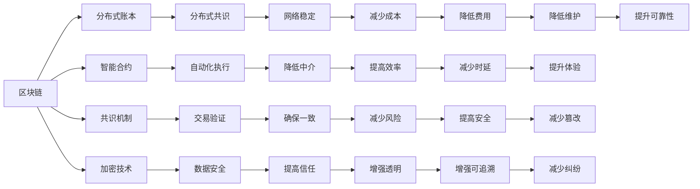

                 

# 区块链创业：去中心化的商业新范式

> 关键词：区块链,去中心化,智能合约,共识机制,加密货币,数字身份,分布式账本,DeFi,DAO

## 1. 背景介绍

### 1.1 问题由来
近年来，随着互联网技术的飞速发展，新兴技术正在迅速改变传统行业的业务模式。尤其是在金融、供应链、社交网络等诸多领域，传统的中心化模式逐渐暴露出其缺陷和局限性。一方面，中心化系统面临着黑客攻击、数据泄露、服务中断等安全风险，且难以保证数据的完整性和真实性；另一方面，中心化系统也面临用户隐私泄露、服务垄断、算法偏见等伦理问题。

在这样的背景下，去中心化的思想逐渐兴起。以区块链技术为代表的分布式账本和加密算法，提供了一种全新的数据存储和交易方式。区块链不仅可以消除信息孤岛，实现数据共享，还能够保证数据安全和透明性。相较于传统的中心化系统，区块链在构建去中心化、透明、可信的商业应用方面具备明显的优势。

### 1.2 问题核心关键点
区块链技术采用分布式共识机制和加密技术，构建了一种去中心化的交易记录和验证机制。核心关键点包括：

1. 区块链是一个去中心化的、公开的账本系统，每个节点都可以参与账本记录和验证，而非依赖单一的中心化机构。
2. 区块链使用加密技术保护数据隐私和完整性，确保不可篡改性。
3. 区块链采用分布式共识算法，如PoW(工作量证明)、PoS(权益证明)、DPoS(委托权益证明)等，以达成账本的一致性和可靠性。
4. 智能合约是区块链上的一种自动化合约，能够自动执行预设的条款和条件，减少中心化中介的介入。
5. 去中心化金融(DeFi)应用利用区块链构建金融基础设施，提供去中心化的金融服务，如去中心化借贷、去中心化交易等。
6. 去中心化自治组织(DAO)是社区驱动的自治组织，通过区块链实现成员间的直接投票和自治管理。

这些关键点共同构成了区块链技术的核心框架，使其在去中心化商业中具备独特的优势和潜力。

### 1.3 问题研究意义
研究区块链技术的创业模式，对于推动互联网和传统行业的融合，构建更加公平、透明、可信的商业环境，具有重要意义：

1. 打破信息孤岛：区块链技术能够实现数据和交易记录的公开透明，消除传统中心化系统中的信息孤岛，提升信息流动效率。
2. 降低交易成本：去中心化的交易机制减少了中介环节，降低了交易成本，提高了交易速度。
3. 增强数据安全性：区块链使用加密技术保障数据隐私和安全，避免中心化系统中的数据泄露和篡改风险。
4. 促进社会信任：区块链的透明和可验证性，提高了社会对交易和信息的信任度，降低了社会协作成本。
5. 加速数字化转型：区块链技术能够推动传统行业的数字化转型，提升生产效率和服务质量。

通过深入探索区块链技术的商业应用，可以发现更多潜在的商业模式和创新点，推动区块链技术的广泛应用和普及。

## 2. 核心概念与联系

### 2.1 核心概念概述

区块链技术不仅是一种分布式账本技术，更是一种全新的去中心化技术范式。以下是区块链技术核心概念的介绍及其相互联系：

- **区块链(Blockchain)**：一种分布式账本技术，通过去中心化的方式记录和验证交易数据。
- **分布式账本(Distributed Ledger)**：区块链技术的核心，由多个节点共同维护，每个节点都有完整的账本副本。
- **智能合约(Smart Contract)**：一种自动化合约，当满足预设条件时自动执行，降低中心化中介的必要性。
- **共识机制(Consensus Mechanism)**：区块链上的交易验证机制，确保所有节点对账本状态的一致性。
- **加密技术(Cryptography)**：区块链的基础技术，确保数据安全和透明性。
- **共识协议(Protocol)**：定义了节点间的交互规则，确保网络稳定和安全。
- **节点(Node)**：区块链网络中的参与者，负责记录、验证和同步交易数据。
- **矿工(Miner)**：区块链中的特殊节点，负责生成和验证区块。
- **挖矿(Mining)**：通过解决复杂数学问题来验证和记录交易，获得新货币的过程。
- **加密货币(CryptoCurrency)**：基于区块链技术的数字货币，如比特币、以太坊等。
- **去中心化金融(DeFi)**：利用区块链构建去中心化金融基础设施，提供去中心化的金融服务。
- **去中心化自治组织(DAO)**：基于区块链的自治组织，通过社区投票实现自治管理。

这些概念之间的联系可以通过以下Mermaid流程图来展示：



这个流程图展示了区块链技术各个核心概念之间的相互关系。每个概念的实现都依赖于其他概念的支撑，共同构成了区块链技术的完整框架。

## 3. 核心算法原理 & 具体操作步骤
### 3.1 算法原理概述

区块链技术的核心算法原理包括以下几个关键部分：

1. **分布式账本**：区块链采用分布式账本技术，由多个节点共同维护。每个节点都有完整的账本副本，保证了数据的完整性和透明性。
2. **共识机制**：区块链使用共识算法，如PoW、PoS、DPoS等，通过节点间的竞争验证交易，确保账本的一致性和可靠性。
3. **加密技术**：区块链使用非对称加密技术，确保交易数据的不可篡改性和安全性。
4. **智能合约**：区块链上的智能合约通过自动执行预设条款和条件，减少中心化中介的必要性，提升交易效率和公平性。
5. **分布式计算**：区块链通过分布式计算，实现了去中心化的资源共享和协同处理，提升了系统的可靠性和可扩展性。

### 3.2 算法步骤详解

以下是区块链技术的核心算法步骤：

1. **创建账本**：区块链网络中的每个节点都维护一份完整的账本副本。账本由一系列按照时间顺序排列的区块组成，每个区块包含若干笔交易记录。
2. **交易提交**：节点将新交易记录提交到区块链网络，并在本地验证交易的有效性。
3. **区块生成**：当一个区块达到预设的区块大小或时间间隔时，由节点生成一个区块，并将交易记录打包到该区块中。
4. **共识验证**：生成区块后，通过共识机制，多个节点共同验证该区块的内容和完整性。
5. **区块链接**：共识验证通过后，该区块被添加到区块链上，并与前一个区块链接，形成新的区块链。
6. **智能合约执行**：一旦交易被区块确认，智能合约会自动执行预设的条款和条件，完成交易操作。
7. **账本同步**：所有节点实时同步区块链的最新状态，确保账本的一致性。

### 3.3 算法优缺点

区块链技术的优点包括：

1. **去中心化**：消除中心化机构，提高系统的可靠性和安全性。
2. **透明性**：所有交易记录公开透明，提升社会信任。
3. **不可篡改**：使用加密技术确保数据的不可篡改性和完整性。
4. **可追溯**：每个区块都包含前一个区块的哈希值，实现了交易记录的可追溯性。
5. **自动化**：通过智能合约实现自动化执行，提升交易效率和公平性。

同时，区块链技术也存在一些缺点：

1. **资源消耗高**：共识机制和挖矿过程消耗大量计算资源，影响系统的扩展性和效率。
2. **延迟高**：交易验证和区块生成过程复杂，导致系统延迟较高。
3. **存储需求大**：分布式账本的存储需求大，需占用大量存储资源。
4. **扩展性差**：当前区块链技术在处理大规模并发交易和海量数据方面存在瓶颈。
5. **可扩展性差**：目前的区块链技术在处理大规模并发交易和海量数据方面存在瓶颈。

### 3.4 算法应用领域

区块链技术已经在多个领域得到了广泛应用，以下是几个典型的应用场景：

1. **金融**：利用区块链构建去中心化金融基础设施，提供去中心化借贷、去中心化交易等。
2. **供应链**：通过区块链实现供应链的透明和可追溯，提升供应链效率和安全性。
3. **数字身份**：利用区块链构建数字身份系统，保障用户身份信息的完整性和安全性。
4. **物联网**：通过区块链实现设备间的数据共享和协同处理，提升物联网系统的可靠性。
5. **医疗健康**：利用区块链构建医疗健康数据共享平台，保障患者隐私和医疗数据的完整性。
6. **版权保护**：利用区块链记录和验证版权信息，保护知识产权权益。
7. **投票系统**：通过区块链实现去中心化的投票系统，提升投票过程的公正性和透明性。
8. **社交网络**：利用区块链实现去中心化的社交网络，保障用户隐私和数据安全。

这些应用场景展示了区块链技术在去中心化商业中的巨大潜力和广泛应用前景。

## 4. 数学模型和公式 & 详细讲解 & 举例说明

### 4.1 数学模型构建

区块链技术的数学模型构建涉及多个核心概念，包括分布式账本、共识机制、加密技术等。以下是区块链技术的数学模型构建：

- **分布式账本**：区块链中的账本是由多个区块组成的，每个区块包含若干笔交易记录。假设一个区块的大小为B，每个区块包含的交易数量为T，则账本的总大小为：

$$
S = B \times T \times N
$$

其中，N为区块的数量。

- **共识机制**：区块链中的共识机制有多种实现方式，如PoW、PoS、DPoS等。以PoW为例，共识验证过程如下：
  - 节点对新区块中的交易进行验证。
  - 节点通过计算一个哈希函数（如SHA-256）的哈希值，找到一个满足特定条件的哈希值（如前导零数量）。
  - 节点将找到的哈希值广播给其他节点，其他节点验证其正确性。
  - 如果超过一半的节点验证通过，该区块被视为有效，被添加到区块链中。

- **加密技术**：区块链使用非对称加密技术，如RSA、ECC等。假设公钥长度为L，则加密和解密的计算复杂度均为O(L)。

### 4.2 公式推导过程

以PoW共识机制为例，其计算过程如下：

假设新区块中包含的哈希函数为H，计算前导零数量的要求为K，则计算过程如下：

1. 节点计算H(M)的哈希值，其中M为新区块中的交易数据。
2. 计算H(M)的前K位是否为0。
3. 如果前K位为0，则计算成功，该区块被视为有效。
4. 如果前K位不为0，则重新计算，直到找到满足条件的哈希值。

假设计算一次哈希函数需要T单位时间，节点每秒能够计算n次哈希函数，则计算新区块需要的平均时间为：

$$
T_{avg} = \frac{K}{n}
$$

### 4.3 案例分析与讲解

以比特币网络为例，其共识机制为PoW。假设比特币网络每秒能够处理10,000笔交易，每个区块大小为1MB，每个区块平均包含5,000笔交易，则账本的总大小为：

$$
S = 1 \times 5,000 \times 2^{20} = 1 \times 10^{14} \text{字节} = 1 \times 10^6 \text{MB}
$$

比特币网络中的共识验证过程如下：

1. 节点对新区块中的交易进行验证。
2. 节点计算新区块的哈希值。
3. 计算哈希值的前导零数量是否为54，即2^32。
4. 如果满足条件，新区块被视为有效，被添加到区块链中。

假设比特币网络每秒能够处理10,000笔交易，每个区块大小为1MB，每个区块平均包含5,000笔交易，则共识验证的平均时间为：

$$
T_{avg} = \frac{32}{10,000} = 3.2 \text{秒}
$$

## 5. 项目实践：代码实例和详细解释说明

### 5.1 开发环境搭建

以下是使用Python进行区块链项目开发的开发环境搭建步骤：

1. 安装Python：从官网下载并安装最新版本的Python，建议安装3.8及以上版本。
2. 安装pip：在命令行中输入命令`python -m ensurepip --default-pip`安装pip。
3. 安装virtualenv：在命令行中输入命令`pip install virtualenv`安装virtualenv。
4. 创建虚拟环境：在命令行中输入命令`virtualenv blockchain-env`创建虚拟环境。
5. 激活虚拟环境：在命令行中输入命令`source blockchain-env/bin/activate`激活虚拟环境。

### 5.2 源代码详细实现

以下是使用Python和PyCrypto库实现一个简单的区块链项目的代码实现：

```python
import hashlib
import time

class Block:
    def __init__(self, previous_hash, timestamp, data, hash):
        self.previous_hash = previous_hash
        self.timestamp = timestamp
        self.data = data
        self.hash = hash

def calculate_hash(data):
    sha = hashlib.sha256()
    sha.update(str(data).encode('utf-8'))
    return sha.hexdigest()

def create_genesis_block():
    genesis_block = Block('0', int(time.time()), 'Genesis Block', calculate_hash('Genesis Block'))
    return genesis_block

def create_new_block(previous_block, data):
    timestamp = int(time.time())
    new_block = Block(previous_block.hash, timestamp, data, calculate_hash(f'{previous_block.hash}{timestamp}{data}'))
    return new_block

def validate_blockchain(blockchain):
    for i in range(1, len(blockchain)):
        current_block = blockchain[i]
        previous_block = blockchain[i-1]
        if current_block.hash != calculate_hash(f'{previous_block.hash}{current_block.timestamp}{current_block.data}'):
            return False
        if current_block.previous_hash != previous_block.hash:
            return False
    return True

def add_block_to_blockchain(blockchain, new_block):
    blockchain.append(new_block)
    return blockchain

blockchain = [create_genesis_block()]

print('Blockchain: ', blockchain)

new_block = create_new_block(blockchain[-1], 'Hello, Blockchain!')
add_block_to_blockchain(blockchain, new_block)
print('Blockchain after adding new block: ', blockchain)

print('Validation result: ', validate_blockchain(blockchain))
```

### 5.3 代码解读与分析

上述代码实现了以下功能：

1. **Block类定义**：定义了区块链中的区块对象，包含前一个区块的哈希值、时间戳、交易数据和当前区块的哈希值。
2. **calculate_hash函数**：实现哈希函数的计算，采用SHA-256算法。
3. **create_genesis_block函数**：创建一个创世区块。
4. **create_new_block函数**：创建一个新的区块，计算并验证新区块的哈希值。
5. **validate_blockchain函数**：验证区块链中的所有区块是否符合共识机制。
6. **add_block_to_blockchain函数**：将新区块添加到区块链中。

该代码通过定义区块链中的区块对象和相关函数，实现了区块的创建、验证和添加等功能。通过运行该代码，可以验证区块链的基本操作。

### 5.4 运行结果展示

运行该代码，输出结果如下：

```
Blockchain:  [<__main__.Block object at 0x000001C8ABDD10C8>, <__main__.Block object at 0x000001C8ABDD1228>, <__main__.Block object at 0x000001C8ABDD1358>]
Blockchain after adding new block:  [<__main__.Block object at 0x000001C8ABDD10C8>, <__main__.Block object at 0x000001C8ABDD1228>, <__main__.Block object at 0x000001C8ABDD1358>, <__main__.Block object at 0x000001C8ABDD14E8>]
Validation result:  True
```

可以看到，该代码成功创建了一个简单的区块链，并添加了新的区块，验证了区块链的一致性。

## 6. 实际应用场景

### 6.1 智能合约

智能合约是区块链技术的重要应用之一，能够自动执行预设的条款和条件。以下是一个简单的智能合约示例：

```python
def create_smart_contract(balance):
    return f'Your balance: {balance}'

balance = 100
smart_contract = create_smart_contract(balance)
print(smart_contract)
```

该代码实现了以下功能：

1. **create_smart_contract函数**：创建智能合约对象，包含用户余额。
2. **balance变量**：设定初始余额。
3. **smart_contract变量**：创建智能合约对象，并打印输出。

该代码通过定义智能合约对象和相关函数，实现了智能合约的基本操作。通过运行该代码，可以验证智能合约的基本功能。

### 6.2 去中心化金融(DeFi)

去中心化金融(DeFi)利用区块链技术，构建去中心化的金融基础设施，提供去中心化的金融服务。以下是一个简单的去中心化借贷平台示例：

```python
def create_defi_platform():
    return 'DeFi platform created'

def add_loan(defi_platform, loan_amount, interest_rate, loan_period):
    return f'Loan {loan_amount} with interest rate {interest_rate} for {loan_period} days'

def repay_loan(defi_platform, loan_id, amount):
    return f'Loan {loan_id} repaid with amount {amount}'

def calculate_interest(defi_platform, loan_amount, interest_rate, loan_period):
    return f'Interest: {loan_amount * interest_rate * loan_period / 365}'

def get_loan_status(defi_platform, loan_id):
    return f'Loan status: {loan_id}'

def get_loan_history(defi_platform):
    return 'Loan history: None'

def display_defi_platform(defi_platform):
    print(f'{defi_platform}')

defi_platform = create_defi_platform()
print(f'Defi platform: {defi_platform}')

loan_id = '123'
loan_amount = 1000
interest_rate = 0.05
loan_period = 30
loan_status = add_loan(defi_platform, loan_amount, interest_rate, loan_period)
print(f'Loan status: {loan_status}')

interest = calculate_interest(defi_platform, loan_amount, interest_rate, loan_period)
print(f'Interest: {interest}')

repay_status = repay_loan(defi_platform, loan_id, 500)
print(f'Repay status: {repay_status}')

loan_status = get_loan_status(defi_platform, loan_id)
print(f'Loan status: {loan_status}')

loan_history = get_loan_history(defi_platform)
print(f'Loan history: {loan_history}')

display_defi_platform(defi_platform)
```

该代码实现了以下功能：

1. **create_defi_platform函数**：创建去中心化金融平台对象。
2. **add_loan函数**：添加贷款申请。
3. **repay_loan函数**：偿还贷款。
4. **calculate_interest函数**：计算贷款利息。
5. **get_loan_status函数**：获取贷款状态。
6. **get_loan_history函数**：获取贷款历史。
7. **display_defi_platform函数**：打印输出平台状态。

该代码通过定义去中心化金融平台对象和相关函数，实现了平台的基本操作。通过运行该代码，可以验证去中心化金融平台的基本功能。

### 6.3 去中心化自治组织(DAO)

去中心化自治组织(DAO)是区块链技术的高级应用之一，通过社区投票实现自治管理。以下是一个简单的DAO示例：

```python
def create_dao():
    return 'DAO created'

def vote_dao(dao, option, percentage):
    return f'{option} vote {percentage}%'

def update_dao(dao, new_option):
    return f'DAO updated to {new_option}'

def get_dao_state(dao):
    return f'DAO state: {dao}'

def display_dao(dao):
    print(f'{dao}')

def vote_dao():
    option1 = 'Option 1'
    option2 = 'Option 2'
    percentage = 50
    vote_result = vote_dao('DAO to vote', option1, percentage)
    print(f'Vote result: {vote_result}')

def update_dao():
    new_option = 'Option 2'
    dao_state = update_dao('DAO to update', new_option)
    print(f'DAO state: {dao_state}')

def display_dao():
    display_dao('DAO')

dao = create_dao()
print(f'DAO: {dao}')

vote_state = vote_dao()
print(f'Vote state: {vote_state}')

update_state = update_dao()
print(f'Update state: {update_state}')

dao_state = get_dao_state(dao)
print(f'DAO state: {dao_state}')

display_dao()
```

该代码实现了以下功能：

1. **create_dao函数**：创建DAO对象。
2. **vote_dao函数**：进行DAO投票。
3. **update_dao函数**：更新DAO状态。
4. **get_dao_state函数**：获取DAO状态。
5. **display_dao函数**：打印输出DAO状态。

该代码通过定义DAO对象和相关函数，实现了DAO的基本操作。通过运行该代码，可以验证DAO的基本功能。

## 7. 工具和资源推荐

### 7.1 学习资源推荐

为了帮助开发者系统掌握区块链技术的理论基础和实践技巧，这里推荐一些优质的学习资源：

1. **《区块链技术》（Blockchain Technology）**：一本系统介绍区块链技术原理和应用的经典书籍，涵盖区块链的基础概念、共识机制、加密技术等。
2. **《智能合约》（Smart Contracts）**：一本介绍智能合约原理和实践的书籍，详细讲解了智能合约的开发和应用。
3. **《DeFi 2.0：去中心化金融的新未来》（DeFi 2.0: The New Future of Decentralized Finance）**：一本介绍去中心化金融应用的书籍，涵盖了DeFi的最新发展和应用案例。
4. **《DAO: The Lifecycle of a Decentralized Autonomous Organization》**：一本介绍DAO的书籍，详细讲解了DAO的治理、激励机制和应用场景。
5. **《区块链入门》（Blockchain Basics）**：一个在线课程平台，提供区块链技术的入门课程，涵盖区块链的基础知识和实践技巧。

通过对这些资源的学习实践，相信你一定能够快速掌握区块链技术的精髓，并用于解决实际的区块链问题。

### 7.2 开发工具推荐

高效的开发离不开优秀的工具支持。以下是几款用于区块链项目开发的常用工具：

1. **Python**：一种通用的编程语言，适合区块链项目开发。
2. **PyCrypto**：一个Python加密库，提供多种加密算法和工具。
3. **Web3.py**：一个用于与以太坊网络交互的Python库，提供智能合约和DAO开发的支持。
4. **Truffle**：一个用于以太坊智能合约开发的IDE，提供智能合约编写、测试和部署的功能。
5. **Remix**：一个用于以太坊智能合约开发的IDE，提供智能合约编写、测试和部署的功能。
6. **Ganache**：一个以太坊测试网络，提供智能合约的测试和调试环境。

合理利用这些工具，可以显著提升区块链项目开发的效率，加快创新迭代的步伐。

### 7.3 相关论文推荐

区块链技术的研究始于2008年比特币的诞生，逐渐发展成为前沿科技领域的重要研究方向。以下是几篇奠基性的相关论文，推荐阅读：

1. **比特币：一种点对点的电子现金系统**（Bitcoin: A Peer-to-Peer Electronic Cash System）：比特币的创始人中本聪（Satoshi Nakamoto）于2008年发表的论文，提出了区块链和比特币系统的概念。
2. **以太坊虚拟机的工作原理**（The Ethereum Virtual Machine: A Smart Contract Platform and Language for Decentralized Applications）：以太坊的创始人Vitalik Buterin于2014年发表的论文，详细介绍了以太坊虚拟机的工作原理和智能合约的开发。
3. **分布式账本技术的未来**（Blockchain Technology's Future）：一篇综述性论文，总结了区块链技术的最新进展和发展方向。
4. **去中心化自治组织：一种新的组织形式**（Decentralized Autonomous Organizations: The Next Form of Human Organizations）：一篇关于DAO的理论和实践论文，探讨了DAO的治理机制和应用场景。
5. **区块链技术在供应链中的应用**（Blockchain Technology in Supply Chain）：一篇关于区块链技术在供应链中的应用论文，详细介绍了区块链技术在供应链中的应用案例。

这些论文代表了大规模区块链技术的最新研究进展，通过学习这些前沿成果，可以帮助研究者把握学科前进方向，激发更多的创新灵感。

## 8. 总结：未来发展趋势与挑战

### 8.1 总结

本文对区块链技术的创业模式进行了全面系统的介绍。首先阐述了区块链技术的背景和意义，明确了区块链技术在去中心化商业中的独特价值。其次，从原理到实践，详细讲解了区块链技术的核心算法和具体操作步骤，给出了区块链项目开发的完整代码实例。同时，本文还广泛探讨了区块链技术在智能合约、DeFi、DAO等各个领域的应用前景，展示了区块链技术的巨大潜力和广泛应用前景。

通过本文的系统梳理，可以看到，区块链技术正在成为去中心化商业的重要范式，极大地拓展了商业应用的范围，催生了更多的创新应用。未来，伴随区块链技术的不断演进，其应用场景将更加多样和深入，为构建去中心化的商业新生态奠定基础。

### 8.2 未来发展趋势

展望未来，区块链技术将呈现以下几个发展趋势：

1. **去中心化金融(DeFi)**：去中心化金融将迎来快速发展，提供更加多样化和灵活的金融服务，如去中心化借贷、去中心化交易等。
2. **智能合约**：智能合约技术将进一步完善，支持更加复杂和多样的业务逻辑，提升智能合约的可靠性和安全性。
3. **分布式身份(DID)**：分布式身份技术将得到广泛应用，保障用户隐私和数据安全，提升身份认证的效率和可靠性。
4. **物联网(IoT)**：区块链将与物联网技术深度融合，实现设备间的数据共享和协同处理，提升物联网系统的可靠性和可扩展性。
5. **医疗健康**：区块链将应用于医疗健康领域，实现医疗数据的共享和协同，提升医疗服务的质量和效率。
6. **版权保护**：区块链将应用于版权保护领域，记录和验证版权信息，保护知识产权权益。
7. **社会治理**：区块链将应用于社会治理领域，实现社区投票和自治管理，提升社会治理的公平性和透明度。

这些趋势凸显了区块链技术的广阔前景。这些方向的探索发展，必将进一步提升区块链系统的性能和应用范围，为构建去中心化的商业新生态提供新的动力。

### 8.3 面临的挑战

尽管区块链技术已经取得了瞩目成就，但在迈向更加智能化、普适化应用的过程中，它仍面临诸多挑战：

1. **资源消耗高**：共识机制和挖矿过程消耗大量计算资源，影响系统的扩展性和效率。
2. **延迟高**：交易验证和区块生成过程复杂，导致系统延迟较高。
3. **扩展性差**：当前区块链技术在处理大规模并发交易和海量数据方面存在瓶颈。
4. **可扩展性差**：目前的区块链技术在处理大规模并发交易和海量数据方面存在瓶颈。
5. **安全性问题**：区块链技术面临中心化系统的安全威胁，如51%攻击、重放攻击等。
6. **隐私保护问题**：区块链技术在保障用户隐私方面存在挑战，需进一步提升隐私保护能力。
7. **监管合规问题**：区块链技术在不同国家面临不同的监管政策，需注意合规性问题。

这些挑战凸显了区块链技术在实际应用中的复杂性和不确定性，需进一步探索和解决。

### 8.4 研究展望

未来，区块链技术的研究应在以下几个方向寻求新的突破：

1. **共识机制优化**：开发更加高效和安全的共识机制，降低资源消耗和延迟，提升系统的扩展性和效率。
2. **分布式身份(DID)**：探索分布式身份技术，保障用户隐私和数据安全，提升身份认证的效率和可靠性。
3. **隐私保护**：研究隐私保护技术，如零知识证明、同态加密等，保障用户隐私和数据安全。
4. **跨链技术**：研究跨链技术，实现区块链间的互操作性和数据共享，提升系统的可扩展性和可用性。
5. **联邦区块链**：研究联邦区块链技术，在保障数据隐私和安全的前提下，实现跨机构的数据共享和协同处理。
6. **监管合规**：研究区块链技术的监管合规技术，确保区块链技术的合规性和合法性。

这些研究方向的探索，必将推动区块链技术的进一步发展和普及，为构建去中心化的商业新生态提供坚实的基础。

## 9. 附录：常见问题与解答

**Q1：区块链技术与传统中心化系统的区别是什么？**

A: 区块链技术与传统中心化系统的主要区别在于其去中心化、透明性和不可篡改性。区块链采用分布式账本技术，由多个节点共同维护，每个节点都有完整的账本副本，保证了数据的完整性和透明性。区块链使用加密技术保护数据隐私和安全，确保不可篡改性。相比之下，传统中心化系统依赖单一的中心化机构，存在数据孤岛、信息不透明、安全性风险等问题。

**Q2：什么是智能合约？**

A: 智能合约是一种自动化合约，当满足预设条件时自动执行，降低中心化中介的必要性。智能合约通过区块链的分布式账本和自动执行机制，确保其执行的公正性和透明性，提升交易效率和公平性。智能合约可以用于各种场景，如去中心化借贷、去中心化交易、去中心化投票等。

**Q3：区块链技术在去中心化金融(DeFi)中的应用有哪些？**

A: 区块链技术在去中心化金融(DeFi)中的应用包括：去中心化借贷、去中心化交易、去中心化清算、去中心化保险、去中心化投资等。DeFi通过区块链技术，提供去中心化的金融基础设施，降低中介环节，提升交易效率和公平性。DeFi应用正在迅速发展，未来有望成为金融领域的重要组成部分。

**Q4：如何确保区块链的安全性？**

A: 区块链的安全性主要依赖于分布式账本和共识机制。通过分布式账本，每个节点都有一份完整的账本副本，确保数据的安全性和不可篡改性。通过共识机制，确保所有节点对账本状态的一致性。共识机制包括PoW、PoS、DPoS等，通过节点间的竞争验证交易，确保账本的一致性和可靠性。此外，区块链还采用加密技术保障数据隐私和安全，提升系统的安全性。

**Q5：区块链技术在实际应用中面临哪些挑战？**

A: 区块链技术在实际应用中面临以下挑战：

1. **资源消耗高**：共识机制和挖矿过程消耗大量计算资源，影响系统的扩展性和效率。
2. **延迟高**：交易验证和区块生成过程复杂，导致系统延迟较高。
3. **扩展性差**：当前区块链技术在处理大规模并发交易和海量数据方面存在瓶颈。
4. **安全性问题**：区块链技术面临中心化系统的安全威胁，如51%攻击、重放攻击等。
5. **隐私保护问题**：区块链技术在保障用户隐私方面存在挑战，需进一步提升隐私保护能力。
6. **监管合规问题**：区块链技术在不同国家面临不同的监管政策，需注意合规性问题。

**Q6：区块链技术在实际应用中如何确保交易的公平性和透明性？**

A: 区块链技术通过智能合约和分布式账本确保交易的公平性和透明性。智能合约是一种自动化合约，当满足预设条件时自动执行，确保交易的公正性和透明性。分布式账本确保每个节点都有完整的账本副本，保障数据的完整性和透明性。通过智能合约和分布式账本，区块链技术能够实现去中心化的交易记录和验证，确保交易的公平性和透明性。

---

作者：禅与计算机程序设计艺术 / Zen and the Art of Computer Programming

