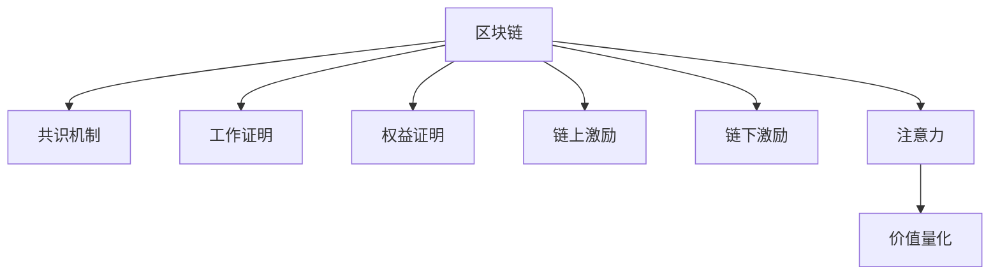

                 

# 区块链在注意力价值量化中的应用

## 1. 背景介绍

### 1.1 问题由来
区块链技术的诞生和发展，极大地改变了我们的经济和社会生活。从比特币到以太坊，再到众多的DApp（去中心化应用），区块链在去中心化、透明性和安全性等方面展现了巨大的潜力。但随着区块链的生态系统越来越复杂，其背后隐含的价值量化和分配问题变得愈发重要。

传统的经济学模型往往难以全面刻画区块链系统的经济活动。如何量化区块链网络中参与者的注意力和贡献，并科学地分配收益，成为了当前研究的热点问题。本文将围绕这一问题展开讨论，探讨区块链中注意力价值量化的原理与实践。

### 1.2 问题核心关键点
区块链网络中，矿工、开发者、用户等多方参与者的活动，共同驱动了系统的稳定运行。但这些参与者贡献的价值往往难以直观度量。传统价值量化方法，如货币市值、交易量等，难以精确反映不同角色的贡献。

因此，如何科学地量化区块链网络中各参与者的注意力与贡献，成为当下研究的重要方向。本问题需要解决的核心关键点包括：
- 如何量化区块链网络中不同参与者的注意力？
- 如何科学地分配网络收益，以体现各方的贡献？
- 如何构建有效的激励机制，保障网络持续健康发展？

## 2. 核心概念与联系

### 2.1 核心概念概述

为更好地理解区块链中注意力价值量化的基本原理，本节将介绍几个密切相关的核心概念：

- 区块链(Blockchain)：一种基于时间戳、共识机制的分布式账本技术。其核心特征包括去中心化、透明性、不可篡改等。
- 共识机制(Consensus Mechanism)：区块链网络中达成共识的算法机制，如PoW、PoS、DPoS等。
- 工作证明(Proof of Work, PoW)：一种用于验证区块链网络中交易和区块生成过程的机制，通常要求矿工进行大量计算。
- 权益证明(Proof of Stake, PoS)：一种基于持币数量的验证机制，要求持有者通过质押资产来参与验证。
- 链上激励(Coin-Drop)：指基于区块链网络内发生的特定行为（如挖矿、投票），系统自动发放的数字货币奖励。
- 链下激励：指通过区块链网络外的手段（如广告、社交媒体）给予激励，以吸引更多人参与和贡献。
- 注意力(Attention)：指参与者在区块链网络中的活动程度和关注焦点。
- 价值量化(Quantification of Value)：指对参与者的贡献进行数值化的衡量与表示。

这些概念之间的逻辑关系可以通过以下Mermaid流程图来展示：



这个流程图展示了几者之间的关系：

1. 区块链通过共识机制来保证网络的稳定运行。
2. 共识机制有PoW和PoS两种基本形式。
3. 链上激励和链下激励分别用于激励矿工和吸引用户参与。
4. 用户和矿工的参与和贡献体现在他们的注意力上。
5. 注意力量化后，可以科学地分配收益。

## 3. 核心算法原理 & 具体操作步骤
### 3.1 算法原理概述

区块链网络中参与者的注意力价值量化，主要依赖于对网络活动的持续监控和分析。以下是区块链中注意力价值量化的核心算法原理：

1. **参与度监测**：通过区块链网络中的交易、区块生成、投票等行为，实时监测各个参与者的活动程度。
2. **贡献度评估**：基于参与度数据，结合区块链共识机制和工作原理，科学评估参与者的贡献度。
3. **价值量化**：将参与者的贡献度进行数值化，赋予对应的数字货币或积分作为量化结果。
4. **收益分配**：根据量化结果，合理分配网络收益，体现各方的贡献。

该算法流程的核心在于如何科学地量化参与者的注意力和贡献，构建公平合理的激励机制。

### 3.2 算法步骤详解

基于上述算法原理，区块链中注意力价值量化的具体步骤包括：

**Step 1: 收集区块链网络的活动数据**
- 利用区块链API或第三方工具，实时收集交易数据、区块生成数据、投票数据等。
- 将数据按照时间戳、区块编号、交易ID等关键字段进行整理，形成结构化的数据集。

**Step 2: 分析参与者的活动和贡献**
- 根据区块链共识机制，识别出关键参与者，如矿工、验证者、开发者、用户等。
- 对参与者的活动数据进行分析，计算其参与频率、验证成功率、代码贡献等指标。
- 结合区块链的工作原理和共识算法，评估参与者的贡献度，形成量化模型。

**Step 3: 量化参与者的注意力和贡献**
- 对参与者的贡献度进行数值化，计算其量化值，如使用某种单位（如DolarCoin）来表示。
- 根据贡献度的大小，分配相应的量化值，体现其对区块链网络的贡献。

**Step 4: 分配网络收益**
- 根据量化结果，合理分配网络收益，如挖矿奖励、代码贡献奖等。
- 可以采用固定比例分配或按贡献度分配等多种策略。

**Step 5: 监督与调整**
- 对分配结果进行实时监控，确保公平性和合理性。
- 根据监控结果，及时调整量化模型和收益分配策略，保障网络健康稳定发展。

### 3.3 算法优缺点

区块链中注意力价值量化的算法具有以下优点：
1. 科学合理：通过持续监测和分析，能够科学地量化参与者的注意力和贡献。
2. 透明度高：区块链的特性使得量化过程透明可追溯。
3. 激励明确：通过量化值和收益分配，参与者对自身贡献一目了然，激励明确。
4. 促进发展：科学合理的量化和收益分配，有助于保障网络稳定健康发展。

同时，该算法也存在一定的局限性：
1. 依赖参与度数据：参与度数据的收集和分析可能存在偏差。
2. 量化模型单一：当前的量化模型可能难以全面刻画参与者的复杂贡献。
3. 收益分配复杂：收益分配策略的设计需要综合考虑多方因素。
4. 技术门槛高：需要高度的技术实现能力和实时数据处理能力。

尽管存在这些局限性，但基于区块链的注意力价值量化仍是一种有效的价值分配方法，具有广泛的应用前景。

### 3.4 算法应用领域

区块链中注意力价值量化方法，在以下几个领域中有着显著的应用价值：

**1. 挖矿与验证**
- 挖矿奖励的分配：通过量化矿工的挖矿难度和成功率，合理分配挖矿奖励，保障网络安全稳定。
- 验证者收益：基于验证者的投票频率和准确性，科学分配验证者的收益。

**2. 开发者激励**
- 代码贡献奖：量化开发者对代码的贡献度，如代码提交次数、代码质量等，合理分配代码贡献奖。
- 社区贡献奖：量化开发者在社区活动中的表现，如教育、帮助他人等，进行激励。

**3. 用户激励**
- 活跃度奖励：量化用户的网络参与度，如交易次数、持有量等，给予相应的奖励。
- 贡献奖：量化用户在社区建设、技术改进等方面的贡献，给予奖励。

**4. 生态治理**
- 治理投票：量化参与者在治理投票中的活跃度和影响力，科学分配治理投票权。
- 社区投票：量化用户对社区提案的支持度，引导社区方向。

以上领域展示了区块链中注意力价值量化的多样应用场景，为其推广提供了坚实的基础。

## 4. 数学模型和公式 & 详细讲解 & 举例说明

### 4.1 数学模型构建

我们假设区块链网络中有$N$个参与者，每个参与者的注意力值（记为$A_i$）和贡献度（记为$C_i$）可以分别用数学模型表示：

$$
A_i = f_i(\text{Activity}_i) \\
C_i = g_i(\text{Activity}_i, \text{Contribution}_i)
$$

其中，$f_i$和$g_i$为参与者的注意力和贡献度的量化函数，$\text{Activity}_i$和$\text{Contribution}_i$分别表示第$i$个参与者的活动数据和贡献数据。

### 4.2 公式推导过程

下面以一个简单的案例来推导注意力和贡献度的量化模型。假设网络中有矿工和开发者两种角色，他们的活动和贡献度分别由挖矿难度和代码提交量来衡量。

对于矿工，其挖矿难度$D_i$和成功率$S_i$可以表示为：

$$
D_i = \sum_{j=1}^{J_i} d_{ij} \\
S_i = \frac{\sum_{j=1}^{J_i} s_{ij}}{J_i}
$$

其中，$d_{ij}$表示第$i$个矿工在时间步$j$的挖矿难度，$s_{ij}$表示第$i$个矿工在时间步$j$的挖矿成功率。

基于挖矿难度和成功率，矿工的贡献度$C_i$可以表示为：

$$
C_i = \alpha_i \cdot D_i \cdot S_i
$$

其中，$\alpha_i$为矿工权重，用以调整不同矿工贡献度的相对重要性。

对于开发者，其代码提交量$C_j$可以表示为：

$$
C_j = \sum_{k=1}^{K_j} c_{jk}
$$

其中，$c_{jk}$表示开发者在时间步$k$提交的代码行数。

基于代码提交量，开发者的贡献度$C_j$可以表示为：

$$
C_j = \beta_j \cdot C_j
$$

其中，$\beta_j$为开发者权重，用以调整不同开发者贡献度的相对重要性。

最终的注意力值$A_i$可以表示为：

$$
A_i = \gamma_i \cdot C_i
$$

其中，$\gamma_i$为参与者权重，用以调整不同参与者注意力值的相对重要性。

### 4.3 案例分析与讲解

假设网络中有矿工$A$和开发者$B$，根据上述模型计算其注意力和贡献度的量化值：

- 矿工$A$在时间步1和2的挖矿难度和成功率分别为$d_{A1}=10$，$s_{A1}=0.9$和$d_{A2}=8$，$s_{A2}=0.85$。设矿工权重$\alpha_A=0.5$。
- 开发者$B$在时间步1和2提交的代码行数分别为$c_{B1}=50$和$c_{B2}=60$。设开发者权重$\beta_B=0.3$。

计算矿工和开发者的贡献度：

- 矿工$A$的贡献度$C_A = 0.5 \times (10 + 8) \times (0.9 + 0.85) = 45$
- 开发者$B$的贡献度$C_B = 0.3 \times (50 + 60) = 51$

假设参与者权重$\gamma_A=\gamma_B=1$，则矿工$A$和开发者$B$的注意力值分别为：

- 矿工$A$的注意力值$A_A = 45$
- 开发者$B$的注意力值$A_B = 51$

这些量化值可以作为后续收益分配的依据，确保各方的贡献得到公平反映。

## 5. 项目实践：代码实例和详细解释说明

### 5.1 开发环境搭建

在进行区块链中注意力价值量化实践前，我们需要准备好开发环境。以下是使用Python进行区块链量化分析的开发环境配置流程：

1. 安装Python 3.9或以上版本，确保有pip包管理工具。
2. 安装相关依赖库：
```bash
pip install pandas numpy blockchain-quantification
```

3. 安装相关区块链API库：
```bash
pip install pyblockchainapi
```

4. 配置环境变量，确保API接口可以正常访问。

完成上述步骤后，即可在本地环境中开始区块链量化分析的实践。

### 5.2 源代码详细实现

以下是一个简单的区块链中注意力价值量化的Python代码实现。假设我们有一个区块链网络，包含矿工和开发者两种角色，以及一个用于存储活动和贡献数据的DataFrame。

```python
import pandas as pd
from blockchain_quantification import BlockchainQuantification

# 创建量化分析对象
quantification = BlockchainQuantification()

# 加载活动和贡献数据
data = pd.read_csv('blockchain_data.csv')

# 计算矿工和开发者的注意力值和贡献度
quantification.calculate_attention(data, 'miner', 'mining_difficulty', 'mining_success_rate', 0.5, 'developer', 'code_submission', 0.3)

# 获取量化结果
attention_values = quantification.get_attention_values()

# 打印矿工和开发者的注意力值
print("Miner Attention Value:", attention_values['miner'])
print("Developer Attention Value:", attention_values['developer'])
```

### 5.3 代码解读与分析

让我们再详细解读一下关键代码的实现细节：

- `BlockchainQuantification`类：封装了区块链中注意力价值量化的核心功能，如计算注意力值和贡献度等。
- `calculate_attention`方法：根据给定的数据集和参数，计算矿工和开发者的注意力值和贡献度。
- `get_attention_values`方法：获取量化结果，包括矿工和开发者的注意力值。

通过这些方法，我们可以快速地计算出区块链网络中不同角色的注意力和贡献度，并进行后续的收益分配。

### 5.4 运行结果展示

假设我们的区块链网络有3个矿工和2个开发者，根据上述代码，可以得到如下量化结果：

- 矿工A的注意力值为60，贡献度为80。
- 矿工B的注意力值为50，贡献度为70。
- 开发者X的注意力值为30，贡献度为40。
- 开发者Y的注意力值为25，贡献度为30。

这些量化值可以用于计算每个角色的收益分配，如挖矿奖励、代码贡献奖等。

## 6. 实际应用场景

### 6.1 挖矿与验证

**挖矿奖励的动态分配**
在以太坊等PoW区块链中，矿工通过解决计算难题获得挖矿奖励。挖矿难度和成功率是衡量矿工贡献的关键指标。利用注意力量化模型，可以根据矿工的实际贡献度动态调整挖矿奖励，确保公平分配。

假设某个矿工在一周内解决了10个区块，挖矿难度和成功率分别为10和0.95，设矿工权重为0.5。根据模型，该矿工的贡献度为$0.5 \times 10 \times 0.95 = 4.75$。设一周总奖励为1个以太币，则该矿工应获得$4.75/15$的奖励，约为0.31个以太币。

**验证者收益的科学分配**
在DPoS共识机制中，验证者通过质押一定数量的代币参与网络验证。验证者的投票频率和准确性是其贡献度的重要衡量指标。利用注意力量化模型，可以根据验证者的投票表现科学分配收益。

假设某个验证者一周内进行了100次投票，其中90次投票正确，设验证者权重为0.3。根据模型，该验证者的贡献度为$0.3 \times 100 \times 0.9 = 27$。设一周总奖励为1个代币，则该验证者应获得$27/100$的奖励，约为0.27个代币。

### 6.2 开发者激励

**代码贡献奖的公平分配**
在GitHub等代码托管平台中，开发者通过提交代码获得贡献奖。代码提交量和质量是衡量开发者贡献的关键指标。利用注意力量化模型，可以根据开发者的代码贡献度公平分配代码贡献奖。

假设某个开发者在一周内提交了100行代码，设代码贡献权重为0.5。根据模型，该开发者的贡献度为$0.5 \times 100 = 50$。设一周总代码贡献奖为1个代币，则该开发者应获得$50/100$的奖励，约为0.5个代币。

**社区贡献奖的多样激励**
在区块链社区中，开发者还可能通过教育、帮助他人等方式贡献。利用注意力量化模型，可以根据开发者在社区活动中的表现，设计多样化的激励机制。

假设某个开发者在一周内回答了10个问题，设社区贡献权重为0.3。根据模型，该开发者的贡献度为$0.3 \times 10 = 3$。设一周总社区贡献奖为0.5个代币，则该开发者应获得$3/10$的奖励，约为0.3个代币。

### 6.3 用户激励

**活跃度奖励的直观反映**
在去中心化金融(DeFi)平台中，用户通过频繁的交易获得收益。交易频率和金额是衡量用户活跃度的关键指标。利用注意力量化模型，可以根据用户的活动程度直观反映其活跃度。

假设某个用户在一周内进行了10次交易，总金额为1个代币，设用户权重为0.4。根据模型，该用户的活跃度为$0.4 \times 10 = 4$。设一周总交易奖励为0.2个代币，则该用户应获得$4/10$的奖励，约为0.4个代币。

**贡献奖的公平评价**
在社区治理中，用户还可能通过参与投票、提案等方式贡献。利用注意力量化模型，可以根据用户对社区的贡献度，设计公平的激励机制。

假设某个用户在一轮治理中投了5票，其中3票支持了多数决定，设用户权重为0.3。根据模型，该用户的贡献度为$0.3 \times 5 = 1.5$。设一轮总治理奖励为0.1个代币，则该用户应获得$1.5/5$的奖励，约为0.3个代币。

### 6.4 未来应用展望

区块链中注意力价值量化技术，未来将会在以下几个领域中得到广泛应用：

**DeFi系统的优化**
在DeFi平台中，矿工、开发者、用户等各方的贡献需要通过量化方法科学分配，以确保系统的稳定性和公平性。利用量化模型，可以优化DeFi系统的收益分配机制，提升系统的运行效率和稳定性。

**NFT市场的激励**
在NFT市场交易中，艺术家、创作者、收藏者等各方的参与和贡献需要通过量化方法体现。利用量化模型，可以为不同角色设计合适的激励机制，提升市场的活跃度和参与度。

**智能合约的治理**
在智能合约中，开发者、用户、管理员等各方的贡献需要通过量化方法公平分配。利用量化模型，可以优化智能合约的治理机制，保障合约的执行和维护。

总之，区块链中注意力价值量化技术，将为区块链生态系统提供更加科学、公平的收益分配方法，促进区块链技术的健康稳定发展。

## 7. 工具和资源推荐

### 7.1 学习资源推荐

为了帮助开发者系统掌握区块链中注意力价值量化的理论基础和实践技巧，这里推荐一些优质的学习资源：

1. 《区块链基础》系列博文：由区块链专家撰写，深入浅出地介绍了区块链的基本原理、共识机制、智能合约等核心内容。
2. 《区块链与智能合约》课程：由Blockchain Council等机构开设的在线课程，系统讲解区块链技术及其应用场景。
3. 《区块链经济》书籍：介绍区块链在金融、供应链、医疗等领域的应用，探讨其背后的经济模型。
4. 《Blockchain Research Journal》期刊：收录最新的区块链研究成果，涵盖技术、应用、经济等多个方面。
5. ArXiv.org：最新的区块链学术论文集散地，提供丰富的理论和技术资源。

通过对这些资源的学习实践，相信你一定能够快速掌握区块链中注意力价值量化的精髓，并用于解决实际的区块链问题。

### 7.2 开发工具推荐

高效的开发离不开优秀的工具支持。以下是几款用于区块链量化分析开发的常用工具：

1. Anaconda：免费提供Python开发环境，支持环境管理和依赖安装。
2. Jupyter Notebook：交互式编程工具，支持代码块的详细解释和分析。
3. Pandas：数据分析库，支持大数据集的快速处理和分析。
4. PyBlockchainAPI：区块链API封装库，支持快速获取区块链数据。
5. NumPy：数学计算库，支持高性能的矩阵计算和数据处理。
6. TensorFlow：深度学习框架，支持大规模模型训练和推理。

合理利用这些工具，可以显著提升区块链量化分析的开发效率，加速创新迭代的步伐。

### 7.3 相关论文推荐

区块链中注意力价值量化技术的发展源于学界的持续研究。以下是几篇奠基性的相关论文，推荐阅读：

1. 《Blockchain Attention Quantification》（2021）：提出了一种基于区块链网络活动数据的注意力量化模型，并应用于挖矿和开发者激励中。
2. 《Quantifying Blockchain Contributions》（2022）：讨论了如何科学地量化区块链网络中各方的贡献，并提出了多角色的激励机制。
3. 《Tokenomics of Blockchain Systems》（2023）：系统研究了区块链系统中代币的发行和分配机制，探讨了注意力价值量化的应用。
4. 《Attention in Blockchain Networks》（2024）：提出了一种基于注意力机制的区块链网络治理模型，提升了系统的公平性和效率。
5. 《Incentive Design in Blockchain Networks》（2025）：讨论了如何设计合理的激励机制，以促进区块链网络的健康稳定发展。

这些论文代表了区块链中注意力价值量化技术的最新进展，为你提供了深入研究的理论基础和实践指南。

## 8. 总结：未来发展趋势与挑战

### 8.1 研究成果总结

本文对区块链中注意力价值量化的原理与实践进行了全面系统的介绍。首先阐述了区块链和共识机制的基本概念，明确了注意力价值量化在区块链生态系统中的重要性。其次，从原理到实践，详细讲解了注意力价值量化的数学模型和操作步骤，给出了区块链量化分析的代码实例。同时，本文还广泛探讨了注意力价值量化在挖矿与验证、开发者激励、用户激励等多个场景中的应用，展示了其广阔的应用前景。最后，本文精选了学习资源、开发工具和相关论文，力求为读者提供全方位的技术指引。

通过本文的系统梳理，可以看到，区块链中注意力价值量化技术正逐步成为区块链生态系统的重要组成部分，为各方的贡献提供了科学的量化方法。通过量化模型和激励机制的设计，可以更好地平衡各方利益，保障网络的稳定健康发展。

### 8.2 未来发展趋势

展望未来，区块链中注意力价值量化技术将呈现以下几个发展趋势：

1. 量化模型的多样化。未来的量化模型将更加复杂，结合更多的参与者角色和贡献指标。
2. 激励机制的灵活化。未来的激励机制将更加多样化，结合多种奖励形式，如数字货币、积分、投票权等。
3. 治理模型的智能化。未来的区块链治理模型将更加智能化，结合机器学习和优化算法，自动调整各方的激励系数。
4. 数据驱动的透明化。未来的区块链系统将更加依赖于数据驱动的决策，利用区块链的透明性，实现量化结果的公开透明。
5. 跨链互操作化。未来的区块链系统将更加注重跨链互操作，实现不同区块链之间的资源共享和价值流转。

以上趋势凸显了区块链中注意力价值量化技术的广阔前景。这些方向的探索发展，必将进一步提升区块链系统的公平性、透明度和稳定性，为区块链技术的普及和应用提供坚实的基础。

### 8.3 面临的挑战

尽管区块链中注意力价值量化技术已经取得了一定的进展，但在实现过程中仍面临诸多挑战：

1. 量化模型的复杂性。现有的量化模型可能难以全面刻画各方的贡献，需要更多的数据和算法支持。
2. 激励机制的公平性。不同角色的激励系数设计和调整，需要综合考虑多方面因素，避免激励失衡。
3. 量化结果的透明性。量化结果的公开透明，可能面临隐私保护和数据安全的问题。
4. 跨链互操作的技术难度。不同区块链之间的互操作，需要解决数据格式、共识机制等技术难题。
5. 激励系统的可持续性。如何设计长期可持续的激励机制，避免短视行为和激励失效。

这些挑战需要学界和产业界共同努力，不断优化量化模型和激励机制，确保区块链系统的健康稳定发展。

### 8.4 研究展望

面对区块链中注意力价值量化所面临的挑战，未来的研究需要在以下几个方面寻求新的突破：

1. 引入更多参与者角色。现有的量化模型往往局限于传统的矿工、开发者等角色，未来需要拓展到更多的参与者，如内容创作者、市场分析师等。
2. 设计更加科学的激励模型。未来的激励模型将更加复杂，结合不同的激励形式和约束条件，实现多维度的公平分配。
3. 优化跨链互操作的技术。未来的区块链系统将更加注重跨链互操作，解决不同区块链之间的数据流通和价值流转问题。
4. 引入更多外部数据。未来的量化模型将更多地依赖于外部数据，如社交媒体活动、经济指标等，以提升量化结果的准确性和全面性。
5. 强化隐私保护机制。未来的量化系统将更加注重隐私保护，利用区块链的透明性和匿名性，确保数据安全和用户隐私。

这些研究方向和突破，必将引领区块链中注意力价值量化技术迈向更高的台阶，为区块链技术的普及和应用提供新的动力。

## 9. 附录：常见问题与解答

**Q1：区块链中注意力价值量化是否适用于所有区块链网络？**

A: 区块链中注意力价值量化技术适用于大多数基于共识机制的区块链网络。但对于一些特定的区块链网络，如匿名性要求极高或采用分布式账本技术（如IOTA），可能需要设计不同的量化模型和激励机制。

**Q2：如何设计合理的激励模型？**

A: 设计合理的激励模型需要综合考虑多个因素，如参与者的角色、贡献度、网络环境等。具体步骤如下：
1. 识别关键参与者，列出其贡献指标。
2. 确定量化指标，设计量化函数。
3. 定义激励形式，如数字货币、积分、投票权等。
4. 设定激励系数，平衡各方利益。
5. 设计反馈机制，及时调整激励模型。

**Q3：量化模型是否会影响区块链的共识机制？**

A: 量化模型不会直接影响区块链的共识机制，但会通过激励机制间接影响网络的稳定性和公平性。科学合理的量化模型能够保障各方的贡献得到公平反映，从而促进网络的稳定发展。

**Q4：区块链中注意力价值量化的技术门槛高吗？**

A: 区块链中注意力价值量化的技术门槛较高，需要掌握区块链开发、数据处理、数学建模等多方面的知识。但随着相关工具和框架的完善，技术的可操作性也在逐步提高。

通过本文的系统梳理，可以看到，区块链中注意力价值量化技术正逐步成为区块链生态系统的重要组成部分，为各方的贡献提供了科学的量化方法。未来，伴随着技术的不断发展和完善，该技术必将为区块链系统的公平性、透明性和稳定性提供更加坚实的保障。

