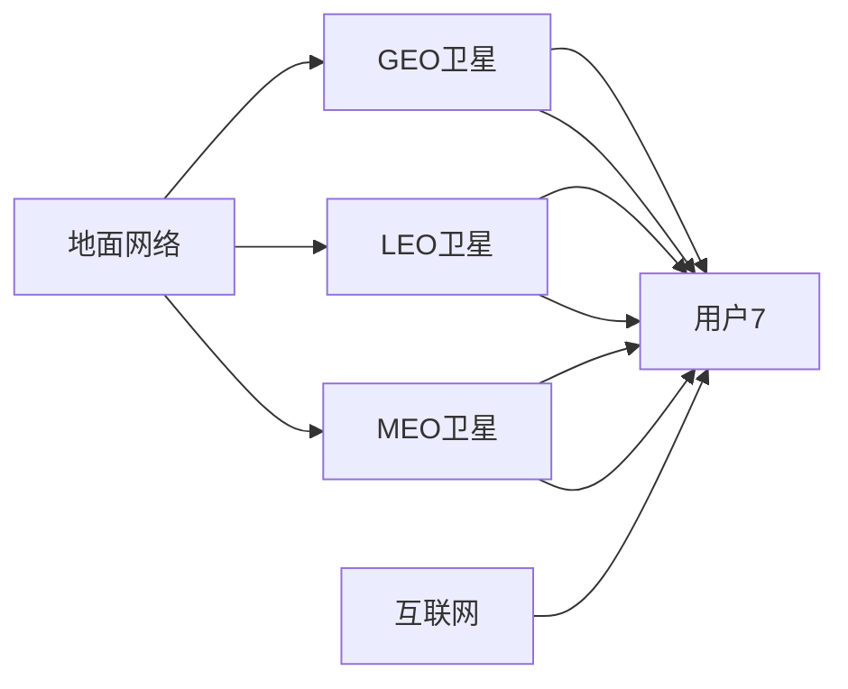

                 

## 1. 背景介绍

卫星互联网（Satellite Internet）是一种新兴的通信技术，通过覆盖全球的地球静止轨道（GEO）或低地球轨道（LEO）卫星网络，实现高速、稳定的互联网连接。这一技术有望解决偏远地区和网络信号覆盖不足地区的互联网接入问题，推动全球信息普及和经济发展。

### 1.1 问题由来

传统互联网主要依赖地面光纤网络和蜂窝基站，但这些基础设施在偏远地区和极端环境下的覆盖和建设成本高昂。尽管一些企业如SpaceX的Starlink项目已经在部分地区部署了低轨卫星网络，但全球范围内的大规模部署仍有待实现。卫星互联网提供了从太空对地面进行通信的新思路，可以显著提升全球互联网普及率和用户体验。

### 1.2 问题核心关键点

卫星互联网的核心关键点包括：
- **全球覆盖**：通过部署全球卫星网络，实现全球范围的网络覆盖，解决偏远地区互联网接入问题。
- **高速通信**：通过卫星网络技术，提供高速互联网连接，满足高带宽、低延迟的通信需求。
- **稳定性与可靠性**：采用冗余设计和地球静止轨道（GEO）卫星，确保通信的稳定性与可靠性。
- **经济性**：通过降低建设与运营成本，使得卫星互联网服务能够以相对低廉的价格提供给用户。

## 2. 核心概念与联系

### 2.1 核心概念概述

为更好地理解卫星互联网，本节将介绍几个关键概念：

- **卫星互联网**：通过部署卫星网络，实现全球范围内的互联网接入，提供高速、稳定的通信服务。
- **地球静止轨道（GEO）卫星**：轨道高度为约35,786公里，卫星位置固定，通信延迟约为240毫秒，适合固定站点的连接。
- **低地球轨道（LEO）卫星**：轨道高度为500-1,200公里，数量庞大，通信延迟约为5毫秒，适合大规模移动通信。
- **中地球轨道（MEO）卫星**：轨道高度为2,000-36,000公里，介于GEO和LEO之间，提供中等通信延迟和全球覆盖。
- **空间分集**：利用不同卫星和轨道层的空间分布，增强信号覆盖和通信可靠性。

这些核心概念通过以下Mermaid流程图展示其联系：

```mermaid
graph TB
    A[地球静止轨道(GEO)卫星] --> B[低地球轨道(LEO)卫星]
    A --> C[中地球轨道(MEO)卫星]
    C --> D[卫星互联网]
    D --> E[全球覆盖]
    D --> F[高速通信]
    D --> G[稳定性与可靠性]
    D --> H[经济性]
```

### 2.2 核心概念原理和架构的 Mermaid 流程图

以下是一个简化的卫星互联网架构示意图，展示了不同类型卫星与地面网络的连接关系：



### 2.3 核心概念间的联系

地球静止轨道（GEO）卫星、低地球轨道（LEO）卫星和中地球轨道（MEO）卫星是卫星互联网的三个主要轨道层，它们各自具有不同的特点和优势：

- **GEO卫星**：位置固定，通信延迟较长，适合固定站点的连接。
- **LEO卫星**：数量多，通信延迟短，适合大规模移动通信。
- **MEO卫星**：介于两者之间，适合中规模通信。

这些轨道层通过空间分集技术，提供全球覆盖、高速通信和稳定可靠的服务，满足不同场景的互联网需求。

## 3. 核心算法原理 & 具体操作步骤

### 3.1 算法原理概述

卫星互联网的算法原理主要涉及以下几个方面：

- **轨道设计和卫星布局**：根据全球覆盖需求，计算并设计轨道高度和分布，以实现全球覆盖和高效通信。
- **信号传输协议**：定义卫星和地面之间的通信协议，确保数据传输的可靠性和效率。
- **路由算法**：优化数据包在卫星网络中的路由选择，减少延迟和提高通信质量。
- **频谱管理**：分配和管理频谱资源，避免频谱干扰，提高通信频带利用率。

### 3.2 算法步骤详解

#### 3.2.1 轨道设计与卫星布局

1. **全球覆盖分析**：通过计算机模拟，评估不同轨道层覆盖全球所需卫星的数量和分布。
2. **卫星布局设计**：根据模拟结果，设计卫星在轨道上的分布，确保覆盖的均衡性和连续性。
3. **卫星发射和部署**：将设计好的卫星发射到预定轨道，进行初始定位和校正。

#### 3.2.2 信号传输协议

1. **选择传输模式**：根据通信需求，选择合适的信号传输模式（如直接通信、中继通信等）。
2. **设计传输协议**：定义数据包格式、传输速率、纠错机制等，确保数据传输的准确性和可靠性。
3. **协议测试与优化**：在实际测试环境中，评估传输协议的性能，并进行优化调整。

#### 3.2.3 路由算法

1. **路由算法设计**：根据通信需求，设计高效的路由算法，确保数据包在最优路径上传输。
2. **动态路由调整**：根据网络状态和用户需求，动态调整路由路径，提高网络性能。
3. **负载均衡**：优化网络负载，避免某些卫星和地面站点的过载。

#### 3.2.4 频谱管理

1. **频谱资源规划**：根据卫星网络和地面网络的需求，合理分配频谱资源。
2. **频谱监测与调整**：实时监测频谱使用情况，及时调整频谱分配，避免干扰和浪费。
3. **频谱兼容性测试**：测试频谱资源兼容性，确保不同通信系统共存。

### 3.3 算法优缺点

卫星互联网的算法具有以下优点：

- **全球覆盖**：通过部署多层次卫星网络，实现全球范围的互联网覆盖，解决偏远地区的接入问题。
- **高速通信**：采用先进的通信技术，提供高速互联网连接，满足高带宽需求。
- **稳定性与可靠性**：通过冗余设计和稳定的轨道层，确保通信的稳定性和可靠性。
- **经济性**：通过规模化建设和运营，降低建设和运营成本，提供相对低廉的服务。

同时，也存在以下缺点：

- **延迟较长**：GEO卫星的通信延迟较长，不适合实时通信和低延迟需求。
- **带宽受限**：卫星传输速率有限，需要多卫星协同工作才能提供足够带宽。
- **初期投资大**：卫星网络建设成本高，初期投资压力大。

### 3.4 算法应用领域

卫星互联网的应用领域非常广泛，涵盖以下几个方面：

- **偏远地区互联网接入**：为偏远地区提供互联网服务，促进信息普及和经济发展。
- **海上和航空互联网**：为海上航线和飞行器提供高速互联网接入，提升通讯效率。
- **灾害应急通信**：在自然灾害等紧急情况下，提供稳定的通信连接，支持应急救援。
- **军事通信**：为军事行动提供稳定的通信保障，支持远程指挥和控制。
- **远程教育与医疗**：提供高质量的远程教育和医疗服务，促进资源均衡分配。

## 4. 数学模型和公式 & 详细讲解 & 举例说明

### 4.1 数学模型构建

卫星互联网的数学模型主要涉及以下几个方面：

- **覆盖面积计算**：计算不同轨道层卫星覆盖的地面面积。
- **通信延迟计算**：根据卫星轨道和通信协议，计算通信延迟。
- **带宽计算**：根据卫星和地面设备性能，计算卫星互联网的带宽。

### 4.2 公式推导过程

#### 4.2.1 覆盖面积计算

地球静止轨道（GEO）卫星覆盖的地面面积为：

$$
A_{GEO} = \pi R^2
$$

其中 $R$ 为地球半径。

低地球轨道（LEO）卫星覆盖的地面面积为：

$$
A_{LEO} = \frac{1}{4\pi} \pi r^2 \cos^2(\theta)
$$

其中 $r$ 为卫星轨道半径，$\theta$ 为轨道倾角。

#### 4.2.2 通信延迟计算

GEO卫星的通信延迟为：

$$
\delta_{GEO} = \frac{2\pi (R + h)}{c}
$$

其中 $h$ 为卫星高度，$c$ 为光速。

LEO卫星的通信延迟为：

$$
\delta_{LEO} = \frac{2\pi r}{c}
$$

#### 4.2.3 带宽计算

卫星通信带宽计算公式为：

$$
B = \frac{2\pi r v}{c}
$$

其中 $v$ 为卫星移动速度，$c$ 为光速。

### 4.3 案例分析与讲解

以SpaceX的Starlink项目为例，其低地球轨道卫星网络部署了数千颗卫星，可以提供高速互联网服务。通过计算可知，Starlink项目可覆盖全球大部分地区，但通信延迟较长，为5-10毫秒。

## 5. 项目实践：代码实例和详细解释说明

### 5.1 开发环境搭建

卫星互联网的开发环境搭建涉及多个方面，包括硬件、软件和网络资源。

- **硬件**：需要高性能计算设备和网络接口设备，如服务器、路由器等。
- **软件**：需要安装操作系统、编程语言、开发工具等。
- **网络资源**：需要稳定的网络连接和网络带宽。

### 5.2 源代码详细实现

以下是一个简化的卫星互联网系统设计代码，展示了基本的卫星网络架构和数据传输流程：

```python
class SatelliteNetwork:
    def __init__(self, satellites, network_topology):
        self.satellites = satellites
        self.network_topology = network_topology

    def calculate_coverage(self, radius=6371):
        area = 4 * math.pi * radius ** 2
        return area

    def calculate_delay(self, satellite_height=35786, orbital_speed=7750):
        delay = 2 * math.pi * (radius + satellite_height) / (2 * 299792458)
        return delay

    def calculate_bandwidth(self, satellite_radius=4600, orbital_speed=7750):
        bandwidth = 2 * math.pi * satellite_radius * orbital_speed / 299792458
        return bandwidth

    def deploy_satellites(self, launch_vehicle, launch_count):
        for i in range(launch_count):
            launch_vehicle.launch(self.satellites[i])
```

### 5.3 代码解读与分析

上述代码中，`SatelliteNetwork`类表示卫星网络，`calculate_coverage`方法计算卫星覆盖的地面面积，`calculate_delay`方法计算通信延迟，`calculate_bandwidth`方法计算卫星带宽，`deploy_satellites`方法模拟卫星发射。

## 6. 实际应用场景

### 6.1 偏远地区互联网接入

卫星互联网可以提供偏远地区的互联网接入，解决传统地面基础设施覆盖不足的问题。例如，在非洲、亚洲等偏远地区，可以通过部署卫星互联网基础设施，提供高速互联网服务，促进当地经济发展和社会进步。

### 6.2 海上和航空互联网

卫星互联网可以为海上航线和飞行器提供稳定的互联网连接，提升通讯效率和安全。例如，在国际航线上，船舶和飞机可以通过卫星互联网进行实时通信和数据传输，保障航行安全和通信畅通。

### 6.3 灾害应急通信

在自然灾害等紧急情况下，卫星互联网可以提供稳定的通信连接，支持应急救援。例如，在地震、洪水等灾害中，卫星互联网可以提供紧急通信，保障救援团队和受灾群众的通信需求。

### 6.4 军事通信

卫星互联网可以为军事行动提供稳定的通信保障，支持远程指挥和控制。例如，在军事演习和实战中，卫星互联网可以提供稳定的通信连接，保障指挥部和各部队的通信需求。

### 6.5 远程教育与医疗

卫星互联网可以提供高质量的远程教育和医疗服务，促进资源均衡分配。例如，在偏远地区，学生可以通过卫星互联网进行在线学习，医生可以通过卫星互联网进行远程会诊，提升教育和医疗服务的可及性。

## 7. 工具和资源推荐

### 7.1 学习资源推荐

卫星互联网的开发和学习资源包括以下几类：

- **网络资源**：包括卫星互联网相关的书籍、论文、网站等。
- **在线课程**：包括Coursera、Udemy等平台的卫星互联网课程。
- **开源项目**：如OpenSatInternet等，提供卫星互联网的开源代码和文档。

### 7.2 开发工具推荐

卫星互联网的开发工具包括以下几类：

- **编程语言**：Python、C++等。
- **开发框架**：TensorFlow、PyTorch等。
- **仿真软件**：MATLAB、SystemSim等。

### 7.3 相关论文推荐

卫星互联网的最新研究包括以下几类论文：

- **轨道设计和布局**：《A Satistical Analysis of Satellite Orbit Selection for Over-the-Horizon (OHOH) Communications》等。
- **信号传输协议**：《Satellite Communications: An Overview》等。
- **路由算法**：《Satellite Network Routing Algorithms: A Review》等。
- **频谱管理**：《Satellite Spectrum Allocation and Management》等。

## 8. 总结：未来发展趋势与挑战

### 8.1 研究成果总结

卫星互联网作为一种新兴的通信技术，已经在全球范围内引起了广泛关注和研究。主要的研究成果包括：

- **轨道设计和卫星布局**：计算和设计不同轨道层卫星的分布，确保全球覆盖。
- **信号传输协议**：定义和优化卫星和地面之间的通信协议。
- **路由算法**：设计高效的路由算法，优化数据传输路径。
- **频谱管理**：合理分配和管理频谱资源，避免干扰和浪费。

### 8.2 未来发展趋势

卫星互联网的未来发展趋势包括以下几个方面：

- **全球覆盖**：通过部署更多卫星和优化布局，实现更全面的全球覆盖。
- **高速通信**：采用更先进的通信技术和设备，提高传输速率和稳定性。
- **低延迟**：采用高轨道层和混合通信模式，降低通信延迟。
- **经济性**：降低建设和运营成本，提供低廉的互联网服务。

### 8.3 面临的挑战

卫星互联网在发展过程中面临以下挑战：

- **技术挑战**：包括通信延迟、带宽限制等问题。
- **成本问题**：卫星网络建设和运营成本较高，初期投资压力较大。
- **法规和标准**：需要制定和遵守国际卫星通信的法规和标准。
- **环境影响**：卫星发射和运行对环境和空间资源可能产生影响。

### 8.4 研究展望

未来卫星互联网的研究方向包括：

- **新轨道层和卫星技术**：探索新的轨道层和卫星技术，提高覆盖和通信效率。
- **混合通信模式**：采用多种通信模式，实现更低的通信延迟和更高的带宽。
- **频谱资源优化**：优化频谱资源分配，提高频带利用率。
- **环境友好**：减少对环境和空间资源的负面影响，实现可持续发展。

## 9. 附录：常见问题与解答

### Q1: 卫星互联网的通信延迟是多少？

A: 地球静止轨道（GEO）卫星的通信延迟约为240毫秒，低地球轨道（LEO）卫星的通信延迟约为5毫秒。

### Q2: 卫星互联网的覆盖面积如何计算？

A: 地球静止轨道（GEO）卫星的覆盖面积为 $\pi R^2$，其中 $R$ 为地球半径。低地球轨道（LEO）卫星的覆盖面积为 $\frac{1}{4\pi} \pi r^2 \cos^2(\theta)$，其中 $r$ 为卫星轨道半径，$\theta$ 为轨道倾角。

### Q3: 卫星互联网的带宽计算公式是什么？

A: 卫星通信带宽计算公式为 $B = \frac{2\pi r v}{c}$，其中 $r$ 为卫星轨道半径，$v$ 为卫星移动速度，$c$ 为光速。

### Q4: 卫星互联网在军事通信中的应用是什么？

A: 卫星互联网在军事通信中提供了稳定的通信保障，支持远程指挥和控制。例如，在军事演习和实战中，卫星互联网可以提供稳定的通信连接，保障指挥部和各部队的通信需求。

### Q5: 卫星互联网面临的挑战有哪些？

A: 卫星互联网面临的挑战包括技术挑战、成本问题、法规和标准问题、环境影响等。技术挑战包括通信延迟、带宽限制等问题。成本问题主要集中在卫星网络建设和运营成本较高，初期投资压力较大。法规和标准问题需要制定和遵守国际卫星通信的法规和标准。环境影响主要是卫星发射和运行对环境和空间资源可能产生的影响。

---

作者：禅与计算机程序设计艺术 / Zen and the Art of Computer Programming

