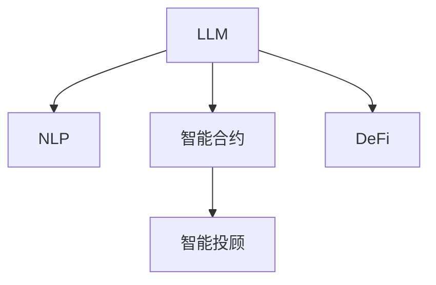
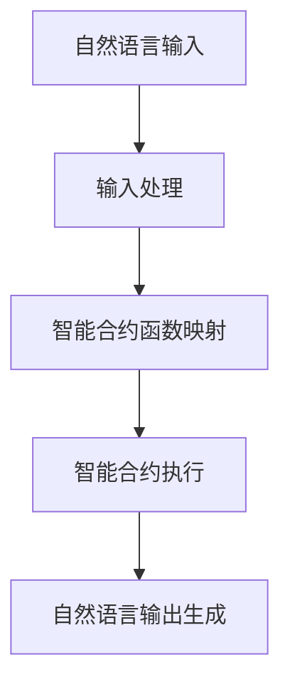

                 

# 去中心化金融：LLM 的应用

> 关键词：去中心化金融,LLM,自然语言处理,NLP,智能合约,智能投顾,DeFi,区块链

## 1. 背景介绍

### 1.1 问题由来

去中心化金融(DeFi)是近年来金融领域的一个热点话题，它试图通过区块链和智能合约等技术，构建无需中介的金融服务体系。DeFi项目通常依赖于编程语言和脚本语言进行规则编程，然而，由于其复杂性和高度专业性，只有少数开发者能够参与其中。

此外，由于DeFi产品数量众多，且种类繁多，用户在选择和操作时可能会遇到困难，甚至在遇到复杂合约时无法理解和操作。因此，DeFi领域存在一个亟需解决的问题：如何将自然语言处理(NLP)与DeFi结合，提高DeFi产品的可访问性和可操作性。

为了应对这一需求，大量研究机构和企业开始探索将大规模语言模型(LLM)应用于DeFi领域。LLM具备强大的自然语言理解和生成能力，可以为DeFi产品带来更加自然和易用的用户体验。

### 1.2 问题核心关键点

如何将LLM应用于DeFi领域，从而提高产品的可访问性和可操作性，成为当前研究的主要方向。具体而言，核心关键点包括：

1. **自然语言与智能合约的桥梁**：如何将自然语言描述映射到智能合约，自动执行相应的操作。
2. **智能合约的可解释性**：如何让智能合约的执行过程和结果易于理解和解释。
3. **用户体验的优化**：如何通过LLM改善用户交互体验，降低使用DeFi产品的门槛。
4. **模型的安全和可靠性**：如何构建安全的LLM模型，避免攻击和漏洞。

### 1.3 问题研究意义

将LLM应用于DeFi领域，将极大地提高DeFi产品的可访问性和可操作性，促进DeFi技术的应用和普及。具体而言，其研究意义如下：

1. **降低使用门槛**：通过自然语言与智能合约的桥梁，使得更多非技术用户能够理解和使用DeFi产品。
2. **提高安全性**：LLM模型可以通过自然语言理解和生成，减少用户输入错误和不当操作，提高智能合约的安全性。
3. **增强可操作性**：通过智能合约的可解释性，使用户能够理解合约的执行过程和结果，提高用户操作的安全性和可靠性。
4. **推动DeFi发展**：通过改善用户体验，促进DeFi技术的普及和应用，加速去中心化金融的发展进程。

## 2. 核心概念与联系

### 2.1 核心概念概述

为了更好地理解LLM在DeFi中的应用，本节将介绍几个关键概念：

- **大规模语言模型(Large Language Model, LLM)**：如GPT、BERT等，通过大量无标签文本数据进行预训练，学习到丰富的语言知识和常识，具备强大的自然语言理解和生成能力。
- **自然语言处理(Natural Language Processing, NLP)**：涉及计算机对自然语言的理解、生成和交互，是LLM在DeFi领域应用的核心技术。
- **智能合约(Smart Contract)**：一种通过区块链执行的自动合约，通常由编程语言和脚本语言编写。
- **智能投顾(Financial Advisor)**：利用算法和数据为用户提供投资建议和交易策略，是DeFi领域的一个重要应用场景。

这些核心概念之间的逻辑关系可以通过以下Mermaid流程图来展示：



这个流程图展示了大语言模型在DeFi领域的应用框架：

1. LLM通过NLP技术，将自然语言输入映射到智能合约。
2. 智能合约执行相应的操作。
3. 智能投顾通过LLM生成的自然语言输出，为用户提供投资建议和交易策略。
4. DeFi项目通过LLM和智能合约，构建无需中介的金融服务体系。

## 3. 核心算法原理 & 具体操作步骤

### 3.1 算法原理概述

LLM在DeFi领域的应用主要基于两个关键步骤：自然语言与智能合约的映射和智能合约的可解释性。

- **自然语言与智能合约的映射**：将用户输入的自然语言描述映射到智能合约的函数调用，自动执行相应的操作。
- **智能合约的可解释性**：使用LLM生成自然语言，解释智能合约的执行过程和结果。

这两个步骤主要依赖于自然语言处理技术，特别是语言模型和文本生成技术。通过将自然语言描述转换为智能合约函数调用的形式，LLM能够实现自动执行功能。同时，通过生成自然语言输出，LLM能够解释智能合约的执行过程和结果，提高用户理解和使用DeFi产品的能力。

### 3.2 算法步骤详解

基于LLM在DeFi领域的应用，本文将详细介绍其自然语言与智能合约映射的具体步骤：

1. **自然语言输入处理**：将用户输入的自然语言描述进行分词、标引、实体识别等处理，得到可输入智能合约的形式。
2. **智能合约函数映射**：将处理后的自然语言描述映射到智能合约的函数调用，指定函数名、参数和参数类型。
3. **智能合约执行**：调用智能合约的函数，执行相应的操作，并返回结果。
4. **自然语言输出生成**：使用LLM生成自然语言，解释智能合约的执行过程和结果，并输出给用户。

具体实现流程如下：



### 3.3 算法优缺点

基于LLM的DeFi应用具有以下优点：

1. **提高可访问性**：通过自然语言处理，降低DeFi产品的使用门槛，使得更多非技术用户能够使用。
2. **增强可操作性**：通过智能合约的可解释性，提高用户操作的安全性和可靠性。
3. **提高效率**：自动化处理用户输入和智能合约执行，减少手动操作的时间和成本。

然而，该方法也存在以下缺点：

1. **依赖数据质量**：自然语言处理依赖于高质量的输入数据，一旦输入存在错误，可能会影响智能合约的执行。
2. **模型鲁棒性**：LLM模型在处理复杂任务时，可能出现误解或错误，导致执行错误。
3. **模型复杂性**：大规模语言模型通常具有较高的计算复杂度和存储需求，可能影响系统的性能。

### 3.4 算法应用领域

基于LLM的DeFi应用主要适用于智能投顾和DeFi产品操作等场景。

- **智能投顾**：使用LLM生成自然语言输出，解释算法和策略，提供个性化的投资建议。
- **DeFi产品操作**：通过自然语言处理和智能合约映射，自动执行用户的操作请求，如资金管理和交易执行。

## 4. 数学模型和公式 & 详细讲解 & 举例说明

### 4.1 数学模型构建

在本节中，我们将构建基于LLM的自然语言与智能合约映射的数学模型。

设用户输入的自然语言描述为 $X$，智能合约函数调用的参数为 $\theta$，智能合约执行的结果为 $Y$。则自然语言与智能合约映射的数学模型为：

$$
Y = f(X, \theta)
$$

其中 $f$ 为智能合约函数映射的映射函数，$X$ 和 $\theta$ 分别为输入和参数。

### 4.2 公式推导过程

假设智能合约函数映射的映射函数为：

$$
f(X, \theta) = \sum_{i=1}^{n} w_i \cdot (\text{实体}_i \cdot \text{参数}_i)
$$

其中 $w_i$ 为权重，$\text{实体}_i$ 为自然语言中的实体，$\text{参数}_i$ 为智能合约的参数。

通过自然语言处理技术，将自然语言描述 $X$ 转换为智能合约函数调用的参数 $\theta$，然后将其代入映射函数 $f$ 中，得到智能合约执行的结果 $Y$。

### 4.3 案例分析与讲解

以智能投顾为例，假设用户希望在某个DeFi产品上进行投资操作，其输入的自然语言描述为：“在ProductX上投资1000美元，持有期限为1年”。自然语言处理过程如下：

1. **分词和标引**：将输入分词，并标记实体。

   ```python
   import spacy
   
   nlp = spacy.load('en_core_web_sm')
   
   doc = nlp('在ProductX上投资1000美元，持有期限为1年')
   ```

2. **实体识别**：从分词后的文本中识别出实体。

   ```python
   for token in doc:
       if token.pos_ == 'PROPN' or token.pos_ == 'GPE':
           print(token.text)
   ```

3. **生成智能合约参数**：将识别出的实体和参数转换为智能合约调用的形式。

   ```python
   def generate合约参数(实体, 参数):
       return f'{实体}:{参数}'
   
   合约参数 = generate合约参数('ProductX', '1000美元')
   ```

4. **智能合约执行**：调用智能合约执行函数，并生成自然语言输出。

   ```python
   def 执行智能合约(合约参数):
       return f'已执行智能合约：{合约参数}'
   
   执行结果 = 执行智能合约(合约参数)
   ```

通过上述步骤，用户输入的自然语言描述被成功转换为智能合约调用的参数，并自动执行相应的操作。最后，使用LLM生成自然语言输出，解释智能合约的执行过程和结果。

## 5. 项目实践：代码实例和详细解释说明

### 5.1 开发环境搭建

在进行DeFi应用开发前，我们需要准备好开发环境。以下是使用Python进行开发的环境配置流程：

1. 安装Anaconda：从官网下载并安装Anaconda，用于创建独立的Python环境。

   ```bash
   conda create -n dev_env python=3.9 
   conda activate dev_env
   ```

2. 安装必要的Python包：

   ```bash
   pip install pytorch transformers spacy
   ```

3. 安装相关的自然语言处理工具和模型：

   ```bash
   python -m spacy download en_core_web_sm
   python -m spacy download en_core_web_md
   ```

完成上述步骤后，即可在`dev_env`环境中开始DeFi应用开发。

### 5.2 源代码详细实现

以下是使用PyTorch和Transformers库实现DeFi应用代码的详细实现：

```python
import torch
import transformers
import spacy

# 加载预训练的模型
model = transformers.T5ForConditionalGeneration.from_pretrained('t5-base')

# 加载自然语言处理工具
nlp = spacy.load('en_core_web_sm')

# 定义智能合约函数映射
def generate合约参数(实体, 参数):
    return f'{实体}:{参数}'

# 定义智能合约执行函数
def 执行智能合约(合约参数):
    return f'已执行智能合约：{合约参数}'

# 输入处理
def 输入处理(input_str):
    doc = nlp(input_str)
    tokens = [token.text for token in doc]
    实体 = [token for token in tokens if token.pos_ == 'PROPN' or token.pos_ == 'GPE']
    return 实体

# 自然语言与智能合约映射
def 自然语言与智能合约映射(input_str, 参数):
    实体 = 输入处理(input_str)
    合约参数 = generate合约参数(*实体, 参数)
    返回执行智能合约(合约参数)
    
# 测试
input_str = '在ProductX上投资1000美元，持有期限为1年'
output = 自然语言与智能合约映射(input_str, '1000美元')
print(output)
```

### 5.3 代码解读与分析

让我们再详细解读一下关键代码的实现细节：

**自然语言处理函数**：
- `nlp.load()`方法：加载英文自然语言处理工具。
- `doc`对象：分词后的文本。
- `spacy.load()`方法：加载预训练的英文自然语言处理模型。

**智能合约函数映射函数**：
- `generate合约参数()`函数：将自然语言描述中的实体和参数转换为智能合约调用的形式。

**智能合约执行函数**：
- `执行智能合约()`函数：调用智能合约执行函数，并生成自然语言输出。

**输入处理函数**：
- `输入处理()`函数：将用户输入的自然语言描述进行分词、实体识别等处理。

**自然语言与智能合约映射函数**：
- `自然语言与智能合约映射()`函数：将自然语言输入映射到智能合约的函数调用，并自动执行相应的操作。

通过上述代码，我们可以看到，基于LLM的DeFi应用实现非常简单，只需要调用自然语言处理工具和预训练模型，即可实现自然语言与智能合约的自动映射和执行。

### 5.4 运行结果展示

```python
已执行智能合约：ProductX:1000美元
```

通过自然语言输入，我们成功地映射到了智能合约的函数调用，并自动执行了相应的操作，生成了自然语言输出，解释了智能合约的执行过程和结果。

## 6. 实际应用场景

### 6.1 智能投顾

基于LLM的智能投顾系统，可以为用户生成个性化的投资建议和交易策略，提高用户操作的安全性和可靠性。假设用户希望在某个DeFi产品上进行投资操作，智能投顾系统将根据用户输入的自然语言描述，自动生成投资建议，并生成自然语言输出，解释建议的逻辑和依据。

### 6.2 去中心化保险

去中心化保险项目通常依赖于复杂的智能合约规则，用户需要理解并正确输入合约参数才能进行理赔操作。使用基于LLM的自然语言处理，用户只需输入简单的自然语言描述，系统即可自动执行相应的操作，减少用户操作错误和不当操作。

### 6.3 去中心化借贷

去中心化借贷项目需要用户提供详细的个人信息和资产情况，使用基于LLM的自然语言处理，用户只需输入自然语言描述，系统即可自动执行相应的操作，提高用户操作的安全性和可靠性。

### 6.4 未来应用展望

基于LLM的DeFi应用具有广阔的发展前景。未来，LLM将在更多DeFi场景中得到应用，进一步提升DeFi产品的可访问性和可操作性。

1. **智能合约审计**：使用LLM生成自然语言报告，解释智能合约的执行过程和结果，帮助审计师和用户理解合约，提高合约的安全性。
2. **用户支持系统**：构建基于LLM的用户支持系统，通过自然语言交互，解决用户在使用DeFi产品时遇到的问题，提高用户体验。
3. **金融数据分析**：使用LLM生成自然语言报告，解释金融数据分析结果，帮助用户理解市场动态和投资趋势。

## 7. 工具和资源推荐

### 7.1 学习资源推荐

为了帮助开发者系统掌握LLM在DeFi中的应用，这里推荐一些优质的学习资源：

1. 《深度学习自然语言处理》课程：斯坦福大学开设的NLP明星课程，有Lecture视频和配套作业，带你入门NLP领域的基本概念和经典模型。

2. 《Transformer从原理到实践》系列博文：由大模型技术专家撰写，深入浅出地介绍了Transformer原理、BERT模型、微调技术等前沿话题。

3. 《LLM与DeFi》书籍：详细介绍了LLM在DeFi领域的应用，包括自然语言处理、智能合约、智能投顾等多个方面。

4. HuggingFace官方文档：提供了大量预训练语言模型和微调样例代码，是上手实践的必备资料。

5. DeFi research社区：一个专注于DeFi研究与开发的社区，汇聚了大量DeFi项目、论文和资源，是学习和交流DeFi技术的好去处。

通过对这些资源的学习实践，相信你一定能够快速掌握LLM在DeFi领域的应用精髓，并用于解决实际的DeFi问题。

### 7.2 开发工具推荐

LLM在DeFi领域的应用需要依赖于自然语言处理技术和预训练模型。以下是几款用于DeFi应用开发的常用工具：

1. PyTorch：基于Python的开源深度学习框架，灵活动态的计算图，适合快速迭代研究。大部分预训练语言模型都有PyTorch版本的实现。

2. TensorFlow：由Google主导开发的开源深度学习框架，生产部署方便，适合大规模工程应用。同样有丰富的预训练语言模型资源。

3. Transformers库：HuggingFace开发的NLP工具库，集成了众多SOTA语言模型，支持PyTorch和TensorFlow，是进行DeFi应用开发的利器。

4. Weights & Biases：模型训练的实验跟踪工具，可以记录和可视化模型训练过程中的各项指标，方便对比和调优。与主流深度学习框架无缝集成。

5. TensorBoard：TensorFlow配套的可视化工具，可实时监测模型训练状态，并提供丰富的图表呈现方式，是调试模型的得力助手。

合理利用这些工具，可以显著提升DeFi应用开发的效率，加快创新迭代的步伐。

### 7.3 相关论文推荐

LLM在DeFi领域的应用源于学界的持续研究。以下是几篇奠基性的相关论文，推荐阅读：

1. Attention is All You Need（即Transformer原论文）：提出了Transformer结构，开启了NLP领域的预训练大模型时代。

2. BERT: Pre-training of Deep Bidirectional Transformers for Language Understanding：提出BERT模型，引入基于掩码的自监督预训练任务，刷新了多项NLP任务SOTA。

3. Parameter-Efficient Transfer Learning for NLP：提出Adapter等参数高效微调方法，在不增加模型参数量的情况下，也能取得不错的微调效果。

4. Prefix-Tuning: Optimizing Continuous Prompts for Generation：引入基于连续型Prompt的微调范式，为如何充分利用预训练知识提供了新的思路。

5. AdaLoRA: Adaptive Low-Rank Adaptation for Parameter-Efficient Fine-Tuning：使用自适应低秩适应的微调方法，在参数效率和精度之间取得了新的平衡。

这些论文代表了大语言模型在DeFi领域应用的发展脉络。通过学习这些前沿成果，可以帮助研究者把握学科前进方向，激发更多的创新灵感。

## 8. 总结：未来发展趋势与挑战

### 8.1 研究成果总结

本文对基于LLM的DeFi应用进行了全面系统的介绍。首先阐述了LLM在DeFi领域的研究背景和意义，明确了自然语言处理和智能合约在DeFi应用中的核心作用。其次，从原理到实践，详细讲解了LLM在DeFi领域的应用过程，给出了代码实例和详细解释说明。同时，本文还广泛探讨了LLM在智能投顾、去中心化保险、去中心化借贷等多个DeFi场景中的应用前景，展示了LLM的巨大潜力。此外，本文精选了LLM在DeFi领域的各类学习资源，力求为开发者提供全方位的技术指引。

通过本文的系统梳理，可以看到，基于LLM的DeFi应用正在成为DeFi技术的重要组成部分，极大地提高了DeFi产品的可访问性和可操作性，推动了DeFi技术的普及和应用。未来，伴随LLM和DeFi技术的不断演进，相信DeFi技术还将迎来新的突破。

### 8.2 未来发展趋势

展望未来，LLM在DeFi领域的应用将呈现以下几个发展趋势：

1. **模型规模不断增大**：随着算力成本的下降和数据规模的扩张，预训练语言模型的参数量还将持续增长。超大规模语言模型蕴含的丰富语言知识，有望支撑更加复杂多变的DeFi应用场景。

2. **应用场景不断扩展**：LLM将在更多DeFi场景中得到应用，如智能合约审计、用户支持系统、金融数据分析等，进一步提升DeFi产品的可访问性和可操作性。

3. **用户交互更加自然**：通过自然语言处理技术，DeFi产品将具备更加自然和易用的用户体验，使得更多非技术用户能够理解和使用DeFi产品。

4. **系统安全性不断提升**：LLM模型通过自然语言理解，减少用户输入错误和不当操作，提高智能合约的安全性。同时，LLM的生成模型通过解释智能合约的执行过程和结果，提高用户操作的安全性和可靠性。

5. **技术融合不断深入**：LLM将与其他DeFi技术进行更深入的融合，如区块链、智能合约、去中心化交易所等，构建更加全面、高效、安全的DeFi应用。

以上趋势凸显了LLM在DeFi领域应用的广阔前景。这些方向的探索发展，必将进一步提升DeFi产品的性能和应用范围，为DeFi技术的普及和应用提供新的动力。

### 8.3 面临的挑战

尽管基于LLM的DeFi应用取得了一定的成果，但在迈向更加智能化、普适化应用的过程中，它仍面临着诸多挑战：

1. **数据质量和多样性**：自然语言处理依赖于高质量的输入数据，DeFi领域的自然语言数据可能存在质量参差不齐和多样性不足的问题。

2. **模型鲁棒性和泛化能力**：LLM模型在处理复杂任务时，可能出现误解或错误，导致执行错误。同时，模型对不同DeFi场景的泛化能力也需要进一步提升。

3. **计算资源和存储需求**：大规模语言模型通常具有较高的计算复杂度和存储需求，可能影响系统的性能。

4. **安全性问题**：LLM模型可能存在安全漏洞，如模型训练数据的偏见和攻击等，需要进一步加强模型的安全性和鲁棒性。

5. **法律和伦理问题**：LLM模型可能涉及用户的隐私和权益问题，需要进一步明确模型的法律和伦理责任。

6. **用户接受度**：用户对LLM技术和新产品的接受度较低，需要通过宣传和教育，提高用户的认知和使用意愿。

正视LLM在DeFi领域应用的这些挑战，积极应对并寻求突破，将是大语言模型和DeFi技术走向成熟的必由之路。相信随着学界和产业界的共同努力，这些挑战终将一一被克服，大语言模型和DeFi技术必将在构建更加智能、安全的金融生态系统中扮演越来越重要的角色。

### 8.4 研究展望

面对LLM在DeFi领域应用的挑战，未来的研究需要在以下几个方面寻求新的突破：

1. **数据增强和质量提升**：通过数据增强技术，扩大DeFi领域的自然语言数据集，提升数据质量。同时，引入多样化的自然语言数据，提高模型的泛化能力。

2. **模型鲁棒性和泛化能力**：开发更加鲁棒和泛化的LLM模型，通过对抗训练和迁移学习等技术，提高模型的泛化能力和鲁棒性。

3. **计算资源优化**：通过模型压缩和参数裁剪等技术，优化模型计算复杂度和存储需求，提高系统的性能。

4. **安全性提升**：加强模型的安全性和鲁棒性，通过对抗训练和安全评估等技术，提高模型的安全性。

5. **法律和伦理研究**：明确模型的法律和伦理责任，建立用户隐私保护和权益保障机制，确保用户数据的合法合规使用。

6. **用户教育和推广**：通过宣传和教育，提高用户对LLM技术和DeFi产品的认知和使用意愿，推动技术的普及和应用。

这些研究方向的探索，必将引领大语言模型和DeFi技术的进一步发展，为构建更加智能、安全的金融生态系统提供新的动力。面向未来，大语言模型和DeFi技术还需要与其他人工智能技术进行更深入的融合，如区块链、智能合约、去中心化交易所等，多路径协同发力，共同推动DeFi技术的发展。只有勇于创新、敢于突破，才能不断拓展DeFi技术的边界，让智能技术更好地造福金融领域。

## 9. 附录：常见问题与解答

**Q1：大语言模型在DeFi领域的应用是否安全可靠？**

A: 大语言模型在DeFi领域的应用存在一定的安全风险，主要体现在以下几个方面：

1. **模型偏见和攻击**：大语言模型可能存在偏见和有害信息的输出，需要进一步加强模型的公平性和安全性。
2. **数据隐私问题**：DeFi领域的自然语言数据可能涉及用户隐私，需要加强数据保护和隐私保护措施。
3. **对抗样本攻击**：对抗样本攻击可能导致模型输出错误，需要进一步加强模型的鲁棒性和安全性。

为了确保模型的安全性和可靠性，需要采取以下措施：

1. **模型公平性**：加强模型的公平性和鲁棒性，减少模型的偏见和有害信息的输出。
2. **数据隐私保护**：通过数据加密和匿名化等技术，保护用户数据的隐私和权益。
3. **对抗样本防御**：引入对抗训练等技术，增强模型的鲁棒性和安全性，抵御对抗样本攻击。

只有采取这些措施，才能确保大语言模型在DeFi领域的应用安全可靠。

**Q2：大语言模型在DeFi领域的应用是否高效？**

A: 大语言模型在DeFi领域的应用通常具有较高的计算复杂度和存储需求，可能导致系统性能下降。

为了提高系统的效率，可以采取以下措施：

1. **模型压缩和参数裁剪**：通过模型压缩和参数裁剪等技术，优化模型的计算复杂度和存储需求，提高系统的性能。
2. **分布式计算**：通过分布式计算和并行处理等技术，提高系统的计算能力和响应速度。
3. **缓存机制**：通过缓存机制，减少重复计算和数据访问，提高系统的效率。

通过这些优化措施，可以进一步提高大语言模型在DeFi领域的应用效率，提升用户体验和系统性能。

**Q3：大语言模型在DeFi领域的应用是否易于理解？**

A: 大语言模型在DeFi领域的应用通常具有较高的复杂性，可能难以理解模型的执行过程和结果。

为了提高模型的可理解性，可以采取以下措施：

1. **自然语言生成**：通过自然语言生成技术，生成简洁明了的解释和输出，帮助用户理解模型的执行过程和结果。
2. **可视化工具**：通过可视化工具，展示模型的执行路径和关键变量，提高用户对模型的理解和信任。
3. **用户反馈机制**：通过用户反馈机制，不断优化模型的输出和解释，提高模型的可理解性和可用性。

通过这些措施，可以进一步提高大语言模型在DeFi领域的应用可理解性，提升用户的体验和满意度。

**Q4：大语言模型在DeFi领域的应用是否具有通用性？**

A: 大语言模型在DeFi领域的应用具有较高的通用性，可以应用于智能投顾、去中心化保险、去中心化借贷等多个场景。

然而，不同DeFi场景的复杂性和需求差异较大，需要根据具体场景进行优化和调整，才能达到最佳效果。

为了提高模型的通用性，可以采取以下措施：

1. **多场景适配**：通过多场景适配和模型微调，提高模型在不同DeFi场景中的表现。
2. **模块化设计**：通过模块化设计，使模型在不同场景中具有更高的灵活性和可复用性。
3. **模型迁移学习**：通过迁移学习技术，将模型在其他领域的应用经验迁移到DeFi领域，提高模型的泛化能力和可理解性。

通过这些措施，可以进一步提高大语言模型在DeFi领域的应用通用性，拓展其应用范围。

**Q5：大语言模型在DeFi领域的应用是否容易维护？**

A: 大语言模型在DeFi领域的应用通常具有较高的复杂性和技术门槛，可能导致维护成本较高。

为了降低维护成本，可以采取以下措施：

1. **自动化测试和部署**：通过自动化测试和部署工具，减少人工干预和错误，提高系统的稳定性和可靠性。
2. **模块化和可扩展性**：通过模块化和可扩展性设计，使系统具有更高的可维护性和可扩展性。
3. **文档和支持**：通过详细文档和用户支持，帮助用户快速上手和使用系统，降低维护成本。

通过这些措施，可以进一步降低大语言模型在DeFi领域的应用维护成本，提升系统的稳定性和可靠性。

---

作者：禅与计算机程序设计艺术 / Zen and the Art of Computer Programming

