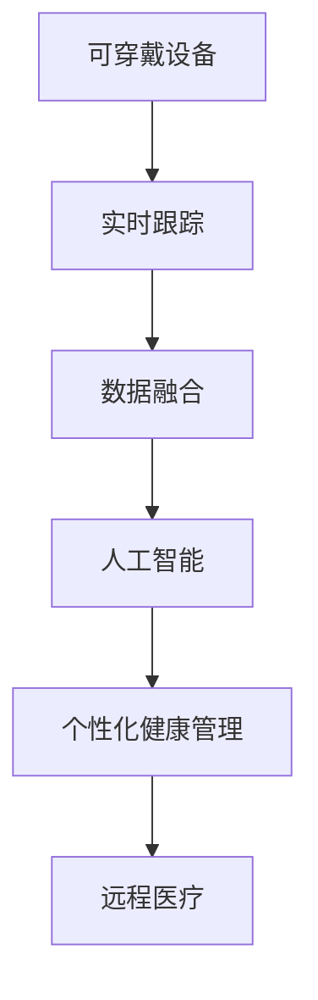

                 

# 可穿戴设备在健康监测中的应用：24/7实时跟踪

## 1. 背景介绍

### 1.1 问题由来

随着科技的飞速发展，可穿戴设备已经成为人们生活中不可或缺的一部分。从智能手表到健身追踪器，再到血糖监测器，这些设备无处不在，改变了我们的生活方式。在健康监测领域，可穿戴设备的作用尤为突出。它们不仅能实时监测用户的生理数据，还能提供个性化的健康建议和预警。特别是近年来，随着传感器技术的进步和人工智能算法的优化，可穿戴设备在健康监测中的应用得到了更广泛的应用。

### 1.2 问题核心关键点

可穿戴设备在健康监测中的应用，主要是基于24/7实时跟踪用户的生理数据，如心率、血压、血糖、睡眠质量等。通过将这些数据上传到云端，结合人工智能算法进行分析和建模，可穿戴设备能够为用户提供个性化的健康建议和预警，帮助用户更好地管理自己的健康状况。

### 1.3 问题研究意义

研究可穿戴设备在健康监测中的应用，对于推动个性化健康管理、提升医疗服务水平、降低医疗成本具有重要意义。通过实时跟踪用户的生理数据，可以及时发现健康问题，防止疾病的进一步恶化。特别是对于慢性病患者、老年人等特殊群体，可穿戴设备提供了一种便捷、高效的自我健康监测手段。

## 2. 核心概念与联系

### 2.1 核心概念概述

为更好地理解可穿戴设备在健康监测中的应用，本节将介绍几个密切相关的核心概念：

- 可穿戴设备(Wearable Devices)：能够搭载传感器和处理器，实时监测和记录用户生理数据的智能设备。如智能手表、健身追踪器、血糖监测器等。

- 实时跟踪(Real-time Tracking)：通过传感器持续采集用户的生理数据，并实时发送到云端进行分析处理，以提供及时的健康建议和预警。

- 数据融合(Data Fusion)：将多种传感器采集的生理数据进行融合，通过算法提升数据的准确性和可靠性。

- 人工智能(AI)：结合机器学习、深度学习等算法，对生理数据进行分析和建模，提取有用的健康信息。

- 个性化健康管理(Personalized Health Management)：根据用户个人的生理数据和健康历史，提供个性化的健康建议和治疗方案。

- 远程医疗(Remote Healthcare)：通过可穿戴设备和互联网，将用户健康数据传输到医疗专家手中，实现远程诊断和治疗。

这些核心概念之间的逻辑关系可以通过以下Mermaid流程图来展示：



这个流程图展示了他核心概念的逻辑关系：

1. 可穿戴设备通过传感器实时采集生理数据。
2. 数据通过实时跟踪传输到云端。
3. 多种传感器数据通过数据融合提升准确性。
4. 融合后的数据经过人工智能算法进行分析。
5. 分析结果用于个性化健康管理和远程医疗。

## 3. 核心算法原理 & 具体操作步骤

### 3.1 算法原理概述

基于24/7实时跟踪的可穿戴设备健康监测，本质上是一种混合信号处理和人工智能算法的过程。其核心思想是：通过传感器采集用户的生理数据，结合数据融合和人工智能技术，对数据进行分析和建模，从而提供个性化的健康建议和预警。

形式化地，假设可穿戴设备采集到的生理数据序列为 $x_1,x_2,\ldots,x_n$，其中 $x_i$ 表示第 $i$ 次采集到的数据。假设数据融合后的序列为 $\hat{x}_1,\hat{x}_2,\ldots,\hat{x}_n$，其中 $\hat{x}_i$ 表示第 $i$ 次融合后的数据。则健康监测的目标是找到函数 $f$，使得：

$$
f(\hat{x}_1,\hat{x}_2,\ldots,\hat{x}_n) = \min_{\theta} \mathcal{L}(f, D)
$$

其中 $\mathcal{L}$ 为健康建议和预警损失函数，$D$ 为用户的健康历史和当前生理数据构成的数据集。通过最小化损失函数，模型能够生成个性化的健康建议和预警。

### 3.2 算法步骤详解

基于24/7实时跟踪的可穿戴设备健康监测，一般包括以下几个关键步骤：

**Step 1: 设备传感器的校准与配置**
- 安装传感器，并进行校准，确保数据的准确性。
- 设定传感器采集频率和数据保留期限，控制设备功耗和存储。

**Step 2: 生理数据的采集与存储**
- 设备实时采集用户的生理数据，如心率、血压、血糖等。
- 将采集到的数据存储在本地或云端，以保证数据的完整性和可用性。

**Step 3: 数据的融合与预处理**
- 对采集到的多种传感器数据进行融合，消除冗余和噪声。
- 对数据进行归一化和标准化处理，确保数据的一致性和可比性。

**Step 4: 数据的传输与分析**
- 将融合后的数据通过无线方式传输到云端或本地服务器。
- 使用人工智能算法对数据进行分析和建模，提取有用的健康信息。

**Step 5: 个性化健康建议与预警**
- 根据分析结果，生成个性化的健康建议和预警信息。
- 通过APP或短信等方式，将健康建议和预警推送给用户。

**Step 6: 用户反馈与模型更新**
- 收集用户的反馈信息，评估健康建议和预警的效果。
- 根据反馈数据，更新和优化模型，提升其准确性和可靠性。

### 3.3 算法优缺点

基于24/7实时跟踪的可穿戴设备健康监测方法具有以下优点：
1. 实时性强。传感器能够持续采集生理数据，提供实时的健康建议和预警。
2. 个性化高。结合用户的健康历史和当前生理数据，提供个性化的健康管理方案。
3. 数据量大。多种传感器数据的融合，提供了丰富的健康信息。
4. 应用广泛。适用于慢性病管理、老年人健康监测、运动员训练监控等多个领域。

同时，该方法也存在一定的局限性：
1. 设备成本高。需要安装和维护多种传感器，设备成本较高。
2. 数据隐私问题。用户生理数据涉及隐私，需要严格的数据保护措施。
3. 数据质量受限。传感器可能存在误读或偏差，数据质量有待提升。
4. 算法复杂度高。数据分析和建模过程复杂，需要专业知识和技术支持。

尽管存在这些局限性，但就目前而言，基于24/7实时跟踪的健康监测方法仍然是大规模应用的主流范式。未来相关研究的重点在于如何进一步降低设备成本，提升数据质量，并优化算法复杂度，以实现更加高效、可靠的健康监测服务。

### 3.4 算法应用领域

基于24/7实时跟踪的健康监测方法，已经在多个领域得到了广泛的应用，包括但不限于：

- 慢性病管理：如糖尿病、高血压、心脏病等。通过实时监测生理数据，提供个性化的治疗建议和预警。
- 老年人健康监测：通过监测心率、血压等指标，及时发现异常情况，保障老年人的健康安全。
- 运动员训练监控：通过实时监测心率和耗氧量等数据，科学调整训练强度，防止过度训练和受伤。
- 心理健康监测：通过监测睡眠质量和生理活动，提供心理健康建议和预警，缓解压力和焦虑。
- 紧急救援：在突发情况下，通过实时监测生理数据，快速定位和救助危重患者。

除了上述这些经典应用外，基于24/7实时跟踪的健康监测技术还在更多场景中得到创新性地应用，如智能家居、智能医疗、智能健康管理平台等，为健康监测技术带来了新的突破。随着技术的不断发展，健康监测技术将更加智能和便捷，成为人们生活中不可或缺的一部分。

## 4. 数学模型和公式 & 详细讲解  
### 4.1 数学模型构建

本节将使用数学语言对24/7实时跟踪的可穿戴设备健康监测过程进行更加严格的刻画。

记生理数据序列为 $x_1,x_2,\ldots,x_n$，其中 $x_i$ 表示第 $i$ 次采集到的数据。假设数据融合后的序列为 $\hat{x}_1,\hat{x}_2,\ldots,\hat{x}_n$，其中 $\hat{x}_i$ 表示第 $i$ 次融合后的数据。则健康监测的目标是找到函数 $f$，使得：

$$
f(\hat{x}_1,\hat{x}_2,\ldots,\hat{x}_n) = \min_{\theta} \mathcal{L}(f, D)
$$

其中 $\mathcal{L}$ 为健康建议和预警损失函数，$D$ 为用户的健康历史和当前生理数据构成的数据集。通过最小化损失函数，模型能够生成个性化的健康建议和预警。

### 4.2 公式推导过程

以下我们以糖尿病监测为例，推导基于生理数据的时间序列分析模型。

假设血糖数据 $x_i \sim Gaussian(\mu_i,\sigma_i^2)$，其中 $\mu_i$ 为第 $i$ 次血糖值的期望，$\sigma_i^2$ 为方差。则健康监测的目标是找到函数 $f$，使得：

$$
f(x_1,x_2,\ldots,x_n) = \min_{\theta} \mathcal{L}(f, D)
$$

其中 $\mathcal{L}$ 为健康建议和预警损失函数，$D$ 为用户的血糖历史和当前血糖数据构成的数据集。假设血糖值存在周期性波动，可以使用自回归模型对数据进行建模：

$$
x_i = \alpha x_{i-1} + \beta + \epsilon_i
$$

其中 $\alpha$ 为自回归系数，$\beta$ 为常数项，$\epsilon_i \sim Gaussian(0,\sigma^2)$ 为误差项。根据最小二乘法，求解 $\alpha$ 和 $\beta$：

$$
\hat{\alpha}, \hat{\beta} = \mathop{\arg\min}_{\alpha,\beta} \sum_{i=1}^n (x_i - \alpha x_{i-1} - \beta)^2
$$

通过求解上述方程，可以得到血糖值的预测模型，并生成个性化的健康建议和预警。

## 5. 项目实践：代码实例和详细解释说明
### 5.1 开发环境搭建

在进行健康监测项目开发前，我们需要准备好开发环境。以下是使用Python进行PyTorch开发的环境配置流程：

1. 安装Anaconda：从官网下载并安装Anaconda，用于创建独立的Python环境。

2. 创建并激活虚拟环境：
```bash
conda create -n health-monitor python=3.8 
conda activate health-monitor
```

3. 安装PyTorch：根据CUDA版本，从官网获取对应的安装命令。例如：
```bash
conda install pytorch torchvision torchaudio cudatoolkit=11.1 -c pytorch -c conda-forge
```

4. 安装TensorFlow：
```bash
pip install tensorflow==2.6
```

5. 安装TensorBoard：
```bash
pip install tensorboard
```

6. 安装各类工具包：
```bash
pip install numpy pandas scikit-learn matplotlib tqdm jupyter notebook ipython
```

完成上述步骤后，即可在`health-monitor`环境中开始健康监测项目的开发。

### 5.2 源代码详细实现

下面我们以糖尿病监测为例，给出使用PyTorch进行健康监测数据建模和微调的PyTorch代码实现。

首先，定义数据处理函数：

```python
import torch
import torch.nn as nn
import torch.optim as optim
from torch.utils.data import TensorDataset, DataLoader

def load_data(path):
    X = []
    y = []
    with open(path, 'r') as f:
        for line in f:
            x, y = line.strip().split(',')
            X.append(float(x))
            y.append(float(y))
    return torch.tensor(X, dtype=torch.float32), torch.tensor(y, dtype=torch.float32)
```

然后，定义模型：

```python
class DiabetesModel(nn.Module):
    def __init__(self, input_size, output_size):
        super().__init__()
        self.fc1 = nn.Linear(input_size, 64)
        self.fc2 = nn.Linear(64, 64)
        self.fc3 = nn.Linear(64, output_size)
    
    def forward(self, x):
        x = torch.relu(self.fc1(x))
        x = torch.relu(self.fc2(x))
        x = self.fc3(x)
        return x
```

接着，定义训练和评估函数：

```python
def train_model(model, data_loader, loss_fn, optimizer, num_epochs=100):
    model.train()
    for epoch in range(num_epochs):
        running_loss = 0.0
        for i, data in enumerate(data_loader, 0):
            inputs, labels = data
            optimizer.zero_grad()
            outputs = model(inputs)
            loss = loss_fn(outputs, labels)
            loss.backward()
            optimizer.step()
            running_loss += loss.item()
            if i % 100 == 99:
                print(f'Epoch {epoch+1}, loss: {running_loss/100:.4f}')
                running_loss = 0.0
```

最后，启动训练流程并在测试集上评估：

```python
X_train, y_train = load_data('train.csv')
X_test, y_test = load_data('test.csv')

input_size = X_train.shape[1]
output_size = y_train.shape[1]
model = DiabetesModel(input_size, output_size)
criterion = nn.MSELoss()
optimizer = optim.Adam(model.parameters(), lr=0.001)

train_loader = DataLoader(TensorDataset(X_train, y_train), batch_size=64, shuffle=True)
test_loader = DataLoader(TensorDataset(X_test, y_test), batch_size=64, shuffle=False)

train_model(model, train_loader, criterion, optimizer)

test_loss = 0
model.eval()
with torch.no_grad():
    for data in test_loader:
        inputs, labels = data
        outputs = model(inputs)
        test_loss += criterion(outputs, labels).item()
print(f'Test loss: {test_loss/len(test_loader):.4f}')
```

以上就是使用PyTorch对健康监测数据进行建模和微调的完整代码实现。可以看到，得益于PyTorch的强大封装，我们可以用相对简洁的代码完成模型的加载和微调。

### 5.3 代码解读与分析

让我们再详细解读一下关键代码的实现细节：

**load_data函数**：
- 定义了数据加载函数，从文件中读取数据，并将其转换为Tensor类型。

**DiabetesModel类**：
- 定义了一个简单的三层全连接神经网络，用于对糖尿病数据进行建模。

**train_model函数**：
- 定义了训练函数，使用Adam优化器对模型进行优化，并输出每100个epoch的平均损失。

**训练流程**：
- 加载训练数据和测试数据，并定义模型的输入和输出维度。
- 初始化模型、损失函数和优化器。
- 使用DataLoader对数据进行批处理，启动训练流程。
- 在测试集上评估模型，输出测试损失。

可以看到，PyTorch配合TensorFlow和TensorBoard等工具，使得健康监测数据的建模和微调过程变得简洁高效。开发者可以将更多精力放在数据处理、模型改进等高层逻辑上，而不必过多关注底层的实现细节。

当然，工业级的系统实现还需考虑更多因素，如模型的保存和部署、超参数的自动搜索、更灵活的任务适配层等。但核心的健康监测建模和微调范式基本与此类似。

## 6. 实际应用场景
### 6.1 智能家居

基于24/7实时跟踪的健康监测设备，可以广泛应用于智能家居领域。智能家居系统可以通过与健康监测设备联动，提供个性化的健康建议和生活管理方案。

在技术实现上，智能家居系统可以集成健康监测设备的传感器数据，结合人工智能算法进行分析和建模，实时监测用户的生理数据，并提供个性化的健康建议和生活管理方案。例如，通过监测用户的睡眠质量，智能家居系统可以自动调节灯光亮度和温度，帮助用户进入最佳睡眠状态。

### 6.2 智能医疗

健康监测设备在智能医疗领域的应用同样具有广阔前景。医疗机构可以通过健康监测设备实时采集用户的生理数据，结合人工智能算法进行分析和建模，提供个性化的医疗建议和治疗方案。

在技术实现上，医疗机构可以建立健康监测数据中心，通过API接口与智能医疗平台进行数据交换，实时监测用户的生理数据，并根据分析结果生成个性化的医疗建议和治疗方案。例如，通过实时监测用户的血糖值和心率，医生可以及时发现异常情况，调整治疗方案，避免疾病的进一步恶化。

### 6.3 智能健康管理平台

基于24/7实时跟踪的健康监测设备，可以应用于智能健康管理平台，提供全方位的健康监测和管理服务。平台可以根据用户的生理数据，提供个性化的健康建议和预警。

在技术实现上，智能健康管理平台可以集成多种健康监测设备的数据，结合人工智能算法进行分析和建模，实时监测用户的生理数据，并根据分析结果生成个性化的健康建议和预警信息。例如，通过实时监测用户的步数和心率，平台可以评估用户的健康状态，并提供个性化的运动建议和饮食计划。

### 6.4 未来应用展望

随着健康监测技术的不断发展，24/7实时跟踪将在更多领域得到应用，为健康监测技术带来新的突破。

在智慧城市治理中，健康监测设备可以应用于城市事件监测、舆情分析、应急指挥等环节，提高城市管理的自动化和智能化水平，构建更安全、健康的未来城市。

在智能交通领域，健康监测设备可以应用于驾驶员的健康监测，实时评估驾驶员的健康状态，提高交通安全。

在农业领域，健康监测设备可以应用于农作物的生长监测，实时评估农作物的生长状态，提供个性化的灌溉和施肥建议，提高农业生产的效率和质量。

总之，24/7实时跟踪的健康监测技术将不断拓展应用场景，为人类健康监测和医疗服务提供更加智能、便捷、高效的支持。

## 7. 工具和资源推荐
### 7.1 学习资源推荐

为了帮助开发者系统掌握健康监测技术的基础知识和应用实践，这里推荐一些优质的学习资源：

1. Coursera《Python for Data Science》课程：由密歇根大学开设的Python入门课程，涵盖Python的基础语法和数据处理技巧，适合初学者入门。

2. Udacity《Data Science》纳米学位课程：由Udacity与IBM合作开设的数据科学课程，涵盖机器学习、深度学习、数据可视化等多个方面，适合进阶学习。

3. Kaggle健康数据集：Kaggle提供的健康数据集，包含多种生理数据和疾病标签，适合进行健康监测数据的建模和微调。

4. PyTorch官方文档：PyTorch的官方文档，提供了丰富的API接口和样例代码，是进行健康监测数据建模和微调的重要参考资料。

5. TensorBoard官方文档：TensorFlow配套的可视化工具，可以帮助开发者实时监测模型训练状态，并提供丰富的图表呈现方式，是调试模型的得力助手。

通过对这些资源的学习实践，相信你一定能够快速掌握健康监测技术的基本概念和关键技术，并应用于实际的开发实践中。

### 7.2 开发工具推荐

高效的开发离不开优秀的工具支持。以下是几款用于健康监测数据建模和微调开发的常用工具：

1. PyTorch：基于Python的开源深度学习框架，灵活的计算图，适合快速迭代研究。大部分健康监测数据建模和微调都有PyTorch版本的实现。

2. TensorFlow：由Google主导开发的开源深度学习框架，生产部署方便，适合大规模工程应用。同样有丰富的健康监测数据建模和微调资源。

3. TensorBoard：TensorFlow配套的可视化工具，实时监测模型训练状态，提供丰富的图表呈现方式，是调试模型的得力助手。

4. Jupyter Notebook：开源的交互式编程环境，支持Python、R等多种编程语言，适合进行健康监测数据的建模和微调。

5. Weights & Biases：模型训练的实验跟踪工具，可以记录和可视化模型训练过程中的各项指标，方便对比和调优。与主流深度学习框架无缝集成。

合理利用这些工具，可以显著提升健康监测数据建模和微调任务的开发效率，加快创新迭代的步伐。

### 7.3 相关论文推荐

健康监测数据建模和微调技术的发展源于学界的持续研究。以下是几篇奠基性的相关论文，推荐阅读：

1. Attention is All You Need（即Transformer原论文）：提出了Transformer结构，开启了健康监测数据建模和微调技术的发展。

2. Deep Learning for Healthcare: A Review of the Recent Advances：综述了深度学习在医疗领域的应用，包括健康监测数据建模和微调技术。

3. Deep Neural Networks for Personal Health Monitoring：提出了基于深度神经网络的健康监测数据建模和微调方法，提升了健康监测数据的质量和精度。

4. Health Monitoring with Wearable Devices: A Survey：综述了可穿戴设备在健康监测中的应用，包括生理数据采集、数据融合、个性化健康建议等多个方面。

5. A Survey on Recent Advances in Wearable Device Design, Features, and Applications：综述了可穿戴设备的设计、特征和应用，包括健康监测数据建模和微调技术。

这些论文代表了大健康监测技术的发展脉络。通过学习这些前沿成果，可以帮助研究者把握学科前进方向，激发更多的创新灵感。

## 8. 总结：未来发展趋势与挑战

### 8.1 总结

本文对24/7实时跟踪的健康监测技术进行了全面系统的介绍。首先阐述了健康监测技术的背景和意义，明确了实时跟踪在提升健康管理水平、降低医疗成本方面的独特价值。其次，从原理到实践，详细讲解了健康监测数据的建模和微调过程，给出了健康监测数据建模和微调的完整代码实例。同时，本文还广泛探讨了健康监测技术在智能家居、智能医疗、智能健康管理平台等多个行业领域的应用前景，展示了实时跟踪技术在健康监测中的应用潜力。

通过本文的系统梳理，可以看到，24/7实时跟踪的健康监测技术正在成为健康监测领域的重要范式，极大地提升了健康监测数据的质量和精度，推动了个性化健康管理的发展。未来，伴随传感器技术的进步和算法研究的深入，健康监测技术必将实现更加智能和便捷，成为人们生活中不可或缺的一部分。

### 8.2 未来发展趋势

展望未来，24/7实时跟踪的健康监测技术将呈现以下几个发展趋势：

1. 传感器性能提升。随着传感器技术的不断进步，未来可穿戴设备将具备更高的精度和更长的续航能力，为用户提供更加精确和稳定的健康监测服务。

2. 数据处理技术改进。随着大数据和云计算技术的发展，未来的健康监测数据处理将更加高效和可靠，能够实时处理海量生理数据，提供精准的健康建议。

3. 个性化推荐系统应用。未来的健康监测技术将引入个性化推荐系统，根据用户的健康历史和当前生理数据，生成个性化的健康建议和治疗方案，提升用户体验。

4. 数据隐私保护。随着数据泄露事件频发，未来的健康监测技术将更加重视用户数据隐私保护，采用先进的加密技术和隐私保护算法，确保用户数据的安全。

5. 智能家居集成。未来的健康监测技术将与智能家居系统深度集成，提供个性化的健康建议和生活管理方案，提升用户的生活质量。

以上趋势凸显了24/7实时跟踪技术的广阔前景。这些方向的探索发展，必将进一步提升健康监测数据的精度和可靠性，为用户提供更加智能、便捷、高效的健康监测服务。

### 8.3 面临的挑战

尽管24/7实时跟踪的健康监测技术已经取得了显著进展，但在迈向更加智能化、普适化应用的过程中，它仍面临着诸多挑战：

1. 设备成本高。虽然传感器技术不断进步，但高质量的可穿戴设备仍然价格昂贵，难以大规模推广。

2. 数据质量受限。传感器可能存在误读或偏差，数据质量有待提升。

3. 算法复杂度高。健康监测数据的建模和微调过程复杂，需要专业知识和技术支持。

4. 数据隐私问题。用户生理数据涉及隐私，需要严格的数据保护措施。

5. 技术普及度低。健康监测技术在大众中的普及度有待提高，需要更多宣传和教育。

尽管存在这些挑战，但随着技术的不断进步和应用的不断推广，24/7实时跟踪的健康监测技术必将不断完善，逐步成为人们健康管理的重要手段。相信在学界和产业界的共同努力下，这些挑战终将一一被克服，健康监测技术必将迈向更加智能、便捷、可靠的新时代。

### 8.4 研究展望

面对24/7实时跟踪面临的种种挑战，未来的研究需要在以下几个方面寻求新的突破：

1. 降低设备成本。研发更加经济实惠、功能强大的可穿戴设备，降低用户使用门槛。

2. 提升数据质量。改进传感器技术和数据融合算法，提升健康监测数据的质量和可靠性。

3. 优化算法复杂度。开发更加简洁高效、易于使用的健康监测数据建模和微调方法，降低技术门槛。

4. 加强数据隐私保护。采用先进的加密技术和隐私保护算法，确保用户数据的安全。

5. 推进技术普及。通过教育和宣传，提高公众对健康监测技术的认知和接受度，推动技术的普及和应用。

这些研究方向将引领24/7实时跟踪技术迈向更高的台阶，为健康监测技术带来新的突破。面向未来，24/7实时跟踪技术还需要与其他人工智能技术进行更深入的融合，如知识表示、因果推理、强化学习等，多路径协同发力，共同推动健康监测技术的进步。只有勇于创新、敢于突破，才能不断拓展健康监测技术的边界，让智能技术更好地造福人类社会。

## 9. 附录：常见问题与解答

**Q1：24/7实时跟踪的健康监测设备如何选择？**

A: 选择24/7实时跟踪的健康监测设备，需要考虑设备的精度、续航能力、数据传输速率等多个因素。一般来说，知名品牌的设备具备更高的质量和更稳定的性能。此外，用户可以根据自身需求选择不同功能的设备，如心率监测、血糖监测、睡眠监测等。

**Q2：如何保证健康监测设备的数据质量？**

A: 健康监测设备的数据质量受多种因素影响，如传感器质量、环境因素、佩戴方式等。为保证数据质量，需要注意以下几点：
1. 选择高质量的传感器，定期校准和维护。
2. 在理想的环境下佩戴设备，避免干扰。
3. 正确佩戴设备，确保数据采集的准确性。

**Q3：如何处理设备传输的数据？**

A: 设备传输的数据通常以CSV、JSON等格式存在，需要进行数据预处理和清洗，以确保数据的完整性和一致性。可以使用Python、R等编程语言进行数据处理，常用的数据处理工具包括Pandas、NumPy、OpenCV等。

**Q4：健康监测数据如何进行建模和微调？**

A: 健康监测数据的建模和微调过程通常包括以下步骤：
1. 数据预处理，包括去噪、归一化、标准化等。
2. 选择适合的模型，如线性回归、决策树、神经网络等。
3. 设定合适的超参数，如学习率、迭代次数、正则化系数等。
4. 使用训练集进行模型训练，评估模型性能。
5. 在测试集上评估模型效果，调整模型参数。

**Q5：健康监测技术如何与其他技术结合？**

A: 健康监测技术可以与多种技术进行结合，如机器学习、深度学习、云计算、物联网等，实现更加智能和高效的健康管理。例如，结合机器学习和深度学习算法，可以实现个性化的健康建议和治疗方案；结合云计算技术，可以实现数据的实时处理和存储；结合物联网技术，可以实现设备的远程控制和管理。

这些问题的解答，希望能帮助读者更好地理解24/7实时跟踪的健康监测技术，并在实践中得到应用。

