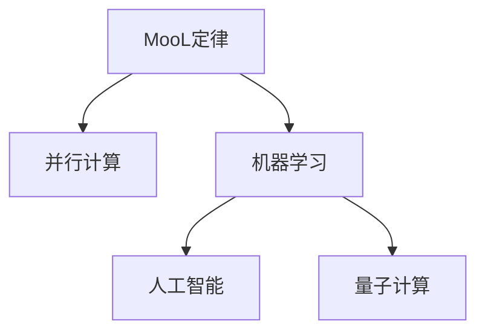

                 

# 回顾与展望：人类计算的发展历程与未来

## 1. 背景介绍

### 1.1 问题由来
人类计算的历史悠久，从早期的手工计算到现代的计算机辅助计算，每一次技术的进步都深刻影响了社会的方方面面。计算机科学作为一门独立的学科，起源于20世纪50年代，其发展历程经历了多个里程碑，催生了当前的人工智能(AI)和机器学习(ML)革命。本文旨在回顾计算技术的发展历程，展望未来趋势，探讨其对人类社会的影响。

### 1.2 问题核心关键点
计算技术的进步主要体现在计算速度、计算容量、计算精度和计算效率的提升上。这些进步背后，是电子技术、计算机架构、算法设计和应用场景的持续演变。以下关键点将贯穿全文：

1. **摩尔定律**：晶体管数量每18-24个月翻一番，推动计算机性能持续提升。
2. **并行计算**：多核、分布式和云计算技术，提升了计算效率和处理能力。
3. **机器学习**：通过数据驱动的算法，使计算机具备了从数据中学习和自主决策的能力。
4. **人工智能**：在机器学习的基础上，使计算机能够进行更复杂的推理和判断，迈向通用人工智能(AGI)。
5. **量子计算**：利用量子力学原理，提升计算速度和处理能力，有望解决当前经典计算机无法解决的问题。

这些关键点不仅推动了计算技术的革新，也拓展了其应用场景，为社会的各个领域带来了深刻变革。

## 2. 核心概念与联系

### 2.1 核心概念概述

计算技术的核心概念包括：

- **摩尔定律**：由英特尔公司联合创始人戈登·摩尔提出，指的是集成电路上可容纳的晶体管数量，约每18-24个月翻一番，性能提升一倍。
- **并行计算**：通过多核、分布式、云计算等技术，使多个计算单元同时处理任务，提高计算效率。
- **机器学习**：一种数据驱动的算法，使计算机能通过训练数据自动学习特征和模式，实现预测和决策。
- **人工智能**：在机器学习的基础上，使计算机具备类人的推理、判断和决策能力，实现任务自动化。
- **量子计算**：利用量子力学原理，使计算机实现量子位的操作，大幅提升计算能力和效率。

这些概念之间的关系可以通过以下Mermaid流程图来展示：



这个流程图展示了计算技术的发展脉络：摩尔定律推动了计算硬件的发展，并行计算提升了计算效率，机器学习使计算机具备了自主学习的能力，人工智能将机器学习应用到更广泛的场景中，而量子计算有望解决当前计算技术无法解决的问题。

## 3. 核心算法原理 & 具体操作步骤
### 3.1 算法原理概述

人类计算的发展离不开算法原理的不断革新。从早期的算法，如排序算法、搜索算法、图算法，到现代的深度学习算法、强化学习算法，算法的发展促进了计算技术的进步。

### 3.2 算法步骤详解

以机器学习算法为例，机器学习一般包括数据准备、模型训练、模型评估和模型应用等步骤：

1. **数据准备**：收集、清洗和预处理数据，确保数据的代表性和质量。
2. **模型训练**：使用训练集数据对模型进行训练，优化模型参数，使其能够对新数据进行准确的预测。
3. **模型评估**：使用测试集数据对模型进行评估，计算准确率、召回率、F1-score等指标，判断模型的性能。
4. **模型应用**：将训练好的模型应用到实际问题中，进行预测、分类、聚类等操作。

### 3.3 算法优缺点

机器学习算法具有以下优点：

1. **数据驱动**：能够从数据中自动学习模式和特征，减少人工干预。
2. **自适应性强**：能够处理大规模、复杂的数据集，适应不同的任务和应用场景。
3. **可解释性**：通过特征选择、模型可视化等技术，可以一定程度上解释模型的决策过程。

但机器学习算法也存在以下缺点：

1. **数据依赖性高**：需要大量的标注数据和计算资源，数据质量和数量直接影响模型性能。
2. **模型复杂度高**：复杂模型往往难以解释，存在过拟合风险。
3. **通用性不足**：不同任务的模型需要重新训练，迁移学习的效果有限。

### 3.4 算法应用领域

机器学习算法在各个领域都有广泛应用，例如：

- **金融**：信用评分、股票预测、风险评估等。
- **医疗**：疾病诊断、治疗方案推荐、基因分析等。
- **零售**：商品推荐、销售预测、客户细分等。
- **制造**：质量控制、设备维护、供应链优化等。
- **智能交通**：交通流量预测、事故预警、路线优化等。

## 4. 数学模型和公式 & 详细讲解 & 举例说明

### 4.1 数学模型构建

机器学习模型的构建涉及统计学、优化学和概率论等多个领域的知识。以线性回归模型为例，其数学模型可以表示为：

$$ y = \theta_0 + \sum_{i=1}^n \theta_i x_i + \epsilon $$

其中，$y$ 为目标变量，$\theta_0$ 为截距，$\theta_i$ 为权重，$x_i$ 为特征变量，$\epsilon$ 为误差项。

### 4.2 公式推导过程

线性回归模型的目标是最小化预测误差，常用的损失函数为均方误差：

$$ L(\theta) = \frac{1}{2n} \sum_{i=1}^n (y_i - \hat{y}_i)^2 $$

其中，$n$ 为样本数量，$\hat{y}_i = \theta_0 + \sum_{j=1}^n \theta_j x_{ij}$ 为预测值，$y_i$ 为真实值。

对上式求导，可以得到参数估计公式：

$$ \theta_j = \frac{\sum_{i=1}^n (x_{ij}y_i - \bar{x}_j\bar{y})}{\sum_{i=1}^n x_{ij}^2 - \bar{x}_j^2} $$

其中，$\bar{x}_j = \frac{1}{n}\sum_{i=1}^n x_{ij}$ 为特征变量均值，$\bar{y} = \frac{1}{n}\sum_{i=1}^n y_i$ 为目标变量均值。

### 4.3 案例分析与讲解

以房价预测为例，假设我们收集了多个影响房价的因素（如面积、位置、建筑年代等），以及每个房屋的实际销售价格。通过线性回归模型，我们可以训练一个模型来预测新房屋的价格。具体步骤如下：

1. 收集数据：从房地产市场获取历史房屋销售记录。
2. 数据清洗：去除异常值和噪声数据，将数据分为训练集和测试集。
3. 特征工程：选择合适的特征，如面积、位置、建筑年代等，并进行归一化处理。
4. 模型训练：使用训练集数据训练线性回归模型，得到参数估计值。
5. 模型评估：使用测试集数据评估模型性能，计算均方误差等指标。
6. 模型应用：将模型应用于新房屋的价格预测。

## 5. 项目实践：代码实例和详细解释说明

### 5.1 开发环境搭建

机器学习模型的开发需要安装Python、NumPy、SciPy、Matplotlib、scikit-learn等库。以下是在Python环境下搭建机器学习开发环境的步骤：

1. 安装Anaconda：从官网下载并安装Anaconda，用于创建独立的Python环境。

2. 创建并激活虚拟环境：
```bash
conda create -n ml-env python=3.8
conda activate ml-env
```

3. 安装必要的库：
```bash
pip install numpy scipy matplotlib scikit-learn pandas jupyter notebook
```

### 5.2 源代码详细实现

以下是一个简单的线性回归模型的Python代码实现：

```python
import numpy as np
from sklearn.linear_model import LinearRegression
from sklearn.metrics import mean_squared_error
from sklearn.model_selection import train_test_split
import matplotlib.pyplot as plt

# 生成模拟数据
np.random.seed(42)
n_samples = 100
X = np.random.randn(n_samples, 3)
y = 2 * X[:, 0] + 3 * X[:, 1] + 4 * X[:, 2] + np.random.randn(n_samples)

# 划分训练集和测试集
X_train, X_test, y_train, y_test = train_test_split(X, y, test_size=0.2, random_state=42)

# 训练线性回归模型
model = LinearRegression()
model.fit(X_train, y_train)

# 预测测试集
y_pred = model.predict(X_test)

# 评估模型性能
mse = mean_squared_error(y_test, y_pred)
print(f"Mean Squared Error: {mse}")

# 可视化结果
plt.scatter(X_test[:, 0], y_test, label='Actual')
plt.scatter(X_test[:, 0], y_pred, label='Predicted')
plt.legend()
plt.show()
```

### 5.3 代码解读与分析

代码实现分为以下几个部分：

1. **数据生成**：使用NumPy生成随机数据，模拟房价预测问题。
2. **数据划分**：使用scikit-learn的train_test_split函数，将数据集划分为训练集和测试集。
3. **模型训练**：使用scikit-learn的LinearRegression类，训练线性回归模型。
4. **模型预测**：使用模型对测试集进行预测，计算预测值。
5. **模型评估**：使用mean_squared_error函数计算模型性能指标，即均方误差。
6. **结果可视化**：使用Matplotlib可视化预测结果和真实结果的对比。

## 6. 实际应用场景

### 6.1 金融风险管理

机器学习算法在金融领域有广泛应用，特别是风险管理和信用评估。通过对历史交易数据和用户行为数据的分析，机器学习模型可以预测用户的违约风险，辅助金融机构进行贷款决策。例如，通过分析客户的信用评分、贷款金额、还款记录等数据，机器学习模型可以构建一个信用评分模型，用于评估客户的信用风险，从而制定合理的贷款策略。

### 6.2 医疗诊断和治疗方案推荐

在医疗领域，机器学习算法可以应用于疾病诊断、治疗方案推荐和基因分析等任务。通过分析患者的症状、病历、基因数据等，机器学习模型可以预测疾病类型和严重程度，推荐最佳治疗方案。例如，基于医疗影像数据的卷积神经网络模型，可以自动检测和分类肿瘤，辅助医生进行诊断和治疗决策。

### 6.3 智能推荐系统

智能推荐系统是机器学习算法在零售和娱乐领域的典型应用。通过对用户历史行为数据的分析，机器学习模型可以预测用户对商品或内容的偏好，推荐个性化产品或内容。例如，亚马逊的推荐系统通过分析用户的浏览记录和购买记录，推荐用户可能感兴趣的商品，提升用户体验和销售额。

### 6.4 智能交通管理

机器学习算法可以应用于智能交通管理，如交通流量预测、事故预警和路线优化等。通过对历史交通数据的分析，机器学习模型可以预测未来的交通流量和事故风险，优化交通管理和疏导方案。例如，基于历史交通数据的回归模型，可以预测某个路段的交通流量，辅助交通管理部门进行交通信号灯的调整和路况优化。

## 7. 工具和资源推荐

### 7.1 学习资源推荐

以下是一些推荐的学习资源：

1. 《机器学习实战》：由Peter Harrington所著，介绍了机器学习的基本概念和实践方法，适合初学者入门。
2. 《深度学习》：由Ian Goodfellow、Yoshua Bengio和Aaron Courville合著，介绍了深度学习的基本理论和算法，是深度学习的经典教材。
3. Coursera上的《机器学习》课程：由Andrew Ng教授主讲，涵盖机器学习的基础理论和实践方法，适合系统学习。
4. Kaggle：一个数据科学竞赛平台，提供大量数据集和竞赛任务，适合实践训练和应用开发。
5. Arxiv：机器学习和人工智能领域的预印本数据库，可以获取最新的研究论文和进展。

### 7.2 开发工具推荐

以下是一些推荐的开发工具：

1. Python：机器学习和深度学习的主流语言，生态丰富，易于上手。
2. NumPy：Python科学计算库，支持高效的数组和矩阵运算。
3. Scikit-learn：基于NumPy和SciPy的机器学习库，提供了多种经典算法的实现。
4. TensorFlow：Google开发的深度学习框架，支持分布式计算和GPU加速。
5. PyTorch：Facebook开发的深度学习框架，支持动态图和GPU加速，易于调试和扩展。
6. Jupyter Notebook：一个交互式编程环境，支持代码编写、数据可视化、交互式展示，适合快速迭代开发。

### 7.3 相关论文推荐

以下是几篇重要的机器学习和深度学习论文，推荐阅读：

1. 《Deep Learning》：Yoshua Bengio、Ian Goodfellow和Aaron Courville合著，介绍了深度学习的基本理论和算法。
2. 《A Tutorial on Machine Learning Algorithms》：Tom Mitchell所著，介绍了机器学习的基本概念和算法。
3. 《ImageNet Classification with Deep Convolutional Neural Networks》：Alex Krizhevsky、Ilya Sutskever和Geoffrey Hinton所著，介绍了卷积神经网络在图像分类任务中的应用。
4. 《Learning to Play Go Without Human Knowledge》：David Silver、Joao M. G. Monteiro、Charles C. P. Chen和Ian Osband所著，介绍了强化学习在复杂决策问题中的应用。
5. 《Imagenet Classification with Deep Convolutional Neural Networks》：Alec Radford、Karol Kurach、Alykhan Zoph和Gursharan Nal42298等人所著，介绍了大规模预训练语言模型的训练和应用。

## 8. 总结：未来发展趋势与挑战

### 8.1 总结

本文回顾了计算技术的发展历程，展望了未来趋势，探讨了其对人类社会的影响。从摩尔定律的提出，到并行计算、机器学习和人工智能的兴起，计算技术不断革新，推动了社会各领域的进步。未来，随着量子计算等技术的突破，计算技术将迎来新的高峰，进一步拓展其应用边界，为人类带来更深远的影响。

### 8.2 未来发展趋势

未来计算技术的发展趋势包括：

1. **量子计算**：利用量子力学的原理，实现高效计算，解决经典计算机无法解决的问题。
2. **自适应计算**：根据任务需求和计算资源，动态调整计算过程，实现最优资源利用。
3. **智能计算**：结合人工智能和机器学习技术，使计算机具备更强的决策能力和适应性。
4. **边缘计算**：将计算资源分布到边缘设备，实现更快速、更可靠的数据处理和决策。
5. **人机协作**：通过人机交互技术，实现更高效、更智能的计算和决策。

这些趋势将推动计算技术的不断进步，为人类社会带来新的变革。

### 8.3 面临的挑战

尽管计算技术的发展带来了诸多便利，但在其演进过程中，也面临一些挑战：

1. **资源消耗**：大规模计算任务需要大量的能源和计算资源，带来环境和社会问题。
2. **数据隐私和安全**：计算技术依赖大量数据，如何保护数据隐私和安全，是亟待解决的问题。
3. **算法透明性和可解释性**：机器学习和人工智能算法存在一定的“黑箱”问题，难以解释其决策过程，需要更多的算法透明性和可解释性。
4. **伦理和社会影响**：计算技术的发展可能带来伦理和社会问题，如就业替代、社会公平等，需要更多的伦理和社会考量。
5. **计算标准化**：计算技术需要跨平台、跨设备的标准化，以实现更广泛的应用和互操作性。

### 8.4 研究展望

未来的计算技术研究需要在以下几个方面寻求突破：

1. **量子计算**：进一步研究和应用量子计算技术，解决经典计算无法解决的问题。
2. **边缘计算**：研究和应用边缘计算技术，实现更高效、更可靠的数据处理和决策。
3. **自适应计算**：研究和应用自适应计算技术，实现最优资源利用和任务适应。
4. **智能计算**：结合人工智能和机器学习技术，使计算机具备更强的决策能力和适应性。
5. **计算标准化**：推动计算技术的标准化，实现跨平台、跨设备的应用和互操作性。

## 9. 附录：常见问题与解答

**Q1：为什么机器学习需要大量的标注数据？**

A: 机器学习算法需要大量的标注数据来训练模型，因为标注数据可以提供模型学习的真实目标和正确答案。通过大量的标注数据，模型可以学习到更准确的特征和模式，从而提高模型的预测能力和泛化能力。

**Q2：机器学习算法是否可以用于所有问题？**

A: 机器学习算法并不是万能的，它适用于可以形式化定义的问题，如分类、回归、聚类等。对于一些需要高度常识和推理的问题，机器学习算法可能难以胜任。

**Q3：如何避免机器学习算法的过拟合？**

A: 避免过拟合的方法包括：
1. 数据增强：通过增加数据量和数据多样性来提高模型的泛化能力。
2. 正则化：通过添加L1/L2正则化、Dropout等技术来限制模型的复杂度。
3. 交叉验证：通过交叉验证方法来评估模型性能，避免模型在特定数据集上过拟合。
4. 集成学习：通过集成多个模型的预测结果来提高模型的泛化能力。

**Q4：量子计算和经典计算有何不同？**

A: 量子计算和经典计算在计算原理和处理能力上存在显著差异。经典计算基于二进制位，而量子计算基于量子位，可以实现更高的并行性和更高效的计算。量子计算的优势在于能够解决一些经典计算无法解决的问题，如大数分解、量子模拟等。

**Q5：未来计算技术将如何影响人类社会？**

A: 未来计算技术的发展将带来诸多便利，如更高效的计算、更智能的决策、更精准的预测等。但同时，计算技术的发展也带来诸多挑战，如环境问题、数据隐私、算法透明性等。未来计算技术的发展需要在技术、伦理和社会多个层面进行全面考量，以确保其对人类社会的积极影响。

---

作者：禅与计算机程序设计艺术 / Zen and the Art of Computer Programming

