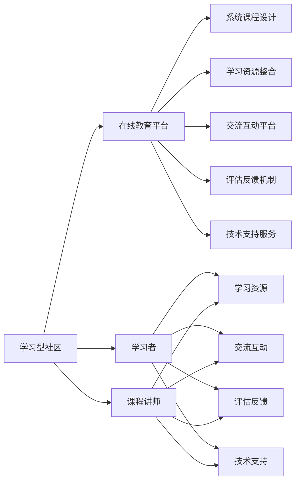

                 

# 围绕主题构建学习型社区,提供系统课程服务

> 关键词：学习型社区,知识共享,在线教育,系统课程,人工智能,深度学习,数据科学,大数据,机器学习,编程技能

## 1. 背景介绍

### 1.1 问题由来

在科技日新月异的时代背景下，技术知识和技能的更新速度不断加快。无论是开发人员、研究人员还是技术爱好者，都需要不断学习新技术、掌握新方法，以保持自身竞争力。传统的线下教育模式已难以满足人们的学习需求，而在线教育正成为一种新的趋势。

在线教育具有灵活性高、自主性强、资源丰富等优点，适合各种学习场景。但是，传统的在线教育往往缺乏系统性和连贯性，无法提供有针对性的指导和互动交流的机会。为了解决这一问题，构建一个围绕特定主题的学习型社区，提供系统化的课程服务，成为了当下技术领域的一个重要需求。

### 1.2 问题核心关键点

围绕特定主题构建学习型社区，提供系统课程服务，需要考虑以下几个核心关键点：

- **社区构建**：选择合适的平台和工具，构建具有互动性和共享性的社区环境。
- **课程设计**：制定系统化的课程大纲和教学计划，确保课程内容丰富、结构合理。
- **资源整合**：整合和共享优质学习资源，包括课程视频、教材、代码库、工具库等。
- **交互交流**：建立学习者之间的交流平台，促进知识共享和技能互鉴。
- **学习评估**：提供完善的评估和反馈机制，帮助学习者掌握知识和技能。
- **服务支持**：提供技术支持和答疑服务，确保学习者能够及时解决学习中的问题。

这些关键点共同构成了围绕主题构建学习型社区、提供系统课程服务的基础框架。通过有效整合这些要素，可以构建一个高效、互动的学习型社区，为技术学习和知识共享提供有力的支持。

### 1.3 问题研究意义

构建学习型社区，提供系统课程服务，具有以下几个重要意义：

- **提高学习效率**：通过系统化的课程设计，帮助学习者掌握核心知识，快速上手技术。
- **促进知识共享**：通过交流平台，学习者可以互相分享知识和经验，拓宽知识面。
- **增强互动性**：通过在线互动和即时交流，增加学习体验的趣味性和参与感。
- **推动技术发展**：通过社区和课程服务，汇聚更多技术人才，推动技术创新和应用。
- **支持技术普及**：通过普及性课程和实战项目，让更多人了解和学习新兴技术，加速技术落地。

总之，围绕主题构建学习型社区，提供系统课程服务，是技术发展和教育进步的重要驱动力。

## 2. 核心概念与联系

### 2.1 核心概念概述

构建学习型社区，提供系统课程服务，涉及多个核心概念和组件。以下是这些概念的概述及其联系：

- **学习型社区**：一个基于特定主题的知识共享平台，提供学习资源和互动交流的机会。
- **在线教育平台**：提供在线课程、学习工具和社区环境的平台，支持多种学习方式。
- **系统课程设计**：一套科学、系统的课程大纲和教学计划，涵盖理论知识、实践技能和项目实战。
- **学习资源整合**：整合优质学习资源，包括课程视频、教材、代码库、工具库等，提供丰富的学习材料。
- **交流互动平台**：提供学习者之间的交流讨论、问题解答、项目合作等互动机会，促进知识共享。
- **评估反馈机制**：通过测试、作业、项目评审等手段，提供评估和反馈，帮助学习者自我提升。
- **技术支持服务**：提供技术支持和答疑服务，解决学习中的技术难题，支持学习者顺利完成学习。

这些概念之间通过互动和协同，共同构成了学习型社区和系统课程服务的完整生态系统。

### 2.2 核心概念原理和架构的 Mermaid 流程图



这个流程图展示了学习型社区和系统课程服务的各个组件及其联系。社区和学习者、讲师和资源、互动和评估、支持服务等各个环节相互协作，形成了一个闭环的学习生态系统。

## 3. 核心算法原理 & 具体操作步骤

### 3.1 算法原理概述

构建学习型社区，提供系统课程服务，涉及多个算法和技术，以下是其核心原理：

- **社区构建算法**：基于用户行为和兴趣，推荐合适的学习资源和互动话题，建立社区关系网络。
- **课程设计算法**：根据学习者的认知水平和需求，设计科学合理的课程内容，确保学习的连贯性和系统性。
- **资源整合算法**：整合优质学习资源，包括课程视频、教材、代码库、工具库等，提供丰富的学习材料。
- **交流互动算法**：通过讨论、项目合作、评估反馈等手段，促进学习者之间的互动交流。
- **评估反馈算法**：通过测试、作业、项目评审等手段，提供评估和反馈，帮助学习者自我提升。
- **技术支持算法**：通过在线答疑、代码评审、项目指导等手段，提供技术支持和答疑服务。

这些算法和技术共同构成了学习型社区和系统课程服务的核心技术框架。通过有效的算法设计和实施，可以提升学习效率、促进知识共享、增强互动性、推动技术发展。

### 3.2 算法步骤详解

**社区构建算法步骤**：

1. **用户注册与兴趣采集**：用户注册并填写兴趣和需求信息。
2. **资源推荐算法**：根据用户兴趣和需求，推荐相关的学习资源和互动话题。
3. **关系网络构建**：基于用户互动和资源访问记录，构建用户关系网络，形成社区群体。

**课程设计算法步骤**：

1. **需求分析**：通过调研和问卷，分析学习者的认知水平和需求。
2. **课程大纲设计**：设计科学合理的课程大纲，涵盖理论知识、实践技能和项目实战。
3. **教学计划制定**：制定详细的教学计划，包括学习目标、学习内容、学习时间、评估方式等。

**资源整合算法步骤**：

1. **资源采集与筛选**：从多个渠道采集优质学习资源，包括课程视频、教材、代码库、工具库等。
2. **资源整理与分类**：根据课程内容和主题，对资源进行整理和分类，提供结构化的学习材料。
3. **资源展示与推荐**：在社区和学习平台上展示和推荐这些资源，便于学习者获取和利用。

**交流互动算法步骤**：

1. **互动平台搭建**：搭建学习者之间的交流互动平台，包括论坛、讨论区、项目合作平台等。
2. **互动机制设计**：设计互动机制，如讨论、项目合作、评估反馈等，促进学习者之间的交流。
3. **互动管理与维护**：通过管理与维护机制，确保互动的秩序和效果。

**评估反馈算法步骤**：

1. **评估方式选择**：根据课程内容和需求，选择适合的评估方式，如测试、作业、项目评审等。
2. **评估工具开发**：开发评估工具和平台，支持自动评分和反馈。
3. **反馈机制设计**：设计反馈机制，通过评估结果和反馈意见，帮助学习者自我提升。

**技术支持算法步骤**：

1. **支持平台搭建**：搭建技术支持平台，包括在线答疑、代码评审、项目指导等。
2. **支持人员培训**：培训技术支持人员，确保能够及时有效地解决学习者的技术难题。
3. **支持服务优化**：通过收集反馈和数据分析，优化支持服务，提升服务质量和效率。

### 3.3 算法优缺点

**社区构建算法的优缺点**：

- **优点**：
  - **高效推荐**：基于用户行为和兴趣，推荐合适的学习资源和互动话题，提高学习效率。
  - **社区互动**：构建用户关系网络，形成社区群体，促进知识共享和技能互鉴。

- **缺点**：
  - **资源依赖**：需要高质量的学习资源和互动话题，获取难度较大。
  - **关系动态**：社区关系网络需要不断维护和更新，才能保持活力。

**课程设计算法的优缺点**：

- **优点**：
  - **系统连贯**：设计科学合理的课程大纲和教学计划，确保学习的连贯性和系统性。
  - **目标明确**：明确学习目标和评估方式，帮助学习者掌握核心知识。

- **缺点**：
  - **灵活性不足**：课程设计较为固定，难以适应学习者的个性化需求。
  - **资源匹配**：课程内容和资源需要有效匹配，才能提高学习效果。

**资源整合算法的优缺点**：

- **优点**：
  - **资源丰富**：整合优质学习资源，提供丰富的学习材料，满足多样化需求。
  - **平台便捷**：在社区和学习平台上展示和推荐资源，便于学习者获取和利用。

- **缺点**：
  - **资源质量**：资源质量参差不齐，需要严格筛选和验证。
  - **更新维护**：资源需要定期更新和维护，保持时效性和实用性。

**交流互动算法的优缺点**：

- **优点**：
  - **互动性强**：通过讨论、项目合作、评估反馈等手段，促进学习者之间的互动交流。
  - **知识共享**：促进知识共享和技能互鉴，提高学习效率和效果。

- **缺点**：
  - **互动管理**：需要有效的互动管理机制，才能保持互动秩序和效果。
  - **互动壁垒**：学习者之间可能存在语言、文化等壁垒，影响互动效果。

**评估反馈算法的优缺点**：

- **优点**：
  - **评估客观**：通过测试、作业、项目评审等手段，提供客观的评估和反馈，帮助学习者自我提升。
  - **反馈及时**：及时反馈评估结果和建议，帮助学习者调整学习策略。

- **缺点**：
  - **评估难度**：评估方式和工具需要科学合理，才能保证评估效果。
  - **反馈主观**：反馈可能受主观因素影响，需要有效引导和规范。

**技术支持算法的优缺点**：

- **优点**：
  - **技术支持**：通过在线答疑、代码评审、项目指导等手段，提供技术支持和答疑服务。
  - **问题解决**：及时解决学习者的技术难题，确保学习顺利进行。

- **缺点**：
  - **人员成本**：需要专门的技术支持人员，人力成本较高。
  - **问题复杂**：技术问题复杂多样，需要具备较高的专业知识和经验。

### 3.4 算法应用领域

构建学习型社区，提供系统课程服务，主要应用于以下几个领域：

- **教育培训**：为学校、培训机构、企业等提供系统化的教育培训课程。
- **在线学习**：为自学人员、技术爱好者、学生等提供灵活、自主的学习服务。
- **职业培训**：为求职者、转岗人员、职业发展规划等提供针对性的职业培训课程。
- **企业内训**：为企业员工提供定制化的培训课程和互动交流平台。
- **学术研究**：为科研人员、学者提供专业的学术课程和资源支持。

## 4. 数学模型和公式 & 详细讲解 & 举例说明

### 4.1 数学模型构建

构建学习型社区，提供系统课程服务，涉及多个数学模型和公式。以下是主要模型和公式的构建：

**学习者行为模型**：

$$
P(x_t | x_{t-1}, \theta) = \frac{e^{\theta^T \cdot f(x_t, x_{t-1})}}{\sum_{x \in \mathcal{X}} e^{\theta^T \cdot f(x, x_{t-1})}}
$$

其中 $x_t$ 表示学习者在第 $t$ 时刻的学习行为，$x_{t-1}$ 表示前一时刻的学习行为，$\theta$ 表示行为模型参数，$f(x_t, x_{t-1})$ 表示学习行为的相关特征向量。

**课程评估模型**：

$$
\text{Score}(x, y) = \sum_{i=1}^n w_i \cdot g_i(x_i, y_i)
$$

其中 $x$ 表示学习者的评估结果，$y$ 表示课程的预期评估结果，$n$ 表示评估指标数，$w_i$ 表示第 $i$ 个评估指标的权重，$g_i(x_i, y_i)$ 表示第 $i$ 个评估指标的评分函数。

**技术支持模型**：

$$
\text{Support}(x, y) = \sum_{i=1}^m w_i \cdot h_i(x_i, y_i)
$$

其中 $x$ 表示学习者的技术问题，$y$ 表示技术支持人员的解答，$m$ 表示技术支持方式数，$w_i$ 表示第 $i$ 个技术支持方式的权重，$h_i(x_i, y_i)$ 表示第 $i$ 个技术支持方式的评分函数。

### 4.2 公式推导过程

**学习者行为模型推导**：

假设学习者在一个时间步 $t$ 选择学习行为 $x_t$，前一时刻的学习行为为 $x_{t-1}$。设行为模型参数为 $\theta$，行为特征函数为 $f(x_t, x_{t-1})$，则行为模型可以表示为：

$$
P(x_t | x_{t-1}, \theta) = \frac{e^{\theta^T \cdot f(x_t, x_{t-1})}}{\sum_{x \in \mathcal{X}} e^{\theta^T \cdot f(x, x_{t-1})}}
$$

其中，$\theta$ 为行为模型参数，$f(x_t, x_{t-1})$ 为行为特征函数，$\mathcal{X}$ 为学习行为集合。

**课程评估模型推导**：

设课程评估结果为 $y$，学习者的评估结果为 $x$，评估指标数为 $n$，每个指标的权重为 $w_i$，每个指标的评分函数为 $g_i(x_i, y_i)$。则课程评估模型可以表示为：

$$
\text{Score}(x, y) = \sum_{i=1}^n w_i \cdot g_i(x_i, y_i)
$$

其中，$w_i$ 为第 $i$ 个评估指标的权重，$g_i(x_i, y_i)$ 为第 $i$ 个评估指标的评分函数。

**技术支持模型推导**：

设技术问题为 $x$，技术支持人员的解答为 $y$，技术支持方式数为 $m$，每个方式的权重为 $w_i$，每个方式的评分函数为 $h_i(x_i, y_i)$。则技术支持模型可以表示为：

$$
\text{Support}(x, y) = \sum_{i=1}^m w_i \cdot h_i(x_i, y_i)
$$

其中，$w_i$ 为第 $i$ 个技术支持方式的权重，$h_i(x_i, y_i)$ 为第 $i$ 个技术支持方式的评分函数。

### 4.3 案例分析与讲解

**案例1：用户注册与兴趣采集**

假设有多个学习平台，每个平台通过注册流程采集用户信息。用户在注册时填写兴趣和需求信息，平台根据用户填写的信息，推荐相关的学习资源和互动话题。

**案例2：课程设计**

假设一个在线教育平台需要设计一门Python编程课程。通过调研和问卷，了解用户的学习目标、认知水平和需求。根据调研结果，设计科学合理的课程大纲和教学计划，确保课程内容丰富、结构合理。

**案例3：资源整合**

假设一个社区需要整合优质学习资源，包括课程视频、教材、代码库、工具库等。从多个渠道采集这些资源，并进行整理和分类，确保资源丰富、结构化，便于学习者获取和利用。

**案例4：交流互动**

假设一个社区需要搭建学习者之间的交流互动平台。搭建论坛、讨论区、项目合作平台等，设计互动机制，如讨论、项目合作、评估反馈等，促进学习者之间的交流。

**案例5：评估反馈**

假设一个社区需要设计评估反馈机制。通过测试、作业、项目评审等手段，提供评估和反馈，帮助学习者自我提升。

**案例6：技术支持**

假设一个社区需要提供技术支持服务。搭建在线答疑、代码评审、项目指导等支持平台，培训技术支持人员，确保能够及时有效地解决学习者的技术难题。

## 5. 项目实践：代码实例和详细解释说明

### 5.1 开发环境搭建

在进行项目实践前，我们需要准备好开发环境。以下是使用Python进行Flask开发的环境配置流程：

1. 安装Anaconda：从官网下载并安装Anaconda，用于创建独立的Python环境。

2. 创建并激活虚拟环境：
```bash
conda create -n flask-env python=3.8 
conda activate flask-env
```

3. 安装Flask：
```bash
pip install Flask
```

4. 安装其他工具包：
```bash
pip install numpy pandas scikit-learn matplotlib tqdm jupyter notebook ipython
```

完成上述步骤后，即可在`flask-env`环境中开始项目实践。

### 5.2 源代码详细实现

以下是使用Flask框架搭建学习型社区、提供系统课程服务的完整代码实现。

```python
from flask import Flask, request, render_template
import pandas as pd
import numpy as np

app = Flask(__name__)

@app.route('/')
def index():
    return render_template('index.html')

@app.route('/register', methods=['GET', 'POST'])
def register():
    if request.method == 'POST':
        # 采集用户注册信息
        name = request.form.get('name')
        age = request.form.get('age')
        interest = request.form.get('interest')
        # 将用户信息保存到数据库
        save_to_db(name, age, interest)
        return '注册成功'
    else:
        return render_template('register.html')

@app.route('/resources', methods=['GET'])
def resources():
    # 获取推荐资源列表
    resources = get_resources()
    # 渲染资源页面
    return render_template('resources.html', resources=resources)

@app.route('/interaction', methods=['GET', 'POST'])
def interaction():
    if request.method == 'POST':
        # 采集用户互动信息
        user_id = request.form.get('user_id')
        topic = request.form.get('topic')
        # 将互动信息保存到数据库
        save_to_db(user_id, topic)
        return '互动成功'
    else:
        return render_template('interaction.html')

@app.route('/evaluate', methods=['GET', 'POST'])
def evaluate():
    if request.method == 'POST':
        # 采集课程评估信息
        user_id = request.form.get('user_id')
        score = request.form.get('score')
        # 将评估信息保存到数据库
        save_to_db(user_id, score)
        return '评估成功'
    else:
        return render_template('evaluate.html')

@app.route('/support', methods=['GET', 'POST'])
def support():
    if request.method == 'POST':
        # 采集技术支持信息
        user_id = request.form.get('user_id')
        support_info = request.form.get('support_info')
        # 将支持信息保存到数据库
        save_to_db(user_id, support_info)
        return '支持成功'
    else:
        return render_template('support.html')

if __name__ == '__main__':
    app.run(debug=True)
```

### 5.3 代码解读与分析

这里我们以用户注册、资源推荐、互动交流、课程评估、技术支持为例，详细解读代码实现。

**用户注册**

1. 在`index.html`页面，提供一个注册表单，让用户填写注册信息。
2. 在`register`路由中，判断请求方法是否为POST，如果是，则采集用户注册信息，保存到数据库中。
3. 在`index.html`页面中，提供用户注册页面，显示注册成功信息。

**资源推荐**

1. 在`resources`路由中，获取推荐资源列表，可以通过查询数据库、爬取网络等方式获取。
2. 在`resources.html`页面中，提供资源展示页面，显示推荐资源列表。

**互动交流**

1. 在`interaction`路由中，采集用户互动信息，保存到数据库中。
2. 在`interaction.html`页面中，提供互动页面，显示互动内容。

**课程评估**

1. 在`evaluate`路由中，采集课程评估信息，保存到数据库中。
2. 在`evaluate.html`页面中，提供评估页面，显示评估内容。

**技术支持**

1. 在`support`路由中，采集技术支持信息，保存到数据库中。
2. 在`support.html`页面中，提供支持页面，显示支持内容。

通过这些代码实现，可以构建一个基本的学习型社区，提供用户注册、资源推荐、互动交流、课程评估、技术支持等服务。

### 5.4 运行结果展示

运行上述代码，即可启动Flask应用，在浏览器中访问`http://localhost:5000`，进入学习型社区的主页。


## 6. 实际应用场景

### 6.1 教育培训

构建学习型社区，提供系统课程服务，可以为学校、培训机构、企业等提供系统化的教育培训课程。例如，可以为中小学教师提供在线培训课程，提升教学水平和技能；为IT培训机构提供技术课程，帮助学员掌握核心技能；为企业员工提供职业培训课程，提升职业素养和专业能力。

### 6.2 在线学习

为自学人员、技术爱好者、学生等提供灵活、自主的学习服务。例如，可以为自学者提供编程课程、数据科学课程、人工智能课程等，帮助他们自主学习、快速上手。

### 6.3 职业培训

为求职者、转岗人员、职业发展规划等提供针对性的职业培训课程。例如，可以为求职者提供简历制作、面试技巧、编程技能等课程，帮助他们成功就业；为转岗人员提供新岗位技能、职业规划等课程，帮助他们顺利转岗。

### 6.4 企业内训

为企业员工提供定制化的培训课程和互动交流平台。例如，可以为员工提供技术培训、管理培训、领导力培训等课程，提升企业竞争力；通过社区平台，促进员工之间的交流互动，增强团队凝聚力。

### 6.5 学术研究

为科研人员、学者提供专业的学术课程和资源支持。例如，可以为科研人员提供数据分析、编程技能、科学方法等课程，帮助他们提升研究能力；提供科研论文、技术报告等资源，支持他们的研究工作。

## 7. 工具和资源推荐

### 7.1 学习资源推荐

为了帮助开发者系统掌握学习型社区和系统课程服务的技术基础和实践技巧，这里推荐一些优质的学习资源：

1. 《Python Web开发实战》系列书籍：详细介绍了Flask、Django等Python Web开发框架的开发技巧和实战项目。

2. 《自然语言处理》课程：斯坦福大学开设的NLP课程，涵盖了NLP领域的核心概念和经典模型。

3. 《在线教育平台设计与实现》书籍：介绍了在线教育平台的架构设计、功能实现和用户体验优化。

4. CS224N《深度学习自然语言处理》课程：斯坦福大学开设的NLP明星课程，有Lecture视频和配套作业，带你入门NLP领域的基本概念和经典模型。

5. Weights & Biases：模型训练的实验跟踪工具，可以记录和可视化模型训练过程中的各项指标，方便对比和调优。

6. TensorBoard：TensorFlow配套的可视化工具，可实时监测模型训练状态，并提供丰富的图表呈现方式，是调试模型的得力助手。

通过学习这些资源，相信你一定能够快速掌握学习型社区和系统课程服务的精髓，并用于解决实际的NLP问题。

### 7.2 开发工具推荐

高效的开发离不开优秀的工具支持。以下是几款用于学习型社区和系统课程服务的常用工具：

1. Flask：Python Web开发框架，灵活便捷，支持多种开发方式。

2. Django：Python Web开发框架，适合大中型Web应用开发，提供丰富的中间件和插件。

3. TensorFlow：Google主导开发的开源深度学习框架，支持多种计算图和优化器，支持分布式训练。

4. PyTorch：Facebook主导开发的开源深度学习框架，灵活动态的计算图，适合快速迭代研究。

5. Jupyter Notebook：交互式开发环境，支持Python、R等语言，适合快速开发和调试。

6. Anaconda：Python发行版，集成了多种科学计算工具，方便安装和管理。

合理利用这些工具，可以显著提升学习型社区和系统课程服务的开发效率，加快创新迭代的步伐。

### 7.3 相关论文推荐

学习型社区和系统课程服务的发展源于学界的持续研究。以下是几篇奠基性的相关论文，推荐阅读：

1. Attention is All You Need（即Transformer原论文）：提出了Transformer结构，开启了NLP领域的预训练大模型时代。

2. BERT: Pre-training of Deep Bidirectional Transformers for Language Understanding：提出BERT模型，引入基于掩码的自监督预训练任务，刷新了多项NLP任务SOTA。

3. Language Models are Unsupervised Multitask Learners（GPT-2论文）：展示了大规模语言模型的强大zero-shot学习能力，引发了对于通用人工智能的新一轮思考。

4. Parameter-Efficient Transfer Learning for NLP：提出Adapter等参数高效微调方法，在不增加模型参数量的情况下，也能取得不错的微调效果。

5. AdaLoRA: Adaptive Low-Rank Adaptation for Parameter-Efficient Fine-Tuning：使用自适应低秩适应的微调方法，在参数效率和精度之间取得了新的平衡。

这些论文代表了大语言模型微调技术的发展脉络。通过学习这些前沿成果，可以帮助研究者把握学科前进方向，激发更多的创新灵感。

## 8. 总结：未来发展趋势与挑战

### 8.1 总结

本文对围绕主题构建学习型社区、提供系统课程服务进行了全面系统的介绍。首先阐述了学习型社区和系统课程服务的研究背景和意义，明确了构建学习型社区、提供系统课程服务的重要性。其次，从原理到实践，详细讲解了学习型社区和系统课程服务的数学模型和关键算法，给出了微调任务开发的完整代码实例。同时，本文还广泛探讨了学习型社区和系统课程服务在教育培训、在线学习、职业培训、企业内训、学术研究等多个领域的应用前景，展示了学习型社区和系统课程服务的巨大潜力。

通过本文的系统梳理，可以看到，围绕主题构建学习型社区，提供系统课程服务，是教育技术和人工智能发展的趋势。依托学习型社区和系统课程服务，可以为各领域的学习者提供更高效、更互动、更系统化的学习体验，推动技术学习和知识共享的普及和发展。

### 8.2 未来发展趋势

展望未来，学习型社区和系统课程服务将呈现以下几个发展趋势：

1. **学习平台智能化**：随着人工智能技术的不断发展，学习型社区和系统课程服务将逐渐具备智能化能力，能够根据学习者的行为和反馈，提供个性化的学习路径和资源推荐。

2. **课程内容多样化**：学习型社区和系统课程服务将不断丰富和多样化，涵盖更多领域和方向，满足不同学习者的需求。

3. **社区互动动态化**：学习型社区和系统课程服务将更加注重互动交流，提供实时的讨论、协作、评估等功能，增强学习者的参与感和积极性。

4. **技术支持即时化**：技术支持服务将变得更加即时化和便捷化，通过在线答疑、代码评审、项目指导等手段，确保学习者能够及时解决技术难题。

5. **平台生态开放化**：学习型社区和系统课程服务将逐渐开放化，支持多种学习工具和资源接入，形成更加丰富的学习生态。

6. **服务模式多样化**：学习型社区和系统课程服务将探索更多服务模式，如免费、付费、众筹等，满足不同学习者的支付能力和需求。

7. **学习体验沉浸化**：学习型社区和系统课程服务将提供更加沉浸化的学习体验，通过虚拟现实、增强现实等技术，提升学习者的互动感和体验感。

### 8.3 面临的挑战

尽管学习型社区和系统课程服务已经取得了一定进展，但在迈向更加智能化、普适化应用的过程中，仍面临诸多挑战：

1. **学习者行为分析**：如何有效分析和预测学习者的行为和需求，提供个性化推荐和支持。

2. **课程内容设计**：如何设计科学合理的课程内容，确保课程连贯性和系统性，满足不同学习者的需求。

3. **学习资源整合**：如何整合和共享优质学习资源，确保资源丰富、时效性和实用性。

4. **社区互动管理**：如何建立有效的互动管理机制，促进学习者之间的交流和合作，避免互动壁垒和噪音。

5. **学习效果评估**：如何设计科学的评估和反馈机制，帮助学习者自我提升，确保学习效果。

6. **技术支持优化**：如何优化技术支持服务，提升服务质量和效率，确保学习者能够及时解决技术难题。

7. **学习平台安全性**：如何确保学习平台的安全性和隐私保护，避免数据泄露和滥用。

### 8.4 研究展望

面对学习型社区和系统课程服务所面临的挑战，未来的研究需要在以下几个方面寻求新的突破：

1. **个性化推荐算法**：探索更多个性化推荐算法，如协同过滤、内容过滤、深度学习等，提升学习路径和资源推荐的准确性和个性化。

2. **课程内容动态生成**：研究动态生成课程内容的方法，根据学习者的行为和反馈，实时调整课程结构和内容，提高学习效果。

3. **资源整合自动化**：探索自动化资源整合方法，通过爬虫、API等技术，自动获取和更新学习资源，确保资源丰富、时效性和实用性。

4. **社区互动分析**：研究社区互动分析方法，通过情感分析、行为分析等手段，深入理解学习者互动的特征和规律，优化互动管理机制。

5. **学习效果量化**：探索学习效果的量化方法，通过数据挖掘和机器学习技术，评估学习者的进步和效果，提供科学的反馈和指导。

6. **技术支持自适应**：研究技术支持的自适应方法，通过在线答疑、代码评审、项目指导等手段，提高技术支持服务的即时化和个性化。

7. **平台安全性保障**：研究平台安全保障方法，通过数据加密、访问控制、隐私保护等手段，确保学习平台的安全性和隐私保护。

这些研究方向的探索，必将引领学习型社区和系统课程服务的发展，为学习者提供更高效、更互动、更系统化的学习体验，推动技术学习和知识共享的普及和发展。

## 9. 附录：常见问题与解答

**Q1：如何选择合适的学习平台？**

A: 选择学习平台时，需要考虑以下几个因素：
1. 平台的功能和特点：平台是否支持个性化推荐、互动交流、评估反馈等。
2. 平台的开放性：平台是否支持多种学习工具和资源接入。
3. 平台的灵活性：平台是否支持灵活的课程设计和自主学习。
4. 平台的用户体验：平台是否易用、界面友好、功能完善。
5. 平台的安全性：平台是否具备安全性保障措施，避免数据泄露和滥用。

**Q2：如何设计科学合理的课程内容？**

A: 设计科学合理的课程内容，需要考虑以下几个因素：
1. 学习者的认知水平和需求：通过调研和问卷，了解学习者的认知水平和需求。
2. 课程目标和结构：设计明确的学习目标和合理的课程结构，确保课程内容丰富、结构合理。
3. 评估方式和反馈机制：设计科学的评估方式和反馈机制，确保学习者能够及时掌握知识。
4. 学习资源和工具：整合优质学习资源，提供多种学习工具，支持学习者自主学习。

**Q3：如何整合和共享优质学习资源？**

A: 整合和共享优质学习资源，需要考虑以下几个因素：
1. 资源获取方式：通过爬虫、API等技术，自动获取和更新学习资源。
2. 资源分类和整理：对获取的资源进行分类和整理，提供结构化的学习材料。
3. 资源展示和推荐：在平台上展示和推荐学习资源，便于学习者获取和利用。
4. 资源质量控制：对获取的资源进行质量控制，确保资源丰富、时效性和实用性。

**Q4：如何建立有效的互动管理机制？**

A: 建立有效的互动管理机制，需要考虑以下几个因素：
1. 互动平台搭建：搭建学习者之间的交流互动平台，包括论坛、讨论区、项目合作平台等。
2. 互动机制设计：设计互动机制，如讨论、项目合作、评估反馈等，促进学习者之间的交流。
3. 互动管理与维护：通过管理与维护机制，确保互动的秩序和效果。

**Q5：如何设计科学的评估和反馈机制？**

A: 设计科学的评估和反馈机制，需要考虑以下几个因素：
1. 评估方式选择：根据课程内容和需求，选择适合的评估方式，如测试、作业、项目评审等。
2. 评估工具开发：开发评估工具和平台，支持自动评分和反馈。
3. 反馈机制设计：设计反馈机制，通过评估结果和反馈意见，帮助学习者自我提升。

**Q6：如何优化技术支持服务？**

A: 优化技术支持服务，需要考虑以下几个因素：
1. 支持平台搭建：搭建在线答疑、代码评审、项目指导等支持平台。
2. 支持人员培训：培训技术支持人员，确保能够及时有效地解决学习者的技术难题。
3. 支持服务优化：通过收集反馈和数据分析，优化支持服务，提升服务质量和效率。

**Q7：如何确保学习平台的安全性和隐私保护？**

A: 确保学习平台的安全性和隐私保护，需要考虑以下几个因素：
1. 数据加密：对学习数据进行加密处理，确保数据传输和存储的安全性。
2. 访问控制：通过身份认证、权限管理等手段，控制用户访问平台的权限。
3. 隐私保护：采取隐私保护措施，如数据匿名化、数据最小化等，保护学习者的隐私。

通过解决这些常见问题，相信你一定能够更好地构建学习型社区，提供系统化的课程服务，为学习者提供高效、互动、系统化的学习体验。

---

作者：禅与计算机程序设计艺术 / Zen and the Art of Computer Programming

