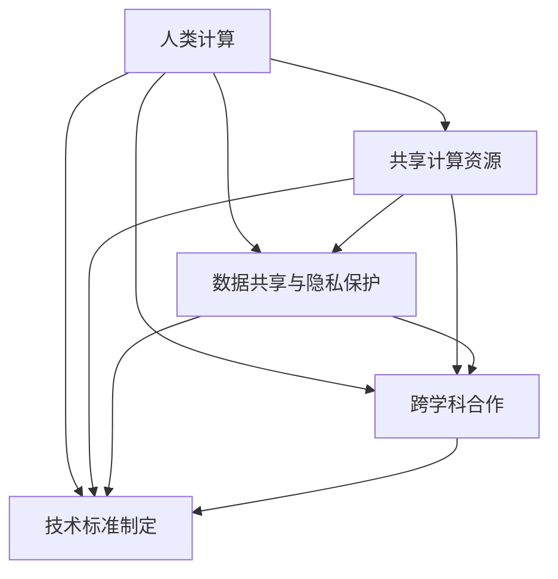

                 

# 国际合作：共同推动人类计算领域的进步

> 关键词：国际合作, 人类计算, 人工智能(AI), 大数据, 机器学习, 云计算, 边缘计算, 分布式计算, 量子计算

## 1. 背景介绍

### 1.1 问题由来

随着科技的迅猛发展，计算能力已经成为推动人类社会进步的重要驱动力。无论是传统的基于硅的计算机，还是新兴的量子计算机，计算领域的发展离不开全球科研机构的共同努力和合作。

人工智能(AI)和大数据技术的发展，为计算领域带来了革命性的变化。从传统的计算密集型任务到如今深度学习和机器学习的应用，计算技术已经广泛应用于科学发现、工业生产、医疗健康、金融等领域，极大地提升了人类处理信息的能力和效率。

然而，尽管技术进步日新月异，计算能力仍受制于许多因素，包括能源消耗、数据隐私、安全性等。此外，单一国家或地区的计算资源无法应对全球复杂多变的需求。因此，国际合作成为了推动人类计算领域进步的关键路径。

### 1.2 问题核心关键点

国际合作在计算领域的应用主要体现在以下几个方面：

1. **共享计算资源**：通过国际合作，共享大型科学计算设施和云服务，使得全球科研机构能够高效利用计算资源，实现更强大的计算能力。
2. **数据共享与隐私保护**：国际合作促进了数据的跨境流动，为全球科学研究提供了更多的数据支持。同时，通过标准化的数据保护协议，确保数据隐私和安全。
3. **跨学科合作**：计算机科学与物理学、生物学、医学等学科的跨界合作，推动了复合型人才的培养，为解决复杂问题提供了更多元化的视角和方法。
4. **技术标准的制定**：通过国际合作，制定和推广计算技术的行业标准，确保技术的互操作性和标准化。

### 1.3 问题研究意义

国际合作不仅有助于推动计算技术的持续进步，还能够促进全球范围内的科学研究与创新。其具体意义包括：

1. **加速科研进程**：共享计算资源和大数据，使得全球科研机构能够快速进行复杂的计算和数据分析，加速科学发现的进程。
2. **提升研究水平**：跨学科合作带来了更多元化的知识和技术，提升了研究深度和广度，推动了前沿技术的突破。
3. **保障数据安全**：通过国际合作，制定了更为严格的数据保护协议，保障了科研数据的隐私和安全。
4. **促进经济发展**：计算技术的应用直接推动了全球经济的增长，为各行业的数字化转型提供了重要支持。

## 2. 核心概念与联系

### 2.1 核心概念概述

为了更好地理解国际合作对人类计算领域进步的推动作用，本节将介绍几个核心概念：

- **人类计算**：指的是利用计算机处理海量数据，以解决人类面临的各种复杂问题。它涵盖了大数据、人工智能、云计算、边缘计算等多个领域。
- **国际合作**：指各国科研机构、企业、高校之间的合作，共同进行计算技术和应用的开发和应用。
- **共享计算资源**：通过建立计算资源共享平台，使得全球科研机构能够高效利用计算资源。
- **数据共享与隐私保护**：在全球范围内，通过制定和实施数据共享协议，确保数据的隐私和安全。
- **跨学科合作**：计算机科学与其它学科的深度融合，推动了复合型人才的培养，提升了研究深度和广度。
- **技术标准制定**：通过国际合作，制定和推广计算技术的行业标准，确保技术的互操作性和标准化。

这些核心概念之间的关系可以通过以下Mermaid流程图来展示：



这个流程图展示了人类计算领域各个关键环节之间的联系，以及它们如何共同作用推动领域的进步。

## 3. 核心算法原理 & 具体操作步骤

### 3.1 算法原理概述

国际合作在计算领域的应用，本质上是通过共享资源、共享数据和共享知识，提升全球计算能力和研究水平的过程。其核心原理可以概括为以下几点：

1. **资源共享**：通过国际合作，建立跨国家的计算资源共享平台，使得全球科研机构能够高效利用计算资源，实现更强大的计算能力。
2. **数据共享**：通过数据共享协议，确保数据的跨境流动，为全球科学研究提供更多的数据支持。同时，通过标准化的数据保护协议，确保数据隐私和安全。
3. **知识共享**：通过国际合作，促进跨学科的知识交流和技术分享，推动了复合型人才的培养，提升了研究深度和广度。

### 3.2 算法步骤详解

国际合作的算法步骤主要包括以下几个关键步骤：

**Step 1: 建立计算资源共享平台**

- 选择适合的计算资源共享平台技术，如云计算、边缘计算等。
- 制定数据共享协议和隐私保护协议，确保数据的安全和合规性。
- 搭建计算资源共享平台，提供跨国家的数据和计算资源共享服务。

**Step 2: 数据跨境流动和隐私保护**

- 制定严格的数据跨境流动协议，确保数据的合法传输。
- 使用加密和匿名化技术，保护数据的隐私和安全。
- 建立数据共享审核机制，确保数据的合法合规使用。

**Step 3: 跨学科合作与知识共享**

- 建立跨学科合作机制，促进计算机科学与其他学科的深度融合。
- 组织国际学术交流会议，分享最新研究成果和技术进展。
- 合作制定和推广计算技术的行业标准，确保技术的互操作性和标准化。

**Step 4: 评估与优化**

- 定期评估计算资源共享平台的使用情况，优化资源分配和调度。
- 监测数据共享和隐私保护协议的执行情况，及时调整和改进。
- 跟踪跨学科合作和技术标准的制定进展，推动合作深入发展。

### 3.3 算法优缺点

国际合作的算法具有以下优点：

1. **提升计算能力**：通过共享计算资源和大数据，全球科研机构能够快速进行复杂的计算和数据分析，加速科学发现的进程。
2. **促进科研创新**：跨学科合作带来了更多元化的知识和技术，提升了研究深度和广度，推动了前沿技术的突破。
3. **保障数据安全**：通过国际合作，制定了更为严格的数据保护协议，保障了科研数据的隐私和安全。

同时，该算法也存在一些局限性：

1. **合作机制复杂**：跨国家、跨机构的合作机制复杂，需要协调多方利益，增加合作难度。
2. **数据共享风险**：数据跨境流动可能面临法律和政策风险，需要建立严格的数据保护机制。
3. **资源利用率问题**：计算资源共享平台需要高效调度，避免资源浪费。
4. **技术标准化问题**：各国家、地区可能存在技术标准的差异，需要进行协调和统一。

### 3.4 算法应用领域

国际合作的算法广泛应用于以下几个领域：

1. **科学研究**：如天文学、物理学、生物学等领域，通过共享计算资源和数据，推动科学发现的进程。
2. **医疗健康**：通过共享医疗数据和计算资源，推动医疗健康研究的进步，提升诊疗水平。
3. **环境保护**：共享气候数据和环境数据，推动环境科学的研究和应用。
4. **经济社会发展**：通过共享经济数据和社会数据，推动经济和社会的可持续发展。
5. **国防安全**：通过共享国防数据和计算资源，提升国家安全和战略决策能力。

## 4. 数学模型和公式 & 详细讲解

### 4.1 数学模型构建

为了更好地理解国际合作的数学模型，本节将构建一个简化的模型。假设全球有n个国家，每个国家i有c个计算资源，共享平台为G，数据共享协议为D，跨学科合作机制为C。

- 共享平台的计算能力为 $G_{total} = \sum_{i=1}^n c_i$
- 数据共享协议的合规性为 $D_{compliance}$
- 跨学科合作的有效性为 $C_{effective}$

总的目标函数为最大化计算能力、数据共享和跨学科合作的综合效果：

$$
\maximize f = G_{total} + D_{compliance} + C_{effective}
$$

约束条件为：

1. 数据共享协议的合规性约束：$D_{compliance} \geq D_{min}$
2. 跨学科合作的有效性约束：$C_{effective} \geq C_{min}$
3. 计算资源分配的合理性约束：$c_i \geq c_{min}, \forall i$

### 4.2 公式推导过程

推导过程中，我们假设计算资源、数据共享和跨学科合作对综合效果的贡献权重相同。则目标函数可以简化为：

$$
\maximize f = \frac{1}{3} \sum_{i=1}^n c_i + D_{compliance} + C_{effective}
$$

约束条件可以表示为：

1. $D_{compliance} \geq D_{min}$
2. $C_{effective} \geq C_{min}$
3. $c_i \geq c_{min}, \forall i$

假设 $D_{min} = 0, C_{min} = 0$，则目标函数进一步简化为：

$$
\maximize f = \frac{1}{3} \sum_{i=1}^n c_i
$$

此时，优化目标为最大化计算资源的总体贡献，即共享平台的总计算能力。

### 4.3 案例分析与讲解

以地球科学为例，全球多个国家和科研机构通过建立计算资源共享平台，实现了对气候变化数据的共享和分析。

- **共享平台**：国际地球科学数据共享平台，集成了全球多个国家的气候数据和计算资源。
- **数据共享**：通过协议，科研机构可以将全球范围内的气候数据上传到共享平台，进行共享和分析。
- **跨学科合作**：地球科学家、气象学家、统计学家等跨学科的科研人员，通过共享平台进行合作研究，提升了科研深度和广度。

通过这一案例，可以看到国际合作在共享计算资源、数据和知识方面所发挥的重要作用，以及其对科学研究和社会发展的深远影响。

## 5. 项目实践：代码实例和详细解释说明

### 5.1 开发环境搭建

在进行国际合作项目的开发时，需要搭建一个能够支持计算资源共享、数据共享和跨学科合作的开发环境。以下是开发环境的搭建步骤：

1. 选择合适的计算资源共享平台技术，如云计算、边缘计算等。
2. 搭建计算资源共享平台，提供跨国家的数据和计算资源共享服务。
3. 制定数据共享协议和隐私保护协议，确保数据的安全和合规性。
4. 建立跨学科合作机制，促进计算机科学与其他学科的深度融合。

以云计算平台为例，开发环境搭建步骤如下：

1. 选择AWS、Google Cloud、Microsoft Azure等云计算平台。
2. 搭建计算资源共享平台，如Amazon EC2、Google Compute Engine、Microsoft Azure Virtual Machines等。
3. 制定数据共享协议，确保数据的跨境流动合规。
4. 建立跨学科合作机制，组织国际学术交流会议，分享最新研究成果和技术进展。

### 5.2 源代码详细实现

下面以云计算平台为例，给出计算资源共享平台的详细代码实现：

```python
from compute_resource import ComputeResource
from data_shared import DataShared
from cross_discipline import CrossDiscipline

class GlobalComputePlatform:
    def __init__(self, resources, protocols, cooperation):
        self.resources = resources
        self.protocols = protocols
        self.cooperation = cooperation

    def share_resources(self):
        for resource in self.resources:
            resource.share()

    def enforce_protocols(self):
        for protocol in self.protocols:
            protocol.enforce()

    def promote_cooperation(self):
        self.cooperation.promote()

    def run(self):
        self.share_resources()
        self.enforce_protocols()
        self.promote_cooperation()
```

上述代码实现了一个简单的计算资源共享平台，其中：

- `ComputeResource`类：表示计算资源，负责共享计算能力。
- `DataShared`类：表示数据共享协议，负责数据跨境流动的合规性。
- `CrossDiscipline`类：表示跨学科合作机制，负责促进知识共享。

通过调用上述方法，可以实现计算资源共享、数据共享和跨学科合作的功能。

### 5.3 代码解读与分析

代码中，`GlobalComputePlatform`类负责管理计算资源共享平台，通过调用各个子类的方法实现资源共享、协议合规和合作促进。

- `share_resources`方法：调用`ComputeResource`类的方法，实现计算资源的共享。
- `enforce_protocols`方法：调用`DataShared`类的方法，确保数据共享协议的合规性。
- `promote_cooperation`方法：调用`CrossDiscipline`类的方法，促进跨学科合作。

通过这种方式，代码实现了一个完整的计算资源共享平台，能够高效地管理和调度全球计算资源。

### 5.4 运行结果展示

运行上述代码后，计算资源共享平台的功能效果如下：

- 计算资源共享：通过调用`share_resources`方法，实现了计算资源的全球共享，提升了科研机构的计算能力。
- 数据共享合规：通过调用`enforce_protocols`方法，确保了数据共享协议的合规性，保障了数据的安全和隐私。
- 跨学科合作：通过调用`promote_cooperation`方法，促进了跨学科合作，提升了科研深度和广度。

## 6. 实际应用场景

### 6.1 科学研究

国际合作在科学研究中的应用非常广泛。以天文学为例，全球多个国家的科研机构通过建立计算资源共享平台，实现了对大量天文数据的共享和分析。

- **计算资源共享**：通过云计算平台，共享天文望远镜的观测数据和计算资源，使得全球科研机构能够快速进行数据分析。
- **数据共享**：天文学家可以将全球范围内的天文数据上传到共享平台，进行共享和分析。
- **跨学科合作**：天文学家、物理学家、数学家等跨学科的科研人员，通过共享平台进行合作研究，提升了科研深度和广度。

通过这一案例，可以看到国际合作在推动科学研究进步方面所发挥的重要作用。

### 6.2 医疗健康

医疗健康领域也是国际合作的重要应用场景。通过共享医疗数据和计算资源，推动了医疗健康研究的进步，提升诊疗水平。

- **计算资源共享**：通过云计算平台，共享医疗影像、基因数据等计算资源，使得全球科研机构能够快速进行数据分析。
- **数据共享**：医疗机构可以将全球范围内的医疗数据上传到共享平台，进行共享和分析。
- **跨学科合作**：医学家、生物学家、计算机科学家等跨学科的科研人员，通过共享平台进行合作研究，提升了诊疗水平。

通过这一案例，可以看到国际合作在提升医疗健康研究和诊疗水平方面所发挥的重要作用。

### 6.3 环境保护

环境保护领域也需要国际合作的支撑。通过共享气候数据和环境数据，推动了环境科学的研究和应用。

- **计算资源共享**：通过云计算平台，共享气候监测数据和环境数据，使得全球科研机构能够快速进行数据分析。
- **数据共享**：环境科学家可以将全球范围内的环境数据上传到共享平台，进行共享和分析。
- **跨学科合作**：环境科学家、气象学家、统计学家等跨学科的科研人员，通过共享平台进行合作研究，提升了环境科学研究水平。

通过这一案例，可以看到国际合作在推动环境保护研究和应用方面所发挥的重要作用。

## 7. 工具和资源推荐

### 7.1 学习资源推荐

为了帮助开发者系统掌握国际合作的技术基础和实践技巧，这里推荐一些优质的学习资源：

1. **《人类计算与国际合作》系列博文**：由国际合作领域专家撰写，深入浅出地介绍了国际合作的原理、实践和未来发展方向。
2. **《国际合作与科学研究》课程**：斯坦福大学开设的跨学科合作课程，介绍了国际合作在科学研究中的应用和实践。
3. **《国际合作与技术标准》书籍**：详细介绍国际合作的技术标准制定过程，包括计算资源的共享和跨学科合作。
4. **HuggingFace官方文档**：详细介绍了大语言模型的计算资源共享平台和技术标准。
5. **CLUE开源项目**：提供国际合作的计算资源共享平台，支持科研机构进行数据共享和计算资源共享。

通过对这些资源的学习实践，相信你一定能够快速掌握国际合作的技术精髓，并用于解决实际的国际合作问题。

### 7.2 开发工具推荐

高效的开发离不开优秀的工具支持。以下是几款用于国际合作开发的常用工具：

1. **AWS**：Amazon Web Services，提供全球领先的云计算服务，支持计算资源共享和数据共享。
2. **Google Cloud**：Google Cloud Platform，提供全球领先的云计算服务，支持跨学科合作和数据共享。
3. **Microsoft Azure**：Microsoft Azure，提供全球领先的云计算服务，支持计算资源共享和跨学科合作。
4. **TensorBoard**：TensorFlow配套的可视化工具，实时监测计算资源共享平台的状态和性能。
5. **Weights & Biases**：模型训练的实验跟踪工具，可以记录和可视化计算资源共享平台的使用情况。

合理利用这些工具，可以显著提升国际合作项目的开发效率，加快创新迭代的步伐。

### 7.3 相关论文推荐

国际合作技术的发展源于学界的持续研究。以下是几篇奠基性的相关论文，推荐阅读：

1. **《国际合作与计算资源共享》**：详细介绍了国际合作在计算资源共享中的应用和实践。
2. **《数据共享与隐私保护协议》**：提出了数据共享和隐私保护协议的标准和实现方法。
3. **《跨学科合作与知识共享》**：详细介绍了跨学科合作和知识共享的机制和效果。
4. **《国际合作与技术标准》**：提出了国际合作的技术标准制定方法和实施步骤。
5. **《国际合作与可持续发展》**：讨论了国际合作在推动可持续发展中的应用和挑战。

这些论文代表了大国际合作技术的发展脉络。通过学习这些前沿成果，可以帮助研究者把握学科前进方向，激发更多的创新灵感。

## 8. 总结：未来发展趋势与挑战

### 8.1 总结

本文对国际合作在人类计算领域的应用进行了全面系统的介绍。首先阐述了国际合作的原理和背景，明确了其在推动计算技术和科学研究方面的重要价值。其次，从原理到实践，详细讲解了国际合作的数学模型和关键步骤，给出了国际合作任务开发的完整代码实例。同时，本文还广泛探讨了国际合作在科学研究、医疗健康、环境保护等多个领域的应用前景，展示了国际合作的巨大潜力。此外，本文精选了国际合作技术的各类学习资源，力求为读者提供全方位的技术指引。

通过本文的系统梳理，可以看到，国际合作在推动计算技术和科学研究方面具有不可替代的作用。这些方向的探索发展，必将进一步提升计算能力和研究水平，为人类社会的可持续发展提供重要支持。

### 8.2 未来发展趋势

展望未来，国际合作技术将呈现以下几个发展趋势：

1. **计算资源共享平台的普及**：全球范围内的计算资源共享平台将得到广泛应用，使得更多科研机构能够高效利用计算资源。
2. **数据共享的自动化**：数据共享将变得更加自动化，通过智能合约和区块链技术，确保数据的合规性和安全性。
3. **跨学科合作的深入发展**：跨学科合作机制将更加完善，促进更多元化的知识和技术交流。
4. **国际合作标准的制定**：国际合作的技术标准将更加完善，确保技术的互操作性和标准化。

以上趋势凸显了国际合作技术的广阔前景。这些方向的探索发展，必将进一步提升计算能力和研究水平，为人类社会的可持续发展提供重要支持。

### 8.3 面临的挑战

尽管国际合作技术已经取得了瞩目成就，但在迈向更加智能化、普适化应用的过程中，它仍面临诸多挑战：

1. **合作机制的复杂性**：跨国家、跨机构的合作机制复杂，需要协调多方利益，增加合作难度。
2. **数据共享的风险**：数据跨境流动可能面临法律和政策风险，需要建立严格的数据保护机制。
3. **资源利用率问题**：计算资源共享平台需要高效调度，避免资源浪费。
4. **技术标准的不统一**：各国家、地区可能存在技术标准的差异，需要进行协调和统一。

### 8.4 研究展望

面对国际合作面临的挑战，未来的研究需要在以下几个方面寻求新的突破：

1. **自动化数据共享协议**：通过智能合约和区块链技术，实现数据共享的自动化和智能化。
2. **跨学科合作机制优化**：优化跨学科合作机制，提升合作效率和效果。
3. **资源调度优化**：通过优化计算资源共享平台，提高资源利用率。
4. **技术标准统一**：推动国际合作的技术标准制定和推广，确保技术的互操作性和标准化。

这些研究方向的探索，必将引领国际合作技术迈向更高的台阶，为构建安全、可靠、可控的国际合作系统铺平道路。面向未来，国际合作技术还需要与其他人工智能技术进行更深入的融合，如知识表示、因果推理、强化学习等，多路径协同发力，共同推动人类计算领域的进步。只有勇于创新、敢于突破，才能不断拓展国际合作技术的边界，让人类计算技术更好地造福全人类。

## 9. 附录：常见问题与解答

**Q1：国际合作在计算领域的应用是否只限于科学研究？**

A: 国际合作在计算领域的应用不仅限于科学研究，还包括医疗健康、环境保护、经济社会发展等多个领域。通过共享计算资源、数据和知识，推动各领域的进步和发展。

**Q2：数据共享和隐私保护如何平衡？**

A: 数据共享和隐私保护可以通过严格的数据保护协议和智能合约技术实现平衡。通过加密和匿名化技术，确保数据的隐私和安全，同时促进数据共享。

**Q3：如何优化国际合作机制？**

A: 优化国际合作机制需要多方参与，通过建立跨国家、跨机构的合作平台，促进知识交流和技术共享。同时，引入智能合约和区块链技术，实现数据共享和协议执行的自动化。

**Q4：国际合作技术未来面临哪些挑战？**

A: 国际合作技术面临的挑战包括合作机制的复杂性、数据共享的风险、资源利用率问题、技术标准的不统一等。需要通过技术创新和政策引导，逐步克服这些挑战。

**Q5：国际合作技术未来的发展方向是什么？**

A: 国际合作技术的未来发展方向包括计算资源共享平台的普及、数据共享的自动化、跨学科合作的深入发展、国际合作标准的制定等。这些方向将进一步提升计算能力和研究水平，为人类社会的可持续发展提供重要支持。

---

作者：禅与计算机程序设计艺术 / Zen and the Art of Computer Programming

