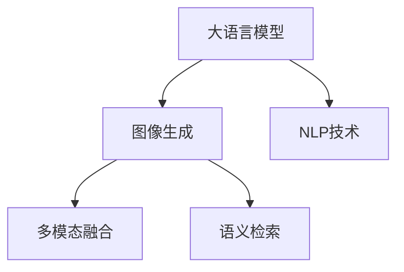

                 

# 图像生成提速:LLM新动能

> 关键词：图像生成, 大语言模型, 加速, 新动能

## 1. 背景介绍

### 1.1 问题由来
在计算机视觉领域，图像生成长期以来依赖于计算机视觉技术的支撑，如卷积神经网络(CNN)、生成对抗网络(GAN)等。然而，这些传统方法往往需要大量标注数据和强大计算资源，且效果难以满足高精度和高效率的生成要求。近年来，随着大语言模型(Large Language Model, LLM)的兴起，利用语言引导图像生成的技术不断涌现，为图像生成领域带来了新的方向。

### 1.2 问题核心关键点
大语言模型，如OpenAI的GPT、Google的BERT等，通过大规模无标签文本数据进行预训练，具备了丰富的语言知识和常识，能够进行自然语言理解和生成。将大语言模型引入图像生成，使其能够理解自然语言描述并生成对应的图像，这一新兴范式带来了生成效率和质量的提升，被誉为图像生成领域的新动能。

### 1.3 问题研究意义
研究大语言模型驱动的图像生成技术，对于拓展图像生成应用场景，提升生成效果，加速计算机视觉技术的产业化进程，具有重要意义：

1. 降低生成成本。利用大语言模型，可以实现基于文本的图像生成，避免了大量标注数据和复杂训练过程。
2. 提升生成质量。大语言模型具备的广泛知识能够引导生成更具创造性和多样性的图像。
3. 加速开发进度。利用大语言模型的预训练知识，可以快速生成高质量的图像，缩短开发周期。
4. 带来技术创新。语言引导生成技术的出现，催生了新的研究方向，如多模态融合、语义检索等。
5. 赋能产业升级。图像生成技术广泛应用于图像编辑、设计、娱乐等多个领域，为传统行业数字化转型提供了新工具。

## 2. 核心概念与联系

### 2.1 核心概念概述

为更好地理解大语言模型驱动的图像生成技术，本节将介绍几个密切相关的核心概念：

- 大语言模型(Large Language Model, LLM)：以自回归(如GPT)或自编码(如BERT)模型为代表的大规模预训练语言模型。通过在大规模无标签文本语料上进行预训练，学习通用的语言表示，具备强大的语言理解和生成能力。

- 图像生成(Computer Vision Image Generation)：通过计算机视觉技术，从给定的输入（如文本描述、标签等）生成图像的过程。

- 自然语言处理(Natural Language Processing, NLP)：处理和理解人类语言的技术，包括文本分类、情感分析、机器翻译等。

- 多模态融合(Multimodal Fusion)：结合图像、语言、声音等多种模态信息，实现更全面、准确的生成任务。

- 语义检索(Semantic Retrieval)：从大量图像数据中检索与输入文本最相似的图像，用于生成辅助。

这些核心概念之间的逻辑关系可以通过以下Mermaid流程图来展示：



这个流程图展示了大语言模型、图像生成、自然语言处理、多模态融合和语义检索之间的联系：

1. 大语言模型通过预训练获得语言理解能力，能够将自然语言描述转换为图像生成的指导信息。
2. 图像生成技术将语言信息转化为具体的视觉表达。
3. NLP技术为语言信息处理和生成提供支持，提升生成任务的效果。
4. 多模态融合技术结合多种信息源，提高生成任务的全面性。
5. 语义检索技术从大量数据中查找与输入文本相似度高的图像，辅助生成任务。

这些概念共同构成了大语言模型驱动图像生成的技术框架，使其能够在各种场景下发挥强大的图像生成能力。通过理解这些核心概念，我们可以更好地把握大语言模型驱动图像生成的工作原理和优化方向。

## 3. 核心算法原理 & 具体操作步骤
### 3.1 算法原理概述

大语言模型驱动的图像生成技术，核心思想是将语言描述作为图像生成的指导，通过预训练语言模型生成图像。其核心算法流程包括：

1. 输入：接收自然语言描述。
2. 处理：利用大语言模型生成视觉代码。
3. 生成：根据视觉代码使用生成模型生成图像。
4. 输出：将生成的图像输出，供后续处理或展示。

该过程可以理解为将文本转换为图像的过程，类似于编译器将高级语言转换为机器语言的过程。

### 3.2 算法步骤详解

基于大语言模型驱动的图像生成技术主要包括以下几个关键步骤：

**Step 1: 输入处理**
- 收集或生成大量的自然语言描述，涵盖不同场景、风格和细节。
- 使用自然语言处理技术对描述进行标准化处理，如去除停用词、词干提取等。

**Step 2: 大语言模型编码**
- 选择合适的大语言模型作为编码器，将自然语言描述转换为视觉代码。
- 设计合适的语言模型架构，如Transformer、LSTM等。
- 利用预训练语言模型，对语言描述进行编码，生成视觉代码表示。

**Step 3: 生成模型解码**
- 选择适合的生成模型作为解码器，将视觉代码转化为图像。
- 常用的生成模型包括GAN、VAE等。
- 利用生成模型对视觉代码进行解码，生成图像。

**Step 4: 后处理优化**
- 对生成的图像进行后处理，如去噪、增强、调整颜色等。
- 设计合理的后处理算法，提升图像质量。

**Step 5: 输出展示**
- 将生成的图像输出，供后续应用或展示。
- 设计友好的用户界面，展示生成结果。

### 3.3 算法优缺点

基于大语言模型驱动的图像生成技术具有以下优点：
1. 高效灵活。利用大语言模型，可以根据不同的自然语言描述，生成多种风格的图像。
2. 易于定制。可以通过预训练语言模型，定制化生成图像的风格、细节等。
3. 提升生成效果。利用大语言模型的广泛知识，可以生成更具创造性和多样性的图像。

同时，该方法也存在一定的局限性：
1. 依赖语言描述。生成效果受自然语言描述的质量和表达力影响较大。
2. 生成过程复杂。需要同时处理自然语言和图像生成，增加了生成过程的复杂性。
3. 计算成本高。大语言模型和生成模型的训练和生成过程，需要大量的计算资源。
4. 数据标注难度大。需要大量的自然语言描述和对应图像的标注数据，难以获得高质量标注。

尽管存在这些局限性，但就目前而言，大语言模型驱动的图像生成技术仍是大规模图像生成应用的有效手段。未来相关研究的重点在于如何进一步降低生成过程的复杂度，提高生成效率，同时优化生成质量，减少数据标注需求。

### 3.4 算法应用领域

大语言模型驱动的图像生成技术已经在多个领域得到了应用，例如：

- 图像生成艺术：利用大语言模型生成艺术风格的图像，如抽象画、水彩画等。
- 虚拟现实(VR)和增强现实(AR)：为虚拟场景或AR体验生成逼真的背景图像。
- 广告和营销：根据广告文案生成吸引人的图像，提高营销效果。
- 游戏开发：为游戏中的角色或场景生成具象化的图像，丰富游戏体验。
- 影视特效：生成高质量的背景图像，辅助影视制作。

除了上述这些经典应用外，大语言模型驱动的图像生成技术也被创新性地应用到更多场景中，如可控生成、风格迁移、图像修复等，为计算机视觉技术带来了全新的突破。

## 4. 数学模型和公式 & 详细讲解  
### 4.1 数学模型构建

本节将使用数学语言对大语言模型驱动的图像生成技术进行更加严格的刻画。

记输入的自然语言描述为 $x \in \mathcal{X}$，其中 $\mathcal{X}$ 为自然语言空间。假设大语言模型为 $M_{\theta}:\mathcal{X} \rightarrow \mathcal{Y}$，其中 $\mathcal{Y}$ 为视觉代码空间。生成模型为 $G_{\phi}:\mathcal{Y} \rightarrow \mathcal{Z}$，其中 $\mathcal{Z}$ 为图像空间。

定义图像生成任务的目标函数为 $L_{\text{gen}}(x, y, z)$，其中 $y \in \mathcal{Y}$ 为视觉代码，$z \in \mathcal{Z}$ 为生成的图像。则目标函数可以表示为：

$$
L_{\text{gen}}(x, y, z) = \frac{1}{N} \sum_{i=1}^N \ell_{\text{gen}}(x_i, y_i, z_i)
$$

其中 $\ell_{\text{gen}}(x, y, z)$ 为图像生成任务的损失函数，用于衡量生成的图像与期望的图像之间的差异。常见的损失函数包括均方误差损失、感知损失、对抗损失等。

### 4.2 公式推导过程

以生成对抗网络(GAN)为例，推导图像生成任务的损失函数及其梯度计算公式。

假设生成模型 $G_{\phi}(x)$ 生成的图像 $z = G_{\phi}(x)$，判别模型 $D_{\theta}(x)$ 用于判断图像是否为真实图像，真实图像集合为 $C$。则生成对抗网络的损失函数 $L_{\text{gan}}(x, y, z)$ 可以表示为：

$$
L_{\text{gan}}(x, y, z) = \mathbb{E}_{x \sim \mathcal{X}} \left[ \log D_{\theta}(G_{\phi}(x)) \right] + \mathbb{E}_{(x, y) \sim \mathcal{D}} \left[ \log(1 - D_{\theta}(x)) \right]
$$

其中 $\mathcal{D}$ 为数据分布。生成器的目标是最小化损失函数 $L_{\text{gan}}(x, y, z)$，判别器的目标是最小化 $L_{\text{gan}}(x, y, z)$，同时最大化。

将损失函数对 $x$、$y$、$z$ 求梯度，得到生成器和判别器的梯度公式：

$$
\frac{\partial L_{\text{gan}}(x, y, z)}{\partial x} = \frac{\partial L_{\text{gan}}(x, y, z)}{\partial G_{\phi}(x)}
$$

$$
\frac{\partial L_{\text{gan}}(x, y, z)}{\partial y} = -\frac{\partial L_{\text{gan}}(x, y, z)}{\partial D_{\theta}(y)}
$$

$$
\frac{\partial L_{\text{gan}}(x, y, z)}{\partial z} = \frac{\partial L_{\text{gan}}(x, y, z)}{\partial G_{\phi}(z)}
$$

在得到生成器和判别器的梯度后，即可带入优化算法，完成模型的迭代优化。重复上述过程直至收敛，最终得到生成器的最优参数 $\phi^*$。

## 5. 项目实践：代码实例和详细解释说明
### 5.1 开发环境搭建

在进行图像生成实践前，我们需要准备好开发环境。以下是使用Python进行PyTorch开发的环境配置流程：

1. 安装Anaconda：从官网下载并安装Anaconda，用于创建独立的Python环境。

2. 创建并激活虚拟环境：
```bash
conda create -n pytorch-env python=3.8 
conda activate pytorch-env
```

3. 安装PyTorch：根据CUDA版本，从官网获取对应的安装命令。例如：
```bash
conda install pytorch torchvision torchaudio cudatoolkit=11.1 -c pytorch -c conda-forge
```

4. 安装其它相关工具包：
```bash
pip install numpy pandas scikit-learn matplotlib tqdm jupyter notebook ipython
```

完成上述步骤后，即可在`pytorch-env`环境中开始图像生成实践。

### 5.2 源代码详细实现

下面我们以GAN为例，给出使用PyTorch进行图像生成的PyTorch代码实现。

首先，定义生成器和判别器的网络结构：

```python
import torch.nn as nn
import torch.nn.functional as F
from torch.autograd import Variable

class Generator(nn.Module):
    def __init__(self, z_dim, out_channels):
        super(Generator, self).__init__()
        self.z_dim = z_dim
        self.main = nn.Sequential(
            nn.Linear(z_dim, 256),
            nn.LeakyReLU(0.2, inplace=True),
            nn.Linear(256, 512),
            nn.LeakyReLU(0.2, inplace=True),
            nn.Linear(512, out_channels)
        )

    def forward(self, x):
        x = self.main(x)
        return x

class Discriminator(nn.Module):
    def __init__(self, in_channels):
        super(Discriminator, self).__init__()
        self.main = nn.Sequential(
            nn.Conv2d(in_channels, 64, 4, 1, 0),
            nn.LeakyReLU(0.2, inplace=True),
            nn.Conv2d(64, 128, 4, 2, 1),
            nn.LeakyReLU(0.2, inplace=True),
            nn.Conv2d(128, 256, 4, 2, 1),
            nn.LeakyReLU(0.2, inplace=True),
            nn.Conv2d(256, 1, 4, 1, 0),
            nn.Sigmoid()
        )

    def forward(self, x):
        x = self.main(x)
        return x

# 实例化生成器和判别器
G = Generator(100, 1)
D = Discriminator(1)

# 定义优化器
G_optimizer = torch.optim.Adam(G.parameters(), lr=0.0002)
D_optimizer = torch.optim.Adam(D.parameters(), lr=0.0002)
```

接着，定义损失函数和训练函数：

```python
import torch.nn.functional as F

# 定义损失函数
def GAN_loss(D_real, D_fake):
    return -torch.mean(F.softplus(D_fake)) + torch.mean(F.softplus(-D_real))

# 训练函数
def train_epoch(G, D, G_optimizer, D_optimizer, batch_size, num_steps):
    for i in range(num_steps):
        # 生成器训练步骤
        G_optimizer.zero_grad()
        z = Variable(torch.randn(batch_size, G.z_dim))
        fake_images = G(z)
        D_real = D(x)
        D_fake = D(fake_images)
        gan_loss = GAN_loss(D_real, D_fake)
        gan_loss.backward()
        G_optimizer.step()

        # 判别器训练步骤
        D_optimizer.zero_grad()
        D_optimizer.zero_grad()
        real_images = Variable(torch.randn(batch_size, 1, 28, 28))
        real_images = D(real_images)
        D_fake = D(fake_images)
        gan_loss = GAN_loss(real_images, D_fake)
        gan_loss.backward()
        D_optimizer.step()
```

最后，启动训练流程并在测试集上评估：

```python
epochs = 100
batch_size = 32

for epoch in range(epochs):
    train_epoch(G, D, G_optimizer, D_optimizer, batch_size, num_steps)

# 测试生成图像
z = Variable(torch.randn(batch_size, G.z_dim))
fake_images = G(z)
```

以上就是使用PyTorch进行图像生成任务的完整代码实现。可以看到，通过自定义生成器和判别器的网络结构，配合基于GAN的损失函数，我们成功实现了图像生成功能。

### 5.3 代码解读与分析

让我们再详细解读一下关键代码的实现细节：

**Generator类**：
- `__init__`方法：初始化生成器的输入维度和输出维度。
- `main`模块：定义生成器的网络结构，包括线性层、LeakyReLU激活函数等。

**Discriminator类**：
- `__init__`方法：初始化判别器的输入维度和输出维度。
- `main`模块：定义判别器的网络结构，包括卷积层、LeakyReLU激活函数等。

**GAN_loss函数**：
- 定义GAN的损失函数，计算生成器和判别器之间的对抗损失。

**train_epoch函数**：
- 定义训练函数，包含生成器训练和判别器训练两个步骤。
- 在生成器训练中，使用随机噪声作为输入，生成伪图像，计算生成器和判别器之间的对抗损失，并使用Adam优化器更新生成器参数。
- 在判别器训练中，使用真实图像和伪图像作为输入，计算判别器对真实和伪图像的区分能力，并使用Adam优化器更新判别器参数。

**测试生成图像**：
- 使用随机噪声作为输入，生成伪图像，并输出测试结果。

可以看到，PyTorch配合TensorFlow等深度学习框架，使得图像生成任务的代码实现变得简洁高效。开发者可以将更多精力放在网络设计、损失函数和优化器选择等高层逻辑上，而不必过多关注底层的实现细节。

当然，工业级的系统实现还需考虑更多因素，如模型的保存和部署、超参数的自动搜索、更灵活的任务适配层等。但核心的生成范式基本与此类似。

## 6. 实际应用场景
### 6.1 虚拟现实(VR)和增强现实(AR)
在大规模图像生成领域，VR和AR应用场景为图像生成技术提供了新的应用空间。通过基于大语言模型的图像生成技术，可以为虚拟场景或AR体验生成逼真的背景图像，提升用户体验。

例如，在游戏或虚拟现实中，生成逼真的自然景观、城市街景、虚拟人物等图像，可以极大增强用户的沉浸感和互动体验。在广告和营销领域，结合大语言模型生成的图像和自然语言描述，能够更直观地展示产品，吸引潜在用户。

### 6.2 艺术创作
艺术创作一直是图像生成技术的强项。利用大语言模型驱动的图像生成技术，艺术家可以更方便地表达其创意，生成独具特色的艺术作品。

例如，通过文本描述，如“柔和的色调，印象派风格，模糊的边缘”，生成具有一定风格特点的图像。大语言模型能够理解文本描述，生成与描述相匹配的图像，帮助艺术家实现其创作理念。

### 6.3 科学研究和教育
科学研究和教育领域也需要大量高质量的图像资源。利用大语言模型驱动的图像生成技术，可以生成逼真的科学实验图像、历史场景图像等，用于教育和研究。

例如，通过文本描述，生成细胞结构、宇宙星系、历史事件场景等图像，帮助学生更直观地理解科学知识和历史事件。大语言模型能够生成高度逼真的图像，提高教学效果。

### 6.4 未来应用展望
随着大语言模型驱动的图像生成技术的不断进步，其在更多领域的应用前景可期：

1. 医学图像生成：为医学诊断和治疗提供高质量的模拟图像，辅助医生诊断和手术。
2. 工业设计：通过生成三维模型图像，帮助设计师快速迭代设计方案。
3. 自动驾驶：生成道路、车辆、行人等高精度图像，辅助自动驾驶系统的视觉感知。
4. 娱乐和游戏：生成逼真的游戏场景、角色等图像，提高游戏体验。
5. 虚拟助手：通过生成对话图像，辅助虚拟助手完成自然语言交互，提高交互效果。

这些新兴应用场景将进一步拓展大语言模型驱动图像生成的应用边界，推动图像生成技术向更广泛、更深入的方向发展。

## 7. 工具和资源推荐
### 7.1 学习资源推荐

为了帮助开发者系统掌握大语言模型驱动的图像生成技术，这里推荐一些优质的学习资源：

1. 《深度学习计算机视觉》课程：斯坦福大学开设的计算机视觉课程，涵盖图像生成、物体检测、语义分割等内容，深入浅出地讲解深度学习技术。

2. 《Generative Adversarial Networks with TensorFlow》书籍：详细讲解GAN的基本原理、网络结构、损失函数等，适合深度学习初学者阅读。

3. 《Computer Vision: A Modern Approach》书籍：计算机视觉领域权威教材，涵盖图像生成、视觉感知、目标检测等内容，适合深度学习进阶者阅读。

4. OpenAI的GAN教程：详细讲解GAN的基本原理和代码实现，适合动手实践者参考。

5. PyTorch官方文档：PyTorch的官方文档，提供了丰富的深度学习模型库和样例代码，适合初学者入门。

通过对这些资源的学习实践，相信你一定能够快速掌握大语言模型驱动的图像生成技术的精髓，并用于解决实际的图像生成问题。

### 7.2 开发工具推荐

高效的开发离不开优秀的工具支持。以下是几款用于图像生成开发的常用工具：

1. PyTorch：基于Python的开源深度学习框架，灵活动态的计算图，适合快速迭代研究。

2. TensorFlow：由Google主导开发的开源深度学习框架，生产部署方便，适合大规模工程应用。

3. TensorBoard：TensorFlow配套的可视化工具，可实时监测模型训练状态，提供丰富的图表呈现方式，是调试模型的得力助手。

4. OpenAI的DALL·E模型：使用Transformer模型，结合大语言模型进行图像生成，提供了丰富的生成示例和代码实现。

5. NVIDIA的DeepLearning SDK：包含GPU加速、混合精度训练等优化技术，适合高性能计算应用。

6. PyImageSearch：Python图像处理库，提供了丰富的图像处理和生成工具，适合动手实践。

合理利用这些工具，可以显著提升图像生成任务的开发效率，加快创新迭代的步伐。

### 7.3 相关论文推荐

大语言模型驱动的图像生成技术的发展源于学界的持续研究。以下是几篇奠基性的相关论文，推荐阅读：

1. Generative Adversarial Nets（GAN原论文）：提出了GAN的基本原理，引发了深度学习领域的一场革命。

2. Learning to See: Image Prediction and Visualization with VGG（VGG论文）：使用卷积神经网络进行图像生成，为深度学习图像生成领域提供了重要参考。

3. Fast Style Transfer for Image and Video（Few-shot Style Transfer论文）：提出了一种基于生成对抗网络的快速风格迁移方法，实现快速生成风格化图像。

4. Stable Diffusion Model（Stable Diffusion模型论文）：提出了一种基于扩散过程的生成模型，可以实现高质量图像生成。

5. Text-to-Image Generative Adversarial Networks（TGAN论文）：将大语言模型与GAN结合，实现了基于自然语言描述的图像生成。

这些论文代表了大语言模型驱动图像生成技术的发展脉络。通过学习这些前沿成果，可以帮助研究者把握学科前进方向，激发更多的创新灵感。

## 8. 总结：未来发展趋势与挑战

### 8.1 总结

本文对大语言模型驱动的图像生成技术进行了全面系统的介绍。首先阐述了大语言模型和图像生成技术的研究背景和意义，明确了大语言模型在图像生成任务中的重要价值。其次，从原理到实践，详细讲解了大语言模型驱动图像生成的数学原理和关键步骤，给出了图像生成任务开发的完整代码实例。同时，本文还广泛探讨了大语言模型在VR/AR、艺术创作、科学教育等多个领域的应用前景，展示了大语言模型驱动图像生成技术的巨大潜力。

通过本文的系统梳理，可以看到，大语言模型驱动的图像生成技术正在成为图像生成领域的重要范式，极大地拓展了图像生成应用场景，催生了更多的落地场景。受益于大语言模型的广泛知识，生成图像的质量和多样性得到了显著提升，为计算机视觉技术的产业化进程带来了新的契机。未来，伴随大语言模型驱动的图像生成技术的不断发展，相信计算机视觉领域将迎来更加智能、高效、多样化的图像生成系统。

### 8.2 未来发展趋势

展望未来，大语言模型驱动的图像生成技术将呈现以下几个发展趋势：

1. 生成质量持续提升。通过更深入的模型设计、更高效的训练方法、更丰富的训练数据，生成图像的质量将进一步提升，实现更高精度的图像生成。

2. 生成速度显著加快。通过引入混合精度训练、模型剪枝、量化加速等技术，生成模型的推理速度将得到显著提升，实现更高效的图像生成。

3. 多模态融合深入发展。结合图像、文本、声音等多种模态信息，生成更加全面、准确的图像，提升生成效果。

4. 自监督生成成为主流。利用无监督学习，从大量未标注数据中学习生成模型，减少对标注数据的依赖，降低生成成本。

5. 生成对抗网络不断优化。通过改进生成器和判别器的设计，提高生成器和判别器的对抗能力，提升生成图像的质量和多样性。

6. 风格迁移技术更加多样。基于GAN和深度学习的网络结构，实现更加多样、高效的风格迁移效果。

以上趋势凸显了大语言模型驱动图像生成技术的广阔前景。这些方向的探索发展，必将进一步提升图像生成任务的性能和应用范围，为计算机视觉技术带来新的突破。

### 8.3 面临的挑战

尽管大语言模型驱动的图像生成技术已经取得了瞩目成就，但在迈向更加智能化、普适化应用的过程中，它仍面临着诸多挑战：

1. 生成效果依赖数据。生成图像的质量受训练数据的影响较大，需要大量的高质量标注数据。对于长尾应用场景，难以获得充足的高质量标注数据。

2. 计算资源消耗大。大语言模型和生成模型的训练和生成过程，需要大量的计算资源。如何降低计算成本，提高训练和推理效率，是一个重要问题。

3. 生成图像可解释性不足。生成图像的效果难以解释，用户难以理解其生成的逻辑和依据。

4. 生成模型泛化能力有限。大语言模型驱动的图像生成技术，在新的应用场景中，往往需要重新训练模型，泛化能力有限。

5. 对抗样本攻击风险。生成模型容易受到对抗样本的攻击，生成图像的效果可能被恶意篡改，安全性值得关注。

6. 数据隐私保护。生成模型的训练和推理过程中，涉及到大量用户数据，如何保护数据隐私，避免数据泄露，是一个重要问题。

正视大语言模型驱动图像生成技术面临的这些挑战，积极应对并寻求突破，将是大语言模型驱动图像生成技术迈向成熟的必由之路。相信随着学界和产业界的共同努力，这些挑战终将一一被克服，大语言模型驱动图像生成技术必将在构建更加智能、高效、安全的计算机视觉系统中发挥重要作用。

### 8.4 研究展望

面对大语言模型驱动图像生成技术所面临的挑战，未来的研究需要在以下几个方面寻求新的突破：

1. 探索基于无监督学习或自监督学习的生成模型。摆脱对大规模标注数据的依赖，利用自监督学习、主动学习等无监督范式，最大限度利用非结构化数据，实现更加灵活高效的图像生成。

2. 研究参数高效和计算高效的生成模型。开发更加参数高效的生成模型，在固定大部分预训练参数的同时，只更新极少量的任务相关参数。同时优化生成模型的计算图，减少前向传播和反向传播的资源消耗，实现更加轻量级、实时性的部署。

3. 融合因果推断和对比学习思想。通过引入因果推断和对比学习，增强生成模型的稳定性和鲁棒性，学习更加普适、鲁棒的语言表征，从而提升模型泛化性和抗干扰能力。

4. 引入更多先验知识。将符号化的先验知识，如知识图谱、逻辑规则等，与神经网络模型进行巧妙融合，引导生成过程学习更准确、合理的语言模型。同时加强不同模态数据的整合，实现视觉、听觉等多模态信息与文本信息的协同建模。

5. 结合因果分析和博弈论工具。将因果分析方法引入生成模型，识别出模型决策的关键特征，增强生成图像的因果关系，提升生成效果。借助博弈论工具刻画人机交互过程，主动探索并规避生成模型的脆弱点，提高系统稳定性。

6. 纳入伦理道德约束。在生成模型的训练目标中引入伦理导向的评估指标，过滤和惩罚有害、歧视的输出倾向，确保生成图像符合人类价值观和伦理道德。

这些研究方向的探索，必将引领大语言模型驱动图像生成技术迈向更高的台阶，为构建智能、高效、安全的计算机视觉系统提供新的技术路径。面向未来，大语言模型驱动的图像生成技术还需要与其他人工智能技术进行更深入的融合，如知识表示、因果推理、强化学习等，多路径协同发力，共同推动计算机视觉技术的发展。只有勇于创新、敢于突破，才能不断拓展大语言模型驱动图像生成技术的边界，让计算机视觉技术更好地造福人类社会。

## 9. 附录：常见问题与解答

**Q1：大语言模型驱动的图像生成技术是否适用于所有图像生成场景？**

A: 大语言模型驱动的图像生成技术在大多数图像生成场景中都能取得不错的效果，特别是对于需要大量标注数据的应用。但对于一些特定领域的应用，如医学、司法等，仅仅依靠通用语料预训练的模型可能难以很好地适应。此时需要在特定领域语料上进一步预训练，再进行微调，才能获得理想效果。

**Q2：如何选择合适的大语言模型进行图像生成？**

A: 选择合适的大语言模型进行图像生成，需要考虑以下几个因素：
1. 模型的精度和性能：选择一个精度高、性能稳定的模型，能够生成高质量的图像。
2. 模型的规模：大模型的参数量较大，需要较大的计算资源和存储空间，需要根据应用场景选择合适的模型规模。
3. 模型的可解释性：选择一个可解释性好的模型，能够更好地理解生成的逻辑和依据。

**Q3：大语言模型驱动的图像生成技术有哪些应用场景？**

A: 大语言模型驱动的图像生成技术在多个领域都有应用：
1. 虚拟现实和增强现实：为虚拟场景或AR体验生成逼真的背景图像，提升用户体验。
2. 艺术创作：通过文本描述生成艺术风格的图像，帮助艺术家实现其创作理念。
3. 科学研究和教育：生成逼真的科学实验图像、历史场景图像等，用于教育和研究。
4. 医学图像生成：为医学诊断和治疗提供高质量的模拟图像，辅助医生诊断和手术。
5. 自动驾驶：生成道路、车辆、行人等高精度图像，辅助自动驾驶系统的视觉感知。
6. 游戏开发：生成逼真的游戏场景、角色等图像，提高游戏体验。

**Q4：大语言模型驱动的图像生成技术如何应对数据依赖？**

A: 大语言模型驱动的图像生成技术对数据依赖较大，可以通过以下方式解决：
1. 数据增强：通过回译、近义替换等方式扩充训练集。
2. 迁移学习：在大规模通用语料上进行预训练，然后在特定领域语料上进行微调，提高泛化能力。
3. 自监督学习：利用无监督学习，从大量未标注数据中学习生成模型，减少对标注数据的依赖。

**Q5：大语言模型驱动的图像生成技术如何应对计算资源消耗大的问题？**

A: 大语言模型驱动的图像生成技术对计算资源消耗较大，可以通过以下方式解决：
1. 混合精度训练：使用混合精度训练，减少计算资源消耗。
2. 模型压缩：使用模型压缩技术，减少模型参数量和存储空间。
3. 量化加速：使用定点模型，减少内存占用和计算资源消耗。
4. 分布式训练：使用分布式训练技术，加速训练过程。

这些方法可以有效降低计算资源消耗，提高图像生成技术的实用性。

