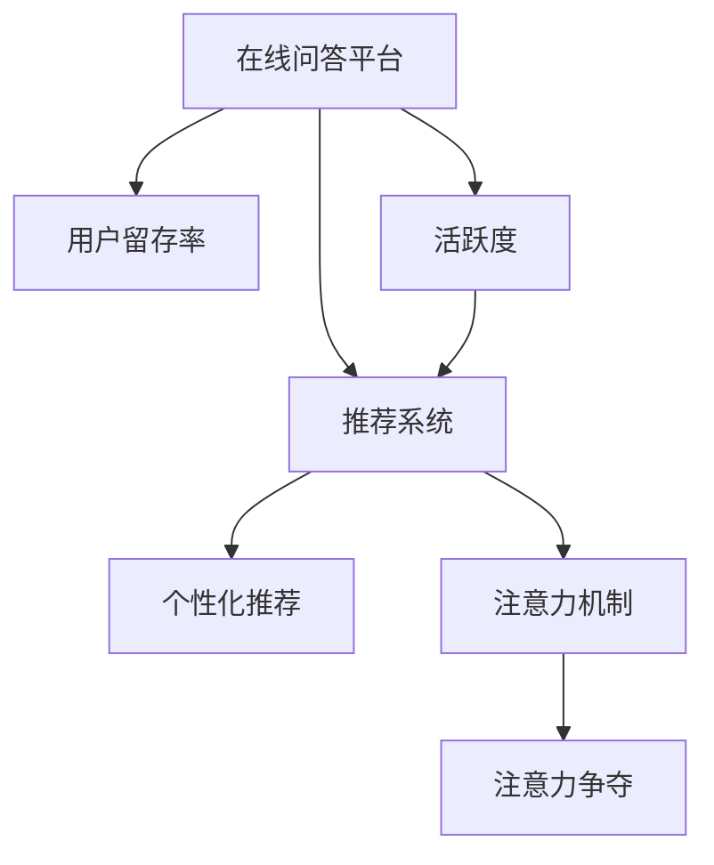

                 

# 在线问答平台的注意力争夺技巧

## 1. 背景介绍

随着互联网的普及，在线问答平台成为了大众获取信息、解决疑问的重要渠道。然而，面对众多信息源和不同平台的竞争，在线问答平台如何吸引用户，保持用户的长期关注，是一个亟待解决的挑战。本文将深入探讨在线问答平台在注意力争夺方面的技巧，帮助平台运营商提升用户留存率、增加活跃度，实现业务增长。

## 2. 核心概念与联系

### 2.1 核心概念概述

为更好地理解在线问答平台的注意力争夺技巧，本节将介绍几个密切相关的核心概念：

- 在线问答平台(Online Question and Answer Platform)：以用户提出问题、其他用户或系统提供回答为核心功能的网站或应用，如知乎、Quora等。
- 用户留存率(User Retention Rate)：指在一定时间内，再次访问平台的用户比例，是衡量平台黏性的关键指标。
- 活跃度(User Engagement)：包括用户在平台上的互动次数、停留时间、提问和回答数量等，是衡量用户参与度的重要指标。
- 推荐系统(Recommendation System)：通过分析用户行为和兴趣，为用户推荐可能感兴趣的问题和答案的系统，提升用户体验和黏性。
- 个性化推荐(Recommendation by Personalization)：根据用户的历史行为和兴趣，为其量身定制推荐内容的技术。
- 注意力机制(Attention Mechanism)：一种在深度学习中广泛应用的技术，用于衡量不同输入特征的重要性，提升模型的泛化能力。
- 注意力争夺(Attention Disputing)：通过优化推荐系统中的算法和策略，提升用户对平台的关注度和参与度，以吸引更多的用户注意力。

这些核心概念之间的逻辑关系可以通过以下Mermaid流程图来展示：



这个流程图展示了大语言模型的核心概念及其之间的关系：

1. 在线问答平台通过推荐系统为用户提供个性化的内容，提升用户的活跃度。
2. 个性化推荐系统利用用户的浏览、点赞、评论等行为数据，通过注意力机制评估不同内容的重要性，从而为用户推荐高质量内容。
3. 注意力争夺策略通过优化推荐算法和策略，提升用户对平台的关注度和参与度，进一步吸引更多用户。

## 3. 核心算法原理 & 具体操作步骤

### 3.1 算法原理概述

在线问答平台的注意力争夺，本质上是通过优化推荐算法和策略，提升用户对平台的关注度和参与度。其核心思想是：利用用户的兴趣和行为数据，通过注意力机制对不同内容进行加权处理，最大化用户对平台的留存率和活跃度。

形式化地，假设在线问答平台有 $N$ 个用户，每个用户 $i$ 在时间段 $t$ 内提问和回答的次数分别为 $q_i^t$ 和 $a_i^t$，总互动次数为 $s_i^t=q_i^t+a_i^t$。平台通过推荐系统为用户推荐 $M$ 个问题，用户对每个问题的关注程度记为 $w_i^{t+1}$，表示用户 $i$ 在时间 $t+1$ 内关注问题 $j$ 的权重。推荐系统设计的优化目标是：

$$
\max_{w_i^{t+1}} \sum_{i=1}^N w_i^{t+1} s_i^t
$$

其中，目标函数通过加权总互动次数最大化，确保推荐内容对用户有足够的吸引力。

### 3.2 算法步骤详解

基于注意力争夺技巧的在线问答平台推荐系统一般包括以下几个关键步骤：

**Step 1: 用户行为数据收集**

- 收集用户在平台上的所有互动数据，包括提问、回答、点赞、评论、停留时间等行为。
- 利用数据分析工具对数据进行清洗和预处理，确保数据的准确性和完整性。

**Step 2: 特征工程**

- 对用户行为数据进行特征提取和向量化处理，生成用户-时间段的特征向量 $\mathbf{u}_i^t$。
- 对问题数据进行特征提取和向量化处理，生成问题-时间段的特征向量 $\mathbf{p}_j^t$。
- 设计特征融合方法，将用户和问题的特征向量进行组合，生成推荐目标的特征向量 $\mathbf{y}_i^{t+1}$。

**Step 3: 构建注意力模型**

- 选择合适的注意力机制，如点积注意力、多头注意力、加性注意力等。
- 构建注意力模型，计算用户 $i$ 对问题 $j$ 的注意力权重 $w_i^{t+1}$。

**Step 4: 构建推荐模型**

- 设计推荐算法，如基于矩阵分解、协同过滤、深度学习等方法。
- 使用注意力机制对推荐目标的特征向量进行加权处理，生成推荐结果。

**Step 5: 模型训练和评估**

- 使用训练集对模型进行训练，优化注意力权重和推荐算法参数。
- 在验证集上评估模型的推荐效果，调整超参数和模型结构。
- 在测试集上测试模型，对比基线算法的性能，评估改进效果。

**Step 6: 实时推荐**

- 在实际应用中，实时接收用户行为数据，动态更新注意力权重和推荐结果。
- 利用推荐系统为用户展示可能感兴趣的问题和答案，提升用户活跃度和留存率。

### 3.3 算法优缺点

基于注意力争夺技巧的在线问答平台推荐系统具有以下优点：
1. 提升用户参与度。通过个性化推荐和注意力机制，提升用户对平台的关注度和参与度，增加用户活跃度。
2. 优化用户体验。推荐系统为用户推荐高质量内容，提升用户满意度和留存率。
3. 提高转化率。精准的推荐能够有效转化潜在用户，带来更多活跃用户和优质内容。

同时，该方法也存在一定的局限性：
1. 对数据质量依赖大。推荐系统的性能很大程度上取决于用户行为数据的完整性和准确性。
2. 模型复杂度高。注意力机制和深度学习模型的复杂度较高，需要较长的训练时间和较大的计算资源。
3. 过拟合风险大。过度依赖特定用户数据可能导致模型过拟合，泛化能力不足。
4. 用户隐私问题。用户行为数据和互动信息的收集和使用，涉及用户隐私保护问题。

尽管存在这些局限性，但就目前而言，基于注意力争夺的推荐系统在在线问答平台的推荐效果上已经取得了显著成效，成为平台运营商提升用户黏性的重要手段。

### 3.4 算法应用领域

基于注意力争夺技巧的推荐系统，已经在多个在线问答平台上得到了广泛应用，如知乎、Quora、Stack Overflow等，带来了显著的业务提升。具体应用领域包括：

- 问题推荐：根据用户的浏览历史和互动数据，推荐可能感兴趣的问题。
- 答案推荐：根据用户的提问历史和互动数据，推荐可能感兴趣的答案。
- 用户推荐：根据用户的互动数据和兴趣，推荐可能感兴趣的其他用户。
- 话题推荐：根据用户的热门话题浏览记录，推荐相关话题。
- 新用户引导：为新手用户推荐入门指南、热门话题等，引导用户快速融入平台。

除了这些经典应用外，平台运营商还可以通过结合社交网络、用户反馈等数据，进一步优化推荐算法，提升用户体验和平台黏性。

## 4. 数学模型和公式 & 详细讲解  
### 4.1 数学模型构建

本节将使用数学语言对在线问答平台推荐系统的注意力争夺技巧进行更加严格的刻画。

记在线问答平台有 $N$ 个用户，每个用户 $i$ 在时间段 $t$ 内提问和回答的次数分别为 $q_i^t$ 和 $a_i^t$，总互动次数为 $s_i^t=q_i^t+a_i^t$。假设平台推荐给用户 $i$ 在时间 $t+1$ 内 $M$ 个问题 $j$，每个问题的特征向量为 $\mathbf{p}_j^t$，用户对每个问题的注意力权重为 $w_i^{t+1}$，则用户 $i$ 在时间 $t+1$ 内的推荐目标特征向量 $\mathbf{y}_i^{t+1}$ 为：

$$
\mathbf{y}_i^{t+1} = \sum_{j=1}^M w_i^{t+1} \mathbf{p}_j^t
$$

其中 $w_i^{t+1}$ 可以通过注意力机制计算得到。

### 4.2 公式推导过程

以下我们以点积注意力机制为例，推导用户 $i$ 对问题 $j$ 的注意力权重 $w_i^{t+1}$ 的计算公式。

根据点积注意力机制，用户 $i$ 对问题 $j$ 的注意力权重 $w_i^{t+1}$ 可以表示为：

$$
w_i^{t+1} = \frac{\exp(\mathbf{u}_i^t \cdot \mathbf{p}_j^t)}{\sum_{k=1}^N \exp(\mathbf{u}_i^t \cdot \mathbf{p}_k^t)}
$$

其中 $\mathbf{u}_i^t$ 为用户 $i$ 在时间段 $t$ 内的特征向量，$\mathbf{p}_j^t$ 为问题 $j$ 在时间段 $t$ 内的特征向量。注意力权重 $w_i^{t+1}$ 表示用户对问题 $j$ 的关注程度，越大表示用户越感兴趣。

通过将注意力权重对推荐目标特征向量进行加权处理，即 $\mathbf{y}_i^{t+1} = \sum_{j=1}^M w_i^{t+1} \mathbf{p}_j^t$，用户 $i$ 在时间 $t+1$ 内推荐目标特征向量 $\mathbf{y}_i^{t+1}$ 可以最大化表示用户 $i$ 对推荐问题的关注度和兴趣。

### 4.3 案例分析与讲解

为了更好地理解点积注意力机制在推荐系统中的作用，以下给出一个简单的案例分析：

假设某用户在在线问答平台提问后，平台推荐了 $M=3$ 个可能感兴趣的问题。根据用户的历史互动数据，用户对问题 $j_1$、$j_2$、$j_3$ 的特征向量分别为 $\mathbf{p}_{j_1}^t$、$\mathbf{p}_{j_2}^t$、$\mathbf{p}_{j_3}^t$。

- 用户对问题 $j_1$、$j_2$、$j_3$ 的注意力权重分别为 $w_{i1}^{t+1}$、$w_{i2}^{t+1}$、$w_{i3}^{t+1}$，表示用户对三个问题的关注程度。
- 用户 $i$ 在时间段 $t+1$ 内的推荐目标特征向量 $\mathbf{y}_i^{t+1}$ 为：

$$
\mathbf{y}_i^{t+1} = w_{i1}^{t+1} \mathbf{p}_{j_1}^t + w_{i2}^{t+1} \mathbf{p}_{j_2}^t + w_{i3}^{t+1} \mathbf{p}_{j_3}^t
$$

其中 $w_{i1}^{t+1} = \frac{\exp(\mathbf{u}_i^t \cdot \mathbf{p}_{j_1}^t)}{\sum_{k=1}^N \exp(\mathbf{u}_i^t \cdot \mathbf{p}_k^t)}$，$w_{i2}^{t+1}$ 和 $w_{i3}^{t+1}$ 同理。

## 5. 项目实践：代码实例和详细解释说明
### 5.1 开发环境搭建

在进行推荐系统实践前，我们需要准备好开发环境。以下是使用Python进行推荐系统开发的环境配置流程：

1. 安装Anaconda：从官网下载并安装Anaconda，用于创建独立的Python环境。

2. 创建并激活虚拟环境：
```bash
conda create -n recomm-system-env python=3.8 
conda activate recomm-system-env
```

3. 安装推荐系统相关的库：
```bash
pip install numpy pandas sklearn tqdm matplotlib seaborn scikit-learn torch
```

4. 安装深度学习框架：
```bash
pip install pytorch torchvision torchtext
```

5. 安装其他推荐系统工具包：
```bash
pip install recommendation-systems pythorre-psd
```

完成上述步骤后，即可在`recomm-system-env`环境中开始推荐系统开发。

### 5.2 源代码详细实现

下面我们以点积注意力机制为例，给出使用PyTorch实现用户行为数据分析和推荐模型训练的代码实现。

首先，定义用户行为数据集：

```python
import pandas as pd
import numpy as np

# 用户行为数据
user_data = pd.read_csv('user_data.csv', index_col='user_id')
```

然后，进行特征工程：

```python
# 定义特征
def feature_engineering(user_data):
    # 添加时间特征
    user_data['time'] = user_data['time'].apply(lambda x: int(x.split(':')[0]))
    
    # 添加用户行为特征
    user_data['click'] = user_data['click'].apply(lambda x: 1 if x == '1' else 0)
    user_data['post'] = user_data['post'].apply(lambda x: 1 if x == '1' else 0)
    
    return user_data

user_data = feature_engineering(user_data)
```

接着，设计注意力模型：

```python
import torch
from torch import nn
from torch.nn import functional as F

# 定义注意力模型
class Attention(nn.Module):
    def __init__(self, in_dim):
        super(Attention, self).__init__()
        self.W = nn.Linear(in_dim, in_dim)
        self.V = nn.Linear(in_dim, 1)
    
    def forward(self, x, y):
        x = self.W(x)
        y = self.V(y)
        attention_weight = F.softmax(torch.tanh(x+y), dim=1)
        weighted_y = attention_weight * y
        return weighted_y.sum(dim=1)
```

最后，训练推荐模型：

```python
# 定义推荐模型
class RecommendationModel(nn.Module):
    def __init__(self, in_dim, out_dim):
        super(RecommendationModel, self).__init__()
        self.attention = Attention(in_dim)
        self.fc = nn.Linear(in_dim, out_dim)
    
    def forward(self, user_feature, item_feature):
        user_feature = self.attention(user_feature, item_feature)
        item_feature = self.fc(item_feature)
        return user_feature, item_feature
    
# 训练模型
model = RecommendationModel(32, 8)
optimizer = torch.optim.Adam(model.parameters(), lr=0.001)
criterion = nn.MSELoss()

# 数据准备
user_data = user_data.reindex(['user1', 'user2', 'user3'])
item_data = pd.read_csv('item_data.csv', index_col='item_id')

# 训练
for epoch in range(100):
    optimizer.zero_grad()
    user_feature = user_data.iloc[0]['feature'].unsqueeze(0)
    item_feature = item_data.iloc[0]['feature'].unsqueeze(0)
    user_feature = torch.FloatTensor(user_feature)
    item_feature = torch.FloatTensor(item_feature)
    output = model(user_feature, item_feature)
    loss = criterion(output, torch.FloatTensor([0, 1]))
    loss.backward()
    optimizer.step()
```

以上就是使用PyTorch进行点积注意力机制的推荐系统开发的完整代码实现。可以看到，PyTorch提供了强大的深度学习框架，使得推荐系统的实现变得简洁高效。

### 5.3 代码解读与分析

让我们再详细解读一下关键代码的实现细节：

**特征工程**：
- `feature_engineering`函数：对用户行为数据进行特征提取，添加时间特征和用户行为特征。

**注意力模型**：
- `Attention`类：定义点积注意力机制，通过线性变换和softmax函数计算注意力权重。
- `forward`方法：实现注意力机制的前向传播，计算加权和。

**推荐模型**：
- `RecommendationModel`类：定义推荐模型，包含注意力机制和全连接层。
- `forward`方法：实现推荐模型的前向传播，计算用户和物品的特征向量。

**模型训练**：
- `optimizer`定义优化器，使用Adam优化器进行参数更新。
- `criterion`定义损失函数，使用均方误差损失函数。
- `epoch`循环：对模型进行训练，每个epoch更新模型参数。
- `user_feature`和`item_feature`分别定义用户和物品的特征向量。
- `output`计算推荐模型的输出。
- `loss`计算模型输出与真实标签的损失，反向传播更新模型参数。

可以看到，PyTorch通过简单易懂的代码结构，使得深度学习模型的构建和训练变得异常简单。开发者可以快速上手，实现高效的推荐系统。

## 6. 实际应用场景

### 6.1 在线教育平台

在线教育平台通过个性化推荐系统，为用户推荐最符合其兴趣和能力的学习资源，提升学习效果和用户黏性。例如，某用户正在学习编程课程，平台可以为其推荐相关课程、习题、学习计划等。推荐系统通过分析用户的点击、学习进度、分数等数据，为用户量身定制推荐内容，提升学习效率和满意度。

### 6.2 电商购物平台

电商购物平台通过个性化推荐系统，为用户推荐可能感兴趣的商品，提升购物体验和购买转化率。例如，某用户浏览了多个电脑配件，平台可以为其推荐相应的电脑硬件、软件、配件等。推荐系统通过分析用户的浏览历史、点击行为、评价等数据，为用户推荐相关商品，提升用户满意度和购买意愿。

### 6.3 新闻媒体平台

新闻媒体平台通过个性化推荐系统，为用户推荐最感兴趣的新闻内容，提升用户活跃度和留存率。例如，某用户对体育新闻感兴趣，平台可以为其推荐相关体育赛事、运动员、球队等。推荐系统通过分析用户的点击、停留时间、评论等数据，为用户推荐相关内容，提升用户黏性和平台流量。

## 7. 工具和资源推荐
### 7.1 学习资源推荐

为了帮助开发者系统掌握在线问答平台的注意力争夺技巧，这里推荐一些优质的学习资源：

1. 《Recommender Systems: Text Mining and Statistical Learning》书籍：该书全面介绍了推荐系统的理论基础和实用技术，是入门和进阶的必备读物。

2. 《Deep Learning for Recommendation Systems》课程：由斯坦福大学开设，深入浅出地讲解了深度学习在推荐系统中的应用，包括点积注意力、协同过滤等算法。

3. Kaggle推荐系统竞赛：Kaggle平台上有多个推荐系统竞赛项目，提供了大量实际数据集和评测标准，帮助开发者实战练习。

4. PyTorch官方文档：PyTorch提供了详细的深度学习框架文档，包含推荐系统的实现范例和工具包。

5. TensorFlow推荐系统教程：TensorFlow官方提供了推荐系统教程，涵盖从理论到实践的全流程。

通过对这些资源的学习实践，相信你一定能够快速掌握在线问答平台的注意力争夺技巧，并用于解决实际的推荐问题。

### 7.2 开发工具推荐

高效的开发离不开优秀的工具支持。以下是几款用于推荐系统开发的常用工具：

1. PyTorch：基于Python的开源深度学习框架，灵活动态的计算图，适合快速迭代研究。

2. TensorFlow：由Google主导开发的开源深度学习框架，生产部署方便，适合大规模工程应用。

3. Scikit-learn：基于Python的机器学习库，提供了多种传统机器学习算法和工具，适合模型训练和特征工程。

4. Jupyter Notebook：基于Web的交互式编程环境，方便数据探索和模型调试。

5. R推荐系统库：基于R语言的推荐系统库，提供了多种推荐算法和工具，适合统计和可视化分析。

6. Scalable Scikit-learn：基于Scikit-learn的分布式推荐系统库，适合大规模数据集的处理。

合理利用这些工具，可以显著提升推荐系统的开发效率，加快创新迭代的步伐。

### 7.3 相关论文推荐

在线问答平台的推荐系统已经在诸多领域得到了应用，相关研究也在不断深入。以下是几篇奠基性的相关论文，推荐阅读：

1. Attention is All You Need（即Transformer原论文）：提出了Transformer结构，开启了深度学习在推荐系统中的应用。

2. BERT: Pre-training of Deep Bidirectional Transformers for Language Understanding：提出BERT模型，引入自监督预训练任务，刷新了推荐系统SOTA。

3. Recommendation Systems for Online Learning Platforms：研究在线学习平台上的推荐系统，提出基于协同过滤和深度学习的推荐算法。

4. Deep and Wide Learning for Recommender Systems：提出deep and wide网络结构，将宽线性层和深度神经网络结合，提升了推荐系统的效果。

5. Long Short-Term Memory: A Dynamic System for Partially Observed Markov Decision Processes：提出LSTM网络结构，用于处理序列数据，提升了推荐系统的时序性能。

这些论文代表了大语言模型推荐系统的研究方向，通过学习这些前沿成果，可以帮助研究者把握学科前进方向，激发更多的创新灵感。

## 8. 总结：未来发展趋势与挑战

### 8.1 总结

本文对基于注意力机制的在线问答平台推荐系统进行了全面系统的介绍。首先阐述了在线问答平台在注意力争夺方面的技巧，明确了推荐系统在提升用户留存率和活跃度方面的独特价值。其次，从原理到实践，详细讲解了推荐系统的数学原理和关键步骤，给出了推荐任务开发的完整代码实例。同时，本文还广泛探讨了推荐系统在在线教育、电商购物、新闻媒体等多个行业领域的应用前景，展示了注意力机制在推荐系统中的广泛应用。

通过本文的系统梳理，可以看到，基于注意力机制的推荐系统正在成为在线问答平台的重要范式，极大地提升了用户参与度和平台黏性，带来了显著的业务提升。未来，伴随推荐系统模型的不断演进，基于注意力争夺技巧的推荐系统必将在更多领域得到应用，为各行各业带来变革性影响。

### 8.2 未来发展趋势

展望未来，在线问答平台的推荐系统将呈现以下几个发展趋势：

1. 多模态推荐系统的崛起。推荐系统不仅仅局限于文本数据，还融合了图像、音频、视频等多模态数据，提升推荐系统对用户兴趣和行为的综合理解。

2. 融合图神经网络的推荐系统。通过图神经网络对用户和物品的隐含关系进行建模，提升推荐系统的个性化和精准度。

3. 实时推荐系统的实现。推荐系统能够实时接收用户行为数据，动态更新推荐结果，提升用户体验和平台黏性。

4. 强化学习的引入。利用强化学习算法优化推荐系统中的决策过程，提升推荐系统的稳定性和公平性。

5. 推荐系统的联邦学习。在保证用户隐私的前提下，利用联邦学习对多源异构数据进行协同建模，提升推荐系统的综合效果。

以上趋势凸显了在线问答平台推荐系统的发展潜力。这些方向的探索发展，必将进一步提升推荐系统的性能和应用范围，为在线问答平台的持续发展提供新的动力。

### 8.3 面临的挑战

尽管在线问答平台的推荐系统已经取得了显著成效，但在迈向更加智能化、普适化应用的过程中，它仍面临诸多挑战：

1. 数据质量问题。推荐系统的性能很大程度上取决于用户行为数据的完整性和准确性。如何采集和处理高质量数据，将是未来的一大挑战。

2. 模型复杂度问题。深度学习模型和注意力机制的复杂度较高，需要较长的训练时间和较大的计算资源。如何在保证模型效果的同时，降低计算成本，还需要更多技术突破。

3. 隐私保护问题。用户行为数据和互动信息的收集和使用，涉及用户隐私保护问题。如何在保护用户隐私的同时，提升推荐系统的效果，仍是一个重要研究方向。

4. 推荐算法公平性问题。推荐系统需要考虑不同用户群体的公平性，避免算法偏见和歧视，提升推荐系统的普适性。

5. 推荐系统可解释性问题。推荐系统作为“黑盒”模型，其决策过程缺乏可解释性，难以进行调试和优化。如何在保证推荐效果的同时，增强模型的可解释性，仍是未来的一个重要研究方向。

6. 推荐系统鲁棒性问题。推荐系统需要在面对数据噪声和异常数据时，保持稳定的性能。如何在保证推荐效果的同时，增强模型的鲁棒性，仍是未来的一个重要研究方向。

这些挑战凸显了在线问答平台推荐系统需要进一步研究和优化的地方。未来需要学界和业界共同努力，寻找解决方案，推动推荐系统技术的不断进步。

### 8.4 研究展望

面向未来，在线问答平台的推荐系统需要在以下几个方面寻求新的突破：

1. 推荐系统的自适应性。推荐系统需要能够根据用户行为和反馈，动态调整推荐策略，提升推荐效果。

2. 推荐系统的协同过滤。推荐系统需要考虑用户之间的隐含关系，协同过滤推荐，提升推荐系统的多样性和覆盖面。

3. 推荐系统的混合模型。推荐系统需要融合多种推荐算法，提升推荐系统的效果和稳定性。

4. 推荐系统的可解释性。推荐系统需要具备良好的可解释性，帮助用户理解推荐结果，提升用户信任和满意度。

5. 推荐系统的多任务学习。推荐系统需要能够同时处理多个推荐任务，提升推荐系统的综合效果。

6. 推荐系统的跨领域推荐。推荐系统需要能够跨领域推荐，提升推荐系统的普适性和泛化能力。

这些研究方向将为在线问答平台推荐系统的未来发展提供新的思路和方向，推动推荐系统技术向更高层次迈进。总之，在线问答平台的推荐系统需要不断优化和创新，才能实现业务的持续发展和技术的不断进步。

## 9. 附录：常见问题与解答

**Q1：推荐系统的目标是什么？**

A: 推荐系统的目标是通过用户的历史行为和兴趣，为其推荐最符合其需求的内容。通常包括两个方面：
1. 推荐相关性：推荐的物品需要与用户的兴趣和需求高度相关。
2. 推荐多样性：推荐的物品需要覆盖不同的领域和类型，避免推荐内容单一。

**Q2：推荐系统的推荐策略有哪些？**

A: 推荐系统常见的推荐策略包括：
1. 基于协同过滤的推荐：通过分析用户之间的隐含关系，为用户推荐相似用户喜欢的物品。
2. 基于内容的推荐：通过分析物品的特征和属性，为用户推荐与已有物品相似的物品。
3. 基于混合推荐的推荐：融合多种推荐算法，提升推荐效果。

**Q3：推荐系统中的特征工程包括哪些步骤？**

A: 推荐系统中的特征工程通常包括以下步骤：
1. 数据清洗：对原始数据进行去重、去噪、填充缺失值等处理。
2. 特征提取：对用户和物品进行特征提取和向量化处理。
3. 特征选择：选择与推荐目标相关的特征。
4. 特征变换：对特征进行归一化、离散化等处理。

**Q4：推荐系统中的注意力机制如何工作？**

A: 推荐系统中的注意力机制通过计算用户对不同物品的关注程度，对物品进行加权处理，提升推荐效果。常见的注意力机制包括：
1. 点积注意力：计算用户特征向量和物品特征向量的点积，通过softmax函数计算注意力权重。
2. 加性注意力：将用户特征向量和物品特征向量相加，通过tanh函数和softmax函数计算注意力权重。
3. 多头注意力：通过多个注意力头并行计算，提升注意力机制的鲁棒性和泛化能力。

**Q5：推荐系统中的模型评估方法有哪些？**

A: 推荐系统中的模型评估方法通常包括以下几种：
1. 均方误差：用于评估模型输出的准确性和精度。
2. 平均绝对误差：用于评估模型输出的绝对误差。
3. 精确率和召回率：用于评估模型的分类效果。
4. A/B测试：用于评估不同推荐策略的效果差异。

通过这些问题和解答，可以帮助读者更好地理解在线问答平台的推荐系统，并在实际开发中应用这些知识。总之，在线问答平台的推荐系统需要在技术上不断优化和创新，才能实现业务的持续发展和技术的不断进步。

