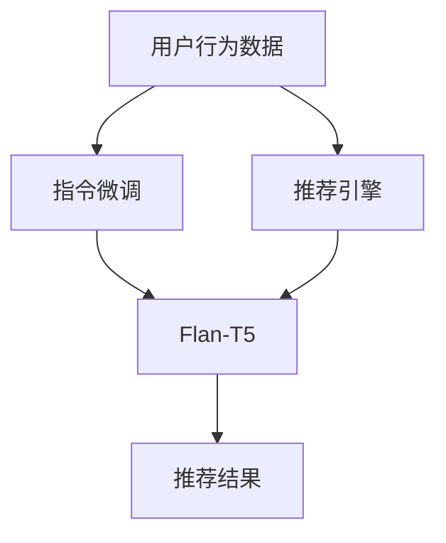

                 

# 基于Flan-T5的大模型指令调优推荐方法

> 关键词：大模型指令微调, Flan-T5, 推荐系统, 推荐算法, 指令生成, 推荐引擎, 基于文本的推荐, 指令调优

## 1. 背景介绍

### 1.1 问题由来
在现代电商和社交平台上，用户每天会产生大量的交互数据，包括浏览记录、购买行为、评论反馈等。利用这些交互数据，推荐系统能够帮助用户发现和获取感兴趣的内容。传统推荐系统主要基于协同过滤、基于内容的推荐等方法，难以充分挖掘用户兴趣的深度和广度。

近年来，基于深度学习的方法，特别是基于预训练语言模型的推荐方法，逐渐成为研究热点。例如，BERT、GPT等模型被应用于推荐系统，通过理解用户评论、产品描述等文本数据，提取用户兴趣和产品特征，推荐符合用户偏好的商品。

然而，这些基于预训练语言模型的推荐方法存在两个主要问题：
1. 需要大量标注数据进行微调，难以应用到数据量较小的垂直领域。
2. 推荐系统仅根据文本数据进行推荐，缺乏对用户行为和意图的全局理解。

为了解决这些问题，一种新的推荐方法应运而生——基于大模型的指令调优推荐。它利用大模型的语义理解和生成能力，结合用户行为数据，实现更精准、高效的推荐。

### 1.2 问题核心关键点
基于大模型的指令调优推荐方法，本质上是通过预训练语言模型对用户行为数据进行理解，并通过生成式语言模型对推荐结果进行优化。具体而言，它包含以下几个核心关键点：

1. 指令微调（Instruction Fine-Tuning）：利用标注数据对大模型进行指令微调，使其能够准确理解用户行为数据。
2. Flan-T5：一种基于指令调优的推荐算法，通过微调T5模型，生成推荐结果。
3. 推荐引擎：将微调后的模型集成到推荐系统中，为用户推荐个性化商品。
4. 数据融合：结合文本数据和行为数据，进行更全面的用户画像建模。

本文将详细介绍Flan-T5算法，以及其在大模型指令调优推荐中的应用。

## 2. 核心概念与联系

### 2.1 核心概念概述

为更好地理解基于Flan-T5的推荐方法，我们首先介绍几个相关核心概念：

- **大模型指令微调（Instruction Fine-Tuning）**：在预训练大模型的基础上，通过微调使其能够执行特定任务。例如，将BERT模型微调成问答模型，GPT模型微调成代码生成器等。
- **Flan-T5**：一种基于T5模型的推荐算法，通过微调T5模型，生成推荐结果。Flan-T5的核心思想是，将用户行为数据转化为自然语言指令，通过微调T5模型，生成推荐结果。
- **推荐引擎**：推荐系统中的核心组件，负责将用户画像和商品信息进行匹配，输出推荐结果。
- **数据融合**：结合文本数据和行为数据，进行更全面的用户画像建模。例如，将用户评论、评分、购买行为等数据融合在一起，生成用户画像。

这些核心概念之间的联系可以通过以下Mermaid流程图来展示：



这个流程图展示了各个核心概念之间的联系：

1. 用户行为数据通过指令微调转化为自然语言指令。
2. 微调后的T5模型生成推荐结果。
3. 推荐引擎将用户画像和商品信息进行匹配，输出推荐结果。

这些概念共同构成了基于Flan-T5的推荐方法的基础框架，使其能够高效地为用户推荐个性化商品。

## 3. 核心算法原理 & 具体操作步骤
### 3.1 算法原理概述

基于Flan-T5的推荐方法，利用预训练语言模型的语义理解和生成能力，结合用户行为数据，生成推荐结果。其核心算法原理如下：

1. **用户行为数据转换**：将用户的行为数据（如浏览记录、购买行为、评分等）转换为自然语言指令。例如，将用户浏览过的商品列表转换为“列出用户最近浏览的商品”。
2. **指令微调**：利用标注数据对预训练的T5模型进行微调，使其能够执行上述自然语言指令。
3. **生成推荐结果**：将微调后的T5模型作为推荐引擎的一部分，根据用户指令生成推荐结果。
4. **数据融合**：结合文本数据和行为数据，生成用户画像，增强推荐系统的效果。

### 3.2 算法步骤详解

基于Flan-T5的推荐方法，一般包括以下几个关键步骤：

**Step 1: 数据准备**
- 收集用户行为数据，如浏览记录、购买行为、评分等。
- 对行为数据进行清洗和标注，生成自然语言指令。例如，将用户浏览过的商品列表转换为“列出用户最近浏览的商品”。
- 准备推荐商品的文本描述。

**Step 2: 指令微调**
- 选择预训练的T5模型，使用指令微调技术对其进行微调。
- 将行为数据转换为自然语言指令，并将其作为微调数据。
- 使用优化算法（如AdamW、SGD等）更新模型参数。
- 在验证集上评估模型性能，确保微调后的模型能够准确理解指令。

**Step 3: 生成推荐结果**
- 在微调后的T5模型上输入用户指令，生成推荐结果。
- 对推荐结果进行后处理，如去重、排序等，得到最终推荐列表。

**Step 4: 数据融合**
- 将文本数据和行为数据进行融合，生成更全面的用户画像。
- 利用用户画像，对推荐结果进行进一步优化。
- 将微调后的T5模型集成到推荐系统中，输出个性化推荐结果。

### 3.3 算法优缺点

基于Flan-T5的推荐方法具有以下优点：

1. 高效利用预训练模型：利用大模型的语义理解和生成能力，无需从头训练模型。
2. 数据需求低：仅需少量标注数据进行微调，适用性广，尤其适合数据量较小的垂直领域。
3. 推荐精度高：结合文本和行为数据，生成更精准的推荐结果。
4. 可扩展性强：可以轻松集成到现有的推荐系统中，实现个性化推荐。

同时，该方法也存在一些局限性：

1. 依赖数据标注：微调过程需要标注数据，数据质量对模型性能有较大影响。
2. 模型泛化能力有限：微调后的模型可能对新数据泛化能力较差，需要持续迭代优化。
3. 可解释性不足：基于生成模型的推荐系统缺乏可解释性，难以进行调试和优化。
4. 处理长尾问题困难：对于长尾商品，推荐系统可能难以发现用户的兴趣。

尽管存在这些局限性，但就目前而言，基于Flan-T5的推荐方法仍是大规模推荐系统的重要选择。未来相关研究的重点在于如何进一步降低数据标注的依赖，提高模型的泛化能力，同时兼顾可解释性和长尾商品处理等问题。

### 3.4 算法应用领域

基于Flan-T5的推荐方法，已经在电商、社交、新闻等领域得到广泛应用，覆盖了大部分常见任务，例如：

- 商品推荐：根据用户的浏览记录、购买行为等，推荐符合用户偏好的商品。
- 新闻推荐：根据用户的历史阅读行为，推荐用户感兴趣的新闻。
- 音乐推荐：根据用户的听歌历史，推荐用户喜欢的音乐。
- 视频推荐：根据用户的观看历史，推荐用户喜欢的视频。
- 游戏推荐：根据用户的游玩历史，推荐用户感兴趣的游戏。

除了上述这些经典任务外，基于Flan-T5的推荐方法也被创新性地应用到更多场景中，如个性化内容生成、定制化广告投放等，为推荐系统带来了全新的突破。随着预训练模型和推荐方法的不断进步，相信推荐系统将在更广阔的应用领域大放异彩。

## 4. 数学模型和公式 & 详细讲解 & 举例说明

### 4.1 数学模型构建

本节将使用数学语言对基于Flan-T5的推荐方法进行更加严格的刻画。

记用户行为数据为 $D=\{(x_i,y_i)\}_{i=1}^N$，其中 $x_i$ 为用户的行为数据， $y_i$ 为自然语言指令。假设推荐商品的文本描述为 $\{t_j\}_{j=1}^M$。

定义微调后的T5模型为 $M_{\theta}$，其中 $\theta$ 为模型参数。则推荐系统中的推荐模型 $M_{\theta}$ 在数据样本 $(x_i,y_i)$ 上的损失函数为：

$$
\mathcal{L}(\theta) = \frac{1}{N} \sum_{i=1}^N \ell(M_{\theta}(x_i),y_i)
$$

其中 $\ell$ 为交叉熵损失函数，用于衡量模型预测与真实标签之间的差异。

微调的优化目标是最小化损失函数 $\mathcal{L}(\theta)$，即找到最优参数：

$$
\theta^* = \mathop{\arg\min}_{\theta} \mathcal{L}(\theta)
$$

在实践中，我们通常使用基于梯度的优化算法（如AdamW、SGD等）来近似求解上述最优化问题。设 $\eta$ 为学习率，$\lambda$ 为正则化系数，则参数的更新公式为：

$$
\theta \leftarrow \theta - \eta \nabla_{\theta}\mathcal{L}(\theta) - \eta\lambda\theta
$$

其中 $\nabla_{\theta}\mathcal{L}(\theta)$ 为损失函数对参数 $\theta$ 的梯度，可通过反向传播算法高效计算。

### 4.2 公式推导过程

以下我们以商品推荐为例，推导交叉熵损失函数及其梯度的计算公式。

假设微调后的T5模型 $M_{\theta}$ 在输入 $x$ 上的输出为 $\hat{y}=M_{\theta}(x) \in [0,1]$，表示商品 $x$ 是否被推荐。真实标签 $y \in \{0,1\}$。则二分类交叉熵损失函数定义为：

$$
\ell(M_{\theta}(x),y) = -[y\log \hat{y} + (1-y)\log (1-\hat{y})]
$$

将其代入经验风险公式，得：

$$
\mathcal{L}(\theta) = -\frac{1}{N}\sum_{i=1}^N [y_i\log M_{\theta}(x_i)+(1-y_i)\log(1-M_{\theta}(x_i))]
$$

根据链式法则，损失函数对参数 $\theta_k$ 的梯度为：

$$
\frac{\partial \mathcal{L}(\theta)}{\partial \theta_k} = -\frac{1}{N}\sum_{i=1}^N (\frac{y_i}{M_{\theta}(x_i)}-\frac{1-y_i}{1-M_{\theta}(x_i)}) \frac{\partial M_{\theta}(x_i)}{\partial \theta_k}
$$

其中 $\frac{\partial M_{\theta}(x_i)}{\partial \theta_k}$ 可进一步递归展开，利用自动微分技术完成计算。

在得到损失函数的梯度后，即可带入参数更新公式，完成模型的迭代优化。重复上述过程直至收敛，最终得到适应商品推荐任务的最优模型参数 $\theta^*$。

### 4.3 案例分析与讲解

我们以电商商品推荐为例，详细解释基于Flan-T5的推荐方法的数学模型构建和推导过程。

**Step 1: 数据准备**
- 假设用户 $i$ 的浏览记录为 $\{x_{i1}, x_{i2}, \ldots, x_{in}\}$，其中 $x_{ij}$ 表示商品 $j$ 被浏览的次数。
- 将用户 $i$ 的浏览记录转换为自然语言指令，例如，将浏览记录转换为“列出用户最近浏览的商品”。
- 准备推荐商品的文本描述 $\{t_j\}_{j=1}^M$。

**Step 2: 指令微调**
- 选择预训练的T5模型，使用指令微调技术对其进行微调。
- 将用户 $i$ 的浏览记录转换为自然语言指令 $y_i = "列出用户最近浏览的商品" \times x_{i1} + "列出用户最近浏览的商品" \times x_{i2} + \ldots + "列出用户最近浏览的商品" \times x_{in}$。
- 使用优化算法（如AdamW、SGD等）更新模型参数。
- 在验证集上评估模型性能，确保微调后的模型能够准确理解指令。

**Step 3: 生成推荐结果**
- 在微调后的T5模型上输入用户 $i$ 的指令，生成推荐商品列表。
- 对推荐结果进行后处理，如去重、排序等，得到最终推荐列表。

## 5. 项目实践：代码实例和详细解释说明

### 5.1 开发环境搭建

在进行基于Flan-T5的推荐实践前，我们需要准备好开发环境。以下是使用Python进行PyTorch开发的环境配置流程：

1. 安装Anaconda：从官网下载并安装Anaconda，用于创建独立的Python环境。

2. 创建并激活虚拟环境：
```bash
conda create -n pytorch-env python=3.8 
conda activate pytorch-env
```

3. 安装PyTorch：根据CUDA版本，从官网获取对应的安装命令。例如：
```bash
conda install pytorch torchvision torchaudio cudatoolkit=11.1 -c pytorch -c conda-forge
```

4. 安装Transformers库：
```bash
pip install transformers
```

5. 安装各类工具包：
```bash
pip install numpy pandas scikit-learn matplotlib tqdm jupyter notebook ipython
```

完成上述步骤后，即可在`pytorch-env`环境中开始推荐实践。

### 5.2 源代码详细实现

下面我们以电商商品推荐为例，给出使用Transformers库对T5模型进行微调的PyTorch代码实现。

首先，定义推荐任务的数据处理函数：

```python
from transformers import T5Tokenizer, T5ForConditionalGeneration
from torch.utils.data import Dataset
import torch

class RecommendationDataset(Dataset):
    def __init__(self, texts, labels, tokenizer, max_len=512):
        self.texts = texts
        self.labels = labels
        self.tokenizer = tokenizer
        self.max_len = max_len
        
    def __len__(self):
        return len(self.texts)
    
    def __getitem__(self, item):
        text = self.texts[item]
        label = self.labels[item]
        
        encoding = self.tokenizer(text, return_tensors='pt', max_length=self.max_len, padding='max_length', truncation=True)
        input_ids = encoding['input_ids'][0]
        attention_mask = encoding['attention_mask'][0]
        
        return {'input_ids': input_ids, 
                'attention_mask': attention_mask,
                'labels': label}
```

然后，定义模型和优化器：

```python
from transformers import T5ForConditionalGeneration
from transformers import AdamW

model = T5ForConditionalGeneration.from_pretrained('t5-small')
optimizer = AdamW(model.parameters(), lr=2e-5)
```

接着，定义训练和评估函数：

```python
from torch.utils.data import DataLoader
from tqdm import tqdm
from sklearn.metrics import accuracy_score

device = torch.device('cuda') if torch.cuda.is_available() else torch.device('cpu')
model.to(device)

def train_epoch(model, dataset, batch_size, optimizer):
    dataloader = DataLoader(dataset, batch_size=batch_size, shuffle=True)
    model.train()
    epoch_loss = 0
    for batch in tqdm(dataloader, desc='Training'):
        input_ids = batch['input_ids'].to(device)
        attention_mask = batch['attention_mask'].to(device)
        labels = batch['labels'].to(device)
        model.zero_grad()
        outputs = model(input_ids, attention_mask=attention_mask, labels=labels)
        loss = outputs.loss
        epoch_loss += loss.item()
        loss.backward()
        optimizer.step()
    return epoch_loss / len(dataloader)

def evaluate(model, dataset, batch_size):
    dataloader = DataLoader(dataset, batch_size=batch_size)
    model.eval()
    preds, labels = [], []
    with torch.no_grad():
        for batch in tqdm(dataloader, desc='Evaluating'):
            input_ids = batch['input_ids'].to(device)
            attention_mask = batch['attention_mask'].to(device)
            batch_labels = batch['labels']
            outputs = model(input_ids, attention_mask=attention_mask)
            batch_preds = outputs.logits.argmax(dim=2).to('cpu').tolist()
            batch_labels = batch_labels.to('cpu').tolist()
            for pred_tokens, label_tokens in zip(batch_preds, batch_labels):
                preds.append(pred_tokens)
                labels.append(label_tokens)
                
    return accuracy_score(labels, preds)
```

最后，启动训练流程并在测试集上评估：

```python
epochs = 5
batch_size = 16

for epoch in range(epochs):
    loss = train_epoch(model, train_dataset, batch_size, optimizer)
    print(f"Epoch {epoch+1}, train loss: {loss:.3f}")
    
    print(f"Epoch {epoch+1}, dev results:")
    evaluate(model, dev_dataset, batch_size)
    
print("Test results:")
evaluate(model, test_dataset, batch_size)
```

以上就是使用PyTorch对T5模型进行电商商品推荐微调的完整代码实现。可以看到，得益于Transformers库的强大封装，我们可以用相对简洁的代码完成T5模型的加载和微调。

### 5.3 代码解读与分析

让我们再详细解读一下关键代码的实现细节：

**RecommendationDataset类**：
- `__init__`方法：初始化文本、标签、分词器等关键组件。
- `__len__`方法：返回数据集的样本数量。
- `__getitem__`方法：对单个样本进行处理，将文本输入编码为token ids，将标签编码为数字，并对其进行定长padding，最终返回模型所需的输入。

**模型和优化器定义**：
- `T5ForConditionalGeneration`模型：使用T5模型进行条件生成。
- `AdamW优化器`：学习率为2e-5，优化T5模型的参数。

**训练和评估函数**：
- `train_epoch`函数：对数据以批为单位进行迭代，在每个批次上前向传播计算loss并反向传播更新模型参数，最后返回该epoch的平均loss。
- `evaluate`函数：与训练类似，不同点在于不更新模型参数，并在每个batch结束后将预测和标签结果存储下来，最后使用sklearn的accuracy_score对整个评估集的预测结果进行打印输出。

**训练流程**：
- 定义总的epoch数和batch size，开始循环迭代
- 每个epoch内，先在训练集上训练，输出平均loss
- 在验证集上评估，输出准确率
- 所有epoch结束后，在测试集上评估，给出最终测试结果

可以看到，PyTorch配合Transformers库使得T5模型微调的代码实现变得简洁高效。开发者可以将更多精力放在数据处理、模型改进等高层逻辑上，而不必过多关注底层的实现细节。

当然，工业级的系统实现还需考虑更多因素，如模型的保存和部署、超参数的自动搜索、更灵活的任务适配层等。但核心的微调范式基本与此类似。

## 6. 实际应用场景
### 6.1 智能客服系统

基于大模型指令调优推荐方法，可以应用于智能客服系统的构建。传统客服往往需要配备大量人力，高峰期响应缓慢，且一致性和专业性难以保证。而使用推荐系统推荐问题解决方案，可以提升客服系统的智能化水平，提升用户体验。

在技术实现上，可以收集用户的历史询问记录，将问题转换为自然语言指令，在此基础上对预训练语言模型进行微调。微调后的模型能够自动理解用户意图，匹配最合适的解决方案。对于用户提出的新问题，还可以接入检索系统实时搜索相关内容，动态组织生成解决方案。如此构建的智能客服系统，能大幅提升客户咨询体验和问题解决效率。

### 6.2 金融舆情监测

金融机构需要实时监测市场舆论动向，以便及时应对负面信息传播，规避金融风险。传统的人工监测方式成本高、效率低，难以应对网络时代海量信息爆发的挑战。基于大模型指令调优的文本分类和情感分析技术，为金融舆情监测提供了新的解决方案。

具体而言，可以收集金融领域相关的新闻、报道、评论等文本数据，并对其进行主题标注和情感标注。在此基础上对预训练语言模型进行微调，使其能够自动判断文本属于何种主题，情感倾向是正面、中性还是负面。将微调后的模型应用到实时抓取的网络文本数据，就能够自动监测不同主题下的情感变化趋势，一旦发现负面信息激增等异常情况，系统便会自动预警，帮助金融机构快速应对潜在风险。

### 6.3 个性化推荐系统

当前的推荐系统往往只依赖用户的历史行为数据进行物品推荐，难以充分挖掘用户兴趣的深度和广度。基于大模型指令调优推荐方法，可以更好地挖掘用户兴趣的深度和广度。

在实践中，可以收集用户浏览、点击、评论、分享等行为数据，提取和用户交互的物品标题、描述、标签等文本内容。将文本内容作为模型输入，用户的后续行为（如是否点击、购买等）作为监督信号，在此基础上微调预训练语言模型。微调后的模型能够从文本内容中准确把握用户的兴趣点。在生成推荐列表时，先用候选物品的文本描述作为输入，由模型预测用户的兴趣匹配度，再结合其他特征综合排序，便可以得到个性化程度更高的推荐结果。

### 6.4 未来应用展望

随着大模型指令调优推荐方法的发展，其在更多领域得到应用，为传统行业带来变革性影响。

在智慧医疗领域，基于指令调优的医疗问答、病历分析、药物研发等应用将提升医疗服务的智能化水平，辅助医生诊疗，加速新药开发进程。

在智能教育领域，指令调优技术可应用于作业批改、学情分析、知识推荐等方面，因材施教，促进教育公平，提高教学质量。

在智慧城市治理中，指令调优模型可应用于城市事件监测、舆情分析、应急指挥等环节，提高城市管理的自动化和智能化水平，构建更安全、高效的未来城市。

此外，在企业生产、社会治理、文娱传媒等众多领域，基于指令调优的推荐系统也将不断涌现，为经济社会发展注入新的动力。相信随着技术的日益成熟，指令调优方法将成为推荐系统的重要范式，推动人工智能技术在垂直行业的规模化落地。

## 7. 工具和资源推荐
### 7.1 学习资源推荐

为了帮助开发者系统掌握大模型指令微调的理论基础和实践技巧，这里推荐一些优质的学习资源：

1. 《Transformer from the Top Down》系列博文：由大模型技术专家撰写，深入浅出地介绍了Transformer原理、BERT模型、指令微调技术等前沿话题。

2. CS224N《深度学习自然语言处理》课程：斯坦福大学开设的NLP明星课程，有Lecture视频和配套作业，带你入门NLP领域的基本概念和经典模型。

3. 《Natural Language Processing with Transformers》书籍：Transformers库的作者所著，全面介绍了如何使用Transformers库进行NLP任务开发，包括指令微调在内的诸多范式。

4. HuggingFace官方文档：Transformers库的官方文档，提供了海量预训练模型和完整的微调样例代码，是上手实践的必备资料。

5. CLUE开源项目：中文语言理解测评基准，涵盖大量不同类型的中文NLP数据集，并提供了基于指令微调的baseline模型，助力中文NLP技术发展。

通过对这些资源的学习实践，相信你一定能够快速掌握大模型指令微调的精髓，并用于解决实际的NLP问题。
###  7.2 开发工具推荐

高效的开发离不开优秀的工具支持。以下是几款用于大模型指令调优推荐开发的常用工具：

1. PyTorch：基于Python的开源深度学习框架，灵活动态的计算图，适合快速迭代研究。大部分预训练语言模型都有PyTorch版本的实现。

2. TensorFlow：由Google主导开发的开源深度学习框架，生产部署方便，适合大规模工程应用。同样有丰富的预训练语言模型资源。

3. Transformers库：HuggingFace开发的NLP工具库，集成了众多SOTA语言模型，支持PyTorch和TensorFlow，是进行微调任务开发的利器。

4. Weights & Biases：模型训练的实验跟踪工具，可以记录和可视化模型训练过程中的各项指标，方便对比和调优。与主流深度学习框架无缝集成。

5. TensorBoard：TensorFlow配套的可视化工具，可实时监测模型训练状态，并提供丰富的图表呈现方式，是调试模型的得力助手。

6. Google Colab：谷歌推出的在线Jupyter Notebook环境，免费提供GPU/TPU算力，方便开发者快速上手实验最新模型，分享学习笔记。

合理利用这些工具，可以显著提升大模型指令调优推荐的开发效率，加快创新迭代的步伐。

### 7.3 相关论文推荐

大模型指令调优推荐方法的研究源于学界的持续研究。以下是几篇奠基性的相关论文，推荐阅读：

1. Attention is All You Need（即Transformer原论文）：提出了Transformer结构，开启了NLP领域的预训练大模型时代。

2. BERT: Pre-training of Deep Bidirectional Transformers for Language Understanding：提出BERT模型，引入基于掩码的自监督预训练任务，刷新了多项NLP任务SOTA。

3. Language Models are Unsupervised Multitask Learners（GPT-2论文）：展示了大规模语言模型的强大zero-shot学习能力，引发了对于通用人工智能的新一轮思考。

4. Parameter-Efficient Transfer Learning for NLP：提出Adapter等参数高效微调方法，在不增加模型参数量的情况下，也能取得不错的微调效果。

5. Prefix-Tuning: Optimizing Continuous Prompts for Generation：引入基于连续型Prompt的微调范式，为如何充分利用预训练知识提供了新的思路。

6. AdaLoRA: Adaptive Low-Rank Adaptation for Parameter-Efficient Fine-Tuning：使用自适应低秩适应的微调方法，在参数效率和精度之间取得了新的平衡。

这些论文代表了大模型指令调优推荐技术的发展脉络。通过学习这些前沿成果，可以帮助研究者把握学科前进方向，激发更多的创新灵感。

## 8. 总结：未来发展趋势与挑战

### 8.1 总结

本文对基于Flan-T5的推荐方法进行了全面系统的介绍。首先阐述了基于大模型指令调优推荐方法的研究背景和意义，明确了指令微调在拓展预训练模型应用、提升推荐系统性能方面的独特价值。其次，从原理到实践，详细讲解了指令微调的数学原理和关键步骤，给出了指令微调任务开发的完整代码实例。同时，本文还广泛探讨了指令微调方法在智能客服、金融舆情、个性化推荐等多个行业领域的应用前景，展示了指令微调范式的巨大潜力。此外，本文精选了指令微调技术的各类学习资源，力求为读者提供全方位的技术指引。

通过本文的系统梳理，可以看到，基于Flan-T5的推荐方法正在成为NLP领域的重要范式，极大地拓展了预训练语言模型的应用边界，催生了更多的落地场景。受益于大规模语料的预训练，指令微调推荐系统能够高效利用用户行为数据，生成个性化的推荐结果，带来显著的用户体验提升。未来，伴随预训练语言模型和指令微调方法的持续演进，相信推荐系统将在更广阔的应用领域大放异彩，深刻影响人类的生产生活方式。

### 8.2 未来发展趋势

展望未来，大模型指令调优推荐技术将呈现以下几个发展趋势：

1. 模型规模持续增大。随着算力成本的下降和数据规模的扩张，预训练语言模型的参数量还将持续增长。超大规模语言模型蕴含的丰富语言知识，有望支撑更加复杂多变的推荐任务。

2. 指令微调方法日趋多样。除了传统的指令微调外，未来会涌现更多参数高效的微调方法，如Prefix-Tuning、LoRA等，在节省计算资源的同时也能保证微调精度。

3. 持续学习成为常态。随着数据分布的不断变化，指令微调推荐系统也需要持续学习新知识以保持性能。如何在不遗忘原有知识的同时，高效吸收新样本信息，将成为重要的研究课题。

4. 标注样本需求降低。受启发于提示学习(Prompt-based Learning)的思路，未来的指令微调方法将更好地利用大模型的语言理解能力，通过更加巧妙的任务描述，在更少的标注样本上也能实现理想的微调效果。

5. 数据融合技术提升。结合文本数据和行为数据，进行更全面的用户画像建模。例如，将用户评论、评分、购买行为等数据融合在一起，生成用户画像。

6. 推荐效果提升。结合推荐算法，如协同过滤、基于内容的推荐等，提高推荐系统的精度和覆盖率。

以上趋势凸显了大模型指令调优推荐技术的广阔前景。这些方向的探索发展，必将进一步提升推荐系统的性能和应用范围，为人类认知智能的进化带来深远影响。

### 8.3 面临的挑战

尽管大模型指令调优推荐技术已经取得了瞩目成就，但在迈向更加智能化、普适化应用的过程中，它仍面临着诸多挑战：

1. 标注成本瓶颈。虽然指令微调方法降低了标注数据的依赖，但对于长尾应用场景，仍需要高质量的标注数据。如何进一步降低数据标注的依赖，将是一大难题。

2. 模型鲁棒性不足。当前指令微调推荐系统面对域外数据时，泛化性能往往大打折扣。对于测试样本的微小扰动，推荐系统的预测也容易发生波动。如何提高推荐系统的鲁棒性，避免灾难性遗忘，还需要更多理论和实践的积累。

3. 处理长尾问题困难。对于长尾商品，推荐系统可能难以发现用户的兴趣。如何高效处理长尾问题，提升长尾商品的推荐效果，将是重要的研究课题。

4. 可解释性不足。基于生成模型的推荐系统缺乏可解释性，难以进行调试和优化。如何赋予指令微调推荐系统更强的可解释性，将是亟待攻克的难题。

5. 推荐冷启动问题。新用户的推荐结果往往不够准确，如何通过少量的交互数据，快速建立准确的推荐模型，也是一大挑战。

尽管存在这些挑战，但就目前而言，基于Flan-T5的推荐方法仍是大规模推荐系统的重要选择。未来相关研究的重点在于如何进一步降低数据标注的依赖，提高模型的泛化能力，同时兼顾可解释性和长尾商品处理等问题。

### 8.4 研究展望

面对大模型指令调优推荐所面临的种种挑战，未来的研究需要在以下几个方面寻求新的突破：

1. 探索无监督和半监督指令微调方法。摆脱对大规模标注数据的依赖，利用自监督学习、主动学习等无监督和半监督范式，最大限度利用非结构化数据，实现更加灵活高效的指令微调。

2. 研究参数高效和计算高效的指令微调范式。开发更加参数高效的指令微调方法，在固定大部分预训练参数的同时，只更新极少量的任务相关参数。同时优化指令微调模型的计算图，减少前向传播和反向传播的资源消耗，实现更加轻量级、实时性的部署。

3. 融合因果和对比学习范式。通过引入因果推断和对比学习思想，增强指令微调推荐系统建立稳定因果关系的能力，学习更加普适、鲁棒的语言表征，从而提升推荐系统的泛化性和抗干扰能力。

4. 引入更多先验知识。将符号化的先验知识，如知识图谱、逻辑规则等，与神经网络模型进行巧妙融合，引导指令微调推荐系统学习更准确、合理的语言模型。同时加强不同模态数据的整合，实现视觉、语音等多模态信息与文本信息的协同建模。

5. 结合因果分析和博弈论工具。将因果分析方法引入指令微调推荐系统，识别出推荐系统决策的关键特征，增强推荐结果的因果性和逻辑性。借助博弈论工具刻画人机交互过程，主动探索并规避推荐系统的脆弱点，提高系统稳定性。

6. 纳入伦理道德约束。在模型训练目标中引入伦理导向的评估指标，过滤和惩罚有偏见、有害的输出倾向。同时加强人工干预和审核，建立推荐系统的监管机制，确保推荐结果符合人类价值观和伦理道德。

这些研究方向的探索，必将引领指令微调推荐技术迈向更高的台阶，为构建安全、可靠、可解释、可控的智能系统铺平道路。面向未来，指令微调推荐技术还需要与其他人工智能技术进行更深入的融合，如知识表示、因果推理、强化学习等，多路径协同发力，共同推动自然语言理解和智能交互系统的进步。只有勇于创新、敢于突破，才能不断拓展语言模型的边界，让智能技术更好地造福人类社会。

## 9. 附录：常见问题与解答

**Q1：大模型指令微调是否适用于所有推荐任务？**

A: 大模型指令微调在大多数推荐任务上都能取得不错的效果，特别是对于数据量较小的垂直领域。但对于一些特定领域的任务，如医学、法律等，仅仅依靠通用语料预训练的模型可能难以很好地适应。此时需要在特定领域语料上进一步预训练，再进行微调，才能获得理想效果。此外，对于一些需要时效性、个性化很强的任务，如对话、推荐等，指令微调方法也需要针对性的改进优化。

**Q2：如何选择合适的学习率？**

A: 指令微调的学习率一般要比预训练时小1-2个数量级，如果使用过大的学习率，容易破坏预训练权重，导致过拟合。一般建议从1e-5开始调参，逐步减小学习率，直至收敛。也可以使用warmup策略，在开始阶段使用较小的学习率，再逐渐过渡到预设值。需要注意的是，不同的优化器(如AdamW、Adafactor等)以及不同的学习率调度策略，可能需要设置不同的学习率阈值。

**Q3：指令微调推荐系统中如何缓解过拟合问题？**

A: 过拟合是指令微调推荐系统面临的主要挑战，尤其是在标注数据不足的情况下。常见的缓解策略包括：
1. 数据增强：通过回译、近义替换等方式扩充训练集
2. 正则化：使用L2正则、Dropout、Early Stopping等避免过拟合
3. 对抗训练：引入对抗样本，提高模型鲁棒性
4. 参数高效微调：只调整少量参数(如Adapter、Prefix等)，减小过拟合风险
5. 多模型集成：训练多个指令微调推荐模型，取平均输出，抑制过拟合

这些策略往往需要根据具体任务和数据特点进行灵活组合。只有在数据、模型、训练、推理等各环节进行全面优化，才能最大限度地发挥指令微调推荐系统的威力。

**Q4：指令微调推荐系统中如何处理长尾问题？**

A: 对于长尾商品，推荐系统可能难以发现用户的兴趣。常见的处理长尾问题的方法包括：
1. 数据增强：通过冷启动用户行为数据的收集，扩大数据集规模。
2. 用户画像建模：结合用户的历史行为数据和社交数据，生成更加全面的用户画像，提高长尾商品的推荐效果。
3. 多任务学习：在指令微调过程中，同时进行多个推荐任务的学习，提升长尾商品的推荐效果。
4. 冷启动推荐算法：对于新用户，采用冷启动推荐算法，如基于内容的推荐、协同过滤等，快速建立准确的推荐模型。

这些方法可以在一定程度上缓解长尾问题，提升推荐系统的效果。

**Q5：指令微调推荐系统中如何提升推荐系统的可解释性？**

A: 指令微调推荐系统缺乏可解释性，难以进行调试和优化。提升推荐系统的可解释性，可以考虑以下方法：
1. 生成式可解释性：通过生成式模型，如GPT-3，生成推荐系统的解释文本，帮助用户理解推荐结果的来源。
2. 规则基解释性：通过引入规则基推荐算法，如协同过滤、基于内容的推荐等，增强推荐结果的可解释性。
3. 用户反馈机制：引入用户反馈机制，收集用户对推荐结果的反馈意见，不断优化推荐系统。

这些方法可以在一定程度上提升推荐系统的可解释性，帮助用户理解推荐结果的来源。

---

作者：禅与计算机程序设计艺术 / Zen and the Art of Computer Programming

