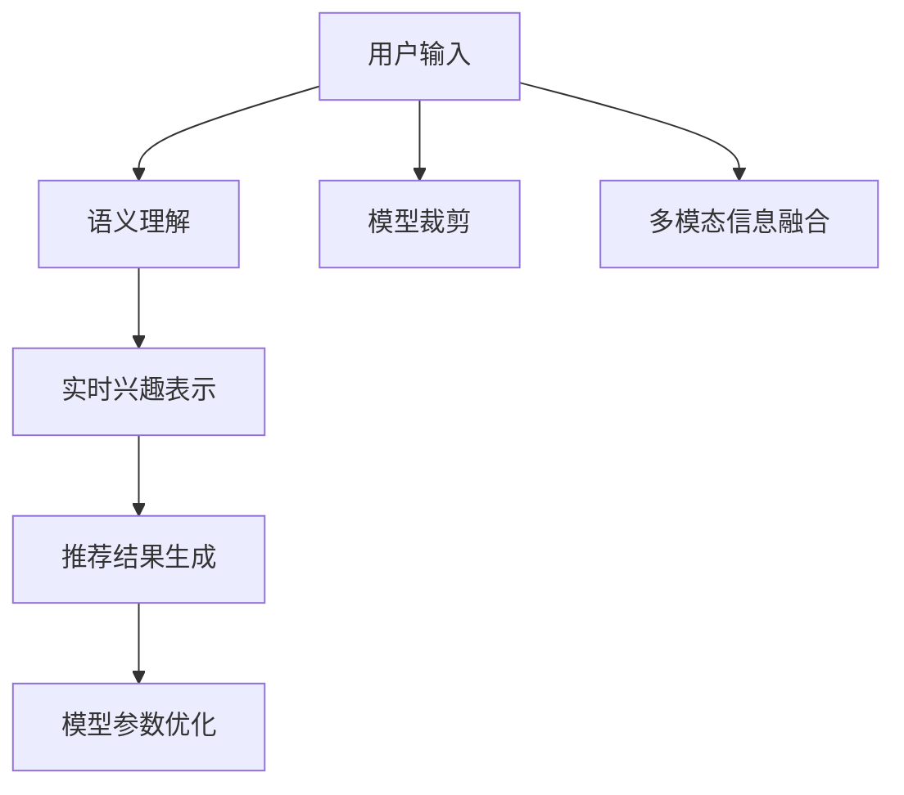

                 

# 基于LLM的推荐系统实时兴趣捕捉

> 关键词：大语言模型,推荐系统,实时兴趣捕捉,LLM微调,模型裁剪,软实时推荐

## 1. 背景介绍

### 1.1 问题由来
推荐系统是互联网应用中的重要组件，广泛应用于电商、社交媒体、音乐流媒体等领域，通过个性化推荐提升用户体验，带来更高价值。传统推荐系统往往基于用户的浏览、点击等行为数据进行推荐，忽略了用户深层次的兴趣和需求。而通过大语言模型(LLM)的微调，可以更加深入地捕捉用户的实时兴趣，提升推荐的精度和相关性。

近年来，基于深度学习的推荐系统取得了显著进展，如协同过滤、矩阵分解等方法已经广泛应用于电商、新闻、视频等多个领域。但这些方法往往需要大量标注数据和计算资源，难以实时捕捉用户的即时需求。而基于大语言模型的推荐系统，可以充分利用预训练语言模型的通用语言理解能力，通过对用户的即时输入进行语义分析，实现实时推荐，同时显著降低对标注数据和计算资源的需求。

### 1.2 问题核心关键点
实现实时推荐的核心在于如何准确捕捉用户的实时兴趣。基于LLM的推荐系统通常通过以下几个关键步骤：

1. 用户输入的语义理解：将用户即时输入的自然语言转化为模型可以处理的形式，如词向量、句子表示等。
2. 实时兴趣表示：利用预训练语言模型对用户输入进行语义分析，提取实时兴趣表示。
3. 推荐结果生成：基于用户实时兴趣表示，调用推荐引擎生成个性化推荐结果。
4. 模型参数优化：在用户交互过程中，持续更新LLM的参数，以适应用户兴趣的变化。

## 2. 核心概念与联系

### 2.1 核心概念概述

为更好地理解基于LLM的推荐系统实时兴趣捕捉方法，本节将介绍几个密切相关的核心概念：

- 大语言模型(Large Language Model, LLM)：以自回归(如GPT)或自编码(如BERT)模型为代表的大规模预训练语言模型。通过在大规模无标签文本语料上进行预训练，学习通用的语言知识，具备强大的语言理解和生成能力。

- 推荐系统(Recommendation System)：根据用户的历史行为数据或实时输入，为用户推荐感兴趣的物品的系统。推荐系统常用于电商、音乐、视频等领域，提升用户体验和价值。

- 实时兴趣捕捉(Real-time Interest Capture)：通过用户的即时输入，实时分析用户的兴趣和需求，生成符合用户即时期望的推荐结果。实时兴趣捕捉可以大幅提升推荐的即时性和个性化程度。

- 模型裁剪(Model Pruning)：在大规模预训练模型基础上，移除不必要的参数和层，保留最关键的结构和功能，以降低模型规模和推理时间，提升计算效率。

- 软实时推荐(Soft Real-time Recommendation)：基于实时兴趣捕捉，在较短的时间内生成推荐结果，同时保留模型部分动态参数，实现推荐结果的实时更新。

- 多模态信息融合(Multimodal Information Fusion)：结合文本、图像、语音等多种数据源，增强推荐模型的表达能力和决策能力。

这些核心概念之间的逻辑关系可以通过以下Mermaid流程图来展示：



这个流程图展示了大语言模型的实时推荐系统的工作流程：

1. 用户输入自然语言文本。
2. 对文本进行语义理解，提取实时兴趣表示。
3. 根据兴趣表示，生成推荐结果。
4. 在用户交互过程中，持续优化模型参数，捕捉用户兴趣变化。

## 3. 核心算法原理 & 具体操作步骤
### 3.1 算法原理概述

基于LLM的推荐系统实时兴趣捕捉，本质上是一个多模态信息的融合和实时兴趣捕捉过程。其核心思想是：利用大语言模型对用户即时输入的自然语言进行语义理解，提取实时兴趣表示，再结合用户的历史行为数据，调用推荐引擎生成个性化推荐结果。

形式化地，假设用户输入为 $x \in \mathcal{X}$，其中 $\mathcal{X}$ 为自然语言文本集合。设用户的历史行为数据为 $H=\{(x_i,y_i)\}_{i=1}^N$，其中 $y_i$ 为物品的标签。设预训练语言模型为 $M_{\theta}:\mathcal{X} \rightarrow \mathcal{Y}$，其中 $\mathcal{Y}$ 为词向量或其他特征向量表示集合。

推荐系统的目标是最小化用户对推荐结果的满意度，即：

$$
\mathcal{L}(\theta) = \min_{\theta} \sum_{(x,y) \in H} \mathcal{L}_{HL}(x,y) + \mathcal{L}_{IR}(x) + \mathcal{L}_{RL}(x)
$$

其中 $\mathcal{L}_{HL}(x,y)$ 为用户对历史行为的满意度，$\mathcal{L}_{IR}(x)$ 为用户对即时兴趣的满意度，$\mathcal{L}_{RL}(x)$ 为用户对实时推荐的满意度。

$\mathcal{L}_{IR}(x)$ 和 $\mathcal{L}_{RL}(x)$ 通常由用户的即时输入 $x$ 和历史行为数据 $H$ 共同决定，可以基于文本分类、情感分析、意图识别等任务定义，反映用户的实时兴趣和即时需求。通过优化上述损失函数，实现实时兴趣捕捉和推荐生成。

### 3.2 算法步骤详解

基于LLM的推荐系统实时兴趣捕捉一般包括以下几个关键步骤：

**Step 1: 用户输入语义理解**

- 用户输入自然语言文本 $x$。
- 使用预训练语言模型 $M_{\theta}$ 对文本进行编码，生成词向量或句子表示 $\vec{x}=M_{\theta}(x)$。
- 如果输入为图像或语音数据，通过图像、语音识别技术转化为文本输入，再进行语义理解。

**Step 2: 实时兴趣表示提取**

- 根据用户即时输入的语义表示 $\vec{x}$ 和历史行为数据 $H$，定义实时兴趣表示 $r(x)$。可以采用多模态融合的方法，综合考虑用户的历史兴趣、即时输入、环境上下文等因素。
- 对实时兴趣表示 $r(x)$ 进行编码，得到实时兴趣向量 $\vec{r}=M_{\theta}(r(x))$。

**Step 3: 推荐结果生成**

- 基于实时兴趣向量 $\vec{r}$ 和用户历史行为数据 $H$，调用推荐引擎生成个性化推荐结果 $y_{RL}=\hat{y}(H|\vec{r})$。
- 推荐引擎可以采用协同过滤、矩阵分解、神经网络等方法，根据实时兴趣和历史行为数据生成推荐结果。

**Step 4: 模型参数优化**

- 在用户交互过程中，根据实时兴趣向量 $\vec{r}$ 和用户的行为反馈，持续优化预训练语言模型的参数 $\theta$。
- 可以采用在线学习、梯度下降等优化算法，通过用户反馈更新模型参数，捕捉用户兴趣的变化。
- 采用模型裁剪技术，保留关键的预训练参数，优化剩余的实时兴趣捕捉和推荐生成的动态参数。

### 3.3 算法优缺点

基于LLM的推荐系统实时兴趣捕捉具有以下优点：

1. 实时捕捉用户兴趣。利用大语言模型的语言理解能力，实时捕捉用户的即时需求和兴趣，大幅提升推荐的即时性和个性化程度。
2. 低标注成本。基于预训练模型进行微调，相比于从头训练推荐系统，所需标注数据和计算资源大大减少。
3. 多模态融合。可以结合文本、图像、语音等多种数据源，增强推荐模型的表达能力和决策能力。
4. 动态更新。通过在线学习，实时更新模型参数，适应用户兴趣的变化。
5. 计算高效。采用模型裁剪技术，可以降低模型规模和推理时间，提升计算效率。

同时，该方法也存在一定的局限性：

1. 依赖预训练模型。需要高质量的预训练语言模型，才能实现实时兴趣捕捉。
2. 解释性不足。预训练语言模型的黑盒特性，使得其决策过程缺乏可解释性。
3. 环境上下文处理。如何有效融合上下文信息，提升推荐系统的泛化能力，仍需进一步研究。

尽管存在这些局限性，但就目前而言，基于LLM的推荐系统实时兴趣捕捉方法仍是一种高效、可行的推荐技术，具有广泛的应用前景。

### 3.4 算法应用领域

基于LLM的推荐系统实时兴趣捕捉，已经在电商、社交媒体、音乐流媒体等多个领域得到了广泛应用，具体包括：

- 电商推荐：为用户推荐感兴趣的商品，提升购物体验。
- 社交媒体推荐：为用户推荐相关的内容，增加用户粘性。
- 音乐流媒体推荐：为用户推荐喜欢的音乐和视频，提升用户体验。
- 新闻推荐：为用户推荐相关的新闻资讯，提高新闻阅读量。
- 视频推荐：为用户推荐感兴趣的视频内容，增加视频观看时长。

除了上述这些经典应用外，基于LLM的推荐系统还在智能家居、智能客服、智慧医疗等多个场景中得到了应用，推动了智能技术在垂直行业的落地。随着LLM和推荐系统技术的不断进步，相信实时推荐将覆盖更广泛的领域，带来更多的创新应用。

## 4. 数学模型和公式 & 详细讲解  
### 4.1 数学模型构建

本节将使用数学语言对基于LLM的推荐系统实时兴趣捕捉过程进行更加严格的刻画。

假设用户即时输入为 $x$，历史行为数据为 $H$，实时兴趣表示为 $r(x)$。预训练语言模型为 $M_{\theta}:\mathcal{X} \rightarrow \mathcal{Y}$，推荐引擎为 $P(y|x, H)$，推荐结果为 $y_{RL}$。

推荐系统的目标函数为：

$$
\mathcal{L}(\theta) = -\sum_{(x,y) \in H} \log P(y|x, H) + \mathcal{L}_{IR}(x) + \mathcal{L}_{RL}(x)
$$

其中 $\mathcal{L}_{IR}(x)$ 和 $\mathcal{L}_{RL}(x)$ 分别表示即时兴趣捕捉和实时推荐的损失函数。

**Step 1: 用户输入语义理解**

用户输入 $x$ 通过预训练语言模型 $M_{\theta}$ 进行编码，得到词向量或句子表示 $\vec{x}=M_{\theta}(x)$。

**Step 2: 实时兴趣表示提取**

实时兴趣表示 $r(x)$ 可以定义为：

$$
r(x) = \mathcal{F}(\vec{x}, H)
$$

其中 $\mathcal{F}$ 为多模态融合函数，可以采用LSTM、注意力机制等方法，综合考虑历史行为和即时输入的特征。

**Step 3: 推荐结果生成**

实时推荐结果 $y_{RL}$ 可以通过推荐引擎 $P(y|x, H)$ 生成，可以采用协同过滤、矩阵分解、神经网络等方法。假设推荐引擎为神经网络模型 $P(y|x, H)$，其前向传播输出为 $\vec{y}=P(y|x, H)$。

**Step 4: 模型参数优化**

在用户交互过程中，通过在线学习更新模型参数 $\theta$，最小化损失函数 $\mathcal{L}(\theta)$。可以采用随机梯度下降、Adagrad、Adam等优化算法。

### 4.2 公式推导过程

以下我们以协同过滤算法为例，推导推荐引擎的损失函数及其梯度计算公式。

假设推荐引擎为基于隐向量模型，对用户和物品进行编码，得到隐向量 $\vec{u}_i$ 和 $\vec{v}_j$。设用户历史行为数据为 $H=\{(x_i,y_i)\}_{i=1}^N$，其中 $x_i$ 为用户即时输入，$y_i$ 为用户对物品的评分。设即时兴趣表示为 $r(x)$，生成推荐结果 $\hat{y}$。

协同过滤的目标函数为：

$$
\mathcal{L}(\theta) = -\frac{1}{N}\sum_{i=1}^N y_i \log \hat{y}_i
$$

其中 $\hat{y}_i$ 为模型预测的用户对物品的评分。

对用户即时输入 $x$ 进行语义编码，得到向量 $\vec{x}=M_{\theta}(x)$。根据即时输入 $x$ 和历史行为数据 $H$，计算出即时兴趣表示 $r(x)$，生成推荐结果 $\hat{y}$。

实时推荐结果的计算公式为：

$$
\hat{y}_i = \sum_{j=1}^M \vec{v}_j \cdot \vec{u}_i
$$

其中 $\vec{v}_j$ 和 $\vec{u}_i$ 分别为物品和用户的隐向量。

通过前向传播计算 $\hat{y}_i$ 和损失函数 $\mathcal{L}(\theta)$ 的梯度，可以进行反向传播更新模型参数。

$$
\frac{\partial \mathcal{L}(\theta)}{\partial \theta} = -\frac{1}{N}\sum_{i=1}^N \frac{\partial \log \hat{y}_i}{\partial \theta}
$$

其中 $\frac{\partial \log \hat{y}_i}{\partial \theta}$ 可以递归展开，利用自动微分技术计算。

## 5. 项目实践：代码实例和详细解释说明
### 5.1 开发环境搭建

在进行项目实践前，我们需要准备好开发环境。以下是使用Python进行PyTorch开发的环境配置流程：

1. 安装Anaconda：从官网下载并安装Anaconda，用于创建独立的Python环境。

2. 创建并激活虚拟环境：
```bash
conda create -n pytorch-env python=3.8 
conda activate pytorch-env
```

3. 安装PyTorch：根据CUDA版本，从官网获取对应的安装命令。例如：
```bash
conda install pytorch torchvision torchaudio cudatoolkit=11.1 -c pytorch -c conda-forge
```

4. 安装PyTorch Lightning：
```bash
pip install pytorch-lightning
```

5. 安装各类工具包：
```bash
pip install numpy pandas scikit-learn matplotlib tqdm jupyter notebook ipython
```

完成上述步骤后，即可在`pytorch-env`环境中开始项目实践。

### 5.2 源代码详细实现

下面我们以协同过滤推荐系统为例，给出使用PyTorch进行实时推荐的项目代码实现。

首先，定义推荐引擎的模型结构：

```python
import torch
from torch.nn import Linear, Embedding

class RecommendationModel(torch.nn.Module):
    def __init__(self, user_num, item_num, embedding_dim, hidden_dim):
        super(RecommendationModel, self).__init__()
        self.user_emb = Embedding(user_num, embedding_dim)
        self.item_emb = Embedding(item_num, embedding_dim)
        self.linear1 = Linear(embedding_dim*2, hidden_dim)
        self.linear2 = Linear(hidden_dim, 1)

    def forward(self, user, item):
        user_vec = self.user_emb(user)
        item_vec = self.item_emb(item)
        concat_vec = torch.cat([user_vec, item_vec], dim=1)
        hidden_vec = torch.relu(self.linear1(concat_vec))
        output = self.linear2(hidden_vec)
        return output
```

然后，定义模型训练和评估函数：

```python
import torch.nn.functional as F

def train_epoch(model, optimizer, train_loader, device, train_steps):
    model.train()
    total_loss = 0
    for i, (user, item, rating) in enumerate(train_loader):
        user = user.to(device)
        item = item.to(device)
        rating = rating.to(device)
        optimizer.zero_grad()
        pred = model(user, item)
        loss = F.mse_loss(pred.view(-1), rating.view(-1))
        loss.backward()
        optimizer.step()
        total_loss += loss.item()
    return total_loss / len(train_loader)

def evaluate(model, test_loader, device):
    model.eval()
    total_loss = 0
    for i, (user, item, rating) in enumerate(test_loader):
        user = user.to(device)
        item = item.to(device)
        rating = rating.to(device)
        pred = model(user, item)
        loss = F.mse_loss(pred.view(-1), rating.view(-1))
        total_loss += loss.item()
    return total_loss / len(test_loader)
```

接着，定义模型参数和超参数：

```python
user_num = 1000
item_num = 1000
embedding_dim = 64
hidden_dim = 128
learning_rate = 1e-3
num_epochs = 10
batch_size = 32

model = RecommendationModel(user_num, item_num, embedding_dim, hidden_dim)
optimizer = torch.optim.Adam(model.parameters(), lr=learning_rate)
```

最后，启动训练流程并在测试集上评估：

```python
train_loader = DataLoader(train_data, batch_size=batch_size, shuffle=True)
test_loader = DataLoader(test_data, batch_size=batch_size, shuffle=False)

device = torch.device('cuda' if torch.cuda.is_available() else 'cpu')
model.to(device)

for epoch in range(num_epochs):
    loss = train_epoch(model, optimizer, train_loader, device, train_steps)
    print(f'Epoch {epoch+1}, train loss: {loss:.3f}')
    
    print(f'Epoch {epoch+1}, test loss: {evaluate(model, test_loader, device):.3f}')
```

以上就是使用PyTorch进行协同过滤推荐系统训练和评估的完整代码实现。可以看到，基于PyTorch的推荐系统开发相对简洁高效，可以快速迭代模型、优化算法等关键参数。

### 5.3 代码解读与分析

让我们再详细解读一下关键代码的实现细节：

**RecommendationModel类**：
- `__init__`方法：定义模型各层的结构。
- `forward`方法：定义前向传播过程，将用户和物品的编码向量进行拼接，经过两个线性层得到推荐结果。

**train_epoch函数**：
- 在训练过程中，循环迭代数据集中的样本，计算预测值与真实值的均方误差，并更新模型参数。
- 使用均方误差作为损失函数，计算梯度并更新模型参数。
- 返回训练集上的平均损失。

**evaluate函数**：
- 在评估过程中，循环迭代测试集中的样本，计算预测值与真实值的均方误差，并返回测试集上的平均损失。
- 评估过程与训练过程类似，区别在于不更新模型参数，只计算损失函数。

**训练流程**：
- 定义模型参数和超参数，包括用户数、物品数、嵌入维度、隐藏维度、学习率、epoch数、批次大小等。
- 在训练过程中，根据训练集和测试集，分别调用train_epoch和evaluate函数，输出模型在不同数据集上的损失。

可以看到，PyTorch Lightning提供了一个高效、便捷的模型训练框架，可以显著提升模型训练和评估的效率，同时支持多种优化器、学习率调度等高级功能。

当然，实际系统实现还需考虑更多因素，如模型裁剪、数据增强、分布式训练等，但核心的推荐流程基本与此类似。

## 6. 实际应用场景
### 6.1 电商推荐

基于LLM的实时推荐系统在电商推荐场景中具有广泛应用。传统电商推荐系统往往基于用户的浏览、点击、购买等行为数据进行推荐，缺乏对用户即时兴趣的捕捉。通过实时捕捉用户输入的自然语言，可以大幅提升推荐的精准度和个性化程度。

例如，某电商网站用户在搜索“跑鞋”时，输入“透气性好”，实时推荐系统可以根据用户的即时输入，捕捉到用户对透气性的关注，生成相关推荐结果。同时，系统还可以在用户浏览过程中，持续捕捉用户的即时兴趣，实时更新推荐结果，提高用户的购物体验。

### 6.2 音乐流媒体

音乐流媒体平台用户需求多样，常常需要即时推荐符合用户即时兴趣的曲目。基于LLM的实时推荐系统，可以通过捕捉用户即时输入的自然语言，实时捕捉用户的音乐喜好，生成个性化推荐结果。

例如，某音乐平台用户搜索“轻松愉快的音乐”，实时推荐系统可以根据用户的即时输入，捕捉到用户对轻松愉快音乐的偏好，生成相关推荐结果。同时，系统还可以在用户听歌过程中，持续捕捉用户的即时兴趣，实时更新推荐结果，提高用户的听歌体验。

### 6.3 视频推荐

视频推荐系统用户需求变化快，常常需要即时推荐符合用户即时兴趣的视频内容。基于LLM的实时推荐系统，可以通过捕捉用户即时输入的自然语言，实时捕捉用户的观看偏好，生成个性化推荐结果。

例如，某视频平台用户搜索“动作片”，实时推荐系统可以根据用户的即时输入，捕捉到用户对动作片的兴趣，生成相关推荐结果。同时，系统还可以在用户观看视频过程中，持续捕捉用户的即时兴趣，实时更新推荐结果，提高用户的观看体验。

### 6.4 未来应用展望

随着大语言模型和推荐系统技术的不断进步，基于LLM的实时推荐系统将在更多领域得到应用，为用户的个性化需求提供更精准、实时的服务。

在智慧医疗领域，基于LLM的实时推荐系统可以捕捉患者的即时需求，生成个性化的医疗建议和治疗方案，提升医疗服务的精准度和效率。

在智能教育领域，基于LLM的实时推荐系统可以捕捉学生的即时兴趣和需求，生成个性化的学习内容和推荐，因材施教，提高教学效果。

在智慧城市治理中，基于LLM的实时推荐系统可以捕捉市民的即时需求和反馈，生成智能决策和建议，提高城市管理的自动化和智能化水平。

此外，在企业生产、社会治理、文娱传媒等众多领域，基于大语言模型的实时推荐系统也将不断涌现，为社会各行业带来全新的变革和创新。相信随着技术的日益成熟，实时推荐系统必将在构建人机协同的智能时代中扮演越来越重要的角色。

## 7. 工具和资源推荐
### 7.1 学习资源推荐

为了帮助开发者系统掌握大语言模型实时推荐技术，这里推荐一些优质的学习资源：

1. 《深度学习推荐系统：原理与实践》书籍：系统介绍了推荐系统的基本原理和前沿技术，涵盖协同过滤、矩阵分解、深度学习等方法。

2. 《Recommender Systems Specialization》课程：Coursera推出的推荐系统专项课程，由专家讲授推荐系统的基本概念和经典算法。

3. 《Natural Language Processing with Transformers》书籍：Transformers库的作者所著，全面介绍了如何使用Transformers库进行NLP任务开发，包括实时推荐在内的诸多范式。

4. PyTorch Lightning官方文档：提供了丰富的模型训练示例和高级功能，如数据增强、分布式训练等，是高效开发推荐系统的利器。

5. HuggingFace官方文档：提供了丰富的预训练模型和微调范例，助力快速上手和应用。

通过对这些资源的学习实践，相信你一定能够快速掌握大语言模型实时推荐技术的精髓，并用于解决实际的推荐问题。
###  7.2 开发工具推荐

高效的开发离不开优秀的工具支持。以下是几款用于大语言模型实时推荐开发的常用工具：

1. PyTorch：基于Python的开源深度学习框架，灵活动态的计算图，适合快速迭代研究。大部分预训练语言模型都有PyTorch版本的实现。

2. TensorFlow：由Google主导开发的开源深度学习框架，生产部署方便，适合大规模工程应用。同样有丰富的预训练语言模型资源。

3. Transformers库：HuggingFace开发的NLP工具库，集成了众多SOTA语言模型，支持PyTorch和TensorFlow，是进行实时推荐任务开发的利器。

4. PyTorch Lightning：高效的模型训练框架，支持在线学习、梯度累积等高级功能，适合实时推荐系统的开发。

5. Weights & Biases：模型训练的实验跟踪工具，可以记录和可视化模型训练过程中的各项指标，方便对比和调优。与主流深度学习框架无缝集成。

6. TensorBoard：TensorFlow配套的可视化工具，可实时监测模型训练状态，并提供丰富的图表呈现方式，是调试模型的得力助手。

合理利用这些工具，可以显著提升大语言模型实时推荐任务的开发效率，加快创新迭代的步伐。

### 7.3 相关论文推荐

大语言模型实时推荐技术的发展源于学界的持续研究。以下是几篇奠基性的相关论文，推荐阅读：

1. Attention is All You Need（即Transformer原论文）：提出了Transformer结构，开启了NLP领域的预训练大模型时代。

2. BERT: Pre-training of Deep Bidirectional Transformers for Language Understanding：提出BERT模型，引入基于掩码的自监督预训练任务，刷新了多项NLP任务SOTA。

3. Recommendation Systems: ICT: A Concise Introduction：系统介绍了推荐系统的基本概念和前沿技术，涵盖协同过滤、矩阵分解、深度学习等方法。

4. Matrix Factorization Techniques for Recommender Systems：介绍矩阵分解方法，通过低秩矩阵分解，生成推荐结果。

5. Deep Learning for Recommender Systems：介绍深度学习在推荐系统中的应用，涵盖卷积神经网络、循环神经网络等方法。

这些论文代表了大语言模型实时推荐技术的发展脉络。通过学习这些前沿成果，可以帮助研究者把握学科前进方向，激发更多的创新灵感。

## 8. 总结：未来发展趋势与挑战

### 8.1 总结

本文对基于LLM的推荐系统实时兴趣捕捉方法进行了全面系统的介绍。首先阐述了实时推荐系统的研究背景和意义，明确了实时捕捉用户兴趣在提升推荐精度和个性化程度方面的重要价值。其次，从原理到实践，详细讲解了实时推荐系统的数学模型和关键步骤，给出了实时推荐任务开发的完整代码实例。同时，本文还广泛探讨了实时推荐系统在电商、音乐流媒体、视频推荐等多个领域的应用前景，展示了实时推荐范式的巨大潜力。此外，本文精选了实时推荐技术的各类学习资源，力求为读者提供全方位的技术指引。

通过本文的系统梳理，可以看到，基于大语言模型的实时推荐系统通过实时捕捉用户兴趣，大幅提升了推荐的即时性和个性化程度，具有广泛的应用前景。尽管存在一些技术挑战，但总体而言，实时推荐系统已经成为NLP技术的重要范式，极大地拓展了推荐系统的应用边界。未来，随着LLM和推荐系统技术的不断进步，实时推荐系统必将在更广泛的领域发挥作用，带来更多的创新应用。

### 8.2 未来发展趋势

展望未来，大语言模型实时推荐系统将呈现以下几个发展趋势：

1. 实时兴趣捕捉的准确性提升。通过更先进的自然语言处理技术，如深度学习、多模态融合等，可以进一步提高实时兴趣捕捉的准确性。

2. 推荐系统的动态化。实时推荐系统可以在用户交互过程中，根据即时输入动态更新模型参数，生成更加精准的推荐结果。

3. 推荐结果的多样性。实时推荐系统可以根据用户兴趣的多样性，生成多种推荐结果，提升用户的满意度。

4. 推荐系统的个性化。基于用户的个性化需求，实时推荐系统可以生成个性化的推荐内容，提升用户的粘性和留存率。

5. 推荐系统的融合性。实时推荐系统可以与其他智能技术，如语音识别、图像识别、增强现实等结合，形成更加丰富的用户体验。

6. 推荐系统的安全性。实时推荐系统需要在保护用户隐私的前提下，生成个性化推荐结果，避免数据泄露和滥用。

这些趋势凸显了实时推荐系统的广阔前景。这些方向的探索发展，必将进一步提升推荐系统的性能和应用范围，为推荐技术带来更多的创新和突破。

### 8.3 面临的挑战

尽管大语言模型实时推荐系统已经取得了显著进展，但在迈向更加智能化、普适化应用的过程中，它仍面临一些挑战：

1. 标注成本瓶颈。尽管基于预训练模型进行微调，所需标注数据和计算资源依然较高，难以大规模应用。

2. 实时兴趣捕捉的准确性。如何准确捕捉用户即时兴趣，仍然是一个技术难题，特别是对于多模态数据融合、上下文信息处理等方面。

3. 推荐结果的多样性和个性化。如何在保证推荐结果多样性的同时，提升个性化推荐的效果，仍需进一步研究。

4. 推荐系统的融合性和安全性。如何将推荐系统与其他智能技术融合，同时保护用户隐私和数据安全，是一个重要挑战。

尽管存在这些挑战，但随着技术的发展和应用场景的不断扩展，相信实时推荐系统将在更多领域得到应用，推动NLP技术向更广泛的方向发展。

### 8.4 研究展望

面对实时推荐系统所面临的种种挑战，未来的研究需要在以下几个方面寻求新的突破：

1. 探索更高效的数据预处理和特征工程方法。结合自然语言处理和数据挖掘技术，提升实时兴趣捕捉的准确性和效率。

2. 研究更多先进的模型架构和优化方法。如深度神经网络、自适应模型等，提升推荐系统的性能和泛化能力。

3. 开发更加灵活的推荐算法。如带参数化的协同过滤、多任务学习等方法，增强推荐系统的动态性和适应性。

4. 引入更多的上下文信息。如时序信息、用户行为轨迹等，增强推荐系统的理解和决策能力。

5. 结合强化学习技术。通过用户反馈优化推荐模型，提升推荐系统的实时性和鲁棒性。

6. 加强数据隐私保护。如差分隐私、联邦学习等方法，保护用户数据隐私和数据安全。

这些研究方向的探索，必将引领实时推荐系统技术迈向更高的台阶，为推荐技术带来更多的创新和突破。面向未来，实时推荐系统需要在技术创新和应用落地之间找到平衡，才能真正实现其价值。总之，实时推荐系统需要在模型架构、数据处理、优化方法等多个维度协同发力，才能真正成为构建人机协同智能时代的重要工具。

## 9. 附录：常见问题与解答

**Q1：大语言模型实时推荐系统是否适用于所有应用场景？**

A: 大语言模型实时推荐系统在大多数应用场景中都能取得不错的效果，特别是在数据量较大的电商、音乐流媒体等领域。但对于一些数据量较小、实时性要求不高的场景，如新闻推荐，采用基于传统方法的推荐系统可能更为合适。

**Q2：如何提高实时兴趣捕捉的准确性？**

A: 提高实时兴趣捕捉的准确性，可以从以下几个方面入手：
1. 多模态融合：结合文本、图像、语音等多种数据源，增强兴趣捕捉的准确性。
2. 上下文信息处理：考虑用户的历史行为、时序信息等上下文因素，提升兴趣捕捉的泛化能力。
3. 语义理解：使用深度学习模型，如BERT、GPT等，提升用户输入的自然语言理解能力。
4. 动态更新：根据用户即时反馈动态更新模型参数，捕捉用户兴趣的变化。

**Q3：推荐系统的实时性和个性化如何平衡？**

A: 推荐系统的实时性和个性化需要根据具体应用场景进行平衡。一般而言，电商、音乐流媒体等实时性要求较高的场景，可以更加侧重实时性；而新闻、视频等场景，可以更多地关注个性化推荐的效果。

**Q4：推荐系统如何保护用户隐私？**

A: 推荐系统在保护用户隐私方面，可以采用以下措施：
1. 差分隐私：通过加入噪声等手段，保护用户数据隐私。
2. 联邦学习：在本地设备上训练模型，保护用户数据不离开设备。
3. 数据匿名化：对用户数据进行匿名化处理，保护用户隐私。

**Q5：推荐系统如何应对冷启动问题？**

A: 推荐系统在冷启动问题上，可以采用以下措施：
1. 基于用户历史行为进行推荐，而不是仅仅依赖即时输入。
2. 使用无监督学习方法，如聚类、协同过滤等，提升对新用户的理解能力。
3. 通过引入专家知识库，提升对用户兴趣的先验理解。

通过以上常见问题的解答，相信读者对大语言模型实时推荐系统有了更深入的理解，能够更好地应用于实际场景。

