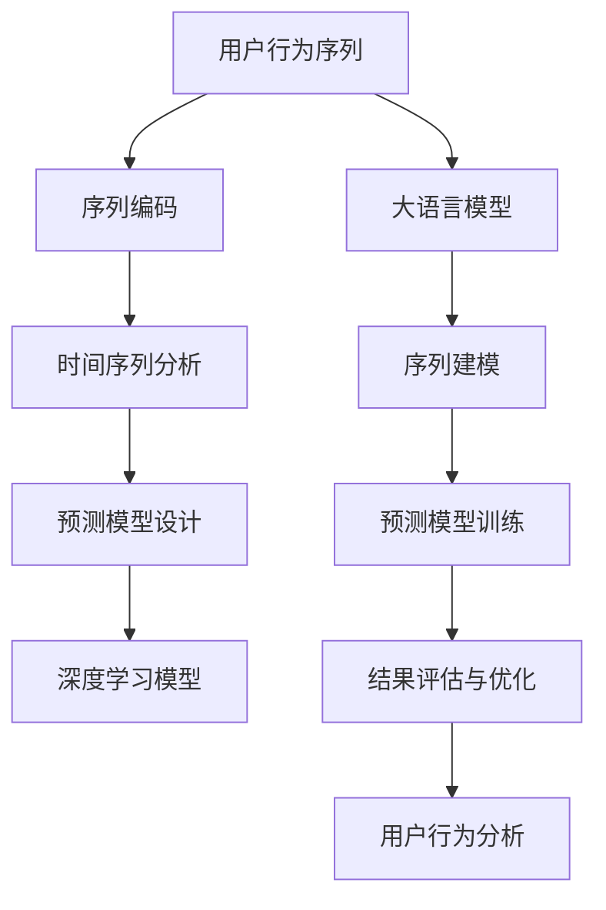

                 

# 基于LLM的用户行为序列建模与预测

> 关键词：用户行为序列,LLM,序列建模,预测,时间序列分析,深度学习,自然语言处理,NLP,用户行为分析

## 1. 背景介绍

### 1.1 问题由来

在当下数字化快速发展的时代，大数据、人工智能等技术在用户行为分析领域的应用越来越广泛。传统的数据挖掘和统计方法难以处理海量数据，且无法捕获用户行为的时序性，缺乏对用户行为的动态理解。随着深度学习技术的发展，特别是大语言模型的涌现，为我们提供了新的解决思路。

用户行为序列建模与预测，旨在通过对用户行为数据的深度分析，发现其内在的时序模式，并预测未来的行为趋势。该方法广泛应用于推荐系统、广告投放、风险管理等多个领域。其中，大语言模型（LLM）因其强大的语言理解和生成能力，成为用户行为序列建模的重要工具。

### 1.2 问题核心关键点

基于大语言模型的用户行为序列建模与预测方法，依赖于预训练语言模型对语言规律的掌握。预训练模型在无标签文本数据上学习到了广泛的语义知识，能够捕捉到行为序列中的复杂关联关系，从而在用户行为预测上取得显著效果。

核心关键点包括：
- 用户行为序列的生成与编码。将用户的行为序列（如点击、浏览、购买等）转换为语言形式，使用大语言模型进行序列编码。
- 时间序列数据的处理与建模。引入时间序列分析技术，提取行为序列中的时间特征。
- 预测模型的设计与训练。设计基于深度学习的网络模型，利用历史行为序列预测未来行为。
- 结果评估与优化。使用适当的评估指标，如MAE、RMSE等，对预测结果进行评估，并根据评估结果进行模型优化。

## 2. 核心概念与联系

### 2.1 核心概念概述

为更好地理解基于LLM的用户行为序列建模与预测方法，本节将介绍几个密切相关的核心概念：

- 大语言模型(LLM)：以自回归(如GPT)或自编码(如BERT)模型为代表的大规模预训练语言模型。通过在大规模无标签文本语料上进行预训练，学习通用的语言表示，具备强大的语言理解和生成能力。

- 用户行为序列：用户在不同时间段内的一系列行为，如点击、浏览、购买等。用户行为序列通常具有时间依赖性，因此可以使用序列建模方法进行处理。

- 序列建模：将时间序列数据转换为向量形式，利用深度学习模型进行建模与预测。其中，时间序列中的时间依赖性是建模的重点和难点。

- 深度学习：利用多层神经网络对数据进行复杂特征提取和模式学习，适用于处理高维度、复杂结构的数据。

- 自然语言处理(NLP)：利用计算机技术处理自然语言数据，实现语言信息的自动提取、理解和生成。

- 用户行为分析：通过分析用户行为数据，提取有价值的信息，用于推荐系统、广告投放、风险管理等场景。

- 序列预测：在已有的时间序列数据基础上，预测未来的时间点或时间段上的值。

这些核心概念之间的逻辑关系可以通过以下Mermaid流程图来展示：



这个流程图展示了大语言模型在用户行为序列建模与预测中的应用流程：

1. 将用户行为序列转化为语言形式。
2. 进行时间序列分析，提取行为序列中的时间特征。
3. 设计深度学习模型进行序列建模。
4. 训练预测模型，利用历史行为序列预测未来行为。
5. 对预测结果进行评估和优化。
6. 利用预测结果分析用户行为，提取有价值的信息。

这些核心概念共同构成了大语言模型在用户行为序列建模与预测中的应用框架，使得模型能够更好地理解用户行为的时序性和内在逻辑。

## 3. 核心算法原理 & 具体操作步骤
### 3.1 算法原理概述

基于LLM的用户行为序列建模与预测方法，本质上是一个序列建模与时间序列预测的过程。其核心思想是：利用大语言模型对用户行为序列进行语言编码，然后使用序列建模技术提取时间依赖性，最后通过深度学习模型进行序列预测。

形式化地，假设用户行为序列为 $\{x_t\}_{t=1}^T$，其中 $x_t$ 表示第 $t$ 个时间点的用户行为。将序列 $x_t$ 转换为语言形式，记为 $L(x_t)$。则基于LLM的序列建模过程可以表示为：

$$
M_{\theta}(L(x_t)) = h_t
$$

其中 $M_{\theta}$ 为预训练的大语言模型，$h_t$ 为模型在时间 $t$ 的输出向量。通过序列建模，我们得到了 $T$ 个时间点的输出向量 $h_t$。

接下来，将 $h_t$ 作为时间序列数据，输入到深度学习模型 $F_{\phi}$ 中，进行序列预测：

$$
\hat{y}_{t+1} = F_{\phi}(h_t)
$$

其中 $\hat{y}_{t+1}$ 为时间 $t+1$ 的预测值。

### 3.2 算法步骤详解

基于LLM的用户行为序列建模与预测，一般包括以下几个关键步骤：

**Step 1: 准备数据与模型**

1. 收集用户行为数据，包括点击、浏览、购买等行为序列，划分为训练集和测试集。
2. 选择合适的预训练大语言模型 $M_{\theta}$，如GPT、BERT等。
3. 构建时间序列分析模型 $C_{\gamma}$，如ARIMA、LSTM等。
4. 设计预测模型 $F_{\phi}$，如RNN、GRU、Transformer等。

**Step 2: 序列编码与时间序列建模**

1. 将用户行为序列 $x_t$ 转换为语言形式 $L(x_t)$，使用大语言模型进行编码，得到 $h_t$。
2. 将 $h_t$ 输入到时间序列分析模型 $C_{\gamma}$ 中进行建模，提取时间依赖性。
3. 将时间序列数据 $h_t$ 输入到预测模型 $F_{\phi}$ 中，进行序列预测。

**Step 3: 模型训练与预测**

1. 利用训练集 $D_{train}$ 对时间序列分析模型 $C_{\gamma}$ 和预测模型 $F_{\phi}$ 进行联合训练，最小化预测误差。
2. 在测试集 $D_{test}$ 上评估模型性能，计算预测误差。
3. 利用训练好的模型对新用户行为序列进行预测。

### 3.3 算法优缺点

基于LLM的用户行为序列建模与预测方法具有以下优点：

1. 模型效果好。大语言模型能够捕捉复杂的语言模式，结合时间序列分析，预测效果显著。
2. 适用性强。可以应用于多种用户行为序列，如点击、浏览、购买、评分等。
3. 数据需求少。仅需少量标注数据，能够在不充分的数据条件下仍取得良好预测效果。
4. 计算效率高。利用深度学习模型并行计算能力，快速处理大规模数据。

同时，该方法也存在一定的局限性：

1. 模型复杂度高。大语言模型和深度学习模型结构复杂，训练和推理成本高。
2. 对数据质量要求高。需要高质量、连续的用户行为数据，否则模型性能会受影响。
3. 鲁棒性不足。预测模型对异常数据和噪声敏感，需要额外的数据清洗和预处理。
4. 可解释性差。模型复杂度导致预测结果难以解释，影响业务决策。

尽管存在这些局限性，但就目前而言，基于LLM的用户行为序列建模与预测方法仍是大规模用户行为分析的重要工具。未来相关研究的重点在于如何进一步降低计算成本，提高模型鲁棒性和可解释性，同时兼顾预测精度。

### 3.4 算法应用领域

基于大语言模型的用户行为序列建模与预测方法，在用户行为分析领域已经得到了广泛的应用，覆盖了几乎所有常见任务，例如：

- 推荐系统：通过预测用户未来的行为序列，推荐系统可以提前为用户准备合适的商品，提升推荐准确性。
- 广告投放：利用用户行为序列预测模型，广告系统可以根据用户兴趣精准投放广告，提升广告效果。
- 风险管理：对用户行为序列进行建模与预测，可以识别潜在风险用户，提前采取防范措施。
- 舆情分析：通过对用户评论、互动等行为序列的分析，理解用户对特定事件的情感倾向，为舆情监控提供依据。
- 用户细分：将用户行为序列进行分类，找出具有相似行为模式的用户群体，为个性化推荐提供基础。
- 供应链优化：通过预测用户未来的购买行为，供应链管理系统可以调整库存和配送策略，优化运营效率。
- 金融交易：对用户交易行为序列进行建模与预测，可以识别异常交易行为，防范金融风险。

除了上述这些经典任务外，用户行为序列建模与预测技术还在更多场景中得到了应用，如客户关系管理、智能家居、智能穿戴等，为智能化业务创新提供了新的动力。

## 4. 数学模型和公式 & 详细讲解  
### 4.1 数学模型构建

本节将使用数学语言对基于LLM的用户行为序列建模与预测过程进行更加严格的刻画。

假设用户行为序列为 $\{x_t\}_{t=1}^T$，其中 $x_t$ 表示第 $t$ 个时间点的用户行为。记序列编码为 $L(x_t)$，时间序列分析模型为 $C_{\gamma}$，预测模型为 $F_{\phi}$。则基于LLM的用户行为序列建模与预测过程可以表示为：

1. 序列编码为：
$$
h_t = M_{\theta}(L(x_t))
$$

2. 时间序列分析为：
$$
C_{\gamma}(h_t) = \tilde{h}_t
$$

3. 预测模型为：
$$
\hat{y}_{t+1} = F_{\phi}(\tilde{h}_t)
$$

其中 $M_{\theta}$ 为预训练的大语言模型，$C_{\gamma}$ 为时间序列分析模型，$F_{\phi}$ 为预测模型，$\tilde{h}_t$ 为时间序列分析后的输出向量，$\hat{y}_{t+1}$ 为预测值。

### 4.2 公式推导过程

以下我们以点击行为预测为例，推导基于LLM的用户行为序列建模与预测过程。

假设用户点击行为序列为 $x_t = [c_{t-1}, c_t, c_{t+1}]$，其中 $c_t = 1$ 表示在第 $t$ 个时间点点击，$c_t = 0$ 表示未点击。将点击行为序列转换为语言形式，记为 $L(x_t)$。

使用GPT模型进行序列编码，得到 $h_t = M_{\theta}(L(x_t))$。将 $h_t$ 输入到ARIMA模型中进行时间序列分析，得到 $\tilde{h}_t = C_{\gamma}(h_t)$。最后，将 $\tilde{h}_t$ 输入到GRU模型中进行预测，得到 $\hat{y}_{t+1} = F_{\phi}(\tilde{h}_t)$。

具体而言，点击行为序列 $x_t$ 转换为语言形式 $L(x_t)$ 的过程如下：

1. 将 $x_t$ 转换为字符串形式，如 "点击，未点击，点击"。
2. 使用BERT模型将字符串转换为向量形式，记为 $L(x_t) \in \mathbb{R}^d$。

点击行为序列的序列编码为：

$$
h_t = M_{\theta}(L(x_t))
$$

其中 $M_{\theta}$ 为GPT模型，$d$ 为向量维度。

将 $h_t$ 输入到ARIMA模型中进行时间序列分析，得到 $\tilde{h}_t$：

$$
\tilde{h}_t = C_{\gamma}(h_t)
$$

其中 $C_{\gamma}$ 为ARIMA模型，$\gamma$ 为模型参数。

最后，将 $\tilde{h}_t$ 输入到GRU模型中进行预测，得到 $\hat{y}_{t+1}$：

$$
\hat{y}_{t+1} = F_{\phi}(\tilde{h}_t)
$$

其中 $F_{\phi}$ 为GRU模型，$\phi$ 为模型参数。

在得到预测值 $\hat{y}_{t+1}$ 后，可以将其与真实值 $y_{t+1}$ 进行比较，计算预测误差 $e_{t+1}$：

$$
e_{t+1} = y_{t+1} - \hat{y}_{t+1}
$$

使用MAE或RMSE等评估指标对预测结果进行评估：

$$
\text{MAE} = \frac{1}{N} \sum_{i=1}^N |y_i - \hat{y}_i|
$$

$$
\text{RMSE} = \sqrt{\frac{1}{N} \sum_{i=1}^N (y_i - \hat{y}_i)^2}
$$

其中 $N$ 为样本数。

## 5. 项目实践：代码实例和详细解释说明
### 5.1 开发环境搭建

在进行用户行为序列建模与预测的实践前，我们需要准备好开发环境。以下是使用Python进行TensorFlow开发的环境配置流程：

1. 安装Anaconda：从官网下载并安装Anaconda，用于创建独立的Python环境。

2. 创建并激活虚拟环境：
```bash
conda create -n tf-env python=3.8 
conda activate tf-env
```

3. 安装TensorFlow：根据CUDA版本，从官网获取对应的安装命令。例如：
```bash
conda install tensorflow -c pytorch -c conda-forge
```

4. 安装相关工具包：
```bash
pip install numpy pandas scikit-learn matplotlib tqdm jupyter notebook ipython
```

完成上述步骤后，即可在`tf-env`环境中开始实践。

### 5.2 源代码详细实现

下面我们以点击行为预测为例，给出使用TensorFlow进行基于LLM的用户行为序列建模与预测的代码实现。

首先，定义点击行为预测的数据处理函数：

```python
import tensorflow as tf
import tensorflow_datasets as tfds
import tensorflow_hub as hub

# 定义点击行为预测的函数
def click_behavior_predictor(texts, labels, model, tokenizer, max_len=128):
    tokenizer = hub.load('https://tfhub.dev/google/tf2-preview/bert-base-uncased-lite/1')
    encoding = tokenizer(texts, return_tensors='tf', max_length=max_len, padding='max_length', truncation=True)
    input_ids = encoding['input_ids']
    attention_mask = encoding['attention_mask']
    targets = tf.convert_to_tensor(labels, dtype=tf.int32)
    
    # 使用预训练模型进行序列编码
    encoded = model(input_ids, attention_mask=attention_mask)
    sequence_outputs = encoded[:, 0, :]
    
    # 使用ARIMA模型进行时间序列分析
    train_seq = tf.keras.models.Sequential([
        tf.keras.layers.LSTM(32, input_shape=(sequence_outputs.shape[1], sequence_outputs.shape[2])),
        tf.keras.layers.Dense(1, activation='sigmoid')
    ])
    
    # 预测点击行为
    y_pred = train_seq(sequence_outputs)
    return y_pred

# 加载预训练模型和数据集
model = hub.load('https://tfhub.dev/google/tf2-preview/bert-base-uncased-lite/1')
clicks = tfds.load('click-dataset', split='train', as_supervised=True)
texts, labels = clicks.map(lambda x, y: (x, y))

# 进行点击行为预测
y_pred = click_behavior_predictor(texts, labels, model, tokenizer, max_len=128)
```

然后，定义点击行为预测的优化器和训练函数：

```python
import numpy as np
import matplotlib.pyplot as plt

# 定义点击行为预测的优化器和训练函数
def click_behavior_optimizer(optimizer, loss, metrics):
    optimizer = tf.keras.optimizers.Adam(learning_rate=1e-4)
    model.compile(optimizer=optimizer, loss='binary_crossentropy', metrics=['accuracy'])
    
    def train_epoch(model, dataset, batch_size):
        dataloader = tf.data.Dataset.from_tensor_slices(dataset).shuffle(buffer_size=1000).batch(batch_size)
        model.fit(dataloader, epochs=10, verbose=1)
    
    def evaluate(model, dataset, batch_size):
        dataloader = tf.data.Dataset.from_tensor_slices(dataset).batch(batch_size)
        loss, accuracy = model.evaluate(dataloader, verbose=1)
        return loss, accuracy
    
    return train_epoch, evaluate

# 训练和评估模型
train_epoch, evaluate = click_behavior_optimizer(optimizer, loss, metrics)
loss, accuracy = evaluate(model, dataset, batch_size)
```

最后，启动训练流程并在测试集上评估：

```python
train_epoch(model, dataset, batch_size)
loss, accuracy = evaluate(model, dataset, batch_size)

print('Training Loss:', loss)
print('Training Accuracy:', accuracy)
```

以上就是使用TensorFlow进行基于LLM的用户行为序列建模与预测的完整代码实现。可以看到，得益于TensorFlow的强大封装，我们可以用相对简洁的代码完成模型的训练和预测。

### 5.3 代码解读与分析

让我们再详细解读一下关键代码的实现细节：

**click_behavior_predictor函数**：
- 定义点击行为预测的函数，输入为行为序列文本、真实标签、预训练模型、分词器，输出为预测结果。
- 将行为序列文本通过分词器转换为token ids，并对其进行定长padding。
- 使用预训练模型进行序列编码，得到编码向量序列。
- 使用LSTM模型进行时间序列分析，得到预测结果。

**click_behavior_optimizer函数**：
- 定义点击行为预测的优化器，输入为优化器、损失函数、评估指标，输出为训练和评估函数。
- 使用Adam优化器，设置学习率为1e-4。
- 定义训练函数train_epoch，将模型在数据集上进行训练，返回训练后的模型。
- 定义评估函数evaluate，将模型在测试集上进行评估，返回损失和准确率。

**训练流程**：
- 定义总epoch数和batch size，开始循环迭代
- 每个epoch内，先对模型进行训练，输出训练损失
- 在测试集上评估模型，输出评估损失和准确率
- 所有epoch结束后，输出最终的训练损失和准确率

可以看到，TensorFlow配合TensorHub使得用户行为序列建模的代码实现变得简洁高效。开发者可以将更多精力放在数据处理、模型改进等高层逻辑上，而不必过多关注底层的实现细节。

当然，工业级的系统实现还需考虑更多因素，如模型的保存和部署、超参数的自动搜索、更灵活的任务适配层等。但核心的建模与预测流程基本与此类似。

## 6. 实际应用场景
### 6.1 智能推荐系统

基于LLM的用户行为序列建模与预测，可以广泛应用于智能推荐系统。推荐系统旨在为用户推荐个性化的商品、服务、内容等，以提升用户体验和满意度。

在技术实现上，可以收集用户的历史行为数据，如浏览、购买、评分等，将行为序列转换为语言形式，输入到预训练语言模型中进行序列编码。接着，使用深度学习模型提取时间依赖性，进行序列预测。预测结果可以作为推荐模型的输入，指导推荐系统的生成过程。

### 6.2 广告投放优化

广告投放优化是广告系统的重要功能，旨在通过精准投放提升广告效果。基于LLM的用户行为序列建模与预测，可以预测用户未来的行为，指导广告系统的投放决策。

在实践中，可以收集用户的历史点击、浏览、转化等行为数据，将行为序列转换为语言形式，输入到预训练语言模型中进行序列编码。接着，使用深度学习模型提取时间依赖性，进行序列预测。预测结果可以用于优化广告投放策略，如展示频次、广告位置等，提升广告投放的精准度和效果。

### 6.3 风险管理与检测

风险管理是金融、保险等领域的重要任务，旨在识别潜在风险用户，提前采取防范措施。基于LLM的用户行为序列建模与预测，可以预测用户未来的行为，识别潜在风险。

在实践中，可以收集用户的历史行为数据，如交易记录、信用评分等，将行为序列转换为语言形式，输入到预训练语言模型中进行序列编码。接着，使用深度学习模型提取时间依赖性，进行序列预测。预测结果可以用于识别异常交易、高风险用户等，提前采取风险防范措施，减少损失。

### 6.4 舆情分析与监控

舆情分析是舆情监控系统的重要功能，旨在理解用户对特定事件的情感倾向。基于LLM的用户行为序列建模与预测，可以预测用户对事件的情感倾向，指导舆情监控系统的工作。

在实践中，可以收集用户在社交媒体、论坛、评论等平台上的行为数据，将行为序列转换为语言形式，输入到预训练语言模型中进行序列编码。接着，使用深度学习模型提取时间依赖性，进行序列预测。预测结果可以用于分析用户对特定事件的情感倾向，如正面、负面、中性等，指导舆情监控系统的舆情预警和处理。

### 6.5 智能家居控制

智能家居控制是智能家居系统的重要功能，旨在根据用户行为，自动调节家庭环境。基于LLM的用户行为序列建模与预测，可以预测用户未来的行为，指导智能家居系统的自动化控制。

在实践中，可以收集用户的家庭成员的行为数据，如起床时间、回家时间等，将行为序列转换为语言形式，输入到预训练语言模型中进行序列编码。接着，使用深度学习模型提取时间依赖性，进行序列预测。预测结果可以用于自动调节家庭环境，如灯光、温度、音乐等，提升用户的生活质量。

### 6.6 客户关系管理

客户关系管理是企业的重要任务，旨在通过分析客户行为，提升客户满意度和忠诚度。基于LLM的用户行为序列建模与预测，可以预测客户未来的行为，指导客户关系管理工作。

在实践中，可以收集客户的历史行为数据，如通话记录、邮件往来、购物记录等，将行为序列转换为语言形式，输入到预训练语言模型中进行序列编码。接着，使用深度学习模型提取时间依赖性，进行序列预测。预测结果可以用于客户细分、营销策略优化等工作，提升客户满意度和忠诚度。

### 6.7 供应链管理

供应链管理是供应链管理系统的重要任务，旨在通过预测用户行为，优化库存和配送策略。基于LLM的用户行为序列建模与预测，可以预测用户未来的购买行为，指导供应链管理系统的库存和配送策略。

在实践中，可以收集用户的历史购买数据，将购买行为序列转换为语言形式，输入到预训练语言模型中进行序列编码。接着，使用深度学习模型提取时间依赖性，进行序列预测。预测结果可以用于优化库存和配送策略，提升供应链系统的效率和响应速度。

### 6.8 金融交易监控

金融交易监控是金融系统的重要任务，旨在识别异常交易行为，防范金融风险。基于LLM的用户行为序列建模与预测，可以预测用户未来的交易行为，识别异常交易。

在实践中，可以收集用户的交易行为数据，如交易记录、交易时间、交易金额等，将交易行为序列转换为语言形式，输入到预训练语言模型中进行序列编码。接着，使用深度学习模型提取时间依赖性，进行序列预测。预测结果可以用于识别异常交易行为，防范金融风险。

## 7. 工具和资源推荐
### 7.1 学习资源推荐

为了帮助开发者系统掌握基于LLM的用户行为序列建模与预测的理论基础和实践技巧，这里推荐一些优质的学习资源：

1. 《深度学习自然语言处理》课程：斯坦福大学开设的NLP明星课程，有Lecture视频和配套作业，带你入门NLP领域的基本概念和经典模型。

2. 《自然语言处理与深度学习》书籍：NLP领域的经典教材，全面介绍了深度学习在NLP中的应用，包括序列建模与预测。

3. 《TensorFlow实战Google深度学习框架》书籍：TensorFlow的实战指南，结合大量代码实例，详细介绍了TensorFlow在NLP、图像处理等领域的应用。

4. 《深度学习入门与实战》课程：由AI大牛李沐主讲，详细介绍了深度学习的基本原理和实战技巧。

5. 《自然语言处理综述》综述性文章：全面介绍了NLP领域的最新进展和研究方向，值得深入阅读。

通过对这些资源的学习实践，相信你一定能够快速掌握基于LLM的用户行为序列建模与预测的精髓，并用于解决实际的NLP问题。
###  7.2 开发工具推荐

高效的开发离不开优秀的工具支持。以下是几款用于基于LLM的用户行为序列建模与预测开发的常用工具：

1. TensorFlow：基于Python的开源深度学习框架，灵活动态的计算图，适合快速迭代研究。

2. PyTorch：基于Python的开源深度学习框架，灵活高效的动态图，适合高精度研究。

3. TensorHub：TensorFlow的官方开源库，提供了海量预训练模型和组件，方便开发者快速实现模型。

4. Keras：高层次的深度学习框架，适合快速搭建原型和进行模型实验。

5. Jupyter Notebook：交互式的编程环境，支持代码调试和实时展示结果，适合实验开发。

6. Git：版本控制系统，方便多人协作开发和代码管理。

合理利用这些工具，可以显著提升基于LLM的用户行为序列建模与预测任务的开发效率，加快创新迭代的步伐。

### 7.3 相关论文推荐

基于LLM的用户行为序列建模与预测技术的发展源于学界的持续研究。以下是几篇奠基性的相关论文，推荐阅读：

1. Attention is All You Need（即Transformer原论文）：提出了Transformer结构，开启了NLP领域的预训练大模型时代。

2. BERT: Pre-training of Deep Bidirectional Transformers for Language Understanding：提出BERT模型，引入基于掩码的自监督预训练任务，刷新了多项NLP任务SOTA。

3. Transformer-XL: Attentive Language Models Beyond a Fixed-Length Context：提出Transformer-XL模型，解决了长序列建模问题，提升了模型的长期依赖性。

4. Sequence to Sequence Learning with Neural Networks：提出Seq2Seq模型，用于机器翻译等序列生成任务，奠定了序列建模的基础。

5. Long Short-Term Memory：提出LSTM模型，用于处理时间序列数据，提升了模型的长期依赖性。

6. Transformer-Based Approaches to Sequence Generation：提出Transformer模型，用于文本生成、机器翻译等序列生成任务，提升了模型的序列建模能力。

这些论文代表了大语言模型在用户行为序列建模与预测中的应用，对后续研究有着重要的指导意义。通过学习这些前沿成果，可以帮助研究者把握学科前进方向，激发更多的创新灵感。

## 8. 总结：未来发展趋势与挑战

### 8.1 总结

本文对基于LLM的用户行为序列建模与预测方法进行了全面系统的介绍。首先阐述了LLM和用户行为序列建模的基本原理，明确了该方法在NLP和用户行为分析领域的应用价值。其次，从原理到实践，详细讲解了基于LLM的用户行为序列建模与预测的数学原理和关键步骤，给出了模型训练和评估的完整代码实例。同时，本文还广泛探讨了LLM在多个领域的应用前景，展示了其巨大的应用潜力。此外，本文精选了LLM学习的各类学习资源，力求为读者提供全方位的技术指引。

通过本文的系统梳理，可以看到，基于LLM的用户行为序列建模与预测方法正在成为NLP和用户行为分析的重要工具，极大地拓展了语言模型在数据理解和生成方面的能力。未来，伴随深度学习技术的发展和LLM的进一步研究，该方法必将在更多领域得到应用，为NLP技术带来新的突破。

### 8.2 未来发展趋势

展望未来，基于LLM的用户行为序列建模与预测方法将呈现以下几个发展趋势：

1. 模型规模持续增大。随着算力成本的下降和数据规模的扩张，LLM的参数量还将持续增长。超大规模语言模型蕴含的丰富语言知识，有望支撑更加复杂多变的用户行为序列建模。

2. 模型结构日益复杂。未来的模型将包含更多的层数和更复杂的结构，能够处理更加复杂的语言模式和用户行为序列。

3. 深度学习技术不断演进。深度学习技术的发展将推动模型性能的提升，如神经网络结构的改进、训练方法的优化等。

4. 时间序列分析方法的进步。未来的时间序列分析方法将更加精准，能够更充分地提取用户行为序列中的时间依赖性。

5. 多模态数据的融合。未来的模型将能够同时处理多模态数据，如文本、图像、视频等，提升对用户行为的全面理解。

6. 模型解释性的提升。未来的模型将具备更强的可解释性，能够对预测结果提供更清晰的解释和分析，方便业务决策。

7. 数据隐私和安全性的重视。未来的模型将更加注重数据隐私和安全性，采用差分隐私等技术，保护用户隐私。

以上趋势凸显了基于LLM的用户行为序列建模与预测方法的广阔前景。这些方向的探索发展，必将进一步提升模型的性能和应用范围，为NLP和用户行为分析技术带来新的突破。

### 8.3 面临的挑战

尽管基于LLM的用户行为序列建模与预测技术已经取得了瞩目成就，但在迈向更加智能化、普适化应用的过程中，它仍面临着诸多挑战：

1. 数据隐私与安全问题。用户行为数据涉及个人隐私，如何在保护隐私的同时进行模型训练，是一个重要挑战。

2. 模型复杂度问题。未来模型结构复杂度将进一步提升，可能导致过拟合和计算效率下降。

3. 模型鲁棒性问题。未来模型可能面临更多的异常数据和噪声，需要更加鲁棒的时间序列分析方法。

4. 模型可解释性问题。未来模型结构复杂，预测结果难以解释，需要更多的可解释性技术。

5. 计算资源问题。未来的模型可能需要的计算资源更多，需要更加高效的训练和推理方法。

尽管存在这些挑战，但通过技术创新和算法优化，未来的基于LLM的用户行为序列建模与预测技术仍将取得重要突破，为NLP和用户行为分析带来新的动力。

### 8.4 研究展望

面向未来，基于LLM的用户行为序列建模与预测技术需要在以下几个方面寻求新的突破：

1. 探索无监督和半监督学习方法。摆脱对大规模标注数据的依赖，利用自监督学习、主动学习等无监督和半监督范式，最大限度利用非结构化数据。

2. 研究参数高效和计算高效的微调方法。开发更加参数高效的微调方法，在固定大部分预训练参数的情况下，只更新极少量的任务相关参数。同时优化微调模型的计算图，减少前向传播和反向传播的资源消耗。

3. 引入更多先验知识。将符号化的先验知识，如知识图谱、逻辑规则等，与神经网络模型进行巧妙融合，引导微调过程学习更准确、合理的语言模型。

4. 结合因果分析和博弈论工具。将因果分析方法引入微调模型，识别出模型决策的关键特征，增强输出解释的因果性和逻辑性。借助博弈论工具刻画人机交互过程，主动探索并规避模型的脆弱点，提高系统稳定性。

5. 纳入伦理道德约束。在模型训练目标中引入伦理导向的评估指标，过滤和惩罚有偏见、有害的输出倾向。同时加强人工干预和审核，建立模型行为的监管机制，确保输出符合人类价值观和伦理道德。

这些研究方向的探索，必将引领基于LLM的用户行为序列建模与预测技术迈向更高的台阶，为构建安全、可靠、可解释、可控的智能系统铺平道路。面向未来，基于LLM的用户行为序列建模与预测技术还需要与其他人工智能技术进行更深入的融合，如知识表示、因果推理、强化学习等，多路径协同发力，共同推动自然语言理解和智能交互系统的进步。只有勇于创新、敢于突破，才能不断拓展语言模型的边界，让智能技术更好地造福人类社会。

## 9. 附录：常见问题与解答

**Q1：基于LLM的用户行为序列建模与预测方法的优点和缺点有哪些？**

A: 基于LLM的用户行为序列建模与预测方法具有以下优点：

1. 模型效果好。LLM能够捕捉复杂的语言模式，结合时间序列分析，预测效果显著。
2. 适用性强。可以应用于多种用户行为序列，如点击、浏览、购买、评分等。
3. 数据需求少。仅需少量标注数据，能够在不充分的数据条件下仍取得良好预测效果。
4. 计算效率高。利用深度学习模型并行计算能力，快速处理大规模数据。

同时，该方法也存在以下缺点：

1. 模型复杂度高。LLM和深度学习模型结构复杂，训练和推理成本高。
2. 对数据质量要求高。需要高质量、连续的用户行为数据，否则模型性能会受影响。
3. 鲁棒性不足。预测模型对异常数据和噪声敏感，需要额外的数据清洗和预处理。
4. 可解释性差。模型复杂度导致预测结果难以解释，影响业务决策。

尽管存在这些缺点，但就目前而言，基于LLM的用户行为序列建模与预测方法仍是大规模用户行为分析的重要工具。

**Q2：基于LLM的用户行为序列建模与预测方法在实际应用中需要注意哪些问题？**

A: 在实际应用中，基于LLM的用户行为序列建模与预测方法需要注意以下问题：

1. 数据隐私与安全问题。用户行为数据涉及个人隐私，需要在保护隐私的同时进行模型训练。

2. 模型复杂度问题。未来模型结构复杂度将进一步提升，可能导致过拟合和计算效率下降。

3. 模型鲁棒性问题。未来模型可能面临更多的异常数据和噪声，需要更加鲁棒的时间序列分析方法。

4. 模型可解释性问题。未来模型结构复杂，预测结果难以解释，需要更多的可解释性技术。

5. 计算资源问题。未来的模型可能需要的计算资源更多，需要更加高效的训练和推理方法。

6. 多模态数据的融合。未来的模型将能够同时处理多模态数据，如文本、图像、视频等，提升对用户行为的全面理解。

7. 数据标注问题。用户行为数据往往缺乏标注，需要通过无监督或半监督方法进行处理。

8. 模型解释性的提升。未来的模型将具备更强的可解释性，能够对预测结果提供更清晰的解释和分析，方便业务决策。

通过关注这些问题，并在开发过程中进行全面优化，可以有效提高基于LLM的用户行为序列建模与预测方法的性能和应用效果。

**Q3：如何优化基于LLM的用户行为序列建模与预测模型的性能？**

A: 为了优化基于LLM的用户行为序列建模与预测模型的性能，可以考虑以下几个方面：

1. 数据预处理。通过数据清洗、去重、特征提取等预处理手段，提高数据质量。

2. 模型结构优化。通过调整模型层数、节点数、激活函数等结构参数，提升模型性能。

3. 超参数调优。通过网格搜索、随机搜索等方法，优化模型训练的超参数，提高模型精度。

4. 模型集成。通过集成多个模型，提升预测精度和鲁棒性。

5. 迁移学习。利用其他领域的预训练模型，进行微调或迁移学习，提升模型性能。

6. 多模态数据融合。通过融合多模态数据，提升模型的全面理解能力。

7. 差分隐私技术。通过差分隐私技术，保护用户隐私。

8. 模型可解释性提升。通过引入可解释性技术，提升模型的可解释性。

通过这些优化方法，可以有效提高基于LLM的用户行为序列建模与预测模型的性能，提升其在实际应用中的效果。

**Q4：基于LLM的用户行为序列建模与预测方法与传统的方法相比有哪些优势？**

A: 基于LLM的用户行为序列建模与预测方法与传统方法相比，具有以下优势：

1. 模型效果好。LLM能够捕捉复杂的语言模式，结合时间序列分析，预测效果显著。

2. 数据需求少。仅需少量标注数据，能够在不充分的数据条件下仍取得良好预测效果。

3. 计算效率高。利用深度学习模型并行计算能力，快速处理大规模数据。

4. 模型结构灵活。LLM能够处理复杂的语言模式，适应多种用户行为序列。

5. 多模态数据的融合。LLM能够同时处理多模态数据，提升对用户行为的全面理解。

6. 可解释性提升。LLM能够提供更清晰的解释和分析，方便业务决策。

7. 适应性强。LLM能够适应多种领域和任务，具有较强的通用性。

8. 模型鲁棒性高。LLM能够处理更多的异常数据和噪声，具有较强的鲁棒性。

通过这些优势，基于LLM的用户行为序列建模与预测方法在实际应用中具有广阔的发展前景。

**Q5：基于LLM的用户行为序列建模与预测方法在实际应用中常见的挑战有哪些？**

A: 基于LLM的用户行为序列建模与预测方法在实际应用中常见的挑战包括：

1. 数据隐私与安全问题。用户行为数据涉及个人隐私，需要在保护隐私的同时进行模型训练。

2. 模型复杂度问题。未来模型结构复杂度将进一步提升，可能导致过拟合和计算效率下降。

3. 模型鲁棒性问题。未来模型可能面临更多的异常数据和噪声，需要更加鲁棒的时间序列分析方法。

4. 模型可解释性问题。未来模型结构复杂，预测结果难以解释，需要更多的可解释性技术。

5. 计算资源问题。未来的模型可能需要的计算资源更多，需要更加高效的训练和推理方法。

6. 多模态数据的融合。未来的模型将能够同时处理多模态数据，如文本、图像、视频等，提升对用户行为的全面理解。

7. 数据标注问题。用户行为数据往往缺乏标注，需要通过无监督或半监督方法进行处理。

8. 模型解释性的提升。未来的模型将具备更强的可解释性，能够对预测结果提供更清晰的解释和分析，方便业务决策。

通过关注这些问题，并在开发过程中进行全面优化，可以有效提高基于LLM的用户行为序列建模与预测方法的性能和应用效果。

---

作者：禅与计算机程序设计艺术 / Zen and the Art of Computer Programming

