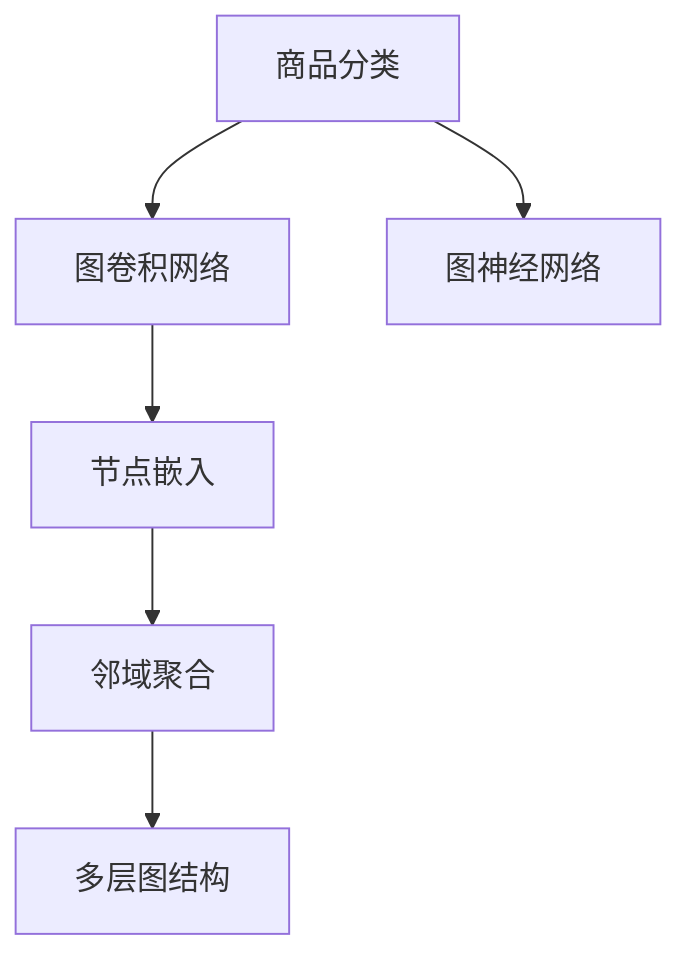

                 

# 基于图卷积网络的大规模商品分类

> 关键词：商品分类,图卷积网络,图神经网络,GNN,特征工程,节点嵌入,邻域聚合

## 1. 背景介绍

### 1.1 问题由来
随着电商行业的发展，商品种类日益繁多，用户对商品分类的需求也日益增长。传统的商品分类方法依赖人工标注，难以处理大规模数据集，同时容易产生标注偏差。机器学习方法的引入，特别是深度学习方法，使得商品分类任务得以自动化和标准化，提高了分类的效率和准确性。然而，传统的深度学习方法往往依赖于静态的特征表示，难以捕捉商品间的复杂关系，无法充分利用网络结构化信息，导致分类效果不佳。

图卷积网络(Graph Convolutional Network, GNN)作为一种新兴的图机器学习方法，能够自然地处理网络结构化数据，捕捉节点间的复杂关系，具有很好的应用前景。基于GNN的商品分类方法，通过建模商品与其关联实体之间的关系，可以更加全面和准确地刻画商品特征，提高分类的性能和效果。

### 1.2 问题核心关键点
GNN在商品分类中的核心在于，如何有效地建模商品与其关联实体之间的关系，如何对商品节点进行高效嵌入表示，如何在邻域聚合时保留重要信息，如何对多层图结构进行刻画和处理。本文将系统介绍基于图卷积网络的商品分类方法，重点关注这些问题，并给出详细的解决方案。

### 1.3 问题研究意义
研究基于图卷积网络的商品分类方法，对于提升电商平台的商品推荐、搜索、个性化展示等应用场景的性能，具有重要意义：

1. 提升分类精度。基于GNN的分类方法能够捕捉商品间的复杂关系，充分利用网络结构化信息，获得更准确的商品分类。
2. 加速商品管理。自动化的分类方法可以大幅提升商品分类的效率，减轻人工标注和管理的负担。
3. 优化用户体验。准确的分类结果能够帮助平台提供更好的商品推荐、搜索排序等功能，提升用户体验。
4. 驱动业务创新。基于GNN的商品分类方法可以为电商平台的运营提供新的业务洞察，驱动更多创新应用。

## 2. 核心概念与联系

### 2.1 核心概念概述

为更好地理解基于GNN的商品分类方法，本节将介绍几个密切相关的核心概念：

- 图卷积网络(Graph Convolutional Network, GNN)：基于图结构化的数据，通过卷积操作捕捉节点间的关系，传递网络中的信息。
- 图神经网络(Graph Neural Network, GNN)：利用图结构数据和卷积操作，能够自然地处理复杂的网络关系，融合多源信息，是一种高效的图机器学习方法。
- 节点嵌入(Node Embedding)：将图中的节点映射到低维向量空间中，捕捉节点特征，并用于下游任务。
- 邻域聚合(Neighborhood Aggregation)：通过聚合节点的邻域信息，捕捉节点的全局特征，提升模型性能。
- 多层图结构(Multi-layer Graph Structure)：通过多层图结构的建模，捕捉节点间的复杂关系，提高分类效果。

这些核心概念之间的逻辑关系可以通过以下Mermaid流程图来展示：



这个流程图展示了大规模商品分类的核心概念及其之间的关系：

1. 基于GNN的分类方法通过图卷积网络捕捉商品节点与其关联实体之间的关系。
2. 通过节点嵌入将商品节点映射到低维向量空间中，捕捉节点特征。
3. 通过邻域聚合捕捉节点的全局特征，提升模型性能。
4. 多层图结构的建模，捕捉节点间的复杂关系，提高分类效果。

## 3. 核心算法原理 & 具体操作步骤
### 3.1 算法原理概述

基于图卷积网络的商品分类方法，本质上是利用图结构化的数据，通过卷积操作捕捉节点间的关系，传递网络中的信息，并利用节点嵌入和邻域聚合技术，捕捉节点特征，构建全局特征，最终进行分类预测。

具体而言，假设商品图 $G=(V,E)$ 中，节点 $v_i$ 表示商品，节点 $v_j$ 表示其关联实体，边 $e_{ij}$ 表示节点间的关联关系。通过GNN模型，对商品图进行多次卷积和聚合操作，得到商品节点的嵌入表示 $z_i$。然后，对嵌入表示进行分类预测，得到商品分类结果 $y_i$。

### 3.2 算法步骤详解

基于图卷积网络的商品分类方法，一般包括以下几个关键步骤：

**Step 1: 图数据预处理**
- 构建商品图，包括商品节点和关联实体节点，根据实际业务场景定义边类型和属性。
- 进行数据清洗和标准化，去除噪声和冗余信息，处理缺失值和异常值。
- 将商品图划分为训练集、验证集和测试集。

**Step 2: 图嵌入表示学习**
- 设计图卷积网络，通过多层次的图卷积和聚合操作，学习商品节点的嵌入表示 $z_i$。
- 设置超参数，如卷积层数、节点嵌入维度、学习率等。
- 在训练集上训练图卷积网络，得到最终的节点嵌入表示 $z_i$。

**Step 3: 分类器训练**
- 选择分类器，如线性分类器、支持向量机、随机森林等，利用节点嵌入表示 $z_i$ 进行分类预测。
- 设置分类器的超参数，如正则化系数、学习率等。
- 在验证集上评估分类器性能，根据评估结果调整超参数。
- 在测试集上评估分类器的最终性能。

**Step 4: 分类结果解释**
- 对分类结果进行可视化展示，如分类混淆矩阵、热力图等。
- 对分类结果进行评估，如精确率、召回率、F1-score等。
- 根据评估结果，调整图卷积网络或分类器，提升分类性能。

以上是基于图卷积网络的商品分类方法的一般流程。在实际应用中，还需要针对具体任务的特点，对图嵌入表示学习过程进行优化设计，如改进图卷积操作，引入更多的图结构信息，搜索最优的超参数组合等，以进一步提升模型性能。

### 3.3 算法优缺点

基于图卷积网络的商品分类方法具有以下优点：
1. 捕捉复杂关系。通过图卷积网络，可以自然地处理商品图，捕捉节点间的复杂关系，充分利用网络结构化信息。
2. 提升分类精度。节点嵌入和邻域聚合技术可以全面刻画商品特征，提高分类的性能和效果。
3. 泛化能力强。由于GNN模型具有较好的泛化能力，可以适应不同类型的商品图和分类任务。
4. 可解释性强。图卷积网络的分层结构，可以提供丰富的特征解释，便于理解和调试。

同时，该方法也存在一定的局限性：
1. 数据依赖性强。GNN方法的性能很大程度上依赖于商品图的质量，获取高质量商品图是一个挑战。
2. 计算复杂度高。GNN模型计算量较大，需要较强的计算资源支持。
3. 可扩展性不足。大规模商品图难以高效处理，需要优化算法和数据结构。
4. 容易过拟合。GNN模型容易在复杂网络结构下过拟合，需要引入正则化技术。

尽管存在这些局限性，但就目前而言，基于GNN的商品分类方法仍是大规模商品分类问题的理想范式。未来相关研究的重点在于如何进一步降低数据依赖，提高模型泛化能力，同时兼顾可解释性和计算效率等因素。

### 3.4 算法应用领域

基于图卷积网络的商品分类方法，在电商领域已经得到了广泛的应用，覆盖了商品推荐、搜索排序、库存管理等多个环节，提升了电商平台运营的效率和效果。具体应用场景如下：

- 商品推荐：利用商品图和用户行为数据，捕捉商品间的关联关系，生成个性化的商品推荐列表，提升用户体验。
- 搜索排序：通过商品图和用户查询数据，捕捉商品间的相似度，进行更准确的搜索结果排序，提升搜索效果。
- 库存管理：通过商品图和销售数据，预测商品库存水平，优化库存管理策略，减少库存积压和缺货。
- 市场分析：通过商品图和销售数据，分析市场趋势和商品流行度，提供商业洞察，指导运营决策。
- 广告投放：通过商品图和广告数据，捕捉商品间的相关性，优化广告投放策略，提高广告效果。

除了电商领域，基于GNN的商品分类方法还可以应用于更广泛的领域，如社交网络分析、供应链管理、金融风控等，为相关行业带来新的业务价值。

## 4. 数学模型和公式 & 详细讲解  
### 4.1 数学模型构建

本节将使用数学语言对基于GNN的商品分类方法进行更加严格的刻画。

记商品图 $G=(V,E)$，其中 $V=\{v_1,\ldots,v_n\}$ 表示商品节点集合，$E=\{e_{ij}\}$ 表示商品节点间的边集合。对于每条边 $e_{ij}$，定义其特征向量 $\mathbf{h}_{ij}$，表示节点 $v_i$ 和 $v_j$ 之间的关联特征。设节点 $v_i$ 的嵌入表示为 $z_i \in \mathbb{R}^d$，其中 $d$ 为节点嵌入的维度。

假设图卷积网络由 $L$ 层卷积和聚合操作组成。每一层操作包括卷积层和聚合层，具体定义如下：

- 卷积层：对每个节点 $v_i$，将其和其邻域节点的特征进行卷积操作，得到节点的新嵌入表示。设 $h_i^{(l)}$ 为节点 $v_i$ 在第 $l$ 层的特征表示，定义卷积操作为：
$$
h_i^{(l+1)} = \sum_{j \in \mathcal{N}_i}\sigma\left(\mathbf{W}_l h_j^{(l)} \mathbf{h}_{ij}\right)
$$
其中，$\mathcal{N}_i$ 表示节点 $v_i$ 的邻域节点集合，$\mathbf{W}_l$ 为卷积核矩阵，$\sigma$ 为激活函数，$\sigma$ 通常采用ReLU函数。

- 聚合层：对每个节点 $v_i$，将其和其邻域节点的特征进行聚合操作，得到节点的全局特征。设 $z_i^{(l+1)}$ 为节点 $v_i$ 在第 $l$ 层的嵌入表示，定义聚合操作为：
$$
z_i^{(l+1)} = \sum_{j \in \mathcal{N}_i} \omega_{ij} z_j^{(l)}
$$
其中，$\omega_{ij}$ 为邻域节点的权重，通常为邻域节点的嵌入表示的均值或加权平均。

经过 $L$ 层卷积和聚合操作后，得到商品节点的嵌入表示 $z_i$。然后，选择适当的分类器 $F$，对嵌入表示进行分类预测，得到商品分类结果 $y_i$。

### 4.2 公式推导过程

以下我们以商品推荐任务为例，推导基于GNN的商品分类过程的数学公式。

假设商品图 $G=(V,E)$ 中，节点 $v_i$ 表示商品，节点 $v_j$ 表示其关联实体，边 $e_{ij}$ 表示节点间的关联关系。假设用户 $u_k$ 对商品 $v_i$ 进行了评价，评价向量为 $\mathbf{x}_k$。

通过图卷积网络，对商品图进行多次卷积和聚合操作，得到商品节点的嵌入表示 $z_i$。假设商品分类器为线性分类器，分类过程如下：
$$
y_i = \mathbf{w}^T z_i + b
$$
其中，$\mathbf{w}$ 为分类器参数，$b$ 为偏置项。

假设 $y_i$ 表示商品 $v_i$ 属于类别 $k$ 的概率，$\hat{y}_i$ 为模型预测的分类结果，则分类交叉熵损失函数为：
$$
\ell(y_i, \hat{y}_i) = -\sum_{k=1}^K y_i^k \log \hat{y}_i^k + (1 - y_i^k) \log (1 - \hat{y}_i^k)
$$
其中，$K$ 为类别数。

最小化分类交叉熵损失函数，得到分类器参数 $\mathbf{w}$ 和 $b$。具体求解过程如下：
$$
\mathbf{w}, b = \mathop{\arg\min}_{\mathbf{w}, b} \frac{1}{N} \sum_{i=1}^N \ell(y_i, \hat{y}_i)
$$

## 5. 项目实践：代码实例和详细解释说明
### 5.1 开发环境搭建

在进行GNN商品分类实践前，我们需要准备好开发环境。以下是使用Python进行PyTorch开发的环境配置流程：

1. 安装Anaconda：从官网下载并安装Anaconda，用于创建独立的Python环境。

2. 创建并激活虚拟环境：
```bash
conda create -n gnn-env python=3.8 
conda activate gnn-env
```

3. 安装PyTorch：根据CUDA版本，从官网获取对应的安装命令。例如：
```bash
conda install pytorch torchvision torchaudio cudatoolkit=11.1 -c pytorch -c conda-forge
```

4. 安装PyTorch Geometric库：
```bash
pip install torch-geometric
```

5. 安装各类工具包：
```bash
pip install numpy pandas scikit-learn matplotlib tqdm jupyter notebook ipython
```

完成上述步骤后，即可在`gnn-env`环境中开始GNN商品分类实践。

### 5.2 源代码详细实现

下面我们以商品推荐任务为例，给出使用PyTorch Geometric库对GNN模型进行商品分类的PyTorch代码实现。

首先，定义商品图数据处理函数：

```python
import torch_geometric as tg
from torch_geometric.data import Data
from torch_geometric.nn import GCNConv

class CommodityGraphLoader:
    def __init__(self, data_dir):
        self.data = tg.DataLoader(data_dir)
    
    def __len__(self):
        return len(self.data)
    
    def __getitem__(self, idx):
        graph = self.data[idx]
        features = graph.x
        edge_idx = graph.edge_index
        return features, edge_idx
```

然后，定义模型和优化器：

```python
import torch
from torch.nn import Linear
from torch.optim import Adam

class CommodityClassifier(torch.nn.Module):
    def __init__(self, num_nodes, hidden_dim, num_classes):
        super(CommodityClassifier, self).__init__()
        self.layers = torch.nn.ModuleList()
        self.layers.append(GCNConv(num_nodes, hidden_dim))
        self.layers.append(GCNConv(hidden_dim, num_classes))
        self.linear = Linear(hidden_dim, num_classes)
    
    def forward(self, features, edge_idx):
        for layer in self.layers:
            features = layer(features, edge_idx)
        features = self.linear(features)
        return features
    
model = CommodityClassifier(num_nodes=1000, hidden_dim=256, num_classes=10)
optimizer = Adam(model.parameters(), lr=0.01)
```

接着，定义训练和评估函数：

```python
import torch.nn.functional as F
from torchmetrics import Accuracy, F1Score

def train_epoch(model, data_loader, optimizer):
    model.train()
    epoch_loss = 0
    for features, edge_idx in data_loader:
        optimizer.zero_grad()
        output = model(features, edge_idx)
        loss = F.cross_entropy(output, target)
        loss.backward()
        optimizer.step()
        epoch_loss += loss.item()
    return epoch_loss / len(data_loader)

def evaluate(model, data_loader):
    model.eval()
    preds = []
    targets = []
    for features, edge_idx in data_loader:
        output = model(features, edge_idx)
        preds.append(output.argmax(dim=1))
        targets.append(target)
    acc = Accuracy()
    f1 = F1Score(num_classes=10, average='micro')
    acc = acc.compute(preds, targets)
    f1 = f1.compute(preds, targets)
    print(f'Accuracy: {acc}, F1-score: {f1}')
```

最后，启动训练流程并在测试集上评估：

```python
epochs = 10
batch_size = 16

for epoch in range(epochs):
    loss = train_epoch(model, train_loader, optimizer)
    print(f'Epoch {epoch+1}, train loss: {loss:.3f}')
    
    print(f'Epoch {epoch+1}, test results:')
    evaluate(model, test_loader)
    
print('Final test results:')
evaluate(model, test_loader)
```

以上就是使用PyTorch Geometric库对GNN模型进行商品分类任务的完整代码实现。可以看到，得益于PyTorch Geometric库的强大封装，我们可以用相对简洁的代码完成GNN模型的加载和训练。

### 5.3 代码解读与分析

让我们再详细解读一下关键代码的实现细节：

**CommodityGraphLoader类**：
- `__init__`方法：初始化商品图数据集，并创建DataLoader。
- `__len__`方法：返回数据集大小。
- `__getitem__`方法：对单个数据样本进行处理，返回节点特征和边索引。

**CommodityClassifier类**：
- `__init__`方法：初始化GNN模型，包括GCN层、线性层等。
- `forward`方法：对输入数据进行前向传播，返回分类输出。

**train_epoch和evaluate函数**：
- `train_epoch`方法：对数据集进行迭代，训练模型并计算损失。
- `evaluate`方法：在测试集上评估模型性能，计算准确率和F1-score。

**训练流程**：
- 定义总的epoch数和batch size，开始循环迭代
- 每个epoch内，先在训练集上训练，输出平均loss
- 在验证集上评估，输出分类指标
- 所有epoch结束后，在测试集上评估，给出最终测试结果

可以看到，PyTorch Geometric库使得GNN模型的代码实现变得简洁高效。开发者可以将更多精力放在数据处理、模型改进等高层逻辑上，而不必过多关注底层的实现细节。

当然，工业级的系统实现还需考虑更多因素，如模型的保存和部署、超参数的自动搜索、更灵活的任务适配层等。但核心的GNN商品分类模型基本与此类似。

## 6. 实际应用场景
### 6.1 智能推荐系统

基于GNN的商品分类方法，可以广泛应用于智能推荐系统的构建。传统的推荐系统往往只依赖用户的历史行为数据进行物品推荐，难以全面刻画用户和物品间的复杂关系。GNN模型通过捕捉商品图，能够自然地处理商品间的关联关系，捕捉用户对商品的全局偏好，生成更个性化、多样化的推荐列表，提升用户体验。

在技术实现上，可以收集用户浏览、点击、评分等行为数据，提取和商品交互的文本数据，构建商品图。在商品图上进行GNN模型训练，得到商品节点的嵌入表示。然后，在用户行为数据上进行分类预测，生成个性化推荐列表。GNN模型能够综合考虑用户历史行为和商品图信息，提升推荐效果。

### 6.2 供应链管理

供应链管理涉及到多节点、多路径的商品流动，存在复杂的关系网络。通过GNN模型，可以对供应链节点进行分类，分析供应链网络的结构特征，提高供应链的运营效率和可靠性。

具体而言，可以收集供应链上的节点、边、属性等信息，构建供应链图。在供应链图上进行GNN模型训练，得到节点嵌入表示。然后，通过嵌入表示进行分类预测，分析供应链的节点类型和关系特征，优化供应链的物流、库存、生产等环节，提高供应链的效率和稳定性。

### 6.3 市场分析

电商市场数据量大、复杂度高，传统的统计分析方法难以有效刻画市场特征。通过GNN模型，可以对市场数据进行分类，分析市场趋势和商品流行度，提供商业洞察，指导运营决策。

具体而言，可以收集市场销售数据、商品描述、评价等文本数据，构建市场图。在市场图上进行GNN模型训练，得到商品节点的嵌入表示。然后，通过嵌入表示进行分类预测，分析市场的商品类型和关系特征，识别市场热点和趋势，指导运营策略。

### 6.4 未来应用展望

随着GNN方法的不断发展，其在商品分类和电商领域的应用前景将更加广阔。未来相关研究方向可能集中在以下几个方面：

1. 多模态融合：将文本、图像、语音等多种数据源融合到商品图中，捕捉更加丰富的商品特征，提升分类精度。
2. 动态图更新：实时更新商品图，捕捉动态变化的商品关系，提升分类模型的鲁棒性。
3. 图神经网络演化：研究新的图神经网络模型和算法，提高GNN模型的表达能力和性能。
4. 跨领域应用：将GNN方法应用于金融风控、社交网络分析等更多领域，拓展其应用范围。
5. 模型可解释性：提高GNN模型的可解释性，增强其决策的透明性和可信度。
6. 超大规模图处理：研究高效处理超大规模商品图的方法，提升模型的训练和推理效率。

以上趋势凸显了GNN方法在商品分类和电商领域的巨大潜力。这些方向的探索发展，必将进一步提升商品分类模型的性能和应用效果，推动电商平台的运营创新和升级。

## 7. 工具和资源推荐
### 7.1 学习资源推荐

为了帮助开发者系统掌握GNN的商品分类方法，这里推荐一些优质的学习资源：

1. 《Graph Neural Networks: A Review of Methods and Applications》论文：系统回顾了GNN方法的发展历程和应用领域，适合深入理解GNN的原理和应用。
2. 《Graph Neural Networks for Recommendation Systems》文章：介绍基于GNN的推荐系统，详细介绍了商品图的构建和GNN模型的应用。
3. 《Graph Convolutional Networks》书籍：Lecun、Bengio、Hendrycks等深度学习专家所著，系统介绍了图卷积网络的基本原理和实现细节。
4. PyTorch Geometric官方文档：PyTorch Geometric库的官方文档，提供了丰富的GNN模型和数据处理工具，是学习GNN的重要资源。
5. Kaggle竞赛平台：Kaggle举办了多次GNN相关的竞赛，提供了大量实际数据集和代码实现，适合实践和验证GNN模型。

通过对这些资源的学习实践，相信你一定能够快速掌握GNN在商品分类中的应用，并用于解决实际的电商问题。
###  7.2 开发工具推荐

高效的开发离不开优秀的工具支持。以下是几款用于GNN商品分类开发的常用工具：

1. PyTorch：基于Python的开源深度学习框架，灵活动态的计算图，适合快速迭代研究。绝大多数预训练语言模型都有PyTorch版本的实现。
2. TensorFlow：由Google主导开发的开源深度学习框架，生产部署方便，适合大规模工程应用。同样有丰富的预训练语言模型资源。
3. PyTorch Geometric：Lecun等人开发的GNN工具库，集成了众多SOTA图神经网络模型，支持PyTorch和TensorFlow，是进行图神经网络开发的重要工具。
4. Weights & Biases：模型训练的实验跟踪工具，可以记录和可视化模型训练过程中的各项指标，方便对比和调优。与主流深度学习框架无缝集成。
5. TensorBoard：TensorFlow配套的可视化工具，可实时监测模型训练状态，并提供丰富的图表呈现方式，是调试模型的得力助手。

合理利用这些工具，可以显著提升GNN商品分类的开发效率，加快创新迭代的步伐。

### 7.3 相关论文推荐

GNN方法的发展源于学界的持续研究。以下是几篇奠基性的相关论文，推荐阅读：

1. Graph Convolutional Network：Kipf和Welling提出的GNN方法，通过卷积操作捕捉节点间的关系，传递网络中的信息。
2. Deep Graph Infomax：GNN方法的先驱性工作，提出了多层次的图卷积和聚合操作，捕捉节点的全局特征。
3. GraphSAGE：Hamilton等人提出的GNN方法，通过局部聚合和全局聚合操作，捕捉节点特征和关系特征。
4. Gated Graph Neural Networks：Xu等人提出的GNN方法，通过门控机制选择重要节点信息，提高模型的鲁棒性和泛化能力。
5. Attention-Based Graph Neural Networks：Veličić等人提出的GNN方法，通过注意力机制选择关键节点信息，提升模型的表示能力和性能。

这些论文代表了大规模商品分类方法的发展脉络。通过学习这些前沿成果，可以帮助研究者把握学科前进方向，激发更多的创新灵感。

## 8. 总结：未来发展趋势与挑战
### 8.1 总结

本文对基于图卷积网络的商品分类方法进行了全面系统的介绍。首先阐述了GNN在商品分类中的应用背景和重要性，明确了GNN在处理网络结构化数据中的独特优势。其次，从原理到实践，详细讲解了GNN商品分类方法的数学原理和关键步骤，给出了完整的代码实例。同时，本文还广泛探讨了GNN在智能推荐、供应链管理、市场分析等多个领域的实际应用，展示了GNN方法的广泛应用前景。

通过本文的系统梳理，可以看到，基于GNN的商品分类方法正在成为商品推荐、电商管理等领域的重要范式，极大地提升了商品分类的效率和效果。GNN模型能够自然地处理网络结构化数据，捕捉节点间的复杂关系，提升分类的性能和效果。

### 8.2 未来发展趋势

展望未来，GNN商品分类方法将呈现以下几个发展趋势：

1. 技术日趋成熟。GNN方法在商品分类中的研究和应用正在不断深化，许多新模型和新算法被提出，推动了技术的快速进步。
2. 应用场景更加丰富。GNN方法的应用范围正在不断扩大，不仅限于电商领域，还涉及社交网络、供应链管理等多个领域，展示了GNN的强大应用潜力。
3. 计算效率提升。随着硬件计算能力的提升和算法优化，GNN模型的计算效率将进一步提高，应用场景将更加广泛。
4. 数据处理能力增强。随着数据处理技术的进步，GNN模型能够处理更大规模、更复杂的数据集，提升模型的鲁棒性和泛化能力。
5. 跨领域研究深入。GNN方法与其他深度学习、机器学习技术的融合将更加深入，推动跨领域研究的不断创新。

以上趋势凸显了GNN商品分类方法的广阔前景。这些方向的探索发展，必将进一步提升GNN模型在电商领域的应用效果，推动电商平台的运营创新和升级。

### 8.3 面临的挑战

尽管GNN商品分类方法已经取得了瞩目成就，但在迈向更加智能化、普适化应用的过程中，它仍面临着诸多挑战：

1. 数据质量依赖强。GNN方法的性能很大程度上依赖于商品图的质量，获取高质量商品图是一个挑战。
2. 计算资源需求大。GNN模型计算量较大，需要较强的计算资源支持，难以在大规模数据集上高效运行。
3. 可解释性不足。GNN模型通常缺乏可解释性，难以对其决策过程进行理解和调试。
4. 鲁棒性待提升。GNN模型容易在复杂网络结构下过拟合，需要引入正则化技术。
5. 跨领域应用难度大。GNN方法在不同领域的应用需要适配新的数据结构和算法，面临一定的技术挑战。

尽管存在这些挑战，但就目前而言，基于GNN的商品分类方法仍是大规模商品分类问题的理想范式。未来相关研究的重点在于如何进一步降低数据依赖，提高模型泛化能力，同时兼顾可解释性和计算效率等因素。

### 8.4 研究展望

面对GNN商品分类方法所面临的挑战，未来的研究需要在以下几个方面寻求新的突破：

1. 多模态融合技术。将文本、图像、语音等多种数据源融合到商品图中，捕捉更加丰富的商品特征，提升分类精度。
2. 动态图更新方法。实时更新商品图，捕捉动态变化的商品关系，提升分类模型的鲁棒性。
3. 高效的图神经网络算法。研究新的图神经网络模型和算法，提高GNN模型的表达能力和性能。
4. 图神经网络演化研究。研究新的图神经网络模型和算法，提高GNN模型的表达能力和性能。
5. 跨领域应用推广。将GNN方法应用于更多领域，拓展其应用范围，推动技术创新。
6. 模型可解释性研究。提高GNN模型的可解释性，增强其决策的透明性和可信度。
7. 超大规模图处理技术。研究高效处理超大规模商品图的方法，提升模型的训练和推理效率。

这些研究方向的探索，必将引领GNN方法在商品分类和电商领域的发展，为电商平台的运营创新和升级提供新的技术动力。

## 9. 附录：常见问题与解答

**Q1：GNN方法在商品分类中的表现是否优于传统的深度学习方法？**

A: GNN方法在商品分类中的表现优于传统的深度学习方法，主要原因在于：

1. GNN方法能够自然地处理商品图，捕捉商品间的复杂关系，充分利用网络结构化信息。
2. GNN方法通过节点嵌入和邻域聚合技术，全面刻画商品特征，提升分类的性能和效果。
3. GNN方法具有较好的泛化能力，能够适应不同类型的商品图和分类任务。

通过GNN方法，电商平台可以更好地捕捉商品间的关联关系，生成更个性化、多样化的推荐列表，提升用户体验。

**Q2：如何有效地构建商品图？**

A: 商品图的构建是GNN商品分类的关键步骤，具体步骤如下：

1. 确定节点类型。商品图包括商品节点和关联实体节点，需要根据实际业务场景定义节点类型和属性。
2. 收集数据。收集商品描述、价格、评价、用户行为等文本数据，以及商品间的关联关系。
3. 数据清洗。去除噪声和冗余信息，处理缺失值和异常值，构建完整的商品图。
4. 图结构化。根据商品间的关联关系，构建商品图，定义边类型和属性。

在构建商品图时，需要考虑商品图的规模和复杂度，避免过拟合和计算复杂度过高的问题。

**Q3：GNN模型如何处理商品图的复杂网络结构？**

A: GNN模型通过多层卷积和聚合操作，能够有效处理商品图的复杂网络结构。具体步骤如下：

1. 卷积层。对每个节点，将其和其邻域节点的特征进行卷积操作，得到节点的新嵌入表示。
2. 聚合层。对每个节点，将其和其邻域节点的特征进行聚合操作，得到节点的全局特征。
3. 多层次。通过多层次的图卷积和聚合操作，捕捉节点间的复杂关系，构建全局特征。

通过GNN模型，电商平台可以更好地捕捉商品间的关联关系，生成更个性化、多样化的推荐列表，提升用户体验。

**Q4：GNN模型如何提升商品分类的效果？**

A: GNN模型通过节点嵌入和邻域聚合技术，全面刻画商品特征，提升分类的性能和效果。具体步骤如下：

1. 节点嵌入。将商品节点映射到低维向量空间中，捕捉节点特征。
2. 邻域聚合。通过邻域聚合捕捉节点的全局特征，提升模型性能。
3. 多层次。通过多层图结构的建模，捕捉节点间的复杂关系，提高分类效果。

通过GNN模型，电商平台可以更好地捕捉商品间的关联关系，生成更个性化、多样化的推荐列表，提升用户体验。

**Q5：GNN模型在实际应用中如何提高效率？**

A: GNN模型在实际应用中，可以通过以下几个方法提高效率：

1. 数据预处理。优化数据预处理流程，减少噪声和冗余信息，提高数据质量。
2. 模型优化。通过优化模型结构和算法，提高计算效率，减少计算资源消耗。
3. 并行计算。利用GPU、TPU等高性能设备，进行并行计算，提高模型训练和推理速度。
4. 分布式计算。通过分布式计算框架，将模型训练和推理任务分散到多台设备上，提高计算效率。

通过以上优化方法，GNN模型可以在保证性能的同时，提升模型的训练和推理效率，适应更多的应用场景。

**Q6：GNN模型在实际应用中需要注意哪些问题？**

A: 在实际应用中，GNN模型需要注意以下几个问题：

1. 数据依赖。GNN方法的性能很大程度上依赖于商品图的质量，获取高质量商品图是一个挑战。
2. 计算资源。GNN模型计算量较大，需要较强的计算资源支持，难以在大规模数据集上高效运行。
3. 可解释性。GNN模型通常缺乏可解释性，难以对其决策过程进行理解和调试。
4. 鲁棒性。GNN模型容易在复杂网络结构下过拟合，需要引入正则化技术。
5. 跨领域应用。GNN方法在不同领域的应用需要适配新的数据结构和算法，面临一定的技术挑战。

通过合理的优化和改进，GNN模型可以在实际应用中取得更好的效果，推动GNN方法的广泛应用。

**Q7：GNN模型在跨领域应用中需要注意哪些问题？**

A: 在跨领域应用中，GNN模型需要注意以下几个问题：

1. 数据适配。不同领域的数据结构和特征不同，需要适配新的数据结构和算法。
2. 模型适配。不同领域的任务特点不同，需要适配新的模型结构和训练方式。
3. 效果评估。不同领域的评估指标不同，需要根据任务特点进行评估。
4. 鲁棒性提升。不同领域的数据和任务复杂度不同，需要提升模型的鲁棒性和泛化能力。
5. 可解释性增强。不同领域的应用场景不同，需要增强模型的可解释性和透明性。

通过合理的优化和改进，GNN模型可以在跨领域应用中取得更好的效果，推动GNN方法的广泛应用。

**Q8：GNN模型在智能推荐系统中的应用前景如何？**

A: GNN模型在智能推荐系统中的应用前景广阔，主要原因在于：

1. GNN模型能够自然地处理商品图，捕捉商品间的关联关系，充分利用网络结构化信息。
2. GNN模型通过节点嵌入和邻域聚合技术，全面刻画商品特征，提升推荐列表的个性化和多样性。
3. GNN模型具有较好的泛化能力，能够适应不同类型的推荐场景。

通过GNN模型，电商平台可以更好地捕捉商品间的关联关系，生成更个性化、多样化的推荐列表，提升用户体验。

**Q9：GNN模型在供应链管理中的应用前景如何？**

A: GNN模型在供应链管理中的应用前景广阔，主要原因在于：

1. GNN模型能够自然地处理供应链图，捕捉节点间的复杂关系，充分利用网络结构化信息。
2. GNN模型通过节点嵌入和邻域聚合技术，全面刻画节点特征，提升供应链管理的效率和稳定性。
3. GNN模型具有较好的泛化能力，能够适应不同类型的供应链管理场景。

通过GNN模型，供应链管理平台可以更好地捕捉供应链节点间的关联关系，优化供应链的物流、库存、生产等环节，提高供应链的效率和稳定性。

**Q10：GNN模型在市场分析中的应用前景如何？**

A: GNN模型在市场分析中的应用前景广阔，主要原因在于：

1. GNN模型能够自然地处理市场图，捕捉市场节点间的复杂关系，充分利用网络结构化信息。
2. GNN模型通过节点嵌入和邻域聚合技术，全面刻画市场特征，提升市场分析的准确性和全面性。
3. GNN模型具有较好的泛化能力，能够适应不同类型的市场分析场景。

通过GNN模型，市场分析平台可以更好地捕捉市场节点间的关联关系，识别市场热点和趋势，提供商业洞察，指导运营决策。

---

作者：禅与计算机程序设计艺术 / Zen and the Art of Computer Programming

