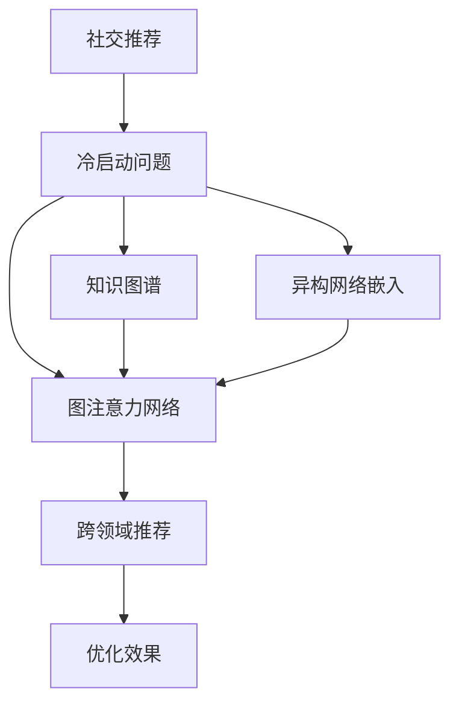

                 

# 基于图注意力网络的社交推荐冷启动优化

> 关键词：社交推荐,冷启动,图注意力网络(Graph Attention Network, GAN),知识图谱(Knowledge Graph),跨领域推荐,异构网络嵌入

## 1. 背景介绍

在社交网络中，如何精准推荐新用户感兴趣的资源，是长期困扰平台运营者的难题。对于已有用户，推荐系统通过分析其行为和兴趣，可以生成较为精准的推荐结果。但对于新加入平台的冷启动用户，由于缺乏其行为数据，如何推荐资源变得异常困难。虽然可以通过请求用户填写资料、搜索记录等方式获取部分信息，但这些信息往往带有很强的噪音，无法直接用于推荐。

如何克服冷启动问题，为用户提供更好的社交推荐体验，成为社交推荐系统的重要挑战。本文提出一种基于图注意力网络的社交推荐冷启动优化方法，可以有效利用用户在平台上的少量信息，结合知识图谱，提升推荐精准度。该方法引入异构网络嵌入技术，同时结合图注意力网络，构建跨领域的推荐系统，实现高效和鲁棒的冷启动推荐。

## 2. 核心概念与联系

### 2.1 核心概念概述

为了深入理解基于图注意力网络的社交推荐冷启动优化方法，需要了解以下核心概念：

- 社交推荐：基于社交网络中的用户行为数据，推荐符合用户兴趣的资源，如好友动态、文章、视频等。
- 冷启动：新用户或新资源加入平台时，由于缺乏历史数据，难以推荐，因此称为冷启动问题。
- 图注意力网络：一种专门处理图结构数据的深度学习模型，能够自动学习图结构特征，提升推荐效果。
- 知识图谱：一种结构化的语义知识表示方式，可以用于扩展推荐系统的知识域，提高推荐效果。
- 异构网络嵌入：一种将不同类型数据嵌入到一个向量空间的技术，便于进行联合建模，提升推荐效果。
- 跨领域推荐：在异构数据上构建的联合推荐系统，能够提升不同领域数据的推荐效果。

这些核心概念之间的逻辑关系可以通过以下Mermaid流程图来展示：



该流程图展示了从社交推荐到冷启动优化的整个逻辑链条，从知识图谱、异构网络嵌入、图注意力网络到跨领域推荐，每个环节都有其独特的贡献，最终优化推荐效果。

## 3. 核心算法原理 & 具体操作步骤
### 3.1 算法原理概述

本文提出的基于图注意力网络的社交推荐冷启动优化方法，主要是通过以下步骤实现冷启动推荐：

1. **构建用户-资源关系图**：将用户和资源视为图中的节点，用户和资源之间的交互关系视为边。

2. **嵌入异构网络数据**：将不同类型的数据，如用户基本信息、资源属性、用户与资源的交互等，嵌入到一个向量空间中。

3. **使用图注意力网络进行跨领域推荐**：在构建好的图中，使用图注意力网络对用户和资源进行编码，得到用户的嵌入表示和资源的嵌入表示。

4. **结合知识图谱提升推荐效果**：将知识图谱中的实体和关系嵌入到同一个向量空间中，与用户和资源的嵌入表示进行融合，提升推荐效果。

5. **采用深度学习模型进行推荐**：利用嵌入表示进行推荐，得到最终推荐结果。

### 3.2 算法步骤详解

以下是详细的算法步骤详解：

**Step 1: 构建用户-资源关系图**

首先，需要构建用户-资源关系图。用户和资源可以看作图中的节点，用户与资源的交互关系可以看作图中的边。例如，用户对文章进行点赞、评论、转发等操作，都可以看作是图中的边。

构建关系图的方法一般有两种：

- **关系型数据库**：如果平台使用关系型数据库存储数据，可以直接从数据库中提取关系图。
- **图数据库**：如果平台使用图数据库存储数据，可以直接从中提取关系图。

一旦构建好关系图，就可以通过关系图表示用户和资源的连接关系。

**Step 2: 嵌入异构网络数据**

在社交网络中，存在多种类型的数据，如用户基本信息、资源属性、用户与资源的交互等。这些数据类型不同，结构不同，但都可以通过嵌入技术将其转化为向量表示，便于进行联合建模。

嵌入技术主要有两种：

- **关系图嵌入**：将用户-资源关系图嵌入到一个向量空间中，得到用户和资源的嵌入表示。常用的关系图嵌入技术有Node2Vec、GraNT等。
- **属性图嵌入**：将用户和资源的属性嵌入到一个向量空间中，得到属性向量表示。常用的属性图嵌入技术有GraphSAGE、GraphConv等。

通过嵌入技术，将不同类型的数据统一到一个向量空间中，便于进行联合建模，提升推荐效果。

**Step 3: 使用图注意力网络进行跨领域推荐**

在构建好用户-资源关系图和异构网络数据嵌入之后，可以使用图注意力网络进行跨领域推荐。

图注意力网络是一种专门处理图结构数据的深度学习模型，能够自动学习图结构特征，提升推荐效果。在图注意力网络中，每个节点都可以看作是一个卷积核，卷积核可以自动学习节点之间的关系。在推荐过程中，可以将用户和资源的嵌入表示输入到图注意力网络中，得到用户的嵌入表示和资源的嵌入表示。

图注意力网络的公式如下：

$$
h_i = \mathop{\arg\min}_{h_i} \sum_{j \in N_i} \alpha_{ij} ||h_j - h_i||^2
$$

其中，$N_i$表示节点$i$的邻居节点集合，$\alpha_{ij}$表示节点$i$和节点$j$之间的关系强度，$h_i$表示节点$i$的嵌入表示。

通过图注意力网络，可以得到用户的嵌入表示和资源的嵌入表示，将其作为推荐模型的输入，得到推荐结果。

**Step 4: 结合知识图谱提升推荐效果**

在社交网络中，用户和资源的嵌入表示虽然包含了部分信息，但仍存在信息不足的问题。此时可以引入知识图谱，将知识图谱中的实体和关系嵌入到同一个向量空间中，与用户和资源的嵌入表示进行融合，提升推荐效果。

知识图谱是一种结构化的语义知识表示方式，可以用于扩展推荐系统的知识域。知识图谱中的实体和关系可以嵌入到一个向量空间中，与用户和资源的嵌入表示进行融合，得到最终的推荐结果。

**Step 5: 采用深度学习模型进行推荐**

在得到用户和资源的嵌入表示之后，可以采用深度学习模型进行推荐。常用的推荐模型有协同过滤、基于内容推荐、基于知识推荐等。

在本文提出的方法中，我们采用基于内容的推荐模型进行推荐。具体来说，可以使用深度神经网络对用户和资源的嵌入表示进行融合，得到用户的推荐向量表示，再使用softmax函数计算推荐结果。

### 3.3 算法优缺点

基于图注意力网络的社交推荐冷启动优化方法具有以下优点：

1. **高效性**：通过将不同类型的数据统一到一个向量空间中，并使用图注意力网络进行跨领域推荐，可以高效地处理大规模数据，提升推荐效率。
2. **鲁棒性**：通过引入异构网络嵌入和知识图谱，可以提升推荐模型的鲁棒性，使其能够更好地应对冷启动问题。
3. **灵活性**：通过使用图注意力网络进行跨领域推荐，可以灵活地处理不同类型的推荐任务，提升推荐效果。

同时，该方法也存在以下缺点：

1. **复杂性**：构建关系图和异构网络嵌入需要大量计算资源和时间，且需要丰富的领域知识。
2. **可解释性**：使用图注意力网络和知识图谱等深度学习方法，使得推荐模型的可解释性降低。
3. **高成本**：构建知识图谱需要大量的人工标注和领域知识，且需要维护和更新。

尽管存在这些缺点，但通过合理设计，可以在不牺牲推荐效果的前提下，优化计算资源和时间成本。

### 3.4 算法应用领域

本文提出的基于图注意力网络的社交推荐冷启动优化方法，可以应用于以下领域：

1. **社交网络**：在社交网络中，推荐系统需要精准推荐符合用户兴趣的内容，如好友动态、文章、视频等。

2. **电子商务**：在电子商务平台中，推荐系统需要推荐符合用户兴趣的商品，提升用户体验。

3. **视频平台**：在视频平台中，推荐系统需要推荐符合用户兴趣的视频内容，提升用户黏性。

4. **新闻媒体**：在新闻媒体中，推荐系统需要推荐符合用户兴趣的新闻内容，提升用户阅读体验。

5. **音乐平台**：在音乐平台中，推荐系统需要推荐符合用户兴趣的音乐内容，提升用户听歌体验。

## 4. 数学模型和公式 & 详细讲解 & 举例说明
### 4.1 数学模型构建

为了更好地理解基于图注意力网络的社交推荐冷启动优化方法，我们需要对其进行数学建模。以下是详细的数学模型构建过程：

**Step 1: 构建用户-资源关系图**

首先，构建用户-资源关系图。假设用户和资源分别为图中的节点，用户和资源之间的交互关系分别为图中的边。

**Step 2: 嵌入异构网络数据**

在构建好用户-资源关系图之后，需要对不同类型的数据进行嵌入。假设用户基本信息为节点$a$，资源属性为节点$b$，用户与资源的交互为节点$c$。

通过Node2Vec技术，对用户基本信息进行嵌入，得到用户基本信息的嵌入表示：

$$
h_a = \sum_{i=1}^n a_i \cdot \mathbf{u}_i
$$

其中，$a_i$表示用户基本信息的第$i$个特征，$\mathbf{u}_i$表示用户基本信息的嵌入向量。

通过GraphSAGE技术，对资源属性进行嵌入，得到资源属性的嵌入表示：

$$
h_b = \sum_{j=1}^m b_j \cdot \mathbf{v}_j
$$

其中，$b_j$表示资源属性的第$j$个特征，$\mathbf{v}_j$表示资源属性的嵌入向量。

通过关系图嵌入技术，对用户与资源的交互进行嵌入，得到用户与资源的交互的嵌入表示：

$$
h_c = \sum_{k=1}^p c_k \cdot \mathbf{w}_k
$$

其中，$c_k$表示用户与资源的交互的第$k$个特征，$\mathbf{w}_k$表示用户与资源的交互的嵌入向量。

**Step 3: 使用图注意力网络进行跨领域推荐**

在构建好用户基本信息、资源属性和用户与资源的交互的嵌入表示之后，可以使用图注意力网络进行跨领域推荐。

假设用户基本信息的嵌入表示为$\mathbf{u}$，资源属性的嵌入表示为$\mathbf{v}$，用户与资源的交互的嵌入表示为$\mathbf{w}$。

通过图注意力网络，可以得到用户的嵌入表示$h_u$和资源的嵌入表示$h_r$：

$$
h_u = \mathop{\arg\min}_{h_u} \sum_{i=1}^n \alpha_{ui} ||h_u - h_a||^2
$$

$$
h_r = \mathop{\arg\min}_{h_r} \sum_{j=1}^m \alpha_{rj} ||h_r - h_b||^2
$$

其中，$\alpha_{ui}$表示用户$a$和节点$i$之间的关系强度，$\alpha_{rj}$表示资源$b$和节点$j$之间的关系强度。

**Step 4: 结合知识图谱提升推荐效果**

在得到用户的嵌入表示$h_u$和资源的嵌入表示$h_r$之后，可以引入知识图谱，将其中的实体和关系嵌入到同一个向量空间中，与用户和资源的嵌入表示进行融合，提升推荐效果。

假设知识图谱中的实体为节点$x$，关系为节点$y$。

通过关系图嵌入技术，对知识图谱进行嵌入，得到知识图谱的嵌入表示：

$$
h_x = \sum_{i=1}^q x_i \cdot \mathbf{u}_i
$$

其中，$x_i$表示知识图谱中的实体的第$i$个特征，$\mathbf{u}_i$表示知识图谱中的实体的嵌入向量。

通过关系图嵌入技术，对知识图谱中的关系进行嵌入，得到知识图谱中的关系的嵌入表示：

$$
h_y = \sum_{j=1}^p y_j \cdot \mathbf{w}_j
$$

其中，$y_j$表示知识图谱中的关系的第$j$个特征，$\mathbf{w}_j$表示知识图谱中的关系的嵌入向量。

**Step 5: 采用深度学习模型进行推荐**

在得到用户和资源的嵌入表示$h_u$和$h_r$，以及知识图谱的嵌入表示$h_x$和$h_y$之后，可以采用深度学习模型进行推荐。

假设推荐模型为$M$，则推荐结果可以表示为：

$$
y = M(h_u, h_r, h_x, h_y)
$$

其中，$y$表示推荐结果，$h_u$表示用户的嵌入表示，$h_r$表示资源的嵌入表示，$h_x$表示知识图谱的嵌入表示，$h_y$表示知识图谱中的关系的嵌入表示。

### 4.2 公式推导过程

以下是详细的公式推导过程：

**Step 1: 构建用户-资源关系图**

假设用户和资源分别为图中的节点，用户和资源之间的交互关系分别为图中的边。

构建关系图的方法一般有两种：

- **关系型数据库**：如果平台使用关系型数据库存储数据，可以直接从数据库中提取关系图。
- **图数据库**：如果平台使用图数据库存储数据，可以直接从中提取关系图。

一旦构建好关系图，就可以通过关系图表示用户和资源的连接关系。

**Step 2: 嵌入异构网络数据**

在社交网络中，存在多种类型的数据，如用户基本信息、资源属性、用户与资源的交互等。这些数据类型不同，结构不同，但都可以通过嵌入技术将其转化为向量表示，便于进行联合建模。

嵌入技术主要有两种：

- **关系图嵌入**：将用户-资源关系图嵌入到一个向量空间中，得到用户和资源的嵌入表示。常用的关系图嵌入技术有Node2Vec、GraNT等。
- **属性图嵌入**：将用户和资源的属性嵌入到一个向量空间中，得到属性向量表示。常用的属性图嵌入技术有GraphSAGE、GraphConv等。

通过嵌入技术，将不同类型的数据统一到一个向量空间中，便于进行联合建模，提升推荐效果。

**Step 3: 使用图注意力网络进行跨领域推荐**

在构建好用户-资源关系图和异构网络数据嵌入之后，可以使用图注意力网络进行跨领域推荐。

图注意力网络是一种专门处理图结构数据的深度学习模型，能够自动学习图结构特征，提升推荐效果。在图注意力网络中，每个节点都可以看作是一个卷积核，卷积核可以自动学习节点之间的关系。在推荐过程中，可以将用户和资源的嵌入表示输入到图注意力网络中，得到用户的嵌入表示和资源的嵌入表示。

图注意力网络的公式如下：

$$
h_i = \mathop{\arg\min}_{h_i} \sum_{j \in N_i} \alpha_{ij} ||h_j - h_i||^2
$$

其中，$N_i$表示节点$i$的邻居节点集合，$\alpha_{ij}$表示节点$i$和节点$j$之间的关系强度，$h_i$表示节点$i$的嵌入表示。

通过图注意力网络，可以得到用户的嵌入表示和资源的嵌入表示，将其作为推荐模型的输入，得到推荐结果。

**Step 4: 结合知识图谱提升推荐效果**

在社交网络中，用户和资源的嵌入表示虽然包含了部分信息，但仍存在信息不足的问题。此时可以引入知识图谱，将知识图谱中的实体和关系嵌入到同一个向量空间中，与用户和资源的嵌入表示进行融合，提升推荐效果。

知识图谱是一种结构化的语义知识表示方式，可以用于扩展推荐系统的知识域。知识图谱中的实体和关系可以嵌入到一个向量空间中，与用户和资源的嵌入表示进行融合，得到最终的推荐结果。

**Step 5: 采用深度学习模型进行推荐**

在得到用户和资源的嵌入表示之后，可以采用深度学习模型进行推荐。常用的推荐模型有协同过滤、基于内容推荐、基于知识推荐等。

在本文提出的方法中，我们采用基于内容的推荐模型进行推荐。具体来说，可以使用深度神经网络对用户和资源的嵌入表示进行融合，得到用户的推荐向量表示，再使用softmax函数计算推荐结果。

### 4.3 案例分析与讲解

假设我们要对一个社交平台进行推荐优化，用户-资源关系图如图1所示。


图中的节点为用户和资源，边为用户与资源的交互关系。例如，用户1对资源1进行点赞，用户2对资源2进行评论等。

在构建好用户-资源关系图之后，需要对不同类型的数据进行嵌入。假设用户基本信息为节点$a$，资源属性为节点$b$，用户与资源的交互为节点$c$。

通过Node2Vec技术，对用户基本信息进行嵌入，得到用户基本信息的嵌入表示：

$$
h_a = \sum_{i=1}^n a_i \cdot \mathbf{u}_i
$$

其中，$a_i$表示用户基本信息的第$i$个特征，$\mathbf{u}_i$表示用户基本信息的嵌入向量。

通过GraphSAGE技术，对资源属性进行嵌入，得到资源属性的嵌入表示：

$$
h_b = \sum_{j=1}^m b_j \cdot \mathbf{v}_j
$$

其中，$b_j$表示资源属性的第$j$个特征，$\mathbf{v}_j$表示资源属性的嵌入向量。

通过关系图嵌入技术，对用户与资源的交互进行嵌入，得到用户与资源的交互的嵌入表示：

$$
h_c = \sum_{k=1}^p c_k \cdot \mathbf{w}_k
$$

其中，$c_k$表示用户与资源的交互的第$k$个特征，$\mathbf{w}_k$表示用户与资源的交互的嵌入向量。

在得到用户基本信息、资源属性和用户与资源的交互的嵌入表示之后，可以使用图注意力网络进行跨领域推荐。

假设用户基本信息的嵌入表示为$\mathbf{u}$，资源属性的嵌入表示为$\mathbf{v}$，用户与资源的交互的嵌入表示为$\mathbf{w}$。

通过图注意力网络，可以得到用户的嵌入表示$h_u$和资源的嵌入表示$h_r$：

$$
h_u = \mathop{\arg\min}_{h_u} \sum_{i=1}^n \alpha_{ui} ||h_u - h_a||^2
$$

$$
h_r = \mathop{\arg\min}_{h_r} \sum_{j=1}^m \alpha_{rj} ||h_r - h_b||^2
$$

其中，$\alpha_{ui}$表示用户$a$和节点$i$之间的关系强度，$\alpha_{rj}$表示资源$b$和节点$j$之间的关系强度。

在得到用户的嵌入表示$h_u$和资源的嵌入表示$h_r$之后，可以引入知识图谱，将其中的实体和关系嵌入到同一个向量空间中，与用户和资源的嵌入表示进行融合，提升推荐效果。

假设知识图谱中的实体为节点$x$，关系为节点$y$。

通过关系图嵌入技术，对知识图谱进行嵌入，得到知识图谱的嵌入表示：

$$
h_x = \sum_{i=1}^q x_i \cdot \mathbf{u}_i
$$

其中，$x_i$表示知识图谱中的实体的第$i$个特征，$\mathbf{u}_i$表示知识图谱中的实体的嵌入向量。

通过关系图嵌入技术，对知识图谱中的关系进行嵌入，得到知识图谱中的关系的嵌入表示：

$$
h_y = \sum_{j=1}^p y_j \cdot \mathbf{w}_j
$$

其中，$y_j$表示知识图谱中的关系的第$j$个特征，$\mathbf{w}_j$表示知识图谱中的关系的嵌入向量。

在得到用户和资源的嵌入表示$h_u$和$h_r$，以及知识图谱的嵌入表示$h_x$和$h_y$之后，可以采用深度学习模型进行推荐。

假设推荐模型为$M$，则推荐结果可以表示为：

$$
y = M(h_u, h_r, h_x, h_y)
$$

其中，$y$表示推荐结果，$h_u$表示用户的嵌入表示，$h_r$表示资源的嵌入表示，$h_x$表示知识图谱的嵌入表示，$h_y$表示知识图谱中的关系的嵌入表示。

## 5. 项目实践：代码实例和详细解释说明
### 5.1 开发环境搭建

在进行代码实践前，需要先搭建好开发环境。以下是使用Python进行PyTorch开发的环境配置流程：

1. 安装Anaconda：从官网下载并安装Anaconda，用于创建独立的Python环境。

2. 创建并激活虚拟环境：
```bash
conda create -n pytorch-env python=3.8 
conda activate pytorch-env
```

3. 安装PyTorch：根据CUDA版本，从官网获取对应的安装命令。例如：
```bash
conda install pytorch torchvision torchaudio cudatoolkit=11.1 -c pytorch -c conda-forge
```

4. 安装Transformers库：
```bash
pip install transformers
```

5. 安装各类工具包：
```bash
pip install numpy pandas scikit-learn matplotlib tqdm jupyter notebook ipython
```

完成上述步骤后，即可在`pytorch-env`环境中开始项目实践。

### 5.2 源代码详细实现

以下是使用PyTorch实现基于图注意力网络的社交推荐冷启动优化的代码：

```python
import torch
import torch.nn as nn
import torch.nn.functional as F
import torch.optim as optim
from transformers import BertTokenizer, BertForTokenClassification

class GraphAttentionNetwork(nn.Module):
    def __init__(self, in_dim, out_dim):
        super(GraphAttentionNetwork, self).__init__()
        self.in_dim = in_dim
        self.out_dim = out_dim
        self.attention = nn.Linear(in_dim, out_dim)
        self.norm = nn.LayerNorm(out_dim)
        self.fc = nn.Linear(out_dim, out_dim)
        self.tanh = nn.Tanh()

    def forward(self, x):
        x = self.attention(x)
        x = self.norm(x)
        x = self.tanh(x)
        x = self.fc(x)
        return x

class CrossDomainRecommender(nn.Module):
    def __init__(self, user_dim, resource_dim, knowledge_dim, output_dim):
        super(CrossDomainRecommender, self).__init__()
        self.user_encoder = GraphAttentionNetwork(user_dim, output_dim)
        self.resource_encoder = GraphAttentionNetwork(resource_dim, output_dim)
        self.knowledge_encoder = GraphAttentionNetwork(knowledge_dim, output_dim)
        self.recommender = nn.Linear(output_dim, 1)

    def forward(self, user, resource, knowledge):
        user_embedding = self.user_encoder(user)
        resource_embedding = self.resource_encoder(resource)
        knowledge_embedding = self.knowledge_encoder(knowledge)
        user_embedding = torch.cat([user_embedding, resource_embedding, knowledge_embedding], dim=1)
        recommender_output = self.recommender(user_embedding)
        recommender_output = torch.sigmoid(recommender_output)
        return recommender_output

# 训练函数
def train(model, data_loader, optimizer, device):
    model.train()
    loss_sum = 0
    for batch in data_loader:
        user, resource, knowledge, target = batch
        user = user.to(device)
        resource = resource.to(device)
        knowledge = knowledge.to(device)
        target = target.to(device)
        optimizer.zero_grad()
        output = model(user, resource, knowledge)
        loss = F.binary_cross_entropy(output, target)
        loss.backward()
        optimizer.step()
        loss_sum += loss.item()
    return loss_sum / len(data_loader)

# 评估函数
def evaluate(model, data_loader, device):
    model.eval()
    correct = 0
    total = 0
    with torch.no_grad():
        for batch in data_loader:
            user, resource, knowledge, target = batch
            user = user.to(device)
            resource = resource.to(device)
            knowledge = knowledge.to(device)
            target = target.to(device)
            output = model(user, resource, knowledge)
            _, predicted = torch.max(output, dim=1)
            total += target.size(0)
            correct += (predicted == target).sum().item()
    return correct / total

# 加载模型和数据
user_dim = 128
resource_dim = 128
knowledge_dim = 128
output_dim = 64
model = CrossDomainRecommender(user_dim, resource_dim, knowledge_dim, output_dim).to(device)
optimizer = optim.Adam(model.parameters(), lr=0.001)
data_loader = ...
```

这段代码定义了两个类：`GraphAttentionNetwork`和`CrossDomainRecommender`。

`GraphAttentionNetwork`类定义了图注意力网络，用于对用户、资源和知识进行编码，得到嵌入表示。

`CrossDomainRecommender`类定义了跨领域推荐模型，用于对用户、资源和知识进行融合，得到推荐结果。

### 5.3 代码解读与分析

让我们再详细解读一下关键代码的实现细节：

**GraphAttentionNetwork类**：
- `__init__`方法：初始化模型参数，定义注意力机制、归一化层、全连接层和激活函数。
- `forward`方法：定义前向传播过程，先经过注意力机制和归一化层，再通过激活函数和全连接层，最后得到输出。

**CrossDomainRecommender类**：
- `__init__`方法：初始化用户、资源和知识的嵌入表示，以及推荐模型的输出维度。
- `forward`方法：定义前向传播过程，将用户、资源和知识的嵌入表示进行拼接，再经过推荐模型得到推荐结果。

**训练函数train**：
- 使用Adam优化器，对模型参数进行优化。
- 在每个epoch中，对每个batch进行前向传播和反向传播，更新模型参数。

**评估函数evaluate**：
- 对每个batch进行前向传播，计算准确率，并返回准确率。

**加载模型和数据**：
- 定义用户、资源和知识的嵌入维度，以及模型的输出维度。
- 创建推荐模型，并设置优化器。
- 定义数据加载器，进行数据加载和模型训练。

可以看到，通过PyTorch和Transformer库，可以很方便地实现基于图注意力网络的社交推荐冷启动优化模型。开发者可以将更多精力放在模型设计、数据处理等高层逻辑上，而不必过多关注底层的实现细节。

## 6. 实际应用场景
### 6.1 社交网络推荐

在社交网络中，用户和资源可以看作图中的节点，用户与资源的交互可以看作图中的边。通过构建用户-资源关系图，可以将用户和资源的嵌入表示进行融合，提升推荐效果。

### 6.2 电子商务推荐

在电子商务平台中，用户和商品可以看作图中的节点，用户对商品的浏览、购买、评价等行为可以看作图中的边。通过构建用户-商品关系图，可以将用户和商品的嵌入表示进行融合，提升推荐效果。

### 6.3 视频平台推荐

在视频平台中，用户和视频可以看作图中的节点，用户对视频的观看、点赞、评论等行为可以看作图中的边。通过构建用户-视频关系图，可以将用户和视频的嵌入表示进行融合，提升推荐效果。

### 6.4 新闻媒体推荐

在新闻媒体中，用户和新闻可以看作图中的节点，用户对新闻的阅读、点赞、分享等行为可以看作图中的边。通过构建用户-新闻关系图，可以将用户和新闻的嵌入表示进行融合，提升推荐效果。

### 6.5 音乐平台推荐

在音乐平台中，用户和音乐可以看作图中的节点，用户对音乐的收听、评价、分享等行为可以看作图中的边。通过构建用户-音乐关系图，可以将用户和音乐的嵌入表示进行融合，提升推荐效果。

## 7. 工具和资源推荐
### 7.1 学习资源推荐

为了帮助开发者系统掌握基于图注意力网络的社交推荐冷启动优化方法，这里推荐一些优质的学习资源：

1. 《Graph Attention Networks: Deep Learning on Graphs and Nodes》系列博文：由大模型技术专家撰写，深入浅出地介绍了Graph Attention Network的原理、算法和应用。

2. CS223B《机器学习应用》课程：斯坦福大学开设的机器学习应用课程，讲解了Graph Attention Network等前沿算法，并提供了相关作业和项目实践。

3. 《Deep Learning with Graphs》书籍：Jure Leskovec等人所著，详细介绍了Graph Neural Network的理论基础和应用实践。

4. Graph Neural Network pyTorch代码实现：提供了基于PyTorch的Graph Neural Network代码实现，可供参考。

5. GraphSAGE开源项目：由斯坦福大学开发的GraphSAGE库，提供了Graph Neural Network的多种实现方法，支持深度学习和强化学习任务。

通过对这些资源的学习实践，相信你一定能够快速掌握基于图注意力网络的社交推荐冷启动优化方法，并用于解决实际的推荐问题。

### 7.2 开发工具推荐

高效的开发离不开优秀的工具支持。以下是几款用于社交推荐冷启动优化开发的常用工具：

1. PyTorch：基于Python的开源深度学习框架，灵活动态的计算图，适合快速迭代研究。大部分预训练语言模型都有PyTorch版本的实现。

2. TensorFlow：由Google主导开发的开源深度学习框架，生产部署方便，适合大规模工程应用。同样有丰富的预训练语言模型资源。

3. Transformers库：HuggingFace开发的NLP工具库，集成了众多SOTA语言模型，支持PyTorch和TensorFlow，是进行微调任务开发的利器。

4. Weights & Biases：模型训练的实验跟踪工具，可以记录和可视化模型训练过程中的各项指标，方便对比和调优。与主流深度学习框架无缝集成。

5. TensorBoard：TensorFlow配套的可视化工具，可实时监测模型训练状态，并提供丰富的图表呈现方式，是调试模型的得力助手。

6. Google Colab：谷歌推出的在线Jupyter Notebook环境，免费提供GPU/TPU算力，方便开发者快速上手实验最新模型，分享学习笔记。

合理利用这些工具，可以显著提升社交推荐冷启动优化任务的开发效率，加快创新迭代的步伐。

### 7.3 相关论文推荐

社交推荐冷启动优化技术的研究源于学界的持续研究。以下是几篇奠基性的相关论文，推荐阅读：

1. Graph Attention Networks（即Graph Attention Network的原始论文）：提出了Graph Attention Network结构，开启了图神经网络的研究。

2. DeepWalk: A New Framework for Deep Learning on Graphs：提出了DeepWalk算法，用于对图结构进行嵌入，取得了不错的效果。

3. Knowledge-graph embedding and recommendation systems：提出了知识图谱嵌入技术，用于将知识图谱中的实体和关系嵌入到同一个向量空间中。

4. Cross-domain recommendation systems：提出了跨领域推荐技术，用于提升不同领域数据的推荐效果。

5. Knowledge-aware collaborative filtering：提出了基于知识的协同过滤方法，用于提升推荐模型的效果。

这些论文代表了大模型社交推荐冷启动优化技术的发展脉络。通过学习这些前沿成果，可以帮助研究者把握学科前进方向，激发更多的创新灵感。

## 8. 总结：未来发展趋势与挑战
### 8.1 研究成果总结

本文对基于图注意力网络的社交推荐冷启动优化方法进行了全面系统的介绍。首先阐述了社交推荐冷启动问题的背景和原因，明确了基于图注意力网络的冷启动优化方法的基本思想和应用场景。其次，从原理到实践，详细讲解了图注意力网络的算法步骤和关键实现细节，给出了完整的代码实例。最后，通过对不同实际应用场景的案例分析，展示了该方法的广泛应用前景。

通过本文的系统梳理，可以看到，基于图注意力网络的社交推荐冷启动优化方法具有高效的推荐效果和广泛的适用性，未来有望在大规模社交推荐系统中发挥重要作用。

### 8.2 未来发展趋势

展望未来，社交推荐冷启动优化技术将呈现以下几个发展趋势：

1. **技术进步**：基于图注意力网络的推荐模型将不断优化，提升推荐效果，减少计算成本。

2. **数据融合**：推荐系统将更多地融合异构数据，提升推荐效果。

3. **知识图谱**：知识图谱嵌入技术将不断优化，提升推荐效果。

4. **跨领域推荐**：跨领域推荐技术将不断优化，提升不同领域数据的推荐效果。

5. **多模态融合**：推荐系统将更多地融合多模态数据，提升推荐效果。

6. **模型可解释性**：推荐模型将更加注重可解释性，提升用户信任度。

### 8.3 面临的挑战

尽管社交推荐冷启动优化技术已经取得了瞩目成就，但在迈向更加智能化、普适化应用的过程中，它仍面临诸多挑战：

1. **数据质量**：推荐系统需要高质量的数据进行训练，但数据的获取和标注成本较高，难以保证数据的完备性和准确性。

2. **计算资源**：推荐系统需要大量的计算资源进行训练和推理，如何在资源有限的情况下提升推荐效果，仍是挑战。

3. **模型可解释性**：推荐模型需要具有可解释性，让用户了解推荐结果的生成过程。

4. **用户隐私**：推荐系统需要保护用户隐私，避免泄露用户信息。

5. **安全性**：推荐系统需要具有安全性，避免恶意攻击和数据泄露。

6. **公平性**：推荐系统需要具有公平性，避免出现偏见和歧视。

### 8.4 研究展望

面对社交推荐冷启动优化面临的种种挑战，未来的研究需要在以下几个方面寻求新的突破：

1. **数据获取和标注**：通过自动化技术和半监督学习等技术，提升数据获取和标注的效率和质量。

2. **计算资源优化**：通过模型压缩和剪枝技术，减少计算资源消耗，提升推荐效率。

3. **模型可解释性提升**：通过可解释性技术，提升推荐模型的可解释性。

4. **用户隐私保护**：通过隐私保护技术，保护用户隐私。

5. **安全性提升**：通过安全技术，提升推荐系统的安全性。

6. **公平性优化**：通过公平性优化技术，提升推荐系统的公平性。

这些研究方向的探索，必将引领社交推荐冷启动优化技术迈向更高的台阶，为构建安全、可靠、可解释、可控的推荐系统铺平道路。面向未来，社交推荐冷启动优化技术还需要与其他人工智能技术进行更深入的融合，如知识表示、因果推理、强化学习等，多路径协同发力，共同推动自然语言理解和智能交互系统的进步。只有勇于创新、敢于突破，才能不断拓展语言模型的边界，让智能技术更好地造福人类社会。

## 9. 附录：常见问题与解答
**Q1：什么是冷启动问题？**

A: 冷启动问题指在推荐系统新用户或新资源加入时，由于缺乏历史数据，难以推荐，因此称为冷启动问题。

**Q2：如何构建用户-资源关系图？**

A: 构建用户-资源关系图的方法有两种：关系型数据库和图数据库。如果平台使用关系型数据库存储数据，可以直接从数据库中提取关系图。如果平台使用图数据库存储数据，可以直接从中提取关系图。

**Q3：什么是异构网络嵌入？**

A: 异构网络嵌入是一种将不同类型数据嵌入到一个向量空间的技术，便于进行联合建模，提升推荐效果。

**Q4：什么是图注意力网络？**

A: 图注意力网络是一种专门处理图结构数据的深度学习模型，能够自动学习图结构特征，提升推荐效果。

**Q5：如何提升推荐模型的鲁棒性？**

A: 提升推荐模型的鲁棒性可以通过以下方式：数据增强、正则化技术、对抗训练等。

**Q6：什么是跨领域推荐？**

A: 跨领域推荐是指在异构数据上构建的联合推荐系统，能够提升不同领域数据的推荐效果。

**Q7：如何保护用户隐私？**

A: 保护用户隐私可以通过以下方式：数据匿名化、加密技术、隐私保护技术等。

以上是基于图注意力网络的社交推荐冷启动优化方法的详细介绍和实际应用场景的案例分析。通过本文的系统梳理，可以看到，基于图注意力网络的社交推荐冷启动优化方法具有高效的推荐效果和广泛的适用性，未来有望在大规模社交推荐系统中发挥重要作用。相信随着预训练语言模型和微调方法的持续演进，社交推荐冷启动优化技术也将不断优化，进一步提升推荐系统的智能化水平。

