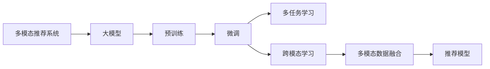

                 

## 1. 背景介绍

在互联网快速发展的背景下，信息推荐系统在电商、社交、娱乐等多个领域得到了广泛应用，极大地提升了用户的使用体验和平台价值。推荐系统通过对用户行为数据的深度分析，预测用户的潜在需求，提供个性化推荐内容，引导用户探索更多有价值的信息。然而，传统的推荐系统往往只考虑用户历史行为数据，难以充分挖掘和整合多源异构数据，因此，单一的模态推荐已无法满足用户日益增长的个性化需求。

随着人工智能技术的不断进步，基于深度学习的多模态推荐系统成为新的研究热点。多模态推荐系统通过整合用户的多模态数据（如文本、图像、音频等），构建更加丰富、准确的模型，显著提升了推荐系统的性能和覆盖面。其中，基于大模型的多模态推荐系统凭借其强大的数据表达能力和泛化能力，近年来受到广泛关注。

## 2. 核心概念与联系

### 2.1 核心概念概述

为更好地理解基于大模型的多模态推荐系统，本节将介绍几个密切相关的核心概念：

- 多模态推荐系统：通过整合用户的多模态数据，构建跨模态的推荐模型，提升推荐系统的精度和覆盖率。常见的多模态推荐任务包括文本-图像推荐、音频推荐、跨模态情感分析等。

- 大模型：指基于大规模数据进行预训练的语言模型，如BERT、GPT等。大模型能够学习到丰富的语言知识，具备强大的表征能力，在多模态推荐系统中被广泛应用。

- 预训练-微调：指在大规模无标签数据上进行预训练，然后使用有标签数据对模型进行微调的范式。这种范式能够在大规模语料中学习到通用的语言表示，并通过微调适配特定任务。

- 多任务学习：指同时训练多个相关但不同的子任务，以共享模型参数、提高模型性能。多任务学习在大模型的预训练和微调中得到了广泛应用。

- 跨模态学习：指学习跨模态数据的共同表示，使得不同模态的数据能够在同一个特征空间中融合和匹配。

这些核心概念之间通过多个关键技术环节连接，共同构成基于大模型的多模态推荐系统。

### 2.2 核心概念原理和架构的 Mermaid 流程图(Mermaid 流程节点中不要有括号、逗号等特殊字符)



这个流程图展示了多模态推荐系统从数据输入到推荐输出的主要流程：

1. 多模态推荐系统通过用户的多模态数据输入预训练大模型。
2. 大模型在大规模无标签数据上进行预训练，学习通用的语言知识。
3. 预训练后的模型通过微调适配特定推荐任务，如文本-图像推荐、音频推荐等。
4. 多任务学习用于同时训练多个相关但不同的子任务，如情感分析、意图识别等，共享模型参数。
5. 跨模态学习用于融合不同模态的数据，如将文本和图像数据转换为共同的特征表示。
6. 最终将不同模态的数据融合到推荐模型中，输出个性化推荐内容。

## 3. 核心算法原理 & 具体操作步骤
### 3.1 算法原理概述

基于大模型的多模态推荐系统，本质上是利用预训练大模型对用户多模态数据进行编码，并在此基础上进行多任务学习、跨模态学习和融合，构建推荐模型，生成个性化推荐内容。

在推荐系统中，用户行为数据可以包含多种模态，如文本、图像、音频等。其中，文本数据通常包括用户的历史点击、评分、评论等；图像数据可能来源于用户上传的图片或商品图片；音频数据则可能来自用户的语音搜索或音乐喜好。这些多模态数据需要通过预训练大模型进行编码，转化为低维度的语义表示。

然后，通过对这些语义表示进行多任务学习和跨模态学习，构建推荐模型。多任务学习用于同时训练多个相关但不同的子任务，如情感分析、意图识别等，共享模型参数，提高模型泛化能力。跨模态学习则用于学习不同模态数据的共同表示，使得模型能够在不同模态之间进行匹配和融合。

最后，将不同模态的数据融合到推荐模型中，输出个性化推荐内容。常用的融合方式包括拼接、加权平均、注意力机制等。拼接是最简单直接的融合方式，将不同模态的表示向量直接拼接；加权平均则考虑不同模态的重要程度，对每个模态的表示进行加权；注意力机制则根据不同模态的相关程度，动态调整注意力权重，实现更智能的融合。

### 3.2 算法步骤详解

基于大模型的多模态推荐系统通常包括以下几个关键步骤：

**Step 1: 多模态数据预处理**

- 收集用户的多模态数据，包括文本、图像、音频等。
- 对文本数据进行分词、去除停用词等预处理操作，生成词向量表示。
- 对图像数据进行特征提取，生成高维特征向量。
- 对音频数据进行特征提取，生成时频特征或MFCC特征等。

**Step 2: 预训练大模型编码**

- 使用预训练大模型（如BERT、GPT等）对不同模态的数据进行编码，生成语义表示。
- 根据多模态数据的特征，选择合适的预训练模型及其参数进行微调。

**Step 3: 多任务学习**

- 定义多个推荐子任务，如情感分析、意图识别等。
- 使用多任务学习框架，如MAML（Multi-task Meta Learning）、MLP（Multi-task Learning）等，共享模型参数。
- 在训练过程中，每个子任务都会同时更新模型参数，增强模型的泛化能力。

**Step 4: 跨模态学习**

- 选择合适的跨模态学习方法，如最大互信息（Maximal Mutual Information, MMI）、对偶编码（Dual Encoding）等。
- 将不同模态的数据表示映射到共同的特征空间，实现跨模态的匹配和融合。

**Step 5: 推荐模型构建**

- 将不同模态的数据融合到推荐模型中，如拼接、加权平均、注意力机制等。
- 使用融合后的语义表示作为输入，构建推荐模型，生成个性化推荐内容。
- 使用监督数据训练推荐模型，输出推荐结果。

### 3.3 算法优缺点

基于大模型的多模态推荐系统有以下优点：

- 强大的数据表达能力：大模型能够学习到丰富的语言知识，具备强大的表征能力，可以充分挖掘和整合多模态数据。
- 泛化能力强：通过预训练-微调范式，模型可以学习到通用的语言表示，通过微调适配特定任务，具备较强的泛化能力。
- 灵活的模型设计：多任务学习、跨模态学习等技术使得模型设计更加灵活多样，能够应对复杂多变的推荐场景。
- 推荐精度高：通过多模态数据的融合和匹配，可以生成更加精准、个性化的推荐内容。

同时，该方法也存在一定的局限性：

- 对数据质量依赖较高：多模态数据的收集和预处理需要耗费大量时间和精力，且不同模态的数据质量参差不齐。
- 计算资源需求高：大模型的训练和推理需要大量的计算资源，包括高性能GPU、TPU等设备。
- 模型复杂度高：多模态推荐系统通常包含多个模块，包括预训练大模型、多任务学习、跨模态学习等，模型结构复杂，难以调试和优化。
- 部署难度大：将多模态推荐系统部署到生产环境，需要进行多轮优化和测试，难度较大。

尽管存在这些局限性，但基于大模型的多模态推荐系统仍是大规模推荐系统的理想选择，特别是在对推荐精度和覆盖率要求较高的场景中。

### 3.4 算法应用领域

基于大模型的多模态推荐系统已经在电商、社交、娱乐等多个领域得到了广泛应用，取得了显著的效果：

- 电商推荐：在电商平台中，多模态推荐系统能够通过用户的文本评论、图片浏览等行为数据，生成更加精准、个性化的商品推荐。
- 社交推荐：在社交平台中，多模态推荐系统能够根据用户的互动记录、图片分享等行为数据，推荐更多符合用户兴趣的内容。
- 视频推荐：在视频平台中，多模态推荐系统能够根据用户的观看历史、评论反馈等数据，推荐更多优质的视频内容。
- 音乐推荐：在音乐平台中，多模态推荐系统能够根据用户的听歌历史、评分反馈等数据，推荐更多符合用户喜好的音乐。

除了这些常见应用外，多模态推荐系统还可以用于体育赛事推荐、旅游目的地推荐、财经新闻推荐等场景，为不同领域的应用提供有力的技术支持。

## 4. 数学模型和公式 & 详细讲解  
### 4.1 数学模型构建

基于大模型的多模态推荐系统，可以从以下几个方面进行数学建模：

- **多模态数据表示**：将不同模态的数据表示为低维度的向量，如文本使用词向量表示，图像使用特征向量表示，音频使用MFCC特征表示。
- **预训练大模型编码**：使用预训练大模型对不同模态的数据进行编码，生成语义表示。
- **多任务学习**：定义多个推荐子任务，如情感分析、意图识别等，共享模型参数。
- **跨模态学习**：学习不同模态数据的共同表示，实现跨模态的匹配和融合。
- **推荐模型构建**：将不同模态的数据融合到推荐模型中，生成个性化推荐内容。

### 4.2 公式推导过程

以下我们将以文本-图像推荐为例，进行数学建模和推导。

假设用户的多模态数据包含文本和图像两个模态，分别记为 $x_t$ 和 $x_i$，其中 $x_t$ 表示文本数据，$x_i$ 表示图像数据。使用预训练大模型对不同模态的数据进行编码，生成语义表示：

$$
z_t = M_{\theta_t}(x_t), \quad z_i = M_{\theta_i}(x_i)
$$

其中 $z_t$ 表示文本数据 $x_t$ 的语义表示，$z_i$ 表示图像数据 $x_i$ 的语义表示，$\theta_t$ 和 $\theta_i$ 分别表示文本和图像预训练大模型的参数。

接下来，对 $z_t$ 和 $z_i$ 进行多任务学习，定义多个推荐子任务，如情感分析、意图识别等，共享模型参数：

$$
y_{t_1} = T_1(z_t, z_i), \quad y_{t_2} = T_2(z_t, z_i), \quad \ldots, \quad y_{t_k} = T_k(z_t, z_i)
$$

其中 $y_{t_1}, y_{t_2}, \ldots, y_{t_k}$ 分别表示多个推荐子任务的输出，$T_1, T_2, \ldots, T_k$ 分别表示多个推荐子任务的函数映射。

通过多任务学习框架，每个子任务都会同时更新模型参数，增强模型的泛化能力。在训练过程中，每个子任务的目标函数如下：

$$
\mathcal{L}_{t_1} = \mathbb{E}_{(x_t, x_i, y_{t_1})}[L_{t_1}(y_{t_1}, T_1(z_t, z_i))]
$$

其中 $L_{t_1}$ 表示子任务 $t_1$ 的损失函数，$(x_t, x_i, y_{t_1})$ 表示训练样本，$\mathbb{E}$ 表示对训练样本的期望。

最后，对 $z_t$ 和 $z_i$ 进行跨模态学习，学习不同模态数据的共同表示，实现跨模态的匹配和融合：

$$
z = F(z_t, z_i)
$$

其中 $z$ 表示跨模态学习后的共同表示，$F$ 表示跨模态学习的函数映射。

最终，将跨模态学习后的表示 $z$ 作为输入，构建推荐模型，生成个性化推荐内容。常用的推荐模型包括基于神经网络、协同过滤、深度学习等。

### 4.3 案例分析与讲解

假设某电商平台收集了用户的文本评论和商品图片，希望通过多模态推荐系统，生成个性化商品推荐。具体步骤如下：

1. **数据预处理**：收集用户的文本评论和商品图片，对文本进行分词、去除停用词等预处理操作，生成词向量表示。对图像进行特征提取，生成高维特征向量。

2. **预训练大模型编码**：使用预训练大模型（如BERT）对不同模态的数据进行编码，生成语义表示。

3. **多任务学习**：定义多个推荐子任务，如情感分析、意图识别等，共享模型参数。在训练过程中，每个子任务都会同时更新模型参数，增强模型的泛化能力。

4. **跨模态学习**：使用最大互信息（MMI）等方法，将不同模态的数据表示映射到共同的特征空间，实现跨模态的匹配和融合。

5. **推荐模型构建**：将跨模态学习后的表示作为输入，构建推荐模型，如神经网络、协同过滤等，生成个性化商品推荐。

最终，将推荐结果输出给用户，提升电商平台的个性化推荐效果。

## 5. 项目实践：代码实例和详细解释说明
### 5.1 开发环境搭建

在进行多模态推荐系统开发前，我们需要准备好开发环境。以下是使用Python进行PyTorch开发的环境配置流程：

1. 安装Anaconda：从官网下载并安装Anaconda，用于创建独立的Python环境。

2. 创建并激活虚拟环境：
```bash
conda create -n pytorch-env python=3.8 
conda activate pytorch-env
```

3. 安装PyTorch：根据CUDA版本，从官网获取对应的安装命令。例如：
```bash
conda install pytorch torchvision torchaudio cudatoolkit=11.1 -c pytorch -c conda-forge
```

4. 安装各类工具包：
```bash
pip install numpy pandas scikit-learn matplotlib tqdm jupyter notebook ipython
```

完成上述步骤后，即可在`pytorch-env`环境中开始多模态推荐系统开发。

### 5.2 源代码详细实现

下面我们以文本-图像推荐为例，给出使用Transformers库对BERT模型进行多模态推荐系统的PyTorch代码实现。

首先，定义多模态数据处理函数：

```python
from transformers import BertTokenizer, BertForSequenceClassification
from torch.utils.data import Dataset, DataLoader
import torch
from PIL import Image
from transformers import AutoModel, AutoTokenizer

class MultiModalDataset(Dataset):
    def __init__(self, texts, images, labels):
        self.texts = texts
        self.images = images
        self.labels = labels
        self.tokenizer = BertTokenizer.from_pretrained('bert-base-cased')
        self.model = BertForSequenceClassification.from_pretrained('bert-base-cased', num_labels=1)

    def __len__(self):
        return len(self.texts)

    def __getitem__(self, idx):
        text = self.texts[idx]
        image = self.images[idx]
        label = self.labels[idx]

        encoding = self.tokenizer(text, return_tensors='pt', padding=True, truncation=True)
        input_ids = encoding['input_ids']
        attention_mask = encoding['attention_mask']
        image = transform_image(image)
        image_tensor = image_to_tensor(image)

        return {'input_ids': input_ids,
                'attention_mask': attention_mask,
                'image_tensor': image_tensor,
                'label': torch.tensor(label, dtype=torch.float32)}
```

然后，定义模型和优化器：

```python
from transformers import AdamW

model = BertForSequenceClassification.from_pretrained('bert-base-cased', num_labels=1)
optimizer = AdamW(model.parameters(), lr=2e-5)
```

接着，定义训练和评估函数：

```python
from tqdm import tqdm

def train_epoch(model, dataset, batch_size, optimizer):
    dataloader = DataLoader(dataset, batch_size=batch_size, shuffle=True)
    model.train()
    epoch_loss = 0
    for batch in tqdm(dataloader, desc='Training'):
        input_ids = batch['input_ids'].to(device)
        attention_mask = batch['attention_mask'].to(device)
        image_tensor = batch['image_tensor'].to(device)
        label = batch['label'].to(device)
        model.zero_grad()
        outputs = model(input_ids, attention_mask=attention_mask, image=image_tensor)
        loss = outputs.loss
        epoch_loss += loss.item()
        loss.backward()
        optimizer.step()
    return epoch_loss / len(dataloader)

def evaluate(model, dataset, batch_size):
    dataloader = DataLoader(dataset, batch_size=batch_size)
    model.eval()
    preds, labels = [], []
    with torch.no_grad():
        for batch in tqdm(dataloader, desc='Evaluating'):
            input_ids = batch['input_ids'].to(device)
            attention_mask = batch['attention_mask'].to(device)
            image_tensor = batch['image_tensor'].to(device)
            batch_labels = batch['label'].to(device)
            outputs = model(input_ids, attention_mask=attention_mask, image=image_tensor)
            batch_preds = outputs.logits.argmax(dim=1).to('cpu').tolist()
            batch_labels = batch_labels.to('cpu').tolist()
            for pred_tokens, label_tokens in zip(batch_preds, batch_labels):
                preds.append(pred_tokens)
                labels.append(label_tokens)
    print(classification_report(labels, preds))
```

最后，启动训练流程并在测试集上评估：

```python
epochs = 5
batch_size = 16

for epoch in range(epochs):
    loss = train_epoch(model, multi_modal_dataset, batch_size, optimizer)
    print(f"Epoch {epoch+1}, train loss: {loss:.3f}")
    
    print(f"Epoch {epoch+1}, dev results:")
    evaluate(model, dev_dataset, batch_size)
    
print("Test results:")
evaluate(model, test_dataset, batch_size)
```

以上就是使用PyTorch对BERT模型进行文本-图像推荐任务的多模态推荐系统开发代码实现。可以看到，借助Transformers库，开发者可以相对简单地实现多模态数据的编码和融合，并训练推荐模型。

### 5.3 代码解读与分析

让我们再详细解读一下关键代码的实现细节：

**MultiModalDataset类**：
- `__init__`方法：初始化文本、图像、标签等关键组件。
- `__len__`方法：返回数据集的样本数量。
- `__getitem__`方法：对单个样本进行处理，将文本输入编码为token ids，将图像转换为张量，并对其进行定长padding，最终返回模型所需的输入。

**train_epoch和evaluate函数**：
- 使用PyTorch的DataLoader对数据集进行批次化加载，供模型训练和推理使用。
- 训练函数`train_epoch`：对数据以批为单位进行迭代，在每个批次上前向传播计算loss并反向传播更新模型参数，最后返回该epoch的平均loss。
- 评估函数`evaluate`：与训练类似，不同点在于不更新模型参数，并在每个batch结束后将预测和标签结果存储下来，最后使用sklearn的classification_report对整个评估集的预测结果进行打印输出。

**模型优化**：
- 使用AdamW优化器进行梯度下降，调整模型参数以最小化loss。
- 学习率通常设置为预训练模型的小值，以免破坏预训练权重。

**模型评估**：
- 使用classification_report输出预测结果的准确率、召回率和F1-score等指标。
- 评估函数中，将模型参数设为`eval`模式，并在每个batch结束后将预测和标签结果存储下来。

通过上述代码，我们可以实现基于BERT模型的文本-图像推荐系统。当然，在实际应用中，还需要针对具体任务的特点，对代码进行优化和调整，以获得更好的推荐效果。

## 6. 实际应用场景
### 6.1 电商推荐

基于多模态推荐系统，电商平台可以为用户推荐更个性化、更精准的商品。例如，对于某个用户的文本评论和商品图片，可以使用多模态推荐系统生成个性化商品推荐。电商平台的推荐系统可以基于用户的浏览历史、评分反馈等数据，生成推荐结果，提升用户体验和平台价值。

### 6.2 视频推荐

视频平台可以使用多模态推荐系统，根据用户的观看历史和评论反馈，推荐更多符合用户兴趣的视频内容。例如，对于某个用户的观看历史和视频评论，可以使用多模态推荐系统生成个性化视频推荐。视频平台可以通过多模态推荐系统，提升用户体验和平台内容质量。

### 6.3 社交推荐

社交平台可以使用多模态推荐系统，根据用户的互动记录和内容分享，推荐更多符合用户兴趣的内容。例如，对于某个用户的互动记录和内容分享，可以使用多模态推荐系统生成个性化内容推荐。社交平台可以通过多模态推荐系统，提升用户粘性和平台活跃度。

### 6.4 音乐推荐

音乐平台可以使用多模态推荐系统，根据用户的听歌历史和评分反馈，推荐更多符合用户喜好的音乐。例如，对于某个用户的听歌历史和音乐评分，可以使用多模态推荐系统生成个性化音乐推荐。音乐平台可以通过多模态推荐系统，提升用户满意度和平台用户数量。

## 7. 工具和资源推荐
### 7.1 学习资源推荐

为了帮助开发者系统掌握多模态推荐系统的理论基础和实践技巧，这里推荐一些优质的学习资源：

1. 《多模态数据挖掘》系列博文：由多模态数据挖掘领域的专家撰写，深入浅出地介绍了多模态数据挖掘的基本概念和最新技术。

2. 《深度学习理论与实践》课程：由深度学习领域的专家开设的在线课程，涵盖深度学习的基本原理和实际应用，包括多模态推荐系统。

3. 《多模态推荐系统》书籍：介绍多模态推荐系统的理论基础和实际应用，涵盖了文本、图像、音频等多种模态的推荐方法。

4. Kaggle竞赛：参与Kaggle的多模态推荐系统竞赛，实战练习，提高解决实际问题的能力。

5. GitHub开源项目：参与GitHub的多模态推荐系统开源项目，学习他人经验，优化自己的系统。

通过对这些资源的学习实践，相信你一定能够快速掌握多模态推荐系统的精髓，并用于解决实际的推荐问题。
### 7.2 开发工具推荐

高效的开发离不开优秀的工具支持。以下是几款用于多模态推荐系统开发的常用工具：

1. PyTorch：基于Python的开源深度学习框架，灵活动态的计算图，适合快速迭代研究。大部分多模态推荐模型都有PyTorch版本的实现。

2. TensorFlow：由Google主导开发的开源深度学习框架，生产部署方便，适合大规模工程应用。同样有丰富的多模态推荐模型资源。

3. Transformers库：HuggingFace开发的NLP工具库，集成了众多SOTA多模态推荐模型，支持PyTorch和TensorFlow，是进行多模态推荐任务开发的利器。

4. Weights & Biases：模型训练的实验跟踪工具，可以记录和可视化模型训练过程中的各项指标，方便对比和调优。与主流深度学习框架无缝集成。

5. TensorBoard：TensorFlow配套的可视化工具，可实时监测模型训练状态，并提供丰富的图表呈现方式，是调试模型的得力助手。

6. Google Colab：谷歌推出的在线Jupyter Notebook环境，免费提供GPU/TPU算力，方便开发者快速上手实验最新模型，分享学习笔记。

合理利用这些工具，可以显著提升多模态推荐系统的开发效率，加快创新迭代的步伐。

### 7.3 相关论文推荐

多模态推荐系统的发展源于学界的持续研究。以下是几篇奠基性的相关论文，推荐阅读：

1. MMDNN: Multi-modal Deep Neural Networks for Recommendations at Scale：提出多模态深度神经网络（MMDNN），实现大规模推荐系统。

2. Multi-modal Recommendation for Content-based Recommender Systems：介绍多模态推荐系统的基本概念和常用方法，涵盖文本、图像、音频等多种模态。

3. A Deep Learning Approach for Multi-modal Recommender Systems：提出基于深度学习的多模态推荐系统，涵盖多个推荐任务。

4. Multi-modal Deep Reinforcement Learning for Personalized Recommendation：引入深度强化学习，提升多模态推荐系统的性能。

5. Adaptive Multi-modal Feature Fusion Network for Recommendation System：提出自适应多模态特征融合网络，实现更好的多模态数据融合。

这些论文代表了大模型在多模态推荐系统中的应用和发展方向。通过学习这些前沿成果，可以帮助研究者把握学科前进方向，激发更多的创新灵感。

## 8. 总结：未来发展趋势与挑战

### 8.1 总结

本文对基于大模型的多模态推荐系统进行了全面系统的介绍。首先阐述了多模态推荐系统的研究背景和意义，明确了多模态推荐系统在大规模推荐系统中的重要价值。其次，从原理到实践，详细讲解了多模态推荐系统的数学模型和关键步骤，给出了多模态推荐系统开发的完整代码实例。同时，本文还广泛探讨了多模态推荐系统在电商、社交、娱乐等多个领域的应用前景，展示了多模态推荐系统的巨大潜力。

通过本文的系统梳理，可以看到，基于大模型的多模态推荐系统正在成为推荐系统的主要发展方向，通过多模态数据的整合和融合，可以生成更加精准、个性化的推荐内容。未来，伴随大模型的不断进步和多模态推荐技术的持续演进，相信推荐系统将能够更好地满足用户的多样化需求，为用户带来更加优质的用户体验。

### 8.2 未来发展趋势

展望未来，基于大模型的多模态推荐系统将呈现以下几个发展趋势：

1. 数据来源多样化：随着数据采集技术的进步，多模态推荐系统将能够整合更多类型的用户数据，如语音、视频、生理数据等，提供更加全面的推荐内容。

2. 模型复杂度增加：多模态推荐系统的模型复杂度将不断增加，引入更多的深度学习架构和技术，如注意力机制、卷积神经网络、生成对抗网络等。

3. 推荐精度提升：随着更多模态数据的引入和融合，多模态推荐系统将能够生成更加精准、个性化的推荐内容，提升用户满意度和平台价值。

4. 实时推荐系统：多模态推荐系统将向实时化方向发展，通过高效的数据处理和模型推理，实现实时推荐，提升用户体验。

5. 跨模态学习进展：跨模态学习技术将不断进步，实现更高质量的跨模态数据匹配和融合，提升推荐系统的效果。

6. 多模态融合的优化：多模态数据融合技术将不断进步，实现更好的多模态数据表示和匹配，提升推荐系统的泛化能力。

以上趋势凸显了基于大模型的多模态推荐系统的发展潜力。这些方向的探索发展，必将进一步提升推荐系统的性能和应用范围，为推荐系统带来新的突破。

### 8.3 面临的挑战

尽管基于大模型的多模态推荐系统已经取得了不少进展，但在迈向更加智能化、普适化应用的过程中，它仍面临着诸多挑战：

1. 数据质量问题：多模态数据的质量参差不齐，不同模态的数据可能存在不一致、噪声等问题。如何处理和清洗数据，提升数据质量，仍然是一个需要深入研究的问题。

2. 计算资源需求高：多模态推荐系统需要大量的计算资源，包括高性能GPU、TPU等设备。如何优化计算资源的使用，提升模型的训练和推理效率，仍是一个需要解决的问题。

3. 模型复杂度高：多模态推荐系统通常包含多个模块，如预训练大模型、多任务学习、跨模态学习等，模型结构复杂，难以调试和优化。如何设计高效的多模态推荐系统架构，提升系统的可维护性和可扩展性，仍是一个需要研究的问题。

4. 实时性问题：多模态推荐系统需要实现实时推荐，对计算资源和系统架构的要求较高。如何实现高效的数据处理和模型推理，提升实时推荐系统的性能，仍是一个需要解决的问题。

5. 隐私和安全问题：多模态推荐系统涉及用户多模态数据的收集和处理，如何保护用户隐私，确保数据安全，仍是一个需要关注的问题。

6. 标准化问题：多模态推荐系统涉及多种模态数据的整合和融合，如何建立统一的标准化体系，确保不同模态数据的兼容性和互操作性，仍是一个需要解决的问题。

尽管存在这些挑战，但基于大模型的多模态推荐系统仍是大规模推荐系统的理想选择，特别是在对推荐精度和覆盖率要求较高的场景中。

### 8.4 研究展望

面对多模态推荐系统所面临的种种挑战，未来的研究需要在以下几个方面寻求新的突破：

1. 多模态数据预处理技术：开发更加高效、鲁棒的数据预处理技术，提升数据质量，降低数据噪声的影响。

2. 多模态融合技术：研究更加高效、智能的多模态数据融合技术，提升模型的泛化能力和推荐效果。

3. 实时推荐系统架构：研究实时推荐系统的架构设计，优化数据处理和模型推理的流程，提升实时推荐系统的性能。

4. 标准化体系：建立统一的多模态数据标准化体系，确保不同模态数据的兼容性和互操作性。

5. 用户隐私保护：研究用户隐私保护技术，确保多模态推荐系统的安全性和可靠性。

6. 跨模态学习范式：探索更加高效、鲁棒的跨模态学习范式，提升跨模态数据匹配和融合的精度。

以上研究方向将进一步推动多模态推荐系统的发展，提升推荐系统的性能和应用范围，为用户带来更加优质的体验和价值。

## 9. 附录：常见问题与解答

**Q1：多模态推荐系统的优势是什么？**

A: 多模态推荐系统的优势主要体现在以下几个方面：

1. 丰富的数据来源：多模态推荐系统能够整合多种类型的用户数据，如文本、图像、音频等，提供更加全面的推荐内容。

2. 更好的用户理解：通过多模态数据的融合，多模态推荐系统能够更好地理解用户的多样化需求和行为，生成更加个性化、精准的推荐结果。

3. 更高的推荐效果：多模态推荐系统能够生成更加精准、个性化的推荐内容，提升用户的满意度和平台价值。

4. 更强的泛化能力：通过多任务学习和跨模态学习，多模态推荐系统具备更强的泛化能力，能够应对复杂多变的推荐场景。

5. 更好的用户体验：多模态推荐系统能够根据用户的多种行为数据，提供更加丰富、多样化的推荐内容，提升用户的体验。

**Q2：多模态推荐系统的训练和推理流程是什么？**

A: 多模态推荐系统的训练和推理流程如下：

1. 数据预处理：收集用户的多模态数据，对不同模态的数据进行预处理，生成统一的表示。

2. 预训练大模型编码：使用预训练大模型对不同模态的数据进行编码，生成语义表示。

3. 多任务学习：定义多个推荐子任务，如情感分析、意图识别等，共享模型参数，增强模型的泛化能力。

4. 跨模态学习：学习不同模态数据的共同表示，实现跨模态的匹配和融合。

5. 推荐模型构建：将不同模态的数据融合到推荐模型中，生成个性化推荐内容。

6. 训练和推理：使用训练数据训练推荐模型，使用测试数据评估模型性能，使用推理数据生成个性化推荐结果。

**Q3：多模态推荐系统有哪些经典应用场景？**

A: 多模态推荐系统在以下领域具有经典应用场景：

1. 电商推荐：根据用户的浏览历史、评分反馈等数据，生成个性化商品推荐。

2. 视频推荐：根据用户的观看历史和评论反馈，推荐更多符合用户兴趣的视频内容。

3. 社交推荐：根据用户的互动记录和内容分享，推荐更多符合用户兴趣的内容。

4. 音乐推荐：根据用户的听歌历史和评分反馈，推荐更多符合用户喜好的音乐。

5. 新闻推荐：根据用户的阅读历史和评论反馈，推荐更多符合用户兴趣的新闻内容。

6. 旅游推荐：根据用户的出行历史和评价反馈，推荐更多符合用户兴趣的旅游目的地。

7. 医疗推荐：根据用户的健康数据和行为记录，推荐更多符合用户需求的医疗服务。

8. 财经推荐：根据用户的理财历史和投资行为，推荐更多符合用户喜好的财经内容。

这些应用场景展示了多模态推荐系统的广泛应用，为不同领域的推荐系统提供了有力的技术支持。

**Q4：多模态推荐系统的训练和推理时需要注意哪些问题？**

A: 多模态推荐系统的训练和推理时需要注意以下几个问题：

1. 数据质量：多模态数据的来源可能存在不一致、噪声等问题，需要进行预处理和清洗，提升数据质量。

2. 模型复杂度：多模态推荐系统通常包含多个模块，如预训练大模型、多任务学习、跨模态学习等，模型结构复杂，难以调试和优化。

3. 计算资源需求：多模态推荐系统需要大量的计算资源，包括高性能GPU、TPU等设备。如何优化计算资源的使用，提升模型的训练和推理效率，仍是一个需要解决的问题。

4. 实时性问题：多模态推荐系统需要实现实时推荐，对计算资源和系统架构的要求较高。如何实现高效的数据处理和模型推理，提升实时推荐系统的性能，仍是一个需要解决的问题。

5. 标准化问题：多模态推荐系统涉及多种模态数据的整合和融合，如何建立统一的标准化体系，确保不同模态数据的兼容性和互操作性，仍是一个需要解决的问题。

6. 隐私和安全问题：多模态推荐系统涉及用户多模态数据的收集和处理，如何保护用户隐私，确保数据安全，仍是一个需要关注的问题。

以上问题需要在多模态推荐系统的设计和实现过程中，进行全面考虑和优化，确保系统的高效、稳定、可靠。

**Q5：多模态推荐系统的未来发展方向是什么？**

A: 多模态推荐系统的未来发展方向主要包括以下几个方面：

1. 数据来源多样化：随着数据采集技术的进步，多模态推荐系统将能够整合更多类型的用户数据，如语音、视频、生理数据等，提供更加全面的推荐内容。

2. 模型复杂度增加：多模态推荐系统的模型复杂度将不断增加，引入更多的深度学习架构和技术，如注意力机制、卷积神经网络、生成对抗网络等。

3. 推荐精度提升：随着更多模态数据的引入和融合，多模态推荐系统将能够生成更加精准、个性化的推荐内容，提升用户满意度和平台价值。

4. 实时推荐系统：多模态推荐系统将向实时化方向发展，通过高效的数据处理和模型推理，实现实时推荐，提升用户体验。

5. 跨模态学习进展：跨模态学习技术将不断进步，实现更高质量的跨模态数据匹配和融合，提升推荐系统的效果。

6. 多模态融合的优化：多模态数据融合技术将不断进步，实现更好的多模态数据表示和匹配，提升推荐系统的泛化能力。

这些方向的探索发展，必将进一步提升多模态推荐系统的性能和应用范围，为推荐系统带来新的突破。

