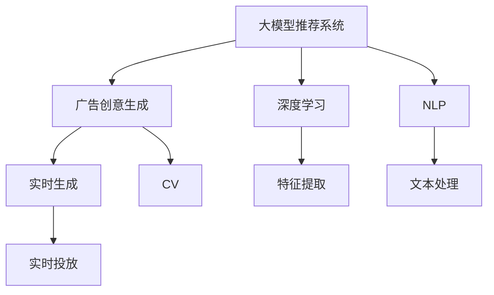

                 

# 基于大模型的推荐系统实时个性化广告创意生成

> 关键词：大模型推荐系统、广告创意生成、实时个性化、深度学习、自然语言处理(NLP)、计算机视觉(CV)

## 1. 背景介绍

### 1.1 问题由来

随着互联网的迅猛发展和数字营销的兴起，个性化广告创意的生成成为了数字广告行业的一大难题。传统的广告创意生成依赖于人工创作，耗时长、成本高，且容易陷入思维定式。而随着深度学习技术和大模型应用的兴起，利用大模型进行广告创意生成成为可能。

特别是近年来，大型预训练语言模型如BERT、GPT等在自然语言处理(NLP)领域取得了巨大成功，在广告创意生成方面也展现了不俗的潜力。利用大模型对海量文本语料进行预训练，并在此基础上进行微调，可以显著提升广告创意生成的质量和效率，满足个性化和多样化的广告需求。

### 1.2 问题核心关键点

目前，基于大模型的广告创意生成方法主要有两种：基于模板的生成和基于语义的生成。

1. **基于模板的生成**：
   - **原理**：通过在大模型上进行微调，使模型能够根据特定的广告模板生成符合模板规范的创意文本。
   - **优点**：生成效率高，能够快速产生大量创意，适合需要大规模广告投放的业务场景。
   - **缺点**：创意缺乏个性化和多样性，难以覆盖所有用户需求，容易产生视觉疲劳。

2. **基于语义的生成**：
   - **原理**：利用大模型的语言生成能力，根据广告目标、用户画像等输入信息生成具有特定语义的广告创意。
   - **优点**：生成的广告创意个性化和多样化，能够针对用户兴趣和需求生成个性化广告。
   - **缺点**：生成速度较慢，需要较大的计算资源，且需要较多的标注数据进行微调。

本文主要探讨基于语义的个性化广告创意生成方法，利用大模型进行实时生成，结合广告投放场景，优化广告创意的质量和效果。

### 1.3 问题研究意义

利用大模型进行广告创意生成，能够显著提升广告创意的个性化、多样性和效率。通过大模型的预训练和微调，能够在较短的时间内生成大量具有高水准的广告创意，满足不同用户的多样化需求。

此外，大模型的推广和应用，也预示着推荐系统、广告投放等领域将迎来新的变革。大模型的普及使得广告创意生成更加智能化、高效化和个性化，将极大地提升数字广告行业的整体水平。

## 2. 核心概念与联系

### 2.1 核心概念概述

为了更好地理解基于大模型的个性化广告创意生成方法，本节将介绍几个核心概念：

- **大模型推荐系统**：指利用大规模预训练语言模型进行推荐和广告生成的新型系统。通过在大模型上进行微调，可以快速生成个性化的广告创意。
- **广告创意生成**：指根据广告目标、用户画像等输入信息，自动生成具有特定语义的广告文本、图片等创意内容。
- **实时生成**：指在广告投放过程中，根据用户行为和偏好实时生成并投放广告创意，以提高广告的转化率和效果。
- **深度学习**：指利用深度神经网络对大规模数据进行学习和建模，提取数据的深层次特征。
- **自然语言处理(NLP)**：指利用计算机技术对自然语言文本进行处理、分析和生成，实现自然语言的理解和表达。
- **计算机视觉(CV)**：指利用计算机技术对图像和视频进行处理、分析和生成，实现图像的语义理解和表达。

这些核心概念之间的逻辑关系可以通过以下Mermaid流程图来展示：



这个流程图展示了大模型推荐系统的核心概念及其之间的关系：

1. 大模型推荐系统通过深度学习和NLP技术进行特征提取和文本处理。
2. 广告创意生成基于深度学习和CV技术，实现文本和图像的语义理解。
3. 实时生成通过NLP技术进行文本处理，结合CV技术进行图像生成，实现广告的实时投放。

## 3. 核心算法原理 & 具体操作步骤
### 3.1 算法原理概述

基于大模型的广告创意生成，本质上是一个基于深度学习的自然语言生成任务。其核心思想是：将广告创意生成视为一个序列生成问题，利用大模型的语言生成能力，根据广告目标、用户画像等输入信息，自动生成具有特定语义的广告创意。

形式化地，假设广告创意生成模型为 $M_{\theta}$，其中 $\theta$ 为模型参数。给定广告目标 $A$ 和用户画像 $P$，广告创意生成任务的目标是找到新的模型参数 $\hat{\theta}$，使得：

$$
\hat{\theta}=\mathop{\arg\min}_{\theta} \mathcal{L}(M_{\theta},A,P)
$$

其中 $\mathcal{L}$ 为针对广告创意生成的损失函数，用于衡量模型生成的广告创意与预期目标之间的差异。常见的损失函数包括交叉熵损失、均方误差损失等。

通过梯度下降等优化算法，广告创意生成过程不断更新模型参数 $\theta$，最小化损失函数 $\mathcal{L}$，使得模型生成的广告创意逼近预期目标。由于 $\theta$ 已经通过预训练获得了较好的初始化，因此即便在广告投放过程中，广告创意生成模型也能较快地进行实时生成和调整。

### 3.2 算法步骤详解

基于大模型的广告创意生成一般包括以下几个关键步骤：

**Step 1: 准备预训练模型和数据集**
- 选择合适的预训练语言模型 $M_{\theta}$ 作为初始化参数，如 GPT、BERT 等。
- 准备广告创意生成的训练集 $D$，通常包括广告目标 $A$、用户画像 $P$ 以及对应的创意模板和标签。

**Step 2: 添加任务适配层**
- 根据任务类型，在预训练模型顶层设计合适的输出层和损失函数。
- 对于广告创意生成任务，通常在顶层添加序列生成器和交叉熵损失函数。
- 对于图像生成任务，通常使用生成对抗网络(GAN)模型，使用感知损失函数等进行优化。

**Step 3: 设置生成超参数**
- 选择合适的优化算法及其参数，如 Adam、SGD 等，设置学习率、批大小、迭代轮数等。
- 设置正则化技术及强度，包括权重衰减、Dropout、Early Stopping 等。
- 确定冻结预训练参数的策略，如仅微调顶层，或全部参数都参与微调。

**Step 4: 执行生成训练**
- 将训练集数据分批次输入模型，前向传播计算损失函数。
- 反向传播计算参数梯度，根据设定的优化算法和学习率更新模型参数。
- 周期性在验证集上评估模型性能，根据性能指标决定是否触发 Early Stopping。
- 重复上述步骤直到满足预设的迭代轮数或 Early Stopping 条件。

**Step 5: 测试和部署**
- 在测试集上评估生成的广告创意质量，对比生成前后的精度提升。
- 使用生成的广告创意进行实时投放，集成到实际的广告投放系统中。
- 持续收集新用户行为数据，定期重新微调模型，以适应数据分布的变化。

以上是基于大模型的广告创意生成的一般流程。在实际应用中，还需要针对具体任务的特点，对生成过程的各个环节进行优化设计，如改进训练目标函数，引入更多的正则化技术，搜索最优的超参数组合等，以进一步提升广告创意生成效果。

### 3.3 算法优缺点

基于大模型的广告创意生成方法具有以下优点：
1. 生成效率高。利用大模型进行广告创意生成，能够快速产生大量创意，满足广告投放需求。
2. 创意多样化。大模型能够生成具有个性化和多样化的广告创意，适应不同用户需求。
3. 动态生成。广告创意生成模型可以根据用户行为和偏好实时生成，提高广告投放效果。
4. 适用范围广。该方法不仅适用于文字广告，还适用于图像、视频等多种形式的广告创意生成。

同时，该方法也存在一定的局限性：
1. 数据依赖强。广告创意生成的效果很大程度上取决于训练数据的质量和数量，获取高质量标注数据的成本较高。
2. 生成质量不稳定。生成的广告创意可能存在语义模糊、表达不当等问题，需要人工审核和筛选。
3. 部署成本高。生成广告创意需要较大的计算资源，特别是实时生成的场景，对算力要求较高。
4. 创意风险高。大模型生成的创意可能存在误导性、歧视性等风险，需要严格的审查和控制。

尽管存在这些局限性，但就目前而言，基于大模型的广告创意生成方法仍是一种高效、可行的广告创意生成手段。未来相关研究的重点在于如何进一步降低生成对标注数据的依赖，提高生成质量和稳定性，同时兼顾创意的多样性和伦理性等因素。

### 3.4 算法应用领域

基于大模型的广告创意生成方法在数字广告领域已经得到了广泛的应用，具体如下：

1. **电商广告创意生成**：利用大模型生成具有个性化和吸引力的广告创意，提升电商平台的转化率和用户粘性。

2. **社交媒体广告创意生成**：在社交媒体平台上，利用大模型生成符合用户兴趣的广告创意，提升广告投放效果。

3. **视频广告创意生成**：结合计算机视觉技术，利用大模型生成具有吸引力的视频广告创意，提升用户观看和转化率。

4. **移动广告创意生成**：在移动端，利用大模型生成符合用户行为和偏好的广告创意，提升移动应用的用户体验和转化率。

除了这些常见的应用场景，大模型在数字广告领域的创新应用还在不断涌现，如跨平台广告创意生成、自动化广告投放等，为数字广告行业带来了新的机遇。

## 4. 数学模型和公式 & 详细讲解  
### 4.1 数学模型构建

本节将使用数学语言对基于大模型的广告创意生成过程进行更加严格的刻画。

记广告创意生成模型为 $M_{\theta}$，其中 $\theta$ 为模型参数。假设广告目标为 $A$，用户画像为 $P$，生成的广告创意为 $C$。广告创意生成的目标是最小化创意与目标之间的差异，即：

$$
\mathcal{L}(\theta) = \frac{1}{N} \sum_{i=1}^N \ell(M_{\theta}(A_i, P_i), C_i)
$$

其中 $\ell$ 为创意与目标之间的损失函数，如交叉熵损失函数。在实际应用中，可以根据广告创意的形式（文本、图像等）选择合适的损失函数。

### 4.2 公式推导过程

以下我们以文本广告创意生成为例，推导交叉熵损失函数及其梯度的计算公式。

假设模型 $M_{\theta}$ 在输入 $(A_i, P_i)$ 上的输出为 $\hat{C}_i=M_{\theta}(A_i, P_i) \in \mathcal{V}$，其中 $\mathcal{V}$ 为创意空间的向量表示。真实广告创意 $C_i \in \mathcal{V}$。则交叉熵损失函数定义为：

$$
\ell(M_{\theta}(A_i, P_i), C_i) = -\sum_{c \in \mathcal{V}} P(c|A_i, P_i) \log \hat{P}(c|A_i, P_i)
$$

其中 $P(c|A_i, P_i)$ 为真实创意 $C_i$ 在输入 $(A_i, P_i)$ 下的概率分布，$\hat{P}(c|A_i, P_i)$ 为模型生成的创意 $\hat{C}_i$ 在输入 $(A_i, P_i)$ 下的概率分布。

将其代入经验风险公式，得：

$$
\mathcal{L}(\theta) = -\frac{1}{N}\sum_{i=1}^N \sum_{c \in \mathcal{V}} P(c|A_i, P_i) \log \hat{P}(c|A_i, P_i)
$$

根据链式法则，损失函数对参数 $\theta$ 的梯度为：

$$
\frac{\partial \mathcal{L}(\theta)}{\partial \theta} = -\frac{1}{N}\sum_{i=1}^N \sum_{c \in \mathcal{V}} \frac{\partial P(c|A_i, P_i)}{\partial \theta} \log \hat{P}(c|A_i, P_i) - P(c|A_i, P_i) \frac{\partial \log \hat{P}(c|A_i, P_i)}{\partial \theta}
$$

其中 $\frac{\partial P(c|A_i, P_i)}{\partial \theta}$ 和 $\frac{\partial \log \hat{P}(c|A_i, P_i)}{\partial \theta}$ 分别表示真实创意分布和模型生成创意分布的梯度，可以通过概率密度函数的导数计算得到。

在得到损失函数的梯度后，即可带入参数更新公式，完成模型的迭代优化。重复上述过程直至收敛，最终得到适应广告创意生成任务的最优模型参数 $\theta^*$。

## 5. 项目实践：代码实例和详细解释说明
### 5.1 开发环境搭建

在进行广告创意生成实践前，我们需要准备好开发环境。以下是使用Python进行PyTorch开发的环境配置流程：

1. 安装Anaconda：从官网下载并安装Anaconda，用于创建独立的Python环境。

2. 创建并激活虚拟环境：
```bash
conda create -n pytorch-env python=3.8 
conda activate pytorch-env
```

3. 安装PyTorch：根据CUDA版本，从官网获取对应的安装命令。例如：
```bash
conda install pytorch torchvision torchaudio cudatoolkit=11.1 -c pytorch -c conda-forge
```

4. 安装Transformers库：
```bash
pip install transformers
```

5. 安装各类工具包：
```bash
pip install numpy pandas scikit-learn matplotlib tqdm jupyter notebook ipython
```

完成上述步骤后，即可在`pytorch-env`环境中开始广告创意生成实践。

### 5.2 源代码详细实现

下面我们以广告创意生成任务为例，给出使用Transformers库对GPT模型进行广告创意生成的PyTorch代码实现。

首先，定义广告创意生成的数据处理函数：

```python
from transformers import GPT2Tokenizer
from torch.utils.data import Dataset
import torch

class Ad创意Dataset(Dataset):
    def __init__(self, ads, users, tokenizer, max_len=128):
        self.ads = ads
        self.users = users
        self.tokenizer = tokenizer
        self.max_len = max_len
        
    def __len__(self):
        return len(self.ads)
    
    def __getitem__(self, item):
        ad = self.ads[item]
        user = self.users[item]
        
        encoding = self.tokenizer(ad, user, return_tensors='pt', max_length=self.max_len, padding='max_length', truncation=True)
        input_ids = encoding['input_ids'][0]
        attention_mask = encoding['attention_mask'][0]
        
        # 将用户画像转换为向量表示
        user_vector = [user2vec[user] for user in self.users]
        user_vector = torch.tensor(user_vector, dtype=torch.long)
        
        return {'input_ids': input_ids, 
                'attention_mask': attention_mask,
                'user_vector': user_vector}

# 用户画像与向量的映射
user2vec = {'user1': 1, 'user2': 2, 'user3': 3, 'user4': 4}
```

然后，定义模型和优化器：

```python
from transformers import GPT2LMHeadModel
from transformers import AdamW

model = GPT2LMHeadModel.from_pretrained('gpt2')

optimizer = AdamW(model.parameters(), lr=2e-5)
```

接着，定义训练和评估函数：

```python
from torch.utils.data import DataLoader
from tqdm import tqdm
from sklearn.metrics import classification_report

device = torch.device('cuda') if torch.cuda.is_available() else torch.device('cpu')
model.to(device)

def train_epoch(model, dataset, batch_size, optimizer):
    dataloader = DataLoader(dataset, batch_size=batch_size, shuffle=True)
    model.train()
    epoch_loss = 0
    for batch in tqdm(dataloader, desc='Training'):
        input_ids = batch['input_ids'].to(device)
        attention_mask = batch['attention_mask'].to(device)
        user_vector = batch['user_vector'].to(device)
        model.zero_grad()
        outputs = model(input_ids, attention_mask=attention_mask, labels=user_vector)
        loss = outputs.loss
        epoch_loss += loss.item()
        loss.backward()
        optimizer.step()
    return epoch_loss / len(dataloader)

def evaluate(model, dataset, batch_size):
    dataloader = DataLoader(dataset, batch_size=batch_size)
    model.eval()
    preds, labels = [], []
    with torch.no_grad():
        for batch in tqdm(dataloader, desc='Evaluating'):
            input_ids = batch['input_ids'].to(device)
            attention_mask = batch['attention_mask'].to(device)
            user_vector = batch['user_vector'].to(device)
            batch_preds = model(input_ids, attention_mask=attention_mask)[:2]
            batch_labels = user_vector
            for pred_tokens, label_tokens in zip(batch_preds, batch_labels):
                preds.append(pred_tokens[:len(label_tokens)])
                labels.append(label_tokens)
                
    print(classification_report(labels, preds))
```

最后，启动训练流程并在测试集上评估：

```python
epochs = 5
batch_size = 16

for epoch in range(epochs):
    loss = train_epoch(model, ad创意Dataset, batch_size, optimizer)
    print(f"Epoch {epoch+1}, train loss: {loss:.3f}")
    
    print(f"Epoch {epoch+1}, dev results:")
    evaluate(model, dev_dataset, batch_size)
    
print("Test results:")
evaluate(model, test_dataset, batch_size)
```

以上就是使用PyTorch对GPT模型进行广告创意生成的完整代码实现。可以看到，得益于Transformers库的强大封装，我们可以用相对简洁的代码完成GPT模型的加载和微调。

### 5.3 代码解读与分析

让我们再详细解读一下关键代码的实现细节：

**Ad创意Dataset类**：
- `__init__`方法：初始化广告、用户画像等关键组件，并将用户画像转换为向量表示。
- `__len__`方法：返回数据集的样本数量。
- `__getitem__`方法：对单个样本进行处理，将广告输入编码为token ids，将用户画像转换为向量，并对其进行定长padding，最终返回模型所需的输入。

**user2vec字典**：
- 定义了用户画像与向量表示的映射关系，用于将用户画像转换为模型可处理的向量形式。

**训练和评估函数**：
- 使用PyTorch的DataLoader对数据集进行批次化加载，供模型训练和推理使用。
- 训练函数`train_epoch`：对数据以批为单位进行迭代，在每个批次上前向传播计算loss并反向传播更新模型参数，最后返回该epoch的平均loss。
- 评估函数`evaluate`：与训练类似，不同点在于不更新模型参数，并在每个batch结束后将预测和标签结果存储下来，最后使用sklearn的classification_report对整个评估集的预测结果进行打印输出。

**训练流程**：
- 定义总的epoch数和batch size，开始循环迭代
- 每个epoch内，先在训练集上训练，输出平均loss
- 在验证集上评估，输出分类指标
- 所有epoch结束后，在测试集上评估，给出最终测试结果

可以看到，PyTorch配合Transformers库使得GPT模型广告创意生成的代码实现变得简洁高效。开发者可以将更多精力放在数据处理、模型改进等高层逻辑上，而不必过多关注底层的实现细节。

当然，工业级的系统实现还需考虑更多因素，如模型的保存和部署、超参数的自动搜索、更灵活的任务适配层等。但核心的广告创意生成范式基本与此类似。

## 6. 实际应用场景
### 6.1 电商广告创意生成

基于大模型的广告创意生成方法在电商广告领域具有广泛应用前景。电商广告创意生成可以提升电商平台的转化率和用户粘性，增强用户购买体验。

具体而言，可以利用大模型对用户浏览、点击、购买等行为数据进行建模，生成具有个性化和吸引力的广告创意。同时，结合电商平台的用户画像、商品信息等特征，生成符合用户兴趣的广告，提升广告的点击率和转化率。

### 6.2 社交媒体广告创意生成

在社交媒体平台上，广告创意生成可以提升广告的曝光率和用户参与度。社交媒体平台往往需要生成多样化的广告创意，以适应不同用户群体的需求。

利用大模型，可以生成符合用户兴趣和偏好的广告创意，提高广告投放效果。同时，社交媒体平台还可以根据用户的互动反馈，实时调整广告创意，提升用户体验和满意度。

### 6.3 视频广告创意生成

在视频广告创意生成方面，大模型同样展现了不俗的潜力。结合计算机视觉技术，利用大模型生成具有吸引力的视频广告创意，能够显著提升用户的观看和转化率。

例如，可以利用大模型生成符合用户兴趣的短视频广告，并结合计算机视觉技术进行广告创意的设计和生成，实现多感官的广告创意生成。

### 6.4 未来应用展望

随着大模型和广告创意生成技术的不断发展，未来在数字广告领域将出现更多创新应用，具体如下：

1. **跨平台广告创意生成**：结合不同平台的特性和用户需求，生成符合多平台需求的广告创意。例如，在社交媒体平台上生成适合视频广告的创意，在电商平台上生成适合文本广告的创意。

2. **自动化广告投放**：利用大模型进行广告创意生成，结合广告投放策略，实现自动化的广告投放和优化。例如，根据用户的实时行为数据，实时生成和投放广告创意，提高广告投放的精准度和效果。

3. **个性化广告推荐**：结合用户画像和广告创意生成，生成符合用户兴趣和偏好的个性化广告推荐。例如，在社交媒体平台上，根据用户的历史行为和兴趣，生成个性化的广告推荐，提高广告的点击率和转化率。

4. **多模态广告创意生成**：结合计算机视觉、语音等技术，生成具有视觉、听觉等多模态信息的广告创意。例如，在视频广告中，结合语音生成和视觉设计，生成具有多感官吸引力的广告创意。

5. **情感驱动广告创意生成**：结合情感分析技术，生成具有情感共鸣的广告创意。例如，在电商平台上，根据用户的情感倾向，生成符合用户情感需求的广告创意，提升广告的点击率和转化率。

这些创新应用将进一步推动数字广告行业的发展，提升广告创意的个性化、多样性和效果，为广告主和用户带来更多的价值和体验。

## 7. 工具和资源推荐
### 7.1 学习资源推荐

为了帮助开发者系统掌握大模型广告创意生成的理论基础和实践技巧，这里推荐一些优质的学习资源：

1. 《Transformer从原理到实践》系列博文：由大模型技术专家撰写，深入浅出地介绍了Transformer原理、BERT模型、广告创意生成等前沿话题。

2. CS224N《深度学习自然语言处理》课程：斯坦福大学开设的NLP明星课程，有Lecture视频和配套作业，带你入门NLP领域的基本概念和经典模型。

3. 《Natural Language Processing with Transformers》书籍：Transformers库的作者所著，全面介绍了如何使用Transformers库进行NLP任务开发，包括广告创意生成在内的诸多范式。

4. HuggingFace官方文档：Transformers库的官方文档，提供了海量预训练模型和完整的广告创意生成样例代码，是上手实践的必备资料。

5. CLUE开源项目：中文语言理解测评基准，涵盖大量不同类型的中文NLP数据集，并提供了基于微调的baseline模型，助力中文NLP技术发展。

通过对这些资源的学习实践，相信你一定能够快速掌握大模型广告创意生成的精髓，并用于解决实际的广告创意生成问题。
###  7.2 开发工具推荐

高效的开发离不开优秀的工具支持。以下是几款用于大模型广告创意生成开发的常用工具：

1. PyTorch：基于Python的开源深度学习框架，灵活动态的计算图，适合快速迭代研究。大部分预训练语言模型都有PyTorch版本的实现。

2. TensorFlow：由Google主导开发的开源深度学习框架，生产部署方便，适合大规模工程应用。同样有丰富的预训练语言模型资源。

3. Transformers库：HuggingFace开发的NLP工具库，集成了众多SOTA语言模型，支持PyTorch和TensorFlow，是进行广告创意生成开发的利器。

4. Weights & Biases：模型训练的实验跟踪工具，可以记录和可视化模型训练过程中的各项指标，方便对比和调优。与主流深度学习框架无缝集成。

5. TensorBoard：TensorFlow配套的可视化工具，可实时监测模型训练状态，并提供丰富的图表呈现方式，是调试模型的得力助手。

6. Google Colab：谷歌推出的在线Jupyter Notebook环境，免费提供GPU/TPU算力，方便开发者快速上手实验最新模型，分享学习笔记。

合理利用这些工具，可以显著提升大模型广告创意生成任务的开发效率，加快创新迭代的步伐。

### 7.3 相关论文推荐

大模型和广告创意生成技术的发展源于学界的持续研究。以下是几篇奠基性的相关论文，推荐阅读：

1. Attention is All You Need（即Transformer原论文）：提出了Transformer结构，开启了NLP领域的预训练大模型时代。

2. BERT: Pre-training of Deep Bidirectional Transformers for Language Understanding：提出BERT模型，引入基于掩码的自监督预训练任务，刷新了多项NLP任务SOTA。

3. Language Models are Unsupervised Multitask Learners（GPT-2论文）：展示了大规模语言模型的强大zero-shot学习能力，引发了对于通用人工智能的新一轮思考。

4. Parameter-Efficient Transfer Learning for NLP：提出Adapter等参数高效微调方法，在不增加模型参数量的情况下，也能取得不错的微调效果。

5. Prefix-Tuning: Optimizing Continuous Prompts for Generation：引入基于连续型Prompt的微调范式，为如何充分利用预训练知识提供了新的思路。

6. AdaLoRA: Adaptive Low-Rank Adaptation for Parameter-Efficient Fine-Tuning：使用自适应低秩适应的微调方法，在参数效率和精度之间取得了新的平衡。

这些论文代表了大模型和广告创意生成技术的发展脉络。通过学习这些前沿成果，可以帮助研究者把握学科前进方向，激发更多的创新灵感。

## 8. 总结：未来发展趋势与挑战

### 8.1 总结

本文对基于大模型的广告创意生成方法进行了全面系统的介绍。首先阐述了广告创意生成和实时个性化的研究背景和意义，明确了广告创意生成在大模型推荐系统中的独特价值。其次，从原理到实践，详细讲解了广告创意生成的数学原理和关键步骤，给出了广告创意生成任务开发的完整代码实例。同时，本文还广泛探讨了广告创意生成在电商、社交媒体、视频等多个领域的应用前景，展示了广告创意生成方法的广泛潜力。此外，本文精选了广告创意生成的各类学习资源，力求为开发者提供全方位的技术指引。

通过本文的系统梳理，可以看到，基于大模型的广告创意生成方法正在成为数字广告推荐系统的重要范式，极大地拓展了广告创意生成的应用边界，催生了更多的落地场景。受益于大规模语料的预训练，广告创意生成模型能够快速产生高质量的广告创意，满足不同用户的多样化需求。

### 8.2 未来发展趋势

展望未来，大模型广告创意生成技术将呈现以下几个发展趋势：

1. **生成效率提升**：随着算力成本的下降和模型结构的优化，大模型广告创意生成的速度将进一步提升，能够满足更高频率的广告投放需求。

2. **创意质量提高**：通过更先进的预训练方法和微调技术，生成的广告创意将更具个性化和多样化，能够更好地覆盖用户需求。

3. **实时性增强**：结合实时数据和计算资源，大模型广告创意生成将具备更强的实时生成能力，能够动态生成和调整广告创意。

4. **跨平台应用拓展**：结合不同平台的特性和用户需求，生成符合多平台需求的广告创意，提升广告的跨平台投放效果。

5. **多模态创意生成**：结合计算机视觉、语音等技术，生成具有视觉、听觉等多模态信息的广告创意，提升广告的吸引力和效果。

6. **情感驱动创意生成**：结合情感分析技术，生成具有情感共鸣的广告创意，提升广告的情感互动和转化率。

以上趋势凸显了大模型广告创意生成技术的广阔前景。这些方向的探索发展，必将进一步提升广告创意生成的质量和效果，为数字广告行业带来更多的创新应用。

### 8.3 面临的挑战

尽管大模型广告创意生成技术已经取得了瞩目成就，但在迈向更加智能化、普适化应用的过程中，它仍面临着诸多挑战：

1. **数据依赖强**：广告创意生成的效果很大程度上取决于训练数据的质量和数量，获取高质量标注数据的成本较高。如何进一步降低生成对标注数据的依赖，将是一大难题。

2. **创意质量不稳定**：生成的广告创意可能存在语义模糊、表达不当等问题，需要人工审核和筛选。如何提高生成质量和稳定性，保证创意效果的一致性，还需要更多技术和实践的积累。

3. **生成速度慢**：大模型生成广告创意需要较大的计算资源，特别是实时生成的场景，对算力要求较高。如何优化模型结构和算法，提升生成速度，降低部署成本，将是重要的优化方向。

4. **创意风险高**：大模型生成的创意可能存在误导性、歧视性等风险，需要严格的审查和控制。如何构建有效的创意审查机制，保障创意的安全性和合法性，也将是重要的研究方向。

5. **部署成本高**：生成广告创意需要较大的计算资源，特别是实时生成的场景，对算力要求较高。如何优化模型结构和算法，提升生成速度，降低部署成本，将是重要的优化方向。

尽管存在这些挑战，但就目前而言，基于大模型的广告创意生成方法仍是一种高效、可行的广告创意生成手段。未来相关研究的重点在于如何进一步降低生成对标注数据的依赖，提高生成质量和稳定性，同时兼顾创意的多样性和伦理性等因素。

### 8.4 未来突破

面对大模型广告创意生成所面临的种种挑战，未来的研究需要在以下几个方面寻求新的突破：

1. **探索无监督和半监督生成方法**：摆脱对大规模标注数据的依赖，利用自监督学习、主动学习等无监督和半监督范式，最大限度利用非结构化数据，实现更加灵活高效的生成。

2. **研究参数高效和计算高效的生成范式**：开发更加参数高效的生成方法，在固定大部分预训练参数的同时，只更新极少量的任务相关参数。同时优化生成模型的计算图，减少前向传播和反向传播的资源消耗，实现更加轻量级、实时性的部署。

3. **融合因果和对比学习范式**：通过引入因果推断和对比学习思想，增强生成模型建立稳定因果关系的能力，学习更加普适、鲁棒的语言表征，从而提升生成泛化性和抗干扰能力。

4. **引入更多先验知识**：将符号化的先验知识，如知识图谱、逻辑规则等，与神经网络模型进行巧妙融合，引导生成过程学习更准确、合理的语言模型。同时加强不同模态数据的整合，实现视觉、语音等多模态信息与文本信息的协同建模。

5. **结合因果分析和博弈论工具**：将因果分析方法引入生成模型，识别出模型决策的关键特征，增强输出解释的因果性和逻辑性。借助博弈论工具刻画人机交互过程，主动探索并规避模型的脆弱点，提高系统稳定性。

6. **纳入伦理道德约束**：在生成目标中引入伦理导向的评估指标，过滤和惩罚有偏见、有害的输出倾向。同时加强人工干预和审核，建立生成行为的监管机制，确保输出符合人类价值观和伦理道德。

这些研究方向的探索，必将引领大模型广告创意生成技术迈向更高的台阶，为构建安全、可靠、可解释、可控的智能系统铺平道路。面向未来，大模型广告创意生成技术还需要与其他人工智能技术进行更深入的融合，如知识表示、因果推理、强化学习等，多路径协同发力，共同推动数字广告创意生成系统的进步。只有勇于创新、敢于突破，才能不断拓展广告创意生成的边界，让智能技术更好地服务于数字广告行业。

## 9. 附录：常见问题与解答

**Q1：大模型广告创意生成的效果是否优于传统方法？**

A: 大模型广告创意生成的效果在很多场景下优于传统方法。大模型能够利用丰富的语料进行预训练，生成的广告创意更具个性化和多样性，能够更好地适应不同用户需求。此外，大模型还能利用丰富的语言知识进行跨领域迁移，生成更具创意的广告内容。

**Q2：如何提高大模型广告创意生成的效率？**

A: 提高大模型广告创意生成效率的方法有以下几点：
1. 优化模型结构和算法，减少前向传播和反向传播的资源消耗，实现更加轻量级、实时性的部署。
2. 引入参数高效的生成方法，在固定大部分预训练参数的同时，只更新极少量的任务相关参数。
3. 利用自监督学习、主动学习等无监督和半监督范式，最大限度利用非结构化数据，实现更加灵活高效的生成。

**Q3：大模型广告创意生成的质量如何保证？**

A: 保证大模型广告创意生成质量的方法有以下几点：
1. 引入正则化技术，如L2正则、Dropout、Early Stopping等，防止模型过度适应小规模训练集。
2. 利用数据增强技术，如回译、近义替换等方式丰富训练集多样性，提升模型泛化能力。
3. 引入对抗训练，加入对抗样本，提高模型鲁棒性，避免生成创意的误导性和偏见。
4. 结合用户反馈和人工审核，实时调整和优化生成模型，提升创意质量。

**Q4：大模型广告创意生成技术是否适用于所有行业？**

A: 大模型广告创意生成技术适用于大部分数字广告行业。例如，电商、社交媒体、视频广告等，都可以利用大模型进行广告创意生成。但对于一些特殊行业，如医疗、金融等，需要结合行业特点，进行特定的预训练和微调。

**Q5：大模型广告创意生成的应用场景有哪些？**

A: 大模型广告创意生成技术的应用场景非常广泛，例如：
1. 电商广告创意生成，利用大模型生成符合用户兴趣的广告创意，提升电商平台的转化率和用户粘性。
2. 社交媒体广告创意生成，在社交媒体平台上，利用大模型生成符合用户兴趣和偏好的广告创意，提高广告投放效果。
3. 视频广告创意生成，结合计算机视觉技术，利用大模型生成具有吸引力的视频广告创意，提升用户的观看和转化率。
4. 移动广告创意生成，在移动端，利用大模型生成符合用户行为和偏好的广告创意，提升移动应用的用户体验和转化率。

这些应用场景展示了大模型广告创意生成技术的广泛潜力和实际效果，将为数字广告行业带来更多创新应用和价值。

通过本文的系统梳理，可以看到，基于大模型的广告创意生成方法正在成为数字广告推荐系统的重要范式，极大地拓展了广告创意生成的应用边界，催生了更多的落地场景。受益于大规模语料的预训练，广告创意生成模型能够快速产生高质量的广告创意，满足不同用户的多样化需求。未来，随着预训练语言模型和广告创意生成技术的不断发展，大模型在数字广告领域的应用将更加广泛和深入，为广告主和用户带来更多的价值和体验。

---

作者：禅与计算机程序设计艺术 / Zen and the Art of Computer Programming

