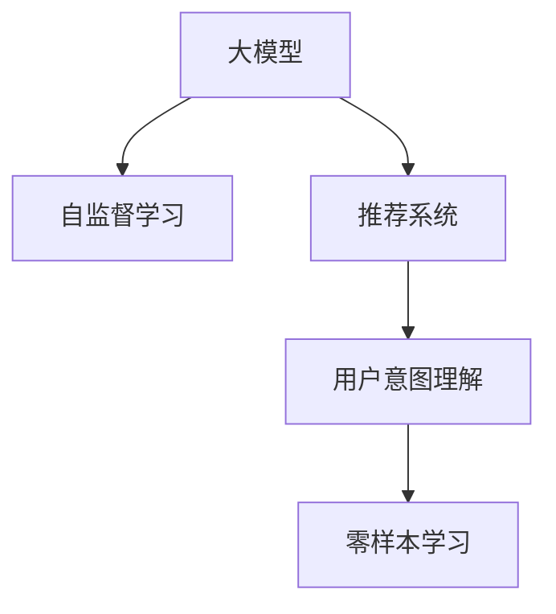

                 

## 1. 背景介绍

随着互联网技术的发展，推荐系统已经成为了各行各业提升用户体验、增加用户粘性和营收的关键手段。推荐系统能够根据用户的兴趣和行为，从海量数据中筛选出最符合用户需求的物品，显著提升了用户满意度。

然而，现有的推荐系统多依赖静态特征，无法有效捕捉用户动态变化的需求。在用户输入查询时，推荐系统仍然无法准确把握用户的意图和偏好，导致推荐结果偏差较大。为此，基于大模型的推荐系统应运而生，其通过预训练语言模型的强大语言理解能力，可以深入理解用户意图，提升推荐系统的精准度和个性化水平。

## 2. 核心概念与联系

### 2.1 核心概念概述

为更好地理解基于大模型的推荐系统用户意图理解方法，本节将介绍几个密切相关的核心概念：

- **大模型**：指通过大规模数据预训练得到的深度学习模型，如BERT、GPT-3等，能够处理自然语言文本数据，具备丰富的语言理解能力。
- **推荐系统**：根据用户的历史行为数据和实时输入，为用户推荐最符合其需求的商品、内容等信息的技术体系。
- **用户意图理解**：推荐系统核心任务之一，即通过对用户输入的自然语言文本进行解析，理解用户的真实意图，从而进行更精准的推荐。
- **零样本学习**：指模型在未见过的数据上，仍能进行有效推理和生成的能力，能显著减少微调和标注数据的需求。
- **自监督学习**：指模型在无监督数据的指导下，通过学习数据间的内部关系，实现知识获取和能力提升。

这些核心概念之间的逻辑关系可以通过以下Mermaid流程图来展示：



这个流程图展示了大模型、自监督学习、推荐系统和用户意图理解之间的关系：

1. 大模型通过自监督学习获取丰富的语言知识。
2. 自监督学习通过对无标签数据的自我指导，提升大模型的泛化能力和理解深度。
3. 推荐系统利用大模型对用户意图进行解析和推理。
4. 用户意图理解结合零样本学习，使推荐系统能理解用户在未见过的文本输入下，所表达的真实意图。

## 3. 核心算法原理 & 具体操作步骤

### 3.1 算法原理概述

基于大模型的推荐系统用户意图理解，本质上是一种通过自然语言理解技术，解析用户输入并理解其真实意图的方法。其核心算法基于预训练语言模型和自监督学习技术，可以显著提升对用户意图的理解能力。

假设推荐系统接收到的用户输入文本为 $x$，大模型的预训练参数为 $\theta$。推荐系统对用户意图的理解过程可以表示为：

$$
\text{intent}_{\theta}(x) = \text{MLP}(f_{\theta}(x))
$$

其中 $f_{\theta}(x)$ 为预训练语言模型，将用户输入 $x$ 转化为模型内部的语义表示，$\text{MLP}$ 为全连接神经网络，对语义表示进行解析，输出用户意图的标签。$\text{intent}_{\theta}(x)$ 表示模型对输入 $x$ 的意图理解结果。

### 3.2 算法步骤详解

基于大模型的推荐系统用户意图理解一般包括以下几个关键步骤：

**Step 1: 准备数据集**
- 收集用户的历史行为数据和输入文本数据，划分为训练集、验证集和测试集。
- 对输入文本进行预处理，如分词、去停用词等，构建用户输入的语料库。

**Step 2: 加载预训练语言模型**
- 选择合适的大模型，如BERT、GPT-3等，加载到计算设备（如GPU）中。
- 设置模型的超参数，如学习率、批大小、迭代轮数等。

**Step 3: 训练意图分类器**
- 将训练集分为两个部分，一部分作为自监督数据，一部分作为监督数据。
- 对自监督数据，利用大模型进行预训练，学习语言知识。
- 对监督数据，通过意图分类器的训练，使模型学会将用户输入映射到具体的意图标签。
- 使用验证集评估模型性能，调整超参数。

**Step 4: 推理和预测**
- 在用户输入新的文本时，通过大模型进行推理，输出意图标签。
- 将意图标签作为推荐系统的输入，进行物品推荐。

**Step 5: 持续更新和优化**
- 收集用户对推荐结果的反馈，进一步优化模型。
- 根据用户反馈，更新训练数据，重新训练意图分类器。

### 3.3 算法优缺点

基于大模型的推荐系统用户意图理解方法具有以下优点：
1. 数据需求较低。相比于传统机器学习算法，该方法需要的标注数据较少，可以快速迭代优化。
2. 精度较高。利用大模型的语言理解能力，能够更准确地解析用户意图，提升推荐系统的精度。
3. 泛化能力强。自监督学习技术使得模型具备较强的泛化能力，能够适应不同领域的用户输入。
4. 用户友好。利用自然语言处理技术，使推荐系统更加人性化，用户更易于理解和使用。

同时，该方法也存在以下缺点：
1. 模型规模较大。大模型一般需要较高的计算资源，对硬件要求较高。
2. 解释性不足。模型内部复杂，难以解释其决策过程。
3. 依赖数据质量。如果输入文本质量不高，模型无法准确理解用户意图。
4. 训练成本高。需要大量计算资源，训练周期较长。

尽管存在这些局限性，但就目前而言，基于大模型的推荐系统用户意图理解仍然是最先进的方法，具有良好的应用前景。

### 3.4 算法应用领域

基于大模型的推荐系统用户意图理解在多个领域具有广泛的应用：

1. **电商推荐**：对用户输入的购物清单、搜索关键词进行分析，了解用户购物需求，进行商品推荐。
2. **视频推荐**：分析用户对视频的点赞、评论等行为，预测用户对其他视频的需求，推荐相关内容。
3. **音乐推荐**：对用户的听歌历史和评论文本进行解析，找出用户偏好的音乐风格，推荐相似音乐。
4. **新闻推荐**：对用户阅读习惯和评论内容进行理解，推荐符合用户兴趣的新闻内容。
5. **旅游推荐**：通过解析用户旅游攻略、预订记录等文本，推荐适合的旅游目的地和行程安排。

## 4. 数学模型和公式 & 详细讲解 & 举例说明

### 4.1 数学模型构建

基于大模型的推荐系统用户意图理解，主要涉及以下数学模型：

1. **自监督模型**：利用大模型在无标签数据上进行的预训练过程，学习语言知识。
2. **意图分类模型**：通过监督数据对大模型的输出进行分类，学习用户意图标签。

以BERT模型为例，假设输入文本为 $x = \{w_1, w_2, ..., w_n\}$，预训练模型 $f_{\theta}(x)$ 将输入转化为嵌入表示 $\{h_1, h_2, ..., h_n\}$。假设用户意图标签集合为 $\{a_1, a_2, ..., a_k\}$，意图分类器为 $g_{\phi}$，则意图分类过程可以表示为：

$$
\text{intent}_{\phi}(h_1, h_2, ..., h_n) = \arg\max_{a_i} g_{\phi}(h_1, h_2, ..., h_n)
$$

其中 $g_{\phi}$ 为多层感知器(MLP)，输出层采用softmax函数，对输入的嵌入表示进行分类。

### 4.2 公式推导过程

以BERT模型为例，假设输入文本 $x$ 经过分词后得到词汇序列 $\{w_1, w_2, ..., w_n\}$，将其输入到BERT模型中，得到每个词汇的嵌入表示 $\{h_1, h_2, ..., h_n\}$。意图分类器 $g_{\phi}$ 的输出为每个意图标签的概率分布 $P = (p_1, p_2, ..., p_k)$。则最终的意图理解结果 $\text{intent}_{\phi}(x)$ 可以表示为：

$$
\text{intent}_{\phi}(x) = \arg\max_i p_i
$$

其中 $p_i$ 为模型预测输出 $\{h_1, h_2, ..., h_n\}$ 属于意图标签 $a_i$ 的概率。

### 4.3 案例分析与讲解

以下以电商推荐为例，展示基于大模型的推荐系统用户意图理解的应用。

假设电商网站接收到的用户输入为：“我要买一件黑色羽绒服”，将其输入到大模型中，得到嵌入表示 $\{h_1, h_2, ..., h_n\}$。假设模型已经学习了羽绒服、黑色、购买等关键词的嵌入表示，并通过监督数据训练了意图分类器 $g_{\phi}$。

意图分类器对输入嵌入 $\{h_1, h_2, ..., h_n\}$ 进行分类，输出每个意图表签的概率分布。根据概率分布 $\{p_{\text{羽绒服}}, p_{\text{黑色}}, p_{\text{购买}}, ..., p_{\text{其他}}\}$，可以认为用户意图为“购买黑色羽绒服”，将意图标签 $\text{intent}_{\phi}(x) = \text{购买黑色羽绒服}$ 作为推荐系统的输入，推荐用户感兴趣的商品。

## 5. 项目实践：代码实例和详细解释说明

### 5.1 开发环境搭建

在进行微调实践前，我们需要准备好开发环境。以下是使用Python进行PyTorch开发的环境配置流程：

1. 安装Anaconda：从官网下载并安装Anaconda，用于创建独立的Python环境。

2. 创建并激活虚拟环境：
```bash
conda create -n pytorch-env python=3.8 
conda activate pytorch-env
```

3. 安装PyTorch：根据CUDA版本，从官网获取对应的安装命令。例如：
```bash
conda install pytorch torchvision torchaudio cudatoolkit=11.1 -c pytorch -c conda-forge
```

4. 安装Transformers库：
```bash
pip install transformers
```

5. 安装各类工具包：
```bash
pip install numpy pandas scikit-learn matplotlib tqdm jupyter notebook ipython
```

完成上述步骤后，即可在`pytorch-env`环境中开始微调实践。

### 5.2 源代码详细实现

下面我们以电商推荐任务为例，给出使用Transformers库对BERT模型进行意图理解的PyTorch代码实现。

首先，定义意图分类任务的数据处理函数：

```python
from transformers import BertTokenizer
from torch.utils.data import Dataset
import torch

class IntentDataset(Dataset):
    def __init__(self, texts, tags, tokenizer, max_len=128):
        self.texts = texts
        self.tags = tags
        self.tokenizer = tokenizer
        self.max_len = max_len
        
    def __len__(self):
        return len(self.texts)
    
    def __getitem__(self, item):
        text = self.texts[item]
        tag = self.tags[item]
        
        encoding = self.tokenizer(text, return_tensors='pt', max_length=self.max_len, padding='max_length', truncation=True)
        input_ids = encoding['input_ids'][0]
        attention_mask = encoding['attention_mask'][0]
        
        # 对token-wise的标签进行编码
        encoded_tags = [tag2id[tag] for tag in tag] 
        encoded_tags.extend([tag2id['O']] * (self.max_len - len(encoded_tags)))
        labels = torch.tensor(encoded_tags, dtype=torch.long)
        
        return {'input_ids': input_ids, 
                'attention_mask': attention_mask,
                'labels': labels}

# 标签与id的映射
tag2id = {'购买': 0, '观看': 1, '购买黑色羽绒服': 2, '购买黑色运动鞋': 3}
id2tag = {v: k for k, v in tag2id.items()}

# 创建dataset
tokenizer = BertTokenizer.from_pretrained('bert-base-cased')

train_dataset = IntentDataset(train_texts, train_tags, tokenizer)
dev_dataset = IntentDataset(dev_texts, dev_tags, tokenizer)
test_dataset = IntentDataset(test_texts, test_tags, tokenizer)
```

然后，定义模型和优化器：

```python
from transformers import BertForTokenClassification, AdamW

model = BertForTokenClassification.from_pretrained('bert-base-cased', num_labels=len(tag2id))

optimizer = AdamW(model.parameters(), lr=2e-5)
```

接着，定义训练和评估函数：

```python
from torch.utils.data import DataLoader
from tqdm import tqdm
from sklearn.metrics import classification_report

device = torch.device('cuda') if torch.cuda.is_available() else torch.device('cpu')
model.to(device)

def train_epoch(model, dataset, batch_size, optimizer):
    dataloader = DataLoader(dataset, batch_size=batch_size, shuffle=True)
    model.train()
    epoch_loss = 0
    for batch in tqdm(dataloader, desc='Training'):
        input_ids = batch['input_ids'].to(device)
        attention_mask = batch['attention_mask'].to(device)
        labels = batch['labels'].to(device)
        model.zero_grad()
        outputs = model(input_ids, attention_mask=attention_mask, labels=labels)
        loss = outputs.loss
        epoch_loss += loss.item()
        loss.backward()
        optimizer.step()
    return epoch_loss / len(dataloader)

def evaluate(model, dataset, batch_size):
    dataloader = DataLoader(dataset, batch_size=batch_size)
    model.eval()
    preds, labels = [], []
    with torch.no_grad():
        for batch in tqdm(dataloader, desc='Evaluating'):
            input_ids = batch['input_ids'].to(device)
            attention_mask = batch['attention_mask'].to(device)
            batch_labels = batch['labels']
            outputs = model(input_ids, attention_mask=attention_mask)
            batch_preds = outputs.logits.argmax(dim=2).to('cpu').tolist()
            batch_labels = batch_labels.to('cpu').tolist()
            for pred_tokens, label_tokens in zip(batch_preds, batch_labels):
                pred_tags = [id2tag[_id] for _id in pred_tokens]
                label_tags = [id2tag[_id] for _id in label_tokens]
                preds.append(pred_tags[:len(label_tokens)])
                labels.append(label_tags)
                
    print(classification_report(labels, preds))
```

最后，启动训练流程并在测试集上评估：

```python
epochs = 5
batch_size = 16

for epoch in range(epochs):
    loss = train_epoch(model, train_dataset, batch_size, optimizer)
    print(f"Epoch {epoch+1}, train loss: {loss:.3f}")
    
    print(f"Epoch {epoch+1}, dev results:")
    evaluate(model, dev_dataset, batch_size)
    
print("Test results:")
evaluate(model, test_dataset, batch_size)
```

以上就是使用PyTorch对BERT进行意图理解的完整代码实现。可以看到，得益于Transformers库的强大封装，我们可以用相对简洁的代码完成BERT模型的加载和意图理解的微调。

### 5.3 代码解读与分析

让我们再详细解读一下关键代码的实现细节：

**IntentDataset类**：
- `__init__`方法：初始化文本、标签、分词器等关键组件。
- `__len__`方法：返回数据集的样本数量。
- `__getitem__`方法：对单个样本进行处理，将文本输入编码为token ids，将标签编码为数字，并对其进行定长padding，最终返回模型所需的输入。

**tag2id和id2tag字典**：
- 定义了意图表签与数字id之间的映射关系，用于将token-wise的预测结果解码回真实的标签。

**训练和评估函数**：
- 使用PyTorch的DataLoader对数据集进行批次化加载，供模型训练和推理使用。
- 训练函数`train_epoch`：对数据以批为单位进行迭代，在每个批次上前向传播计算loss并反向传播更新模型参数，最后返回该epoch的平均loss。
- 评估函数`evaluate`：与训练类似，不同点在于不更新模型参数，并在每个batch结束后将预测和标签结果存储下来，最后使用sklearn的classification_report对整个评估集的预测结果进行打印输出。

**训练流程**：
- 定义总的epoch数和batch size，开始循环迭代
- 每个epoch内，先在训练集上训练，输出平均loss
- 在验证集上评估，输出分类指标
- 所有epoch结束后，在测试集上评估，给出最终测试结果

可以看到，PyTorch配合Transformers库使得BERT意图理解的代码实现变得简洁高效。开发者可以将更多精力放在数据处理、模型改进等高层逻辑上，而不必过多关注底层的实现细节。

当然，工业级的系统实现还需考虑更多因素，如模型的保存和部署、超参数的自动搜索、更灵活的任务适配层等。但核心的意图理解范式基本与此类似。

## 6. 实际应用场景

### 6.1 电商推荐

基于大模型的推荐系统用户意图理解，可以广泛应用于电商推荐中。传统推荐系统依赖静态特征，无法有效捕捉用户动态变化的需求。通过引入自然语言处理技术，电商推荐系统可以深入理解用户输入的自然语言，准确把握用户的购物需求，推荐最符合用户心意的产品。

在技术实现上，可以收集用户的历史行为数据和输入文本数据，构建用户输入的语料库，并利用预训练语言模型进行自监督学习。在训练意图分类器时，将用户输入与历史行为数据进行关联，学习用户的购物意图。在用户输入新的购物需求时，通过意图分类器解析其意图，推荐符合用户需求的商品。

### 6.2 视频推荐

视频推荐系统需要根据用户的观看历史和评价，为用户推荐感兴趣的视频内容。传统推荐系统多依赖静态特征，难以有效捕捉用户实时变化的偏好。通过引入自然语言处理技术，视频推荐系统可以深入理解用户输入的自然语言，准确把握用户的观看需求，推荐用户感兴趣的视频内容。

在技术实现上，可以收集用户的视频观看历史和评论文本数据，构建用户输入的语料库，并利用预训练语言模型进行自监督学习。在训练意图分类器时，将用户输入与历史行为数据进行关联，学习用户的观看意图。在用户输入新的观看需求时，通过意图分类器解析其意图，推荐符合用户兴趣的视频内容。

### 6.3 音乐推荐

音乐推荐系统需要根据用户的听歌历史和评论文本，为用户推荐感兴趣的音乐内容。传统推荐系统多依赖静态特征，难以有效捕捉用户实时变化的偏好。通过引入自然语言处理技术，音乐推荐系统可以深入理解用户输入的自然语言，准确把握用户的听歌需求，推荐符合用户偏好的音乐内容。

在技术实现上，可以收集用户的听歌历史和评论文本数据，构建用户输入的语料库，并利用预训练语言模型进行自监督学习。在训练意图分类器时，将用户输入与历史行为数据进行关联，学习用户的听歌意图。在用户输入新的听歌需求时，通过意图分类器解析其意图，推荐符合用户偏好的音乐内容。

### 6.4 未来应用展望

随着大模型和意图理解技术的不断发展，基于大模型的推荐系统将在更多领域得到应用，为传统行业带来变革性影响。

在智慧医疗领域，基于大模型的推荐系统可以应用于医疗问答、病历分析、药物推荐等，辅助医生诊疗，加速新药开发进程。

在智能教育领域，微调技术可应用于作业批改、学情分析、知识推荐等方面，因材施教，促进教育公平，提高教学质量。

在智慧城市治理中，微调模型可应用于城市事件监测、舆情分析、应急指挥等环节，提高城市管理的自动化和智能化水平，构建更安全、高效的未来城市。

此外，在企业生产、社会治理、文娱传媒等众多领域，基于大模型的推荐系统用户意图理解也将不断涌现，为经济社会发展注入新的动力。相信随着技术的日益成熟，意图理解方法将成为推荐系统的核心技术，进一步提升用户体验和系统价值。

## 7. 工具和资源推荐

### 7.1 学习资源推荐

为了帮助开发者系统掌握大模型用户意图理解的理论基础和实践技巧，这里推荐一些优质的学习资源：

1. 《Transformer从原理到实践》系列博文：由大模型技术专家撰写，深入浅出地介绍了Transformer原理、BERT模型、意图理解技术等前沿话题。

2. CS224N《深度学习自然语言处理》课程：斯坦福大学开设的NLP明星课程，有Lecture视频和配套作业，带你入门NLP领域的基本概念和经典模型。

3. 《Natural Language Processing with Transformers》书籍：Transformers库的作者所著，全面介绍了如何使用Transformers库进行NLP任务开发，包括意图理解在内的诸多范式。

4. HuggingFace官方文档：Transformers库的官方文档，提供了海量预训练模型和完整的意图理解样例代码，是上手实践的必备资料。

5. CLUE开源项目：中文语言理解测评基准，涵盖大量不同类型的中文NLP数据集，并提供了基于大模型的意图理解baseline模型，助力中文NLP技术发展。

通过对这些资源的学习实践，相信你一定能够快速掌握大模型用户意图理解的精髓，并用于解决实际的NLP问题。

### 7.2 开发工具推荐

高效的开发离不开优秀的工具支持。以下是几款用于大模型用户意图理解开发的常用工具：

1. PyTorch：基于Python的开源深度学习框架，灵活动态的计算图，适合快速迭代研究。大部分预训练语言模型都有PyTorch版本的实现。

2. TensorFlow：由Google主导开发的开源深度学习框架，生产部署方便，适合大规模工程应用。同样有丰富的预训练语言模型资源。

3. Transformers库：HuggingFace开发的NLP工具库，集成了众多SOTA语言模型，支持PyTorch和TensorFlow，是进行意图理解任务的开发的利器。

4. Weights & Biases：模型训练的实验跟踪工具，可以记录和可视化模型训练过程中的各项指标，方便对比和调优。与主流深度学习框架无缝集成。

5. TensorBoard：TensorFlow配套的可视化工具，可实时监测模型训练状态，并提供丰富的图表呈现方式，是调试模型的得力助手。

6. Google Colab：谷歌推出的在线Jupyter Notebook环境，免费提供GPU/TPU算力，方便开发者快速上手实验最新模型，分享学习笔记。

合理利用这些工具，可以显著提升大模型用户意图理解任务的开发效率，加快创新迭代的步伐。

### 7.3 相关论文推荐

大模型用户意图理解技术的发展源于学界的持续研究。以下是几篇奠基性的相关论文，推荐阅读：

1. Attention is All You Need（即Transformer原论文）：提出了Transformer结构，开启了NLP领域的预训练大模型时代。

2. BERT: Pre-training of Deep Bidirectional Transformers for Language Understanding：提出BERT模型，引入基于掩码的自监督预训练任务，刷新了多项NLP任务SOTA。

3. Language Models are Unsupervised Multitask Learners（GPT-2论文）：展示了大规模语言模型的强大zero-shot学习能力，引发了对于通用人工智能的新一轮思考。

4. Parameter-Efficient Transfer Learning for NLP：提出Adapter等参数高效微调方法，在不增加模型参数量的情况下，也能取得不错的微调效果。

5. Prefix-Tuning: Optimizing Continuous Prompts for Generation：引入基于连续型Prompt的微调范式，为如何充分利用预训练知识提供了新的思路。

6. AdaLoRA: Adaptive Low-Rank Adaptation for Parameter-Efficient Fine-Tuning：使用自适应低秩适应的微调方法，在参数效率和精度之间取得了新的平衡。

这些论文代表了大模型用户意图理解的发展脉络。通过学习这些前沿成果，可以帮助研究者把握学科前进方向，激发更多的创新灵感。

## 8. 总结：未来发展趋势与挑战

### 8.1 总结

本文对基于大模型的推荐系统用户意图理解方法进行了全面系统的介绍。首先阐述了大模型和意图理解的研究背景和意义，明确了意图理解在推荐系统中的重要性和应用前景。其次，从原理到实践，详细讲解了意图理解算法的数学模型和操作步骤，给出了完整的代码实现。同时，本文还广泛探讨了意图理解方法在电商推荐、视频推荐、音乐推荐等多个领域的应用前景，展示了意图理解范式的巨大潜力。此外，本文精选了意图理解技术的各类学习资源，力求为读者提供全方位的技术指引。

通过本文的系统梳理，可以看到，基于大模型的推荐系统用户意图理解方法正在成为推荐系统的重要技术手段，极大地提升了推荐系统的精准度和个性化水平。得益于大模型的语言理解能力，推荐系统能够更深入地理解用户需求，在更少的标注数据下，也能实现优异的推荐效果。未来，随着大模型的不断发展，意图理解技术将有更广阔的应用前景，为推荐系统带来革命性的变化。

### 8.2 未来发展趋势

展望未来，大模型用户意图理解技术将呈现以下几个发展趋势：

1. 模型规模持续增大。随着算力成本的下降和数据规模的扩张，大模型的参数量还将持续增长。超大模型蕴含的丰富语言知识，有望支撑更加复杂多变的意图理解任务。

2. 意图理解能力增强。自监督学习技术使得模型具备更强的泛化能力和理解深度，能够处理更多样化的输入文本。

3. 融合多模态信息。除了文本信息外，将视觉、语音等多模态信息与文本信息结合，进一步提升模型的理解能力。

4. 引入更多先验知识。将符号化的先验知识，如知识图谱、逻辑规则等，与神经网络模型进行融合，引导意图理解过程学习更准确、合理的意图表示。

5. 注重可解释性和可控性。用户意图理解模型需要具备更高的可解释性和可控性，便于用户理解和使用。

这些趋势凸显了大模型用户意图理解技术的广阔前景。这些方向的探索发展，必将进一步提升意图理解模型的性能和应用范围，为推荐系统带来新的突破。

### 8.3 面临的挑战

尽管大模型用户意图理解技术已经取得了瞩目成就，但在迈向更加智能化、普适化应用的过程中，它仍面临着诸多挑战：

1. 标注成本瓶颈。意图理解模型需要大量标注数据进行训练，尤其是对于多模态数据，标注工作量巨大。如何降低标注成本，是大模型应用面临的主要挑战之一。

2. 意图识别准确性。意图理解模型需要准确解析用户输入的自然语言，但自然语言的复杂性和多义性使得意图识别难度较大，需要更多的研究优化。

3. 模型的公平性和可控性。意图理解模型需要具备良好的公平性和可控性，避免产生歧视性输出，保护用户隐私。

4. 资源消耗高。大模型用户意图理解通常需要大量的计算资源，训练和推理过程耗时较长。如何优化模型结构，减少计算消耗，是未来研究的重点方向之一。

5. 模型的鲁棒性。意图理解模型需要具备一定的鲁棒性，能够应对用户输入的多样性和噪声，提高系统的稳定性。

尽管存在这些挑战，但未来通过技术创新和优化，大模型用户意图理解技术有望进一步突破瓶颈，实现更广泛的应用。

### 8.4 研究展望

面向未来，大模型用户意图理解技术需要在以下几个方面寻求新的突破：

1. 探索无监督和半监督意图理解方法。摆脱对大量标注数据的依赖，利用自监督学习、主动学习等无监督和半监督范式，最大限度利用非结构化数据，实现更灵活高效的意图理解。

2. 研究参数高效和计算高效的意图理解范式。开发更加参数高效的意图理解方法，在固定大部分预训练参数的情况下，只更新极少量的意图相关参数。同时优化模型的计算图，减少前向传播和反向传播的资源消耗，实现更加轻量级、实时性的部署。

3. 引入更多先验知识。将符号化的先验知识，如知识图谱、逻辑规则等，与神经网络模型进行巧妙融合，引导意图理解过程学习更准确、合理的意图表示。

4. 引入因果分析和博弈论工具。将因果分析方法引入意图理解模型，识别出模型决策的关键特征，增强输出解释的因果性和逻辑性。借助博弈论工具刻画人机交互过程，主动探索并规避模型的脆弱点，提高系统稳定性。

5. 纳入伦理道德约束。在模型训练目标中引入伦理导向的评估指标，过滤和惩罚有偏见、有害的输出倾向。同时加强人工干预和审核，建立模型行为的监管机制，确保输出符合人类价值观和伦理道德。

这些研究方向的探索，必将引领大模型用户意图理解技术迈向更高的台阶，为推荐系统带来新的突破。面向未来，大模型用户意图理解技术还需要与其他人工智能技术进行更深入的融合，如知识表示、因果推理、强化学习等，多路径协同发力，共同推动自然语言理解和智能交互系统的进步。只有勇于创新、敢于突破，才能不断拓展语言模型的边界，让智能技术更好地造福人类社会。

## 9. 附录：常见问题与解答

**Q1：大模型用户意图理解是否适用于所有NLP任务？**

A: 大模型用户意图理解在大多数NLP任务上都能取得不错的效果，特别是对于数据量较小的任务。但对于一些特定领域的任务，如医学、法律等，仅仅依靠通用语料预训练的模型可能难以很好地适应。此时需要在特定领域语料上进一步预训练，再进行意图理解。此外，对于一些需要时效性、个性化很强的任务，如对话、推荐等，意图理解方法也需要针对性的改进优化。

**Q2：在训练意图分类器时，如何处理多模态数据？**

A: 在训练意图分类器时，可以通过以下方法处理多模态数据：

1. 数据预处理：将不同模态的数据进行对齐和融合，例如将文本数据和图片数据转换成相同的特征向量。

2. 多模态特征融合：将不同模态的特征进行拼接或融合，作为模型的输入。例如将文本特征和图像特征拼接在一起，输入到MLP中进行分类。

3. 多模态训练：在训练意图分类器时，将多模态数据一起输入模型，训练多模态的分类器。例如将文本和图像数据一起输入到BERT模型中进行训练。

4. 多模态解码：在推理时，将多模态的输出进行解码，得到最终的意图分类结果。例如将文本和图像的输出进行拼接，输入到MLP中进行分类。

通过以上方法，可以将多模态数据高效地输入到大模型中进行意图分类，提高模型的泛化能力和理解深度。

**Q3：在用户意图理解中，如何缓解过拟合问题？**

A: 在用户意图理解中，过拟合问题可以通过以下方法缓解：

1. 数据增强：通过对训练样本进行扩充和变换，增加训练数据的多样性，例如回译、近义替换等。

2. 正则化：使用L2正则、Dropout等技术，防止模型过拟合训练数据。

3. 模型裁剪：去除不必要的层和参数，减小模型尺寸，提高模型的泛化能力。

4. 迁移学习：利用预训练模型的语言知识，进行迁移学习，避免从头训练模型，减少过拟合风险。

5. 多模型集成：训练多个意图分类器，取平均输出，抑制过拟合。

通过以上方法，可以在用户意图理解任务中缓解过拟合问题，提高模型的泛化能力和鲁棒性。

**Q4：在微调大模型时，如何选择合适的学习率？**

A: 在微调大模型时，选择合适的学习率非常重要，过大或过小的学习率都会影响模型的性能。以下是一些常用的选择方法：

1. 初始学习率：通常从0.001或0.01开始，逐步减小学习率。

2. 学习率调度：使用warmup策略，在开始阶段使用较小的学习率，再逐渐过渡到预设值。例如，在训练初期使用0.01的学习率，逐步增加到0.01。

3. 学习率衰减：使用指数衰减或余弦退火等方法，逐渐减小学习率。例如，在每个epoch的末尾，将学习率乘以0.1。

4. 动态学习率：使用自适应学习率算法，如Adam、Adagrad等，根据梯度变化自动调整学习率。

5. 学习率剪枝：将学习率限制在一定的范围内，防止学习率过大或过小。例如，将学习率限制在0.001和0.01之间。

通过以上方法，可以选择合适的学习率，避免过拟合或欠拟合，提高模型的微调效果。

**Q5：在用户意图理解中，如何提高模型的可解释性和可控性？**

A: 在用户意图理解中，提高模型的可解释性和可控性，可以通过以下方法：

1. 特征可视化：将模型的内部特征进行可视化，了解模型的推理过程和决策依据。例如，使用t-SNE或LIME等方法可视化模型的特征空间。

2. 可控性增强：在模型的训练过程中，加入约束条件，控制模型的输出范围和分布。例如，在训练意图分类器时，加入类别的约束条件，限制模型的输出范围。

3. 模型压缩：通过模型压缩技术，减小模型的复杂度，提高模型的可解释性。例如，使用剪枝、量化等技术压缩模型。

4. 知识融合：将符号化的先验知识，如知识图谱、逻辑规则等，与神经网络模型进行融合，增强模型的可解释性。例如，将知识图谱中的关系和事实信息，加入到模型的训练中，提高模型的可解释性。

5. 人工干预：在模型的应用过程中，加入人工干预，控制模型的输出。例如，在推荐系统中，人工审核推荐结果，控制推荐内容的质量和范围。

通过以上方法，可以提高用户意图理解模型的可解释性和可控性，增强用户对模型的信任和使用体验。

---

作者：禅与计算机程序设计艺术 / Zen and the Art of Computer Programming

