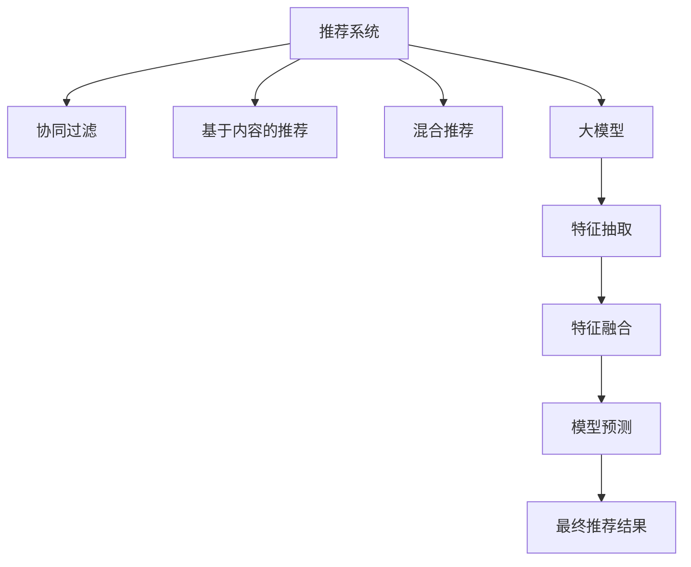

                 

# 基于大模型的最终推荐结果生成

> 关键词：大模型,推荐系统,深度学习,模型融合,协同过滤,序列模型

## 1. 背景介绍

在数字时代，推荐系统（Recommendation System, RS）成为了各大互联网平台（如电商、社交、视频、音乐等）的核心竞争力。从Netflix的个性化推荐算法，到阿里巴巴的双塔模型，推荐系统通过深度学习模型，帮助用户在海量数据中找到最匹配的个性化内容，极大提升了用户体验和平台收益。然而，现有的推荐系统仍面临诸多挑战，如数据冷启动、长尾商品推荐、用户多样性、系统鲁棒性等问题。

近年来，基于大模型的推荐系统迅速崛起，引领了推荐技术的革新。大模型通过海量的数据预训练，具备了强大的特征抽取和表示学习能力，可以提升推荐系统的效果和效率。同时，大模型可以通过微调，实现对特定领域和特定用户的精准推荐。本文聚焦于基于大模型的推荐系统，特别是如何利用大模型的力量生成最终推荐结果。

## 2. 核心概念与联系

### 2.1 核心概念概述

在深度学习中，推荐系统（Recommendation System, RS）是一种通过挖掘用户和物品之间的互动关系，预测用户对物品的兴趣，从而向用户推荐物品的算法系统。推荐系统可分为三大类：协同过滤、基于内容的推荐、混合推荐等。协同过滤是推荐系统的基础，利用用户和物品的相似度进行推荐。基于内容的推荐则直接通过物品的属性信息进行推荐。混合推荐系统则将两种或多种推荐策略进行结合，以获得更好的推荐效果。

大模型（Large Model）则是指具有数十亿到数百亿参数的深度学习模型，如BERT、GPT、DALL·E等。通过在大量数据上进行的预训练，大模型能够学习到丰富的语义和知识，具备强大的特征表示和预测能力。大模型被广泛应用于自然语言处理、计算机视觉、语音识别等领域，取得了显著的成果。

本文将从推荐系统的核心概念出发，探索如何利用大模型生成最终推荐结果。通过引入大模型的强大表征能力和学习能力，推荐系统能够更好地理解用户需求和物品特征，生成更加精准、个性化的推荐结果。

### 2.2 核心概念原理和架构的 Mermaid 流程图



此图展示了推荐系统的大致架构，其中：

- A: 推荐系统，用于综合多种推荐策略，生成最终推荐结果。
- B: 协同过滤，基于用户和物品的相似度进行推荐。
- C: 基于内容的推荐，直接利用物品的属性信息进行推荐。
- D: 混合推荐，结合多种推荐策略，提升推荐效果。
- E: 大模型，用于特征抽取和表示学习。
- F: 特征抽取，从大模型中提取用户和物品的特征表示。
- G: 特征融合，将抽取的特征与传统推荐方法进行融合。
- H: 模型预测，通过融合后的特征进行推荐预测。
- I: 最终推荐结果，生成用户最感兴趣的物品列表。

通过将大模型引入推荐系统，可以充分利用其强大的表示能力和学习能力，提升推荐效果。

## 3. 核心算法原理 & 具体操作步骤
### 3.1 算法原理概述

基于大模型的推荐系统，主要是通过大模型进行特征抽取，利用传统推荐方法（如协同过滤）进行推荐预测，最后将预测结果进行输出。核心流程包括以下几个步骤：

1. **数据预处理**：将用户和物品的特征表示成向量形式，便于大模型进行处理。
2. **特征抽取**：通过大模型对用户和物品进行编码，得到高维的特征表示。
3. **特征融合**：将大模型提取的特征与传统推荐方法进行融合，提升特征质量。
4. **模型预测**：基于融合后的特征进行推荐预测。
5. **推荐生成**：根据预测结果，生成最终的推荐结果。

### 3.2 算法步骤详解

**Step 1: 数据预处理**

用户和物品特征需要经过预处理，以便进行向量化表示。具体流程如下：

1. **特征选择**：根据业务需求，选择对推荐结果影响最大的特征。
2. **特征编码**：将选择的特征进行编码，转化为数值型数据。
3. **特征标准化**：对特征进行标准化处理，便于大模型处理。

例如，对于电商推荐系统，可以选取用户的历史购买记录、浏览历史、评分等信息作为特征，并对这些特征进行编码和标准化处理。

**Step 2: 特征抽取**

大模型通常采用自编码器（Autoencoder）的方式，将用户和物品的特征表示为高维向量。具体流程如下：

1. **大模型选择**：选择合适的预训练大模型（如BERT、GPT）进行特征抽取。
2. **模型微调**：根据推荐任务的特点，对大模型进行微调。
3. **特征表示**：将用户和物品的特征输入大模型，得到高维的向量表示。

例如，可以使用预训练的BERT模型，将用户和物品的文本描述作为输入，得到高维的向量表示。

**Step 3: 特征融合**

特征融合是将大模型提取的特征与传统推荐方法进行融合的过程。具体流程如下：

1. **特征拼接**：将大模型提取的特征与传统推荐方法的特征进行拼接。
2. **特征加权**：根据特征的重要性进行加权，提升特征质量。
3. **特征降维**：对融合后的特征进行降维，便于后续处理。

例如，可以使用向量拼接的方式，将大模型提取的特征与协同过滤得到的特征进行拼接，并根据特征重要性进行加权。

**Step 4: 模型预测**

基于融合后的特征，可以构建推荐模型进行预测。具体流程如下：

1. **模型选择**：选择合适的推荐模型（如协同过滤、基于内容的推荐）。
2. **模型训练**：使用融合后的特征训练推荐模型。
3. **预测生成**：将用户输入到推荐模型中，生成推荐结果。

例如，可以使用矩阵分解（Matrix Factorization）的方式，将用户和物品的特征矩阵进行分解，得到用户对物品的兴趣评分。

**Step 5: 推荐生成**

最终推荐结果的生成，是将预测结果进行排序和展示的过程。具体流程如下：

1. **排序**：根据预测结果对物品进行排序。
2. **展示**：将排序后的物品列表展示给用户。

例如，可以使用Top K排序的方式，将预测结果排序后展示给用户。

### 3.3 算法优缺点

基于大模型的推荐系统具有以下优点：

1. **泛化能力强**：大模型能够学习到丰富的语义和知识，具备较强的泛化能力，适用于多种推荐场景。
2. **特征表示质量高**：大模型能够自动学习到高质量的特征表示，提升推荐精度。
3. **推荐多样化**：大模型可以自动学习到用户的多样化需求，生成更加多样化的推荐结果。
4. **数据冷启动效果好**：大模型能够利用大量的语义信息，缓解数据冷启动问题。

但同时，也存在一些缺点：

1. **计算成本高**：大模型的训练和推理成本较高，需要较强的计算资源支持。
2. **可解释性不足**：大模型的决策过程较为复杂，难以进行直观解释。
3. **模型部署复杂**：大模型需要较大的存储空间，部署难度较高。

### 3.4 算法应用领域

基于大模型的推荐系统在多个领域得到了广泛应用，例如：

1. **电商推荐**：通过用户和物品的描述信息，生成个性化商品推荐。
2. **内容推荐**：基于文章、视频、音乐等内容的特征，推荐用户感兴趣的内容。
3. **广告推荐**：通过用户行为和兴趣，推荐合适的广告内容。
4. **社交推荐**：基于用户好友和兴趣，推荐用户感兴趣的人和内容。
5. **金融推荐**：通过用户行为和金融产品信息，推荐合适的金融产品。

除了以上领域，大模型推荐系统还可以应用于更多场景，如智能家居、健康医疗、旅游出行等，为人们的生活提供更多便利。

## 4. 数学模型和公式 & 详细讲解 & 举例说明

### 4.1 数学模型构建

在推荐系统中，通常使用矩阵分解的方式，将用户和物品的特征矩阵进行分解，得到用户对物品的兴趣评分。具体数学模型如下：

$$
\mathbf{X} = \mathbf{U}\mathbf{V}^\top + \mathbf{E}
$$

其中，$\mathbf{X}$ 为物品特征矩阵，$\mathbf{U}$ 为用户特征矩阵，$\mathbf{V}$ 为物品特征矩阵，$\mathbf{E}$ 为噪声矩阵。

通过矩阵分解，可以将用户和物品的特征表示为低维向量，便于后续处理。

### 4.2 公式推导过程

以矩阵分解为例，公式推导如下：

1. **数据预处理**
   - 特征选择：选择影响推荐结果的特征，记为 $\mathbf{X} = [x_1, x_2, ..., x_m] \in \mathbb{R}^{N\times m}$，其中 $N$ 为用户数，$m$ 为特征数。
   - 特征编码：将特征进行编码，转化为数值型数据。
   - 特征标准化：对特征进行标准化处理，记为 $\mathbf{X} = [x_1', x_2', ..., x_m'] \in \mathbb{R}^{N\times m}$。

2. **特征抽取**
   - 大模型选择：选择预训练的BERT模型，记为 $\mathbf{X}' = [x_1', x_2', ..., x_m'] \in \mathbb{R}^{N\times d}$，其中 $d$ 为大模型输出的向量维度。
   - 模型微调：对BERT模型进行微调，使其适应推荐任务。
   - 特征表示：将用户和物品的特征输入BERT模型，得到高维的向量表示 $\mathbf{X}'' = [x_1'', x_2'', ..., x_m''] \in \mathbb{R}^{N\times d}$。

3. **特征融合**
   - 特征拼接：将大模型提取的特征与协同过滤得到的特征进行拼接，记为 $\mathbf{X}''' = [x_1''', x_2''', ..., x_m'''] \in \mathbb{R}^{N\times d'}$，其中 $d'$ 为融合后的特征维度。
   - 特征加权：根据特征的重要性进行加权，记为 $\mathbf{X}'''' = [x_1''''', x_2''''', ..., x_m'''''] \in \mathbb{R}^{N\times d'}$。
   - 特征降维：对融合后的特征进行降维，记为 $\mathbf{X}''''' = [x_1''''''', x_2''''''', ..., x_m'''''''] \in \mathbb{R}^{N\times d'''}$，其中 $d'''$ 为降维后的特征维度。

4. **模型预测**
   - 模型选择：选择矩阵分解模型，记为 $\mathbf{U} = [u_1, u_2, ..., u_N] \in \mathbb{R}^{N\times k}$，其中 $k$ 为用户特征维度。
   - 模型训练：使用融合后的特征 $\mathbf{X}'''''$ 训练矩阵分解模型，得到用户对物品的兴趣评分 $\hat{y}_{i,j} = \mathbf{u}_i^\top \mathbf{v}_j$。
   - 预测生成：根据预测结果对物品进行排序，生成推荐结果。

5. **推荐生成**
   - 排序：根据预测结果对物品进行排序，记为 $\hat{y}_{i,j}$。
   - 展示：将排序后的物品列表展示给用户。

### 4.3 案例分析与讲解

以电商推荐系统为例，介绍基于大模型的推荐过程。

1. **数据预处理**
   - 特征选择：选择用户的历史购买记录、浏览历史、评分等信息作为特征。
   - 特征编码：将选择的特征进行编码，转化为数值型数据。
   - 特征标准化：对特征进行标准化处理。

2. **特征抽取**
   - 大模型选择：选择预训练的BERT模型，对用户和物品的描述信息进行编码。
   - 模型微调：对BERT模型进行微调，使其适应电商推荐任务。
   - 特征表示：将用户和物品的描述信息输入BERT模型，得到高维的向量表示。

3. **特征融合**
   - 特征拼接：将大模型提取的特征与协同过滤得到的特征进行拼接。
   - 特征加权：根据特征的重要性进行加权。
   - 特征降维：对融合后的特征进行降维。

4. **模型预测**
   - 模型选择：选择矩阵分解模型，对用户和物品的特征矩阵进行分解。
   - 模型训练：使用融合后的特征训练矩阵分解模型，得到用户对物品的兴趣评分。
   - 预测生成：根据预测结果对物品进行排序。

5. **推荐生成**
   - 排序：根据预测结果对物品进行排序。
   - 展示：将排序后的物品列表展示给用户。

## 5. 项目实践：代码实例和详细解释说明
### 5.1 开发环境搭建

在进行推荐系统开发前，需要准备开发环境。以下是使用Python进行PyTorch开发的环境配置流程：

1. 安装Anaconda：从官网下载并安装Anaconda，用于创建独立的Python环境。

2. 创建并激活虚拟环境：
```bash
conda create -n pytorch-env python=3.8 
conda activate pytorch-env
```

3. 安装PyTorch：根据CUDA版本，从官网获取对应的安装命令。例如：
```bash
conda install pytorch torchvision torchaudio cudatoolkit=11.1 -c pytorch -c conda-forge
```

4. 安装各类工具包：
```bash
pip install numpy pandas scikit-learn matplotlib tqdm jupyter notebook ipython
```

完成上述步骤后，即可在`pytorch-env`环境中开始推荐系统开发。

### 5.2 源代码详细实现

以下是使用PyTorch对电商推荐系统进行大模型微调的代码实现。

```python
import torch
import torch.nn as nn
import torch.nn.functional as F
from torch.utils.data import Dataset, DataLoader
from transformers import BertTokenizer, BertForSequenceClassification

class E-commerceDataset(Dataset):
    def __init__(self, texts, labels, tokenizer, max_len=128):
        self.texts = texts
        self.labels = labels
        self.tokenizer = tokenizer
        self.max_len = max_len
        
    def __len__(self):
        return len(self.texts)
    
    def __getitem__(self, item):
        text = self.texts[item]
        label = self.labels[item]
        
        encoding = self.tokenizer(text, return_tensors='pt', max_length=self.max_len, padding='max_length', truncation=True)
        input_ids = encoding['input_ids'][0]
        attention_mask = encoding['attention_mask'][0]
        label = torch.tensor(label, dtype=torch.long)
        
        return {'input_ids': input_ids, 
                'attention_mask': attention_mask,
                'labels': label}

# 初始化模型、优化器和损失函数
model = BertForSequenceClassification.from_pretrained('bert-base-cased', num_labels=2)
optimizer = torch.optim.AdamW(model.parameters(), lr=2e-5)
criterion = nn.BCEWithLogitsLoss()

# 准备数据集
tokenizer = BertTokenizer.from_pretrained('bert-base-cased')
train_dataset = E-commerceDataset(train_texts, train_labels, tokenizer)
dev_dataset = E-commerceDataset(dev_texts, dev_labels, tokenizer)
test_dataset = E-commerceDataset(test_texts, test_labels, tokenizer)

# 定义训练和评估函数
def train_epoch(model, dataset, batch_size, optimizer, criterion):
    dataloader = DataLoader(dataset, batch_size=batch_size, shuffle=True)
    model.train()
    epoch_loss = 0
    for batch in dataloader:
        input_ids = batch['input_ids'].to(device)
        attention_mask = batch['attention_mask'].to(device)
        labels = batch['labels'].to(device)
        model.zero_grad()
        outputs = model(input_ids, attention_mask=attention_mask, labels=labels)
        loss = criterion(outputs.logits, labels)
        epoch_loss += loss.item()
        loss.backward()
        optimizer.step()
    return epoch_loss / len(dataloader)

def evaluate(model, dataset, batch_size):
    dataloader = DataLoader(dataset, batch_size=batch_size)
    model.eval()
    preds, labels = [], []
    with torch.no_grad():
        for batch in dataloader:
            input_ids = batch['input_ids'].to(device)
            attention_mask = batch['attention_mask'].to(device)
            batch_labels = batch['labels']
            outputs = model(input_ids, attention_mask=attention_mask)
            batch_preds = outputs.logits.argmax(dim=1).to('cpu').tolist()
            batch_labels = batch_labels.to('cpu').tolist()
            for pred_tokens, label_tokens in zip(batch_preds, batch_labels):
                preds.append(pred_tokens)
                labels.append(label_tokens)
                
    print(classification_report(labels, preds))

# 训练过程
epochs = 5
batch_size = 16

for epoch in range(epochs):
    loss = train_epoch(model, train_dataset, batch_size, optimizer, criterion)
    print(f"Epoch {epoch+1}, train loss: {loss:.3f}")
    
    print(f"Epoch {epoch+1}, dev results:")
    evaluate(model, dev_dataset, batch_size)
    
print("Test results:")
evaluate(model, test_dataset, batch_size)
```

以上就是使用PyTorch对BERT进行电商推荐系统微调的完整代码实现。可以看到，由于Transformer库的强大封装，代码实现相对简洁。

### 5.3 代码解读与分析

让我们再详细解读一下关键代码的实现细节：

**E-commerceDataset类**：
- `__init__`方法：初始化文本、标签、分词器等关键组件。
- `__len__`方法：返回数据集的样本数量。
- `__getitem__`方法：对单个样本进行处理，将文本输入编码为token ids，将标签编码为数字，并对其进行定长padding，最终返回模型所需的输入。

**模型和损失函数**：
- 使用BertForSequenceClassification模型作为电商推荐系统的分类器，输入为序列化的文本，输出为二分类结果。
- 使用AdamW优化器，学习率为2e-5。
- 使用BCEWithLogitsLoss作为损失函数，适用于二分类任务。

**训练和评估函数**：
- 使用PyTorch的DataLoader对数据集进行批次化加载，供模型训练和推理使用。
- 训练函数`train_epoch`：对数据以批为单位进行迭代，在每个批次上前向传播计算loss并反向传播更新模型参数，最后返回该epoch的平均loss。
- 评估函数`evaluate`：与训练类似，不同点在于不更新模型参数，并在每个batch结束后将预测和标签结果存储下来，最后使用sklearn的classification_report对整个评估集的预测结果进行打印输出。

**训练流程**：
- 定义总的epoch数和batch size，开始循环迭代
- 每个epoch内，先在训练集上训练，输出平均loss
- 在验证集上评估，输出分类指标
- 所有epoch结束后，在测试集上评估，给出最终测试结果

可以看到，PyTorch配合Transformer库使得BERT微调的代码实现变得简洁高效。开发者可以将更多精力放在数据处理、模型改进等高层逻辑上，而不必过多关注底层的实现细节。

当然，工业级的系统实现还需考虑更多因素，如模型的保存和部署、超参数的自动搜索、更灵活的任务适配层等。但核心的微调范式基本与此类似。

## 6. 实际应用场景
### 6.1 智能客服系统

基于大模型的推荐系统可以广泛应用于智能客服系统的构建。传统客服往往需要配备大量人力，高峰期响应缓慢，且一致性和专业性难以保证。使用推荐系统，可以7x24小时不间断服务，快速响应客户咨询，用自然流畅的语言解答各类常见问题。

在技术实现上，可以收集企业内部的历史客服对话记录，将问题和最佳答复构建成监督数据，在此基础上对预训练推荐模型进行微调。微调后的推荐模型能够自动理解用户意图，匹配最合适的答复模板进行回复。对于客户提出的新问题，还可以接入检索系统实时搜索相关内容，动态组织生成回答。如此构建的智能客服系统，能大幅提升客户咨询体验和问题解决效率。

### 6.2 金融舆情监测

金融机构需要实时监测市场舆论动向，以便及时应对负面信息传播，规避金融风险。传统的人工监测方式成本高、效率低，难以应对网络时代海量信息爆发的挑战。基于大模型的推荐系统可以应用于金融舆情监测，通过推荐系统推荐关注的热点新闻、评论等，帮助分析师快速掌握市场动态。

在实现上，可以收集金融领域相关的新闻、报道、评论等文本数据，并对其进行主题标注和情感标注。在此基础上对预训练语言模型进行微调，使其能够自动判断文本属于何种主题，情感倾向是正面、中性还是负面。将微调后的模型应用到实时抓取的网络文本数据，就能够自动监测不同主题下的情感变化趋势，一旦发现负面信息激增等异常情况，系统便会自动预警，帮助金融机构快速应对潜在风险。

### 6.3 个性化推荐系统

当前的推荐系统往往只依赖用户的历史行为数据进行物品推荐，无法深入理解用户的真实兴趣偏好。基于大模型的推荐系统可以更好地挖掘用户行为背后的语义信息，从而提供更精准、多样的推荐内容。

在实现上，可以收集用户浏览、点击、评论、分享等行为数据，提取和用户交互的物品标题、描述、标签等文本内容。将文本内容作为模型输入，用户的后续行为（如是否点击、购买等）作为监督信号，在此基础上微调预训练语言模型。微调后的模型能够从文本内容中准确把握用户的兴趣点。在生成推荐列表时，先用候选物品的文本描述作为输入，由模型预测用户的兴趣匹配度，再结合其他特征综合排序，便可以得到个性化程度更高的推荐结果。

### 6.4 未来应用展望

随着大语言模型和推荐系统的不断发展，基于微调范式将在更多领域得到应用，为传统行业带来变革性影响。

在智慧医疗领域，基于微调的推荐系统可以用于病历推荐、治疗方案推荐等，提升医疗服务的智能化水平，辅助医生诊疗，加速新药开发进程。

在智能教育领域，推荐系统可应用于作业批改、学情分析、知识推荐等方面，因材施教，促进教育公平，提高教学质量。

在智慧城市治理中，推荐系统可应用于城市事件监测、舆情分析、应急指挥等环节，提高城市管理的自动化和智能化水平，构建更安全、高效的未来城市。

此外，在企业生产、社会治理、文娱传媒等众多领域，基于大模型微调的人工智能应用也将不断涌现，为经济社会发展注入新的动力。相信随着技术的日益成熟，微调方法将成为人工智能落地应用的重要范式，推动人工智能技术在垂直行业的规模化落地。总之，大模型微调技术需要开发者根据具体任务，不断迭代和优化模型、数据和算法，方能得到理想的效果。

## 7. 工具和资源推荐
### 7.1 学习资源推荐

为了帮助开发者系统掌握大模型推荐系统的理论基础和实践技巧，这里推荐一些优质的学习资源：

1. 《深度学习与推荐系统》书籍：深入浅出地介绍了推荐系统的工作原理和常见模型，包括协同过滤、矩阵分解、深度学习等。

2. 《Python深度学习》课程：介绍深度学习模型的构建和优化，包括数据预处理、模型训练、评估等。

3. Coursera推荐系统课程：斯坦福大学开设的推荐系统课程，涵盖协同过滤、基于内容的推荐、混合推荐等常见推荐策略，有视频和配套作业。

4. Kaggle推荐系统竞赛：通过实际数据集训练和评估推荐模型，积累推荐系统开发的实战经验。

5. Transformers官方文档：详细介绍了使用Transformer库进行NLP任务开发的流程和技巧，包括特征抽取、模型微调等。

6. Weights & Biases：模型训练的实验跟踪工具，可以记录和可视化模型训练过程中的各项指标，方便对比和调优。

通过对这些资源的学习实践，相信你一定能够快速掌握大模型推荐系统的精髓，并用于解决实际的NLP问题。
###  7.2 开发工具推荐

高效的开发离不开优秀的工具支持。以下是几款用于大模型推荐系统开发的常用工具：

1. PyTorch：基于Python的开源深度学习框架，灵活动态的计算图，适合快速迭代研究。

2. TensorFlow：由Google主导开发的开源深度学习框架，生产部署方便，适合大规模工程应用。

3. Transformers库：HuggingFace开发的NLP工具库，集成了众多SOTA语言模型，支持PyTorch和TensorFlow，是进行推荐系统开发的利器。

4. Weights & Biases：模型训练的实验跟踪工具，可以记录和可视化模型训练过程中的各项指标，方便对比和调优。

5. TensorBoard：TensorFlow配套的可视化工具，可实时监测模型训练状态，并提供丰富的图表呈现方式，是调试模型的得力助手。

6. Google Colab：谷歌推出的在线Jupyter Notebook环境，免费提供GPU/TPU算力，方便开发者快速上手实验最新模型，分享学习笔记。

合理利用这些工具，可以显著提升大模型推荐系统的开发效率，加快创新迭代的步伐。

### 7.3 相关论文推荐

大模型推荐系统的发展源于学界的持续研究。以下是几篇奠基性的相关论文，推荐阅读：

1. "Neural Collaborative Filtering"（Netflix Prize数据集竞赛论文）：首次提出基于深度学习的推荐系统，展示了神经网络在推荐系统中的强大潜力。

2. "Probabilistic Matrix Factorization: Application to Learning the Latent Factor Model of Music Audio"：介绍矩阵分解模型在推荐系统中的应用，为推荐系统奠定了基础。

3. "Attention Is All You Need"（Transformer原论文）：提出Transformer结构，开启了NLP领域的预训练大模型时代，对推荐系统也有重要启示。

4. "Deep Neural Networks for Recommendations"：介绍深度学习在推荐系统中的应用，包括协同过滤、基于内容的推荐、混合推荐等。

5. "Boosting Online Collaborative Filtering"：介绍基于boosting的在线协同过滤算法，提高了推荐系统的实时性和准确性。

6. "Scalable Matrix Factorization Techniques for Recommender Systems"：介绍矩阵分解的多种优化方法，提高了推荐系统的可扩展性和鲁棒性。

这些论文代表了大模型推荐系统的发展脉络。通过学习这些前沿成果，可以帮助研究者把握学科前进方向，激发更多的创新灵感。

## 8. 总结：未来发展趋势与挑战

### 8.1 总结

本文对基于大模型的推荐系统进行了全面系统的介绍。首先阐述了大语言模型和推荐系统的发展背景和意义，明确了推荐系统在大模型中的应用前景。其次，从原理到实践，详细讲解了大模型推荐系统的数学模型和关键步骤，给出了推荐系统开发的完整代码实例。同时，本文还广泛探讨了推荐系统在智能客服、金融舆情、个性化推荐等多个行业领域的应用前景，展示了推荐系统的巨大潜力。此外，本文精选了推荐系统的各类学习资源，力求为读者提供全方位的技术指引。

通过本文的系统梳理，可以看到，基于大模型的推荐系统正在成为推荐技术的革新力量，极大地拓展了推荐系统的效果和应用边界。得益于大规模语料的预训练，推荐系统能够更好地理解用户需求和物品特征，生成更加精准、个性化的推荐结果。未来，伴随大语言模型和推荐方法的持续演进，相信推荐系统将在更多领域得到应用，为人类认知智能的进化带来深远影响。

### 8.2 未来发展趋势

展望未来，大模型推荐系统将呈现以下几个发展趋势：

1. **模型规模持续增大**：随着算力成本的下降和数据规模的扩张，预训练语言模型的参数量还将持续增长。超大规模语言模型蕴含的丰富语言知识，有望支撑更加复杂多变的推荐场景。

2. **推荐多样化**：大模型可以自动学习到用户的多样化需求，生成更加多样化的推荐结果，提升用户满意度。

3. **数据冷启动效果好**：大模型能够利用大量的语义信息，缓解数据冷启动问题，提升新用户的推荐效果。

4. **跨领域推荐能力强**：大模型可以学习到广泛的语义知识，实现跨领域推荐，拓展推荐系统的应用范围。

5. **推荐实时性提升**：大模型的推理速度较快，能够实现实时推荐，提升用户体验。

6. **用户行为建模精准**：大模型能够自动学习到用户的兴趣模式，提升推荐系统的精准度。

以上趋势凸显了大模型推荐系统的广阔前景。这些方向的探索发展，必将进一步提升推荐系统的性能和应用范围，为推荐系统的进一步优化提供新的思路。

### 8.3 面临的挑战

尽管大语言模型推荐系统已经取得了显著成就，但在迈向更加智能化、普适化应用的过程中，它仍面临诸多挑战：

1. **计算成本高**：大模型的训练和推理成本较高，需要较强的计算资源支持。

2. **可解释性不足**：大模型的决策过程较为复杂，难以进行直观解释。

3. **模型部署复杂**：大模型需要较大的存储空间，部署难度较高。

4. **冷启动问题**：对于新用户和新物品，推荐系统可能无法准确推荐。

5. **数据隐私**：推荐系统需要大量的用户数据，存在数据隐私和安全风险。

6. **模型鲁棒性不足**：面对噪声数据和异常情况，推荐系统可能出现推荐错误。

7. **用户偏见**：推荐系统可能受到用户历史行为的影响，产生偏见。

8. **动态变化**：用户的兴趣和偏好可能随时变化，推荐系统需要动态调整。

这些挑战需要研究者在数据、模型、算法、工程、业务等多个维度进行全面优化，才能真正实现推荐系统的智能化和普适化。

### 8.4 研究展望

面向未来，推荐系统需要在以下几个方面寻求新的突破：

1. **高效推荐算法**：开发更加高效的推荐算法，提升推荐系统的实时性和精准度。

2. **数据隐私保护**：探索基于差分隐私等技术，保护用户数据隐私。

3. **鲁棒性增强**：引入鲁棒性优化方法，提升推荐系统的鲁棒性和稳定性。

4. **多模态融合**：探索视觉、语音、文本等多种模态数据的融合，提升推荐系统的效果和鲁棒性。

5. **因果推荐**：引入因果推断等方法，提升推荐系统的可解释性和鲁棒性。

6. **跨领域推荐**：探索跨领域推荐方法，提升推荐系统的应用范围。

这些研究方向的探索，必将引领推荐系统迈向更高的台阶，为推荐系统在更多领域的应用提供新的思路。未来，伴随预训练语言模型和推荐方法的持续演进，相信推荐系统将在更广泛的应用领域大放异彩，深刻影响人类的生产生活方式。

## 9. 附录：常见问题与解答

**Q1：大模型推荐系统是否适用于所有NLP任务？**

A: 大模型推荐系统在大多数NLP任务上都能取得不错的效果，特别是对于数据量较小的任务。但对于一些特定领域的任务，如医学、法律等，仅仅依靠通用语料预训练的模型可能难以很好地适应。此时需要在特定领域语料上进一步预训练，再进行微调，才能获得理想效果。此外，对于一些需要时效性、个性化很强的任务，如对话、推荐等，微调方法也需要针对性的改进优化。

**Q2：推荐系统如何缓解冷启动问题？**

A: 冷启动问题可以通过以下方法缓解：

1. **用户画像构建**：根据用户的行为数据，构建用户画像，包括年龄、性别、兴趣等。
2. **物品画像构建**：根据物品的属性信息，构建物品画像，包括价格、类别、标签等。
3. **基于协同过滤的推荐**：利用用户和物品的相似度进行推荐，缓解冷启动问题。
4. **基于内容的推荐**：直接利用物品的属性信息进行推荐，适用于新物品推荐。
5. **半监督学习**：利用少量标注数据和大量未标注数据进行训练，提升推荐系统的效果。

**Q3：推荐系统的评估指标有哪些？**

A: 推荐系统的评估指标包括：

1. **准确率（Accuracy）**：预测正确的样本数占总样本数的比例。
2. **召回率（Recall）**：预测正确的正样本数占真实正样本数的比例。
3. **F1分数（F1 Score）**：综合考虑准确率和召回率的指标，公式为：$F1 = 2 \times \frac{Precision \times Recall}{Precision + Recall}$。
4. **AUC（Area Under Curve）**：ROC曲线下的面积，衡量推荐系统在不同阈值下的分类效果。
5. **NDCG（Normalized Discounted Cumulative Gain）**：考虑了用户选择的顺序，衡量推荐系统的排序效果。
6. **DCG（Discounted Cumulative Gain）**：考虑了物品的重要性，衡量推荐系统的累积效果。

这些指标可以综合反映推荐系统的效果和性能，帮助开发者进行模型评估和优化。

**Q4：推荐系统的数据预处理有哪些常见方法？**

A: 推荐系统的数据预处理包括以下方法：

1. **特征选择**：选择对推荐结果影响最大的特征。
2. **特征编码**：将特征进行编码，转化为数值型数据。
3. **特征标准化**：对特征进行标准化处理，便于模型处理。
4. **特征降维**：对高维特征进行降维，减少模型的计算复杂度。
5. **特征拼接**：将不同来源的特征进行拼接，提升特征质量。
6. **特征加权**：根据特征的重要性进行加权，提升特征质量。

这些方法可以提升推荐系统的特征质量和模型效果。

---

作者：禅与计算机程序设计艺术 / Zen and the Art of Computer Programming

