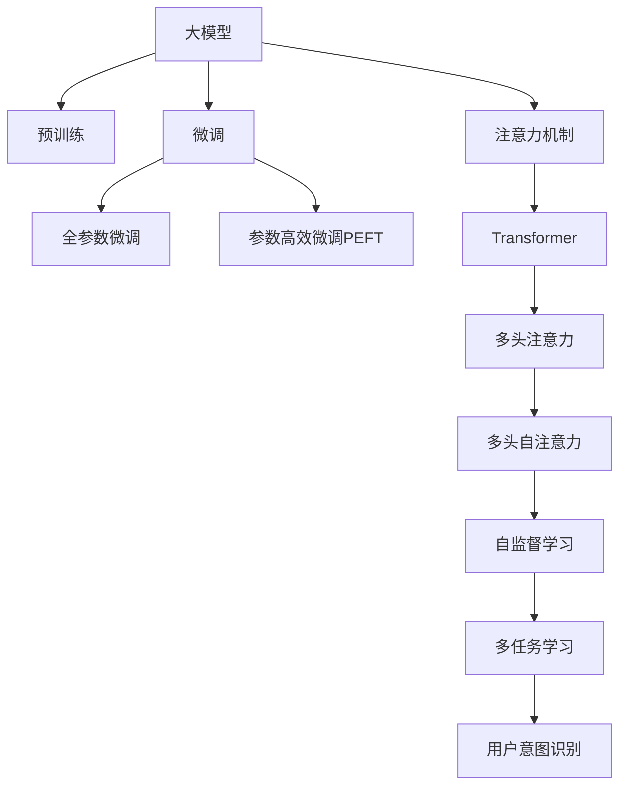

                 

# 基于大模型的电商平台用户意图理解

> 关键词：电商平台,用户意图,大模型,意图识别,自然语言处理(NLP),注意力机制,Transformer,预训练,微调,Fine-Tuning

## 1. 背景介绍

### 1.1 问题由来

电商平台作为现代商业的重要平台，日新月异，不断拓展着新的业务领域和应用场景。为提升用户体验、优化运营流程，电商平台需要实时捕捉用户的购物意图，提供精准的推荐、搜索和客服等服务。传统的意图识别方法依赖于基于规则或统计的语言模型，难以充分理解自然语言的多样性和复杂性，更难以处理长时间序列的意图演变。

近年来，大模型技术在自然语言处理(NLP)领域取得了显著进展，如GPT-3、BERT等预训练模型，通过海量的文本数据训练，具有强大的语言理解能力。将大模型应用于电商平台用户意图识别，有望大幅提升模型理解自然语言文本的深度和广度，从而提供更加个性化、智能化的服务。

### 1.2 问题核心关键点

电商平台用户意图识别的核心目标是通过用户输入的文本描述，分析并理解用户的真实购物意图，包括购买意图、浏览意图、评价意图等。大模型在预训练阶段通过大量文本数据的自监督学习，掌握通用的语言知识，通过微调过程针对电商平台数据进一步优化，从而能够准确识别不同类型的用户意图。

**核心难点**：
- 如何从海量电商平台数据中提取出有代表性的用户意图表示，避免模型过拟合或欠拟合。
- 如何通过有效的数据预处理，增强模型的泛化能力，适应不同类型的用户意图。
- 如何设计合适的损失函数和评估指标，评价模型的性能，并进行持续优化。

## 2. 核心概念与联系

### 2.1 核心概念概述

为更好地理解大模型在电商平台用户意图识别中的应用，本节将介绍几个关键概念：

- **大模型(Large Model)**：指如BERT、GPT-3等通过海量的文本数据预训练得到的语言模型，具有丰富的语言知识和语义理解能力。
- **预训练(Pre-training)**：指在大规模无标签文本语料上，通过自监督学习任务训练通用语言模型的过程。预训练使得模型学习到通用的语言表示。
- **微调(Fine-tuning)**：指在预训练模型的基础上，使用有标签的下游任务数据集进行有监督学习，优化模型在特定任务上的性能。
- **用户意图(Usage Intent)**：指用户在电商平台上希望完成的具体动作或目标，如购买商品、查询商品、评价商品等。
- **注意力机制(Attention Mechanism)**：指通过注意力权重筛选输入序列的关键信息，提升模型对序列的关注度和理解深度。
- **Transformer模型**：指使用自注意力机制，通过多头注意力机制并行计算，提升模型处理序列数据的能力。

这些概念之间存在紧密的联系，通过预训练获得的基础知识，再通过微调针对电商平台的特定需求进行调整和优化，大模型能够更加精准地理解和处理自然语言文本，提升用户意图识别的效果。

### 2.2 核心概念原理和架构的 Mermaid 流程图(Mermaid 流程节点中不要有括号、逗号等特殊字符)



这个流程图展示了预训练大模型在电商平台用户意图识别中的应用路径：

1. **大模型**通过预训练获得基础语言知识。
2. **注意力机制**使得模型能够筛选重要信息，提升序列理解能力。
3. **Transformer模型**通过多头注意力机制并行计算，增强模型处理序列数据的能力。
4. **预训练**在大规模语料上训练，学习通用的语言表示。
5. **微调**针对电商平台数据进一步优化，提升特定任务性能。
6. **多任务学习**将多个相关任务结合，提升模型泛化能力。
7. **用户意图识别**通过有监督学习，理解用户输入的购物意图。

## 3. 核心算法原理 & 具体操作步骤

### 3.1 算法原理概述

基于大模型的电商平台用户意图识别，本质上是通过自监督预训练和有监督微调的过程，使模型能够准确理解用户输入的意图。其核心思想如下：

1. **预训练阶段**：在无标签的电商文本数据上，通过自监督任务训练通用语言模型。如使用掩码语言模型任务，在输入序列中随机掩盖某些单词，训练模型预测被掩盖的单词，学习语言的上下文表示。

2. **微调阶段**：在电商平台标注的数据集上，通过有监督学习调整模型参数，使其能够准确预测用户意图。微调过程中，通过定义任务相关的损失函数，如交叉熵损失，优化模型在电商平台上的表现。

### 3.2 算法步骤详解

以下是具体的微调操作步骤：

**Step 1: 准备预训练模型和数据集**
- 选择合适的预训练语言模型，如BERT、GPT-3等，作为初始化参数。
- 收集电商平台的标注数据集，包括用户评论、商品描述、搜索词等文本，划分为训练集、验证集和测试集。

**Step 2: 设计任务适配层**
- 根据电商平台用户意图识别的任务需求，设计合适的任务适配层。如对于分类任务，通常使用线性分类器和交叉熵损失函数。

**Step 3: 设置微调超参数**
- 选择合适的优化算法及其参数，如AdamW、SGD等，设置学习率、批大小、迭代轮数等。
- 设置正则化技术及强度，包括权重衰减、Dropout、Early Stopping等。
- 确定冻结预训练参数的策略，如仅微调顶层，或全部参数都参与微调。

**Step 4: 执行梯度训练**
- 将训练集数据分批次输入模型，前向传播计算损失函数。
- 反向传播计算参数梯度，根据设定的优化算法和学习率更新模型参数。
- 周期性在验证集上评估模型性能，根据性能指标决定是否触发 Early Stopping。
- 重复上述步骤直到满足预设的迭代轮数或 Early Stopping 条件。

**Step 5: 测试和部署**
- 在测试集上评估微调后模型，对比微调前后的精度提升。
- 使用微调后的模型对新样本进行推理预测，集成到电商平台的推荐、搜索、客服等系统中。

### 3.3 算法优缺点

基于大模型的电商平台用户意图识别具有以下优点：
- **高效性**：通过微调，模型可以快速适应电商平台特定需求，提升意图识别效率。
- **泛化能力**：大模型具有较强的泛化能力，能够在不同电商平台和用户意图上表现良好。
- **可解释性**：微调过程保留了大模型的预训练权重，保留了一定的可解释性。

同时，该方法也存在以下缺点：
- **数据依赖**：微调依赖于电商平台标注数据，标注成本较高。
- **性能波动**：模型在缺乏足够标注数据的情况下，容易过拟合或欠拟合，导致性能波动。
- **内存消耗大**：大模型参数量大，内存消耗较大。

### 3.4 算法应用领域

大模型在电商平台用户意图识别中，已成功应用于多个实际场景：

- **推荐系统**：根据用户评论、商品描述等文本数据，识别用户购物意图，推荐合适商品。
- **智能客服**：分析用户查询信息，自动回复用户，提高客户满意度。
- **搜索系统**：解析用户输入的搜索词，判断用户搜索意图，优化搜索结果。
- **评价系统**：自动分析用户评论，判断用户对商品的好评与差评。

这些应用场景展示了大模型在电商平台用户意图识别中的广泛应用前景。

## 4. 数学模型和公式 & 详细讲解 & 举例说明（备注：数学公式请使用latex格式，latex嵌入文中独立段落使用 $$，段落内使用 $)
### 4.1 数学模型构建

记预训练语言模型为 $M_{\theta}$，其中 $\theta$ 为预训练得到的模型参数。假设电商平台标注数据集为 $D=\{(x_i, y_i)\}_{i=1}^N$，其中 $x_i$ 为输入文本，$y_i$ 为对应的用户意图标签。

定义模型 $M_{\theta}$ 在输入 $x$ 上的损失函数为 $\ell(M_{\theta}(x),y)$，则在数据集 $D$ 上的经验风险为：

$$
\mathcal{L}(\theta) = \frac{1}{N} \sum_{i=1}^N \ell(M_{\theta}(x_i),y_i)
$$

微调的优化目标是最小化经验风险，即找到最优参数：

$$
\theta^* = \mathop{\arg\min}_{\theta} \mathcal{L}(\theta)
$$

在实践中，我们通常使用基于梯度的优化算法（如SGD、AdamW等）来近似求解上述最优化问题。设 $\eta$ 为学习率，$\lambda$ 为正则化系数，则参数的更新公式为：

$$
\theta \leftarrow \theta - \eta \nabla_{\theta}\mathcal{L}(\theta) - \eta\lambda\theta
$$

其中 $\nabla_{\theta}\mathcal{L}(\theta)$ 为损失函数对参数 $\theta$ 的梯度，可通过反向传播算法高效计算。

### 4.2 公式推导过程

以下以分类任务为例，推导交叉熵损失函数及其梯度的计算公式。

假设模型 $M_{\theta}$ 在输入 $x$ 上的输出为 $\hat{y}=M_{\theta}(x) \in [0,1]$，表示样本属于正类的概率。真实标签 $y \in \{0,1\}$。则二分类交叉熵损失函数定义为：

$$
\ell(M_{\theta}(x),y) = -[y\log \hat{y} + (1-y)\log (1-\hat{y})]
$$

将其代入经验风险公式，得：

$$
\mathcal{L}(\theta) = -\frac{1}{N}\sum_{i=1}^N [y_i\log M_{\theta}(x_i)+(1-y_i)\log(1-M_{\theta}(x_i))]
$$

根据链式法则，损失函数对参数 $\theta_k$ 的梯度为：

$$
\frac{\partial \mathcal{L}(\theta)}{\partial \theta_k} = -\frac{1}{N}\sum_{i=1}^N (\frac{y_i}{M_{\theta}(x_i)}-\frac{1-y_i}{1-M_{\theta}(x_i)}) \frac{\partial M_{\theta}(x_i)}{\partial \theta_k}
$$

其中 $\frac{\partial M_{\theta}(x_i)}{\partial \theta_k}$ 可进一步递归展开，利用自动微分技术完成计算。

### 4.3 案例分析与讲解

以电商平台推荐系统为例，说明基于大模型的用户意图识别过程：

**Step 1: 预训练模型初始化**
- 选择BERT模型作为初始化参数，使用电商平台的评论、商品描述等文本数据进行预训练。

**Step 2: 设计任务适配层**
- 根据推荐任务，设计线性分类器作为输出层，使用交叉熵损失函数。

**Step 3: 设置微调超参数**
- 设置AdamW优化器，学习率为2e-5，批大小为16，迭代轮数为5。
- 设置正则化系数0.01，使用Dropout 0.1。

**Step 4: 执行梯度训练**
- 使用电商平台标注数据集进行微调，每个epoch使用训练集进行训练，验证集进行评估。
- 微调过程设置Early Stopping，当验证集性能不再提升时停止训练。

**Step 5: 测试和部署**
- 在测试集上评估微调后的推荐模型，计算准确率和召回率。
- 使用微调后的模型对用户输入的查询信息进行意图识别，推荐合适商品。

## 5. 项目实践：代码实例和详细解释说明
### 5.1 开发环境搭建

在进行电商平台用户意图识别实践前，需要先搭建好开发环境。以下是使用Python进行PyTorch开发的环境配置流程：

1. 安装Anaconda：从官网下载并安装Anaconda，用于创建独立的Python环境。

2. 创建并激活虚拟环境：
```bash
conda create -n pytorch-env python=3.8 
conda activate pytorch-env
```

3. 安装PyTorch：根据CUDA版本，从官网获取对应的安装命令。例如：
```bash
conda install pytorch torchvision torchaudio cudatoolkit=11.1 -c pytorch -c conda-forge
```

4. 安装Transformers库：
```bash
pip install transformers
```

5. 安装各类工具包：
```bash
pip install numpy pandas scikit-learn matplotlib tqdm jupyter notebook ipython
```

完成上述步骤后，即可在`pytorch-env`环境中开始电商平台用户意图识别的实践。

### 5.2 源代码详细实现

下面以分类任务为例，给出使用Transformers库对BERT模型进行电商平台用户意图识别的PyTorch代码实现。

首先，定义数据处理函数：

```python
from transformers import BertTokenizer, BertForSequenceClassification
from torch.utils.data import Dataset, DataLoader
from torch import nn
import torch

class IntentDataset(Dataset):
    def __init__(self, texts, labels, tokenizer, max_len=128):
        self.texts = texts
        self.labels = labels
        self.tokenizer = tokenizer
        self.max_len = max_len

    def __len__(self):
        return len(self.texts)

    def __getitem__(self, item):
        text = self.texts[item]
        label = self.labels[item]
        encoding = self.tokenizer(text, return_tensors='pt', max_length=self.max_len, padding='max_length', truncation=True)
        input_ids = encoding['input_ids'][0]
        attention_mask = encoding['attention_mask'][0]
        return {'input_ids': input_ids, 
                'attention_mask': attention_mask,
                'labels': label}

# 标签与id的映射
label2id = {'购买': 0, '浏览': 1, '评价': 2, '咨询': 3, '退货': 4, '其他': 5}
id2label = {v: k for k, v in label2id.items()}

# 创建dataset
tokenizer = BertTokenizer.from_pretrained('bert-base-cased')
train_dataset = IntentDataset(train_texts, train_labels, tokenizer)
dev_dataset = IntentDataset(dev_texts, dev_labels, tokenizer)
test_dataset = IntentDataset(test_texts, test_labels, tokenizer)
```

然后，定义模型和优化器：

```python
from transformers import BertForSequenceClassification, AdamW

model = BertForSequenceClassification.from_pretrained('bert-base-cased', num_labels=len(label2id))

optimizer = AdamW(model.parameters(), lr=2e-5)
```

接着，定义训练和评估函数：

```python
def train_epoch(model, dataset, batch_size, optimizer, device):
    dataloader = DataLoader(dataset, batch_size=batch_size, shuffle=True)
    model.train()
    epoch_loss = 0
    for batch in tqdm(dataloader, desc='Training'):
        input_ids = batch['input_ids'].to(device)
        attention_mask = batch['attention_mask'].to(device)
        labels = batch['labels'].to(device)
        model.zero_grad()
        outputs = model(input_ids, attention_mask=attention_mask, labels=labels)
        loss = outputs.loss
        epoch_loss += loss.item()
        loss.backward()
        optimizer.step()
    return epoch_loss / len(dataloader)

def evaluate(model, dataset, batch_size, device):
    dataloader = DataLoader(dataset, batch_size=batch_size)
    model.eval()
    preds, labels = [], []
    with torch.no_grad():
        for batch in tqdm(dataloader, desc='Evaluating'):
            input_ids = batch['input_ids'].to(device)
            attention_mask = batch['attention_mask'].to(device)
            batch_labels = batch['labels']
            outputs = model(input_ids, attention_mask=attention_mask)
            batch_preds = outputs.logits.argmax(dim=2).to('cpu').tolist()
            batch_labels = batch_labels.to('cpu').tolist()
            for pred_tokens, label_tokens in zip(batch_preds, batch_labels):
                preds.append(pred_tokens[:len(label_tokens)])
                labels.append(label_tokens)
                
    print(classification_report(labels, preds))
```

最后，启动训练流程并在测试集上评估：

```python
epochs = 5
batch_size = 16
device = torch.device('cuda') if torch.cuda.is_available() else torch.device('cpu')

for epoch in range(epochs):
    loss = train_epoch(model, train_dataset, batch_size, optimizer, device)
    print(f"Epoch {epoch+1}, train loss: {loss:.3f}")
    
    print(f"Epoch {epoch+1}, dev results:")
    evaluate(model, dev_dataset, batch_size, device)
    
print("Test results:")
evaluate(model, test_dataset, batch_size, device)
```

以上就是使用PyTorch对BERT进行电商平台用户意图识别的完整代码实现。可以看到，得益于Transformers库的强大封装，我们可以用相对简洁的代码完成BERT模型的加载和微调。

### 5.3 代码解读与分析

让我们再详细解读一下关键代码的实现细节：

**IntentDataset类**：
- `__init__`方法：初始化文本、标签、分词器等关键组件。
- `__len__`方法：返回数据集的样本数量。
- `__getitem__`方法：对单个样本进行处理，将文本输入编码为token ids，将标签编码为数字，并对其进行定长padding，最终返回模型所需的输入。

**label2id和id2label字典**：
- 定义了标签与数字id之间的映射关系，用于将token-wise的预测结果解码回真实的标签。

**训练和评估函数**：
- 使用PyTorch的DataLoader对数据集进行批次化加载，供模型训练和推理使用。
- 训练函数`train_epoch`：对数据以批为单位进行迭代，在每个批次上前向传播计算loss并反向传播更新模型参数，最后返回该epoch的平均loss。
- 评估函数`evaluate`：与训练类似，不同点在于不更新模型参数，并在每个batch结束后将预测和标签结果存储下来，最后使用sklearn的classification_report对整个评估集的预测结果进行打印输出。

**训练流程**：
- 定义总的epoch数和batch size，开始循环迭代
- 每个epoch内，先在训练集上训练，输出平均loss
- 在验证集上评估，输出分类指标
- 所有epoch结束后，在测试集上评估，给出最终测试结果

可以看到，PyTorch配合Transformers库使得BERT微调的代码实现变得简洁高效。开发者可以将更多精力放在数据处理、模型改进等高层逻辑上，而不必过多关注底层的实现细节。

当然，工业级的系统实现还需考虑更多因素，如模型的保存和部署、超参数的自动搜索、更灵活的任务适配层等。但核心的微调范式基本与此类似。

## 6. 实际应用场景
### 6.1 智能客服系统

基于大模型的电商平台用户意图识别，可以广泛应用于智能客服系统的构建。传统客服往往需要配备大量人力，高峰期响应缓慢，且一致性和专业性难以保证。而使用微调后的意图识别模型，可以7x24小时不间断服务，快速响应客户咨询，用自然流畅的语言解答各类常见问题。

在技术实现上，可以收集企业内部的历史客服对话记录，将问题和最佳答复构建成监督数据，在此基础上对预训练意图识别模型进行微调。微调后的意图识别模型能够自动理解用户意图，匹配最合适的答复模板进行回复。对于客户提出的新问题，还可以接入检索系统实时搜索相关内容，动态组织生成回答。如此构建的智能客服系统，能大幅提升客户咨询体验和问题解决效率。

### 6.2 个性化推荐系统

当前的推荐系统往往只依赖用户的历史行为数据进行物品推荐，无法深入理解用户的真实兴趣偏好。基于大模型微调技术，个性化推荐系统可以更好地挖掘用户行为背后的语义信息，从而提供更加个性化、智能化的服务。

在实践中，可以收集用户浏览、点击、评论、分享等行为数据，提取和用户交互的物品标题、描述、标签等文本内容。将文本内容作为模型输入，用户的后续行为（如是否点击、购买等）作为监督信号，在此基础上微调预训练语言模型。微调后的模型能够从文本内容中准确把握用户的兴趣点。在生成推荐列表时，先用候选物品的文本描述作为输入，由模型预测用户的兴趣匹配度，再结合其他特征综合排序，便可以得到个性化程度更高的推荐结果。

### 6.3 未来应用展望

随着大模型和微调方法的不断发展，基于大模型的方法将在更多领域得到应用，为传统行业带来变革性影响。

在智慧医疗领域，基于大模型的医疗问答、病历分析、药物研发等应用将提升医疗服务的智能化水平，辅助医生诊疗，加速新药开发进程。

在智能教育领域，微调技术可应用于作业批改、学情分析、知识推荐等方面，因材施教，促进教育公平，提高教学质量。

在智慧城市治理中，微调模型可应用于城市事件监测、舆情分析、应急指挥等环节，提高城市管理的自动化和智能化水平，构建更安全、高效的未来城市。

此外，在企业生产、社会治理、文娱传媒等众多领域，基于大模型微调的人工智能应用也将不断涌现，为经济社会发展注入新的动力。相信随着技术的日益成熟，微调方法将成为人工智能落地应用的重要范式，推动人工智能技术向更广阔的领域加速渗透。

## 7. 工具和资源推荐
### 7.1 学习资源推荐

为了帮助开发者系统掌握大模型在电商平台用户意图识别中的应用，这里推荐一些优质的学习资源：

1. 《Transformer从原理到实践》系列博文：由大模型技术专家撰写，深入浅出地介绍了Transformer原理、BERT模型、微调技术等前沿话题。

2. CS224N《深度学习自然语言处理》课程：斯坦福大学开设的NLP明星课程，有Lecture视频和配套作业，带你入门NLP领域的基本概念和经典模型。

3. 《Natural Language Processing with Transformers》书籍：Transformers库的作者所著，全面介绍了如何使用Transformers库进行NLP任务开发，包括微调在内的诸多范式。

4. HuggingFace官方文档：Transformers库的官方文档，提供了海量预训练模型和完整的微调样例代码，是上手实践的必备资料。

5. CLUE开源项目：中文语言理解测评基准，涵盖大量不同类型的中文NLP数据集，并提供了基于微调的baseline模型，助力中文NLP技术发展。

通过对这些资源的学习实践，相信你一定能够快速掌握大模型在电商平台用户意图识别中的精髓，并用于解决实际的NLP问题。
###  7.2 开发工具推荐

高效的开发离不开优秀的工具支持。以下是几款用于大模型电商平台用户意图识别开发的常用工具：

1. PyTorch：基于Python的开源深度学习框架，灵活动态的计算图，适合快速迭代研究。大部分预训练语言模型都有PyTorch版本的实现。

2. TensorFlow：由Google主导开发的开源深度学习框架，生产部署方便，适合大规模工程应用。同样有丰富的预训练语言模型资源。

3. Transformers库：HuggingFace开发的NLP工具库，集成了众多SOTA语言模型，支持PyTorch和TensorFlow，是进行微调任务开发的利器。

4. Weights & Biases：模型训练的实验跟踪工具，可以记录和可视化模型训练过程中的各项指标，方便对比和调优。与主流深度学习框架无缝集成。

5. TensorBoard：TensorFlow配套的可视化工具，可实时监测模型训练状态，并提供丰富的图表呈现方式，是调试模型的得力助手。

6. Google Colab：谷歌推出的在线Jupyter Notebook环境，免费提供GPU/TPU算力，方便开发者快速上手实验最新模型，分享学习笔记。

合理利用这些工具，可以显著提升大模型电商平台用户意图识别的开发效率，加快创新迭代的步伐。

### 7.3 相关论文推荐

大模型和微调技术的发展源于学界的持续研究。以下是几篇奠基性的相关论文，推荐阅读：

1. Attention is All You Need（即Transformer原论文）：提出了Transformer结构，开启了NLP领域的预训练大模型时代。

2. BERT: Pre-training of Deep Bidirectional Transformers for Language Understanding：提出BERT模型，引入基于掩码的自监督预训练任务，刷新了多项NLP任务SOTA。

3. Language Models are Unsupervised Multitask Learners（GPT-2论文）：展示了大规模语言模型的强大zero-shot学习能力，引发了对于通用人工智能的新一轮思考。

4. Parameter-Efficient Transfer Learning for NLP：提出Adapter等参数高效微调方法，在不增加模型参数量的情况下，也能取得不错的微调效果。

5. Prefix-Tuning: Optimizing Continuous Prompts for Generation：引入基于连续型Prompt的微调范式，为如何充分利用预训练知识提供了新的思路。

6. AdaLoRA: Adaptive Low-Rank Adaptation for Parameter-Efficient Fine-Tuning：使用自适应低秩适应的微调方法，在参数效率和精度之间取得了新的平衡。

这些论文代表了大模型微调技术的发展脉络。通过学习这些前沿成果，可以帮助研究者把握学科前进方向，激发更多的创新灵感。

## 8. 总结：未来发展趋势与挑战

### 8.1 总结

本文对基于大模型的电商平台用户意图识别方法进行了全面系统的介绍。首先阐述了大模型和微调技术的研究背景和意义，明确了微调在电商平台特定需求适配、用户意图识别中的独特价值。其次，从原理到实践，详细讲解了预训练和微调的数学原理和关键步骤，给出了电商平台用户意图识别的完整代码实例。同时，本文还探讨了该方法在智能客服、个性化推荐等电商场景中的应用，展示了其广泛的应用前景。

通过本文的系统梳理，可以看到，基于大模型的电商平台用户意图识别方法，通过预训练和微调，可以有效提升自然语言理解的深度和广度，从而提供更智能化的电商服务。该方法不仅在技术上具有优越性，还为电商平台的智能化转型提供了重要保障。未来，随着预训练语言模型的进一步演进，基于大模型的用户意图识别方法必将在电商领域发挥更加重要的作用。

### 8.2 未来发展趋势

展望未来，电商平台用户意图识别技术将呈现以下几个发展趋势：

1. **数据驱动优化**：通过收集更多的电商平台标注数据，进一步优化模型，提高意图识别准确率和泛化能力。

2. **多任务学习**：将用户意图识别与其他相关任务（如推荐、客服等）结合起来，进行联合优化，提升整体系统性能。

3. **自监督学习**：利用无标签数据进行预训练，减少对标注数据的依赖，提高模型的泛化能力和鲁棒性。

4. **参数高效微调**：开发更加高效的微调方法，只更新少部分关键参数，减少计算资源消耗，提高模型训练速度。

5. **知识增强**：将符号化的先验知识与神经网络模型融合，引导微调过程学习更准确的语言模型，提升意图识别效果。

6. **多模态融合**：结合图像、语音等多模态数据，提升用户意图识别的准确性和鲁棒性。

以上趋势凸显了电商平台用户意图识别技术的广阔前景。这些方向的探索发展，必将进一步提升模型性能，满足更多复杂和多样化的用户需求。

### 8.3 面临的挑战

尽管大模型在电商平台用户意图识别中已经取得了显著进展，但在实际应用中仍面临诸多挑战：

1. **标注数据依赖**：微调依赖于电商平台标注数据，数据获取和标注成本较高，数据质量直接影响模型性能。

2. **过拟合风险**：在标注数据不足的情况下，模型容易过拟合，导致泛化能力下降。

3. **计算资源消耗大**：大模型参数量大，内存消耗大，训练和推理效率有待提升。

4. **模型鲁棒性不足**：模型在缺乏足够标注数据的情况下，泛化能力受限，鲁棒性有待加强。

5. **可解释性不足**：模型决策过程难以解释，缺乏透明性和可信度，需要进一步提高模型的可解释性。

6. **隐私保护问题**：电商平台涉及大量用户隐私数据，如何保障用户隐私安全，保护用户数据不被滥用，是重要的研究方向。

以上挑战凸显了电商平台用户意图识别技术的复杂性和综合性。为了应对这些挑战，未来的研究需要在多个方面进行深入探索和创新。

### 8.4 研究展望

面对电商平台用户意图识别所面临的种种挑战，未来的研究需要在以下几个方面寻求新的突破：

1. **数据增强**：通过数据增强技术，扩充训练集，提升模型泛化能力。

2. **知识图谱融合**：将知识图谱与自然语言理解结合，提升意图识别的准确性和鲁棒性。

3. **强化学习**：引入强化学习技术，优化模型参数，提升意图识别效果。

4. **隐私保护**：采用差分隐私、联邦学习等技术，保护用户隐私安全。

5. **可解释性提升**：通过模型解释工具，增强模型的透明性和可信度。

6. **跨领域迁移**：开发跨领域迁移学习技术，使模型能够应用于不同电商平台的意图识别任务。

这些研究方向的探索，必将引领电商平台用户意图识别技术迈向更高的台阶，为电商平台的智能化转型提供强有力的技术支持。

## 9. 附录：常见问题与解答

**Q1：电商平台用户意图识别是否适用于所有电商场景？**

A: 电商平台用户意图识别在大多数电商场景中都能取得不错的效果。但不同平台和领域可能存在差异，需要根据具体情况进行调整和优化。例如，对于垂直电商、B2B电商等特定场景，可能需要额外的数据和任务适配层。

**Q2：如何处理电商平台中的长文本数据？**

A: 电商平台中的长文本数据，如商品描述、用户评论等，可以通过分词和截断等方法进行预处理。如果数据过长，可以采用基于Transformer的模型，如Encoder-Decoder结构，增强模型处理长文本的能力。

**Q3：如何平衡模型精度和效率？**

A: 在电商平台用户意图识别中，模型精度和效率都很重要。可以通过参数高效微调、分布式训练等技术，优化模型结构，提升计算效率，同时保持较高的识别精度。

**Q4：电商平台用户意图识别如何应对恶意用户？**

A: 电商平台可能会面临恶意用户，如虚假评论、恶意投诉等。可以通过异常检测技术，检测并过滤掉异常数据，提升模型的鲁棒性。同时，结合人工审核，进一步保障电商平台的用户体验和信誉。

**Q5：电商平台用户意图识别的未来发展方向有哪些？**

A: 电商平台用户意图识别的未来发展方向包括：利用多模态数据融合，提升模型鲁棒性；引入跨领域迁移学习，提高模型泛化能力；开发智能客服系统，提供更加个性化的服务；结合知识图谱，提升意图识别的准确性和深度。

这些方向展示了电商平台用户意图识别技术的巨大潜力和应用前景，值得我们深入研究和探索。

---

作者：禅与计算机程序设计艺术 / Zen and the Art of Computer Programming

