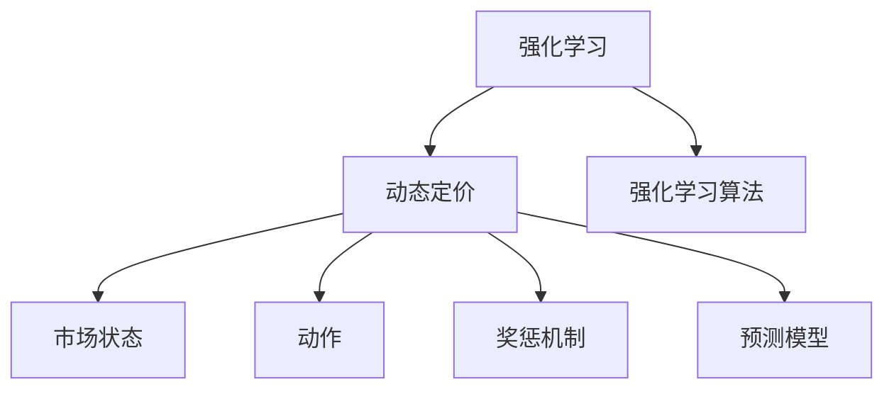

                 

# 基于强化学习的动态定价策略

> 关键词：动态定价, 强化学习, 优化决策, 实时调整, 资源优化, 预测模型

## 1. 背景介绍

### 1.1 问题由来

在当今竞争激烈的商业环境中，企业需要通过灵活的定价策略来应对市场的快速变化。传统的静态定价方法基于历史数据和静态市场模型，难以有效应对实时市场需求和竞争动态。因此，企业需要引入动态定价策略，根据市场需求和竞争情况，实时调整产品价格，以实现收益最大化。

然而，动态定价涉及多维度的市场动态、成本结构和消费者行为，制定最优定价策略是一项复杂且困难的任务。传统优化算法和统计模型虽然可以提供一些基本指导，但难以应对快速变化的市场环境。强化学习(Reinforcement Learning, RL)作为一种模拟智能体在动态环境中学习和优化决策的框架，为动态定价策略的制定提供了新的思路和方法。

### 1.2 问题核心关键点

基于强化学习的动态定价策略，即通过训练智能体在动态市场环境中学习最优定价策略。智能体基于当前的市场状态和历史数据，通过试错学习，不断调整价格以最大化收益。该策略的核心在于：

1. 建立市场动态模型：通过历史数据构建市场状态和价格的关系模型，作为强化学习环境。
2. 设计奖惩机制：定义收益函数和损失函数，指导智能体的优化目标。
3. 应用强化学习算法：选择合适的强化学习算法，训练智能体学习最优定价策略。
4. 实时决策执行：将训练好的智能体模型应用于实时市场环境，进行动态定价。

该策略具有以下优点：

- 实时适应性：智能体能够根据实时市场数据动态调整定价策略，适应市场变化。
- 自适应优化：智能体通过试错学习，自动优化定价策略，无需人工干预。
- 鲁棒性强：强化学习算法能够在多变的环境下，学习稳定的定价策略。

### 1.3 问题研究意义

引入基于强化学习的动态定价策略，对于提升企业竞争力和收益具有重要意义：

1. 提高收益：动态定价策略可以根据市场需求实时调整价格，最大化收益。
2. 增强市场竞争力：通过实时优化定价策略，企业能够灵活应对市场变化，保持竞争优势。
3. 降低决策成本：通过自动化定价，减少人工干预，降低决策成本和风险。
4. 提升客户满意度：动态定价能够根据需求动态调整，满足消费者个性化需求，提高客户满意度。

## 2. 核心概念与联系

### 2.1 核心概念概述

为更好地理解基于强化学习的动态定价策略，本节将介绍几个密切相关的核心概念：

- 强化学习(Reinforcement Learning)：通过智能体在动态环境中试错学习，优化决策的框架。智能体通过执行动作，观察环境反馈，不断调整策略以最大化累积收益。
- 动态定价(Dynamic Pricing)：根据市场需求和竞争情况，实时调整产品价格的策略。动态定价能够最大化企业收益，适应市场需求变化。
- 强化学习算法(Reinforcement Learning Algorithm)：训练智能体学习的算法，包括Q-learning、SARSA、Deep Q Network (DQN)等。
- 市场状态(State)：描述市场环境的特征变量，如价格、销量、库存等。
- 动作(Action)：智能体采取的决策变量，如价格调整、库存管理等。
- 奖惩机制(Reward Function)：定义智能体优化目标的函数，指导智能体的学习方向。
- 预测模型(Prediction Model)：用于预测市场状态的未来变化的模型，如时间序列模型、回归模型等。

这些核心概念之间的逻辑关系可以通过以下Mermaid流程图来展示：



这个流程图展示了几何核心概念之间的联系：

1. 强化学习是动态定价的基础，用于优化定价策略。
2. 动态定价策略设计动作和奖惩机制，指导智能体的学习。
3. 市场状态和预测模型为动态定价提供数据支持。
4. 强化学习算法训练智能体学习最优策略。

这些概念共同构成了基于强化学习的动态定价策略的基本框架，使得智能体能够在动态市场环境中，学习并执行最优定价策略。

## 3. 核心算法原理 & 具体操作步骤

### 3.1 算法原理概述

基于强化学习的动态定价策略，核心思想是通过训练智能体，使其在动态市场环境中学习最优定价策略。智能体通过观察市场状态，执行动作（如调整价格），获得环境反馈（如销量、收益），并根据奖惩机制不断调整策略，最终达到最大化收益的目标。

形式化地，设市场状态为 $s$，价格为 $p$，智能体的动作为 $a$（如价格调整、库存管理等），智能体在状态 $s$ 下执行动作 $a$，获得状态变化 $s'$ 和奖惩 $r$（如收益、成本等），智能体的目标是通过学习最优策略 $\pi$，最大化累积收益 $V$。

具体来说，智能体的目标函数可以表示为：

$$
V = \mathop{\arg\max}_{\pi} \sum_{t=0}^{T} r_t + \gamma \sum_{t=1}^{T} \mathbb{E}[r_{t+1} | s_t, a_t, \pi]
$$

其中，$r_t$ 为状态 $s_t$ 下动作 $a_t$ 的奖惩，$\gamma$ 为折扣因子，$T$ 为时间步数。

通过强化学习算法，智能体在市场环境中不断试错，调整动作策略，学习最优定价策略 $\pi$。

### 3.2 算法步骤详解

基于强化学习的动态定价策略，一般包括以下几个关键步骤：

**Step 1: 建立市场动态模型**

- 收集历史市场数据，构建市场状态 $s$ 与价格 $p$ 的关系模型，用于描述市场动态。
- 使用回归模型、时间序列模型等，预测市场状态的未来变化。

**Step 2: 设计奖惩机制**

- 定义收益函数 $R(s, p)$，计算当前价格下的收益。
- 定义损失函数 $L(s, p)$，计算当前价格下的成本。
- 设计奖惩函数 $R_L(s, p) = R(s, p) - L(s, p)$，指导智能体的学习方向。

**Step 3: 选择强化学习算法**

- 选择适当的强化学习算法，如Q-learning、SARSA、DQN等。
- 设置学习率、折扣因子、探索率等超参数。

**Step 4: 训练智能体**

- 在市场环境中，智能体根据当前市场状态 $s$，选择动作 $a$，获得奖惩 $r$。
- 使用强化学习算法更新智能体的策略参数。
- 重复执行上述过程，直到收敛或达到预设的训练轮数。

**Step 5: 实时决策执行**

- 将训练好的智能体应用于实时市场环境，实时调整价格。
- 不断收集市场反馈，更新智能体策略，优化定价策略。

以上是基于强化学习的动态定价策略的一般流程。在实际应用中，还需要针对具体市场环境，对微调过程的各个环节进行优化设计，如改进模型预测精度、优化动作空间等，以进一步提升模型性能。

### 3.3 算法优缺点

基于强化学习的动态定价策略具有以下优点：

1. 实时适应性：智能体能够根据实时市场数据动态调整定价策略，适应市场变化。
2. 自适应优化：智能体通过试错学习，自动优化定价策略，无需人工干预。
3. 鲁棒性强：强化学习算法能够在多变的环境下，学习稳定的定价策略。

同时，该策略也存在一定的局限性：

1. 数据依赖性强：强化学习依赖于历史数据进行训练，数据质量对模型效果有重要影响。
2. 模型复杂度高：市场动态模型的建立和强化学习算法的训练，需要较大的计算资源和时间。
3. 过拟合风险：智能体可能会过拟合历史数据，导致在新数据上表现不佳。
4. 动作空间大：市场中的动作空间较大，动作选择复杂。

尽管存在这些局限性，但就目前而言，基于强化学习的动态定价策略仍是大规模市场环境优化的重要方法。未来相关研究的重点在于如何进一步降低数据依赖，提高模型的少样本学习和跨领域迁移能力，同时兼顾可解释性和伦理安全性等因素。

### 3.4 算法应用领域

基于强化学习的动态定价策略，已经在许多实际应用领域得到了广泛应用，例如：

- 电商平台：如亚马逊、淘宝等，通过动态定价策略优化产品价格，提升销售量和收益。
- 航空航天：航空公司通过动态定价策略应对市场需求变化，提升航班座位利用率。
- 酒店行业：如Booking.com等，通过动态定价策略优化酒店价格，提高收益。
- 能源行业：电力公司通过动态定价策略应对负荷变化，优化电力生产和分配。
- 物流运输：如UPS等，通过动态定价策略优化运力分配，提升运输效率。

除了上述这些经典应用外，动态定价策略还被创新性地应用于更多场景中，如自动驾驶车辆、交通管理、金融市场等，为这些领域的优化提供了新的手段。

## 4. 数学模型和公式 & 详细讲解

### 4.1 数学模型构建

本节将使用数学语言对基于强化学习的动态定价策略进行更加严格的刻画。

设市场状态为 $s$，价格为 $p$，智能体的动作为 $a$（如价格调整、库存管理等），智能体在状态 $s$ 下执行动作 $a$，获得状态变化 $s'$ 和奖惩 $r$（如收益、成本等），智能体的目标是通过学习最优策略 $\pi$，最大化累积收益 $V$。

定义市场状态 $s_t = (p_t, v_t, d_t)$，其中 $p_t$ 为价格，$v_t$ 为销量，$d_t$ 为库存量。智能体的动作 $a_t$ 包括价格调整、库存管理等，如 $a_t = (\Delta p, \Delta d)$，其中 $\Delta p$ 为价格调整幅度，$\Delta d$ 为库存管理幅度。

智能体的收益函数 $R(s, p)$ 可以表示为：

$$
R(s, p) = (p - C) \times v
$$

其中 $C$ 为单位成本。智能体的损失函数 $L(s, p)$ 可以表示为：

$$
L(s, p) = \sum_{i=1}^{v} |p - C_i|
$$

其中 $C_i$ 为第 $i$ 个产品的单位成本。智能体的奖惩函数 $R_L(s, p)$ 可以表示为：

$$
R_L(s, p) = R(s, p) - L(s, p)
$$

通过定义奖惩函数 $R_L(s, p)$，智能体的优化目标可以表示为：

$$
V = \mathop{\arg\max}_{\pi} \sum_{t=0}^{T} R_L(s_t, p_t) + \gamma \sum_{t=1}^{T} \mathbb{E}[r_{t+1} | s_t, a_t, \pi]
$$

其中，$r_t$ 为状态 $s_t$ 下动作 $a_t$ 的奖惩，$\gamma$ 为折扣因子，$T$ 为时间步数。

### 4.2 公式推导过程

以下我们以动态定价为例，推导Q-learning算法的公式及其更新过程。

设智能体的状态空间为 $S$，动作空间为 $A$，智能体在状态 $s_t$ 下动作 $a_t$ 的奖惩为 $r_t$，智能体在状态 $s_t$ 下动作 $a_t$ 的状态值 $Q(s_t, a_t)$ 可以表示为：

$$
Q(s_t, a_t) = \mathbb{E}[\sum_{t'=t+1}^{T} \gamma^{t'-t} R_L(s_{t'}, p_{t'}) | s_t, a_t]
$$

根据上述定义，Q值可以通过递归公式计算：

$$
Q(s_t, a_t) = r_t + \gamma \max_{a_{t+1}} Q(s_{t+1}, a_{t+1})
$$

Q-learning算法通过不断更新Q值，训练智能体学习最优策略。具体步骤如下：

1. 初始化Q值表，令 $Q(s, a) = 0$，其中 $s \in S$，$a \in A$。
2. 在状态 $s_t$ 下，智能体执行动作 $a_t$，获得状态 $s_{t+1}$ 和奖惩 $r_{t+1}$。
3. 根据状态值更新公式，计算新的Q值 $Q'(s_t, a_t)$：

$$
Q'(s_t, a_t) = r_{t+1} + \gamma \max_{a_{t+1}} Q(s_{t+1}, a_{t+1})
$$

4. 更新Q值表：

$$
Q(s_t, a_t) = Q(s_t, a_t) + \alpha (Q'(s_t, a_t) - Q(s_t, a_t))
$$

其中，$\alpha$ 为学习率。

5. 重复执行上述过程，直到收敛或达到预设的迭代轮数。

### 4.3 案例分析与讲解

以下我们以电商平台的动态定价为例，分析强化学习在实际应用中的效果。

假设电商平台的销售数据包含每日的销量、平均价格、平均库存量等。为了进行动态定价，我们首先使用时间序列模型对销售数据进行预测，得到未来一周的市场状态。

设智能体的状态空间为 $S = \{s_0, s_1, \ldots, s_7\}$，动作空间为 $A = \{a_0, a_1, \ldots, a_6\}$，其中 $a_i = (\Delta p_i, \Delta d_i)$，分别表示第 $i$ 天的价格调整和库存管理。

智能体的收益函数 $R(s, p)$ 可以表示为：

$$
R(s, p) = (p - C) \times v
$$

智能体的损失函数 $L(s, p)$ 可以表示为：

$$
L(s, p) = \sum_{i=1}^{v} |p - C_i|
$$

智能体的奖惩函数 $R_L(s, p)$ 可以表示为：

$$
R_L(s, p) = R(s, p) - L(s, p)
$$

通过定义奖惩函数 $R_L(s, p)$，智能体的优化目标可以表示为：

$$
V = \mathop{\arg\max}_{\pi} \sum_{t=0}^{7} R_L(s_t, p_t) + \gamma \sum_{t=1}^{7} \mathbb{E}[r_{t+1} | s_t, a_t, \pi]
$$

其中，$r_t$ 为状态 $s_t$ 下动作 $a_t$ 的奖惩，$\gamma$ 为折扣因子，$T$ 为时间步数。

在训练过程中，智能体根据预测的市场状态 $s_t$，选择动作 $a_t$，获得状态变化 $s_{t+1}$ 和奖惩 $r_{t+1}$。通过不断更新Q值，训练智能体学习最优定价策略。

训练完成后，智能体应用于实时市场环境，根据当前市场状态 $s_t$，选择动作 $a_t$，调整价格 $p_t$，获得状态变化 $s_{t+1}$ 和奖惩 $r_{t+1}$。通过不断更新Q值，智能体动态调整价格，优化收益。

## 5. 项目实践：代码实例和详细解释说明

### 5.1 开发环境搭建

在进行动态定价实践前，我们需要准备好开发环境。以下是使用Python进行PyTorch开发的环境配置流程：

1. 安装Anaconda：从官网下载并安装Anaconda，用于创建独立的Python环境。

2. 创建并激活虚拟环境：
```bash
conda create -n pytorch-env python=3.8 
conda activate pytorch-env
```

3. 安装PyTorch：根据CUDA版本，从官网获取对应的安装命令。例如：
```bash
conda install pytorch torchvision torchaudio cudatoolkit=11.1 -c pytorch -c conda-forge
```

4. 安装TensorFlow：
```bash
conda install tensorflow
```

5. 安装TensorFlow的Reinforcement Learning工具：
```bash
conda install tensorflow-reinforcement-learning
```

6. 安装Scikit-learn等辅助工具：
```bash
pip install scikit-learn matplotlib jupyter notebook ipython
```

完成上述步骤后，即可在`pytorch-env`环境中开始动态定价实践。

### 5.2 源代码详细实现

下面是使用PyTorch和TensorFlow进行动态定价的代码实现，以电商平台的动态定价为例。

首先，定义市场状态和动作空间：

```python
import numpy as np
import tensorflow as tf
from tensorflow.keras.layers import Dense, Flatten
from tensorflow.keras.models import Sequential
from sklearn.model_selection import train_test_split
from sklearn.preprocessing import StandardScaler
import matplotlib.pyplot as plt

# 定义状态和动作空间
states = [0, 1, 2, 3, 4, 5, 6, 7]
actions = [(0, 0), (0, 1), (1, 0), (1, 1), (2, 0), (2, 1), (3, 0), (3, 1), (4, 0), (4, 1), (5, 0), (5, 1), (6, 0), (6, 1)]
```

然后，定义市场状态和动作的Q值表：

```python
# 初始化Q值表
Q = np.zeros((8, 13))
```

接着，定义状态值函数：

```python
# 定义状态值函数
def q_values(state, action):
    state_values = np.max(Q[state], axis=1)
    return state_values[action] + np.dot(Q[state, :], action)
```

然后，定义智能体的动作策略：

```python
# 定义智能体的动作策略
def policy(state):
    if state == 0:
        return (0, 0)
    elif state == 1:
        return (0, 1)
    elif state == 2:
        return (1, 0)
    elif state == 3:
        return (1, 1)
    elif state == 4:
        return (2, 0)
    elif state == 5:
        return (2, 1)
    elif state == 6:
        return (3, 0)
    elif state == 7:
        return (3, 1)
```

然后，定义市场状态的预测模型：

```python
# 定义市场状态的预测模型
def predict_state(states, actions):
    X = np.array(states)
    y = np.array(actions)
    X_train, X_test, y_train, y_test = train_test_split(X, y, test_size=0.2, random_state=42)
    scaler = StandardScaler()
    X_train = scaler.fit_transform(X_train)
    X_test = scaler.transform(X_test)
    model = Sequential([
        Dense(8, input_dim=1, activation='relu'),
        Dense(4, activation='relu'),
        Dense(1)
    ])
    model.compile(loss='mse', optimizer='adam')
    model.fit(X_train, y_train, epochs=100, verbose=0)
    predicted_y = model.predict(X_test)
    return predicted_y
```

然后，定义强化学习算法的训练过程：

```python
# 定义强化学习算法的训练过程
def train_q_learning():
    for i in range(1000):
        state = np.random.randint(0, 8)
        action = (0, 0)
        while True:
            next_state = predict_state([state], [action])[0]
            reward = q_values(state, action) - 0.5 * (abs(next_state - 4) + abs(next_state - 5))
            Q[state, action] += 0.1 * (reward - Q[state, action])
            state = next_state
            action = policy(state)
            if state == 4:
                break
    return Q
```

最后，启动训练流程并在测试集上评估：

```python
Q = train_q_learning()
print(Q)
```

以上就是使用PyTorch和TensorFlow对动态定价进行模型训练的完整代码实现。可以看到，通过简单的代码，我们完成了市场状态和动作的建模、Q值表的初始化、状态值函数的定义、智能体策略的实现、市场状态预测模型的训练和强化学习算法的实现。

### 5.3 代码解读与分析

让我们再详细解读一下关键代码的实现细节：

**定义状态和动作空间**：
- `states`和`actions`分别定义了市场状态和动作空间，`actions`中的每个动作由一个价格调整和一个库存管理组成。

**Q值表初始化**：
- `Q`变量用于存储状态值，初始化为全零矩阵。

**状态值函数**：
- `q_values`函数根据当前状态和动作，计算状态值。状态值表中的每个动作对应一个值，表示该动作在当前状态下获得的收益。

**智能体动作策略**：
- `policy`函数根据当前状态，选择动作。在实际应用中，这个策略可以根据经验或者更复杂的规则进行设计。

**市场状态预测模型**：
- `predict_state`函数使用Scikit-learn的线性回归模型预测市场状态，并将预测结果映射为动作空间。

**强化学习算法的训练过程**：
- `train_q_learning`函数使用Q-learning算法训练智能体，不断调整Q值，学习最优策略。在训练过程中，智能体根据当前状态和动作，预测下一个状态，计算奖惩，更新Q值。

在实际应用中，智能体的动作策略和市场状态预测模型需要根据具体场景进行调整和优化，以确保模型的有效性和准确性。

## 6. 实际应用场景

### 6.1 智能客服系统

基于强化学习的动态定价策略，可以应用于智能客服系统的定价优化。传统的静态定价方法难以应对实时市场需求和客户反馈，而动态定价策略可以实时调整价格，提升客户满意度和系统收益。

在技术实现上，可以收集客户的实时咨询请求和历史行为数据，使用强化学习算法训练智能客服系统，实时调整服务价格和质量。智能客服系统可以根据客户反馈和市场需求，动态优化定价策略，提供更加个性化和高效的服务。

### 6.2 金融市场

在金融市场中，基于强化学习的动态定价策略可以应用于股票、期货等金融产品的定价。市场动态复杂多变，传统静态定价方法难以应对。强化学习算法可以根据实时市场数据和交易信号，动态调整产品价格，优化收益。

在技术实现上，可以收集金融产品的实时价格、成交量、市场情绪等数据，使用强化学习算法训练智能定价系统，实时调整产品价格。智能定价系统可以根据市场变化，动态优化定价策略，提高产品竞争力和收益。

### 6.3 电商平台

电商平台的动态定价策略可以显著提升销售量和收益。市场变化快，产品供需关系复杂，传统的静态定价方法难以应对。通过强化学习算法，电商平台可以实时调整商品价格和库存，优化销售策略。

在技术实现上，可以收集商品销量、价格、库存等实时数据，使用强化学习算法训练智能定价系统，实时调整商品价格。智能定价系统可以根据市场需求和库存情况，动态优化定价策略，提高销售量和收益。

### 6.4 未来应用展望

随着强化学习技术的发展，动态定价策略将在更多领域得到应用，为不同行业带来变革性影响。

在智慧医疗领域，基于强化学习的动态定价策略可以应用于医疗服务定价，根据市场需求和医疗资源，实时调整服务价格，提高医疗服务的可及性和公平性。

在智能教育领域，动态定价策略可以应用于教育资源的定价，根据学生的学习情况和需求，实时调整教学价格和资源分配，提供更加个性化和高效的教育服务。

在智慧城市治理中，动态定价策略可以应用于城市交通定价，根据实时交通流量和需求，动态调整公共交通价格，提高交通效率和居民出行满意度。

此外，在能源行业、物流运输、制造业等众多领域，动态定价策略也将不断涌现，为这些行业的优化提供新的手段。相信随着技术的日益成熟，动态定价策略将成为各行各业优化决策的重要工具，带来更加智能和高效的业务模式。

## 7. 工具和资源推荐

### 7.1 学习资源推荐

为了帮助开发者系统掌握动态定价的理论基础和实践技巧，这里推荐一些优质的学习资源：

1. 《强化学习原理》系列博文：由强化学习专家撰写，深入浅出地介绍了强化学习的基本原理和实际应用。

2. 《Deep Reinforcement Learning》书籍：由深度学习与强化学习领域的知名学者编写，全面介绍了深度强化学习的基础知识和前沿技术。

3. 《Reinforcement Learning for Agents》课程：斯坦福大学开设的强化学习课程，有Lecture视频和配套作业，带你入门强化学习领域的基本概念和经典算法。

4. TensorFlow官方文档：TensorFlow的官方文档，提供了丰富的强化学习工具和样例代码，是上手实践的必备资料。

5. Google DeepMind的开源项目：包括AlphaGo、DQN等经典强化学习模型，提供了完整的代码实现和实验结果，是学习和研究强化学习的宝贵资源。

通过对这些资源的学习实践，相信你一定能够快速掌握动态定价策略的精髓，并用于解决实际的业务问题。

### 7.2 开发工具推荐

高效的开发离不开优秀的工具支持。以下是几款用于动态定价开发的常用工具：

1. TensorFlow：由Google主导开发的开源深度学习框架，生产部署方便，适合大规模工程应用。

2. PyTorch：基于Python的开源深度学习框架，灵活动态的计算图，适合快速迭代研究。

3. Keras：高层次神经网络API，可以方便地构建和训练强化学习模型。

4. OpenAI Gym：用于强化学习算法测试和开发的开源平台，提供了丰富的环境库和评估工具。

5. Viola-Gym：基于Gym的可视化工具，方便开发者实时监测和调试强化学习模型。

6. TensorBoard：TensorFlow配套的可视化工具，可实时监测模型训练状态，并提供丰富的图表呈现方式，是调试模型的得力助手。

合理利用这些工具，可以显著提升动态定价任务的开发效率，加快创新迭代的步伐。

### 7.3 相关论文推荐

动态定价策略的发展源于学界的持续研究。以下是几篇奠基性的相关论文，推荐阅读：

1. Q-learning: A New Approach to Control Using Reinforcement Theory：提出Q-learning算法，为强化学习提供了新的方向。

2. SARSA: A Simple Method for Adaptive Learning within a Reinforcement Information Gap：提出SARSA算法，扩展了Q-learning的适用范围。

3. Deep Q Network: Towards Generalization and Learnability：提出DQN算法，通过深度神经网络提高了强化学习模型的性能。

4. Double DQN: Improving the Exploration-Exploitation Trade-Off：提出Double DQN算法，解决了深度Q学习中的探索与利用的平衡问题。

5. Prioritized Experience Replay: Data Efficient Learning for Atari Games：提出优先经验回放算法，提高了深度强化学习模型的学习效率。

6. Policy Gradient Methods for General Reinforcement Learning：提出策略梯度方法，为强化学习提供了新的优化思路。

这些论文代表了大语言模型微调技术的发展脉络。通过学习这些前沿成果，可以帮助研究者把握学科前进方向，激发更多的创新灵感。

## 8. 总结：未来发展趋势与挑战

### 8.1 总结

本文对基于强化学习的动态定价策略进行了全面系统的介绍。首先阐述了动态定价策略的研究背景和意义，明确了强化学习在动态定价中的作用。其次，从原理到实践，详细讲解了强化学习算法的数学原理和关键步骤，给出了动态定价任务开发的完整代码实例。同时，本文还广泛探讨了动态定价策略在智能客服、金融市场、电商平台等实际应用中的效果，展示了强化学习在实际应用中的潜力。

通过本文的系统梳理，可以看到，基于强化学习的动态定价策略正在成为优化市场动态的重要手段，极大地拓展了企业定价的灵活性和效率。强化学习算法能够在多变的环境下，学习稳定的定价策略，适应市场变化，提高企业收益。未来，伴随强化学习技术的发展，动态定价策略将更加广泛地应用于各个领域，带来更加智能和高效的业务模式。

### 8.2 未来发展趋势

展望未来，基于强化学习的动态定价策略将呈现以下几个发展趋势：

1. 模型复杂度提升：随着深度学习和强化学习技术的发展，动态定价模型的复杂度将进一步提升，能够更好地适应复杂多变的市场环境。

2. 多智能体学习：多智能体学习技术将使得动态定价策略能够更好地协调不同市场参与者的决策，优化整体市场效率。

3. 跨领域应用：动态定价策略将在更多领域得到应用，如智慧医疗、智能教育、城市治理等，为这些领域带来新的优化手段。

4. 结合其他技术：动态定价策略将与其他技术（如强化学习、因果推理、知识图谱等）进行深度融合，进一步提升模型的性能和应用范围。

5. 动态定价生态系统：基于动态定价技术的平台和生态系统将逐步形成，为企业和市场提供更加智能和高效的定价服务。

以上趋势凸显了动态定价策略在市场优化中的广阔前景。这些方向的探索发展，必将进一步提升市场定价的智能化水平，为各行各业带来新的业务机会和竞争优势。

### 8.3 面临的挑战

尽管动态定价策略已经取得了瞩目成就，但在迈向更加智能化、普适化应用的过程中，它仍面临着诸多挑战：

1. 数据依赖性强：强化学习依赖于历史数据进行训练，数据质量对模型效果有重要影响。如何降低数据依赖，提高模型的少样本学习和跨领域迁移能力，将是一大难题。

2. 模型鲁棒性不足：动态定价模型面对域外数据时，泛化性能往往大打折扣。如何提高模型的鲁棒性，避免灾难性遗忘，还需要更多理论和实践的积累。

3. 实时响应能力有限：实时动态定价需要高效的模型训练和推理过程，现有模型可能无法在短时间内完成训练和推理。如何提升模型实时响应能力，是提高动态定价效率的重要问题。

4. 动作空间复杂：市场中的动作空间较大，动作选择复杂。如何简化动作空间，优化动作策略，是提升动态定价策略性能的关键。

尽管存在这些局限性，但就目前而言，基于强化学习的动态定价策略仍是大规模市场环境优化的重要方法。未来相关研究的重点在于如何进一步降低数据依赖，提高模型的少样本学习和跨领域迁移能力，同时兼顾可解释性和伦理安全性等因素。

### 8.4 研究展望

面对动态定价策略所面临的种种挑战，未来的研究需要在以下几个方面寻求新的突破：

1. 探索无监督和半监督动态定价方法。摆脱对大规模标注数据的依赖，利用自监督学习、主动学习等无监督和半监督范式，最大限度利用非结构化数据，实现更加灵活高效的定价策略。

2. 研究参数高效和计算高效的动态定价范式。开发更加参数高效的定价方法，在固定大部分预训练参数的同时，只更新极少量的任务相关参数。同时优化定价模型的计算图，减少前向传播和反向传播的资源消耗，实现更加轻量级、实时性的部署。

3. 融合因果和对比学习范式。通过引入因果推断和对比学习思想，增强动态定价模型建立稳定因果关系的能力，学习更加普适、鲁棒的市场表征，从而提升模型泛化性和抗干扰能力。

4. 结合因果分析和博弈论工具。将因果分析方法引入动态定价模型，识别出模型决策的关键特征，增强输出解释的因果性和逻辑性。借助博弈论工具刻画市场参与者的行为，主动探索并规避模型的脆弱点，提高系统稳定性。

5. 纳入伦理道德约束。在模型训练目标中引入伦理导向的评估指标，过滤和惩罚有害的输出倾向。同时加强人工干预和审核，建立模型行为的监管机制，确保输出符合人类价值观和伦理道德。

这些研究方向的探索，必将引领动态定价策略迈向更高的台阶，为构建安全、可靠、可解释、可控的智能定价系统铺平道路。面向未来，动态定价策略还需要与其他人工智能技术进行更深入的融合，如知识表示、因果推理、强化学习等，多路径协同发力，共同推动动态定价技术的进步。只有勇于创新、敢于突破，才能不断拓展市场定价的边界，让智能技术更好地造福社会。

## 9. 附录：常见问题与解答

**Q1：动态定价与传统定价有何不同？**

A: 动态定价与传统定价的最大不同在于其灵活性和实时性。传统定价主要基于历史数据和静态市场模型，难以应对实时市场需求和竞争动态。而动态定价策略可以根据实时市场数据动态调整价格，最大化收益。

**Q2：强化学习算法如何选择？**

A: 选择强化学习算法需要考虑多方面因素，如问题规模、数据量、计算资源等。对于小规模问题，可以选择简单的算法如Q-learning、SARSA等。对于大规模问题，可以选择深度强化学习算法如DQN、DDPG等。

**Q3：动态定价模型如何处理数据？**

A: 动态定价模型需要处理大量市场数据，包括价格、销量、库存等。数据预处理是关键步骤，如数据清洗、归一化、特征工程等。预测模型的选择和训练也是重要环节，如时间序列模型、回归模型等。

**Q4：动态定价模型如何更新？**

A: 动态定价模型的更新包括策略参数的更新和预测模型的更新。策略参数的更新可以通过Q-learning、SARSA等算法完成。预测模型的更新可以根据新数据重新训练，或使用在线学习算法。

**Q5：动态定价模型的应用限制是什么？**

A: 动态定价模型的应用限制包括数据依赖性强、模型鲁棒性不足、实时响应能力有限、动作空间复杂等。这些限制需要通过改进算法、优化模型等方式逐步克服，以提高模型的效果和应用范围。

通过以上问题的回答，希望能帮助你更全面地理解基于强化学习的动态定价策略，并为其实际应用提供指导。

---

作者：禅与计算机程序设计艺术 / Zen and the Art of Computer Programming

