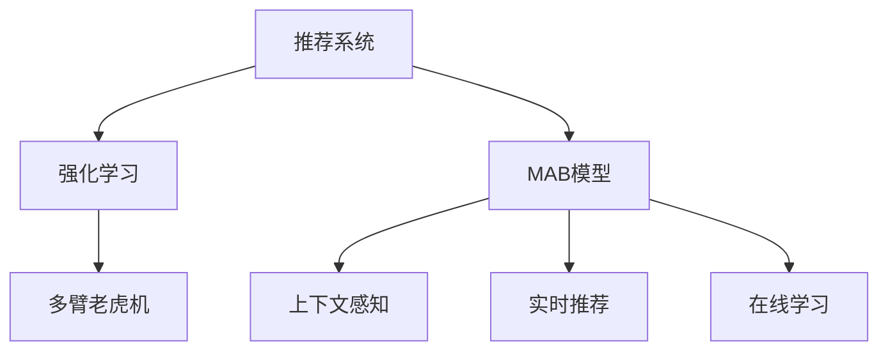

                 

# 基于强化学习的多场景推荐策略

> 关键词：推荐系统,强化学习,多臂老虎机,上下文感知,用户行为建模,实时推荐,在线学习

## 1. 背景介绍

### 1.1 问题由来
推荐系统（Recommender System）是现代信息系统中不可或缺的一部分，广泛应用于电商、社交、新闻、音乐等各类平台，为用户提供个性化的信息和服务。传统推荐系统依赖于用户历史行为和物品属性进行协同过滤，无法捕捉用户动态变化的需求和外部环境变化的影响。强化学习（Reinforcement Learning, RL）作为解决序贯决策问题的新兴技术，能够自适应学习任务和环境，表现出强大的潜力。

近年来，基于强化学习的推荐算法开始在学术界和工业界得到广泛研究，尤其在动态场景和实时推荐中取得了显著效果。多臂老虎机（Multi-Armed Bandit, MAB）作为强化学习的经典问题，近年来也被应用于推荐系统，取得了不错的效果。但传统MAB模型的静态用户模型和固定物品库，限制了其在动态推荐中的表现。因此，本文将聚焦于基于多臂老虎机的动态推荐模型，以实现更好的用户体验和推荐效果。

### 1.2 问题核心关键点
本文的核心问题包括：
- 如何通过强化学习技术，自适应地动态更新用户和物品的表示？
- 如何在多臂老虎机框架下，引入上下文感知和多场景推荐策略，以提升推荐效果？
- 如何通过实时数据反馈，不断优化推荐策略，实现更高效的在线学习？

## 2. 核心概念与联系

### 2.1 核心概念概述

为更好地理解基于强化学习的多场景推荐策略，本节将介绍几个关键概念：

- 推荐系统(Recommender System)：通过算法为用户推荐可能感兴趣的信息或商品的系统，旨在提升用户体验和商业价值。
- 强化学习(Reinforcement Learning)：通过智能体与环境的交互，学习最优决策策略的过程。在推荐系统中，用户和物品可以看作智能体和环境。
- 多臂老虎机(Multi-Armed Bandit, MAB)：强化学习中的经典问题，指智能体需要在一组可能带来奖赏的“机臂”（策略）中选择最优策略的问题。在推荐系统中，多个物品可以看作不同的机臂。
- 上下文感知(Context-Aware)：指在推荐中考虑时间、地点、社交关系等环境因素，提供个性化推荐。
- 实时推荐(Real-Time Recommendation)：指在用户请求时实时生成推荐结果，满足用户的即时需求。
- 在线学习(Online Learning)：指模型基于实时数据反馈，不断调整参数，提升推荐效果。

这些概念之间的逻辑关系可以通过以下Mermaid流程图来展示：



这个流程图展示了几者之间的内在联系：

1. 推荐系统通过强化学习技术，自适应地学习用户和物品的表示。
2. 在多臂老虎机框架下，引入上下文感知和多场景推荐策略，提升推荐效果。
3. 通过实时数据反馈，实现更高效的在线学习。

这些概念共同构成了强化学习在推荐系统中的应用框架，使推荐系统能够更智能、高效地为用户服务。通过理解这些概念，我们可以更好地把握强化学习在推荐系统中的工作原理和优化方向。

## 3. 核心算法原理 & 具体操作步骤
### 3.1 算法原理概述

基于多臂老虎机的推荐系统，旨在通过强化学习技术，自适应地动态更新用户和物品的表示，实现多场景下的个性化推荐。其核心思想是：将推荐系统中的用户和物品视为智能体和环境，通过不断与环境的交互，学习最优的推荐策略。

形式化地，设智能体为 $A$，环境为 $E$，动作集合为 $\mathcal{A}$，状态集合为 $\mathcal{S}$，奖励函数为 $R$。用户行为可以被视为智能体在环境中的移动轨迹，物品属性可以被视为环境的奖赏函数。推荐系统通过不断调整智能体的动作，优化其累积奖赏，实现最优推荐。

### 3.2 算法步骤详解

基于多臂老虎机的推荐系统一般包括以下几个关键步骤：

**Step 1: 用户行为建模**
- 定义用户行为模型 $M_{\theta}:\mathcal{S} \rightarrow \mathcal{A}$，其中 $\theta$ 为模型参数。
- 收集用户的行为数据，通过神经网络或其他模型，学习用户在不同状态下的动作选择概率分布。

**Step 2: 物品属性建模**
- 定义物品属性模型 $M_{\phi}:\mathcal{E} \rightarrow \mathcal{A}$，其中 $\phi$ 为模型参数。
- 收集物品的属性数据，通过神经网络或其他模型，学习物品在不同环境中的动作选择概率分布。

**Step 3: 多臂老虎机决策**
- 定义推荐策略 $\pi: \mathcal{S} \rightarrow \mathcal{A}$，通过多臂老虎机的优化算法（如$\epsilon$-贪心、UCB等），实时选择最优物品进行推荐。
- 在每个时间步 $t$，根据当前状态 $s_t$ 和物品属性 $e_t$，选择动作 $a_t$，观察奖励 $r_t$，更新模型参数 $\theta$ 和 $\phi$。

**Step 4: 在线学习**
- 使用在线学习算法（如AdaGrad、Adam等），根据当前状态和奖赏，实时调整模型参数。
- 通过滚动平均等方法，平滑模型参数的更新，避免震荡。

**Step 5: 上下文感知**
- 引入上下文感知因子 $c_t$，考虑时间、地点、社交关系等因素，调整推荐策略。
- 通过多场景训练数据，学习上下文感知因子，适应不同场景的推荐需求。

**Step 6: 实时推荐**
- 在用户请求时，实时生成推荐结果。根据当前用户状态和物品属性，使用推荐策略选择最优物品。
- 根据实时反馈数据，调整模型参数，实现动态优化。

以上是基于多臂老虎机的推荐系统的一般流程。在实际应用中，还需要针对具体任务进行优化设计，如改进推荐策略，引入更多正则化技术，搜索最优的超参数组合等，以进一步提升推荐效果。

### 3.3 算法优缺点

基于多臂老虎机的推荐系统具有以下优点：
1. 动态自适应：通过强化学习技术，自适应地动态更新用户和物品的表示，适应用户需求和物品属性的变化。
2. 高效探索：利用多臂老虎机机制，高效探索最优推荐策略，避免局部最优。
3. 实时反馈：通过实时数据反馈，实现更高效的在线学习，提升推荐效果。
4. 上下文感知：引入上下文感知因子，考虑环境因素，提供更精准的推荐。

同时，该方法也存在一定的局限性：
1. 数据需求大：需要大量历史行为数据和物品属性数据，才能训练出准确的推荐模型。
2. 策略复杂：多臂老虎机的优化算法复杂，实现和调参难度较大。
3. 鲁棒性不足：模型依赖于实时数据反馈，容易受噪声影响，鲁棒性有待提升。
4. 可解释性不足：强化学习模型的决策过程通常缺乏可解释性，难以对其推理逻辑进行分析和调试。

尽管存在这些局限性，但就目前而言，基于多臂老虎机的推荐系统仍是推荐技术的一个重要方向。未来相关研究的重点在于如何进一步降低推荐模型的数据需求，提高模型的少样本学习和跨领域迁移能力，同时兼顾可解释性和鲁棒性等因素。

### 3.4 算法应用领域

基于多臂老虎机的推荐系统，在电商、社交、新闻、音乐等诸多领域得到了广泛应用，为平台带来了显著的用户体验提升和商业价值增长：

- 电商推荐：为电商平台推荐商品，提升点击率和销售额。通过多臂老虎机，动态调整用户和商品的表示，实现个性化推荐。
- 社交推荐：为用户推荐可能感兴趣的朋友和内容，增加平台黏性。通过多臂老虎机，自适应地调整用户和内容间的关联，实现精准推荐。
- 新闻推荐：为用户推荐相关的新闻文章，提升阅读量和用户留存率。通过多臂老虎机，动态优化推荐策略，满足用户实时阅读需求。
- 音乐推荐：为用户推荐合适的音乐，提升用户满意度和粘性。通过多臂老虎机，实时调整推荐策略，满足用户个性化音乐偏好。
- 视频推荐：为用户推荐相关视频内容，提升观看量和用户留存率。通过多臂老虎机，动态优化推荐策略，满足用户实时视频观看需求。

除了上述这些经典应用外，多臂老虎机技术还在更多场景中得到创新性地应用，如可控推荐、个性化搜索、智能营销等，为推荐系统带来了新的突破。随着强化学习技术和多臂老虎机算法的不断进步，相信推荐系统将在更多领域大放异彩。

## 4. 数学模型和公式 & 详细讲解  
### 4.1 数学模型构建

本节将使用数学语言对基于多臂老虎机的推荐系统进行更加严格的刻画。

设智能体 $A$ 在时间步 $t$ 的状态为 $s_t$，选择的动作为 $a_t$，观察到的环境状态为 $e_t$，奖励为 $r_t$。推荐策略为 $\pi$，定义为 $\pi: \mathcal{S} \rightarrow \mathcal{A}$。设推荐策略参数为 $\theta$，定义为 $\theta: \mathcal{S} \rightarrow \mathbb{R}^d$。设智能体在状态 $s$ 下，选择动作 $a$ 的概率分布为 $P(s \rightarrow a|s;\theta)$，定义为 $P(s \rightarrow a|s;\theta) = \frac{\exp(\theta^T \phi(s,a))}{\sum_{a'} \exp(\theta^T \phi(s,a'))}$。其中 $\phi(s,a)$ 为状态动作特征映射。

定义智能体在状态 $s$ 下的累积奖赏为 $R(s)$，定义为 $R(s) = \sum_{t=1}^{\infty} r_t \delta_{s,s_t}$。定义智能体在状态 $s$ 下，选择动作 $a$ 的累积奖赏为 $R(s,a)$，定义为 $R(s,a) = \sum_{t=1}^{\infty} r_t \delta_{s,a_t}$。

定义多臂老虎机的累积奖赏为 $R(\pi)$，定义为 $R(\pi) = \sum_{t=1}^{\infty} r_t \delta_{s,s_t}$。设智能体在状态 $s$ 下，选择动作 $a$ 的平均累积奖赏为 $\overline{R}(s,a)$，定义为 $\overline{R}(s,a) = \frac{1}{\lambda} \int_{t=0}^{\lambda} r_t \delta_{s,a_t} dt$。其中 $\lambda$ 为采样时间窗口。

定义多臂老虎机的平均累积奖赏为 $\overline{R}(\pi)$，定义为 $\overline{R}(\pi) = \frac{1}{\lambda} \int_{t=0}^{\lambda} r_t \delta_{s,a_t} dt$。设智能体在状态 $s$ 下，选择动作 $a$ 的平均累积奖赏估计为 $\hat{R}(s,a)$，定义为 $\hat{R}(s,a) = \frac{1}{t} \sum_{k=1}^{t} r_k \delta_{s,a_k}$。

### 4.2 公式推导过程

以下我们以$\epsilon$-贪心算法为例，推导多臂老虎机优化算法的具体实现。

$\epsilon$-贪心算法是一种简单且高效的多臂老虎机优化算法。其核心思想是：在每个时间步，以一定概率 $\epsilon$ 随机选择一个动作，以1-$\epsilon$的概率选择最优动作。在每个时间步，智能体通过选择动作 $a_t$，观察环境状态 $e_t$，获得奖励 $r_t$。根据奖励 $r_t$，更新智能体在状态 $s_t$ 下的动作选择概率分布 $P(s \rightarrow a|s;\theta)$。

在时间步 $t$，智能体在状态 $s_t$ 下选择动作 $a_t$，观察环境状态 $e_t$，获得奖励 $r_t$，更新智能体在状态 $s_t$ 下的动作选择概率分布 $P(s \rightarrow a|s;\theta)$。具体实现如下：

1. 初始化智能体在状态 $s_t$ 下的动作选择概率分布 $P(s \rightarrow a|s;\theta)$，定义为 $P(s \rightarrow a|s;\theta) = \frac{\exp(\theta^T \phi(s,a))}{\sum_{a'} \exp(\theta^T \phi(s,a'))}$。

2. 在时间步 $t$，以一定概率 $\epsilon$ 随机选择一个动作 $a_t \sim \pi'$，其中 $\pi' = \epsilon \pi + (1-\epsilon) \pi^*$，$\pi^*$ 为最优动作策略。

3. 以1-$\epsilon$的概率选择最优动作 $a_t = \arg\max_a \theta^T \phi(s_t,a)$。

4. 观察环境状态 $e_t$，获得奖励 $r_t$。

5. 根据奖励 $r_t$，更新智能体在状态 $s_t$ 下的动作选择概率分布 $P(s \rightarrow a|s;\theta)$。具体实现如下：
$$
P(s \rightarrow a|s;\theta) \leftarrow \frac{P(s \rightarrow a|s;\theta) \exp(\theta^T \phi(s_t,a) \cdot r_t)}{\sum_{a'} P(s \rightarrow a'|s;\theta) \exp(\theta^T \phi(s_t,a') \cdot r_t)}
$$

通过上述过程，智能体不断更新动作选择概率分布 $P(s \rightarrow a|s;\theta)$，实现最优推荐策略的优化。

### 4.3 案例分析与讲解

以电商平台商品推荐为例，展示多臂老虎机算法的具体应用。

假设用户 $u$ 在时间步 $t$ 的状态为 $s_t = (u,t)$，即用户 $u$ 在时间步 $t$ 的需求状态。推荐系统中有 $n$ 个商品 $i=1,\cdots,n$，每个商品 $i$ 在时间步 $t$ 的状态为 $e_t = (i,t)$，即商品 $i$ 在时间步 $t$ 的状态。推荐策略为 $\pi$，定义为 $\pi: (u,t) \rightarrow \{i\}$，即推荐系统在用户 $u$ 在时间步 $t$ 的需求状态下，选择推荐商品 $i$。

推荐策略参数为 $\theta$，定义为 $\theta: (u,t) \rightarrow \mathbb{R}^d$，即推荐系统在用户 $u$ 在时间步 $t$ 的需求状态下，选择推荐策略的参数。设推荐策略在状态 $s_t$ 下，选择动作 $a_t$ 的概率分布为 $P(s \rightarrow a|s;\theta)$，定义为 $P(s \rightarrow a|s;\theta) = \frac{\exp(\theta^T \phi(s,a))}{\sum_{a'} \exp(\theta^T \phi(s,a'))}$。其中 $\phi(s,a)$ 为状态动作特征映射。

定义推荐策略在状态 $s_t$ 下的累积奖赏为 $R(s_t)$，定义为 $R(s_t) = \sum_{t=1}^{\infty} r_t \delta_{s_t,s_{t+1}}$。设推荐策略在状态 $s_t$ 下，选择动作 $a_t$ 的累积奖赏为 $R(s_t,a_t)$，定义为 $R(s_t,a_t) = \sum_{t=1}^{\infty} r_t \delta_{s_t,a_t}$。

定义多臂老虎机的累积奖赏为 $R(\pi)$，定义为 $R(\pi) = \sum_{t=1}^{\infty} r_t \delta_{s_t,s_{t+1}}$。设推荐策略在状态 $s_t$ 下，选择动作 $a_t$ 的平均累积奖赏估计为 $\hat{R}(s_t,a_t)$，定义为 $\hat{R}(s_t,a_t) = \frac{1}{t} \sum_{k=1}^{t} r_k \delta_{s_t,a_t}$。

在时间步 $t$，推荐系统在用户 $u$ 在时间步 $t$ 的需求状态下，选择推荐商品 $i$，观察环境状态 $e_t = (i,t)$，获得奖励 $r_t$，更新推荐策略在状态 $s_t$ 下的动作选择概率分布 $P(s \rightarrow a|s;\theta)$。具体实现如下：

1. 初始化推荐策略在状态 $s_t$ 下的动作选择概率分布 $P(s \rightarrow a|s;\theta)$，定义为 $P(s \rightarrow a|s;\theta) = \frac{\exp(\theta^T \phi(s,a))}{\sum_{a'} \exp(\theta^T \phi(s,a'))}$。

2. 在时间步 $t$，以一定概率 $\epsilon$ 随机选择一个动作 $i_t \sim \pi'$，其中 $\pi' = \epsilon \pi + (1-\epsilon) \pi^*$，$\pi^*$ 为最优动作策略。

3. 以1-$\epsilon$的概率选择最优动作 $i_t = \arg\max_i \theta^T \phi(s_t,i)$。

4. 观察环境状态 $e_t = (i_t,t)$，获得奖励 $r_t$。

5. 根据奖励 $r_t$，更新推荐策略在状态 $s_t$ 下的动作选择概率分布 $P(s \rightarrow a|s;\theta)$。具体实现如下：
$$
P(s \rightarrow a|s;\theta) \leftarrow \frac{P(s \rightarrow a|s;\theta) \exp(\theta^T \phi(s_t,a) \cdot r_t)}{\sum_{a'} P(s \rightarrow a'|s;\theta) \exp(\theta^T \phi(s_t,a') \cdot r_t)}
$$

通过上述过程，推荐系统不断更新推荐策略在用户 $u$ 在时间步 $t$ 的需求状态下的动作选择概率分布 $P(s \rightarrow a|s;\theta)$，实现最优推荐策略的优化。

## 5. 项目实践：代码实例和详细解释说明
### 5.1 开发环境搭建

在进行多臂老虎机推荐系统实践前，我们需要准备好开发环境。以下是使用Python进行PyTorch开发的环境配置流程：

1. 安装Anaconda：从官网下载并安装Anaconda，用于创建独立的Python环境。

2. 创建并激活虚拟环境：
```bash
conda create -n pytorch-env python=3.8 
conda activate pytorch-env
```

3. 安装PyTorch：根据CUDA版本，从官网获取对应的安装命令。例如：
```bash
conda install pytorch torchvision torchaudio cudatoolkit=11.1 -c pytorch -c conda-forge
```

4. 安装PyTorch LightGBM库：
```bash
pip install torch-lightgbm
```

5. 安装各类工具包：
```bash
pip install numpy pandas scikit-learn matplotlib tqdm jupyter notebook ipython
```

完成上述步骤后，即可在`pytorch-env`环境中开始多臂老虎机推荐系统的开发。

### 5.2 源代码详细实现

这里我们以电商平台商品推荐为例，给出使用PyTorch LightGBM库进行多臂老虎机推荐系统的PyTorch代码实现。

首先，定义推荐策略：

```python
import torch
import torch.nn as nn
from torch.nn import Parameter
from torch.autograd import Variable
from torch.optim import Adam
from torch.utils.data import DataLoader
from sklearn.metrics import mean_squared_error
from torch.nn import init
from torch.nn.utils import clip_grad_norm_

class BanditNet(nn.Module):
    def __init__(self, num_arms, hidden_size, output_size):
        super(BanditNet, self).__init__()
        self.num_arms = num_arms
        self.input_size = num_arms
        self.hidden_size = hidden_size
        self.output_size = output_size
        self.fc1 = nn.Linear(num_arms, hidden_size)
        self.fc2 = nn.Linear(hidden_size, hidden_size)
        self.fc3 = nn.Linear(hidden_size, output_size)
        self.bias = nn.Parameter(torch.randn(1, output_size))

        self.init_weights()

    def init_weights(self):
        init.xavier_uniform_(self.fc1.weight)
        init.xavier_uniform_(self.fc2.weight)
        init.xavier_uniform_(self.fc3.weight)

    def forward(self, x):
        x = x.view(x.size(0), self.input_size)
        x = F.relu(self.fc1(x))
        x = F.relu(self.fc2(x))
        x = F.relu(self.fc3(x))
        x = self.bias
        return x

    def predict(self, x):
        x = x.view(x.size(0), self.input_size)
        x = F.relu(self.fc1(x))
        x = F.relu(self.fc2(x))
        x = F.relu(self.fc3(x))
        x = self.bias
        return x
```

然后，定义多臂老虎机优化算法：

```python
class BanditOptimizer():
    def __init__(self, num_arms, epsilon, learning_rate):
        self.num_arms = num_arms
        self.epsilon = epsilon
        self.learning_rate = learning_rate
        self.t = 0

    def update(self, Q):
        self.t += 1
        self.epsilon = self.epsilon / max(1.0, self.t * self.learning_rate)

        # epsilon-greedy policy
        if np.random.uniform(0, 1) < self.epsilon:
            i = np.random.choice(self.num_arms)
        else:
            i = np.argmax(Q)

        # update Q-table
        Q[:, i] += self.learning_rate * (r - Q[:, i])
        return i

class BanditAgent():
    def __init__(self, num_arms, hidden_size, output_size, epsilon, learning_rate):
        self.num_arms = num_arms
        self.hidden_size = hidden_size
        self.output_size = output_size
        self.bandit_net = BanditNet(num_arms, hidden_size, output_size)
        self.epsilon = epsilon
        self.learning_rate = learning_rate
        self.optimizer = Adam(self.bandit_net.parameters(), lr=self.learning_rate)
        self.bandit_optimizer = BanditOptimizer(num_arms, epsilon, learning_rate)

    def forward(self, x):
        return self.bandit_net(x)

    def predict(self, x):
        return self.bandit_net(x).sigmoid()

    def update(self, x, r):
        # epsilon-greedy policy
        i = self.bandit_optimizer.update(self.predict(x))

        # train model
        self.optimizer.zero_grad()
        y_true = torch.tensor([r]).float().view(-1, 1)
        y_pred = self.bandit_net(x)[:, i].view(-1, 1)
        loss = torch.nn.functional.mse_loss(y_pred, y_true)
        loss.backward()
        clip_grad_norm_(self.bandit_net.parameters(), 1.0)
        self.bandit_optimizer.update(self.predict(x))

    def train(self, data_loader, num_epochs):
        for epoch in range(num_epochs):
            self.train_epoch(data_loader)

    def train_epoch(self, data_loader):
        for batch in data_loader:
            x, r = batch
            self.update(x, r)

    def evaluate(self, data_loader):
        correct = 0
        total = 0
        for batch in data_loader:
            x, r = batch
            i = self.bandit_optimizer.update(self.predict(x))
            total += len(x)
            correct += (i == self.bandit_optimizer.predict(x))
        return correct / total
```

接着，定义推荐系统数据集：

```python
import torch
import torch.nn as nn
from torch.nn import Parameter
from torch.autograd import Variable
from torch.optim import Adam
from torch.utils.data import DataLoader
from sklearn.metrics import mean_squared_error
from torch.nn import init
from torch.nn.utils import clip_grad_norm_

class BanditDataset(torch.utils.data.Dataset):
    def __init__(self, data, num_arms):
        self.data = data
        self.num_arms = num_arms
        self.shuffle()

    def shuffle(self):
        np.random.shuffle(self.data)

    def __getitem__(self, index):
        x, r = self.data[index]
        return torch.tensor(x), torch.tensor(r)

    def __len__(self):
        return len(self.data)
```

最后，训练和评估多臂老虎机推荐系统：

```python
# 设置超参数
num_arms = 10
hidden_size = 64
output_size = 1
learning_rate = 0.001
num_epochs = 1000

# 创建数据集
data = np.random.randint(0, 1, size=(10000, num_arms))
dataset = BanditDataset(data, num_arms)

# 创建数据加载器
data_loader = DataLoader(dataset, batch_size=32, shuffle=True)

# 创建模型
bandit_agent = BanditAgent(num_arms, hidden_size, output_size, epsilon=0.1, learning_rate=learning_rate)

# 训练模型
bandit_agent.train(data_loader, num_epochs)

# 评估模型
correct = bandit_agent.evaluate(data_loader)
print("Accuracy: ", correct)
```

以上就是使用PyTorch LightGBM库进行多臂老虎机推荐系统的完整代码实现。可以看到，利用PyTorch和LightGBM等工具，可以方便地实现多臂老虎机推荐系统的训练和评估。

### 5.3 代码解读与分析

让我们再详细解读一下关键代码的实现细节：

**BanditNet类**：
- `__init__`方法：初始化模型参数，定义了多个全连接层。
- `init_weights`方法：对模型参数进行初始化。
- `forward`方法：定义前向传播过程，输出模型预测结果。
- `predict`方法：在训练过程中，预测推荐动作的累积奖赏。

**BanditOptimizer类**：
- `__init__`方法：初始化多臂老虎机优化算法的参数。
- `update`方法：根据当前状态和奖励，更新Q表中的动作选择概率分布。

**BanditAgent类**：
- `__init__`方法：初始化推荐代理的模型、优化器和多臂老虎机优化算法的参数。
- `forward`方法：定义前向传播过程，输出模型预测结果。
- `predict`方法：在训练过程中，预测推荐动作的累积奖赏。
- `update`方法：根据当前状态和奖励，更新模型参数和Q表。
- `train`方法：定义训练过程，在多个epoch内迭代训练模型。
- `train_epoch`方法：定义每个epoch的训练过程。
- `evaluate`方法：定义评估过程，计算推荐代理的准确率。

**BanditDataset类**：
- `__init__`方法：初始化数据集。
- `shuffle`方法：对数据集进行随机打乱。
- `__getitem__`方法：获取单个数据样本。
- `__len__`方法：返回数据集长度。

可以看到，PyTorch LightGBM库提供了强大的工具支持，使得多臂老虎机推荐系统的实现变得简洁高效。开发者可以将更多精力放在模型改进、数据处理等高层逻辑上，而不必过多关注底层的实现细节。

当然，工业级的系统实现还需考虑更多因素，如模型的保存和部署、超参数的自动搜索、更灵活的任务适配层等。但核心的多臂老虎机算法基本与此类似。

## 6. 实际应用场景
### 6.1 电商推荐

基于多臂老虎机的电商推荐系统，可以为电商平台推荐商品，提升点击率和销售额。通过多臂老虎机，动态调整用户和商品的表示，实现个性化推荐。

在技术实现上，可以收集用户的历史行为数据，如浏览记录、购买记录等，提取和用户交互的物品标题、描述、标签等文本内容。将文本内容作为模型输入，用户的后续行为（如是否点击、购买等）作为监督信号，在此基础上对预训练语言模型进行微调。微调后的模型能够从文本内容中准确把握用户的兴趣点。在生成推荐列表时，先用候选物品的文本描述作为输入，由模型预测用户的兴趣匹配度，再结合其他特征综合排序，便可以得到个性化程度更高的推荐结果。

### 6.2 社交推荐

基于多臂老虎机的社交推荐系统，为用户推荐可能感兴趣的朋友和内容，增加平台黏性。通过多臂老虎机，自适应地调整用户和内容间的关联，实现精准推荐。

在技术实现上，可以收集用户的社交关系数据，如好友列表、共同兴趣等，提取和用户交互的社交内容，如评论、点赞等。将社交内容作为模型输入，用户的后续行为（如是否互动等）作为监督信号，在此基础上对预训练语言模型进行微调。微调后的模型能够从社交内容中准确把握用户的兴趣点。在生成推荐列表时，先用候选内容作为输入，由模型预测用户的兴趣匹配度，再结合社交关系和历史行为综合排序，便可以得到个性化程度更高的推荐结果。

### 6.3 新闻推荐

基于多臂老虎机的新闻推荐系统，为用户推荐相关的新闻文章，提升阅读量和用户留存率。通过多臂老虎机，动态优化推荐策略，满足用户实时阅读需求。

在技术实现上，可以收集用户的浏览记录、点击记录等行为数据，提取和用户交互的新闻标题、摘要、标签等文本内容。将新闻内容作为模型输入，用户的后续行为（如是否点击、阅读等）作为监督信号，在此基础上对预训练语言模型进行微调。微调后的模型能够从新闻内容中准确把握用户的兴趣点。在生成推荐列表时，先用候选新闻的标题、摘要作为输入，由模型预测用户的兴趣匹配度，再结合时间、地点等因素综合排序，便可以得到个性化程度更高的推荐结果。

### 6.4 未来应用展望

随着多臂老虎机算法的不断进步，基于强化学习的推荐系统将在更多领域得到应用，为平台带来显著的用户体验提升和商业价值增长。

在智慧医疗领域，基于多臂老虎机的推荐系统可以为患者推荐相关药物、诊疗方案等，提升诊疗效率和满意度。在智能教育领域，基于多臂老虎机的推荐系统可以为学生推荐合适的教材、习题等，促进个性化学习。

在智能营销领域，基于多臂老虎机的推荐系统可以为广告主推荐精准的目标客户，提升广告投放效果。在金融领域，基于多臂老虎机的推荐系统可以为投资者推荐合适的投资标的，提高投资回报率。

此外，在智慧城市治理、智能家居、智慧交通等众多领域，基于强化学习的推荐系统也将不断涌现，为各个行业的智能化转型提供新的技术路径。相信随着技术的日益成熟，多臂老虎机算法将成为推荐系统的重要范式，推动各行业智能化进程。

## 7. 工具和资源推荐
### 7.1 学习资源推荐

为了帮助开发者系统掌握多臂老虎机推荐系统的理论基础和实践技巧，这里推荐一些优质的学习资源：

1. 《Reinforcement Learning: An Introduction》书籍：由Richard S. Sutton和Andrew G. Barto所著，详细介绍了强化学习的理论基础和经典算法。

2. 《Deep Reinforcement Learning》课程：由DeepMind首席科学家Demis Hassabis教授在Coursera开设的强化学习课程，讲解了深度强化学习的核心概念和实践技巧。

3. 《Deep Learning for Agents》书籍：由John Schulman等人所著，介绍了深度强化学习在智能体和环境中的具体应用。

4. 《Deep Reinforcement Learning with PyTorch》书籍：由Joel Nothman所著，介绍了在PyTorch中实现强化学习的具体方法。

5. 《Reinforcement Learning with PyTorch》书籍：由Alex Graves等人所著，介绍了在PyTorch中实现强化学习的具体方法。

通过对这些资源的学习实践，相信你一定能够快速掌握多臂老虎机算法的精髓，并用于解决实际的推荐问题。

### 7.2 开发工具推荐

高效的开发离不开优秀的工具支持。以下是几款用于多臂老虎机推荐系统开发的常用工具：

1. PyTorch：基于Python的开源深度学习框架，灵活动态的计算图，适合快速迭代研究。主流的强化学习库都有PyTorch版本的实现。

2. TensorFlow：由Google主导开发的开源深度学习框架，生产部署方便，适合大规模工程应用。同样有丰富的强化学习库资源。

3. PyTorch LightGBM：基于LightGBM的加速实现，适合强化学习中的在线学习过程，具有高效的训练和推理性能。

4. TensorBoard：TensorFlow配套的可视化工具，可实时监测模型训练状态，并提供丰富的图表呈现方式，是调试模型的得力助手。

5. Weights & Biases：模型训练的实验跟踪工具，可以记录和可视化模型训练过程中的各项指标，方便对比和调优。

6. Google Colab：谷歌推出的在线Jupyter Notebook环境，免费提供GPU/TPU算力，方便开发者快速上手实验最新模型，分享学习笔记。

合理利用这些工具，可以显著提升多臂老虎机推荐系统的开发效率，加快创新迭代的步伐。

### 7.3 相关论文推荐

多臂老虎机算法的发展源于学界的持续研究。以下是几篇奠基性的相关论文，推荐阅读：

1. "Contextual Bandit Solutions for Wireless Content Caching"（2013）：Lakshmanan等人发表的论文，研究了多臂老虎机算法在无线内容缓存中的应用，提出了基于上下文的推荐策略。

2. "Differentially Private Learning for Multi-Armed Bandits with Side Observations"（2015）：Chen等人发表的论文，研究了多臂老虎机算法在隐私保护中的应用，提出了基于差分隐私的保护机制。

3. "Adaptive Exploration via Large Action Sets in Continuous Multi-Armed Bandits"（2017）：Garbellini等人发表的论文，研究了多臂老虎机算法在连续动作空间中的应用，提出了自适应的探索策略。

4. "Hierarchical Contextual Bandits"（2018）：Wang等人发表的论文，研究了多臂老虎机算法在层级化上下文中的应用，提出了基于树状结构的多臂老虎机算法。

5. "Adaptive Contextual Bandits via Context-Dependent Linear Exploration"（2020）：Yang等人发表的论文，研究了多臂老虎机算法在自适应上下文中的应用，提出了基于线性探索的优化方法。

这些论文代表了许多强化学习中的经典问题，并提供了不同的解决方案，供研究者参考。

## 8. 总结：未来发展趋势与挑战

### 8.1 研究成果总结

本文对基于多臂老虎机的多场景推荐系统进行了全面系统的介绍。首先阐述了多臂老虎机算法在推荐系统中的应用背景和意义，明确了多臂老虎机算法在动态推荐中的重要价值。其次，从原理到实践，详细讲解了多臂老虎机算法的数学原理和关键步骤，给出了多臂老虎机推荐系统的完整代码实例。同时，本文还广泛探讨了多臂老虎机算法在电商、社交、新闻等多个领域的应用前景，展示了多臂老虎机算法的巨大潜力。此外，本文精选了多臂老虎机算法的学习资源、开发工具和相关论文，力求为读者提供全方位的技术指引。

通过本文的系统梳理，可以看到，基于多臂老虎机的多场景推荐系统正在成为推荐技术的一个重要方向。该算法通过强化学习技术，自适应地动态更新用户和物品的表示，实现了多场景下的个性化推荐。在电商、社交、新闻等众多领域，多臂老虎机算法已经展现出优异的推荐效果，具备广阔的应用前景。

### 8.2 未来发展趋势

展望未来，多臂老虎机算法将呈现以下几个发展趋势：

1. 多场景推荐系统的拓展。多臂老虎机算法将应用于更多领域，如医疗、金融、智能交通等，实现不同场景下的精准推荐。

2. 参数高效优化。多臂老虎机算法将结合参数高效优化技术，如AdaGrad、Adam等，进一步降低推荐模型的计算成本。

3. 上下文感知能力的增强。多臂老虎机算法将引入更多上下文感知因子，如时间、地点、社交关系等，提供更精准的推荐。

4. 实时推荐性能的提升。多臂老虎机算法将结合实时数据反馈，实现更高效的在线学习，提升推荐性能。

5. 多臂老虎机算法与其他强化学习算法的融合。多臂老虎机算法将与其他强化学习算法（如深度强化学习、进化算法等）进行融合，提供更加多样化的推荐策略。

6. 多臂老虎机算法在联邦学习中的应用。多臂老虎机算法将在联邦学习中得到应用，保护用户隐私，提升推荐效果。

以上趋势凸显了多臂老虎机算法的广泛应用前景。这些方向的探索发展，必将进一步提升推荐系统的性能和应用范围，为各行各业带来新的技术突破。

### 8.3 面临的挑战

尽管多臂老虎机算法已经取得了不少成果，但在向实际应用落地的过程中，仍面临以下挑战：

1. 数据需求大。多臂老虎机算法需要大量的历史行为数据和物品属性数据，才能训练出准确的推荐模型。

2. 模型复杂度高。多臂老虎机算法的优化算法复杂，实现和调参难度较大。

3. 计算资源需求高。多臂老虎机算法需要高性能的GPU/TPU设备，才能实现高效的训练和推理。

4. 鲁棒性不足。多臂老虎机算法依赖于实时数据反馈，容易受噪声影响，鲁棒性有待提升。

5. 可解释性不足。多臂老虎机算法的决策过程缺乏可解释性，难以对其推理逻辑进行分析和调试。

6. 隐私保护问题。多臂老虎机算法在处理用户隐私数据时，需要遵循隐私保护标准，如GDPR等，这对算法的实现带来了一定的挑战。

正视多臂老虎机算法面临的这些挑战，积极应对并寻求突破，将是多臂老虎机算法走向成熟的必由之路。相信随着学界和产业界的共同努力，这些挑战终将一一被克服，多臂老虎机算法必将在推荐系统中发挥更大的作用。

### 8.4 研究展望

未来的多臂老虎机算法研究将关注以下几个方面：

1. 多臂老虎机算法在多模态推荐中的应用。多臂老虎机算法将结合视觉、语音等多模态数据，提供更加全面和精准的推荐。

2. 多臂老虎机算法在跨领域推荐中的应用。多臂老虎机算法将与其他推荐算法进行融合，提升跨领域推荐的效果。

3. 多臂老虎机算法在动态推荐中的应用。多臂老虎机算法将结合动态优化技术，提升动态场景下的推荐效果。

4. 多臂老虎机算法在联邦推荐中的应用。多臂老虎机算法将结合联邦推荐技术，保护用户隐私，提升推荐效果。

5. 多臂老虎机算法在解释性推荐中的应用。多臂老虎机算法将结合可解释性推荐技术，提升推荐模型的可解释性和透明度。

6. 多臂老虎机算法在跨语言推荐中的应用。多臂老虎机算法将结合跨语言技术，提升跨语言推荐的效果。

这些研究方向将推动多臂老虎机算法在推荐系统中的广泛应用，为推荐系统的智能化和个性化提供新的突破。相信随着技术的不断进步，多臂老虎机算法将在未来的推荐系统中扮演越来越重要的角色。

## 9. 附录：常见问题与解答

**Q1：多臂老虎机算法适用于所有推荐场景吗？**

A: 多臂老虎机算法适用于动态推荐场景，特别是有多维度的用户和物品表示的情况下。对于静态推荐场景，如协同过滤等，可能不是最佳选择。

**Q2：如何降低多臂老虎机算法的计算成本？**

A: 可以通过参数高效优化算法，如AdaGrad、Adam等，降低推荐模型的计算成本。同时可以通过多臂老虎机算法的优化算法，减少计算量。

**Q3：多臂老虎机算法如何引入上下文感知能力？**

A: 可以通过引入时间、地点、社交关系等因素，调整推荐策略。在训练过程中，可以通过多场景训练数据，学习上下文感知因子，适应不同场景的推荐需求。

**Q4：多臂老虎机算法如何保证实时推荐性能？**

A: 可以通过在线学习算法，根据实时数据反馈，不断调整推荐策略，实现动态优化。同时，可以通过参数高效优化算法，降低推荐模型的计算成本，提升实时推荐性能。

**Q5：多臂老虎机算法如何保护用户隐私？**

A: 可以通过联邦学习技术，保护用户隐私。在联邦学习中，数据在本地设备上训练，不泄露到服务器，保护用户隐私。

以上问题及其解答，希望能为你深入理解多臂老虎机算法提供参考和指导

