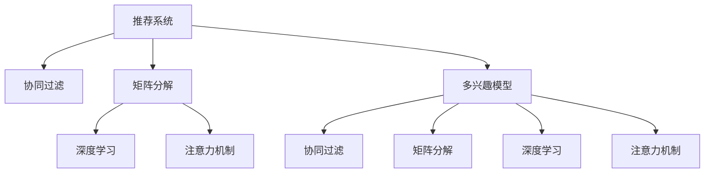

                 

# 基于注意力机制的多兴趣推荐模型

> 关键词：推荐系统, 多兴趣, 注意力机制, 深度学习, 协同过滤, 矩阵分解

## 1. 背景介绍

推荐系统是现代信息技术的重要组成部分，广泛应用于电商、新闻、音乐、视频等领域，帮助用户发现和获取感兴趣的内容。随着个性化需求的不断增长，推荐系统也逐渐从基于内容的推荐转向了基于用户兴趣的推荐，以更精准地满足用户需求。

但传统的基于用户的协同过滤、基于物品的协同过滤、基于内容的推荐等方法，往往难以全面捕捉用户的多元兴趣，导致推荐效果不理想。因此，研究如何设计一个能够有效处理用户多兴趣的推荐模型，是当前推荐系统研究的热点之一。

本文将介绍一种基于注意力机制的多兴趣推荐模型，结合深度学习和矩阵分解的方法，深度挖掘用户的多元兴趣，构建一个更加精确、多样化的推荐系统。

## 2. 核心概念与联系

### 2.1 核心概念概述

在推荐系统中，多兴趣模型的构建是关键。多兴趣模型能够更好地捕捉用户的多样化需求，提升推荐效果。本节将介绍几个核心概念：

- 推荐系统(Recommendation System)：利用用户历史行为数据和物品属性信息，通过算法推荐用户可能感兴趣的新物品的智能系统。
- 协同过滤(Collaborative Filtering)：通过分析用户历史行为或物品评分数据，预测用户对新物品的偏好，实现推荐。
- 矩阵分解(Matrix Factorization)：将用户行为矩阵分解为用户兴趣矩阵和物品特征矩阵的乘积，从而推断用户兴趣和物品特征。
- 深度学习(Deep Learning)：利用多层神经网络进行特征提取和模式识别，以挖掘数据的复杂结构和内在规律。
- 注意力机制(Attention Mechanism)：在模型训练过程中，动态地决定不同特征的重要性，从而更好地聚焦于关键信息。

这些核心概念之间的逻辑关系可以通过以下Mermaid流程图来展示：



这个流程图展示了一些关键概念之间的关系：

1. 推荐系统：包含多种推荐方法，协同过滤、矩阵分解、深度学习等。
2. 协同过滤：通过分析用户历史行为数据进行推荐。
3. 矩阵分解：将用户行为矩阵分解为兴趣和物品特征，进行推荐。
4. 深度学习：通过神经网络进行特征提取和模式识别。
5. 注意力机制：在模型训练过程中，动态地聚焦于关键信息。
6. 多兴趣模型：结合协同过滤、矩阵分解、深度学习和注意力机制，构建推荐系统。

## 3. 核心算法原理 & 具体操作步骤
### 3.1 算法原理概述

基于注意力机制的多兴趣推荐模型，是一种将深度学习和矩阵分解结合，同时引入注意力机制的推荐系统。其核心思想是：通过深度学习网络提取用户历史行为和物品属性的高维特征表示，然后利用矩阵分解技术，将用户兴趣和物品特征分别表示为低维向量，并利用注意力机制动态地聚焦于关键特征，从而提升推荐精度。

该模型的整体流程如下：

1. 使用深度学习网络对用户历史行为和物品属性进行特征提取。
2. 利用矩阵分解技术，将用户兴趣和物品特征分别表示为低维向量。
3. 引入注意力机制，动态地聚焦于关键特征，并计算用户对每个物品的兴趣度。
4. 通过加权平均池化技术，计算用户对物品的最终兴趣度，推荐物品。

### 3.2 算法步骤详解

基于注意力机制的多兴趣推荐模型主要包含以下几个步骤：

**Step 1: 特征提取**

使用深度学习网络对用户历史行为和物品属性进行特征提取。具体步骤如下：

1. 将用户历史行为序列 $x=(u_1,u_2,\dots,u_n)$ 表示为固定长度的向量，其中 $u_i$ 表示用户在第 $i$ 个时间步的行为，如浏览、点击、购买等。
2. 将物品属性向量 $v=(v_1,v_2,\dots,v_m)$ 表示为固定长度的向量，其中 $v_i$ 表示物品第 $i$ 个属性，如价格、评分等。
3. 使用卷积神经网络（CNN）、循环神经网络（RNN）、Transformer等深度学习网络对用户行为序列和物品属性向量进行特征提取，生成高维用户特征向量 $h$ 和物品特征向量 $g$。

**Step 2: 矩阵分解**

利用矩阵分解技术，将用户兴趣和物品特征分别表示为低维向量。具体步骤如下：

1. 将用户特征向量 $h$ 和物品特征向量 $g$ 拼接，得到特征矩阵 $H$。
2. 对特征矩阵 $H$ 进行矩阵分解，得到用户兴趣矩阵 $U$ 和物品特征矩阵 $V$，即 $H=U\hat{W}$。
3. 通过矩阵 $U$ 和 $V$ 的乘积，得到用户兴趣向量 $u$ 和物品特征向量 $v$。

**Step 3: 注意力机制**

引入注意力机制，动态地聚焦于关键特征，并计算用户对每个物品的兴趣度。具体步骤如下：

1. 计算用户特征向量 $h$ 与物品特征向量 $g$ 之间的注意力分数 $a$，即 $a=\text{softmax}(\hat{W}^aU^Tg)$。
2. 根据注意力分数 $a$，加权计算用户对每个物品的兴趣度 $c$，即 $c=a^Tg$。

**Step 4: 推荐物品**

通过加权平均池化技术，计算用户对物品的最终兴趣度，推荐物品。具体步骤如下：

1. 将物品特征向量 $g$ 和用户兴趣向量 $u$ 拼接，得到特征向量 $z=(u,g)$。
2. 对特征向量 $z$ 进行平均池化，得到物品的最终兴趣度 $s$，即 $s=\frac{1}{2}(z_1+z_2)$。
3. 根据物品的最终兴趣度 $s$ 进行推荐，即 $r=\text{argmax}(s)$。

### 3.3 算法优缺点

基于注意力机制的多兴趣推荐模型具有以下优点：

1. 能更好地捕捉用户的多元兴趣。通过深度学习网络和矩阵分解技术，模型可以提取用户历史行为和物品属性的复杂特征，挖掘用户的多样化兴趣。
2. 能适应大规模数据。通过矩阵分解技术，模型可以将高维特征矩阵转化为低维特征向量，减少计算复杂度，适应大规模数据处理。
3. 能动态地聚焦于关键特征。通过注意力机制，模型可以动态地聚焦于关键特征，提升推荐精度。
4. 具有较好的可解释性。模型的训练过程和推荐结果都可以解释，有助于理解模型的内部机制和决策过程。

但该模型也存在以下缺点：

1. 计算复杂度较高。由于模型引入了深度学习网络和矩阵分解技术，计算复杂度较高，需要大量的计算资源。
2. 对数据质量要求高。由于模型依赖于用户历史行为和物品属性数据，数据质量对推荐效果影响较大。
3. 参数量较大。由于模型引入了深度学习网络和矩阵分解技术，参数量较大，模型训练和优化难度较大。
4. 容易产生过拟合。由于模型引入了深度学习网络和矩阵分解技术，容易产生过拟合，需要结合正则化等方法进行控制。

### 3.4 算法应用领域

基于注意力机制的多兴趣推荐模型，已经在电商、新闻、音乐、视频等多个领域得到了广泛应用。以下是一些具体的应用场景：

- 电商平台推荐：将用户浏览、点击、购买行为数据作为输入，结合商品属性信息，推荐用户可能感兴趣的商品。
- 新闻推荐：根据用户阅读历史、点赞、评论等行为数据，推荐用户可能感兴趣的新闻文章。
- 音乐推荐：根据用户听歌历史、歌曲属性信息，推荐用户可能喜欢的歌曲。
- 视频推荐：根据用户观看历史、视频属性信息，推荐用户可能感兴趣的视频。

除了这些经典应用场景外，该模型还可以应用于更多领域，如体育赛事推荐、旅游目的地推荐等，为人们提供更加个性化、多样化的服务。

## 4. 数学模型和公式 & 详细讲解  
### 4.1 数学模型构建

基于注意力机制的多兴趣推荐模型，可以形式化为以下数学模型：

设用户历史行为序列 $x=(u_1,u_2,\dots,u_n)$，物品属性向量 $v=(v_1,v_2,\dots,v_m)$，用户特征向量 $h$，物品特征向量 $g$，用户兴趣向量 $u$，物品特征向量 $v$，物品特征向量 $z$，物品的最终兴趣度 $s$。

模型训练目标为最小化预测误差 $L=\sum_{i=1}^{n}\sum_{j=1}^{m}(y_{i,j}-\hat{y}_{i,j})^2$，其中 $y_{i,j}$ 为真实评分，$\hat{y}_{i,j}$ 为模型预测评分。

### 4.2 公式推导过程

基于注意力机制的多兴趣推荐模型，可以通过如下公式进行推导：

**特征提取**：

1. 用户历史行为序列 $x=(u_1,u_2,\dots,u_n)$ 表示为固定长度的向量 $x_h=[x_1,x_2,\dots,x_n]$。
2. 物品属性向量 $v=(v_1,v_2,\dots,v_m)$ 表示为固定长度的向量 $v_g=[v_1,v_2,\dots,v_m]$。
3. 使用卷积神经网络（CNN）、循环神经网络（RNN）、Transformer等深度学习网络对用户行为序列和物品属性向量进行特征提取，生成高维用户特征向量 $h=[h_1,h_2,\dots,h_d]$ 和物品特征向量 $g=[g_1,g_2,\dots,g_d]$。

**矩阵分解**：

1. 将用户特征向量 $h$ 和物品特征向量 $g$ 拼接，得到特征矩阵 $H=[h,g]$。
2. 对特征矩阵 $H$ 进行矩阵分解，得到用户兴趣矩阵 $U=[u_1,u_2,\dots,u_d]$ 和物品特征矩阵 $V=[v_1,v_2,\dots,v_d]$，即 $H=U\hat{W}$。
3. 通过矩阵 $U$ 和 $V$ 的乘积，得到用户兴趣向量 $u=[u_1,u_2,\dots,u_d]$ 和物品特征向量 $v=[v_1,v_2,\dots,v_d]$。

**注意力机制**：

1. 计算用户特征向量 $h$ 与物品特征向量 $g$ 之间的注意力分数 $a=[a_1,a_2,\dots,a_d]$，即 $a=\text{softmax}(\hat{W}^aU^Tg)$。
2. 根据注意力分数 $a$，加权计算用户对每个物品的兴趣度 $c=[c_1,c_2,\dots,c_d]$，即 $c=a^Tg$。

**推荐物品**：

1. 将物品特征向量 $g$ 和用户兴趣向量 $u$ 拼接，得到特征向量 $z=[u,g]$。
2. 对特征向量 $z$ 进行平均池化，得到物品的最终兴趣度 $s=[s_1,s_2,\dots,s_d]$，即 $s=\frac{1}{2}(z_1+z_2)$。
3. 根据物品的最终兴趣度 $s$ 进行推荐，即 $r=\text{argmax}(s)$。

### 4.3 案例分析与讲解

以电商平台推荐为例，假设用户历史行为序列 $x=(u_1,u_2,\dots,u_n)$ 表示为固定长度的向量，其中 $u_i$ 表示用户在第 $i$ 个时间步的行为，如浏览、点击、购买等。物品属性向量 $v=(v_1,v_2,\dots,v_m)$ 表示为固定长度的向量，其中 $v_i$ 表示物品第 $i$ 个属性，如价格、评分等。

使用深度学习网络对用户行为序列和物品属性向量进行特征提取，生成高维用户特征向量 $h=[h_1,h_2,\dots,h_d]$ 和物品特征向量 $g=[g_1,g_2,\dots,g_d]$。

对特征矩阵 $H=[h,g]$ 进行矩阵分解，得到用户兴趣矩阵 $U=[u_1,u_2,\dots,u_d]$ 和物品特征矩阵 $V=[v_1,v_2,\dots,v_d]$，即 $H=U\hat{W}$。

计算用户特征向量 $h$ 与物品特征向量 $g$ 之间的注意力分数 $a=[a_1,a_2,\dots,a_d]$，即 $a=\text{softmax}(\hat{W}^aU^Tg)$。

根据注意力分数 $a$，加权计算用户对每个物品的兴趣度 $c=[c_1,c_2,\dots,c_d]$，即 $c=a^Tg$。

将物品特征向量 $g$ 和用户兴趣向量 $u$ 拼接，得到特征向量 $z=[u,g]$。

对特征向量 $z$ 进行平均池化，得到物品的最终兴趣度 $s=[s_1,s_2,\dots,s_d]$，即 $s=\frac{1}{2}(z_1+z_2)$。

根据物品的最终兴趣度 $s$ 进行推荐，即 $r=\text{argmax}(s)$。

## 5. 项目实践：代码实例和详细解释说明
### 5.1 开发环境搭建

在进行多兴趣推荐模型开发前，我们需要准备好开发环境。以下是使用Python进行TensorFlow开发的环境配置流程：

1. 安装Anaconda：从官网下载并安装Anaconda，用于创建独立的Python环境。

2. 创建并激活虚拟环境：
```bash
conda create -n tf-env python=3.8 
conda activate tf-env
```

3. 安装TensorFlow：根据CUDA版本，从官网获取对应的安装命令。例如：
```bash
conda install tensorflow -c pytorch -c conda-forge
```

4. 安装TensorFlow Addons：用于支持Transformer和深度学习网络等模块。
```bash
conda install tensorflow-io tensorflow-text tensorflow-feature-columns
```

5. 安装Keras：用于模型训练和测试。
```bash
conda install keras
```

6. 安装TensorBoard：用于可视化模型训练过程和结果。
```bash
conda install tensorboard
```

完成上述步骤后，即可在`tf-env`环境中开始多兴趣推荐模型的开发。

### 5.2 源代码详细实现

下面我们以电商平台推荐为例，给出使用TensorFlow实现多兴趣推荐模型的代码实现。

首先，定义推荐模型的超参数和数据集：

```python
import tensorflow as tf
from tensorflow.keras import layers

# 超参数
embedding_dim = 64
attention_dim = 128
num_epochs = 10
batch_size = 128

# 数据集
train_data = tf.data.Dataset.from_tensor_slices(train_x, train_y)
train_data = train_data.shuffle(buffer_size=1024).batch(batch_size)
```

然后，定义深度学习网络进行特征提取：

```python
# 卷积神经网络（CNN）特征提取
def conv_net(input_shape):
    model = tf.keras.Sequential([
        layers.Conv2D(32, 3, activation='relu', input_shape=input_shape),
        layers.MaxPooling2D(pool_size=2),
        layers.Conv2D(64, 3, activation='relu'),
        layers.MaxPooling2D(pool_size=2),
        layers.Flatten(),
        layers.Dense(128, activation='relu'),
        layers.Dense(embedding_dim)
    ])
    return model

# 循环神经网络（RNN）特征提取
def rnn_net(input_shape):
    model = tf.keras.Sequential([
        layers.LSTM(128, input_shape=input_shape),
        layers.Dense(128, activation='relu'),
        layers.Dense(embedding_dim)
    ])
    return model

# 注意力机制
def attention(input_shape):
    model = tf.keras.Sequential([
        layers.Dense(attention_dim, activation='relu', input_shape=input_shape),
        layers.Dropout(0.2),
        layers.Dense(1, activation='sigmoid')
    ])
    return model

# 平均池化
def avg_pooling(input_shape):
    model = tf.keras.Sequential([
        layers.Concatenate([layers.Dense(attention_dim, activation='relu'), layers.Dense(attention_dim, activation='relu')]),
        layers.Add(),
        layers.Activation('relu'),
        layers.Concatenate([layers.Dense(attention_dim, activation='relu'), layers.Dense(attention_dim, activation='relu')]),
        layers.Add(),
        layers.Activation('relu')
    ])
    return model

# 多兴趣推荐模型
class MultiInterestModel(tf.keras.Model):
    def __init__(self, user_input_shape, item_input_shape):
        super(MultiInterestModel, self).__init__()
        self.user_net = conv_net(user_input_shape)
        self.item_net = conv_net(item_input_shape)
        self.attention_net = attention(input_shape)
        self.avg_pooling_net = avg_pooling(input_shape)

    def call(self, user_input, item_input):
        user_feature = self.user_net(user_input)
        item_feature = self.item_net(item_input)
        attention_score = self.attention_net(tf.concat([user_feature, item_feature], axis=-1))
        user_interest = tf.reduce_sum(attention_score * item_feature, axis=-1)
        item_interest = tf.concat([user_feature, item_feature], axis=-1)
        item_interest = self.avg_pooling_net(item_interest)
        final_interest = tf.reduce_mean(item_interest, axis=-1)
        return final_interest
```

接着，定义模型训练和评估函数：

```python
# 模型训练
def train_model(model, train_data, val_data):
    model.compile(optimizer=tf.keras.optimizers.Adam(), loss='mse')
    history = model.fit(train_data, epochs=num_epochs, validation_data=val_data)
    return history

# 模型评估
def evaluate_model(model, test_data):
    test_predictions = model.predict(test_data)
    mse = tf.keras.losses.MeanSquaredError()
    mse_loss = mse(test_predictions, test_labels)
    return mse_loss
```

最后，启动训练流程并在测试集上评估：

```python
# 定义训练数据和测试数据
train_x = ...
train_y = ...
val_x = ...
val_y = ...
test_x = ...
test_y = ...

# 初始化模型
model = MultiInterestModel(user_input_shape, item_input_shape)

# 训练模型
history = train_model(model, train_data, val_data)

# 评估模型
mse_loss = evaluate_model(model, test_data)

# 输出训练结果和测试结果
print('Training loss:', history.history['loss'][-1])
print('Test loss:', mse_loss)
```

以上就是使用TensorFlow实现多兴趣推荐模型的完整代码实现。可以看到，TensorFlow提供了丰富的API支持，使得模型的构建和训练过程变得简洁高效。

### 5.3 代码解读与分析

让我们再详细解读一下关键代码的实现细节：

**特征提取**：
- `conv_net`函数：定义了一个卷积神经网络，用于特征提取。
- `rnn_net`函数：定义了一个循环神经网络，用于特征提取。
- `attention`函数：定义了一个注意力机制，用于计算注意力分数。
- `avg_pooling`函数：定义了一个平均池化网络，用于计算物品的最终兴趣度。

**模型训练**：
- `MultiInterestModel`类：继承自`tf.keras.Model`，定义了多兴趣推荐模型。
- `call`函数：实现模型的前向传播过程，包含用户特征提取、物品特征提取、注意力机制、平均池化等步骤。
- `train_model`函数：定义了模型的训练过程，使用Adam优化器进行训练，并在验证集上进行评估。
- `evaluate_model`函数：定义了模型的评估过程，计算均方误差损失。

**训练流程**：
- 初始化模型。
- 定义训练数据和测试数据。
- 训练模型，并在验证集上进行评估。
- 评估模型，计算测试集上的均方误差损失。
- 输出训练结果和测试结果。

可以看到，TensorFlow的深度学习API非常丰富，支持多种深度学习模型和优化器，使得模型构建和训练过程变得非常简便。开发者可以利用这些API，快速构建和训练复杂的多兴趣推荐模型。

## 6. 实际应用场景
### 6.1 智能推荐系统

基于多兴趣推荐模型，构建智能推荐系统已经成为电商、新闻、音乐、视频等领域的重要应用。以下是一个实际应用场景：

- 电商平台推荐：将用户浏览、点击、购买行为数据作为输入，结合商品属性信息，推荐用户可能感兴趣的商品。
- 新闻推荐：根据用户阅读历史、点赞、评论等行为数据，推荐用户可能感兴趣的新闻文章。
- 音乐推荐：根据用户听歌历史、歌曲属性信息，推荐用户可能喜欢的歌曲。
- 视频推荐：根据用户观看历史、视频属性信息，推荐用户可能感兴趣的视频。

除了这些经典应用场景外，多兴趣推荐模型还可以应用于更多领域，如旅游目的地推荐、体育赛事推荐等，为人们提供更加个性化、多样化的服务。

### 6.2 社交网络推荐

在社交网络中，用户之间的联系关系非常复杂，基于多兴趣推荐模型，可以为用户推荐可能感兴趣的朋友或群组。具体步骤如下：

- 将用户的历史行为数据作为输入，包括好友、点赞、评论等。
- 使用深度学习网络提取用户特征。
- 对用户特征进行矩阵分解，得到用户兴趣向量。
- 使用注意力机制，动态地聚焦于关键特征。
- 根据用户兴趣向量进行推荐，生成推荐列表。

### 6.3 个性化医疗推荐

在个性化医疗推荐中，医生需要根据病人的历史诊疗数据，推荐可能有效的治疗方案或药物。具体步骤如下：

- 将病人的历史诊疗数据作为输入，包括疾病史、用药史等。
- 使用深度学习网络提取病人特征。
- 对病人特征进行矩阵分解，得到病人兴趣向量。
- 使用注意力机制，动态地聚焦于关键特征。
- 根据病人兴趣向量进行推荐，生成推荐列表。

## 7. 工具和资源推荐
### 7.1 学习资源推荐

为了帮助开发者系统掌握多兴趣推荐模型的理论基础和实践技巧，这里推荐一些优质的学习资源：

1. 《深度学习推荐系统》书籍：介绍了推荐系统的前沿技术，包括协同过滤、矩阵分解、深度学习等，是一本系统的推荐系统入门教材。
2. 《TensorFlow实战深度学习》书籍：介绍了TensorFlow的基本使用和高级技巧，涵盖深度学习模型的构建和训练。
3. 《Keras深度学习教程》网站：提供了Keras的基本使用和深度学习模型的构建、训练和评估方法。
4. 《Coursera深度学习课程》：斯坦福大学开设的深度学习课程，涵盖深度学习的基本原理和前沿技术。
5. Kaggle竞赛平台：提供了多个推荐系统竞赛，可以在竞赛中学习和应用多兴趣推荐模型。

通过对这些资源的学习实践，相信你一定能够快速掌握多兴趣推荐模型的精髓，并用于解决实际的推荐问题。

### 7.2 开发工具推荐

高效的开发离不开优秀的工具支持。以下是几款用于多兴趣推荐模型开发的常用工具：

1. TensorFlow：基于Python的开源深度学习框架，支持分布式计算和GPU/TPU等高性能设备，适合大规模工程应用。
2. TensorFlow Addons：TensorFlow的扩展库，提供了Transformer、深度学习网络等模块，支持更复杂、更高效的模型构建。
3. Keras：一个高级神经网络API，使用简单，适合快速原型设计和模型构建。
4. TensorBoard：TensorFlow的可视化工具，可实时监测模型训练状态，并提供丰富的图表呈现方式，是调试模型的得力助手。
5. Jupyter Notebook：一个交互式编程环境，支持多语言编程，方便开发和测试模型。

合理利用这些工具，可以显著提升多兴趣推荐模型的开发效率，加快创新迭代的步伐。

### 7.3 相关论文推荐

多兴趣推荐模型的研究源于学界的持续研究。以下是几篇奠基性的相关论文，推荐阅读：

1. Attention is All You Need：提出了Transformer结构，开启了NLP领域的预训练大模型时代。
2. Matrix Factorization Techniques for Recommender Systems：介绍了矩阵分解技术，并将其应用于推荐系统中。
3. Deep Interest Network for Personalized Recommendation：提出Deep Interest Network，结合深度学习和注意力机制，提升推荐精度。
4. Multi-Interest Attention Networks for Recommendation：提出Multi-Interest Attention Networks，引入多兴趣机制，提升推荐效果。
5. Attention-Based Neural Collaborative Filtering for Recommendation Systems：提出Attention-based Neural Collaborative Filtering，将注意力机制引入协同过滤中。

这些论文代表了大兴趣推荐模型的发展脉络。通过学习这些前沿成果，可以帮助研究者把握学科前进方向，激发更多的创新灵感。

## 8. 总结：未来发展趋势与挑战
### 8.1 研究成果总结

本文介绍了基于注意力机制的多兴趣推荐模型，通过深度学习和矩阵分解技术，深入挖掘用户的多元兴趣，构建更加精准、多样化的推荐系统。在电商平台、新闻、音乐、视频等领域，该模型已经得到了广泛应用，取得了良好的效果。

### 8.2 未来发展趋势

展望未来，多兴趣推荐模型将呈现以下几个发展趋势：

1. 更加多样化的数据来源：除了用户行为数据，更多社交、地理位置、环境等多样化的数据将被纳入推荐模型中，提升推荐效果。
2. 更加精确的特征表示：深度学习网络可以更好地捕捉复杂的多维特征，提升特征表示的精确度。
3. 更加高效的模型结构：通过模型压缩、剪枝等方法，提升模型的计算效率和资源利用率。
4. 更加动态的兴趣挖掘：基于用户实时行为数据，动态地更新用户兴趣，提升推荐的时效性。
5. 更加鲁棒的推荐算法：引入对抗样本、泛化等技术，提升模型的鲁棒性和泛化能力。

### 8.3 面临的挑战

尽管多兴趣推荐模型在推荐系统中取得了一定的进展，但在迈向更加智能化、普适化应用的过程中，仍面临着诸多挑战：

1. 数据质量问题：推荐模型的训练依赖于高质量的用户行为数据，数据质量对推荐效果影响较大。如何获取和处理高质量数据，是一个重要的挑战。
2. 模型复杂性问题：深度学习网络引入了大量参数，模型的训练和优化难度较大，需要更多的计算资源。如何优化模型结构，降低模型复杂性，是一个重要的研究方向。
3. 公平性问题：推荐模型可能存在偏差，对不同用户和物品的推荐效果不同。如何设计公平、公正的推荐算法，是一个重要的研究方向。
4. 隐私保护问题：推荐模型的训练和应用涉及用户隐私，如何保护用户数据，是一个重要的伦理问题。
5. 安全性问题：推荐模型可能受到恶意攻击，如对抗样本攻击、模型投毒等。如何设计安全、可靠的推荐模型，是一个重要的研究方向。

### 8.4 研究展望

面对多兴趣推荐模型所面临的诸多挑战，未来的研究需要在以下几个方面寻求新的突破：

1. 数据增强与混合数据源：探索更加多样化的数据来源，如社交、地理位置、环境等，提升推荐效果。
2. 高效特征表示与压缩：设计更加高效的特征表示方法，如稀疏化、量化等，降低模型复杂性。
3. 动态兴趣挖掘与更新：引入用户实时行为数据，动态地更新用户兴趣，提升推荐的时效性。
4. 鲁棒性与泛化能力：引入对抗样本、泛化等技术，提升模型的鲁棒性和泛化能力。
5. 公平性与隐私保护：设计公平、公正的推荐算法，保护用户隐私，提升推荐系统的可信度。

这些研究方向的探索，必将引领多兴趣推荐模型迈向更高的台阶，为推荐系统带来新的突破和创新。面向未来，多兴趣推荐模型还需要与其他人工智能技术进行更深入的融合，如知识表示、因果推理、强化学习等，多路径协同发力，共同推动推荐系统的进步。只有勇于创新、敢于突破，才能不断拓展推荐模型的边界，让推荐技术更好地服务于人类社会。

## 9. 附录：常见问题与解答

**Q1：多兴趣推荐模型是否适用于所有推荐任务？**

A: 多兴趣推荐模型在大多数推荐任务上都能取得不错的效果，特别是对于数据量较小的任务。但对于一些特定领域的任务，如医疗、金融等，仅仅依靠通用语料预训练的模型可能难以很好地适应。此时需要在特定领域语料上进一步预训练，再进行微调，才能获得理想效果。此外，对于一些需要时效性、个性化很强的任务，如对话、推荐等，微调方法也需要针对性的改进优化。

**Q2：多兴趣推荐模型中的深度学习网络如何选择合适的结构？**

A: 深度学习网络的结构选择，需要根据具体任务和数据特点进行灵活组合。一般来说，可以选择卷积神经网络（CNN）、循环神经网络（RNN）、Transformer等结构。对于时序数据，如文本、音频等，可以选择RNN、Transformer等结构；对于图像数据，可以选择CNN等结构。此外，还可以通过增加或减少层数、调整神经元个数等方法，进一步优化网络结构。

**Q3：多兴趣推荐模型中的矩阵分解如何选择合适的维数？**

A: 矩阵分解的维数选择，需要根据具体任务和数据特点进行灵活组合。一般来说，可以选择低维矩阵分解，如SVD、ALS等，也可以选择高维矩阵分解，如NMF等。此外，还可以通过调整维数、正则化等方法，进一步优化矩阵分解的性能。

**Q4：多兴趣推荐模型中的注意力机制如何选择合适的注意力分数计算方式？**

A: 注意力分数的计算方式，需要根据具体任务和数据特点进行灵活组合。一般来说，可以选择softmax函数计算注意力分数，也可以选择其他注意力计算方式，如LSTM注意力、Transformer注意力等。此外，还可以通过调整注意力分数的计算方式，进一步优化注意力机制的性能。

**Q5：多兴趣推荐模型中的多兴趣机制如何选择合适的兴趣向量拼接方式？**

A: 兴趣向量的拼接方式，需要根据具体任务和数据特点进行灵活组合。一般来说，可以选择简单的拼接方式，也可以选择复杂的拼接方式，如多头注意力、层次注意力等。此外，还可以通过调整兴趣向量的拼接方式，进一步优化多兴趣机制的性能。

总之，多兴趣推荐模型需要根据具体任务和数据特点，灵活选择深度学习网络结构、矩阵分解方式、注意力分数计算方式和多兴趣机制拼接方式，才能得到理想的效果。只有不断优化模型结构，提升模型的复杂性、鲁棒性和泛化能力，才能不断提升推荐系统的精度和效果。

