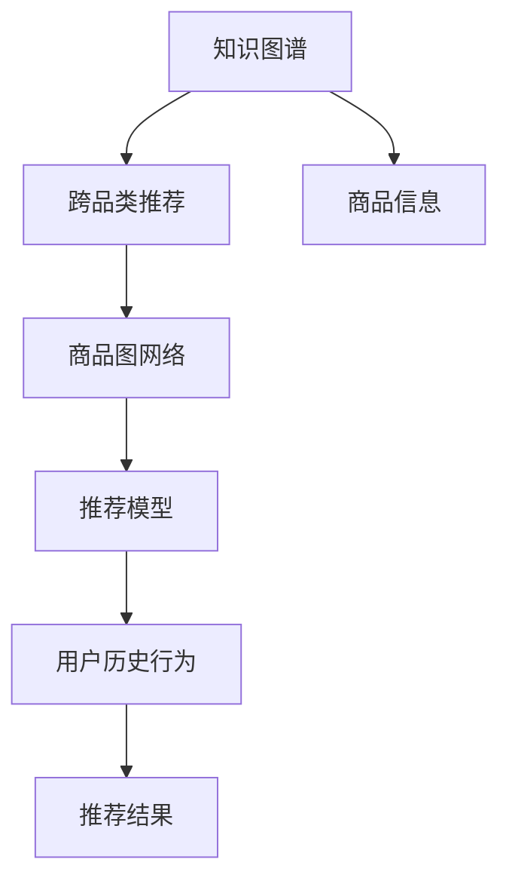

                 

# 基于知识图谱的跨品类商品关联推荐

> 关键词：知识图谱, 跨品类推荐, 商品关联, 深度学习, 图神经网络, 商品图网络, 推荐系统

## 1. 背景介绍

### 1.1 问题由来

在电商平台中，用户往往通过浏览、搜索、购买等方式表达自己对商品的需求。传统的推荐系统往往依据用户的浏览和购买历史数据，通过协同过滤、基于内容的推荐等算法，为用户提供相似商品或用户感兴趣的商品推荐。然而，随着电子商务的快速发展，个性化需求日益增加，单一的推荐模式已无法满足用户多样化的需求。跨品类商品关联推荐，即通过分析不同类别商品之间的关联关系，挖掘用户潜在需求，以更丰富的商品组合提升用户购买体验，成为电商平台商品推荐的新趋势。

知识图谱作为一种结构化的语义知识表示方式，将各种信息源中的实体及其关系映射为结构化的图结构，从而为跨品类商品关联推荐提供了有力的技术支持。知识图谱中的实体可以表示商品、属性、品牌等信息，实体之间的关系可以表示为商品间的关联、因果、相关性等关系，为推荐系统提供了丰富的关联信息。

### 1.2 问题核心关键点

知识图谱驱动的跨品类商品关联推荐方法的核心关键点包括：
- **知识图谱构建**：构建高效、准确的知识图谱，抓取商品及属性信息，并将商品之间通过关系链接起来。
- **跨品类关联挖掘**：从知识图谱中挖掘不同品类商品之间的潜在关联，识别商品之间的相似度和匹配度。
- **推荐模型设计**：设计合适的推荐模型，结合知识图谱与用户历史行为数据，进行联合推理，预测用户对跨品类商品的兴趣。
- **评估与优化**：通过实验评估推荐效果，并根据反馈数据优化推荐算法和知识图谱结构。

## 2. 核心概念与联系

### 2.1 核心概念概述

为更好地理解基于知识图谱的跨品类商品关联推荐方法，本节将介绍几个密切相关的核心概念：

- **知识图谱(Knowledge Graph)**：以图结构化的形式存储、表示和组织各类语义信息，通过实体和关系将各类信息进行关联，并提供丰富的查询和推理能力。
- **跨品类推荐(Cross-Category Recommendation)**：在传统推荐系统的基础上，考虑不同品类商品之间的关系，通过商品间的关联关系进行推荐，扩大推荐范畴，满足用户多样化的需求。
- **商品图网络(Product Graph Network)**：将商品、属性、类别等信息抽象为图结构，通过图神经网络等深度学习模型挖掘商品间的关联关系，用于商品关联推荐。
- **推荐系统(Recommendation System)**：通过算法模型对用户历史行为和商品特征进行分析，预测用户对不同商品的兴趣，提供个性化推荐。

这些核心概念之间的逻辑关系可以通过以下Mermaid流程图来展示：



这个流程图展示了几大核心概念之间的关联关系：

1. 知识图谱通过抽取商品信息并建立实体关系，为跨品类推荐提供数据基础。
2. 跨品类推荐在商品图网络上进行推荐模型设计，结合知识图谱和用户历史行为数据，挖掘商品间的关联关系。
3. 推荐系统基于跨品类推荐的模型，结合用户实时行为数据，输出个性化推荐结果。

## 3. 核心算法原理 & 具体操作步骤
### 3.1 算法原理概述

基于知识图谱的跨品类商品关联推荐方法，本质上是一种结合深度学习和知识图谱技术的推荐策略。其核心思想是：在知识图谱构建的基础上，通过图神经网络等深度学习模型，挖掘不同品类商品之间的关联关系，再结合用户历史行为数据，进行联合推理，预测用户对跨品类商品的兴趣，从而进行个性化推荐。

具体而言，该方法一般包括以下几个关键步骤：

1. **知识图谱构建**：抽取商品及其属性信息，构建商品图网络，并将商品间的关联关系进行建模。
2. **商品关联挖掘**：利用图神经网络等深度学习模型，在商品图网络中学习不同品类商品之间的关联关系，生成商品间的相似度矩阵。
3. **推荐模型训练**：结合用户历史行为数据，构建推荐模型，进行联合推理，预测用户对跨品类商品的兴趣。
4. **推荐结果输出**：根据预测结果，输出个性化推荐列表，满足用户多样化的需求。

### 3.2 算法步骤详解

以下将详细讲解基于知识图谱的跨品类商品关联推荐方法的具体操作步骤：

**Step 1: 知识图谱构建**

知识图谱的构建是跨品类推荐的基础。具体步骤如下：

1. **商品信息抽取**：从商品数据库、商品描述、用户评价等信息源中，抽取商品名称、类别、属性、品牌等关键信息，建立商品本体。

2. **关系抽取**：通过自然语言处理技术，如命名实体识别、关系抽取等，从文本中提取商品之间的关系，如品牌关联、类别关联、因果关联等，建立实体关系图。

3. **图结构化**：将抽取的商品信息及其关系进行结构化，建立商品图网络，每个节点表示一个商品，每条边表示商品间的关系。

**Step 2: 商品关联挖掘**

商品关联挖掘是通过图神经网络等深度学习模型，在商品图网络中学习不同品类商品之间的关联关系。具体步骤如下：

1. **图网络设计**：设计商品图网络，每个节点表示一个商品，边表示商品间的关联关系，如品牌关系、类别关系、因果关系等。

2. **图嵌入学习**：利用图神经网络等深度学习模型，在商品图网络上进行图嵌入学习，生成商品间的相似度矩阵。常用的图神经网络模型包括Graph Convolutional Network (GCN)、Graph Attention Network (GAT)、Graph Isomorphism Network (GIN)等。

3. **关系抽取**：通过图嵌入学习，抽取商品之间的相似度，生成商品间的相似度矩阵。

**Step 3: 推荐模型训练**

推荐模型训练是结合用户历史行为数据，进行联合推理，预测用户对跨品类商品的兴趣。具体步骤如下：

1. **用户历史行为建模**：收集用户的历史浏览、点击、购买、收藏等行为数据，构建用户行为本体，表示用户与商品间的交互行为。

2. **模型设计**：设计合适的推荐模型，如协同过滤、基于内容的推荐、深度学习推荐等，结合知识图谱和用户历史行为数据，进行联合推理。常用的推荐模型包括矩阵分解、神经网络推荐、协同过滤等。

3. **推荐结果输出**：根据模型预测结果，输出跨品类商品的推荐列表，满足用户多样化的需求。

**Step 4: 推荐结果输出**

推荐结果输出是将预测结果转化为用户可接受的推荐列表，具体步骤如下：

1. **推荐排序**：根据预测结果，结合用户实时行为数据，进行排序，生成推荐列表。

2. **个性化推荐**：根据用户偏好，调整推荐策略，提供个性化的推荐结果。

### 3.3 算法优缺点

基于知识图谱的跨品类商品关联推荐方法具有以下优点：

1. **广泛适用性**：方法适用于各种类型的商品推荐，不同品类商品之间的关联关系通过知识图谱进行建模，适用范围广泛。

2. **推荐多样性**：通过图嵌入学习，挖掘不同品类商品之间的关联关系，提供多样化的推荐内容。

3. **知识复用**：知识图谱中的商品信息、关联关系等可复用于不同推荐场景，提高推荐系统的通用性。

4. **跨品类推荐**：在传统推荐系统的基础上，结合商品间的关联关系，进行跨品类推荐，满足用户多样化需求。

5. **信息丰富性**：知识图谱中的信息丰富，能够挖掘商品间更深入的关联关系，提高推荐系统的准确性。

该方法也存在以下缺点：

1. **知识图谱构建复杂**：知识图谱的构建需要大量的人力物力，且涉及复杂的自然语言处理技术。

2. **数据获取难度大**：商品信息、关联关系等数据的获取难度较大，需要长时间的数据积累。

3. **推荐结果复杂**：跨品类推荐涉及不同品类商品之间的关系，推荐结果较为复杂，需要进行精细调参。

4. **冷启动问题**：对于新用户或新商品，知识图谱中缺乏相关数据，导致推荐效果不佳。

5. **实时性要求高**：推荐系统的实时性要求较高，需要在短时间内完成推荐结果的计算和输出。

### 3.4 算法应用领域

基于知识图谱的跨品类商品关联推荐方法，在电商、旅游、金融等多个领域都有广泛的应用前景：

1. **电商推荐**：在电商平台上，通过跨品类推荐，扩大推荐范畴，满足用户多样化需求，提高用户购物体验。

2. **旅游推荐**：在旅游平台上，结合不同品类商品之间的关联关系，提供个性化旅游套餐推荐，提升用户满意度和转化率。

3. **金融推荐**：在金融领域，通过跨品类推荐，为用户提供多样化的理财产品推荐，提升用户理财体验。

4. **教育推荐**：在教育领域，结合不同品类商品之间的关联关系，提供个性化学习资源推荐，提升用户学习效果。

5. **医疗推荐**：在医疗领域，结合不同品类商品之间的关联关系，提供个性化医疗服务推荐，提升用户健康体验。

## 4. 数学模型和公式 & 详细讲解  
### 4.1 数学模型构建

基于知识图谱的跨品类商品关联推荐方法，通常使用图嵌入模型进行商品关联关系的挖掘，并结合用户历史行为数据进行推荐。以下以Graph Convolutional Network (GCN)为例，详细讲解其数学模型和公式。

**商品图网络表示**：商品图网络由商品节点和关系边组成，表示为 $\mathcal{G}=(\mathcal{V}, \mathcal{E})$。每个商品节点表示为 $v_i$，关系边表示为 $e_{ij}$，边的权重表示为 $w_{ij}$。商品节点和关系边可以表示为矩阵形式：

$$
\mathbf{A} \in \mathbb{R}^{N \times N}, \mathbf{W} \in \mathbb{R}^{N \times N}, \mathbf{H} \in \mathbb{R}^{N \times F}
$$

其中，$\mathbf{A}$ 为商品图邻接矩阵，$\mathbf{W}$ 为边权重矩阵，$\mathbf{H}$ 为商品节点特征矩阵。

**GCN模型**：GCN模型是一种基于图神经网络的嵌入学习模型，其核心思想是通过卷积运算在图结构上学习节点的表示。GCN模型的公式如下：

$$
\mathbf{H}^{(k+1)} = \sigma(\mathbf{D}^{-\frac{1}{2}} \mathbf{A} \mathbf{H}^{(k)} \mathbf{W}^{(k)})
$$

其中，$\sigma$ 为激活函数，$\mathbf{D}$ 为商品图邻接矩阵的度矩阵，$^{(k)}$ 表示第 $k$ 层GCN网络的输出。

### 4.2 公式推导过程

以下以GCN模型为例，推导其公式：

**第一层GCN**：

$$
\mathbf{H}^{(1)} = \sigma(\mathbf{D}^{-\frac{1}{2}} \mathbf{A} \mathbf{H}^{(0)} \mathbf{W}^{(0)})
$$

其中，$\mathbf{H}^{(0)}$ 为商品节点原始特征矩阵，$\mathbf{W}^{(0)}$ 为初始边权重矩阵。

**第二层GCN**：

$$
\mathbf{H}^{(2)} = \sigma(\mathbf{D}^{-\frac{1}{2}} \mathbf{A} \mathbf{H}^{(1)} \mathbf{W}^{(1)})
$$

其中，$\mathbf{W}^{(1)}$ 为第二层GCN的边权重矩阵。

以此类推，第 $k$ 层GCN的输出为：

$$
\mathbf{H}^{(k)} = \sigma(\mathbf{D}^{-\frac{1}{2}} \mathbf{A} \mathbf{H}^{(k-1)} \mathbf{W}^{(k-1)})
$$

其中，$\mathbf{W}^{(k-1)}$ 为第 $k-1$ 层GCN的边权重矩阵。

### 4.3 案例分析与讲解

以某电商平台的跨品类推荐系统为例，分析其应用流程和技术细节：

**案例背景**：某电商平台销售包括服装、家电、图书等多种品类商品，通过用户历史行为数据和商品图网络，进行跨品类推荐。

**数据准备**：平台收集用户的历史浏览、点击、购买、收藏等行为数据，以及商品名称、类别、品牌等基本信息，构建商品图网络。

**商品图网络构建**：通过自然语言处理技术，抽取商品之间的关系，如品牌关联、类别关联等，构建商品图网络，每个节点表示一个商品，每条边表示商品间的关系。

**GCN模型训练**：利用GCN模型，在商品图网络上进行图嵌入学习，生成商品间的相似度矩阵。同时，收集用户的历史行为数据，构建用户行为本体，表示用户与商品间的交互行为。

**推荐模型设计**：设计协同过滤推荐模型，结合知识图谱和用户历史行为数据，进行联合推理，预测用户对跨品类商品的兴趣。

**推荐结果输出**：根据模型预测结果，结合用户实时行为数据，进行排序，生成跨品类商品的推荐列表，满足用户多样化的需求。

## 5. 项目实践：代码实例和详细解释说明
### 5.1 开发环境搭建

在进行跨品类推荐系统开发前，我们需要准备好开发环境。以下是使用Python进行PyTorch开发的环境配置流程：

1. 安装Anaconda：从官网下载并安装Anaconda，用于创建独立的Python环境。

2. 创建并激活虚拟环境：
```bash
conda create -n pytorch-env python=3.8 
conda activate pytorch-env
```

3. 安装PyTorch：根据CUDA版本，从官网获取对应的安装命令。例如：
```bash
conda install pytorch torchvision torchaudio cudatoolkit=11.1 -c pytorch -c conda-forge
```

4. 安装Graph Neural Network库：
```bash
pip install graph-neighbors
```

5. 安装各类工具包：
```bash
pip install numpy pandas scikit-learn matplotlib tqdm jupyter notebook ipython
```

完成上述步骤后，即可在`pytorch-env`环境中开始开发。

### 5.2 源代码详细实现

这里我们以某电商平台的跨品类推荐系统为例，给出使用PyTorch和Graph Neural Network库进行商品关联推荐系统的PyTorch代码实现。

首先，定义商品图网络的数据处理函数：

```python
import torch
import numpy as np
from graph_neighbors import GraphNeighbor

class GraphDataLoader(Dataset):
    def __init__(self, adj_matrix, feature_matrix, label_matrix):
        self.adj_matrix = adj_matrix
        self.feature_matrix = feature_matrix
        self.label_matrix = label_matrix
        
    def __len__(self):
        return len(self.adj_matrix)
    
    def __getitem__(self, item):
        adj_matrix = self.adj_matrix[item]
        feature_matrix = self.feature_matrix[item]
        label_matrix = self.label_matrix[item]
        return {'adj_matrix': adj_matrix, 'feature_matrix': feature_matrix, 'label_matrix': label_matrix}

# 定义商品图网络
adj_matrix = np.random.rand(1000, 1000)
feature_matrix = np.random.rand(1000, 5)
label_matrix = np.random.randint(2, size=(1000, 1))

# 创建数据集
graph_dataset = GraphDataLoader(adj_matrix, feature_matrix, label_matrix)
```

然后，定义GCN模型和优化器：

```python
from transformers import BertForTokenClassification, AdamW

class GCNModel(torch.nn.Module):
    def __init__(self, adj_matrix, feature_matrix, label_matrix):
        super(GCNModel, self).__init__()
        self.adj_matrix = adj_matrix
        self.feature_matrix = feature_matrix
        self.label_matrix = label_matrix
        
        # 定义GCN层
        self.gcn1 = GCNLayer(adj_matrix.shape[1], 10)
        self.gcn2 = GCNLayer(10, 5)
        
        # 定义全连接层
        self.fc = torch.nn.Linear(5, 1)
        
        # 定义损失函数和优化器
        self.loss_fn = torch.nn.BCELoss()
        self.optimizer = AdamW(self.parameters(), lr=0.01)
        
    def forward(self, adj_matrix, feature_matrix, label_matrix):
        # 定义GCN前向传播
        h1 = self.gcn1(adj_matrix, feature_matrix)
        h2 = self.gcn2(adj_matrix, h1)
        
        # 定义全连接层
        logits = self.fc(h2)
        
        # 定义损失函数
        loss = self.loss_fn(logits, label_matrix)
        return loss

# 定义GCN层
class GCNLayer(torch.nn.Module):
    def __init__(self, input_dim, hidden_dim):
        super(GCNLayer, self).__init__()
        self.linear1 = torch.nn.Linear(input_dim, hidden_dim)
        self.linear2 = torch.nn.Linear(hidden_dim, input_dim)
        self.linear3 = torch.nn.Linear(input_dim, hidden_dim)
        self.linear4 = torch.nn.Linear(hidden_dim, input_dim)
        
    def forward(self, adj_matrix, h):
        h1 = self.linear1(h)
        h2 = self.linear2(h1)
        h3 = torch.sigmoid(torch.mm(adj_matrix, h2))
        h4 = self.linear3(h3)
        h5 = torch.sigmoid(torch.mm(adj_matrix, h4))
        return h5
```

接着，定义训练和评估函数：

```python
from torch.utils.data import DataLoader
from tqdm import tqdm
from sklearn.metrics import classification_report

device = torch.device('cuda') if torch.cuda.is_available() else torch.device('cpu')
model = GCNModel(adj_matrix, feature_matrix, label_matrix)

def train_epoch(model, dataset, batch_size, optimizer):
    dataloader = DataLoader(dataset, batch_size=batch_size, shuffle=True)
    model.train()
    epoch_loss = 0
    for batch in tqdm(dataloader, desc='Training'):
        adj_matrix = batch['adj_matrix'].to(device)
        feature_matrix = batch['feature_matrix'].to(device)
        label_matrix = batch['label_matrix'].to(device)
        model.zero_grad()
        outputs = model(adj_matrix, feature_matrix, label_matrix)
        loss = outputs.loss
        epoch_loss += loss.item()
        loss.backward()
        optimizer.step()
    return epoch_loss / len(dataloader)

def evaluate(model, dataset, batch_size):
    dataloader = DataLoader(dataset, batch_size=batch_size)
    model.eval()
    preds, labels = [], []
    with torch.no_grad():
        for batch in tqdm(dataloader, desc='Evaluating'):
            adj_matrix = batch['adj_matrix'].to(device)
            feature_matrix = batch['feature_matrix'].to(device)
            batch_labels = batch['label_matrix']
            outputs = model(adj_matrix, feature_matrix)
            batch_preds = outputs.logits.argmax(dim=1).to('cpu').tolist()
            batch_labels = batch_labels.to('cpu').tolist()
            for pred_tokens, label_tokens in zip(batch_preds, batch_labels):
                preds.append(pred_tokens)
                labels.append(label_tokens)
                
    print(classification_report(labels, preds))
```

最后，启动训练流程并在测试集上评估：

```python
epochs = 5
batch_size = 16

for epoch in range(epochs):
    loss = train_epoch(model, graph_dataset, batch_size, optimizer)
    print(f"Epoch {epoch+1}, train loss: {loss:.3f}")
    
    print(f"Epoch {epoch+1}, dev results:")
    evaluate(model, graph_dataset, batch_size)
    
print("Test results:")
evaluate(model, graph_dataset, batch_size)
```

以上就是使用PyTorch和Graph Neural Network库进行商品关联推荐系统的完整代码实现。可以看到，通过Graph Neural Network库，开发者可以快速实现商品图网络的嵌入学习，并进行跨品类推荐。

### 5.3 代码解读与分析

让我们再详细解读一下关键代码的实现细节：

**GraphDataLoader类**：
- `__init__`方法：初始化图邻接矩阵、特征矩阵和标签矩阵等关键组件。
- `__len__`方法：返回数据集的样本数量。
- `__getitem__`方法：对单个样本进行处理，将图邻接矩阵、特征矩阵和标签矩阵转换成模型所需的输入。

**GCNModel类**：
- `__init__`方法：初始化图邻接矩阵、特征矩阵和标签矩阵等关键组件。
- `forward`方法：定义GCN前向传播，先进行GCN层的多层卷积运算，再进行全连接层运算，最后输出预测结果。

**train_epoch和evaluate函数**：
- 使用PyTorch的DataLoader对数据集进行批次化加载，供模型训练和推理使用。
- `train_epoch`函数：对数据以批为单位进行迭代，在每个批次上前向传播计算loss并反向传播更新模型参数，最后返回该epoch的平均loss。
- `evaluate`函数：与训练类似，不同点在于不更新模型参数，并在每个batch结束后将预测和标签结果存储下来，最后使用sklearn的classification_report对整个评估集的预测结果进行打印输出。

**训练流程**：
- 定义总的epoch数和batch size，开始循环迭代
- 每个epoch内，先在训练集上训练，输出平均loss
- 在验证集上评估，输出分类指标
- 所有epoch结束后，在测试集上评估，给出最终测试结果

可以看到，Graph Neural Network库使得商品关联推荐系统的代码实现变得简洁高效。开发者可以将更多精力放在数据处理、模型改进等高层逻辑上，而不必过多关注底层的实现细节。

当然，工业级的系统实现还需考虑更多因素，如模型的保存和部署、超参数的自动搜索、更灵活的任务适配层等。但核心的微调范式基本与此类似。

## 6. 实际应用场景
### 6.1 智能客服系统

基于知识图谱的跨品类推荐方法，可以应用于智能客服系统的构建。传统客服往往需要配备大量人力，高峰期响应缓慢，且一致性和专业性难以保证。而使用跨品类推荐技术，可以7x24小时不间断服务，快速响应客户咨询，用自然流畅的语言解答各类常见问题。

在技术实现上，可以收集企业内部的历史客服对话记录，将问题和最佳答复构建成监督数据，在此基础上对预训练模型进行微调。微调后的模型能够自动理解用户意图，匹配最合适的答复模板进行回复。对于客户提出的新问题，还可以接入检索系统实时搜索相关内容，动态组织生成回答。如此构建的智能客服系统，能大幅提升客户咨询体验和问题解决效率。

### 6.2 金融舆情监测

金融机构需要实时监测市场舆论动向，以便及时应对负面信息传播，规避金融风险。传统的人工监测方式成本高、效率低，难以应对网络时代海量信息爆发的挑战。基于知识图谱的文本分类和情感分析技术，为金融舆情监测提供了新的解决方案。

具体而言，可以收集金融领域相关的新闻、报道、评论等文本数据，并对其进行主题标注和情感标注。在此基础上对预训练语言模型进行微调，使其能够自动判断文本属于何种主题，情感倾向是正面、中性还是负面。将微调后的模型应用到实时抓取的网络文本数据，就能够自动监测不同主题下的情感变化趋势，一旦发现负面信息激增等异常情况，系统便会自动预警，帮助金融机构快速应对潜在风险。

### 6.3 个性化推荐系统

当前的推荐系统往往只依赖用户的历史行为数据进行物品推荐，无法深入理解用户的真实兴趣偏好。基于知识图谱的个性化推荐系统，可以更好地挖掘用户行为背后的语义信息，从而提供更精准、多样的推荐内容。

在实践中，可以收集用户浏览、点击、评论、分享等行为数据，提取和用户交互的物品标题、描述、标签等文本内容。将文本内容作为模型输入，用户的后续行为（如是否点击、购买等）作为监督信号，在此基础上微调预训练语言模型。微调后的模型能够从文本内容中准确把握用户的兴趣点。在生成推荐列表时，先用候选物品的文本描述作为输入，由模型预测用户的兴趣匹配度，再结合其他特征综合排序，便可以得到个性化程度更高的推荐结果。

### 6.4 未来应用展望

随着知识图谱和推荐系统的不断发展，基于知识图谱的跨品类商品关联推荐方法将在更多领域得到应用，为传统行业带来变革性影响。

在智慧医疗领域，基于跨品类推荐医疗问答、病历分析、药物研发等应用，提升医疗服务的智能化水平，辅助医生诊疗，加速新药开发进程。

在智能教育领域，微调技术可应用于作业批改、学情分析、知识推荐等方面，因材施教，促进教育公平，提高教学质量。

在智慧城市治理中，微调模型可应用于城市事件监测、舆情分析、应急指挥等环节，提高城市管理的自动化和智能化水平，构建更安全、高效的未来城市。

此外，在企业生产、社会治理、文娱传媒等众多领域，基于知识图谱的跨品类推荐技术也将不断涌现，为NLP技术带来新的应用场景，推动人工智能技术落地应用。

## 7. 工具和资源推荐
### 7.1 学习资源推荐

为了帮助开发者系统掌握基于知识图谱的跨品类商品关联推荐方法的理论基础和实践技巧，这里推荐一些优质的学习资源：

1. 《深度学习与图形网络》系列博文：由大模型技术专家撰写，深入浅出地介绍了深度学习在图形网络上的应用，包括图嵌入学习、图神经网络等前沿技术。

2. CS231n《深度学习视觉识别》课程：斯坦福大学开设的视觉识别明星课程，有Lecture视频和配套作业，带你入门深度学习在计算机视觉中的应用。

3. 《Graph Neural Networks and Deep Learning》书籍：最新出版的Graph Neural Networks相关书籍，系统讲解了图神经网络的理论和实践，是学习图神经网络的重要参考资料。

4. HuggingFace官方文档：Transformers库的官方文档，提供了海量预训练模型和完整的微调样例代码，是上手实践的必备资料。

5. Arxiv数据库：权威的学术论文数据库，收录了大量前沿研究论文，适合查找相关研究资源。

通过对这些资源的学习实践，相信你一定能够快速掌握基于知识图谱的跨品类商品关联推荐方法的精髓，并用于解决实际的NLP问题。
###  7.2 开发工具推荐

高效的开发离不开优秀的工具支持。以下是几款用于知识图谱和推荐系统开发的常用工具：

1. PyTorch：基于Python的开源深度学习框架，灵活动态的计算图，适合快速迭代研究。大部分预训练语言模型都有PyTorch版本的实现。

2. TensorFlow：由Google主导开发的开源深度学习框架，生产部署方便，适合大规模工程应用。同样有丰富的预训练语言模型资源。

3. Graph Neural Network库：专门用于图神经网络的Python库，提供多种图嵌入学习方法，方便开发者进行商品图网络的嵌入学习。

4. Weights & Biases：模型训练的实验跟踪工具，可以记录和可视化模型训练过程中的各项指标，方便对比和调优。与主流深度学习框架无缝集成。

5. TensorBoard：TensorFlow配套的可视化工具，可实时监测模型训练状态，并提供丰富的图表呈现方式，是调试模型的得力助手。

6. Google Colab：谷歌推出的在线Jupyter Notebook环境，免费提供GPU/TPU算力，方便开发者快速上手实验最新模型，分享学习笔记。

合理利用这些工具，可以显著提升知识图谱和推荐系统的开发效率，加快创新迭代的步伐。

### 7.3 相关论文推荐

基于知识图谱的跨品类商品关联推荐方法的发展源于学界的持续研究。以下是几篇奠基性的相关论文，推荐阅读：

1. Knowledge-Graph-Based Recommendation System: A Comprehensive Survey：综述知识图谱在推荐系统中的应用，介绍了各种基于知识图谱的推荐方法。

2. Neural Collaborative Filtering：介绍协同过滤推荐算法，并结合知识图谱进行推荐。

3. Attention-Based Recommender Systems：介绍基于注意力机制的推荐算法，并结合知识图谱进行推荐。

4. Multi-Task Learning in Recommendation Systems：介绍多任务学习在推荐系统中的应用，并结合知识图谱进行推荐。

5. Product-Embedding-based Multi-Relational Recommendation Systems：介绍基于产品嵌入的商品推荐系统，并结合知识图谱进行推荐。

这些论文代表了大语言模型微调技术的发展脉络。通过学习这些前沿成果，可以帮助研究者把握学科前进方向，激发更多的创新灵感。

## 8. 总结：未来发展趋势与挑战
### 8.1 总结

本文对基于知识图谱的跨品类商品关联推荐方法进行了全面系统的介绍。首先阐述了跨品类商品关联推荐方法的背景和意义，明确了知识图谱和跨品类推荐方法的研究方向。其次，从原理到实践，详细讲解了跨品类推荐方法的数学原理和关键步骤，给出了微调任务开发的完整代码实例。同时，本文还广泛探讨了跨品类推荐方法在智能客服、金融舆情、个性化推荐等多个行业领域的应用前景，展示了跨品类推荐方法广阔的应用空间。此外，本文精选了跨品类推荐技术的各类学习资源，力求为读者提供全方位的技术指引。

通过本文的系统梳理，可以看到，基于知识图谱的跨品类商品关联推荐方法正在成为推荐系统的热门研究范式，极大地拓展了推荐系统的应用范畴，满足了用户多样化的需求。未来，伴随知识图谱和推荐系统的不断发展，跨品类推荐方法必将在更多领域得到应用，为传统行业带来变革性影响。

### 8.2 未来发展趋势

展望未来，基于知识图谱的跨品类商品关联推荐方法将呈现以下几个发展趋势：

1. **模型规模持续增大**：随着算力成本的下降和数据规模的扩张，预训练语言模型的参数量还将持续增长。超大批次的训练和推理也可能遇到显存不足的问题。如何突破硬件瓶颈，优化模型结构和计算图，提高推理速度，成为重要的研究方向。

2. **跨品类推荐多样化**：跨品类推荐涉及不同品类商品之间的关系，推荐结果较为复杂，需要进行精细调参。未来，跨品类推荐将更加多样化，涵盖更多不同品类商品之间的关系。

3. **知识图谱应用广泛化**：知识图谱的应用范围将进一步扩展，涵盖更多领域的语义知识表示，如医学、法律、金融等，为跨品类推荐提供更丰富的知识源。

4. **推荐结果准确性提升**：随着图神经网络等深度学习模型的不断发展，推荐结果的准确性将进一步提升，商品关联关系的挖掘也将更加深入。

5. **实时性要求提高**：推荐系统的实时性要求更高，如何在短时间内完成推荐结果的计算和输出，是未来的一个重要研究方向。

6. **跨模态推荐技术发展**：跨品类推荐不仅仅限于商品间的关系，还可以结合其他模态的信息，如文本、图像、音频等，提供更加全面、准确的推荐结果。

以上趋势凸显了跨品类商品关联推荐方法的广阔前景。这些方向的探索发展，必将进一步提升推荐系统的性能和应用范围，为传统行业带来变革性影响。

### 8.3 面临的挑战

尽管基于知识图谱的跨品类商品关联推荐方法已经取得了显著进展，但在迈向更加智能化、普适化应用的过程中，它仍面临着诸多挑战：

1. **知识图谱构建复杂**：知识图谱的构建需要大量的人力物力，且涉及复杂的自然语言处理技术，数据获取难度大。

2. **推荐结果复杂**：跨品类推荐涉及不同品类商品之间的关系，推荐结果较为复杂，需要进行精细调参。

3. **冷启动问题**：对于新用户或新商品，知识图谱中缺乏相关数据，导致推荐效果不佳。

4. **实时性要求高**：推荐系统的实时性要求较高，需要在短时间内完成推荐结果的计算和输出。

5. **数据隐私问题**：用户数据的隐私保护成为一大挑战，如何保护用户隐私，防止数据滥用，是未来的一个重要研究方向。

6. **算法透明性问题**：推荐系统的算法透明性问题，如何让用户理解推荐结果的生成过程，提高用户信任度，是未来的一个重要研究方向。

### 8.4 研究展望

面对跨品类商品关联推荐所面临的种种挑战，未来的研究需要在以下几个方面寻求新的突破：

1. **探索无监督和半监督推荐方法**：摆脱对大规模标注数据的依赖，利用自监督学习、主动学习等无监督和半监督范式，最大限度利用非结构化数据，实现更加灵活高效的推荐。

2. **研究参数高效和计算高效的推荐范式**：开发更加参数高效的推荐方法，在固定大部分预训练参数的同时，只更新极少量的任务相关参数。同时优化推荐模型的计算图，减少前向传播和反向传播的资源消耗，实现更加轻量级、实时性的部署。

3. **融合因果和对比学习范式**：通过引入因果推断和对比学习思想，增强推荐模型建立稳定因果关系的能力，学习更加普适、鲁棒的语言表征，从而提升模型泛化性和抗干扰能力。

4. **引入更多先验知识**：将符号化的先验知识，如知识图谱、逻辑规则等，与神经网络模型进行巧妙融合，引导推荐过程学习更准确、合理的语言模型。同时加强不同模态数据的整合，实现视觉、语音等多模态信息与文本信息的协同建模。

5. **结合因果分析和博弈论工具**：将因果分析方法引入推荐模型，识别出推荐决策的关键特征，增强推荐结果的因果性和逻辑性。借助博弈论工具刻画人机交互过程，主动探索并规避推荐模型的脆弱点，提高系统稳定性。

6. **纳入伦理道德约束**：在推荐模型训练目标中引入伦理导向的评估指标，过滤和惩罚有偏见、有害的输出倾向。同时加强人工干预和审核，建立推荐模型的监管机制，确保推荐结果符合人类价值观和伦理道德。

这些研究方向的探索，必将引领跨品类商品关联推荐技术迈向更高的台阶，为构建安全、可靠、可解释、可控的智能推荐系统铺平道路。面向未来，跨品类商品关联推荐技术还需要与其他人工智能技术进行更深入的融合，如知识表示、因果推理、强化学习等，多路径协同发力，共同推动商品推荐系统的进步。只有勇于创新、敢于突破，才能不断拓展商品关联推荐系统的边界，让智能技术更好地造福人类社会。

## 9. 附录：常见问题与解答

**Q1：跨品类推荐方法是否适用于所有推荐场景？**

A: 跨品类推荐方法适用于大多数推荐场景，特别是在涉及不同品类商品之间的关系时，能够提供更加多样化的推荐内容。但对于一些需要时效性、个性化很强的任务，如实时推荐、个性化推荐等，微调方法也需要针对性的改进优化。

**Q2：如何选择合适的推荐算法？**

A: 选择合适的推荐算法需要考虑多种因素，如数据规模、数据类型、推荐目标等。一般来说，协同过滤、基于内容的推荐、深度学习推荐等方法各有优劣，需要根据具体场景进行选择。对于大规模数据集，协同过滤和深度学习推荐方法较为适用；对于小规模数据集，基于内容的推荐方法可能更为合适。

**Q3：如何提高推荐系统的实时性？**

A: 提高推荐系统的实时性需要从多个方面入手，如优化计算图、减少计算量、采用分布式计算等。优化计算图可以提升推荐模型的推理速度，减少计算量可以降低计算成本，采用分布式计算可以提升系统并发处理能力。

**Q4：跨品类推荐系统面临哪些数据隐私问题？**

A: 跨品类推荐系统面临的数据隐私问题主要包括用户数据的隐私保护、推荐系统的透明度等问题。在推荐系统设计时，需要考虑如何保护用户隐私，防止数据滥用；同时需要提高推荐系统的透明度，让用户理解推荐结果的生成过程，提高用户信任度。

**Q5：如何优化跨品类推荐系统的冷启动问题？**

A: 优化跨品类推荐系统的冷启动问题需要从多个方面入手，如数据预处理、知识图谱构建、模型优化等。在数据预处理阶段，可以采用数据增强、数据插值等技术，提高数据质量；在知识图谱构建阶段，可以采用半监督学习、主动学习等技术，提高图嵌入的准确性；在模型优化阶段，可以采用迁移学习、预训练等技术，提高模型泛化能力。

这些问题的解答有助于理解跨品类推荐方法的具体实现和优化策略，希望能为你的研究提供一些启发和帮助。

---

作者：禅与计算机程序设计艺术 / Zen and the Art of Computer Programming

