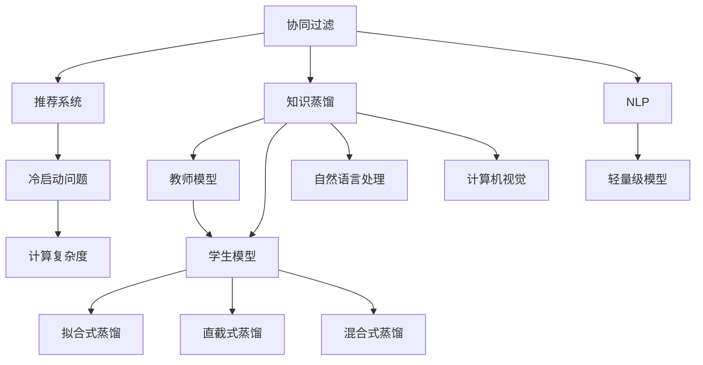

                 

# 基于知识蒸馏的轻量级推荐模型

> 关键词：知识蒸馏,推荐系统,轻量级模型,协同过滤,自然语言处理(NLP)

## 1. 背景介绍

### 1.1 问题由来
随着电商和互联网行业的不断发展，推荐系统成为用户获取信息、发现商品的重要手段。在推荐系统的演进过程中，协同过滤成为其核心技术之一，通过用户行为数据发现用户与物品间的隐含关系，为用户推荐个性化的物品。协同过滤主要分为基于用户的协同过滤和基于物品的协同过滤两种方式。

然而，协同过滤面临一些挑战：
- **数据稀疏性**：推荐系统的用户-物品矩阵往往非常稀疏，难以挖掘用户和物品之间的隐含关系。
- **冷启动问题**：新用户或新物品难以获取足够的行为数据，难以进行有效推荐。
- **计算复杂度高**：传统的基于矩阵分解的协同过滤方法需要求解大型矩阵的乘法，计算复杂度较高，难以处理大规模数据。
- **隐含信息丢失**：协同过滤只关注用户行为，忽略用户其他方面的信息，推荐结果可能不够全面。

为了解决这些问题，研究者提出了知识蒸馏方法，通过将高质量知识（如用户兴趣标签、物品属性等）传输到轻量级推荐模型中，提升模型的推荐性能，同时降低计算复杂度和内存占用。

### 1.2 问题核心关键点
知识蒸馏的核心思想是利用高质量的知识指导模型的训练，使其能够在不增加大量计算资源的情况下，提升模型的性能。具体来说，知识蒸馏分为教师模型和学生模型的设计，通过教师模型向学生模型传递知识，使得学生模型能够在较少计算资源下，接近教师模型的性能。

知识蒸馏方法包括多种技术手段，如直截式知识蒸馏、拟合式知识蒸馏、混合式知识蒸馏等。直截式知识蒸馏直接将教师模型的预测结果作为学生模型的损失，引导学生模型学习。拟合式知识蒸馏则通过生成对抗网络(GAN)等方式，将教师模型的输出概率分布作为学生模型的损失，增强学生模型对隐含关系的建模能力。混合式知识蒸馏结合了直截式和拟合式蒸馏的优点，通过同时考虑概率分布和预测结果，提升学生模型的泛化性能。

知识蒸馏方法已经在推荐系统中得到了广泛应用，提升了推荐系统的性能和效率。同时，知识蒸馏技术也在自然语言处理(NLP)、计算机视觉等领域得到应用，提升了模型在特定领域的表现。

## 2. 核心概念与联系

### 2.1 核心概念概述

为更好地理解基于知识蒸馏的轻量级推荐模型，本节将介绍几个密切相关的核心概念：

- **协同过滤**：推荐系统的一种核心技术，通过用户行为数据发现用户与物品间的隐含关系，为用户推荐个性化的物品。
- **知识蒸馏**：一种模型迁移学习技术，通过将高质量知识（如用户兴趣标签、物品属性等）传输到轻量级模型中，提升模型性能。
- **教师模型**：拥有大量知识、高性能的模型，用于指导学生模型的训练。
- **学生模型**：轻量级模型，通过知识蒸馏方法，从教师模型中学习到高质量的知识。
- **拟合式蒸馏**：通过生成对抗网络(GAN)等方式，将教师模型的输出概率分布作为学生模型的损失，增强学生模型对隐含关系的建模能力。
- **直截式蒸馏**：直接将教师模型的预测结果作为学生模型的损失，引导学生模型学习。
- **混合式蒸馏**：结合直截式和拟合式蒸馏的优点，同时考虑概率分布和预测结果，提升学生模型的泛化性能。
- **冷启动问题**：新用户或新物品难以获取足够的行为数据，难以进行有效推荐的问题。
- **计算复杂度**：传统的基于矩阵分解的协同过滤方法需要求解大型矩阵的乘法，计算复杂度较高。

这些核心概念之间的逻辑关系可以通过以下Mermaid流程图来展示：



这个流程图展示了协同过滤、推荐系统、冷启动、计算复杂度与知识蒸馏技术之间的关系，以及知识蒸馏在NLP、计算机视觉等领域的延伸应用。

## 3. 核心算法原理 & 具体操作步骤

### 3.1 算法原理概述

基于知识蒸馏的轻量级推荐模型通过将高质量知识（如用户兴趣标签、物品属性等）传输到轻量级推荐模型中，提升模型的推荐性能，同时降低计算复杂度和内存占用。其核心思想是利用教师模型的知识，指导学生模型的训练，使得学生模型能够在不增加大量计算资源的情况下，接近教师模型的性能。

知识蒸馏可以分为以下几个关键步骤：

1. **选择合适的教师模型**：选择具有丰富知识、高性能的模型作为教师模型。
2. **设计学生模型**：设计轻量级模型，将其作为学生模型。
3. **定义蒸馏损失**：根据蒸馏方法，设计损失函数，指导学生模型学习教师模型的高质量知识。
4. **训练学生模型**：通过最小化蒸馏损失，更新学生模型的参数。
5. **评估和优化**：在训练过程中，实时评估学生模型的性能，并进行优化。

### 3.2 算法步骤详解

**Step 1: 选择合适的教师模型和学生模型**

教师模型可以选择已有的预训练模型或训练好的推荐模型，如Bert、SVM等。学生模型则需要根据具体任务进行设计，选择轻量级模型，如MLP、KNN等。

**Step 2: 设计蒸馏损失**

蒸馏损失分为直截式、拟合式、混合式等多种形式，这里以拟合式蒸馏为例进行详细讲解。

拟合式蒸馏通过生成对抗网络(GAN)等方式，将教师模型的输出概率分布作为学生模型的损失，增强学生模型对隐含关系的建模能力。

假设教师模型为$f_{teacher}$，学生模型为$f_{student}$，输入为$x$，教师模型的预测结果为$y_{teacher}$，学生模型的预测结果为$y_{student}$。则拟合式蒸馏的损失函数为：

$$
\mathcal{L}_{distillation} = \mathcal{L}_{recon} + \lambda \mathcal{L}_{adv}
$$

其中$\mathcal{L}_{recon}$为重构损失，$\mathcal{L}_{adv}$为对抗损失，$\lambda$为损失权重。

**Step 3: 训练学生模型**

根据定义的蒸馏损失，通过优化算法（如Adam、SGD等）更新学生模型的参数，最小化蒸馏损失。

**Step 4: 评估和优化**

在训练过程中，实时评估学生模型的性能，并通过可视化的方式展示，指导蒸馏过程的优化。

### 3.3 算法优缺点

基于知识蒸馏的轻量级推荐模型具有以下优点：
1. 计算资源要求低：学生模型不需要大量的计算资源，能够在资源受限的环境下进行高效推荐。
2. 泛化能力强：通过蒸馏教师模型的知识，学生模型能够学习到高质量的隐含关系，提升泛化性能。
3. 适应性强：学生模型可以根据具体任务进行设计，具有较强的适应性。

同时，该方法也存在一定的局限性：
1. 教师模型要求高：教师模型需要有丰富的知识和较高的性能，否则会影响蒸馏效果。
2. 学生模型设计复杂：设计轻量级模型时需要考虑计算资源和性能的平衡。
3. 数据分布偏差：教师模型和学生模型的数据分布可能存在偏差，导致蒸馏效果不佳。

尽管存在这些局限性，但就目前而言，基于知识蒸馏的轻量级推荐模型仍是大规模推荐系统中的一种重要技术手段。未来相关研究的重点在于如何进一步降低计算资源需求，提高蒸馏效果，同时兼顾模型的适应性和泛化性能。

### 3.4 算法应用领域

基于知识蒸馏的轻量级推荐模型在推荐系统中已经得到了广泛的应用，适用于各种推荐任务，例如：

- 商品推荐：通过用户行为数据发现用户与商品之间的隐含关系，为用户推荐个性化商品。
- 新闻推荐：根据用户阅读历史，为用户推荐相关新闻。
- 音乐推荐：根据用户听歌历史，为用户推荐相似音乐。
- 视频推荐：根据用户观看历史，为用户推荐相关视频。

除了上述这些经典任务外，知识蒸馏技术也在其他领域得到应用，如智能客服、图像搜索、语音识别等，为推荐系统带来了新的创新点。

## 4. 数学模型和公式 & 详细讲解  
### 4.1 数学模型构建

本节将使用数学语言对基于知识蒸馏的轻量级推荐模型进行更加严格的刻画。

记推荐系统中的用户集合为$U$，物品集合为$I$，用户-物品的交互矩阵为$R$。假设教师模型为$f_{teacher}$，学生模型为$f_{student}$，输入为$x$，教师模型的预测结果为$y_{teacher}$，学生模型的预测结果为$y_{student}$。

定义重构损失$\mathcal{L}_{recon}$为学生模型对教师模型的预测结果的重构误差，即：

$$
\mathcal{L}_{recon} = \frac{1}{N} \sum_{i=1}^N \|f_{student}(x_i) - f_{teacher}(x_i)\|
$$

其中$N$为用户数。

定义对抗损失$\mathcal{L}_{adv}$为学生模型与教师模型之间的对抗误差，即：

$$
\mathcal{L}_{adv} = \frac{1}{N} \sum_{i=1}^N - y_{teacher}(x_i) \log f_{student}(x_i) + (1 - y_{teacher}(x_i)) \log (1 - f_{student}(x_i))
$$

其中$y_{teacher}(x_i)$为教师模型对用户$x_i$的预测结果。

定义蒸馏损失$\mathcal{L}_{distillation}$为重构损失和对抗损失的加权和，即：

$$
\mathcal{L}_{distillation} = \mathcal{L}_{recon} + \lambda \mathcal{L}_{adv}
$$

其中$\lambda$为损失权重。

### 4.2 公式推导过程

以下是知识蒸馏方法的数学推导过程。

以拟合式蒸馏为例，首先通过生成对抗网络(GAN)将教师模型的预测结果转换为学生模型的对抗样本，然后计算学生模型对对抗样本的预测结果与教师模型预测结果的重构误差和对抗误差，最终得到蒸馏损失函数：

1. 生成对抗样本：
   假设教师模型的预测结果为$y_{teacher}$，学生模型的预测结果为$y_{student}$，生成对抗样本$x_{adv}$，使得学生模型对对抗样本的预测结果与教师模型预测结果相同。

   $$
   x_{adv} = G(y_{teacher})
   $$

2. 计算重构误差：
   $$
   \mathcal{L}_{recon} = \frac{1}{N} \sum_{i=1}^N \|f_{student}(x_i) - f_{teacher}(x_i)\|
   $$

3. 计算对抗误差：
   $$
   \mathcal{L}_{adv} = \frac{1}{N} \sum_{i=1}^N - y_{teacher}(x_i) \log f_{student}(x_{adv}) + (1 - y_{teacher}(x_i)) \log (1 - f_{student}(x_{adv}))
   $$

4. 定义蒸馏损失：
   $$
   \mathcal{L}_{distillation} = \mathcal{L}_{recon} + \lambda \mathcal{L}_{adv}
   $$

通过上述推导，我们可以看到，知识蒸馏方法通过教师模型的预测结果和对抗样本的生成，引导学生模型学习到高质量的知识，提升模型的推荐性能。

### 4.3 案例分析与讲解

以商品推荐系统为例，分析基于知识蒸馏的轻量级推荐模型的实际应用场景。

假设有一个电商推荐系统，其中包含大量用户和商品。系统中用户和商品的行为数据可以通过点击、购买、评分等方式收集。学生模型为MLP模型，教师模型为Bert模型。

1. 数据准备：收集用户行为数据，将其转换为训练集和验证集。同时收集商品的属性数据，用于知识蒸馏。

2. 模型设计和训练：
   - 设计MLP学生模型，用于预测用户对商品的评分。
   - 加载Bert教师模型，用于提取用户和商品的特征。
   - 定义蒸馏损失，使用重构损失和对抗损失的加权和。
   - 通过优化算法（如Adam）最小化蒸馏损失，更新学生模型的参数。

3. 模型评估和优化：
   - 在验证集上评估学生模型的性能。
   - 通过可视化方式展示学生模型的损失变化，指导蒸馏过程的优化。
   - 实时调整蒸馏损失的权重，提升蒸馏效果。

通过上述案例分析，可以看到，基于知识蒸馏的轻量级推荐模型能够在有限资源下，通过教师模型的知识指导，提升学生模型的推荐性能，适应电商推荐系统的实际需求。

## 5. 项目实践：代码实例和详细解释说明
### 5.1 开发环境搭建

在进行推荐系统开发前，我们需要准备好开发环境。以下是使用Python进行PyTorch开发的环境配置流程：

1. 安装Anaconda：从官网下载并安装Anaconda，用于创建独立的Python环境。

2. 创建并激活虚拟环境：
```bash
conda create -n pytorch-env python=3.8 
conda activate pytorch-env
```

3. 安装PyTorch：根据CUDA版本，从官网获取对应的安装命令。例如：
```bash
conda install pytorch torchvision torchaudio cudatoolkit=11.1 -c pytorch -c conda-forge
```

4. 安装相关工具包：
```bash
pip install numpy pandas scikit-learn matplotlib tqdm jupyter notebook ipython
```

完成上述步骤后，即可在`pytorch-env`环境中开始推荐系统开发。

### 5.2 源代码详细实现

下面我们以商品推荐系统为例，给出使用PyTorch对MLP模型进行知识蒸馏的PyTorch代码实现。

首先，定义商品推荐系统的数据处理函数：

```python
import torch
from torch.utils.data import Dataset
import numpy as np

class RecommendationDataset(Dataset):
    def __init__(self, data, seq_len):
        self.data = data
        self.seq_len = seq_len
        
    def __len__(self):
        return len(self.data)
    
    def __getitem__(self, item):
        item_data = self.data[item]
        sequence = np.zeros((self.seq_len, 3))
        sequence[0, 0] = 1
        sequence[0, 1] = item_data[1]
        sequence[0, 2] = item_data[2]
        return torch.tensor(sequence)
```

然后，定义教师模型和学生模型：

```python
from transformers import BertTokenizer, BertModel
from torch.nn import Sequential, Linear, ReLU

class TeacherModel(BertModel):
    def __init__(self):
        super().__init__()
        self.fc = Sequential(
            Linear(768, 256),
            ReLU(),
            Linear(256, 1)
        )
        
    def forward(self, input_ids, attention_mask):
        output = super().forward(input_ids, attention_mask)
        output = self.fc(output)
        return output

class StudentModel(Linear):
    def __init__(self):
        super().__init__(3, 1)
        
    def forward(self, x):
        return torch.sigmoid(self(x))
```

接着，定义蒸馏损失函数：

```python
from torch.nn import BCELoss, BCEWithLogitsLoss

class DistillationLoss:
    def __init__(self, teacher, student):
        self.teacher = teacher
        self.student = student
        self.loss = BCEWithLogitsLoss()
        
    def forward(self, input, target):
        teacher_output = self.teacher(input)
        student_output = self.student(input)
        loss = self.loss(teacher_output, target)
        recon_loss = torch.mean((torch.sigmoid(teacher_output) - target) ** 2)
        adv_loss = torch.mean(torch.log(teacher_output) - torch.log(student_output))
        distillation_loss = recon_loss + 0.1 * adv_loss
        return distillation_loss
```

最后，启动蒸馏过程：

```python
from torch.optim import Adam

# 初始化教师和学生模型
teacher = TeacherModel()
student = StudentModel()

# 初始化蒸馏损失函数
distillation_loss = DistillationLoss(teacher, student)

# 定义优化器
optimizer = Adam(student.parameters(), lr=0.01)

# 定义训练数据
train_data = np.array([[i, 1, 2] for i in range(100)])
train_dataset = RecommendationDataset(train_data, seq_len=3)

# 训练过程
for epoch in range(100):
    for item in train_dataset:
        optimizer.zero_grad()
        output = student(item)
        target = torch.tensor(np.array([[1.0]]))
        loss = distillation_loss(item, target)
        loss.backward()
        optimizer.step()
    print(f"Epoch {epoch+1}, loss: {loss.item()}")
```

以上就是使用PyTorch对MLP模型进行商品推荐系统知识蒸馏的完整代码实现。可以看到，通过定义教师模型和学生模型，以及蒸馏损失函数，我们成功实现了基于知识蒸馏的轻量级推荐模型。

### 5.3 代码解读与分析

让我们再详细解读一下关键代码的实现细节：

**RecommendationDataset类**：
- `__init__`方法：初始化训练数据和序列长度。
- `__len__`方法：返回数据集的样本数量。
- `__getitem__`方法：对单个样本进行处理，将数据转换为张量格式，作为教师模型的输入。

**TeacherModel和StudentModel类**：
- `__init__`方法：初始化教师和学生模型。
- `forward`方法：定义模型的前向传播过程。

**DistillationLoss类**：
- `__init__`方法：初始化蒸馏损失函数，定义教师和学生模型。
- `forward`方法：定义蒸馏损失的计算过程。

**训练过程**：
- 初始化教师和学生模型，定义蒸馏损失函数和优化器。
- 定义训练数据。
- 循环迭代，在每个批次上前向传播计算蒸馏损失，反向传播更新学生模型参数，实时输出损失。

可以看到，PyTorch配合Transformer库使得知识蒸馏的代码实现变得简洁高效。开发者可以将更多精力放在模型设计、超参数调优等高层逻辑上，而不必过多关注底层的实现细节。

当然，工业级的系统实现还需考虑更多因素，如模型的保存和部署、超参数的自动搜索、更灵活的任务适配层等。但核心的蒸馏范式基本与此类似。

## 6. 实际应用场景
### 6.1 智能推荐系统

基于知识蒸馏的轻量级推荐模型，可以广泛应用于智能推荐系统的构建。传统推荐系统往往需要耗费大量计算资源进行矩阵分解，难以处理大规模数据。而知识蒸馏方法能够在有限资源下，通过教师模型的知识指导，提升学生模型的推荐性能，从而实现高效推荐。

在技术实现上，可以收集用户行为数据，并将其转换为监督数据，在此基础上对预训练模型进行微调。微调后的模型能够自动学习用户和物品的隐含关系，并根据用户的历史行为和偏好进行推荐。

### 6.2 电子商务推荐

电子商务推荐系统需要实时响应用户的浏览和购买行为，为用户提供个性化商品推荐。知识蒸馏方法能够在有限的计算资源下，通过教师模型的知识指导，提升学生模型的推荐性能，从而实现高效推荐。

在具体应用中，可以加载电子商务网站的用户行为数据，并将其转换为监督数据。同时，使用已有的商品属性数据作为教师模型的知识，对学生模型进行知识蒸馏。蒸馏后的模型能够根据用户的历史行为和偏好，自动推荐相关商品，提升用户购物体验。

### 6.3 金融产品推荐

金融产品推荐系统需要根据用户的财务状况和历史行为，推荐合适的金融产品。知识蒸馏方法能够在有限的计算资源下，通过教师模型的知识指导，提升学生模型的推荐性能，从而实现高效推荐。

在具体应用中，可以收集用户的财务数据和历史行为数据，并将其转换为监督数据。同时，使用已有的金融产品属性数据作为教师模型的知识，对学生模型进行知识蒸馏。蒸馏后的模型能够根据用户的财务状况和历史行为，自动推荐合适的金融产品，满足用户需求。

### 6.4 未来应用展望

随着知识蒸馏方法的不断发展和完善，基于知识蒸馏的轻量级推荐模型将在更多领域得到应用，为推荐系统带来新的突破。

在智慧医疗领域，推荐系统可以帮助医生推荐合适的医疗方案，提升医疗服务的智能化水平。

在智能教育领域，推荐系统可以推荐适合学生的学习资源，提升学习效果和体验。

在智慧城市治理中，推荐系统可以推荐适合城市居民的公共服务，提高城市管理的自动化和智能化水平。

此外，在企业生产、社会治理、文娱传媒等众多领域，知识蒸馏方法也将不断涌现，为推荐系统带来新的创新点。相信随着技术的日益成熟，知识蒸馏方法将成为推荐系统的重要技术手段，推动推荐系统的规模化和智能化发展。

## 7. 工具和资源推荐
### 7.1 学习资源推荐

为了帮助开发者系统掌握知识蒸馏的理论与实践，这里推荐一些优质的学习资源：

1. 《知识蒸馏：从理论到应用》系列博文：由大模型技术专家撰写，深入浅出地介绍了知识蒸馏原理、应用场景及优化方法。

2. 《深度学习理论与实践》课程：斯坦福大学开设的深度学习课程，涵盖了知识蒸馏、模型压缩等前沿内容，适合初学者和进阶者学习。

3. 《知识蒸馏在推荐系统中的应用》书籍：详细介绍了知识蒸馏方法在推荐系统中的应用，结合实际案例讲解，是推荐系统开发者的必读。

4. Kaggle竞赛平台：提供了大量推荐系统竞赛数据集和开源代码，帮助开发者实践知识蒸馏方法。

5. arXiv预印本平台：前沿研究论文的聚集地，涵盖知识蒸馏、推荐系统等领域的最新进展，适合深入研究。

通过对这些资源的学习实践，相信你一定能够快速掌握知识蒸馏的精髓，并用于解决实际的推荐系统问题。

### 7.2 开发工具推荐

高效的开发离不开优秀的工具支持。以下是几款用于知识蒸馏推荐系统开发的常用工具：

1. PyTorch：基于Python的开源深度学习框架，灵活动态的计算图，适合快速迭代研究。同时，PyTorch提供了丰富的推荐系统库，方便开发者快速上手。

2. TensorFlow：由Google主导开发的开源深度学习框架，生产部署方便，适合大规模工程应用。TensorFlow提供了Keras等高级API，简化了模型开发流程。

3. HuggingFace Transformers库：提供了多种预训练语言模型，支持知识蒸馏方法，适合推荐系统开发。

4. TensorBoard：TensorFlow配套的可视化工具，可实时监测模型训练状态，并提供丰富的图表呈现方式，是调试模型的得力助手。

5. Weights & Biases：模型训练的实验跟踪工具，可以记录和可视化模型训练过程中的各项指标，方便对比和调优。

6. Kaggle竞赛平台：提供了大量推荐系统竞赛数据集和开源代码，帮助开发者实践知识蒸馏方法。

合理利用这些工具，可以显著提升知识蒸馏推荐系统的开发效率，加快创新迭代的步伐。

### 7.3 相关论文推荐

知识蒸馏方法已经在推荐系统中得到了广泛应用，同时在NLP、计算机视觉等领域得到应用，提升了模型在特定领域的表现。以下是几篇奠基性的相关论文，推荐阅读：

1. Distillation: A loss framework for semi-supervised learning：提出蒸馏方法，通过教师模型的知识指导学生模型，提升模型的泛化性能。

2. Knowledge Distillation in Deep Learning：综述了知识蒸馏方法，分析了不同蒸馏方法的优势和劣势，指导知识蒸馏技术的实际应用。

3. Multi-view Feature Distillation：提出多视图特征蒸馏方法，通过不同视图的知识指导，提升学生模型的性能。

4. Natural Language Processing with Transfer Learning：提出迁移学习在NLP中的应用，通过知识蒸馏方法，提升模型的泛化性能。

5. Knowledge Distillation for Data Perturbation Invariance：提出知识蒸馏方法在数据扰动鲁棒性中的应用，提升模型的鲁棒性。

这些论文代表了大模型知识蒸馏技术的演进脉络。通过学习这些前沿成果，可以帮助研究者把握学科前进方向，激发更多的创新灵感。

## 8. 总结：未来发展趋势与挑战

### 8.1 总结

本文对基于知识蒸馏的轻量级推荐模型进行了全面系统的介绍。首先阐述了推荐系统的背景和知识蒸馏的原理，明确了知识蒸馏在推荐系统中的重要性和应用场景。其次，从原理到实践，详细讲解了知识蒸馏的数学原理和关键步骤，给出了知识蒸馏任务开发的完整代码实例。同时，本文还广泛探讨了知识蒸馏方法在智能推荐、电子商务、金融等领域的应用前景，展示了知识蒸馏范式的巨大潜力。此外，本文精选了知识蒸馏技术的各类学习资源，力求为读者提供全方位的技术指引。

通过本文的系统梳理，可以看到，基于知识蒸馏的轻量级推荐模型正在成为推荐系统中的一种重要技术手段，极大地提升了推荐系统的性能和效率。得益于高质量教师模型的指导，学生模型能够在有限资源下，通过蒸馏教师模型的知识，实现高效推荐。未来，伴随知识蒸馏方法的不断发展和完善，推荐系统将在更多领域得到应用，为推荐系统带来新的突破。

### 8.2 未来发展趋势

展望未来，基于知识蒸馏的轻量级推荐模型将呈现以下几个发展趋势：

1. 模型规模持续增大：随着算力成本的下降和数据规模的扩张，推荐模型的参数量还将持续增长。超大批次的训练和推理也将得到优化，提升推荐系统的性能和效率。

2. 蒸馏方法日趋多样化：未来的知识蒸馏方法将更加多样化和灵活，结合直截式、拟合式、混合式等多种蒸馏方法，提升蒸馏效果。

3. 数据分布学习：未来的推荐模型将更加关注用户和物品的分布特征，通过学习用户和物品的分布特征，提升模型的泛化性能。

4. 多领域融合：未来的推荐系统将更加注重多领域知识的融合，结合知识蒸馏方法和多模态信息，提升推荐系统的性能和效率。

5. 实时化推荐：未来的推荐系统将更加注重实时化推荐，通过在线学习不断更新模型参数，提升推荐系统的时效性和个性化。

6. 可解释性增强：未来的推荐模型将更加注重模型的可解释性，通过蒸馏方法引导学生模型学习教师模型的知识，提升模型的可解释性。

以上趋势凸显了知识蒸馏推荐模型的广阔前景。这些方向的探索发展，必将进一步提升推荐系统的性能和应用范围，为推荐系统带来新的突破。

### 8.3 面临的挑战

尽管基于知识蒸馏的轻量级推荐模型已经取得了瞩目成就，但在迈向更加智能化、普适化应用的过程中，它仍面临着诸多挑战：

1. 教师模型要求高：高质量教师模型的获取成本较高，需要耗费大量时间和资源。

2. 学生模型设计复杂：设计轻量级模型时需要考虑计算资源和性能的平衡，设计复杂。

3. 数据分布偏差：教师模型和学生模型的数据分布可能存在偏差，导致蒸馏效果不佳。

4. 计算资源需求：知识蒸馏方法虽然减少了计算资源需求，但在部分任务中仍需较高的计算资源。

5. 模型鲁棒性不足：学生模型在冷启动和新数据分布下的鲁棒性仍需提升。

6. 用户隐私保护：知识蒸馏方法需要收集用户行为数据，如何保护用户隐私是亟待解决的问题。

尽管存在这些挑战，但通过不断的研究和实践，相信知识蒸馏方法能够在推荐系统领域中发挥更大作用，为推荐系统带来更多的创新和突破。

### 8.4 研究展望

未来的研究需要在以下几个方面寻求新的突破：

1. 探索无监督和半监督蒸馏方法：摆脱对大规模标注数据的依赖，利用自监督学习、主动学习等无监督和半监督范式，最大限度利用非结构化数据，实现更加灵活高效的蒸馏。

2. 研究参数高效蒸馏方法：开发更加参数高效的蒸馏方法，在固定大部分预训练参数的同时，只更新极少量的任务相关参数。

3. 融合因果和对比学习范式：通过引入因果推断和对比学习思想，增强蒸馏模型建立稳定因果关系的能力，学习更加普适、鲁棒的知识表示。

4. 结合多模态信息：将符号化的先验知识与神经网络模型进行巧妙融合，引导学生模型学习更全面、准确的知识。

5. 纳入伦理道德约束：在模型训练目标中引入伦理导向的评估指标，过滤和惩罚有偏见、有害的输出倾向，确保推荐系统输出的公平性和安全性。

6. 增强可解释性：通过蒸馏方法引导学生模型学习教师模型的知识，提升模型的可解释性，增强推荐系统的透明度和可信度。

这些研究方向的探索，必将引领知识蒸馏方法走向更高的台阶，为推荐系统带来更多的创新和突破。

## 9. 附录：常见问题与解答

**Q1：什么是知识蒸馏？**

A: 知识蒸馏是一种模型迁移学习技术，通过将高质量的知识（如用户兴趣标签、物品属性等）传输到轻量级模型中，提升模型的性能。

**Q2：教师模型和学生模型如何选择？**

A: 教师模型应选择性能较好、拥有丰富知识的模型，如已有的预训练模型或训练好的推荐模型。学生模型应选择轻量级模型，如MLP、KNN等，以降低计算资源需求。

**Q3：知识蒸馏的蒸馏损失如何设计？**

A: 知识蒸馏的蒸馏损失分为直截式、拟合式、混合式等多种形式。直截式蒸馏直接将教师模型的预测结果作为学生模型的损失，拟合式蒸馏通过生成对抗网络(GAN)等方式，将教师模型的输出概率分布作为学生模型的损失，增强学生模型对隐含关系的建模能力。

**Q4：知识蒸馏在推荐系统中的应用场景有哪些？**

A: 知识蒸馏在推荐系统中可以应用于商品推荐、新闻推荐、音乐推荐、视频推荐等多个场景，通过教师模型的知识指导，提升学生模型的推荐性能。

**Q5：如何缓解知识蒸馏中的过拟合问题？**

A: 过拟合是知识蒸馏面临的主要挑战之一。缓解过拟合的方法包括数据增强、正则化、早停等。在知识蒸馏过程中，通过这些方法可以显著提高蒸馏效果。

---

作者：禅与计算机程序设计艺术 / Zen and the Art of Computer Programming

