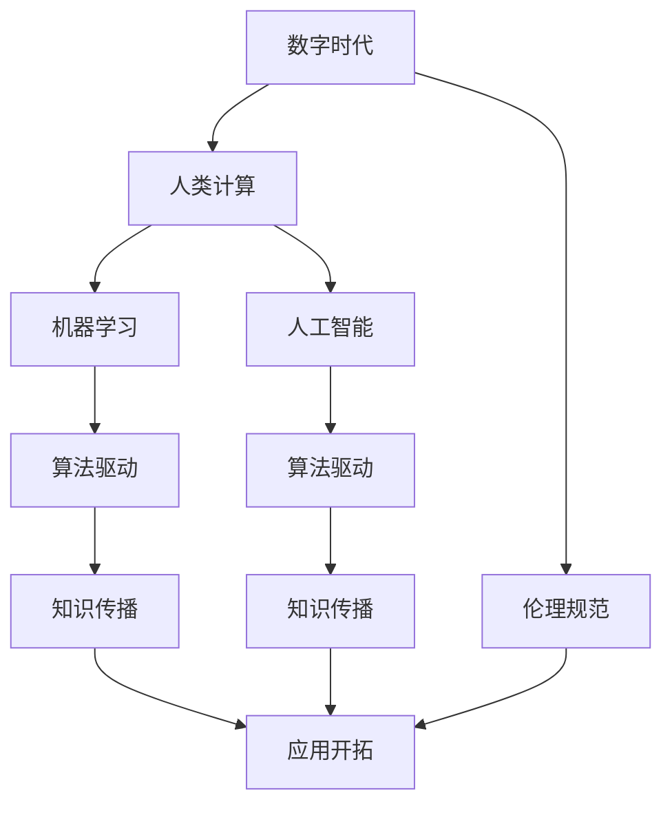

                 

# 塑造数字时代：人类计算的关键作用

> 关键词：数字时代, 人类计算, 算法驱动, 机器学习, 人工智能, 计算架构

## 1. 背景介绍

### 1.1 问题由来

随着信息技术的发展，人类社会已经步入了数字时代。从最初的单机时代到互联网的普及，再到移动互联网、物联网、大数据的爆发，计算的形态和能力在不断演进，逐渐从人类计算转向机器计算。今天，人们已经能够随时随地使用智能手机、计算机、智能家居等设备，进行信息的收集、存储、处理和交互。

尽管机器计算能力的提升带来了便利，但人类计算在信息生成、知识理解和应用推广方面的关键作用仍然不可替代。人类计算，特别是其背后的智慧和创造力，将继续在数字时代扮演核心角色，引导未来技术的发展。

### 1.2 问题核心关键点

现代信息技术的发展，离不开人类计算的智慧和创造力。人类计算的核心关键点包括：

- 信息的理解与生成：人类通过阅读、分析、创作等活动，将海量数据转化为具有价值的知识。
- 知识的传播与推广：人类通过教育、媒体、传播等渠道，将知识普及到社会各层面。
- 应用场景的开拓：人类基于对问题的深刻洞察和实践探索，开拓新的技术应用场景。
- 算法的创新与优化：人类基于丰富的经验和直觉，设计和优化计算算法，驱动技术的演进。
- 伦理与规范的制定：人类在技术应用的各个环节，制定伦理规范，保障技术的安全和公正。

本文将深入探讨人类计算在数字时代的关键作用，特别是其在算法驱动、知识传播、应用开拓和伦理规范方面的重要性。

## 2. 核心概念与联系

### 2.1 核心概念概述

为更好地理解人类计算的关键作用，本节将介绍几个密切相关的核心概念：

- 数字时代：以信息技术为基础，通过数字化手段进行信息收集、存储、处理和交互的新时代。
- 人类计算：人类通过阅读、分析、创作等活动，对数据进行处理和理解，从而生成知识的过程。
- 机器学习：通过算法让机器从数据中学习规律，进而对新的数据进行预测或决策。
- 人工智能：使机器具备类人智能的能力，包括感知、学习、推理、决策等。
- 算法驱动：以算法为核心，通过数据和计算模型，自动生成智能决策的过程。
- 知识传播：通过各种媒介，将知识普及到社会各层面的过程。
- 应用开拓：基于对问题的深入理解，开拓新的技术应用场景。
- 伦理规范：在技术应用中，制定伦理规范，保障技术的公正和透明。

这些核心概念之间的逻辑关系可以通过以下Mermaid流程图来展示：



这个流程图展示了一系列关键概念之间的联系：

1. 数字时代为人类计算提供了技术支撑。
2. 人类计算是机器学习和人工智能的核心驱动力。
3. 机器学习和人工智能进一步推动了算法驱动的智能化发展。
4. 知识传播和应用开拓使得算法驱动的技术得到广泛应用。
5. 伦理规范在技术应用中起到约束和指导作用。

## 3. 核心算法原理 & 具体操作步骤
### 3.1 算法原理概述

算法驱动是人工智能技术发展的核心驱动力。基于算法驱动，计算机能够自主地进行数据处理和决策。核心算法原理包括以下几个方面：

1. 数据预处理：包括数据清洗、特征提取、数据增强等步骤，使数据适合算法模型。
2. 模型训练：通过监督、非监督、强化学习等方法，训练模型参数。
3. 模型推理：根据新数据，通过模型推理进行预测或决策。
4. 模型优化：通过参数调整、模型融合等方法，提升模型效果。
5. 应用部署：将模型嵌入实际应用场景，进行数据处理和决策。

算法驱动的核心原理是：通过数据和模型，自动生成智能决策，从而在数据和计算之间建立高效的转化关系。

### 3.2 算法步骤详解

算法驱动的详细步骤通常包括：

1. 数据收集与清洗：收集和处理原始数据，包括去除噪声、处理缺失值等。
2. 特征工程：提取和构建数据特征，提高算法的识别能力和泛化能力。
3. 模型选择与训练：选择合适的算法模型，在训练数据集上进行训练，调整模型参数。
4. 模型评估与优化：通过验证集或测试集，评估模型效果，进行模型融合、参数调优等。
5. 应用部署与监控：将模型嵌入实际应用场景，进行数据处理和决策，持续监控模型效果和稳定性。

以下是算法驱动的具体示例：

```python
# 数据预处理
import pandas as pd
import numpy as np

# 数据清洗
data = pd.read_csv('data.csv')
data.dropna(inplace=True)

# 特征提取
features = data[['feature1', 'feature2', 'feature3']]
target = data['target']

# 数据增强
from sklearn.model_selection import train_test_split
features_train, features_test, target_train, target_test = train_test_split(features, target, test_size=0.2, random_state=42)

# 模型训练
from sklearn.ensemble import RandomForestClassifier

model = RandomForestClassifier(n_estimators=100, random_state=42)
model.fit(features_train, target_train)

# 模型推理
predictions = model.predict(features_test)

# 模型评估
from sklearn.metrics import accuracy_score

accuracy = accuracy_score(target_test, predictions)
print(f'Accuracy: {accuracy:.2f}')
```

### 3.3 算法优缺点

算法驱动在提升数据处理和决策效率方面具有显著优势，但也存在一些局限性：

优点：
- 高效性：算法驱动能够自动处理大量数据，快速生成预测或决策。
- 灵活性：算法驱动能够适应多种数据和应用场景，进行灵活调整。
- 可解释性：算法驱动通常有明确的计算过程，便于解释和调试。
- 可复制性：算法驱动的模型和数据处理过程，便于复制和推广。

缺点：
- 数据依赖性：算法驱动高度依赖于数据质量，数据偏差可能导致算法失效。
- 模型复杂性：高复杂度的算法模型，需要较高的计算资源和时间。
- 泛化能力：算法驱动可能过拟合训练数据，泛化能力有限。
- 鲁棒性：算法驱动的模型可能对噪声和异常值敏感。

### 3.4 算法应用领域

算法驱动已经在众多领域得到广泛应用，如金融、医疗、制造业、交通、教育等。以下是几个典型的应用案例：

1. 金融风险评估：通过算法驱动的信用评分模型，对客户的信用状况进行评估，预测违约风险。
2. 医疗诊断：通过算法驱动的图像识别模型，对医学影像进行分析和诊断，辅助医生进行决策。
3. 制造业质量控制：通过算法驱动的异常检测模型，实时监控生产过程中的质量问题，提高产品合格率。
4. 交通流量预测：通过算法驱动的交通流预测模型，优化交通管理，提高交通效率。
5. 教育个性化推荐：通过算法驱动的推荐系统，根据学生的学习行为和偏好，进行个性化推荐，提升学习效果。

这些应用案例展示了算法驱动在各个领域中的强大功能和广泛应用。未来，随着算法驱动技术的不断进步，相信其在更多领域将发挥更大的作用。

## 4. 数学模型和公式 & 详细讲解 & 举例说明

### 4.1 数学模型构建

本节将使用数学语言对算法驱动的计算过程进行更加严格的刻画。

假设数据集为 $\mathcal{D}=\{(x_i, y_i)\}_{i=1}^N$，其中 $x_i$ 为输入特征，$y_i$ 为标签。定义模型 $M$ 的参数空间为 $\theta$，模型输出为 $M(x_i)$，则损失函数 $L$ 可以表示为：

$$L = \frac{1}{N}\sum_{i=1}^N \ell(M(x_i), y_i)$$

其中 $\ell$ 为损失函数，用于衡量模型预测与真实标签之间的差异。常见的损失函数包括均方误差、交叉熵等。

### 4.2 公式推导过程

以线性回归模型为例，推导损失函数及其梯度的计算公式。

假设模型 $M(x_i) = \theta^T x_i$，其中 $\theta$ 为模型参数。则均方误差损失函数为：

$$L = \frac{1}{N}\sum_{i=1}^N (y_i - \theta^T x_i)^2$$

根据链式法则，损失函数对参数 $\theta$ 的梯度为：

$$\nabla_{\theta}L = \frac{1}{N}\sum_{i=1}^N -2x_i(y_i - \theta^T x_i)$$

通过梯度下降等优化算法，不断更新模型参数 $\theta$，最小化损失函数 $L$，得到最优参数 $\hat{\theta}$。

在得到损失函数的梯度后，即可带入优化算法公式，完成模型的迭代优化。重复上述过程直至收敛，最终得到适应目标数据集的最优模型参数 $\hat{\theta}$。

### 4.3 案例分析与讲解

假设有一个电商网站，需要预测用户的购买行为。通过收集用户的浏览历史、购买记录等信息，可以构建一个线性回归模型进行预测。

```python
import pandas as pd
import numpy as np
from sklearn.linear_model import LinearRegression

# 数据加载
data = pd.read_csv('purchase_data.csv')

# 数据预处理
features = data[['feature1', 'feature2', 'feature3']]
target = data['purchase']

# 模型训练
model = LinearRegression()
model.fit(features, target)

# 模型推理
predictions = model.predict(features_test)

# 模型评估
from sklearn.metrics import mean_squared_error

mse = mean_squared_error(target_test, predictions)
print(f'MSE: {mse:.2f}')
```

## 5. 项目实践：代码实例和详细解释说明
### 5.1 开发环境搭建

在进行算法驱动实践前，我们需要准备好开发环境。以下是使用Python进行Scikit-learn开发的环境配置流程：

1. 安装Anaconda：从官网下载并安装Anaconda，用于创建独立的Python环境。

2. 创建并激活虚拟环境：
```bash
conda create -n scikit-learn-env python=3.8 
conda activate scikit-learn-env
```

3. 安装Scikit-learn：
```bash
pip install scikit-learn
```

4. 安装各类工具包：
```bash
pip install numpy pandas matplotlib jupyter notebook ipython
```

完成上述步骤后，即可在`scikit-learn-env`环境中开始算法驱动实践。

### 5.2 源代码详细实现

下面我以电商网站预测用户购买行为为例，给出使用Scikit-learn进行线性回归的PyTorch代码实现。

首先，定义数据处理函数：

```python
import pandas as pd
from sklearn.model_selection import train_test_split
from sklearn.linear_model import LinearRegression

def load_data(file):
    data = pd.read_csv(file)
    features = data[['feature1', 'feature2', 'feature3']]
    target = data['purchase']
    return features, target

def train_test_split_data(features, target):
    features_train, features_test, target_train, target_test = train_test_split(features, target, test_size=0.2, random_state=42)
    return features_train, features_test, target_train, target_test
```

然后，定义模型和优化器：

```python
from sklearn.linear_model import LinearRegression
from sklearn.metrics import mean_squared_error

model = LinearRegression()
optimizer = SGD(model.parameters(), lr=0.01, momentum=0.9)
```

接着，定义训练和评估函数：

```python
from torch.utils.data import TensorDataset, DataLoader

def train_model(model, features_train, features_test, target_train, target_test, num_epochs=100):
    for epoch in range(num_epochs):
        model.train()
        optimizer.zero_grad()
        predictions = model(features_train)
        loss = F.mse_loss(predictions, target_train)
        loss.backward()
        optimizer.step()

        model.eval()
        with torch.no_grad():
            predictions = model(features_test)
        mse = mean_squared_error(target_test, predictions)
        print(f'Epoch {epoch+1}, MSE: {mse:.2f}')

def evaluate_model(model, features_test, target_test):
    with torch.no_grad():
        predictions = model(features_test)
    mse = mean_squared_error(target_test, predictions)
    print(f'Test MSE: {mse:.2f}')
```

最后，启动训练流程并在测试集上评估：

```python
# 数据加载
features, target = load_data('purchase_data.csv')

# 数据分割
features_train, features_test, target_train, target_test = train_test_split_data(features, target)

# 模型训练
train_model(model, features_train, features_test, target_train, target_test)

# 模型评估
evaluate_model(model, features_test, target_test)
```

以上就是使用Scikit-learn进行电商网站预测用户购买行为的完整代码实现。可以看到，得益于Scikit-learn的强大封装，我们可以用相对简洁的代码完成线性回归模型的训练和评估。

### 5.3 代码解读与分析

让我们再详细解读一下关键代码的实现细节：

**load_data函数**：
- 加载电商网站数据集，将特征和标签分离。

**train_test_split_data函数**：
- 对数据集进行划分，将数据分割为训练集和测试集。

**train_model函数**：
- 对模型进行训练，更新模型参数。
- 在训练集上前向传播计算损失函数，反向传播更新模型参数。
- 在测试集上计算模型评估指标。

**evaluate_model函数**：
- 对模型进行评估，计算模型在测试集上的评估指标。

**训练流程**：
- 定义总的epoch数，开始循环迭代
- 每个epoch内，在训练集上进行训练，输出平均损失
- 在测试集上评估，输出模型评估指标

可以看到，Scikit-learn提供了丰富且易用的机器学习工具，使得算法驱动的实践变得简洁高效。开发者可以将更多精力放在数据处理、模型改进等高层逻辑上，而不必过多关注底层的实现细节。

当然，工业级的系统实现还需考虑更多因素，如模型的保存和部署、超参数的自动搜索、更灵活的模型选择等。但核心的算法驱动过程基本与此类似。

## 6. 实际应用场景

### 6.1 金融风控管理

算法驱动在金融风控管理中得到了广泛应用，通过构建信用评分模型、风险评估模型等，对客户的信用状况和贷款风险进行预测和评估。

具体而言，金融企业可以收集客户的财务数据、信用记录、交易行为等信息，构建一个线性回归模型进行预测。通过微调模型参数，使模型输出与客户的实际违约风险相匹配，从而实现风险控制。

### 6.2 医疗影像诊断

算法驱动在医疗影像诊断中也具有重要应用，通过构建图像识别模型，对医学影像进行分析和诊断，辅助医生进行决策。

在实践中，可以收集大量的医学影像数据，标注相应的疾病信息，构建一个卷积神经网络模型进行训练。通过微调模型参数，使模型输出与实际疾病类型相匹配，从而实现疾病诊断。

### 6.3 智能推荐系统

算法驱动在智能推荐系统中同样发挥了重要作用，通过构建推荐模型，对用户行为进行分析和预测，推荐相关商品或内容。

具体而言，电商平台可以收集用户的浏览记录、购买历史、评分信息等数据，构建一个协同过滤模型进行推荐。通过微调模型参数，使模型输出与用户的实际偏好相匹配，从而实现个性化推荐。

### 6.4 未来应用展望

随着算法驱动技术的不断发展，其在更多领域将得到应用，为传统行业带来变革性影响。

在智慧农业领域，算法驱动可以用于分析土壤、气候、作物等数据，预测农作物的产量和质量，指导农业生产。

在智能交通领域，算法驱动可以用于分析交通流量、车况、路况等数据，预测交通状况，优化交通管理。

在智能制造领域，算法驱动可以用于分析生产数据、设备状态、生产计划等数据，预测生产异常，优化生产流程。

此外，在智能家居、智能城市、智能医疗等众多领域，算法驱动的应用也将不断涌现，为各行各业带来新的机遇。

## 7. 工具和资源推荐

### 7.1 学习资源推荐

为了帮助开发者系统掌握算法驱动的理论基础和实践技巧，这里推荐一些优质的学习资源：

1. 《Python数据科学手册》：全面介绍了Python在数据科学中的应用，包括数据处理、机器学习、可视化等。

2. 《统计学习方法》：清华大学出版社，系统介绍了机器学习的理论基础和经典算法。

3. 《深度学习》：花书，深度学习领域的经典教材，详细介绍了深度学习的基本概念和算法。

4. 《Scikit-learn官方文档》：提供了丰富的机器学习算法和工具，适合快速上手实践。

5. 《Kaggle竞赛平台》：提供了大量公开的机器学习竞赛数据集和解决方案，适合提升算法驱动能力。

通过对这些资源的学习实践，相信你一定能够快速掌握算法驱动的精髓，并用于解决实际的机器学习问题。

### 7.2 开发工具推荐

高效的开发离不开优秀的工具支持。以下是几款用于算法驱动开发的常用工具：

1. Python：基于Python的开源语言，具有丰富的第三方库和工具支持，适合快速迭代研究。

2. Scikit-learn：基于Python的机器学习库，提供了丰富且易用的机器学习算法。

3. TensorFlow：由Google主导开发的深度学习框架，生产部署方便，适合大规模工程应用。

4. PyTorch：由Facebook主导开发的深度学习框架，灵活高效，适合快速实验和研究。

5. Weights & Biases：模型训练的实验跟踪工具，可以记录和可视化模型训练过程中的各项指标，方便对比和调优。

6. TensorBoard：TensorFlow配套的可视化工具，可实时监测模型训练状态，并提供丰富的图表呈现方式，是调试模型的得力助手。

合理利用这些工具，可以显著提升算法驱动的开发效率，加快创新迭代的步伐。

### 7.3 相关论文推荐

算法驱动的发展源于学界的持续研究。以下是几篇奠基性的相关论文，推荐阅读：

1. 《随机梯度下降方法》：经典论文，详细介绍了随机梯度下降算法的原理和实现。

2. 《深度神经网络》：经典论文，阐述了深度神经网络的结构和算法。

3. 《卷积神经网络》：经典论文，阐述了卷积神经网络的结构和算法。

4. 《支持向量机》：经典论文，阐述了支持向量机的原理和实现。

5. 《随机森林》：经典论文，阐述了随机森林的原理和实现。

这些论文代表了大数据处理和算法驱动的发展脉络。通过学习这些前沿成果，可以帮助研究者把握学科前进方向，激发更多的创新灵感。

## 8. 总结：未来发展趋势与挑战

### 8.1 总结

本文对算法驱动在数字时代的关键作用进行了全面系统的介绍。首先阐述了算法驱动在机器学习和人工智能发展中的核心地位，明确了其对于数据处理和决策制定的重要性。其次，从原理到实践，详细讲解了算法驱动的数学原理和关键步骤，给出了算法驱动任务开发的完整代码实例。同时，本文还广泛探讨了算法驱动在金融风控、医疗影像、智能推荐等多个领域的应用前景，展示了算法驱动技术的强大功能和广泛应用。此外，本文精选了算法驱动技术的各类学习资源，力求为读者提供全方位的技术指引。

通过本文的系统梳理，可以看到，算法驱动在数字时代扮演着核心角色，其强大的计算能力和高效的数据处理能力，使得机器智能技术得以广泛应用。未来，伴随算法驱动技术的不断演进，相信其在更多领域将发挥更大的作用。

### 8.2 未来发展趋势

展望未来，算法驱动技术将呈现以下几个发展趋势：

1. 模型复杂性提升：随着深度学习模型的不断演进，模型的复杂度将不断提升，能够处理更加复杂的计算任务。

2. 多模态融合：未来的算法驱动技术将融合视觉、语音、文本等多种模态数据，实现更加全面和多样的数据处理和决策。

3. 跨领域应用：算法驱动技术将在更多领域得到应用，如智慧农业、智能交通、智能制造等，推动各行各业的数字化转型。

4. 自适应学习：未来的算法驱动技术将具备自适应学习能力，能够在数据分布变化时自动调整模型参数，提高模型泛化能力。

5. 可解释性增强：未来的算法驱动技术将具备更强的可解释性，能够清晰解释模型内部的决策逻辑和推理过程。

6. 伦理与安全：未来的算法驱动技术将更加注重伦理与安全，保障技术的公正和透明，避免有害数据的传播。

以上趋势凸显了算法驱动技术的广阔前景。这些方向的探索发展，必将进一步提升算法驱动技术的性能和应用范围，为人类社会带来更深远的变革。

### 8.3 面临的挑战

尽管算法驱动技术已经取得了瞩目成就，但在迈向更加智能化、普适化应用的过程中，它仍面临着诸多挑战：

1. 数据质量瓶颈：算法驱动高度依赖于数据质量，数据偏差可能导致算法失效。如何获取高质量数据，提升数据预处理能力，将是重要课题。

2. 模型复杂性挑战：高复杂度的算法模型，需要较高的计算资源和时间。如何降低模型复杂度，提升计算效率，将是重要研究方向。

3. 鲁棒性不足：算法驱动的模型可能对噪声和异常值敏感。如何提高模型的鲁棒性，增强抗干扰能力，将是重要挑战。

4. 可解释性不足：算法驱动的模型通常难以解释其内部工作机制和决策逻辑。如何赋予算法驱动技术更强的可解释性，将是重要方向。

5. 伦理与安全：算法驱动的模型可能学习到有害的信息，需要制定伦理规范，保障技术的公正和安全。

6. 资源限制：高复杂度的算法模型可能面临计算资源和存储资源的限制。如何优化资源使用，提高系统效率，将是重要挑战。

正视算法驱动面临的这些挑战，积极应对并寻求突破，将是大数据处理和算法驱动技术走向成熟的必由之路。相信随着学界和产业界的共同努力，这些挑战终将一一被克服，算法驱动技术必将在构建智能系统方面发挥更大的作用。

### 8.4 研究展望

面对算法驱动面临的挑战，未来的研究需要在以下几个方面寻求新的突破：

1. 探索无监督和半监督算法驱动方法：摆脱对大规模标注数据的依赖，利用自监督学习、主动学习等无监督和半监督范式，最大限度利用非结构化数据，实现更加灵活高效的算法驱动。

2. 研究参数高效和计算高效的算法驱动范式：开发更加参数高效的算法驱动方法，在固定大部分预训练参数的情况下，只更新极少量的任务相关参数。同时优化算法驱动模型的计算图，减少前向传播和反向传播的资源消耗，实现更加轻量级、实时性的部署。

3. 引入更多先验知识：将符号化的先验知识，如知识图谱、逻辑规则等，与算法驱动模型进行巧妙融合，引导算法驱动过程学习更准确、合理的语言模型。

4. 结合因果分析和博弈论工具：将因果分析方法引入算法驱动模型，识别出模型决策的关键特征，增强输出解释的因果性和逻辑性。借助博弈论工具刻画人机交互过程，主动探索并规避模型的脆弱点，提高系统稳定性。

5. 纳入伦理道德约束：在算法驱动训练目标中引入伦理导向的评估指标，过滤和惩罚有害的输出倾向。同时加强人工干预和审核，建立算法驱动行为的监管机制，确保输出符合人类价值观和伦理道德。

这些研究方向的探索，必将引领算法驱动技术迈向更高的台阶，为构建安全、可靠、可解释、可控的智能系统铺平道路。面向未来，算法驱动技术还需要与其他人工智能技术进行更深入的融合，如知识表示、因果推理、强化学习等，多路径协同发力，共同推动自然语言理解和智能交互系统的进步。只有勇于创新、敢于突破，才能不断拓展算法驱动技术的边界，让智能技术更好地造福人类社会。

## 9. 附录：常见问题与解答

**Q1：算法驱动技术是否适用于所有应用场景？**

A: 算法驱动技术在大部分应用场景中都有广泛应用，特别是在数据驱动的场景下，如金融风控、医疗影像、智能推荐等。但对于一些需要复杂决策和情感理解的任务，算法驱动可能难以胜任，如心理咨询、艺术创作等。

**Q2：算法驱动技术对数据质量要求有多高？**

A: 算法驱动技术高度依赖于数据质量，数据偏差可能导致算法失效。因此，获取高质量数据，提升数据预处理能力，是算法驱动技术成功的关键。需要确保数据来源可靠、标注准确、处理规范。

**Q3：算法驱动技术面临的主要挑战是什么？**

A: 算法驱动技术面临的主要挑战包括数据质量、模型复杂度、鲁棒性、可解释性、伦理与安全。解决这些问题需要从数据预处理、模型设计、优化算法等多个维度进行深入研究和优化。

**Q4：如何提高算法驱动技术的可解释性？**

A: 提高算法驱动技术的可解释性，需要从多个方面入手，如增加模型透明度、引入可解释模型、使用模型诊断工具等。同时，需要注意保持模型性能与可解释性之间的平衡。

**Q5：算法驱动技术未来的发展方向是什么？**

A: 算法驱动技术未来的发展方向包括模型复杂性提升、多模态融合、跨领域应用、自适应学习、可解释性增强、伦理与安全等。这些方向的研究将推动算法驱动技术向更加智能化、普适化方向发展。

---

作者：禅与计算机程序设计艺术 / Zen and the Art of Computer Programming

