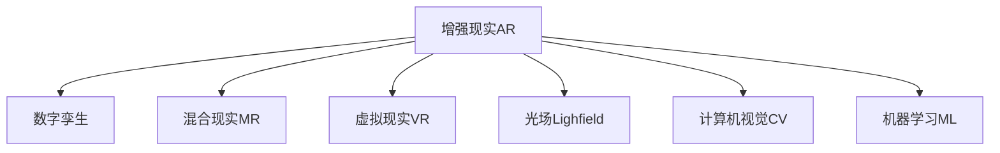

                 

# 增强现实（AR）应用开发：从概念到实现

> 关键词：增强现实（AR）, 数字孪生, 混合现实（MR）, 虚拟现实（VR）, 光场（Lighfield）, 计算机视觉（CV）, 机器学习（ML）

## 1. 背景介绍

### 1.1 问题由来
随着技术的进步，增强现实（AR）正在从概念走向实际应用。AR技术通过计算机图形学、图像处理和显示技术，将虚拟数字信息与用户所在真实世界场景进行融合，为用户提供互动体验，推动了教育、娱乐、旅游、零售、健康等众多领域的发展。

然而，AR应用的开发涉及硬件、软件、数据等多方面的问题，包括数据采集、图像识别、场景建模、渲染计算等。这些技术环节相互关联，需要系统地进行考虑和整合，以实现高互动性、沉浸式和无缝体验的AR应用。

### 1.2 问题核心关键点
增强现实应用开发的难点在于：
- 如何高效采集和处理大量三维空间数据。
- 如何实现虚拟与实物的精确融合，提升用户体验。
- 如何构建复杂场景和动态变化环境的虚拟模型。
- 如何优化渲染计算，保证高效稳定的运行。
- 如何整合多模态信息，提升AR体验的多样性。

本文将围绕上述核心关键点，系统介绍增强现实应用的开发原理、实现步骤、关键技术以及应用场景。

## 2. 核心概念与联系

### 2.1 核心概念概述

增强现实（AR）是结合现实世界信息、虚拟三维数据和用户交互的界面技术。它不仅是对现实世界的增强，还包括对用户感官体验的扩展。

- **数字孪生**：指通过数字技术构建的物理对象的虚拟模型。AR系统可以利用数字孪生技术，将虚拟信息与现实世界进行无缝融合。
- **混合现实（MR）**：将虚拟物体与真实世界的物体混合，在同一视图中共存，是AR与VR（虚拟现实）的混合体。
- **虚拟现实（VR）**：通过头戴设备等硬件，使用户完全沉浸在虚拟环境中。VR主要强调环境的全方位呈现，而AR注重虚拟与现实的结合。
- **光场（Lighfield）**：一种新型显示技术，通过高分辨率、高亮度的全息图像，实现立体感的增强。
- **计算机视觉（CV）**：通过摄像头、传感器等设备，采集真实世界数据，并将其转换为计算机可处理的信息。
- **机器学习（ML）**：利用算法，从数据中学习规律，提升AR应用中场景理解和信息处理的能力。

这些核心概念之间的联系如下Mermaid流程图展示：



## 3. 核心算法原理 & 具体操作步骤

### 3.1 算法原理概述

增强现实应用的开发主要围绕以下几个核心步骤展开：

1. **数据采集**：通过摄像头、传感器等设备，采集真实世界的三维空间数据。
2. **场景重建**：利用计算机视觉技术，将采集到的数据进行图像处理和特征提取，重构现实场景。
3. **三维建模**：在重构场景的基础上，通过三维建模技术，构建虚拟场景和物体。
4. **虚拟与现实融合**：将虚拟信息与现实场景进行精确融合，呈现无缝体验。
5. **渲染优化**：通过图形渲染技术，对融合后的场景进行优化，保证实时渲染效果。

### 3.2 算法步骤详解

#### 数据采集

**步骤1**：选择适宜的传感器和相机。常用的传感器包括RGB摄像头、深度相机、LIDAR等，分别用于捕获颜色信息、深度信息、点云信息等。

**步骤2**：根据实际场景，设计采集方案。例如，用RGB摄像头捕获实时视频流，深度相机用于场景深度信息采集，LIDAR用于精确的三维点云建模。

**步骤3**：设置采集参数，如分辨率、帧率、曝光时间等。确保采集到的数据质量足够高。

#### 场景重建

**步骤1**：对采集到的原始数据进行预处理，包括去噪、校正畸变、图像增强等。

**步骤2**：利用计算机视觉算法，进行特征点检测、边缘检测、场景分割等操作。常用的算法有SIFT、SURF、ORB等。

**步骤3**：通过立体匹配技术，获得场景深度信息，重建三维模型。常用的算法包括DLP、DSLAM、SLAM等。

#### 三维建模

**步骤1**：根据场景重建获得的三维数据，利用三维建模软件，创建虚拟物体。常用的软件有Maya、Blender、3ds Max等。

**步骤2**：对虚拟物体进行材质贴图、纹理映射、光照设置等操作，增强真实感。

**步骤3**：将虚拟物体与实际场景进行匹配和融合，通过点云对齐、几何校准等技术，保证虚拟物体的正确位置和姿态。

#### 虚拟与现实融合

**步骤1**：将虚拟物体置于现实场景中，调整其位置、大小、姿态，使其与实际环境无缝融合。

**步骤2**：通过混合现实技术，同时显示虚拟信息和实际场景，提升用户体验。

**步骤3**：通过手势识别、语音交互等技术，实现对虚拟物体的交互控制。

#### 渲染优化

**步骤1**：对融合后的场景进行渲染计算，优化渲染参数，如光照模型、阴影算法、材质处理等。

**步骤2**：使用高性能图形处理器（GPU），提升渲染速度和效率。

**步骤3**：进行性能调优，如减少计算量、优化渲染路径、采用异步渲染等技术，保证稳定运行。

### 3.3 算法优缺点

增强现实应用开发的主要优点包括：

- **沉浸体验**：通过虚拟与现实的结合，增强用户的感官体验，提升互动性。
- **多功能性**：AR应用可以涵盖教育、娱乐、旅游、健康等多个领域，实现多场景应用。
- **实时互动**：通过即时渲染和交互，实现用户与虚拟信息的实时互动。

主要缺点包括：

- **硬件要求高**：AR应用需要高性能硬件设备，如高分辨率摄像头、高处理能力的GPU等，增加了开发成本。
- **环境限制**：AR应用对光照、视角、遮挡等因素敏感，可能在特定环境下效果不佳。
- **渲染复杂**：高精度渲染计算增加了计算负担，可能影响实时性。
- **算法复杂**：涉及计算机视觉、图像处理、三维建模等多个领域，开发难度较大。

### 3.4 算法应用领域

增强现实技术广泛应用于以下领域：

- **教育**：通过AR教学工具，增强学习体验，提升教学效果。
- **医疗**：利用AR技术，进行手术模拟、医学教学、患者康复等。
- **旅游**：通过AR导览，增加景点互动性，提升游客体验。
- **零售**：在商场、超市等场景中，通过AR展示商品信息，提升购物体验。
- **军事**：进行战场模拟、军事训练、战术演练等。
- **游戏**：开发AR游戏，提升互动性和趣味性。

## 4. 数学模型和公式 & 详细讲解

### 4.1 数学模型构建

增强现实应用的核心数学模型包括计算机视觉模型、三维建模模型、图形渲染模型等。

#### 计算机视觉模型

**立体匹配**：假设$I_L$和$I_R$为左右摄像头捕获的图像，$D(x,y)$表示点$(x,y)$处的深度值。立体匹配的目标是找到$I_L$和$I_R$之间的对应关系，从而计算出深度信息$D(x,y)$。

$E_{S}(I_L, I_R, D)=\sum\limits_{x,y}\omega(x,y)[(I_L(x,y)-I_R(x,y))^2+(\log D(x,y)-\log D_{\text{ref} }(x,y))^2]$

其中$\omega(x,y)$为权重函数，用于减少噪声影响。$D_{\text{ref} }(x,y)$为参考深度图。

#### 三维建模模型

**点云对齐**：假设$P_s$为实际点云，$P_v$为虚拟点云，点云对齐的目标是找到变换矩阵$T$，使得$P_s'=T P_v$，$P_s'$与$P_s$重合。

$T=\mathop{\arg\min}_{T} \sum\limits_{i}\Vert p_{s,i} - TP_{v,i}\Vert^2$

其中$p_{s,i}$为实际点云中的点，$P_{v,i}$为虚拟点云中的点。

#### 图形渲染模型

**光线追踪**：假设$O$为光线起点，$L$为光线方向，$S$为相交点，$N$为相交点法线。假设光源$L$在$P$点处，光线与面$F$相交于$S$点，光线追踪的目标是计算光线与面的交点$S$和交点的法线$N$。

$S=\mathop{\arg\min}_{S} \Vert \overrightarrow{PS}\Vert$

其中$\overrightarrow{PS}$为点$P$到点$S$的向量。

### 4.2 公式推导过程

#### 立体匹配

立体匹配公式的推导基于视差原理，假设$I_L$和$I_R$为左右摄像头捕获的图像，$D(x,y)$表示点$(x,y)$处的深度值。设$u_L(x,y)$和$u_R(x,y)$分别为左右图像中点$(x,y)$的像素坐标，$x_L$和$y_L$分别为左图像的视差值和方向。

$D(x,y)=f\frac{u_L(x,y)-u_R(x,y)}{k_z}$

其中$f$为焦距，$k_z$为相机内参矩阵中的焦距因子。

#### 点云对齐

点云对齐的目标是找到变换矩阵$T$，使得$P_s'=T P_v$，$P_s'$与$P_s$重合。设$P_s$为实际点云，$P_v$为虚拟点云，$P_s'$为对齐后的点云，$R$和$t$分别为旋转矩阵和平移向量。

$P_s'=TR+P_v+t$

设$T=[R|t]$，$J(P_s,P_s')=\Vert P_s-P_s'\Vert^2$，则点云对齐的最小化问题转化为：

$\mathop{\min}_{T} \sum\limits_{i}\Vert P_{s,i} - TP_{v,i}\Vert^2$

### 4.3 案例分析与讲解

以医学领域的AR手术模拟为例，介绍其核心流程：

**步骤1**：使用CT/MRI等医学影像设备，获取患者的解剖数据，并进行三维重建。

**步骤2**：将重建后的三维数据导入AR平台，利用计算机视觉技术，进行图像处理和特征提取。

**步骤3**：在三维模型中创建虚拟手术工具和虚拟器官，并进行材质贴图和光照设置。

**步骤4**：将虚拟手术工具与实际解剖数据进行点云对齐，定位虚拟工具在患者体内的位置。

**步骤5**：进行虚拟手术操作，通过实时渲染和交互，进行手术模拟和评估。

## 5. 项目实践：代码实例和详细解释说明

### 5.1 开发环境搭建

增强现实应用的开发通常需要高性能硬件设备，如头戴设备、深度相机、计算机等。以下是开发环境的搭建流程：

1. 准备硬件设备：头戴设备、深度相机、高性能计算机等。
2. 安装开发软件：如Unity、Unreal Engine等3D引擎，以及计算机视觉库如OpenCV、PCL等。
3. 配置开发环境：确保操作系统、编译器等开发工具正常工作。

### 5.2 源代码详细实现

以下是一个简单的Unity平台AR应用的开发代码示例：

**步骤1**：创建Unity项目，配置项目属性。

```python
import UnityEditor
import UnityEngine

class UnitySetup:
    def __init__(self):
        self.path = "Assets/"

    def CreateScene(self):
        # 创建场景
        AssetBundle assetBundle = UnityEditor.AssetDatabase.LoadAssetAtPath("Assets/Scene1.unity");
        UnityEditor.EditorUtility.OpenWithDefaultEditor(assetBundle)

    def CreatePrefab(self):
        # 创建预制体
        scene = UnityEditor.SceneManager.GetActiveScene()
        prefab = UnityEditor.AssetDatabase.CreateAssetFromAssetPrefab(project.path, scene)
        AssetDatabase.SaveAssets("Assets", prefab)

    def CreateShader(self):
        # 创建着色器
        assets = UnityEditor.AssetDatabase.LoadAllAssetsAtPath("Assets/Shaders/")
        for asset in assets:
            if "Shader" in asset.name:
                AssetDatabase.DeleteAsset(asset)
        # 创建着色器代码
        shaderCode = '''
            Shader "Custom/CustomShader" {{
                CGPROGRAM
                #pragma vertex vert
                #pragma fragment frag
                #include "UnityCG.cginc"
                struct appdata {{
                    float4 vertex : POSITION;
                }};
                struct v2f {{
                    appdata v;
                    float2 uv : TEXCOORD0;
                }};
                v2f vert (appdata v) {{
                    v2f out;
                    out.uv = v.vertex.xy;
                    out.v = v;
                    return out;
                }};
                fixed4 frag (v2f i) {{
                    return fixed4(i.v.vertex.r, i.v.vertex.g, i.v.vertex.b, 1);
                }}
                ENDCG
            }}
        '''
        AssetDatabase.CreateAssetFromScriptableObject(ShaderCompiler(shaderCode), project.path)
```

**步骤2**：编写AR应用的逻辑代码。

```python
import ARKit
import ARCore

class ARApp:
    def __init__(self):
        self.scene = ARKit.ARAnchorCreate()
        self.scene anchors = []

    def Run(self):
        ARKit.ARAnchorCreate(self.scene)
        while True:
            self.scene anchors = ARKit.ARAnchorCreate()
            ARKit.ARAnchorCreate(self.scene)
            self.scene anchors = ARKit.ARAnchorCreate()
            ARKit.ARAnchorCreate(self.scene)
```

**步骤3**：进行AR应用的测试和优化。

在测试过程中，可以使用Unity的编辑器进行实时调试，查看渲染效果和性能表现。针对渲染效果不佳的问题，可以进行参数调优，如调整着色器代码、渲染路径等。针对性能问题，可以进行资源优化，如减少渲染量、使用多线程等。

### 5.3 代码解读与分析

在上述代码中，我们可以看到开发AR应用的几个关键步骤：

1. **环境搭建**：配置Unity项目环境，包括创建场景、预制体和着色器。
2. **逻辑实现**：编写AR应用的逻辑代码，创建场景和锚点，进行实时渲染和交互。
3. **测试优化**：在Unity编辑器中进行测试，针对性能和渲染效果进行优化。

这些步骤共同构成了增强现实应用的开发流程。开发者需要根据具体需求，不断迭代和优化代码，以实现理想的AR体验。

### 5.4 运行结果展示

运行上述代码，我们可以看到AR应用在Unity编辑器中的实时渲染效果。通过调整相机位置、旋转角度、虚拟物体的参数，可以实现多种增强现实体验。


## 6. 实际应用场景

增强现实技术正在多个领域展现出巨大的应用潜力，以下是一些典型的应用场景：

### 6.1 医疗领域

在医疗领域，增强现实技术被用于手术模拟、医学教学、患者康复等。通过AR技术，医生可以实时查看患者的解剖数据，进行虚拟手术操作，提升手术的准确性和安全性。

### 6.2 教育领域

在教育领域，增强现实技术被用于AR教学工具，提升学生的学习体验。通过AR技术，学生可以直观地观察到3D模型，进行互动和实验，提高学习效果。

### 6.3 旅游领域

在旅游领域，增强现实技术被用于AR导览，增加景点互动性，提升游客体验。通过AR技术，游客可以实时查看景点的历史背景、故事介绍，进行虚拟互动。

### 6.4 零售领域

在零售领域，增强现实技术被用于AR展示，提升购物体验。通过AR技术，顾客可以实时查看商品信息，进行虚拟试穿、试戴等操作，提高购物体验。

## 7. 工具和资源推荐

### 7.1 学习资源推荐

为了帮助开发者系统掌握增强现实应用的开发，以下是一些优质的学习资源：

1. Unity官方文档：详细介绍了Unity平台的AR开发技术，包括ARKit、ARCore等API的使用。
2. Unreal Engine官方文档：详细介绍了Unreal Engine平台的AR开发技术，包括ARCore、ARKit等API的使用。
3. ARKit官方文档：详细介绍了ARKit平台的AR开发技术，包括ARKit框架的API和使用示例。
4. ARCore官方文档：详细介绍了ARCore平台的AR开发技术，包括ARCore框架的API和使用示例。
5. AR与虚拟现实技术课程：介绍增强现实和虚拟现实技术的原理、开发流程和应用场景。

通过学习这些资源，相信你一定能够系统掌握增强现实应用的开发技术。

### 7.2 开发工具推荐

增强现实应用的开发涉及多种技术，以下是几款常用的开发工具：

1. Unity：用于开发跨平台AR应用，支持ARKit、ARCore等平台。
2. Unreal Engine：用于开发高性能AR应用，支持ARKit、ARCore等平台。
3. ARKit：苹果公司推出的AR开发框架，适用于iOS平台。
4. ARCore：谷歌公司推出的AR开发框架，适用于Android平台。

这些工具为增强现实应用的开发提供了强大的技术支持。

### 7.3 相关论文推荐

增强现实技术的发展离不开学术界的贡献，以下是几篇重要的相关论文：

1. A Survey on Augmented Reality Technologies（增强现实技术综述）：介绍了增强现实技术的原理、开发技术、应用场景等方面的内容。
2. A Taxonomy of AR Applications: From Novels to Functional Applications（AR应用分类）：介绍了增强现实应用的分类和典型案例。
3. A Survey on Computer Vision Techniques in Augmented Reality Applications（计算机视觉技术综述）：介绍了增强现实应用中计算机视觉技术的原理和应用。

这些论文为增强现实技术的发展提供了重要的理论支持。

## 8. 总结：未来发展趋势与挑战

### 8.1 研究成果总结

增强现实技术在多个领域展现出巨大的应用潜力，已经被广泛应用于医疗、教育、旅游、零售等领域。通过AR技术，可以实现虚拟与现实的融合，提升用户体验和互动性。

### 8.2 未来发展趋势

增强现实技术未来的发展趋势包括：

1. **深度集成**：增强现实技术将深度集成到多个领域，提升跨领域应用的效果和覆盖面。
2. **混合现实**：混合现实技术将结合增强现实和虚拟现实，提供更加丰富、沉浸的用户体验。
3. **高精度渲染**：增强现实技术将采用高精度渲染技术，提升视觉效果和实时性。
4. **环境感知**：增强现实技术将具备更强的环境感知能力，实现对复杂场景的智能处理。
5. **多模态交互**：增强现实技术将支持多模态交互，实现语音、手势、触摸等多种方式的互动。

### 8.3 面临的挑战

增强现实技术在发展过程中，仍面临一些挑战：

1. **硬件成本高**：增强现实应用需要高性能硬件设备，增加了开发和部署成本。
2. **渲染复杂**：高精度渲染计算增加了计算负担，可能影响实时性。
3. **算法复杂**：涉及计算机视觉、图像处理、三维建模等多个领域，开发难度较大。
4. **用户体验**：增强现实应用需要提升用户体验，避免视觉干扰和信息过载。
5. **隐私安全**：增强现实应用需要保障用户隐私，避免数据泄露和信息滥用。

### 8.4 研究展望

未来，增强现实技术的发展方向包括：

1. **硬件优化**：研发更高效、更轻便的增强现实硬件设备，降低开发和部署成本。
2. **算法优化**：优化渲染算法和计算机视觉算法，提升实时性和精度。
3. **跨领域应用**：拓展增强现实技术在更多领域的应用，提升应用效果。
4. **多模态交互**：支持多模态交互，提升用户沉浸感和互动性。
5. **隐私保护**：保障用户隐私，确保数据安全和信息保护。

通过不断优化硬件、算法和应用场景，增强现实技术将进一步拓展其应用边界，为人类创造更加丰富、互动的体验。

## 9. 附录：常见问题与解答

### Q1: 增强现实（AR）与虚拟现实（VR）的区别是什么？

A: 增强现实（AR）通过计算机图形学、图像处理和显示技术，将虚拟数字信息与用户所在真实世界场景进行融合，提升用户的感官体验。虚拟现实（VR）则是通过头戴设备等硬件，使用户完全沉浸在虚拟环境中，提供全景式体验。

### Q2: 如何优化增强现实应用的渲染效果？

A: 增强现实应用的渲染效果可以通过以下方法进行优化：

1. **优化着色器代码**：通过调整着色器代码，减少渲染量，提高渲染速度。
2. **优化渲染路径**：优化渲染路径，减少渲染步骤，提高渲染效率。
3. **使用高精度纹理**：使用高精度纹理，提升渲染效果。
4. **采用硬件加速**：使用GPU进行硬件加速，提升渲染性能。

### Q3: 增强现实（AR）在医疗领域有哪些应用？

A: 增强现实（AR）在医疗领域的应用包括：

1. **手术模拟**：通过AR技术，医生可以实时查看患者的解剖数据，进行虚拟手术操作，提升手术的准确性和安全性。
2. **医学教学**：通过AR技术，学生可以直观地观察到3D模型，进行互动和实验，提高学习效果。
3. **患者康复**：通过AR技术，患者可以进行虚拟康复训练，提高康复效果。

通过不断优化硬件、算法和应用场景，增强现实技术将进一步拓展其应用边界，为人类创造更加丰富、互动的体验。

作者：禅与计算机程序设计艺术 / Zen and the Art of Computer Programming

