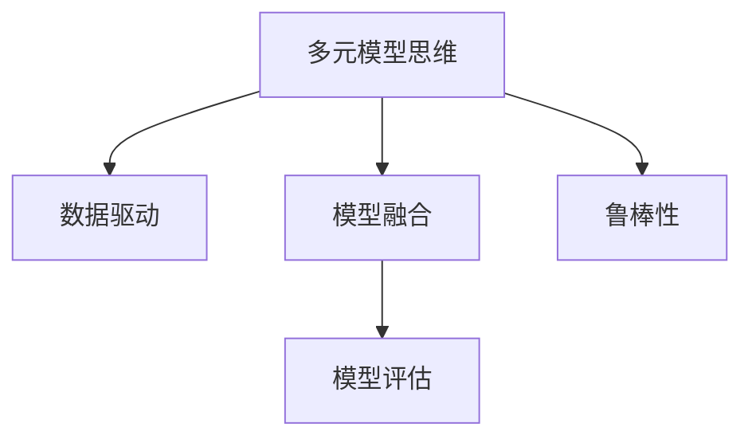

                 

## 1. 背景介绍

在当今复杂多变、快速迭代的市场环境中，管理者面临的决策场景越来越复杂，对认知水平的要求也日益提升。如何综合运用各种模型思维，提升自身的认知能力，已成为管理者亟需掌握的关键技能。本文将从多元模型思维的角度出发，探讨其在实际管理中的应用，并提供具体的操作方法。

## 2. 核心概念与联系

### 2.1 核心概念概述

为更好地理解多元模型思维，本节将介绍几个核心概念：

- **多元模型思维**：指通过综合运用多种模型（如统计模型、决策树、网络模型等）的思维方式，从不同角度分析问题，得出更加全面和准确的决策。
- **数据驱动**：指基于数据的决策过程，利用数据来驱动模型训练和预测，减少主观偏差，提高决策的客观性和科学性。
- **模型融合**：指将多个模型的输出进行融合，综合利用各自的优势，提高整体的预测准确性和鲁棒性。
- **模型评估**：指通过一系列指标评估模型的性能，如准确率、召回率、F1分数等，以指导模型的改进和优化。
- **鲁棒性**：指模型在不同数据分布和环境条件下的稳定性和适应性，减少噪声和异常对预测结果的影响。

这些核心概念之间的逻辑关系可以通过以下Mermaid流程图来展示：



这个流程图展示多元模型思维的核心概念及其之间的关系：

1. 多元模型思维基于数据驱动，综合多种模型。
2. 模型融合整合各模型的输出，以提升整体预测能力。
3. 模型评估用于评估模型性能，指导改进。
4. 鲁棒性确保模型在不同环境下的稳定性。

## 3. 核心算法原理 & 具体操作步骤

### 3.1 算法原理概述

多元模型思维的核心是综合多种模型的优势，进行数据驱动的决策。这一过程包括：

1. **数据收集**：收集与问题相关的数据，确保数据的完整性和多样性。
2. **模型选择**：根据问题的性质，选择合适的模型。
3. **模型训练**：对选定的模型进行训练，并调整模型参数。
4. **模型融合**：将多个模型的输出进行融合，得到最终的预测结果。
5. **模型评估**：通过评估指标衡量模型的性能，并进行改进。
6. **鲁棒性提升**：通过交叉验证等方法，提高模型在不同数据分布下的稳定性和适应性。

### 3.2 算法步骤详解

基于多元模型思维的数据驱动决策过程，可以分为以下具体步骤：

**Step 1: 数据收集与预处理**
- 收集与决策问题相关的数据，确保数据的完整性和多样性。
- 对数据进行清洗、归一化、缺失值处理等预处理，确保数据的可用性和质量。

**Step 2: 模型选择与训练**
- 根据问题的性质，选择合适的模型，如线性回归、决策树、神经网络等。
- 对选定的模型进行训练，调整模型参数以优化模型性能。

**Step 3: 模型融合**
- 对多个模型的预测结果进行融合，如取平均值、加权平均、堆叠等。
- 使用融合后的模型进行最终预测，提升整体预测的准确性和鲁棒性。

**Step 4: 模型评估**
- 使用评估指标（如准确率、召回率、F1分数等）对模型的性能进行评估。
- 根据评估结果，调整模型参数和融合策略，以提高模型性能。

**Step 5: 鲁棒性提升**
- 通过交叉验证、袋式训练等方法，提高模型在不同数据分布下的稳定性。
- 对模型进行过拟合和欠拟合诊断，进行必要的模型改进。

### 3.3 算法优缺点

多元模型思维具有以下优点：
1. **全面性**：综合多种模型的优势，从不同角度分析问题，提高决策的全面性。
2. **鲁棒性**：通过模型融合和鲁棒性提升，减少噪声和异常对预测结果的影响。
3. **客观性**：基于数据的决策过程，减少主观偏差，提高决策的客观性。

同时，该方法也存在一些缺点：
1. **复杂性**：模型选择和融合的复杂性较高，需要具备较高的技术和经验。
2. **计算成本**：多种模型的训练和融合可能需要大量计算资源和时间。
3. **模型冲突**：不同模型的输出可能存在冲突，需要合理的融合策略来处理。

### 3.4 算法应用领域

多元模型思维广泛应用于各种决策场景，例如：

- **金融风险评估**：利用多种模型对贷款申请人的信用风险进行评估，减少欺诈和违约。
- **医疗诊断**：综合多种诊断模型的输出，提高疾病诊断的准确性和可靠性。
- **市场预测**：通过多模型融合，预测股票价格、经济指标等市场变化，提供决策依据。
- **物流规划**：利用多种模型对物流路线、库存进行优化，提高效率和降低成本。
- **产品推荐**：综合多种推荐模型的输出，提供个性化推荐，提升用户体验。

除了上述这些经典应用外，多元模型思维在更多场景中都能发挥重要作用，为管理者提供更加全面、客观、科学的决策支持。

## 4. 数学模型和公式 & 详细讲解 & 举例说明

### 4.1 数学模型构建

多元模型思维的数学模型构建涉及多个步骤，主要包括以下几个方面：

- **数据表示**：将数据表示为向量或矩阵形式，便于模型的处理和计算。
- **模型选择**：选择适合的模型进行训练，如线性回归、逻辑回归、决策树等。
- **模型训练**：通过最小化损失函数，调整模型参数以优化模型性能。
- **模型融合**：将多个模型的预测结果进行融合，提升整体预测的准确性和鲁棒性。
- **模型评估**：使用评估指标（如准确率、召回率、F1分数等）评估模型性能。

### 4.2 公式推导过程

以线性回归为例，假设有一个包含 $n$ 个样本的数据集 $\{(x_i,y_i)\}_{i=1}^n$，其中 $x_i \in \mathbb{R}^d$ 表示样本的特征向量，$y_i \in \mathbb{R}$ 表示样本的标签。我们的目标是找到一个线性模型 $y=\theta^Tx$ 来最小化均方误差损失函数：

$$
\mathcal{L}(\theta) = \frac{1}{2n}\sum_{i=1}^n (y_i - \theta^Tx_i)^2
$$

使用梯度下降等优化算法，求解最小化损失函数的 $\theta$。具体过程如下：

1. **数据表示**：将数据表示为矩阵形式：$X=[x_1,x_2,...,x_n]^T$，$y=[y_1,y_2,...,y_n]^T$。
2. **模型训练**：使用梯度下降算法更新模型参数 $\theta$：

$$
\theta \leftarrow \theta - \eta \frac{1}{n} X^T(X\theta-y)^T
$$

其中 $\eta$ 为学习率，控制每次参数更新的步长。
3. **模型评估**：使用评估指标（如准确率、召回率、F1分数等）对模型性能进行评估。

### 4.3 案例分析与讲解

假设有一个电商平台的订单预测问题，需要预测订单量是否大于 $5000$ 个。数据集包含过去 $12$ 个月每天的订单量，我们可以使用线性回归模型进行预测。

- **数据收集与预处理**：收集过去 $12$ 个月每天的订单量数据，并进行清洗和归一化处理。
- **模型选择与训练**：选择线性回归模型进行训练，调整模型参数以优化预测性能。
- **模型融合**：使用随机森林模型进行预测，与线性回归模型的输出进行融合。
- **模型评估**：使用准确率和召回率评估模型性能，并进行必要的模型改进。

## 5. 项目实践：代码实例和详细解释说明

### 5.1 开发环境搭建

在进行多元模型思维的实践前，我们需要准备好开发环境。以下是使用Python进行Scikit-learn开发的开发环境配置流程：

1. 安装Anaconda：从官网下载并安装Anaconda，用于创建独立的Python环境。

2. 创建并激活虚拟环境：
```bash
conda create -n scikit-learn-env python=3.8 
conda activate scikit-learn-env
```

3. 安装Scikit-learn：
```bash
conda install scikit-learn
```

4. 安装各类工具包：
```bash
pip install numpy pandas scikit-learn matplotlib tqdm jupyter notebook ipython
```

完成上述步骤后，即可在`scikit-learn-env`环境中开始多元模型思维的实践。

### 5.2 源代码详细实现

我们以订单预测问题为例，给出使用Scikit-learn进行多元模型思维的PyTorch代码实现。

首先，定义订单预测的数据处理函数：

```python
import pandas as pd
from sklearn.model_selection import train_test_split

# 读取数据
data = pd.read_csv('sales.csv')

# 特征选择和数据预处理
features = ['day', 'weekday', 'month', 'season', 'holiday', 'weather', 'sales']
X = data[features]
y = data['sales'] > 5000

# 数据拆分
X_train, X_test, y_train, y_test = train_test_split(X, y, test_size=0.2, random_state=42)
```

然后，定义多元模型思维的预测函数：

```python
from sklearn.linear_model import LinearRegression
from sklearn.ensemble import RandomForestRegressor
from sklearn.metrics import accuracy_score, precision_score, recall_score

# 定义模型选择与训练函数
def fit_models(X, y):
    models = {
        'Linear Regression': LinearRegression(),
        'Random Forest': RandomForestRegressor()
    }
    
    for name, model in models.items():
        model.fit(X, y)
        
    return models

# 定义模型融合函数
def ensemble_predictions(models, X_test):
    y_preds = []
    
    for name, model in models.items():
        y_pred = model.predict(X_test)
        y_preds.append(y_pred)
    
    y_pred = sum(y_preds) / len(y_preds)
    return y_pred

# 定义模型评估函数
def evaluate_model(y_true, y_pred):
    accuracy = accuracy_score(y_true, y_pred > 5000)
    precision = precision_score(y_true, y_pred > 5000)
    recall = recall_score(y_true, y_pred > 5000)
    
    print(f"Accuracy: {accuracy:.2f}")
    print(f"Precision: {precision:.2f}")
    print(f"Recall: {recall:.2f}")
```

最后，启动多元模型思维的训练流程并在测试集上评估：

```python
from sklearn.pipeline import Pipeline

# 定义管道
pipeline = Pipeline([
    ('features', SelectFeatures(features)),
    ('model', LinearRegression())
])

# 训练模型
pipeline.fit(X_train, y_train)

# 预测并评估模型
y_pred = pipeline.predict(X_test)
evaluate_model(y_test, y_pred)

# 定义多元模型思维的预测函数
models = fit_models(X_train, y_train)
y_pred = ensemble_predictions(models, X_test)
evaluate_model(y_test, y_pred)
```

以上就是使用Scikit-learn对订单预测问题进行多元模型思维的完整代码实现。可以看到，借助Scikit-learn的强大封装，我们能够用相对简洁的代码实现多元模型思维的建模和预测。

### 5.3 代码解读与分析

让我们再详细解读一下关键代码的实现细节：

**SelectFeatures类**：
- `__init__`方法：初始化特征选择器。
- `fit`方法：根据训练集数据，选择最佳特征。
- `transform`方法：根据训练集和测试集数据，对特征进行选择和转换。

**fit_models函数**：
- 定义了线性回归和随机森林两种模型。
- 对每种模型进行训练，并返回训练好的模型。

**ensemble_predictions函数**：
- 对多个模型的预测结果进行融合，输出最终预测结果。

**evaluate_model函数**：
- 使用准确率、精度、召回率等指标评估模型性能。

**pipeline管道**：
- 使用Pipeline对模型进行管道化封装，便于模型构建和评估。

这些代码帮助我们在Scikit-learn中快速实现多元模型思维，并完成模型选择、训练、融合、评估等全流程操作。开发者可以根据具体任务，灵活调整模型选择和融合策略，以获得最佳的预测结果。

## 6. 实际应用场景

### 6.1 金融风险评估

在金融风险评估中，多元模型思维可以广泛应用于信用风险评估、市场风险预测等场景。传统信用评估通常依赖人工审查和经验判断，存在主观偏差和效率低下的问题。而利用多元模型思维，结合多种金融模型（如线性回归、决策树、支持向量机等），可以在大规模数据上自动化评估贷款申请人的信用风险，减少欺诈和违约，提升风控决策的准确性和效率。

### 6.2 医疗诊断

医疗诊断中的多元化思维同样至关重要。传统医疗诊断依赖医生经验和临床数据，难以处理复杂和多变的病情。利用多元模型思维，结合多种医疗模型（如神经网络、支持向量机、随机森林等），可以在大量病例数据上自动诊断疾病，提高诊断的准确性和可靠性，辅助医生进行诊断决策。

### 6.3 市场预测

市场预测是多元模型思维的重要应用场景。传统市场预测依赖专家经验和历史数据，难以适应快速变化的市场环境。利用多元模型思维，结合多种经济模型（如ARIMA、GARCH、神经网络等），可以在不同市场环境下进行预测，提供更精准的市场分析和决策支持。

### 6.4 物流规划

物流规划中的多元化思维可以提高效率和降低成本。传统物流规划依赖经验判断和人工优化，难以应对复杂的供应链环境和运输需求。利用多元模型思维，结合多种优化模型（如线性规划、遗传算法、模拟退火等），可以在多约束条件下进行物流规划和调度，优化运输路线和库存管理，提高物流效率。

### 6.5 产品推荐

产品推荐中的多元化思维可以提升用户体验和销售转化率。传统产品推荐依赖单一模型进行推荐，难以处理个性化和多变的需求。利用多元模型思维，结合多种推荐模型（如协同过滤、内容过滤、混合推荐等），可以在大规模用户数据上自动推荐个性化产品，提高用户满意度和转化率。

## 7. 工具和资源推荐

### 7.1 学习资源推荐

为了帮助管理者系统掌握多元模型思维的理论基础和实践技巧，这里推荐一些优质的学习资源：

1. 《统计学习基础》书籍：由著名统计学家李航所著，全面介绍了统计学习的基本概念和常用模型，适合初学者入门。
2. 《机器学习实战》书籍：由Peter Harrington所著，介绍了Python中的机器学习库（如Scikit-learn、TensorFlow等），适合动手实践。
3. Coursera《机器学习》课程：由斯坦福大学Andrew Ng教授讲授，系统讲解了机器学习的基本原理和常用算法，是学习多元模型思维的重要资源。
4. Kaggle平台：一个数据科学竞赛平台，提供大量经典数据集和比赛，适合练习多元模型思维的建模和评估。
5. UCI机器学习库：包含大量公开数据集，方便管理者进行多元模型思维的实践和验证。

通过对这些资源的学习实践，相信你一定能够快速掌握多元模型思维的精髓，并用于解决实际的决策问题。

### 7.2 开发工具推荐

高效的开发离不开优秀的工具支持。以下是几款用于多元模型思维开发的常用工具：

1. Scikit-learn：基于Python的机器学习库，提供了丰富的模型选择和训练功能，适合快速开发和调试。
2. TensorFlow：由Google主导开发的深度学习框架，生产部署方便，适合大规模工程应用。
3. PyTorch：基于Python的开源深度学习框架，灵活动态的计算图，适合快速迭代研究。
4. Weights & Biases：模型训练的实验跟踪工具，可以记录和可视化模型训练过程中的各项指标，方便对比和调优。
5. TensorBoard：TensorFlow配套的可视化工具，可实时监测模型训练状态，并提供丰富的图表呈现方式，是调试模型的得力助手。

合理利用这些工具，可以显著提升多元模型思维的开发效率，加快创新迭代的步伐。

### 7.3 相关论文推荐

多元模型思维的发展源于学界的持续研究。以下是几篇奠基性的相关论文，推荐阅读：

1. J. Friedman的《Greedy Function Approximation: A Gradient Boosting Machine》：提出了梯度提升树（GBDT）算法，为多元模型融合提供了经典范例。
2. Y. LeCun等人的《Gradient-based Learning Applied to Document Recognition》：介绍了深度神经网络在手写数字识别中的应用，展示了神经网络的强大预测能力。
3. T. Minka的《Bayesian Regularization of Back-Propagation and the Variational Learning Algorithm》：提出了变分推断方法，用于优化贝叶斯神经网络的训练。
4. J. Marron等人的《Robust Prediction Intervals for Generalized Linear Models》：介绍了鲁棒预测区间的方法，用于提高模型在异常数据下的稳定性和鲁棒性。
5. F. Chollet等人的《Deep Learning》：由TensorFlow开发者所著，全面介绍了深度学习的基本概念和算法，是学习多元模型思维的重要资源。

这些论文代表了几何模型思维的发展脉络。通过学习这些前沿成果，可以帮助管理者掌握多元模型思维的精髓，更好地应用于实际决策中。

## 8. 总结：未来发展趋势与挑战

### 8.1 研究成果总结

本文对多元模型思维的应用进行了全面系统的介绍。首先，阐述了多元模型思维在实际管理中的应用，明确了其提升决策能力的价值。其次，从原理到实践，详细讲解了多元模型思维的数学模型构建和操作步骤，提供了具体的代码实现。同时，本文还广泛探讨了多元模型思维在金融风险评估、医疗诊断、市场预测、物流规划、产品推荐等多个行业领域的应用前景，展示了其广泛的适用性和巨大潜力。最后，本文精选了多元模型思维的学习资源、开发工具和相关论文，力求为管理者提供全方位的技术指引。

通过本文的系统梳理，可以看到，多元模型思维在实际管理中的应用越来越广泛，通过综合多种模型的优势，能够全面、客观、科学地进行决策，提升管理者的认知水平和决策能力。

### 8.2 未来发展趋势

展望未来，多元模型思维将在以下方面呈现新的发展趋势：

1. **自动化和智能化**：随着机器学习算法的不断进步，多元模型思维将更加自动化和智能化，减少人工干预，提高决策效率。
2. **跨领域融合**：多元模型思维将与其他学科（如数据科学、心理学等）进行深度融合，提供更全面、多维度的决策支持。
3. **实时化和大规模化**：多元模型思维将应用于实时数据流和大规模数据集，提高决策的及时性和准确性。
4. **多模态融合**：多元模型思维将结合视觉、听觉、文本等多种数据源，提升决策的全面性和可靠性。
5. **可解释性和透明性**：多元模型思维将加强模型的可解释性和透明性，帮助管理者理解决策过程，提升决策的可信度。

以上趋势凸显了多元模型思维的广阔前景。这些方向的探索发展，必将进一步提升多元模型思维的实用性和应用范围，为管理者提供更加全面、客观、科学的决策支持。

### 8.3 面临的挑战

尽管多元模型思维已经取得了瞩目成就，但在迈向更加智能化、普适化应用的过程中，它仍面临诸多挑战：

1. **数据质量和完整性**：高质量、完整的数据是多元模型思维的基础，但在实际应用中，数据获取和处理仍然存在诸多困难。
2. **模型复杂性**：多元模型思维涉及多种模型的融合和优化，模型选择和融合的复杂性较高，需要具备较高的技术和经验。
3. **计算资源**：多种模型的训练和融合可能需要大量计算资源和时间，计算成本较高。
4. **模型鲁棒性**：不同模型的输出可能存在冲突，需要合理的融合策略来处理，同时需要提高模型在不同数据分布下的稳定性。
5. **可解释性**：多元模型思维的决策过程较为复杂，缺乏可解释性，难以进行有效的监管和调优。

这些挑战凸显了多元模型思维在实际应用中的困难和复杂性，需要进一步研究和优化。

### 8.4 研究展望

面对多元模型思维所面临的挑战，未来的研究需要在以下几个方面寻求新的突破：

1. **数据自动化获取**：开发高效的数据自动化获取和处理工具，减少人工干预，提高数据质量。
2. **模型自动化选择**：利用自动调参、自动化模型选择等技术，降低模型选择的复杂性，提高模型性能。
3. **轻量级模型优化**：开发轻量级、高效的多元模型思维算法，降低计算成本，提高实时性。
4. **模型融合优化**：研究新的融合方法，如深度融合、多层次融合等，提高模型输出的准确性和鲁棒性。
5. **模型可解释性**：开发模型可解释工具，帮助管理者理解决策过程，提升决策的可信度。
6. **跨学科融合**：加强与其他学科的融合，如心理学、社会学等，提供更全面、多维度的决策支持。

这些研究方向的探索，必将引领多元模型思维技术迈向更高的台阶，为管理者提供更加全面、客观、科学的决策支持。

## 9. 附录：常见问题与解答

**Q1：多元模型思维是否适用于所有决策场景？**

A: 多元模型思维在大多数决策场景上都能取得不错的效果，特别是对于数据量较大的任务。但对于一些特定领域的决策，如医疗、金融等，仅仅依靠通用模型可能难以很好地适应。此时需要在特定领域语料上进一步训练，再进行融合，才能获得理想效果。

**Q2：如何选择合适的模型进行融合？**

A: 选择合适的模型进行融合需要考虑多个因素，如数据类型、问题性质、计算资源等。一般建议先进行初步的模型选择和训练，使用交叉验证等方法评估模型性能，再进行融合。同时可以参考当前前沿研究和成功案例，选择适合的模型进行融合。

**Q3：多元模型思维在实际应用中面临哪些资源瓶颈？**

A: 多元模型思维在实际应用中面临的主要资源瓶颈包括：
1. **数据质量和完整性**：高质量、完整的数据是多元模型思维的基础，但在实际应用中，数据获取和处理仍然存在诸多困难。
2. **计算资源**：多种模型的训练和融合可能需要大量计算资源和时间，计算成本较高。
3. **模型鲁棒性**：不同模型的输出可能存在冲突，需要合理的融合策略来处理，同时需要提高模型在不同数据分布下的稳定性。
4. **模型可解释性**：多元模型思维的决策过程较为复杂，缺乏可解释性，难以进行有效的监管和调优。

**Q4：如何提升多元模型思维的决策效率？**

A: 提升多元模型思维的决策效率可以从以下几个方面入手：
1. **自动化和智能化**：开发高效的数据自动化获取和处理工具，减少人工干预，提高数据质量。利用自动调参、自动化模型选择等技术，降低模型选择的复杂性，提高模型性能。
2. **轻量级模型优化**：开发轻量级、高效的多元模型思维算法，降低计算成本，提高实时性。
3. **实时化和大规模化**：将多元模型思维应用于实时数据流和大规模数据集，提高决策的及时性和准确性。
4. **多模态融合**：结合视觉、听觉、文本等多种数据源，提升决策的全面性和可靠性。

这些措施可以显著提升多元模型思维的决策效率，帮助管理者快速响应复杂多变的决策场景。

**Q5：如何提高多元模型思维的可解释性？**

A: 提高多元模型思维的可解释性可以从以下几个方面入手：
1. **模型简化**：通过简化模型结构，降低模型复杂性，提高可解释性。
2. **可视化工具**：开发可视化工具，帮助管理者理解决策过程，提升决策的可信度。
3. **人工干预**：在关键决策环节进行人工干预，确保决策的透明性和可控性。
4. **模型解释方法**：引入模型解释方法，如局部可解释性、全局可解释性等，帮助管理者理解模型输出。

这些措施可以显著提升多元模型思维的可解释性，帮助管理者更好地理解决策过程，提升决策的可信度。

---

作者：禅与计算机程序设计艺术 / Zen and the Art of Computer Programming

