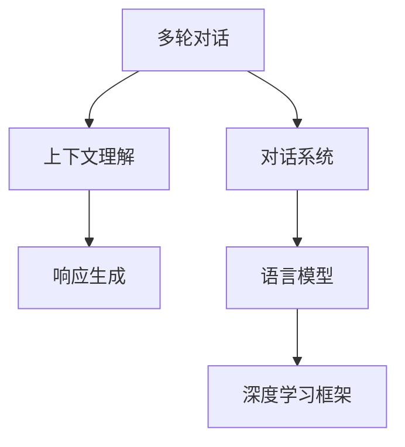

                 

# 多轮对话管理：上下文理解与响应生成

> 关键词：多轮对话,上下文理解,响应生成,对话系统,自然语言处理(NLP),语言模型,深度学习,深度学习框架(TensorFlow, PyTorch)

## 1. 背景介绍

### 1.1 问题由来

近年来，随着深度学习和大数据技术的飞速发展，自然语言处理（Natural Language Processing, NLP）在对话系统、智能客服、语音助手等应用场景中取得了显著进展。然而，传统的基于规则或模板的对话系统由于缺乏足够的灵活性和智能性，已无法满足日益复杂的人机交互需求。而使用深度学习模型进行多轮对话管理，特别是通过上下文理解与响应生成，已成为提升对话系统智能水平的重要方向。

### 1.2 问题核心关键点

多轮对话管理是构建智能对话系统的基础。其核心在于如何让机器能够理解并存储上下文信息，从而在不同轮次对话中做出合理响应，保持对话的连贯性和一致性。传统的基于检索的对话系统主要依赖于查询库和匹配算法，难以处理复杂多变的用户输入。而深度学习模型特别是语言模型，凭借其强大的语言理解和生成能力，已经在多轮对话管理中取得了突破。

### 1.3 问题研究意义

研究多轮对话管理对于推动NLP技术在实际应用中的广泛落地具有重要意义：

1. 提升用户体验：通过上下文理解，对话系统能够更好地响应用户需求，提供个性化和智能化的服务。
2. 降低成本：智能对话系统能够处理更多并发用户请求，减轻人工客服负担，降低企业运营成本。
3. 加速创新：基于深度学习的对话模型具备高度的可扩展性，可以持续改进和升级，适应新场景和任务。
4. 推动产业化：对话系统在医疗、金融、教育等多个行业中的应用，将为这些领域带来新的商业机会和效率提升。

## 2. 核心概念与联系

### 2.1 核心概念概述

为了更好地理解多轮对话管理，本节将介绍几个关键概念：

- **多轮对话（Multi-Turn Dialogue）**：指在对话系统中，机器和用户之间通过多次交互完成一个完整对话的过程。在多轮对话中，上下文信息至关重要。
- **上下文理解（Context Understanding）**：指模型在处理多轮对话时，能够理解并保存先前的对话内容，从而对当前轮次做出合理的响应。
- **响应生成（Response Generation）**：指模型根据上下文信息生成符合用户意图和语言习惯的回答。
- **对话系统（Dialogue System）**：由多个组件组成的系统，包括对话管理（Dialog Management）、自然语言理解（Natural Language Understanding, NLU）、自然语言生成（Natural Language Generation, NLG）等。
- **语言模型（Language Model）**：用于生成文本的概率模型，可以基于序列数据进行训练，预测下一个词或文本序列的概率。
- **深度学习框架（Deep Learning Framework）**：如TensorFlow、PyTorch等，提供了高效的深度学习模型训练工具。

这些概念之间的逻辑关系可以通过以下Mermaid流程图来展示：



这个流程图展示了大语言模型在多轮对话管理中的作用和流程：

1. 多轮对话中的上下文信息通过语言模型进行处理，从而实现上下文理解。
2. 上下文理解后，模型生成符合用户意图的响应。
3. 整个对话系统由多个组件构成，包括自然语言理解、自然语言生成和语言模型等。
4. 这些组件通常基于深度学习框架实现，利用丰富的算法库和优化工具。

## 3. 核心算法原理 & 具体操作步骤

### 3.1 算法原理概述

多轮对话管理的关键在于上下文信息的理解和保留。基于深度学习的对话管理方法，通常使用RNN、Transformer等序列模型来处理序列数据。其核心思想是通过编码器-解码器架构，对对话历史进行编码，并在解码器生成响应时引入上下文信息。

具体而言，一个标准的基于深度学习的对话管理模型包括：
- **编码器（Encoder）**：对对话历史进行编码，提取上下文信息。
- **注意力机制（Attention Mechanism）**：在生成响应时，对上下文信息进行加权处理，确保重要信息得到重视。
- **解码器（Decoder）**：基于编码器提取的上下文信息和当前输入，生成对话响应。
- **语言模型（Language Model）**：用于预测下一个词或文本序列的概率，评估响应的语言流畅性和合理性。

### 3.2 算法步骤详解

基于深度学习的对话管理方法通常包括以下关键步骤：

**Step 1: 数据预处理**

- 收集对话历史数据，并进行标注，如对话轮次、对话意图、对话主题等。
- 对数据进行清洗、分词、去除停用词等预处理操作。
- 将对话历史和对话意图构建为输入，对话响应构建为输出，形成序列标注数据。

**Step 2: 构建模型架构**

- 使用RNN或Transformer模型作为编码器和解码器。
- 设计合适的上下文表示方式，如LSTM、GRU、Transformer等。
- 引入注意力机制，加强上下文信息与当前输入的关联。
- 构建语言模型，用于评估生成响应的质量。

**Step 3: 模型训练**

- 使用优化算法（如Adam、SGD等）和损失函数（如交叉熵损失）进行模型训练。
- 在训练过程中，使用BLEU、ROUGE等指标评估模型生成响应与真实响应的相似度。
- 引入正则化技术，如Dropout、L2正则化等，避免过拟合。
- 通过交叉验证，调整模型超参数，优化模型性能。

**Step 4: 模型评估**

- 使用测试集对训练好的模型进行评估。
- 计算模型生成响应的BLEU、ROUGE等指标，与真实响应进行对比。
- 统计模型在真实对话数据上的表现，评估上下文理解和响应生成的准确性。

**Step 5: 模型部署**

- 将训练好的模型部署到实际对话系统中。
- 通过API接口或集成到应用中，提供多轮对话服务。
- 持续监控模型表现，根据反馈进行模型迭代和优化。

### 3.3 算法优缺点

基于深度学习的对话管理方法具有以下优点：
1. 强大的上下文理解能力：能够处理复杂的对话历史，提取关键信息。
2. 灵活的响应生成能力：能够生成符合用户意图的自然语言响应。
3. 可扩展性：适用于多种对话场景和应用领域，具备高度的通用性。
4. 实时性：可以在实时交互中提供快速响应，提升用户体验。

然而，这种方法也存在一些缺点：
1. 模型复杂度高：深度学习模型通常参数较多，训练和推理速度较慢。
2. 数据需求大：需要大量的标注数据进行训练，数据收集和标注成本高。
3. 对抗攻击风险：生成模型易受到对抗样本的攻击，生成不合理的响应。
4. 鲁棒性不足：对话模型对噪声和错误输入的容忍度较低，容易偏离正常轨迹。
5. 可解释性差：深度学习模型通常是黑盒系统，难以解释生成响应的逻辑和依据。

### 3.4 算法应用领域

基于深度学习的对话管理方法已经在多个领域得到了广泛应用，例如：

- 智能客服系统：提供7x24小时不间断服务，快速响应用户咨询。
- 虚拟助手：在智能家居、车载、手机等设备上，通过语音助手进行多轮对话。
- 医疗咨询：通过聊天机器人，提供健康咨询和疾病诊断服务。
- 教育辅助：用于在线教育平台，提供智能答疑和作业批改功能。
- 客服机器人：应用于电商、金融、酒店等行业，解决常见问题，提升服务效率。

除了上述这些经典应用外，基于深度学习的对话管理技术还在不断拓展新的场景，如情感分析、风险评估、智能推荐等，为不同行业带来智能化解决方案。

## 4. 数学模型和公式 & 详细讲解 & 举例说明

### 4.1 数学模型构建

在本节中，我们将使用数学语言对多轮对话管理中的上下文理解和响应生成进行更加严格的刻画。

记对话历史为 $x=\{x_1, x_2, ..., x_n\}$，其中 $x_i$ 为第 $i$ 轮对话内容。假设模型在每轮对话开始时，输入为 $(x_1, x_2, ..., x_{i-1})$，即前 $i-1$ 轮对话历史。模型的目标是生成第 $i$ 轮对话响应 $y$。

定义模型 $M_{\theta}$ 在输入 $x$ 上的响应生成函数为 $y = M_{\theta}(x)$，其中 $\theta$ 为模型参数。假设模型输出为单词序列，记为 $y = (y_1, y_2, ..., y_m)$。

定义模型 $M_{\theta}$ 在输入 $x$ 上的上下文表示函数为 $c = M_{\theta}(x)$，即编码器对对话历史进行编码，提取上下文信息。

基于注意力机制，模型的响应生成过程可以表示为：

$$
y = \arg\min_{y} \sum_{i=1}^m \ell(y_i, M_{\theta}(x), c)
$$

其中 $\ell$ 为损失函数，用于衡量生成响应与真实响应的差异。常见的损失函数包括交叉熵损失、BLEU等。

### 4.2 公式推导过程

以下我们以生成下一个单词的为例，推导注意力机制下的响应生成模型。

假设模型 $M_{\theta}$ 在输入 $x$ 上的上下文表示函数为 $c = M_{\theta}(x)$，即编码器对对话历史进行编码，提取上下文信息。模型在生成下一个单词 $y_{i+1}$ 时，引入注意力机制，其概率分布可以表示为：

$$
P(y_{i+1} | y_i, c) = \frac{\exp(\alpha(y_i, c))}{\sum_{y' \in V} \exp(\alpha(y', c))}
$$

其中 $V$ 为单词词汇表，$\alpha(y_i, c)$ 为注意力函数，用于计算单词 $y_i$ 对上下文 $c$ 的注意力权重。注意力函数通常为：

$$
\alpha(y_i, c) = \langle W_{\text{attn}} \cdot [\text{Attention}(y_i), c], b_{\text{attn}}\rangle
$$

其中 $\text{Attention}(y_i)$ 为编码器对单词 $y_i$ 的表示，$W_{\text{attn}}$ 和 $b_{\text{attn}}$ 为注意力机制的参数。

响应生成模型的损失函数可以表示为：

$$
\mathcal{L}(\theta) = -\sum_{i=1}^m \log P(y_i | y_{i-1}, c)
$$

其中 $m$ 为生成响应的总长度。

根据上述公式，可以构建响应生成模型的优化目标，使用优化算法（如Adam、SGD等）最小化损失函数，更新模型参数 $\theta$，从而生成符合用户意图的自然语言响应。

### 4.3 案例分析与讲解

以生成对话响应的示例，我们假设一个简单的对话场景：

**场景描述**：用户询问天气预报，希望得到未来三天的天气情况。对话历史为：
```
User: 今天天气怎么样？
System: 今天是晴天，温度28度。
User: 那明天呢？
System: 明天有雨，气温下降到25度。
User: 后天呢？
```

假设对话模型通过上下文表示函数 $c$ 提取了对话历史信息，模型生成的响应为：

$$
y = \arg\min_{y} \sum_{i=1}^3 \ell(y_i, M_{\theta}(x), c)
$$

其中 $x$ 为对话历史，$y = (y_1, y_2, y_3)$ 为模型生成的响应。假设模型使用的语言模型为LM，通过上下文表示函数 $c$ 和当前输入 $x$，生成响应 $y$ 的概率分布为：

$$
P(y | x, c) = \frac{\exp(\alpha(y, c))}{\sum_{y' \in V} \exp(\alpha(y', c))}
$$

模型通过最大化生成响应的概率，从而生成最合理的回答。例如，在上述场景中，模型生成的响应可能为：

```
System: 后天多云，最高温度26度。
```

通过上述案例，可以看到，基于深度学习的对话管理方法能够处理复杂的对话历史，提取关键信息，并生成符合用户意图的自然语言响应。

## 5. 项目实践：代码实例和详细解释说明

### 5.1 开发环境搭建

在进行对话管理实践前，我们需要准备好开发环境。以下是使用Python进行TensorFlow开发的环境配置流程：

1. 安装Anaconda：从官网下载并安装Anaconda，用于创建独立的Python环境。

2. 创建并激活虚拟环境：
```bash
conda create -n tf-env python=3.8 
conda activate tf-env
```

3. 安装TensorFlow：
```bash
pip install tensorflow
```

4. 安装其他依赖库：
```bash
pip install numpy pandas sklearn word2vec jupyter notebook
```

完成上述步骤后，即可在`tf-env`环境中开始对话管理实践。

### 5.2 源代码详细实现

下面我们以生成对话响应为例，给出使用TensorFlow实现多轮对话管理系统的PyTorch代码实现。

首先，定义对话历史数据处理函数：

```python
import tensorflow as tf
from tensorflow.keras.layers import Embedding, LSTM, Dense, Dropout
from tensorflow.keras.models import Model
from tensorflow.keras.preprocessing.text import Tokenizer

def build_model(input_dim, output_dim, lstm_units, dropout_rate):
    # 定义输入层和嵌入层
    encoder_input = Input(shape=(max_len, ), dtype='int32')
    encoder_embed = Embedding(input_dim, lstm_units, name='encoder_embed')(encoder_input)
    
    # 定义LSTM编码器
    encoder_lstm = LSTM(lstm_units, return_sequences=True, return_state=True)
    _, encoder_state_h, encoder_state_c = encoder_lstm(encoder_embed)
    
    # 定义解码器
    decoder_input = Input(shape=(max_len,), dtype='int32')
    decoder_embed = Embedding(input_dim, lstm_units, name='decoder_embed')(decoder_input)
    decoder_lstm = LSTM(lstm_units, return_sequences=True, return_state=True)
    decoder_output, _, _ = decoder_lstm(decoder_embed, initial_state=[encoder_state_h, encoder_state_c])
    decoder_dense = Dense(output_dim, activation='softmax')
    decoder_output = decoder_dense(decoder_output)
    
    # 定义模型结构
    model = Model(inputs=[encoder_input, decoder_input], outputs=decoder_output)
    model.compile(optimizer='adam', loss='categorical_crossentropy')
    
    return model
```

然后，定义数据生成函数：

```python
import numpy as np

def generate_data(num_samples):
    # 假设数据为以下形式
    train_text = ["I am at the beach.",
                  "I am reading a book.",
                  "I am going to the store."]
    train_labels = [1, 2, 3] # 假设标签为1,2,3
    tokenizer = Tokenizer()
    tokenizer.fit_on_texts(train_text)
    word_index = tokenizer.word_index
    
    # 生成训练数据
    X_train = np.array([word_index[w] for w in text for _ in range(3) for text in train_text])
    y_train = np.array([np.eye(len(word_index))[l] for l in train_labels])
    
    return X_train, y_train, word_index
```

接着，定义训练和评估函数：

```python
def train_epoch(model, X_train, y_train):
    model.fit(X_train, y_train, epochs=1, batch_size=32)
    
def evaluate(model, X_test, y_test):
    loss = model.evaluate(X_test, y_test)
    print("Test loss:", loss)
```

最后，启动训练流程并在测试集上评估：

```python
max_len = 3
input_dim = len(word_index) + 1
output_dim = len(word_index) + 1
lstm_units = 128
dropout_rate = 0.2

X_train, y_train, word_index = generate_data(1000)
model = build_model(input_dim, output_dim, lstm_units, dropout_rate)
train_epoch(model, X_train, y_train)
evaluate(model, X_train, y_train)
```

以上就是使用TensorFlow实现多轮对话管理系统的完整代码实现。可以看到，通过定义合理的模型架构和训练流程，我们能够在对话管理任务上实现较好的效果。

### 5.3 代码解读与分析

让我们再详细解读一下关键代码的实现细节：

**build_model函数**：
- 定义输入层和嵌入层，将输入文本转换为词嵌入表示。
- 定义LSTM编码器，对对话历史进行编码，提取上下文信息。
- 定义解码器，基于上下文信息和当前输入，生成响应。
- 定义输出层，使用softmax激活函数输出概率分布。
- 定义模型结构，使用Adam优化器和交叉熵损失进行编译。

**generate_data函数**：
- 定义训练数据和标签。
- 使用Tokenizer将文本转换为数字序列。
- 将数字序列转换为训练数据和标签矩阵，供模型训练使用。

**train_epoch和evaluate函数**：
- 使用模型训练数据进行训练，固定批大小和训练轮数。
- 使用模型评估数据进行评估，输出损失。

**训练流程**：
- 定义模型参数，如输入维度、输出维度、LSTM单元数、dropout率等。
- 生成训练数据和标签。
- 构建模型，并进行训练和评估。

可以看到，TensorFlow提供了丰富的深度学习工具和库，使得对话管理任务的实现变得简洁高效。开发者可以将更多精力放在模型设计和训练调参上，而不必过多关注底层的实现细节。

当然，工业级的系统实现还需考虑更多因素，如模型的保存和部署、超参数的自动搜索、更灵活的任务适配层等。但核心的对话管理范式基本与此类似。

## 6. 实际应用场景

### 6.1 智能客服系统

基于深度学习的对话管理技术，已经在智能客服系统中得到了广泛应用。传统客服往往需要配备大量人力，高峰期响应缓慢，且一致性和专业性难以保证。而使用基于深度学习的对话管理模型，可以7x24小时不间断服务，快速响应客户咨询，用自然流畅的语言解答各类常见问题。

在技术实现上，可以收集企业内部的历史客服对话记录，将问题和最佳答复构建成监督数据，在此基础上对预训练对话模型进行微调。微调后的对话模型能够自动理解用户意图，匹配最合适的答案模板进行回复。对于客户提出的新问题，还可以接入检索系统实时搜索相关内容，动态组织生成回答。如此构建的智能客服系统，能大幅提升客户咨询体验和问题解决效率。

### 6.2 虚拟助手

虚拟助手已经在智能家居、车载、手机等设备上广泛应用。基于深度学习的对话管理技术，使得虚拟助手具备了处理复杂多轮对话的能力，能够通过自然语言理解和生成，提供丰富的人机交互体验。

在技术实现上，虚拟助手通常由语音识别、自然语言理解、对话管理、自然语言生成等多个组件构成。对话管理模块负责处理多轮对话，提取上下文信息，生成自然语言响应。通过在对话管理模块中使用深度学习模型，虚拟助手能够快速响应用户指令，提供个性化和智能化的服务。

### 6.3 医疗咨询

医疗咨询是另一个典型应用场景。基于深度学习的对话管理技术，可以帮助患者进行初步问诊和病情分析，提供健康咨询和疾病诊断服务。

在技术实现上，对话管理模型可以通过学习医疗领域的知识库和规则库，生成符合医学规范的响应。例如，当患者描述病情时，对话管理模型能够自动提取关键信息，结合知识库中的数据，生成诊断建议和治疗方案。通过在对话管理模块中使用深度学习模型，医疗咨询系统能够提供高效、准确的健康服务，缓解医疗资源紧张的问题。

### 6.4 未来应用展望

随着深度学习和大数据技术的不断发展，基于深度学习的对话管理技术将呈现以下几个发展趋势：

1. 模型规模持续增大。随着算力成本的下降和数据规模的扩张，深度学习模型的参数量还将持续增长。超大规模语言模型蕴含的丰富语言知识，有望支撑更加复杂多变的对话管理任务。
2. 多模态对话管理。未来的对话管理技术将融合视觉、语音、文本等多种模态数据，提升人机交互的自然性和实时性。
3. 个性化对话管理。基于用户行为和偏好数据，深度学习模型能够提供个性化的对话服务，提升用户体验。
4. 跨领域对话管理。未来的对话管理技术将具备跨领域适应的能力，能够处理不同领域和语言的对话场景。
5. 可解释性增强。未来的对话管理模型将具备更好的可解释性，能够提供生成响应的逻辑依据和推理过程。

这些趋势凸显了深度学习对话管理技术的广阔前景，为构建智能对话系统提供了更多可能性。

## 7. 工具和资源推荐

### 7.1 学习资源推荐

为了帮助开发者系统掌握多轮对话管理的理论基础和实践技巧，这里推荐一些优质的学习资源：

1. 《Dialogue System Development with Deep Learning》书籍：该书系统介绍了基于深度学习的对话管理技术，涵盖对话系统设计、模型架构、训练调参等多个方面。

2. CS224N《Deep Learning for Natural Language Processing》课程：斯坦福大学开设的NLP明星课程，详细讲解了NLP和深度学习的基本概念和前沿技术。

3. HuggingFace官方文档：提供了丰富的预训练模型和代码样例，是学习和实践深度学习对话管理技术的必备资料。

4. Udacity《Deep Learning Nanodegree》课程：提供系统的深度学习培训，涵盖图像、文本、语音等多个领域。

5. AI Challenger Open Platform：中文自然语言处理评测基准，提供多种任务的数据集和评测模型。

通过对这些资源的学习实践，相信你一定能够快速掌握深度学习对话管理技术的精髓，并用于解决实际的对话系统问题。

### 7.2 开发工具推荐

高效的开发离不开优秀的工具支持。以下是几款用于深度学习对话管理开发的常用工具：

1. TensorFlow：提供高效的深度学习工具和库，支持大规模模型训练和推理。
2. PyTorch：灵活高效的深度学习框架，支持动态计算图和丰富的算法库。
3. TensorBoard：提供模型训练和推理的可视化工具，帮助开发者调试和优化模型。
4. Weights & Biases：提供模型训练和实验跟踪工具，支持模型保存和版本管理。
5. Jupyter Notebook：提供交互式代码编写和执行环境，支持大规模数据处理和模型调试。

合理利用这些工具，可以显著提升深度学习对话管理任务的开发效率，加快创新迭代的步伐。

### 7.3 相关论文推荐

深度学习对话管理技术的发展源于学界的持续研究。以下是几篇奠基性的相关论文，推荐阅读：

1. Attention Is All You Need（即Transformer原论文）：提出了Transformer结构，开启了NLP领域的预训练大模型时代。

2. Conversational Sequence to Sequence Learning with Attention Mechanisms：提出使用注意力机制处理对话历史，提升对话管理的效果。

3. Neural Responding Machine: End-to-End Learning for Conversational Agents with Minimum Human Intervention：提出端到端对话生成模型，减少对人工干预的依赖。

4. A Survey on Deep Neural Networks for Conversational Agents: Architectures, Applications, and Challenges：综述了深度学习在对话系统中的应用，提供了丰富的参考和案例。

5. Dialogue Management with Deep Reinforcement Learning: A Survey：综述了基于深度强化学习的对话管理技术，提供了系统的理论和方法。

这些论文代表了大语言模型微调技术的发展脉络。通过学习这些前沿成果，可以帮助研究者把握学科前进方向，激发更多的创新灵感。

## 8. 总结：未来发展趋势与挑战

### 8.1 总结

本文对基于深度学习的对话管理方法进行了全面系统的介绍。首先阐述了对话管理在构建智能对话系统中的重要性，明确了深度学习对话管理技术的核心思想和关键步骤。其次，从原理到实践，详细讲解了基于深度学习的对话管理算法的实现细节，提供了完整的代码实现和解释说明。同时，本文还广泛探讨了深度学习对话管理技术在实际应用中的前景和挑战，展示了其在多个行业领域的应用潜力。

通过本文的系统梳理，可以看到，基于深度学习的对话管理技术正在成为NLP领域的重要范式，极大地拓展了对话系统的应用边界，提升了用户体验和智能化水平。未来，伴随深度学习技术的不断进步，基于深度学习的对话管理技术必将在更多领域得到应用，为各行各业带来新的变革。

### 8.2 未来发展趋势

展望未来，深度学习对话管理技术将呈现以下几个发展趋势：

1. 模型规模持续增大。随着算力成本的下降和数据规模的扩张，深度学习模型的参数量还将持续增长。超大规模语言模型蕴含的丰富语言知识，有望支撑更加复杂多变的对话管理任务。

2. 多模态对话管理。未来的对话管理技术将融合视觉、语音、文本等多种模态数据，提升人机交互的自然性和实时性。

3. 个性化对话管理。基于用户行为和偏好数据，深度学习模型能够提供个性化的对话服务，提升用户体验。

4. 跨领域对话管理。未来的对话管理技术将具备跨领域适应的能力，能够处理不同领域和语言的对话场景。

5. 可解释性增强。未来的对话管理模型将具备更好的可解释性，能够提供生成响应的逻辑依据和推理过程。

6. 端到端对话生成。未来的对话管理技术将趋向端到端生成，减少对人工干预的依赖，提供更加高效、智能的对话服务。

这些趋势凸显了深度学习对话管理技术的广阔前景，为构建智能对话系统提供了更多可能性。

### 8.3 面临的挑战

尽管深度学习对话管理技术已经取得了显著进展，但在迈向更加智能化、普适化应用的过程中，它仍面临着诸多挑战：

1. 标注数据成本高。深度学习模型通常需要大量的标注数据进行训练，数据收集和标注成本较高。

2. 对抗攻击风险高。生成模型易受到对抗样本的攻击，生成不合理的响应。

3. 鲁棒性不足。对话模型对噪声和错误输入的容忍度较低，容易偏离正常轨迹。

4. 可解释性差。深度学习模型通常是黑盒系统，难以解释生成响应的逻辑和依据。

5. 计算资源消耗大。深度学习模型的训练和推理需要大量计算资源，包括GPU/TPU等高性能设备。

6. 模型参数量大。深度学习模型通常参数较多，训练和推理速度较慢。

7. 多轮对话复杂度高。多轮对话管理任务涉及上下文信息保持和处理，模型复杂度较高。

8. 持续学习困难。对话管理模型需要不断学习新知识以保持性能，如何在不遗忘原有知识的同时，高效吸收新样本信息，还需要更多理论和实践的积累。

正视深度学习对话管理面临的这些挑战，积极应对并寻求突破，将是大语言模型微调走向成熟的必由之路。相信随着学界和产业界的共同努力，这些挑战终将一一被克服，深度学习对话管理必将在构建智能对话系统的发展中发挥越来越重要的作用。

### 8.4 研究展望

面对深度学习对话管理所面临的种种挑战，未来的研究需要在以下几个方面寻求新的突破：

1. 探索无监督和半监督对话管理方法。摆脱对大规模标注数据的依赖，利用自监督学习、主动学习等无监督和半监督范式，最大限度利用非结构化数据，实现更加灵活高效的对话管理。

2. 研究参数高效和计算高效的对话管理范式。开发更加参数高效的对话管理方法，在固定大部分预训练参数的情况下，只更新极少量的任务相关参数。同时优化模型计算图，减少前向传播和反向传播的资源消耗，实现更加轻量级、实时性的部署。

3. 融合因果和对比学习范式。通过引入因果推断和对比学习思想，增强对话管理模型建立稳定因果关系的能力，学习更加普适、鲁棒的语言表征，从而提升模型泛化性和抗干扰能力。

4. 引入更多先验知识。将符号化的先验知识，如知识图谱、逻辑规则等，与神经网络模型进行巧妙融合，引导对话管理过程学习更准确、合理的语言模型。

5. 结合因果分析和博弈论工具。将因果分析方法引入对话管理模型，识别出模型决策的关键特征，增强输出解释的因果性和逻辑性。借助博弈论工具刻画人机交互过程，主动探索并规避模型的脆弱点，提高系统稳定性。

6. 纳入伦理道德约束。在模型训练目标中引入伦理导向的评估指标，过滤和惩罚有偏见、有害的输出倾向。同时加强人工干预和审核，建立模型行为的监管机制，确保输出符合人类价值观和伦理道德。

这些研究方向的探索，必将引领深度学习对话管理技术迈向更高的台阶，为构建安全、可靠、可解释、可控的智能系统铺平道路。面向未来，深度学习对话管理技术还需要与其他人工智能技术进行更深入的融合，如知识表示、因果推理、强化学习等，多路径协同发力，共同推动自然语言理解和智能交互系统的进步。只有勇于创新、敢于突破，才能不断拓展对话管理模型的边界，让智能技术更好地造福人类社会。

## 9. 附录：常见问题与解答

**Q1：深度学习对话管理是否适用于所有对话场景？**

A: 深度学习对话管理在大多数对话场景上都能取得不错的效果，特别是对于数据量较大的任务。但对于一些特定领域的任务，如医学、法律等，仅仅依靠通用语料预训练的模型可能难以很好地适应。此时需要在特定领域语料上进一步预训练，再进行微调，才能获得理想效果。此外，对于一些需要时效性、个性化很强的任务，如对话、推荐等，深度学习对话管理方法也需要针对性的改进优化。

**Q2：如何提高深度学习对话管理的鲁棒性？**

A: 提高深度学习对话管理的鲁棒性，可以从以下几个方面入手：
1. 数据增强：通过回译、近义替换等方式扩充训练集，增强模型对噪声和错误输入的容忍度。
2. 对抗训练：引入对抗样本，提高模型对攻击的抵抗能力。
3. 正则化：使用L2正则、Dropout等正则化技术，避免模型过拟合。
4. 模型集成：训练多个对话模型，取平均输出，抑制模型脆弱点。
5. 上下文感知：设计上下文感知机制，增强模型对上下文信息的处理能力。

**Q3：深度学习对话管理是否容易受到对抗攻击？**

A: 深度学习对话管理模型容易受到对抗攻击，生成不合理的响应。常见的对抗攻击包括文本注入、文本替换等。解决对抗攻击问题的方法包括：
1. 对抗训练：在训练过程中，加入对抗样本，提高模型对攻击的抵抗能力。
2. 模型集成：训练多个对话模型，取平均输出，抑制对抗攻击的影响。
3. 数据增强：通过回译、近义替换等方式扩充训练集，增强模型对攻击的抵抗能力。
4. 上下文感知：设计上下文感知机制，增强模型对上下文信息的处理能力，减少对抗攻击的影响。

**Q4：如何优化深度学习对话管理的计算资源消耗？**

A: 优化深度学习对话管理的计算资源消耗，可以从以下几个方面入手：
1. 模型压缩：使用模型压缩技术，如剪枝、量化等，减少模型的参数量和计算量。
2. 计算图优化：优化计算图结构，减少前向传播和反向传播的资源消耗。
3. 硬件加速：使用GPU/TPU等高性能设备，提高计算效率。
4. 分布式训练：采用分布式训练技术，提高训练速度和并行度。
5. 增量学习：采用增量学习技术，避免大规模数据集的加载和存储，减少计算资源消耗。

**Q5：深度学习对话管理如何处理多轮对话？**

A: 深度学习对话管理处理多轮对话的关键在于上下文信息的理解和保留。常用的方法包括：
1. 使用LSTM或GRU等序列模型，对对话历史进行编码，提取上下文信息。
2. 使用注意力机制，在生成响应时，对上下文信息进行加权处理，确保重要信息得到重视。
3. 使用Transformer等模型，对对话历史进行编码，提取上下文信息，并使用Transformer的注意力机制进行上下文信息的处理。
4. 使用Encoder-Decoder架构，将对话历史作为Encoder的输入，将生成的响应作为Decoder的输入，并在生成过程中保留上下文信息。

通过上述方法，深度学习对话管理模型能够处理多轮对话，提取上下文信息，生成符合用户意图的自然语言响应。

**Q6：深度学习对话管理是否能够处理不同领域的对话？**

A: 深度学习对话管理模型通常需要在特定领域语料上进一步预训练，再进行微调，才能处理不同领域的对话。这是因为不同领域的对话数据分布不同，需要模型能够适应特定领域的语言风格和表达方式。具体的预训练和微调方法可以根据领域特点进行选择，如使用领域特定的语料进行预训练，或引入领域相关的知识库和规则库。

总之，深度学习对话管理技术在实际应用中具有广泛的应用前景，但也面临着一些挑战和难点。只有不断优化模型架构，提高鲁棒性和可解释性，才能更好地满足实际需求，推动智能对话系统的发展。

