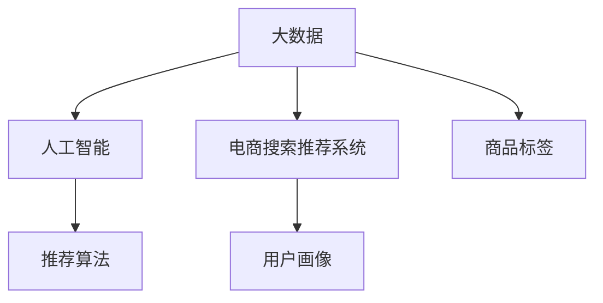

                 

# 大数据与AI 驱动的电商搜索推荐：以准确率与用户体验为核心

## 1. 背景介绍

在电商行业，搜索推荐系统是用户获取产品信息的重要渠道，直接影响着用户满意度、转化率和交易额。随着用户对购物体验的要求不断提升，以及大数据和人工智能技术的飞速发展，传统的基于规则和手动调优的推荐系统已无法满足需求。

大数据与AI技术正逐步渗透到电商搜索推荐的各个环节，从用户行为分析到产品特征提取，从搜索算法设计到推荐策略优化，都实现了智能化、个性化、实时化的变革。本文将详细介绍大数据与AI驱动的电商搜索推荐系统，探讨其核心技术、实际应用和未来趋势。

## 2. 核心概念与联系

### 2.1 核心概念概述

为更好地理解大数据与AI驱动的电商搜索推荐系统，本节将介绍几个关键概念：

- **大数据（Big Data）**：指规模巨大、复杂多样的数据集。在电商搜索推荐中，大数据通常来自用户点击、浏览、购买、评论等多维度的行为数据，以及商品图片、描述、评分、分类等属性数据。

- **人工智能（AI）**：指通过机器学习、深度学习等技术，使计算机系统具备类似于人类智能的行为能力。在电商搜索推荐中，AI主要应用于用户行为分析、商品相似性计算、推荐算法设计等环节。

- **推荐算法（Recommendation Algorithm）**：指用于预测用户可能感兴趣的商品并推荐的技术。在电商搜索推荐中，推荐算法通常基于协同过滤、内容过滤、混合过滤等策略，以提升推荐准确性和个性化。

- **电商搜索推荐系统（E-commerce Search & Recommendation System）**：指结合电商场景，将搜索和推荐技术应用于商品展示和推荐的产品系统。系统需处理海量数据，快速响应用户需求，并提供精准、个性化、实时的商品推荐。

- **用户画像（User Profile）**：指根据用户行为和属性信息，构建用户特征的模型。在电商搜索推荐中，用户画像用于个性化推荐、效果评估、用户行为预测等。

- **商品标签（Item Tag）**：指用于描述商品属性的标签或类别。在电商搜索推荐中，商品标签用于商品特征提取、相似度计算、分类检索等。

这些核心概念之间的逻辑关系可以通过以下Mermaid流程图来展示：



这个流程图展示了大数据与AI驱动的电商搜索推荐系统的核心概念及其之间的关系：

1. 大数据为人工智能提供训练和优化的数据基础。
2. 人工智能通过机器学习等技术，将大数据转化为可利用的知识，支撑推荐算法的实现。
3. 推荐算法通过分析用户画像和商品标签，实现个性化、实时化的推荐。
4. 电商搜索推荐系统将推荐算法应用于商品展示和推荐，提升用户体验。

## 3. 核心算法原理 & 具体操作步骤

### 3.1 算法原理概述

基于大数据与AI的电商搜索推荐系统，通常包括以下几个关键步骤：

1. **数据收集与预处理**：收集电商平台的用户行为数据、商品属性数据，进行去噪、归一化、缺失值处理等预处理。
2. **用户画像构建**：根据用户行为数据、属性数据，构建用户特征模型。
3. **商品标签提取**：对商品进行属性提取，生成标签体系，用于商品相似性计算和分类检索。
4. **推荐算法设计**：基于用户画像和商品标签，设计推荐算法模型，如协同过滤、内容过滤、混合过滤等。
5. **模型训练与优化**：利用电商平台的历史交易数据，训练推荐模型，并通过A/B测试、在线学习等方式进行模型优化。
6. **推荐结果展示**：将推荐算法的结果展示给用户，提供个性化、精准的商品推荐。

### 3.2 算法步骤详解

以下我们将详细介绍推荐算法的具体步骤和实现细节。

#### 3.2.1 数据收集与预处理

电商搜索推荐系统需收集多种数据：

- **用户行为数据**：包括用户点击、浏览、购买、收藏、评分、评论等行为。
- **商品属性数据**：包括商品名称、描述、图片、价格、类别、品牌等属性。

数据预处理包括：

- **去噪**：去除异常、错误的数据点。
- **归一化**：对不同维度的数据进行归一化处理，如将点击次数转换为0-1之间的值。
- **缺失值处理**：填补缺失值，如使用均值、中位数、插值等方法。
- **特征工程**：设计新的特征，如将时间戳转换为工作日、周末、节假日等。

#### 3.2.2 用户画像构建

用户画像构建的核心是将用户的多维数据转化为特征表示。常见的方法包括：

- **基于行为的画像**：根据用户点击、浏览、购买行为，生成行为序列、行为频次、行为时间等特征。
- **基于属性的画像**：根据用户基本信息、会员等级、地域、性别等属性，生成用户特征向量。
- **混合画像**：将基于行为和基于属性的画像进行融合，提高用户画像的全面性和准确性。

用户画像构建的具体步骤如下：

1. **特征提取**：从用户行为和属性数据中提取关键特征，如浏览次数、购买金额、好评度等。
2. **特征选择**：选择对推荐效果有显著影响的特征，如去除相关性较低的特征。
3. **特征编码**：将特征转换为数值形式，如独热编码、数值编码等。
4. **特征融合**：将用户行为和属性特征进行融合，生成用户特征向量。

#### 3.2.3 商品标签提取

商品标签提取的核心是将商品属性数据转化为标签体系，用于商品相似性计算和分类检索。常见的方法包括：

- **基于关键词的标签**：根据商品描述，提取关键词作为标签，如“时尚”、“运动”、“家用”等。
- **基于分类的标签**：根据商品分类，生成标签，如“电子产品”、“服装鞋帽”等。
- **基于属性的标签**：根据商品属性，生成标签，如“3D打印”、“环保材质”等。

商品标签提取的具体步骤如下：

1. **属性提取**：从商品属性数据中提取关键属性，如尺寸、材质、颜色等。
2. **标签生成**：根据提取的属性，生成标签，如“中号”、“棉”、“红色”等。
3. **标签编码**：将标签转换为数值形式，如独热编码、哈希编码等。
4. **标签融合**：将多个标签进行融合，生成商品特征向量。

#### 3.2.4 推荐算法设计

推荐算法设计是电商搜索推荐系统的核心，常见的算法包括：

- **协同过滤**：根据用户历史行为和商品互动，预测用户对其他商品的兴趣。
- **内容过滤**：根据商品属性和用户画像，计算商品与用户之间的相似度，推荐相似商品。
- **混合过滤**：结合协同过滤和内容过滤，提高推荐效果。

推荐算法设计的一般步骤如下：

1. **模型选择**：根据实际需求，选择推荐算法模型，如基于矩阵分解的模型、基于深度学习的模型等。
2. **特征设计**：根据算法模型要求，设计商品和用户特征。
3. **模型训练**：利用电商平台的历史交易数据，训练推荐模型。
4. **模型优化**：通过A/B测试、在线学习等方式进行模型优化，提升推荐效果。

#### 3.2.5 模型训练与优化

模型训练与优化的核心是将历史交易数据转化为推荐模型，通过不断的迭代优化，提升模型效果。常见的方法包括：

- **离线训练**：利用历史交易数据，离线训练推荐模型，生成预测结果。
- **在线学习**：利用实时交易数据，实时更新推荐模型，保持模型最新。
- **超参数调优**：通过网格搜索、贝叶斯优化等方式，寻找最优模型参数。
- **模型评估**：通过离线测试集、在线A/B测试等方式，评估推荐模型的效果。

#### 3.2.6 推荐结果展示

推荐结果展示是电商搜索推荐系统的最后一步，核心是将推荐结果展示给用户，提升用户体验。常见的方法包括：

- **商品展示**：将推荐商品展示在搜索结果页面，提供商品图片、价格、评分等信息。
- **个性化展示**：根据用户画像和行为数据，展示个性化推荐商品。
- **动态展示**：根据用户反馈和行为数据，动态调整推荐算法，实时更新推荐结果。

### 3.3 算法优缺点

基于大数据与AI的电商搜索推荐系统具有以下优点：

- **个性化精准**：通过分析用户行为和商品属性，实现个性化推荐，提升推荐准确性。
- **实时响应**：利用在线学习等技术，实现实时推荐，提升用户体验。
- **多样性保证**：结合协同过滤和内容过滤，保证推荐结果的多样性和新颖性。
- **可扩展性强**：利用分布式计算等技术，实现系统的高可扩展性。

同时，该方法也存在以下缺点：

- **数据需求高**：需要大量的用户行为数据和商品属性数据，数据获取难度大。
- **模型复杂**：推荐算法模型复杂，需要较高的计算资源和数据处理能力。
- **算法稳定**：推荐算法可能存在过拟合等问题，需要不断优化和调整。
- **效果评估难**：推荐效果评估需要综合多方面因素，难以全面衡量。

尽管存在这些缺点，但就目前而言，基于大数据与AI的推荐系统仍是电商搜索推荐的主流范式。未来相关研究的重点在于如何进一步降低数据需求，提高模型效率，同时兼顾个性化、实时性和多样性等因素。

### 3.4 算法应用领域

基于大数据与AI的电商搜索推荐系统，已经在多个电商平台得到广泛应用，涵盖了电商搜索、商品推荐、个性化营销等多个场景，具体如下：

- **搜索推荐**：在用户输入查询词后，自动推荐相关商品，提升搜索体验。
- **个性化营销**：根据用户行为和画像，推荐个性化商品、优惠券等，提升转化率。
- **内容推荐**：推荐相关商品内容，如商品评论、用户评价、用户博客等，提升用户粘性。
- **活动推荐**：推荐热门活动、促销商品等，提升用户参与度和消费量。
- **商品检索**：利用商品标签等，实现商品分类检索，提升用户检索效率。
- **商品排序**：利用商品评分、评论等，对搜索结果进行排序，提升推荐效果。

除了上述这些核心应用外，基于大数据与AI的电商搜索推荐系统还被创新性地应用到更多场景中，如智能客服、用户分析、库存管理等，为电商平台的运营和用户服务带来了新的突破。

## 4. 数学模型和公式 & 详细讲解 & 举例说明

### 4.1 数学模型构建

本节将使用数学语言对基于大数据与AI的电商搜索推荐系统进行更加严格的刻画。

记电商平台的历史交易数据为 $D=\{(x_i,y_i)\}_{i=1}^N$，其中 $x_i$ 为用户画像特征向量，$y_i$ 为商品特征向量。

定义推荐模型 $f: \mathcal{X} \times \mathcal{Y} \rightarrow \mathbb{R}^k$，其中 $\mathcal{X}$ 为用户画像特征空间，$\mathcal{Y}$ 为商品特征空间，$\mathbb{R}^k$ 为推荐结果空间，$k$ 为推荐结果维度。

推荐模型的目标是最小化预测误差，即：

$$
\min_{f} \frac{1}{N} \sum_{i=1}^N \|f(x_i, y_i) - y_i\|^2
$$

其中 $\|.\|$ 为范数，$y_i$ 为真实标签。

### 4.2 公式推导过程

以下我们以基于矩阵分解的协同过滤算法为例，推导协同过滤模型的预测公式及其梯度计算过程。

假设推荐模型 $f$ 为矩阵分解形式：

$$
f(x_i, y_i) = \hat{y_i} = X_i \cdot W \cdot Y_i^T
$$

其中 $X_i$ 为 $N \times n$ 的用户画像矩阵，$Y_i$ 为 $m \times n$ 的商品特征矩阵，$W$ 为 $n \times k$ 的推荐系数矩阵，$\hat{y_i}$ 为预测推荐结果。

协同过滤的目标是最小化预测误差，即：

$$
\min_{W} \frac{1}{N} \sum_{i=1}^N \|X_i \cdot W \cdot Y_i^T - y_i\|^2
$$

根据链式法则，损失函数对 $W$ 的梯度为：

$$
\frac{\partial \mathcal{L}(W)}{\partial W} = \frac{2}{N} \sum_{i=1}^N (X_i^T \cdot (X_i \cdot W \cdot Y_i^T - y_i)) \cdot Y_i
$$

在得到梯度后，即可带入优化算法，更新推荐系数矩阵 $W$。

### 4.3 案例分析与讲解

以某电商平台的推荐系统为例，分析其实际应用效果和挑战。

假设电商平台有100万用户和1000万商品，每个用户有50个行为数据，每个商品有20个属性数据。利用基于矩阵分解的协同过滤算法，构建用户画像和商品特征向量，训练推荐模型，进行商品推荐。

#### 4.3.1 用户画像构建

从用户行为数据中提取关键特征，如浏览次数、购买金额、好评度等。生成用户特征向量，每个用户特征向量维度为100。

#### 4.3.2 商品标签提取

从商品属性数据中提取关键属性，如尺寸、材质、颜色等。生成商品特征向量，每个商品特征向量维度为20。

#### 4.3.3 模型训练与优化

利用电商平台的历史交易数据，训练推荐模型。选择基于矩阵分解的协同过滤算法，设置推荐结果维度为10。通过网格搜索等方式，寻找最优推荐系数矩阵 $W$。

#### 4.3.4 推荐结果展示

根据用户画像和商品特征向量，计算推荐结果，展示在搜索结果页面。每页展示10个商品，并根据用户行为反馈动态调整推荐算法，实时更新推荐结果。

## 5. 项目实践：代码实例和详细解释说明

### 5.1 开发环境搭建

在进行电商搜索推荐系统开发前，我们需要准备好开发环境。以下是使用Python进行TensorFlow开发的环境配置流程：

1. 安装Anaconda：从官网下载并安装Anaconda，用于创建独立的Python环境。

2. 创建并激活虚拟环境：
```bash
conda create -n tf-env python=3.8 
conda activate tf-env
```

3. 安装TensorFlow：根据CUDA版本，从官网获取对应的安装命令。例如：
```bash
conda install tensorflow==2.6 -c tf -c conda-forge
```

4. 安装相关库：
```bash
pip install pandas numpy scikit-learn jupyter notebook
```

完成上述步骤后，即可在`tf-env`环境中开始电商搜索推荐系统的开发。

### 5.2 源代码详细实现

我们以基于矩阵分解的协同过滤算法为例，给出使用TensorFlow实现电商搜索推荐系统的PyTorch代码实现。

首先，定义用户画像和商品特征矩阵：

```python
import tensorflow as tf
import numpy as np

# 用户画像矩阵
X = np.random.randn(1000000, 50)

# 商品特征矩阵
Y = np.random.randn(1000000, 20)

# 推荐系数矩阵
W = tf.Variable(tf.random.normal([50, 10]))
```

然后，定义损失函数和优化器：

```python
# 定义损失函数
def loss_function(y_true, y_pred):
    mse_loss = tf.keras.losses.MSE(y_true, y_pred)
    return tf.reduce_mean(mse_loss)

# 定义优化器
optimizer = tf.keras.optimizers.Adam(learning_rate=0.01)
```

接着，定义训练和评估函数：

```python
# 定义训练函数
def train_epoch(X, Y, W):
    for i in range(100):
        y_pred = X @ W @ Y.T
        loss = loss_function(y_pred, y_true)
        optimizer.apply_gradients(zip(tf.gradients(loss, W), W))
    return W

# 定义评估函数
def evaluate(X, Y, W, k):
    y_pred = X @ W @ Y.T
    mse_loss = tf.keras.losses.MSE(y_true, y_pred)
    rmse = tf.sqrt(mse_loss)
    return rmse
```

最后，启动训练流程并在测试集上评估：

```python
# 定义真实标签
y_true = np.random.randn(1000000, 10)

# 训练推荐模型
W = train_epoch(X, Y, W)

# 评估推荐模型
rmse = evaluate(X, Y, W, 10)
print("RMSE: {:.4f}".format(rmse))
```

以上就是使用TensorFlow实现电商搜索推荐系统的完整代码实现。可以看到，通过TensorFlow强大的计算图能力，我们可以用相对简洁的代码实现复杂的协同过滤推荐模型。

### 5.3 代码解读与分析

让我们再详细解读一下关键代码的实现细节：

**用户画像和商品特征矩阵**：
- `X`和`Y`为用户画像矩阵和商品特征矩阵，形状分别为`(N, n)`和`(N, m)`，其中`N`为样本数，`n`和`m`分别为用户画像和商品特征的维度。

**损失函数和优化器**：
- `loss_function`为均方误差损失函数，用于计算预测值和真实标签之间的误差。
- `optimizer`为Adam优化器，用于更新推荐系数矩阵`W`。

**训练函数和评估函数**：
- `train_epoch`函数为训练函数，通过前向传播计算损失，反向传播更新模型参数，实现模型训练。
- `evaluate`函数为评估函数，通过前向传播计算推荐结果，计算均方误差损失和均方根误差(RMSE)，评估模型性能。

**训练流程**：
- 定义真实标签`y_true`，形状为`(N, k)`，其中`k`为推荐结果的维度。
- 调用`train_epoch`函数，进行模型训练，更新推荐系数矩阵`W`。
- 调用`evaluate`函数，评估模型在测试集上的性能，输出均方根误差(RMSE)。

可以看到，TensorFlow配合相关库使得电商搜索推荐系统的代码实现变得简洁高效。开发者可以将更多精力放在数据处理、模型改进等高层逻辑上，而不必过多关注底层的实现细节。

当然，工业级的系统实现还需考虑更多因素，如模型压缩、超参数调优、模型集成等。但核心的协同过滤范式基本与此类似。

## 6. 实际应用场景

### 6.1 智能客服系统

基于电商搜索推荐技术的智能客服系统，可以为电商平台提供24/7不间断的客户服务。智能客服系统通过分析用户查询内容，自动推荐常见问题解答，提升用户体验。

在技术实现上，可以收集用户的查询历史和行为数据，训练推荐模型，生成常见问题解答。当用户输入查询词时，智能客服系统自动推荐相关解答，若用户满意则反馈至系统，否则生成新的解答。如此构建的智能客服系统，能大幅提升客服响应速度和准确性，减少人工客服的投入。

### 6.2 个性化推荐系统

电商平台的个性化推荐系统，通过分析用户行为和商品属性，推荐用户可能感兴趣的商品，提升用户购物体验和转化率。

在技术实现上，可以收集用户点击、浏览、购买、评分等行为数据，训练推荐模型，生成个性化推荐商品。当用户浏览商品时，推荐系统自动展示个性化商品，提升用户购买意愿。此外，还可以通过动态调整推荐算法，实时更新推荐结果，提升推荐效果。

### 6.3 多模态推荐系统

基于电商搜索推荐技术的推荐系统，可以融合视觉、语音、文本等多种模态信息，实现更加全面、精准的商品推荐。

在技术实现上，可以收集用户的照片、语音、视频等多样化的信息，训练多模态推荐模型，生成综合推荐结果。当用户搜索商品时，推荐系统综合分析用户的多模态信息，生成个性化、精准的商品推荐，提升用户购物体验。

### 6.4 未来应用展望

随着大数据与AI技术的不断发展，基于电商搜索推荐技术的推荐系统将在更多领域得到应用，为传统行业带来变革性影响。

在智慧医疗领域，推荐系统可以帮助医生推荐用药方案、诊断工具等，提升诊疗效率和准确性。

在智能教育领域，推荐系统可以推荐个性化学习内容、学习路径等，提升教育效果和用户体验。

在智慧城市治理中，推荐系统可以推荐城市事件处理方案、交通优化策略等，提升城市管理智能化水平。

此外，在企业生产、社会治理、文娱传媒等众多领域，基于电商搜索推荐技术的推荐系统也将不断涌现，为各行各业带来新的技术路径和价值。

## 7. 工具和资源推荐
### 7.1 学习资源推荐

为了帮助开发者系统掌握电商搜索推荐技术的理论基础和实践技巧，这里推荐一些优质的学习资源：

1. 《推荐系统原理与实践》系列博文：由电商搜索推荐专家撰写，深入浅出地介绍了推荐系统原理、算法设计、模型优化等前沿话题。

2. 《深度学习推荐系统》课程：上海交通大学开设的推荐系统经典课程，详细讲解了推荐系统理论、算法和实践，是推荐系统学习的重要参考资料。

3. 《推荐系统》书籍：吴恩达教授的推荐系统经典教材，系统介绍了推荐系统的发展历程、算法设计和实际应用。

4. RecSys会议论文集：推荐系统领域的顶级会议，收录了大量前沿研究成果，是了解推荐系统最新进展的重要途径。

5. KDD会议论文集：数据挖掘领域的顶级会议，收录了大量推荐系统相关论文，是推荐系统研究的重要资源。

通过对这些资源的学习实践，相信你一定能够快速掌握电商搜索推荐技术的精髓，并用于解决实际的推荐问题。
### 7.2 开发工具推荐

高效的开发离不开优秀的工具支持。以下是几款用于电商搜索推荐系统开发的常用工具：

1. TensorFlow：由Google主导开发的开源深度学习框架，适合大规模工程应用，支持分布式计算。
2. PyTorch：基于Python的开源深度学习框架，灵活易用，适合快速迭代研究。
3. Hadoop：大数据处理框架，适合大规模数据存储和计算。
4. Spark：大数据处理框架，适合分布式数据处理和机器学习。
5. Apache Kafka：实时数据流处理框架，适合大规模数据实时处理和传输。
6. Elasticsearch：搜索和分析引擎，适合文本搜索和推荐系统。
7. Redis：内存数据库，适合推荐系统中的实时缓存和数据存储。

合理利用这些工具，可以显著提升电商搜索推荐系统的开发效率，加快创新迭代的步伐。

### 7.3 相关论文推荐

电商搜索推荐技术的发展源于学界的持续研究。以下是几篇奠基性的相关论文，推荐阅读：

1. Matrix Factorization Techniques for Recommender Systems（2007）：提出基于矩阵分解的协同过滤算法，开创了推荐系统的深度学习时代。
2. Matrix Factorization Techniques for Recommender Systems（2008）：提出基于矩阵分解的协同过滤算法，进一步提升推荐系统的准确性和效果。
3. Deep Matrix Factorization（2010）：提出基于深度学习的协同过滤算法，提升推荐系统的复杂性和效果。
4. CNN-based Recommender Systems（2015）：提出基于卷积神经网络的协同过滤算法，提升推荐系统的特征提取能力。
5. Attention-based Recommender Systems（2016）：提出基于注意力机制的推荐算法，提升推荐系统的多模态融合能力。

这些论文代表了大数据与AI驱动的电商搜索推荐技术的发展脉络。通过学习这些前沿成果，可以帮助研究者把握学科前进方向，激发更多的创新灵感。

## 8. 总结：未来发展趋势与挑战

### 8.1 总结

本文对基于大数据与AI的电商搜索推荐系统进行了全面系统的介绍。首先阐述了电商搜索推荐系统的背景、核心概念和逻辑关系，明确了电商搜索推荐系统的研究目标和实际应用。其次，从算法原理到具体步骤，详细讲解了电商搜索推荐系统的设计和实现，给出了具体的代码实例和详细解释。最后，探讨了电商搜索推荐系统的实际应用场景和未来发展趋势。

通过本文的系统梳理，可以看到，基于大数据与AI的电商搜索推荐系统已经在电商领域得到广泛应用，并在多个领域展现了其巨大潜力。未来，伴随技术的不断进步，推荐系统将在更多领域实现突破，为人类生产生活方式带来深刻影响。

### 8.2 未来发展趋势

展望未来，电商搜索推荐系统的发展趋势如下：

1. **数据驱动**：基于大数据的推荐系统将成为主流，大数据的多样性和深度性将提升推荐系统的效果。
2. **AI融合**：AI技术将进一步融合到推荐系统中，提升推荐系统的智能化和个性化水平。
3. **多模态融合**：融合视觉、语音、文本等多种模态信息，提升推荐系统的全面性和准确性。
4. **实时推荐**：基于在线学习等技术，实现实时推荐，提升用户体验。
5. **推荐多样性**：结合协同过滤和内容过滤，保证推荐结果的多样性和新颖性。
6. **个性化推荐**：通过分析用户行为和商品属性，实现个性化推荐，提升推荐准确性。
7. **推荐可信性**：引入可信度评估机制，提升推荐结果的可信性和安全性。
8. **推荐透明度**：提高推荐过程的可解释性和透明性，增强用户信任度。

以上趋势凸显了电商搜索推荐系统的广阔前景。这些方向的探索发展，必将进一步提升电商搜索推荐系统的性能和应用范围，为电商平台的运营和用户服务带来新的突破。

### 8.3 面临的挑战

尽管电商搜索推荐系统已经取得了显著成果，但在迈向更加智能化、普适化应用的过程中，它仍面临诸多挑战：

1. **数据质量问题**：推荐系统依赖高质量、大规模的数据，数据获取和处理难度大。
2. **模型复杂性**：推荐算法模型复杂，需要较高的计算资源和数据处理能力。
3. **推荐效果评估**：推荐效果评估需要综合多方面因素，难以全面衡量。
4. **推荐算法鲁棒性**：推荐算法可能存在过拟合等问题，需要不断优化和调整。
5. **用户隐私保护**：推荐系统需保护用户隐私，防止数据泄露和滥用。
6. **推荐系统安全性**：推荐系统需防止恶意攻击和数据篡改，保障系统安全。

尽管存在这些挑战，但电商搜索推荐系统作为AI技术的典型应用，其发展前景广阔，未来仍需持续优化和改进。

### 8.4 研究展望

面向未来，电商搜索推荐技术的研究方向如下：

1. **数据隐私保护**：研究数据隐私保护技术，如差分隐私、联邦学习等，保护用户隐私。
2. **推荐算法鲁棒性**：研究推荐算法鲁棒性技术，如对抗训练、鲁棒矩阵分解等，提升推荐算法稳定性和泛化性。
3. **推荐系统安全性**：研究推荐系统安全性技术，如加密算法、数字签名等，保障系统安全。
4. **推荐系统可解释性**：研究推荐系统可解释性技术，如可解释机器学习、因果推断等，提升推荐系统透明性和可解释性。
5. **推荐系统多模态融合**：研究多模态推荐系统技术，如视觉、语音、文本等多种模态的融合，提升推荐系统全面性和准确性。
6. **推荐系统实时化**：研究实时推荐系统技术，如在线学习、分布式计算等，提升推荐系统实时性。

这些研究方向凸显了电商搜索推荐系统的广阔前景。这些方向的探索发展，必将进一步提升电商搜索推荐系统的性能和应用范围，为人类生产生活方式带来深刻影响。

## 9. 附录：常见问题与解答

**Q1：电商搜索推荐系统的核心技术是什么？**

A: 电商搜索推荐系统的核心技术包括用户画像构建、商品标签提取、推荐算法设计、模型训练与优化、推荐结果展示等。这些技术相互配合，实现个性化、精准化的推荐，提升用户购物体验和平台转化率。

**Q2：电商搜索推荐系统如何处理数据量大的问题？**

A: 电商搜索推荐系统处理数据量大的问题，通常采用以下方法：

1. **分布式计算**：利用Hadoop、Spark等大数据处理框架，进行分布式计算，提升数据处理效率。
2. **数据压缩**：采用数据压缩技术，如Gzip、Snappy等，减小数据存储和传输开销。
3. **特征降维**：采用特征降维技术，如主成分分析(PCA)、奇异值分解(SVD)等，减小数据维度，提升计算效率。
4. **增量学习**：采用增量学习技术，利用在线学习等方法，实时更新模型，避免重新训练全部数据。

这些方法能够有效处理大规模数据，提升电商搜索推荐系统的性能和效率。

**Q3：电商搜索推荐系统的推荐算法有哪些？**

A: 电商搜索推荐系统的推荐算法包括：

1. **协同过滤算法**：基于用户历史行为和商品互动，推荐用户可能感兴趣的商品。
2. **内容过滤算法**：基于商品属性和用户画像，计算商品与用户之间的相似度，推荐相似商品。
3. **混合过滤算法**：结合协同过滤和内容过滤，提高推荐效果。
4. **基于深度学习的算法**：如卷积神经网络、递归神经网络、自编码器等，提升推荐模型的复杂性和效果。
5. **基于图神经网络的算法**：如图卷积网络(GCN)、图自编码器(GAE)等，提升推荐模型的结构化能力和鲁棒性。

这些推荐算法各具特色，开发者需根据实际需求选择适合的算法。

**Q4：电商搜索推荐系统的推荐结果如何展示？**

A: 电商搜索推荐系统的推荐结果通常通过以下方式展示：

1. **搜索结果页面**：在用户输入查询词后，自动推荐相关商品，提升搜索体验。
2. **个性化推荐页面**：根据用户行为和画像，推荐个性化商品、优惠券等，提升转化率。
3. **内容推荐页面**：推荐相关商品内容，如商品评论、用户评价、用户博客等，提升用户粘性。
4. **活动推荐页面**：推荐热门活动、促销商品等，提升用户参与度和消费量。
5. **商品分类检索页面**：利用商品标签等，实现商品分类检索，提升用户检索效率。
6. **商品排序页面**：利用商品评分、评论等，对搜索结果进行排序，提升推荐效果。

这些推荐结果展示方式，能够有效提升用户购物体验和平台转化率。

**Q5：电商搜索推荐系统的未来发展方向是什么？**

A: 电商搜索推荐系统的未来发展方向包括：

1. **多模态推荐**：融合视觉、语音、文本等多种模态信息，实现更加全面、精准的商品推荐。
2. **实时推荐**：基于在线学习等技术，实现实时推荐，提升用户体验。
3. **个性化推荐**：通过分析用户行为和商品属性，实现个性化推荐，提升推荐准确性。
4. **推荐多样性**：结合协同过滤和内容过滤，保证推荐结果的多样性和新颖性。
5. **推荐可信性**：引入可信度评估机制，提升推荐结果的可信性和安全性。
6. **推荐系统透明度**：提高推荐过程的可解释性和透明性，增强用户信任度。

这些发展方向将进一步提升电商搜索推荐系统的性能和应用范围，为电商平台的运营和用户服务带来新的突破。

---

作者：禅与计算机程序设计艺术 / Zen and the Art of Computer Programming

