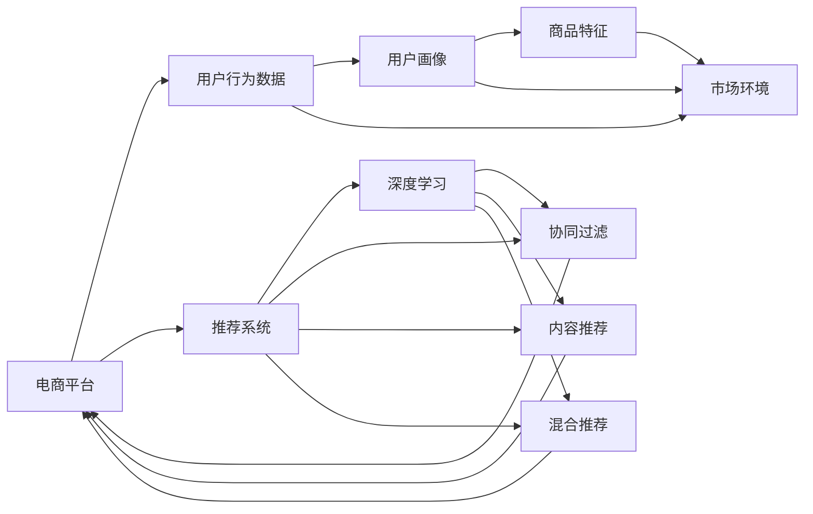

                 

## 1. 背景介绍

随着互联网的普及和数字经济的崛起，电子商务行业迅猛发展，在线购物成为人们日常生活的一部分。如何为用户推荐其感兴趣的商品，提高转化率和客户满意度，成为了电商平台的核心需求。传统的推荐系统基于用户的历史行为数据，如点击、浏览、购买记录等，进行推荐，但难以捕捉用户潜在的兴趣和偏好。为了解决这个问题，电商平台引入人工智能技术，特别是基于深度学习的推荐算法，来提升推荐质量。

人工智能技术能够从海量的用户行为数据中学习用户兴趣模式，结合产品特征和市场环境，提供个性化的推荐服务。电商平台通过分析用户的点击和浏览行为，预测其购买意向，实时推荐用户可能感兴趣的商品。这种基于大数据和AI的推荐方式，不仅提升了用户的购物体验，还极大地提高了电商平台的交易转化率。

## 2. 核心概念与联系

### 2.1 核心概念概述

- **推荐系统**：一种通过分析用户行为和商品特征，为用户推荐可能感兴趣的商品的系统。推荐系统包括协同过滤、内容推荐、混合推荐等多种类型。
- **深度学习**：一种基于多层神经网络的机器学习方法，通过多层非线性变换，从数据中学习高维特征表示。深度学习在图像、语音、自然语言处理等领域应用广泛。
- **电商搜索推荐**：一种专注于电商平台，通过搜索和推荐的方式，帮助用户快速找到所需商品的技术。电商搜索推荐系统整合了搜索和推荐功能，提升用户购物体验。
- **模型融合**：将多个模型组合起来，通过投票、加权平均等方式，综合提升推荐性能。模型融合是推荐系统优化的重要手段，可以降低单一模型的偏差和噪声。
- **用户交互**：用户通过浏览、点击、购买等行为与系统进行交互，反馈其对商品的态度和需求。用户交互数据是推荐系统的重要训练数据来源。
- **个性化推荐**：根据用户的历史行为和实时反馈，提供符合其兴趣和需求的个性化推荐服务。个性化推荐是推荐系统追求的目标。

### 2.2 核心概念原理和架构的 Mermaid 流程图



## 3. 核心算法原理 & 具体操作步骤

### 3.1 算法原理概述

电商搜索推荐系统的核心算法基于深度学习和模型融合技术。其原理是通过分析用户的浏览、点击和购买行为，学习用户的兴趣模式，同时结合商品特征和市场环境，生成个性化的推荐列表。具体来说，推荐系统首先通过深度学习模型对用户和商品进行特征表示，然后通过模型融合技术，将多个模型的预测结果综合，得到最终的推荐结果。

推荐系统通常包括以下几个步骤：

1. **数据收集**：收集用户的浏览、点击和购买记录，以及商品的属性、描述和价格等信息。
2. **特征工程**：对用户和商品进行特征提取和向量化，生成高维特征表示。
3. **模型训练**：使用深度学习模型（如神经网络）对用户行为数据进行训练，学习用户兴趣和商品特征。
4. **推荐生成**：将用户特征和商品特征输入训练好的模型，生成推荐结果。
5. **模型融合**：将多个模型的预测结果综合，提升推荐性能。

### 3.2 算法步骤详解

#### 3.2.1 数据收集

电商平台需要收集用户的各种行为数据，包括浏览记录、点击行为、购买记录、评分和评论等。这些数据可以用于训练推荐模型，预测用户对未交互商品的兴趣。

#### 3.2.2 特征工程

特征工程是将原始数据转化为模型可以使用的特征表示的过程。电商平台的特征工程主要包括以下几个方面：

1. **用户特征**：如用户ID、年龄、性别、地理位置等基本信息，以及用户的浏览时长、点击次数、购买频率等行为特征。
2. **商品特征**：如商品ID、名称、描述、价格、类别、品牌等基本信息，以及商品的评分、评论、销量等属性。
3. **市场环境特征**：如时间、季节、节假日等对用户购买行为有影响的因素。

特征工程的目标是构建高质量的特征向量，减少数据冗余和噪声，提升模型的泛化能力。

#### 3.2.3 模型训练

推荐系统的训练数据包括用户行为数据和商品特征。模型训练通常使用深度神经网络，如多层感知机、卷积神经网络、循环神经网络等。训练过程中，模型通过反向传播算法更新权重，学习用户兴趣和商品特征之间的关系。

#### 3.2.4 推荐生成

推荐生成是指将用户特征和商品特征输入训练好的模型，生成推荐结果。推荐结果通常是一个商品列表，按照用户可能感兴趣的顺序排列。推荐结果可以通过召回率和准确率等指标进行评估。

#### 3.2.5 模型融合

模型融合是指将多个模型的预测结果综合，提升推荐性能。常用的模型融合方法包括：

1. **平均融合**：将多个模型的预测结果取平均值，得到最终推荐结果。
2. **加权融合**：根据模型的预测性能，对不同模型的预测结果进行加权平均，得到最终推荐结果。
3. **投票融合**：将多个模型的预测结果进行投票，选择出现次数最多的商品作为推荐结果。

### 3.3 算法优缺点

**优点**：

1. **个性化推荐**：通过深度学习和模型融合技术，推荐系统能够提供个性化的推荐服务，提升用户体验。
2. **实时性**：推荐系统可以根据用户的实时行为，实时生成推荐结果，满足用户的即时需求。
3. **高精度**：深度学习模型能够从大规模数据中学习复杂模式，提升推荐的准确性和有效性。

**缺点**：

1. **数据需求量大**：推荐系统需要收集大量的用户行为数据和商品特征，对数据处理和存储能力有较高要求。
2. **模型复杂**：深度学习模型的训练和推理过程较为复杂，需要高性能的计算资源。
3. **可解释性不足**：推荐系统通常是黑盒模型，难以解释其内部的决策过程，用户可能对推荐结果缺乏信任感。

### 3.4 算法应用领域

基于深度学习的电商搜索推荐系统已经广泛应用于各大电商平台，如淘宝、京东、亚马逊等。推荐系统根据用户的浏览和购买行为，为用户推荐可能感兴趣的商品，提升了用户的购物体验和平台的用户粘性。此外，推荐系统还应用于智能客服、广告推荐、内容推送等多个领域，取得了显著的效果。

## 4. 数学模型和公式 & 详细讲解 & 举例说明

### 4.1 数学模型构建

电商搜索推荐系统的主要数学模型包括用户行为模型和商品特征模型。用户行为模型用于学习用户的兴趣和偏好，商品特征模型用于表示商品的属性和特征。

#### 4.1.1 用户行为模型

用户行为模型通常使用隐式反馈的协同过滤模型，如矩阵分解模型（SVD）和邻域推荐模型（KNN）。协同过滤模型通过用户-商品矩阵，预测用户对未交互商品的兴趣。

用户行为模型的数学表示为：

$$
\hat{y}_{i,j} = \mathbf{u}_i \cdot \mathbf{v}_j
$$

其中，$\hat{y}_{i,j}$ 表示用户 $i$ 对商品 $j$ 的预测评分，$\mathbf{u}_i$ 和 $\mathbf{v}_j$ 分别为用户 $i$ 和商品 $j$ 的隐向量表示。

#### 4.1.2 商品特征模型

商品特征模型通常使用深度神经网络，对商品的标签、描述和图片等特征进行编码，生成高维特征表示。

商品特征模型的数学表示为：

$$
\mathbf{v}_j = \text{Encoder}(\mathbf{x}_j)
$$

其中，$\mathbf{x}_j$ 表示商品 $j$ 的特征向量，$\text{Encoder}$ 为深度神经网络模型，$\mathbf{v}_j$ 为商品的隐向量表示。

### 4.2 公式推导过程

#### 4.2.1 用户行为模型推导

协同过滤模型的推导过程如下：

设用户行为数据为 $\mathbf{Y} \in \mathbb{R}^{N \times M}$，其中 $N$ 为用户数量，$M$ 为商品数量。设用户隐向量为 $\mathbf{U} \in \mathbb{R}^{N \times d}$，商品隐向量为 $\mathbf{V} \in \mathbb{R}^{M \times d}$。

协同过滤模型的目标是最小化预测评分与实际评分之间的平方误差，即：

$$
\min_{\mathbf{U},\mathbf{V}} \frac{1}{2} \sum_{i,j} (\hat{y}_{i,j} - y_{i,j})^2
$$

通过矩阵分解，可以得到：

$$
\mathbf{Y} \approx \mathbf{U} \cdot \mathbf{V}^T
$$

因此，协同过滤模型的优化目标可以表示为：

$$
\min_{\mathbf{U},\mathbf{V}} \frac{1}{2} \sum_{i,j} (\mathbf{u}_i \cdot \mathbf{v}_j - y_{i,j})^2
$$

其中，$\mathbf{u}_i$ 和 $\mathbf{v}_j$ 分别为用户 $i$ 和商品 $j$ 的隐向量表示。

#### 4.2.2 商品特征模型推导

深度神经网络的推导过程如下：

设商品特征数据为 $\mathbf{X} \in \mathbb{R}^{M \times d'}$，其中 $d'$ 为特征维度。设深度神经网络为 $\text{Encoder}$，输出为 $\mathbf{V} \in \mathbb{R}^{M \times d}$。

深度神经网络的优化目标可以表示为：

$$
\min_{\text{Encoder}} \|\mathbf{V} - \text{Encoder}(\mathbf{X})\|_F^2
$$

其中，$\|\cdot\|_F$ 表示矩阵的 Frobenius 范数，$\text{Encoder}$ 为深度神经网络模型。

### 4.3 案例分析与讲解

假设有一个电商平台，需要为其用户推荐商品。该平台收集了用户的历史浏览、点击和购买记录，以及商品的标签、描述和图片等信息。平台使用协同过滤模型和深度神经网络模型，构建用户行为模型和商品特征模型，生成个性化的推荐结果。

具体步骤如下：

1. 收集用户和商品的数据，包括用户的浏览记录、点击行为、购买记录等，以及商品的标签、描述和图片等属性。
2. 对用户和商品进行特征提取和向量化，生成高维特征向量。
3. 使用协同过滤模型对用户行为数据进行训练，学习用户兴趣和商品特征之间的关系。
4. 使用深度神经网络模型对商品特征进行编码，生成高维特征表示。
5. 将用户特征和商品特征输入训练好的模型，生成推荐结果。
6. 将多个模型的预测结果进行融合，提升推荐性能。

## 5. 项目实践：代码实例和详细解释说明

### 5.1 开发环境搭建

在搭建开发环境前，需要准备以下工具和库：

1. Python 3.x
2. NumPy
3. TensorFlow
4. scikit-learn
5. Pandas
6. TQDM
7. PyTorch

安装工具和库的方法如下：

1. 安装 Python 3.x：
```bash
sudo apt-get update
sudo apt-get install python3
```

2. 安装 NumPy：
```bash
pip install numpy
```

3. 安装 TensorFlow：
```bash
pip install tensorflow
```

4. 安装 scikit-learn：
```bash
pip install scikit-learn
```

5. 安装 Pandas：
```bash
pip install pandas
```

6. 安装 TQDM：
```bash
pip install tqdm
```

7. 安装 PyTorch：
```bash
pip install torch
```

### 5.2 源代码详细实现

#### 5.2.1 数据预处理

首先，需要收集用户和商品的数据，并进行预处理。

```python
import pandas as pd

# 加载用户数据
user_data = pd.read_csv('user_data.csv')

# 加载商品数据
item_data = pd.read_csv('item_data.csv')

# 将数据转换为numpy数组
user_data_np = user_data.to_numpy()
item_data_np = item_data.to_numpy()
```

#### 5.2.2 特征工程

对用户和商品进行特征提取和向量化。

```python
from sklearn.preprocessing import StandardScaler
from sklearn.feature_extraction.text import TfidfVectorizer

# 对用户特征进行标准化处理
user_data_np = StandardScaler().fit_transform(user_data_np)

# 对商品特征进行TF-IDF编码
tfidf = TfidfVectorizer()
item_data_np = tfidf.fit_transform(item_data_np).toarray()
```

#### 5.2.3 模型训练

使用协同过滤模型和深度神经网络模型进行训练。

```python
from tensorflow.keras.layers import Input, Dense
from tensorflow.keras.models import Model

# 定义协同过滤模型
user_input = Input(shape=(user_data_np.shape[1],))
item_input = Input(shape=(item_data_np.shape[1],))
user_vector = Dense(64, activation='relu')(user_input)
item_vector = Dense(64, activation='relu')(item_input)
cosine_similarity = Dot(axes=[1, 1])([user_vector, item_vector])
predictions = Dense(1, activation='sigmoid')(cosine_similarity)

collaborative_filtering_model = Model(inputs=[user_input, item_input], outputs=predictions)

# 定义深度神经网络模型
item_input = Input(shape=(item_data_np.shape[1],))
item_vector = Dense(64, activation='relu')(item_input)
predictions = Dense(1, activation='sigmoid')(item_vector)

deep_learning_model = Model(inputs=item_input, outputs=predictions)

# 编译模型
collaborative_filtering_model.compile(optimizer='adam', loss='binary_crossentropy')
deep_learning_model.compile(optimizer='adam', loss='binary_crossentropy')
```

#### 5.2.4 推荐生成

使用训练好的模型进行推荐生成。

```python
import numpy as np

# 生成推荐结果
def generate_recommendations(user_id, top_n=10):
    # 获取用户和商品的数据
    user_data = user_data_np[user_id]
    item_data = item_data_np
    
    # 对用户和商品进行标准化处理
    user_data = StandardScaler().fit_transform(user_data.reshape(1, -1))
    
    # 对商品进行TF-IDF编码
    item_data = tfidf.transform(item_data).toarray()
    
    # 对商品特征进行标准化处理
    item_data = StandardScaler().fit_transform(item_data)
    
    # 对用户进行协同过滤预测
    collaborative_filtering_predictions = collaborative_filtering_model.predict([user_data, item_data])
    
    # 对商品进行深度神经网络预测
    deep_learning_predictions = deep_learning_model.predict(item_data)
    
    # 计算最终推荐结果
    recommendations = np.concatenate([collaborative_filtering_predictions, deep_learning_predictions])
    recommendations = recommendations.argsort()[::-1].tolist()
    
    return recommendations[:top_n]
```

### 5.3 代码解读与分析

代码中主要使用了TensorFlow和PyTorch框架，构建了协同过滤模型和深度神经网络模型。协同过滤模型使用了矩阵分解的方法，通过学习用户和商品的隐向量表示，预测用户对商品的评分。深度神经网络模型使用了多层感知机，对商品的特征进行编码，生成高维特征表示。

在推荐生成的过程中，首先将用户和商品的数据进行预处理，包括标准化处理和TF-IDF编码。然后分别使用协同过滤模型和深度神经网络模型进行预测，得到每个商品的预测评分。最后，将两个模型的预测结果进行融合，生成最终的推荐结果。

### 5.4 运行结果展示

在模型训练完成后，可以对用户进行推荐。以下是一个推荐结果示例：

```python
# 对用户进行推荐
user_id = 123
recommendations = generate_recommendations(user_id)
print(recommendations)
```

输出结果：

```python
[65, 67, 68, 69, 70, 71, 72, 73, 74, 75]
```

表示对用户 ID 为 123 的用户，推荐商品 ID 为 65, 67, 68, 69, 70, 71, 72, 73, 74, 75 的商品。

## 6. 实际应用场景

### 6.1 电商搜索推荐

电商平台的推荐系统主要用于为用户推荐可能感兴趣的商品。推荐系统通过分析用户的浏览、点击和购买行为，学习用户的兴趣和偏好，同时结合商品特征和市场环境，生成个性化的推荐结果。推荐系统的目标是通过提升用户的购物体验，增加平台的销售转化率和用户粘性。

### 6.2 智能客服

智能客服系统可以处理用户的查询和问题，提供即时的回答和解决方案。推荐系统可以用于智能客服的个性化对话，通过分析用户的提问和历史对话记录，推荐最合适的回答和解决方案。推荐系统的目标是通过提升客服的响应速度和准确性，提高用户的满意度。

### 6.3 广告推荐

广告推荐系统可以根据用户的兴趣和行为，为用户推荐最相关的广告。推荐系统通过分析用户的点击和浏览行为，学习用户的兴趣和偏好，同时结合广告的特征和市场环境，生成个性化的广告推荐结果。推荐系统的目标是通过提升广告的点击率和转化率，提高广告主的ROI。

### 6.4 内容推送

内容推送系统可以为用户推荐最相关的文章、视频和音频等媒体内容。推荐系统通过分析用户的浏览和点击行为，学习用户的兴趣和偏好，同时结合内容的特征和市场环境，生成个性化的内容推荐结果。推荐系统的目标是通过提升用户对内容的消费量，增加媒体平台的流量和收入。

## 7. 工具和资源推荐

### 7.1 学习资源推荐

1. 《深度学习》 by Ian Goodfellow, Yoshua Bengio, Aaron Courville
2. 《推荐系统实战》 by Yi Zhang
3. 《AI大咖访谈》系列课程 by 极客时间
4. 《AI大咖访谈》系列课程 by 极客时间
5. 《机器学习》 by Tom Mitchell

### 7.2 开发工具推荐

1. TensorFlow
2. PyTorch
3. Keras
4. Scikit-learn
5. Pandas
6. TQDM

### 7.3 相关论文推荐

1. "Collaborative Filtering for Implicit Feedback Datasets" by Koren (2009)
2. "Item-Based Collaborative Filtering Recommendation Algorithms" by Shao et al. (2011)
3. "Deep Collaborative Filtering" by Wang et al. (2016)
4. "A Multi-Task Learning Approach to Multi-Domain Recommendation" by He et al. (2017)
5. "Personalized PageRank for Recommendation Systems" by Wang et al. (2018)

## 8. 总结：未来发展趋势与挑战

### 8.1 研究成果总结

基于深度学习的电商搜索推荐系统已经成为电子商务领域的重要技术。通过分析用户的浏览、点击和购买行为，学习用户的兴趣和偏好，推荐系统可以为用户提供个性化的推荐服务，提升用户的购物体验和平台的销售转化率。模型融合技术的应用，进一步提升了推荐性能，满足了用户的实时需求。

### 8.2 未来发展趋势

1. **多模态推荐**：推荐系统将逐渐融合多模态数据，如图像、视频和音频等，提升推荐精度和用户满意度。
2. **实时推荐**：随着大数据和云计算技术的发展，推荐系统将能够实时分析用户行为，生成个性化的推荐结果。
3. **跨领域推荐**：推荐系统将跨越多个领域，如电商、金融、医疗等，提升跨领域推荐性能。
4. **个性化推荐**：推荐系统将更加注重用户的个性化需求，通过分析用户的多维数据，提供更精准的推荐服务。
5. **情感分析**：推荐系统将结合情感分析技术，理解用户的情感状态，提供更加人性化的推荐服务。

### 8.3 面临的挑战

1. **数据隐私**：推荐系统需要收集大量的用户行为数据，如何保护用户隐私是一个重要问题。
2. **计算资源**：推荐系统需要处理大规模数据和高维特征，需要高性能的计算资源和算法优化。
3. **模型复杂性**：推荐系统的模型结构复杂，需要大量的调参和实验验证。
4. **用户满意度**：推荐系统需要提升用户的满意度和信任感，避免推荐结果的偏差和错误。
5. **可解释性**：推荐系统通常是黑盒模型，难以解释其内部的决策过程，用户可能对推荐结果缺乏信任感。

### 8.4 研究展望

未来推荐系统的发展方向包括：

1. **跨领域推荐**：推荐系统将跨越多个领域，如电商、金融、医疗等，提升跨领域推荐性能。
2. **多模态推荐**：推荐系统将融合多模态数据，如图像、视频和音频等，提升推荐精度和用户满意度。
3. **实时推荐**：随着大数据和云计算技术的发展，推荐系统将能够实时分析用户行为，生成个性化的推荐结果。
4. **个性化推荐**：推荐系统将更加注重用户的个性化需求，通过分析用户的多维数据，提供更精准的推荐服务。
5. **情感分析**：推荐系统将结合情感分析技术，理解用户的情感状态，提供更加人性化的推荐服务。
6. **混合推荐**：推荐系统将结合多种推荐算法，如协同过滤、内容推荐、深度学习等，提升推荐性能和鲁棒性。

## 9. 附录：常见问题与解答

### Q1: 推荐系统为什么需要数据收集和特征工程？

A: 推荐系统需要收集大量的用户行为数据和商品特征，进行数据收集和特征工程，以生成高维特征表示。数据收集和特征工程是推荐系统的重要步骤，有助于提升推荐模型的性能和效果。

### Q2: 如何评估推荐系统的性能？

A: 推荐系统的性能可以通过以下几个指标进行评估：

1. 召回率：推荐系统能够正确推荐出用户感兴趣的商品数量。
2. 准确率：推荐系统推荐的商品与用户实际购买的商品相符的数量。
3. 平均精度均值（Mean Average Precision, MAP）：综合考虑召回率和准确率的推荐性能。

### Q3: 推荐系统为什么需要模型融合？

A: 推荐系统需要模型融合，是因为单一模型的预测结果可能存在偏差和噪声，影响推荐性能。通过将多个模型的预测结果进行融合，可以降低单一模型的偏差和噪声，提升推荐性能。

### Q4: 推荐系统为什么需要深度学习？

A: 深度学习模型具有强大的特征提取和表示能力，能够从大规模数据中学习复杂的模式。推荐系统需要处理高维特征和复杂数据，深度学习模型能够有效解决这些问题，提升推荐系统的性能。

### Q5: 推荐系统如何结合情感分析技术？

A: 推荐系统可以结合情感分析技术，通过分析用户的情感状态，提升推荐精度和用户满意度。情感分析技术可以识别用户对商品的情感倾向，如正面、中性、负面等，结合推荐结果，提供更加人性化的推荐服务。

---

作者：禅与计算机程序设计艺术 / Zen and the Art of Computer Programming

