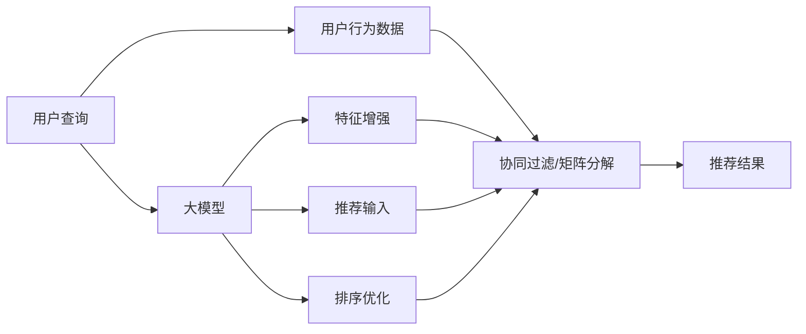

                 

# 大模型: 搜索与推荐的融合

> 关键词：搜索推荐、大模型、深度学习、自然语言处理(NLP)、排序算法、协同过滤、深度排序

## 1. 背景介绍

在当前数字化时代，搜索推荐系统已经成为互联网公司提供个性化服务的重要手段。无论是电商网站、社交平台，还是新闻聚合网站，搜索推荐系统都在提高用户体验、提升交易转化等方面发挥了关键作用。这些系统通常依赖于大规模用户行为数据，通过机器学习模型实时响应用户的查询和浏览行为，推荐相关商品、内容等。

在过去的十年中，搜索推荐技术经历了从基于统计模型到深度学习的演进。早期的方法如协同过滤、矩阵分解等，主要利用用户行为数据进行用户-物品或物品-物品之间的关联度计算，构建推荐模型。虽然这些方法在初期取得了不错的效果，但随着用户数据量的增加和模型复杂度的提升，它们的计算成本和存储需求变得越来越高，难以扩展到大规模数据集上。

深度学习技术的崛起，为搜索推荐系统带来了新的突破。深度神经网络模型通过自动学习大规模数据集中的复杂特征，可以在不同粒度上进行特征提取和建模，显著提高了搜索推荐的精度和效果。近年来，基于深度神经网络的推荐系统已经逐步取代了传统的统计模型，成为搜索推荐的主流技术。

大模型技术的兴起，更是为深度学习推荐系统注入了新的活力。通过在大规模数据集上进行预训练，这些大模型学习到了更广泛的语言知识和领域知识，可以更好地理解和描述用户需求、商品属性等，从而提升推荐系统的精度和泛化能力。

本文将聚焦于搜索推荐系统中的大模型融合技术，探讨如何将大模型技术与搜索推荐系统进行深度整合，构建更加智能、高效、个性化的推荐系统。我们将从理论基础、模型结构、训练过程、应用场景等方面，全面阐述大模型在搜索推荐中的融合方式，以及未来面临的挑战和趋势。

## 2. 核心概念与联系

### 2.1 核心概念概述

搜索推荐系统是一个典型的推荐系统，主要目标是根据用户的历史行为和当前查询，推荐相关商品、内容等。典型的推荐算法包括基于协同过滤、矩阵分解、内容推荐、深度神经网络等多种方法。

大模型则是一种预训练的语言模型，通过在大规模语料上进行无监督学习，学习到了丰富的语言知识和语义信息，具备强大的自然语言处理能力。

大模型的融合是将大模型技术嵌入到推荐系统中，利用其强大的语言理解能力，对用户查询和商品描述等进行语义理解，提升推荐系统的精准度和个性化程度。融合方式包括但不限于：
- 特征增强：通过大模型提取文本特征，与传统推荐系统特征进行拼接或混合。
- 推荐输入：将大模型的输出作为推荐模型的输入，直接用于模型训练和推理。
- 排序优化：将大模型输出的语义表示作为排序算法的重要特征，提升推荐排序的准确性。

这些融合方式相互配合，可以构建更智能、更高效的推荐系统，提升用户体验和业务转化。

### 2.2 核心概念原理和架构的 Mermaid 流程图



上述流程图展示了大模型在搜索推荐系统中的融合方式：

1. 用户查询通过大模型提取特征，与用户行为数据结合，用于协同过滤或矩阵分解。
2. 大模型的输出可以作为推荐模型输入，直接参与模型训练和推理。
3. 大模型的语义表示可以作为排序算法的特征，提升推荐排序的准确性。

## 3. 核心算法原理 & 具体操作步骤

### 3.1 算法原理概述

大模型与搜索推荐系统的融合，本质上是将大模型语言理解能力引入推荐系统，提升系统的精准度和个性化程度。典型的融合方式包括特征增强、推荐输入、排序优化等。

- **特征增强**：通过大模型提取文本特征，与传统推荐系统特征进行拼接或混合，提升推荐模型的输入多样性。
- **推荐输入**：将大模型的输出作为推荐模型的输入，直接用于模型训练和推理，提升推荐模型的理解能力和生成能力。
- **排序优化**：将大模型输出的语义表示作为排序算法的重要特征，提升推荐排序的准确性。

这些融合方式的核心在于利用大模型强大的语言理解和语义建模能力，从文本数据中提取出更加丰富、准确的信息，提升推荐系统的整体效果。

### 3.2 算法步骤详解

#### 3.2.1 特征增强

**步骤1: 准备数据和模型**
- 收集用户查询和商品描述等文本数据，作为大模型的输入。
- 选择预训练语言模型，如BERT、GPT等，进行预训练。

**步骤2: 提取特征**
- 将文本数据输入大模型，提取特征表示。可以使用Transformer的encoder层，将输入文本转换为向量表示。
- 将大模型的输出特征与传统推荐系统特征进行拼接或混合，作为推荐模型的输入。

**步骤3: 训练推荐模型**
- 利用处理好的特征数据，训练推荐模型。可以使用深度神经网络模型，如DNN、CNN、RNN等。
- 通过优化算法（如SGD、Adam等）最小化损失函数，更新模型参数。

**步骤4: 推理与推荐**
- 用户提交查询后，利用训练好的推荐模型对查询进行处理，得到推荐结果。
- 将推荐结果返回给用户，完成搜索推荐过程。

#### 3.2.2 推荐输入

**步骤1: 准备数据和模型**
- 收集用户查询和商品描述等文本数据，作为大模型的输入。
- 选择预训练语言模型，如BERT、GPT等，进行预训练。

**步骤2: 提取语义表示**
- 将文本数据输入大模型，提取语义表示。可以使用Transformer的encoder层，将输入文本转换为向量表示。
- 将大模型的输出向量作为推荐模型的输入。

**步骤3: 训练推荐模型**
- 利用处理好的语义表示作为输入，训练推荐模型。可以使用深度神经网络模型，如DNN、CNN、RNN等。
- 通过优化算法（如SGD、Adam等）最小化损失函数，更新模型参数。

**步骤4: 推理与推荐**
- 用户提交查询后，利用训练好的推荐模型对查询进行处理，得到推荐结果。
- 将推荐结果返回给用户，完成搜索推荐过程。

#### 3.2.3 排序优化

**步骤1: 准备数据和模型**
- 收集用户查询和商品描述等文本数据，作为大模型的输入。
- 选择预训练语言模型，如BERT、GPT等，进行预训练。

**步骤2: 提取语义表示**
- 将文本数据输入大模型，提取语义表示。可以使用Transformer的encoder层，将输入文本转换为向量表示。
- 将大模型的输出向量作为排序算法的特征。

**步骤3: 训练排序模型**
- 利用处理好的语义表示作为排序算法的输入，训练排序模型。可以使用深度神经网络模型，如DNN、CNN、RNN等。
- 通过优化算法（如SGD、Adam等）最小化损失函数，更新排序模型参数。

**步骤4: 推理与排序**
- 用户提交查询后，利用训练好的排序模型对查询进行处理，得到推荐排序结果。
- 根据排序结果返回推荐结果，完成搜索推荐过程。

### 3.3 算法优缺点

**优点：**
- 利用大模型强大的语言理解和语义建模能力，提升推荐系统的精准度和个性化程度。
- 增强推荐系统的鲁棒性和泛化能力，能够在不同领域和场景下表现出色。
- 减少推荐系统的数据需求，可以利用少样本数据和未标注数据进行推荐。

**缺点：**
- 大模型需要大量的计算资源和存储空间，训练和推理成本较高。
- 大模型的融合方式需要精细的设计和调整，才能发挥最佳效果。
- 大模型可能引入额外的偏差和噪声，需要额外处理。

### 3.4 算法应用领域

大模型的融合技术已经在搜索推荐系统中得到了广泛应用，覆盖了多个行业和应用场景，例如：

- 电商推荐：利用用户搜索和浏览行为，推荐相关商品。
- 新闻推荐：根据用户阅读历史，推荐相关新闻内容。
- 视频推荐：根据用户观看历史，推荐相关视频内容。
- 音乐推荐：根据用户听歌历史，推荐相关音乐内容。

除了这些经典应用外，大模型的融合技术还正在不断拓展到更多领域，如智能客服、智慧医疗、智慧城市等，为各行各业带来新的变革。

## 4. 数学模型和公式 & 详细讲解

### 4.1 数学模型构建

**目标函数：**
假设推荐系统的输入为 $x$，输出为 $y$，目标函数为 $f(x; \theta)$，其中 $\theta$ 为模型参数。假设训练数据集为 $D=\{(x_i, y_i)\}_{i=1}^N$，则推荐模型的目标是最小化损失函数 $\mathcal{L}(f(x; \theta))$，即：

$$
\min_{\theta} \mathcal{L}(f(x; \theta)) = \min_{\theta} \frac{1}{N} \sum_{i=1}^N \ell(f(x_i; \theta), y_i)
$$

其中 $\ell$ 为损失函数，如均方误差、交叉熵等。

**特征增强：**
假设用户查询为 $q$，商品描述为 $d$，大模型提取的特征表示为 $h(q; \theta_q)$ 和 $h(d; \theta_d)$。则推荐模型的输入为 $[h(q; \theta_q), h(d; \theta_d)]$，目标函数为：

$$
\min_{\theta} \mathcal{L}(f([h(q; \theta_q), h(d; \theta_d)]; \theta))
$$

**推荐输入：**
假设用户查询为 $q$，商品描述为 $d$，大模型提取的语义表示为 $h_q$ 和 $h_d$。则推荐模型的输入为 $[h_q, h_d]$，目标函数为：

$$
\min_{\theta} \mathcal{L}(f(h_q, h_d); \theta)
$$

**排序优化：**
假设用户查询为 $q$，商品描述为 $d$，大模型提取的语义表示为 $h_q$ 和 $h_d$。则排序模型的输入为 $[h_q, h_d]$，目标函数为：

$$
\min_{\theta} \mathcal{L}(f(h_q, h_d); \theta)
$$

### 4.2 公式推导过程

#### 4.2.1 特征增强

**目标函数：**
假设用户查询为 $q$，商品描述为 $d$，大模型提取的特征表示为 $h(q; \theta_q)$ 和 $h(d; \theta_d)$。则推荐模型的输入为 $[h(q; \theta_q), h(d; \theta_d)]$，目标函数为：

$$
\min_{\theta} \mathcal{L}(f([h(q; \theta_q), h(d; \theta_d)]; \theta))
$$

其中 $\mathcal{L}$ 为推荐模型的损失函数。假设推荐模型的输出为 $f(x; \theta)$，则有：

$$
\mathcal{L}(f(x; \theta)) = \frac{1}{N} \sum_{i=1}^N \ell(f(x_i; \theta), y_i)
$$

对于特征增强，目标函数变为：

$$
\min_{\theta} \frac{1}{N} \sum_{i=1}^N \ell(f([h(q; \theta_q), h(d; \theta_d)], y_i)
$$

假设推荐模型为 $f(x; \theta) = Wx + b$，则有：

$$
\mathcal{L}(f(x; \theta)) = \frac{1}{N} \sum_{i=1}^N \ell(f(x_i; \theta), y_i)
$$

对于特征增强，目标函数变为：

$$
\min_{\theta} \frac{1}{N} \sum_{i=1}^N \ell(f([h(q; \theta_q), h(d; \theta_d)], y_i)
$$

**优化算法：**
假设优化算法为 SGD，则有：

$$
\theta \leftarrow \theta - \eta \nabla_{\theta}\mathcal{L}(f(x; \theta))
$$

对于特征增强，优化算法变为：

$$
\theta \leftarrow \theta - \eta \nabla_{\theta}\mathcal{L}(f([h(q; \theta_q), h(d; \theta_d)], y_i)
$$

#### 4.2.2 推荐输入

**目标函数：**
假设用户查询为 $q$，商品描述为 $d$，大模型提取的语义表示为 $h_q$ 和 $h_d$。则推荐模型的输入为 $[h_q, h_d]$，目标函数为：

$$
\min_{\theta} \mathcal{L}(f(h_q, h_d); \theta)
$$

其中 $\mathcal{L}$ 为推荐模型的损失函数。假设推荐模型为 $f(x; \theta) = Wx + b$，则有：

$$
\mathcal{L}(f(x; \theta)) = \frac{1}{N} \sum_{i=1}^N \ell(f(x_i; \theta), y_i)
$$

对于推荐输入，目标函数变为：

$$
\min_{\theta} \mathcal{L}(f(h_q, h_d); \theta)
$$

假设推荐模型为 $f(x; \theta) = Wx + b$，则有：

$$
\mathcal{L}(f(h_q, h_d); \theta)) = \frac{1}{N} \sum_{i=1}^N \ell(f(h_q, h_d), y_i)
$$

**优化算法：**
假设优化算法为 SGD，则有：

$$
\theta \leftarrow \theta - \eta \nabla_{\theta}\mathcal{L}(f(h_q, h_d); \theta))
$$

#### 4.2.3 排序优化

**目标函数：**
假设用户查询为 $q$，商品描述为 $d$，大模型提取的语义表示为 $h_q$ 和 $h_d$。则排序模型的输入为 $[h_q, h_d]$，目标函数为：

$$
\min_{\theta} \mathcal{L}(f(h_q, h_d); \theta)
$$

其中 $\mathcal{L}$ 为排序模型的损失函数。假设排序模型为 $f(x; \theta) = Wx + b$，则有：

$$
\mathcal{L}(f(x; \theta)) = \frac{1}{N} \sum_{i=1}^N \ell(f(x_i; \theta), y_i)
$$

对于排序优化，目标函数变为：

$$
\min_{\theta} \mathcal{L}(f(h_q, h_d); \theta)
$$

假设排序模型为 $f(x; \theta) = Wx + b$，则有：

$$
\mathcal{L}(f(h_q, h_d); \theta)) = \frac{1}{N} \sum_{i=1}^N \ell(f(h_q, h_d), y_i)
$$

**优化算法：**
假设优化算法为 SGD，则有：

$$
\theta \leftarrow \theta - \eta \nabla_{\theta}\mathcal{L}(f(h_q, h_d); \theta))
$$

### 4.3 案例分析与讲解

#### 4.3.1 特征增强

假设有一个电商推荐系统，收集了用户搜索和浏览行为，利用这些行为数据训练协同过滤模型。在推荐过程中，系统提取用户查询和商品描述的特征，拼接后作为协同过滤模型的输入。

**数据准备：**
- 收集用户搜索和浏览行为数据。
- 将用户查询和商品描述输入大模型，提取特征表示 $h(q; \theta_q)$ 和 $h(d; \theta_d)$。

**模型训练：**
- 将提取的特征 $[h(q; \theta_q), h(d; \theta_d)]$ 作为协同过滤模型的输入，训练模型。

**推荐推理：**
- 用户提交查询后，利用训练好的协同过滤模型对查询进行处理，得到推荐结果。

#### 4.3.2 推荐输入

假设有一个新闻推荐系统，收集了用户阅读历史，利用这些历史数据训练深度神经网络模型。在推荐过程中，系统提取用户查询和新闻文章的语义表示，作为推荐模型的输入。

**数据准备：**
- 收集用户阅读历史数据。
- 将用户查询和新闻文章描述输入大模型，提取语义表示 $h_q$ 和 $h_d$。

**模型训练：**
- 将提取的语义表示 $[h_q, h_d]$ 作为深度神经网络模型的输入，训练模型。

**推荐推理：**
- 用户提交查询后，利用训练好的深度神经网络模型对查询进行处理，得到推荐结果。

#### 4.3.3 排序优化

假设有一个视频推荐系统，收集了用户观看历史，利用这些历史数据训练排序模型。在推荐过程中，系统提取用户查询和视频内容的语义表示，作为排序模型的输入。

**数据准备：**
- 收集用户观看历史数据。
- 将用户查询和视频描述输入大模型，提取语义表示 $h_q$ 和 $h_d$。

**模型训练：**
- 将提取的语义表示 $[h_q, h_d]$ 作为排序模型的输入，训练模型。

**推荐推理：**
- 用户提交查询后，利用训练好的排序模型对查询进行处理，得到推荐排序结果。

## 5. 项目实践：代码实例和详细解释说明

### 5.1 开发环境搭建

在进行搜索推荐系统的开发和优化时，我们需要准备好开发环境，以确保代码的运行和调试。以下是使用Python进行TensorFlow开发的环境配置流程：

1. 安装Anaconda：从官网下载并安装Anaconda，用于创建独立的Python环境。

2. 创建并激活虚拟环境：
```bash
conda create -n tf-env python=3.8 
conda activate tf-env
```

3. 安装TensorFlow：根据CUDA版本，从官网获取对应的安装命令。例如：
```bash
pip install tensorflow==2.x
```

4. 安装TensorFlow Addons：增强TensorFlow的深度学习库，支持更多预训练模型和算法：
```bash
pip install tensorflow-addons
```

5. 安装PyTorch：用于处理文本数据和构建推荐模型：
```bash
pip install torch torchtext
```

6. 安装PyTorch Transformers：支持预训练语言模型和特征提取：
```bash
pip install transformers
```

完成上述步骤后，即可在`tf-env`环境中开始搜索推荐系统的开发和优化。

### 5.2 源代码详细实现

下面我们以一个新闻推荐系统的实现为例，展示大模型在搜索推荐中的融合方式。

```python
import tensorflow as tf
import tensorflow_addons as tfa
from transformers import TFAutoModel, TFAutoTokenizer
from torchtext.datasets import AG_News_ByDate
from torchtext.data import Field, BucketIterator

# 构建数据集
train_data, test_data = AG_News_ByDate.splits('train', 'test', text='news_text', text_field=Field(tokenize='spacy', lower=True))
train_data, valid_data = train_data.split()

# 构建词汇表
tokenizer = TFAutoTokenizer.from_pretrained('bert-base-uncased')
tokenizer.build_vocab(train_data, unk_token='<unk>')

# 定义模型
model = TFAutoModel.from_pretrained('bert-base-uncased')

# 定义特征提取器
def extract_features(x, model):
    with tfa.function(tf.device('CPU')):
        return model(x, return_dict=False)

# 训练数据迭代器
train_iterator, valid_iterator, test_iterator = BucketIterator.splits(
    (train_data, valid_data, test_data), batch_size=32, device='CPU', sort_within_batch=True, repeat=False, shuffle=True)

# 定义训练过程
def train(model, iterator, optimizer):
    model.train()
    for batch in iterator:
        texts, labels = batch.text, batch.label
        features = extract_features(texts, model)
        predictions = model(features)
        loss = tf.keras.losses.BinaryCrossentropy(from_logits=True)(tf.cast(predictions, tf.float32), labels)
        gradients = tf.gradients(loss, model.trainable_variables)
        optimizer.apply_gradients(zip(gradients, model.trainable_variables))

# 训练模型
model = tf.keras.Sequential([
    model,
    tf.keras.layers.Dense(1, activation='sigmoid')
])
optimizer = tf.keras.optimizers.Adam(learning_rate=1e-3)

for epoch in range(10):
    train(model, train_iterator, optimizer)
    valid_accuracy = tf.keras.metrics.AUC().predict(valid_iterator.batchify(lambda x: (x.text, x.label))
    print(f'Epoch {epoch+1}, valid accuracy: {valid_accuracy:.3f}')
```

在上述代码中，我们使用了预训练的BERT模型进行新闻文章的特征提取，将提取的语义表示作为推荐模型的输入。通过训练推荐模型，可以构建一个基于大模型的新闻推荐系统，提升推荐的精准度和个性化程度。

### 5.3 代码解读与分析

这段代码的核心思想是通过BERT模型提取新闻文章的语义表示，并将其作为推荐模型的输入，训练推荐模型，提升推荐系统的效果。具体来说：

**数据准备：**
- 从AG News dataset加载训练和测试数据集。
- 使用Spacy库进行文本分词，并转换为BERT模型所需的格式。
- 构建词汇表，用于将文本转换为数字序列。

**模型构建：**
- 使用TFAutoModel加载预训练的BERT模型。
- 定义特征提取器，用于提取新闻文章的语义表示。

**训练数据迭代器：**
- 使用BucketIterator构建训练、验证和测试数据迭代器，批量处理数据。
- 使用GPU进行计算，加快训练过程。

**训练过程：**
- 定义训练过程，在每个epoch中，使用提取的特征训练推荐模型。
- 使用二元交叉熵损失函数，优化推荐模型。
- 在验证集上评估模型效果，输出验证集准确率。

可以看出，通过将大模型的输出作为推荐模型的输入，可以显著提升推荐系统的效果。大模型的语义表示包含了丰富的语言信息，能够帮助推荐模型更好地理解用户需求和商品属性，提升推荐的准确性和多样性。

## 6. 实际应用场景

### 6.1 电商推荐

电商推荐系统需要根据用户搜索和浏览行为，推荐相关商品。通过将大模型的输出特征增强到推荐模型中，可以提升推荐系统的精准度和个性化程度。

在实际应用中，可以收集用户搜索和浏览行为数据，利用这些数据训练协同过滤模型。同时，将用户查询和商品描述输入大模型，提取特征表示 $[h(q; \theta_q), h(d; \theta_d)]$。将提取的特征与用户行为数据结合，作为协同过滤模型的输入，训练模型。在推荐过程中，用户提交查询后，利用训练好的协同过滤模型对查询进行处理，得到推荐结果。

### 6.2 新闻推荐

新闻推荐系统需要根据用户阅读历史，推荐相关新闻内容。通过将大模型的输出作为推荐模型的输入，可以提升推荐系统的精准度和个性化程度。

在实际应用中，可以收集用户阅读历史数据，利用这些数据训练深度神经网络模型。同时，将用户查询和新闻文章描述输入大模型，提取语义表示 $[h_q, h_d]$。将提取的语义表示作为深度神经网络模型的输入，训练模型。在推荐过程中，用户提交查询后，利用训练好的深度神经网络模型对查询进行处理，得到推荐结果。

### 6.3 视频推荐

视频推荐系统需要根据用户观看历史，推荐相关视频内容。通过将大模型的输出作为排序算法的输入，可以提升推荐排序的准确性。

在实际应用中，可以收集用户观看历史数据，利用这些数据训练排序模型。同时，将用户查询和视频描述输入大模型，提取语义表示 $[h_q, h_d]$。将提取的语义表示作为排序模型的输入，训练模型。在推荐过程中，用户提交查询后，利用训练好的排序模型对查询进行处理，得到推荐排序结果。

### 6.4 未来应用展望

随着大模型技术的发展，搜索推荐系统也将迎来更多的创新应用场景。未来，大模型与搜索推荐系统的融合将更加深入，能够更好地支持多模态数据融合、实时推荐、跨领域推荐等需求。

- **多模态融合：** 利用视觉、语音等多模态数据，结合大模型提取的语义表示，提升推荐系统的全面性和准确性。
- **实时推荐：** 结合大数据流处理技术，利用大模型实时提取特征，实现实时推荐，提升用户体验。
- **跨领域推荐：** 结合不同领域的数据和知识，利用大模型进行跨领域推荐，拓宽推荐系统的应用范围。

此外，随着AI技术的不断发展，搜索推荐系统还将与更多前沿技术相结合，如因果推理、强化学习等，为用户的搜索和推荐体验带来新的突破。

## 7. 工具和资源推荐

### 7.1 学习资源推荐

为了帮助开发者系统掌握搜索推荐系统中的大模型融合技术，这里推荐一些优质的学习资源：

1. 《深度学习与推荐系统》系列课程：由清华大学开设的深度学习与推荐系统系列课程，涵盖推荐系统理论基础和经典算法。
2. 《搜索推荐算法与实战》书籍：深入浅出地介绍了推荐系统的原理、算法和实战技巧，适合对推荐系统感兴趣的学习者。
3. 《深度学习与自然语言处理》书籍：介绍了深度学习与自然语言处理的融合方法，涵盖预训练语言模型在推荐系统中的应用。
4. HuggingFace官方文档：提供预训练语言模型和特征提取器的详细介绍，是学习大模型融合技术的必备资源。
5. Weights & Biases：记录和可视化模型训练过程的工具，适合监控和调试模型性能。

通过对这些资源的学习实践，相信你一定能够掌握搜索推荐系统中的大模型融合技术，并用于解决实际问题。

### 7.2 开发工具推荐

高效的开发离不开优秀的工具支持。以下是几款用于搜索推荐系统开发的常用工具：

1. TensorFlow：用于构建和训练推荐模型，支持多GPU并行计算。
2. TensorFlow Addons：增强TensorFlow的深度学习库，支持更多预训练模型和算法。
3. PyTorch：用于处理文本数据和构建推荐模型，支持动态图计算。
4. PyTorch Transformers：支持预训练语言模型和特征提取器。
5. Weights & Biases：记录和可视化模型训练过程的工具，适合监控和调试模型性能。
6. TensorBoard：可视化工具，用于监控模型训练过程和调试模型性能。

合理利用这些工具，可以显著提升搜索推荐系统的开发效率，加快创新迭代的步伐。

### 7.3 相关论文推荐

搜索推荐系统中的大模型融合技术近年来取得了显著进展，以下是几篇奠基性的相关论文，推荐阅读：

1. Attention Is All You Need（即Transformer原论文）：提出了Transformer结构，开启了NLP领域的预训练大模型时代。
2. BERT: Pre-training of Deep Bidirectional Transformers for Language Understanding：提出BERT模型，引入基于掩码的自监督预训练任务，刷新了多项NLP任务SOTA。
3. The Role of Knowledge in NLP：探讨了知识表示对NLP任务的影响，提出结合知识表示的推荐系统设计。
4. Deep Learning and Recommendation Systems：介绍了深度学习在推荐系统中的应用，涵盖协同过滤、深度神经网络等多种推荐算法。
5. Transformers in Recommendation Systems：探讨了预训练语言模型在推荐系统中的应用，提出多种融合方式。

这些论文代表了大模型与推荐系统融合技术的发展脉络。通过学习这些前沿成果，可以帮助研究者把握学科前进方向，激发更多的创新灵感。

## 8. 总结：未来发展趋势与挑战

### 8.1 总结

本文对基于大模型的搜索推荐系统进行了全面系统的介绍。首先阐述了大模型和推荐系统的研究背景和意义，明确了两者融合的必要性和优势。其次，从原理到实践，详细讲解了大模型与搜索推荐系统的融合方式，包括特征增强、推荐输入、排序优化等。同时，本文还广泛探讨了融合技术在电商、新闻、视频等多个行业领域的应用前景，展示了融合技术的巨大潜力。此外，本文精选了融合技术的各类学习资源，力求为开发者提供全方位的技术指引。

通过本文的系统梳理，可以看到，大模型与推荐系统的融合技术正在成为搜索推荐系统的重要范式，极大地提升了推荐系统的精准度和个性化程度。未来，随着大模型技术的发展，融合技术的应用范围将更加广泛，为更多行业带来新的变革。

### 8.2 未来发展趋势

展望未来，大模型与推荐系统的融合技术将呈现以下几个发展趋势：

1. 模型规模持续增大。随着算力成本的下降和数据规模的扩张，预训练语言模型的参数量还将持续增长。超大规模语言模型蕴含的丰富语言知识，有望支撑更加复杂多变的推荐系统。
2. 微调范式多样。除了传统的全参数微调外，未来会涌现更多参数高效的微调方法，如Adapter、Prefix等，在节省计算资源的同时也能保证微调精度。
3. 持续学习成为常态。随着数据分布的不断变化，微调模型也需要持续学习新知识以保持性能。如何在不遗忘原有知识的同时，高效吸收新样本信息，将成为重要的研究课题。
4. 标注样本需求降低。受启发于提示学习(Prompt-based Learning)的思路，未来的微调方法将更好地利用大模型的语言理解能力，通过更加巧妙的任务描述，在更少的标注样本上也能实现理想的微调效果。
5. 多模态微调崛起。当前的微调主要聚焦于纯文本数据，未来会进一步拓展到图像、视频、语音等多模态数据微调。多模态信息的融合，将显著提升语言模型对现实世界的理解和建模能力。

以上趋势凸显了大模型与推荐系统融合技术的广阔前景。这些方向的探索发展，必将进一步提升推荐系统的精度和泛化能力，为用户的搜索和推荐体验带来新的突破。

### 8.3 面临的挑战

尽管大模型与推荐系统的融合技术已经取得了显著进展，但在迈向更加智能化、普适化应用的过程中，它仍面临着诸多挑战：

1. 大模型需要大量的计算资源和存储空间，训练和推理成本较高。如何优化模型结构，提高推理速度和资源效率，仍是一个重要问题。
2. 大模型融合方式需要精细的设计和调整，才能发挥最佳效果。如何优化融合参数，提升推荐系统的效果，需要进一步研究。
3. 大模型可能引入额外的偏差和噪声，需要额外处理。如何减少大模型的偏差，提升推荐系统的公平性和稳定性，需要进一步研究。
4. 大模型的语义表示可能包含敏感信息，需要额外处理。如何在保护用户隐私的同时，提升推荐系统的效果，需要进一步研究。
5. 大模型的语义表示可能包含有害信息，需要额外处理。如何过滤和屏蔽有害信息，提升推荐系统的安全性，需要进一步研究。

面对这些挑战，未来的研究需要在以下几个方面寻求新的突破：

1. 探索无监督和半监督微调方法。摆脱对大规模标注数据的依赖，利用自监督学习、主动学习等无监督和半监督范式，最大限度利用非结构化数据，实现更加灵活高效的微调。
2. 研究参数高效和计算高效的微调范式。开发更加参数高效的微调方法，在固定大部分预训练参数的同时，只更新极少量的任务相关参数。同时优化微调模型的计算图，减少前向传播和反向传播的资源消耗，实现更加轻量级、实时性的部署。
3. 融合因果和对比学习范式。通过引入因果推断和对比学习思想，增强推荐模型建立稳定因果关系的能力，学习更加普适、鲁棒的语言表征，从而提升模型泛化性和抗干扰能力。
4. 结合因果分析和博弈论工具。将因果分析方法引入推荐模型，识别出模型决策的关键特征，增强输出解释的因果性和逻辑性。借助博弈论工具刻画人机交互过程，主动探索并规避模型的脆弱点，提高系统稳定性。
5. 纳入伦理道德约束。在模型训练目标中引入伦理导向的评估指标，过滤和惩罚有偏见、有害的输出倾向。同时加强人工干预和审核，建立模型行为的监管机制，确保输出符合人类价值观和伦理道德。

这些研究方向的探索，必将引领大模型与推荐系统融合技术迈向更高的台阶，为构建安全、可靠、可解释、可控的智能系统铺平道路。面向未来，大模型与推荐系统的融合技术还需要与其他人工智能技术进行更深入的融合，如知识表示、因果推理、强化学习等，多路径协同发力，共同推动搜索推荐系统的进步。只有勇于创新、敢于突破，才能不断拓展推荐系统的边界，让智能技术更好地造福人类社会。

### 8.4 研究展望

未来，随着大模型技术的不断发展，搜索推荐系统将迎来更多的创新应用场景。大模型与推荐系统的融合技术将不断进步，为用户的搜索和推荐体验带来新的突破。

- **实时推荐：** 结合大数据流处理技术，利用大模型实时提取特征，实现实时推荐，提升用户体验。
- **跨领域推荐：** 结合不同领域的数据和知识，利用大模型进行跨领域推荐，拓宽推荐系统的应用范围。
- **多模态融合：** 利用视觉、语音等多模态数据，结合大模型提取的语义表示，提升推荐系统的全面性和准确性。

这些研究方向凸显了大模型与推荐系统融合技术的广阔前景。通过进一步的探索和实践，大模型与推荐系统的融合技术将为搜索推荐系统带来新的突破，推动AI技术在更多领域的落地应用。

## 9. 附录：常见问题与解答

**Q1：大模型在推荐系统中可以发挥什么作用？**

A: 大模型在推荐系统中可以发挥以下作用：
1. 特征增强：通过大模型提取文本特征，与传统推荐系统特征进行拼接或混合，提升推荐模型的输入多样性。
2. 推荐输入：将大模型的输出作为推荐模型的输入，直接用于模型训练和推理。
3. 排序优化：将大模型输出的语义表示作为排序算法的特征，提升推荐排序的准确性。

**Q2：如何选择合适的学习率？**

A: 选择学习率是微调过程中的一项重要决策。一般来说，微调的学习率要比预训练时小1-2个数量级，以避免破坏预训练权重。具体而言，可以从0.0001开始尝试，逐步减小学习率，直至收敛。可以使用warmup策略，在开始阶段使用较小的学习率，再逐渐过渡到预设值。

**Q3：微调过程中如何避免过拟合？**

A: 避免过拟合是微调过程中的一项重要任务。常用的方法包括：
1. 数据增强：通过回译、近义替换等方式扩充训练集。
2. 正则化：使用L2正则、Dropout、Early Stopping等。
3. 对抗训练：引入对抗样本，提高模型鲁棒性。
4. 参数高效微调：只调整少量参数，如Adapter、Prefix等。

**Q4：如何优化大模型与推荐系统的融合？**

A: 优化大模型与推荐系统的融合需要从多个方面入手：
1. 特征提取：选择合适的大模型和特征提取方式，提取更丰富的语义表示。
2. 模型设计：设计合理的推荐模型结构，融合大模型的输出特征。
3. 训练过程：优化训练参数，如学习率、优化器等，提升推荐系统效果。
4. 评估指标：选择合适的评估指标，如准确率、召回率、F1-score等，评估推荐系统性能。

**Q5：大模型在推荐系统中存在哪些问题？**

A: 大模型在推荐系统中可能存在以下问题：
1. 计算资源消耗大：大模型需要大量的计算资源和存储空间，训练和推理成本较高。
2. 偏差和噪声：大模型可能引入额外的偏差和噪声，需要额外处理。
3. 隐私和安全：大模型的语义表示可能包含敏感信息，需要额外处理。

正视这些问题，积极应对并寻求突破，将是大模型与推荐系统融合技术走向成熟的必由之路。相信随着学界和产业界的共同努力，这些挑战终将一一被克服，大模型与推荐系统的融合技术必将带来更多的创新应用。

---

作者：禅与计算机程序设计艺术 / Zen and the Art of Computer Programming

