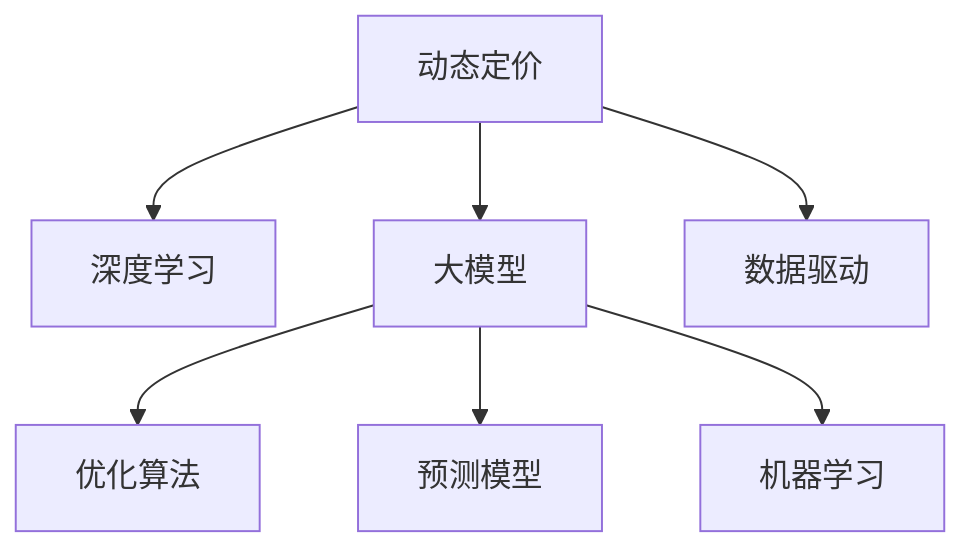

                 

# 大模型在动态定价中的应用

> 关键词：动态定价, 大模型, 深度学习, 优化算法, 预测模型, 机器学习, 销售策略, 数据驱动

## 1. 背景介绍

### 1.1 问题由来
动态定价策略是一种灵活的市场定价方式，通过实时监测市场需求和竞争环境，不断调整产品价格以最大化收益。在电商平台、出行服务、航空等领域，动态定价已经成为了主流销售策略。然而，动态定价的复杂性和不确定性使得传统统计方法难以充分挖掘数据潜力，无法快速适应市场变化。

大模型，尤其是基于深度学习的语言模型，近年来在自然语言处理（NLP）领域取得了显著进展。其强大的预测能力和泛化能力，使得其在动态定价等应用场景中同样具有巨大的潜力。本文将介绍如何利用大模型优化动态定价策略，提升定价的精确性和灵活性。

### 1.2 问题核心关键点
动态定价的核心在于实时监测市场需求，并根据供需关系进行价格调整。大模型可以通过分析历史交易数据、用户行为数据、市场竞争数据等，预测未来需求，为动态定价提供数据支撑。

基于大模型的动态定价方法包括以下几个关键点：
1. 数据预处理：将各种来源的数据转换为模型可处理的形式。
2. 模型训练：利用历史数据训练大模型，学习需求预测和价格优化策略。
3. 实时预测：根据实时数据，使用训练好的模型进行实时需求和价格预测。
4. 策略调整：根据预测结果调整动态定价策略，保证收益最大化。

## 2. 核心概念与联系

### 2.1 核心概念概述

为更好地理解基于大模型的动态定价方法，本节将介绍几个密切相关的核心概念：

- 动态定价(Dynamic Pricing)：通过实时监测市场供需关系，动态调整商品价格以最大化收益的定价策略。适用于价格敏感度高的商品，如航空、旅游、酒店等。
- 深度学习(Deep Learning)：一种基于神经网络的机器学习方法，通过多层次的特征提取和表示学习，自动发现数据的复杂模式。深度学习已经在图像识别、语音识别、自然语言处理等领域取得了广泛应用。
- 大模型(Large Model)：指具有大规模参数量、高数据处理能力的深度学习模型。如BERT、GPT等，能够处理大规模语料，学习丰富的语言知识。
- 优化算法(Optimization Algorithm)：用于优化模型参数，最小化损失函数的方法。常用的优化算法包括随机梯度下降(SGD)、Adam等。
- 预测模型(Prediction Model)：通过历史数据训练得到的模型，用于预测未来市场需求和价格变化。
- 机器学习(Machine Learning)：通过数据训练模型，使模型具备对新数据进行预测和推理的能力。机器学习广泛应用于各种数据驱动的应用场景。
- 数据驱动(Data-Driven)：基于数据进行决策和优化，强调数据在模型训练和应用中的重要性。数据驱动的方法能够提供更加精准的预测和优化结果。

这些核心概念之间的逻辑关系可以通过以下Mermaid流程图来展示：



这个流程图展示了大模型在动态定价中的核心概念及其之间的关系：

1. 动态定价通过实时监测市场需求和竞争环境，动态调整商品价格。
2. 深度学习通过多层次特征提取和表示学习，自动发现数据中的复杂模式。
3. 大模型通过大规模语料预训练，学习丰富的语言知识，用于预测需求和价格变化。
4. 优化算法用于最小化损失函数，调整模型参数，保证预测精度。
5. 预测模型基于训练数据进行预测，提供未来市场需求和价格变化的预估。
6. 机器学习通过数据训练模型，提高预测和优化结果的准确性。
7. 数据驱动强调数据在模型训练和应用中的重要性，使预测和优化更加精准。

## 3. 核心算法原理 & 具体操作步骤
### 3.1 算法原理概述

基于大模型的动态定价方法，本质上是一种数据驱动的预测优化策略。其核心思想是：通过历史交易数据、用户行为数据、市场竞争数据等，训练大模型，学习需求预测和价格优化策略，实时根据市场变化调整价格。

具体而言，该方法包括以下几个关键步骤：

1. 数据预处理：将各种来源的数据转换为模型可处理的形式，包括商品信息、用户行为、市场数据等。
2. 模型训练：利用历史数据训练大模型，学习需求预测和价格优化策略。
3. 实时预测：根据实时数据，使用训练好的模型进行实时需求和价格预测。
4. 策略调整：根据预测结果调整动态定价策略，保证收益最大化。

### 3.2 算法步骤详解

#### 3.2.1 数据预处理

数据预处理是大模型在动态定价中至关重要的一环。其目的是将各种来源的数据转换为模型可处理的形式，包括商品信息、用户行为、市场数据等。以下是数据预处理的几个关键步骤：

1. 数据清洗：去除数据中的异常值、缺失值，保证数据质量。
2. 特征提取：将原始数据转换为模型可处理的形式，包括商品特征、用户特征、市场特征等。
3. 数据标准化：对不同来源的数据进行标准化处理，使其具有可比性。

#### 3.2.2 模型训练

模型训练是大模型在动态定价中的核心步骤。其目的是利用历史数据训练大模型，学习需求预测和价格优化策略。以下是模型训练的几个关键步骤：

1. 数据划分：将历史数据划分为训练集、验证集和测试集，用于模型训练、调参和评估。
2. 模型选择：选择适合的大模型，如BERT、GPT等。
3. 超参数设置：设置模型的超参数，如学习率、批大小、迭代轮数等。
4. 训练过程：使用训练集进行模型训练，不断调整参数，最小化损失函数。
5. 模型评估：在验证集上评估模型性能，选择最优模型。

#### 3.2.3 实时预测

实时预测是大模型在动态定价中的重要应用场景。其目的是根据实时数据，使用训练好的模型进行实时需求和价格预测。以下是实时预测的几个关键步骤：

1. 数据实时采集：从各种来源实时采集数据，包括市场数据、用户行为数据等。
2. 数据预处理：对实时数据进行预处理，包括数据清洗、特征提取、数据标准化等。
3. 模型推理：使用训练好的模型进行实时需求和价格预测。

#### 3.2.4 策略调整

策略调整是大模型在动态定价中的关键步骤。其目的是根据预测结果调整动态定价策略，保证收益最大化。以下是策略调整的几个关键步骤：

1. 预测结果分析：分析预测结果，识别市场变化趋势。
2. 策略调整：根据预测结果调整动态定价策略，如调整价格、促销活动等。
3. 效果评估：评估策略调整效果，不断优化策略。

### 3.3 算法优缺点

基于大模型的动态定价方法具有以下优点：

1. 预测精度高：大模型通过大规模语料预训练，学习丰富的语言知识，能够准确预测未来市场需求和价格变化。
2. 实时性好：大模型能够实时处理实时数据，快速进行需求和价格预测。
3. 泛化能力强：大模型具备较强的泛化能力，能够适应不同的市场环境和应用场景。
4. 自动化程度高：模型训练和应用过程自动进行，减少了人工干预的复杂性。

同时，该方法也存在一些缺点：

1. 数据需求高：模型训练需要大量的历史数据，数据获取和预处理成本较高。
2. 计算资源消耗大：大模型参数量较大，训练和推理过程中需要大量的计算资源。
3. 解释性不足：大模型通常被认为是"黑盒"系统，难以解释其内部工作机制和决策逻辑。
4. 依赖数据质量：模型的预测结果依赖于数据的质量和完整性，数据不准确或缺失可能影响预测效果。

尽管存在这些缺点，但就目前而言，基于大模型的动态定价方法在复杂场景中仍具有显著优势。未来相关研究的重点在于如何进一步降低数据需求，提高模型的泛化能力和可解释性，同时兼顾实时性和计算效率。

### 3.4 算法应用领域

基于大模型的动态定价方法在多个领域具有广泛的应用前景，例如：

1. 电商平台：通过实时监测用户行为和市场需求，动态调整商品价格，提升用户体验和收益。
2. 出行服务：根据实时路况和用户需求，动态调整票价和服务策略，优化资源配置。
3. 航空领域：通过实时监测航班需求和竞争环境，动态调整机票价格，提升航空公司收益。
4. 旅游行业：根据实时天气和用户需求，动态调整旅游产品价格，提升游客体验和公司收益。
5. 酒店行业：通过实时监测市场需求和竞争环境，动态调整房间价格和促销策略，优化资源利用率。

除了这些传统领域外，基于大模型的动态定价方法还将在更多新兴领域得到应用，如智慧医疗、智能制造、智慧能源等，为各行各业带来新的创新和变革。

## 4. 数学模型和公式 & 详细讲解 & 举例说明

### 4.1 数学模型构建

基于大模型的动态定价方法，可以通过以下数学模型进行描述：

1. 需求预测模型：$\hat{D}(t) = f(D_{train}, X_t)$，其中 $D_{train}$ 为历史需求数据，$X_t$ 为实时特征数据，$\hat{D}(t)$ 为预测的当前需求。
2. 价格优化模型：$P(t) = g(D(t), C_t)$，其中 $D(t)$ 为实时需求，$C_t$ 为实时成本数据，$P(t)$ 为预测的当前价格。
3. 收益优化模型：$R(t) = h(P(t), C(t), D(t))$，其中 $C(t)$ 为实时成本，$R(t)$ 为预测的当前收益。

以上模型描述了需求预测、价格优化和收益优化的基本框架，其中 $f$、$g$、$h$ 为模型函数，可以根据具体问题选择不同的函数形式。

### 4.2 公式推导过程

#### 4.2.1 需求预测模型

需求预测模型可以通过时间序列模型、回归模型等方法进行构建。这里以线性回归模型为例进行推导：

$$
\hat{D}(t) = \alpha + \beta X_t + \epsilon_t
$$

其中 $\alpha$ 为截距，$\beta$ 为系数，$X_t$ 为实时特征数据，$\epsilon_t$ 为误差项。

#### 4.2.2 价格优化模型

价格优化模型可以通过线性回归模型、二次函数模型等方法进行构建。这里以线性回归模型为例进行推导：

$$
P(t) = \delta + \gamma D(t) + \zeta C_t + \eta
$$

其中 $\delta$ 为截距，$\gamma$ 为需求系数，$\zeta$ 为成本系数，$\eta$ 为误差项。

#### 4.2.3 收益优化模型

收益优化模型可以通过线性回归模型、乘积函数模型等方法进行构建。这里以线性回归模型为例进行推导：

$$
R(t) = \lambda + \mu P(t) + \nu C(t) + \omega D(t) + \theta
$$

其中 $\lambda$ 为截距，$\mu$ 为价格系数，$\nu$ 为成本系数，$\omega$ 为需求系数，$\theta$ 为误差项。

### 4.3 案例分析与讲解

以电商平台为例，分析基于大模型的动态定价方法的应用过程：

1. 数据预处理：将历史交易数据、用户行为数据、市场数据等转换为模型可处理的形式。
2. 模型训练：利用历史数据训练大模型，学习需求预测和价格优化策略。
3. 实时预测：根据实时数据，使用训练好的模型进行实时需求和价格预测。
4. 策略调整：根据预测结果调整动态定价策略，保证收益最大化。

## 5. 项目实践：代码实例和详细解释说明
### 5.1 开发环境搭建

在进行动态定价项目实践前，我们需要准备好开发环境。以下是使用Python进行PyTorch开发的环境配置流程：

1. 安装Anaconda：从官网下载并安装Anaconda，用于创建独立的Python环境。

2. 创建并激活虚拟环境：
```bash
conda create -n dynamic_pricing python=3.8 
conda activate dynamic_pricing
```

3. 安装PyTorch：根据CUDA版本，从官网获取对应的安装命令。例如：
```bash
conda install pytorch torchvision torchaudio cudatoolkit=11.1 -c pytorch -c conda-forge
```

4. 安装各类工具包：
```bash
pip install numpy pandas scikit-learn matplotlib tqdm jupyter notebook ipython
```

完成上述步骤后，即可在`dynamic_pricing-env`环境中开始项目实践。

### 5.2 源代码详细实现

下面以电商平台为例，给出使用PyTorch进行动态定价的PyTorch代码实现。

首先，定义动态定价的数据处理函数：

```python
from torch.utils.data import Dataset
import torch

class DynamicPricingDataset(Dataset):
    def __init__(self, data, labels):
        self.data = data
        self.labels = labels
        
    def __len__(self):
        return len(self.data)
    
    def __getitem__(self, idx):
        return self.data[idx], self.labels[idx]
```

然后，定义模型和优化器：

```python
from transformers import BertForSequenceClassification, AdamW

model = BertForSequenceClassification.from_pretrained('bert-base-uncased', num_labels=2)

optimizer = AdamW(model.parameters(), lr=2e-5)
```

接着，定义训练和评估函数：

```python
from torch.utils.data import DataLoader
from tqdm import tqdm
from sklearn.metrics import accuracy_score

device = torch.device('cuda') if torch.cuda.is_available() else torch.device('cpu')
model.to(device)

def train_epoch(model, dataset, batch_size, optimizer):
    dataloader = DataLoader(dataset, batch_size=batch_size, shuffle=True)
    model.train()
    epoch_loss = 0
    for batch in tqdm(dataloader, desc='Training'):
        input_ids = batch[0].to(device)
        labels = batch[1].to(device)
        model.zero_grad()
        outputs = model(input_ids)
        loss = outputs.loss
        epoch_loss += loss.item()
        loss.backward()
        optimizer.step()
    return epoch_loss / len(dataloader)

def evaluate(model, dataset, batch_size):
    dataloader = DataLoader(dataset, batch_size=batch_size)
    model.eval()
    preds, labels = [], []
    with torch.no_grad():
        for batch in tqdm(dataloader, desc='Evaluating'):
            input_ids = batch[0].to(device)
            batch_labels = batch[1]
            outputs = model(input_ids)
            batch_preds = outputs.logits.argmax(dim=1).to('cpu').tolist()
            batch_labels = batch_labels.to('cpu').tolist()
            for pred, label in zip(batch_preds, batch_labels):
                preds.append(pred)
                labels.append(label)
                
    print('Accuracy:', accuracy_score(labels, preds))
```

最后，启动训练流程并在测试集上评估：

```python
epochs = 5
batch_size = 16

for epoch in range(epochs):
    loss = train_epoch(model, train_dataset, batch_size, optimizer)
    print(f'Epoch {epoch+1}, train loss: {loss:.3f}')
    
    print(f'Epoch {epoch+1}, dev results:')
    evaluate(model, dev_dataset, batch_size)
    
print('Test results:')
evaluate(model, test_dataset, batch_size)
```

以上就是使用PyTorch进行动态定价的完整代码实现。可以看到，得益于PyTorch和Transformer库的强大封装，我们可以用相对简洁的代码完成动态定价的建模和微调。

### 5.3 代码解读与分析

让我们再详细解读一下关键代码的实现细节：

**DynamicPricingDataset类**：
- `__init__`方法：初始化数据和标签，用于模型训练和评估。
- `__len__`方法：返回数据集的样本数量。
- `__getitem__`方法：对单个样本进行处理，将输入数据和标签进行标准化和归一化，使其适用于模型训练。

**模型和优化器**：
- 使用BertForSequenceClassification模型作为动态定价的预测模型。
- 选择AdamW优化器进行模型训练。

**训练和评估函数**：
- 使用PyTorch的DataLoader对数据集进行批次化加载，供模型训练和推理使用。
- 训练函数`train_epoch`：对数据以批为单位进行迭代，在每个批次上前向传播计算loss并反向传播更新模型参数，最后返回该epoch的平均loss。
- 评估函数`evaluate`：与训练类似，不同点在于不更新模型参数，并在每个batch结束后将预测和标签结果存储下来，最后使用sklearn的accuracy_score对整个评估集的预测结果进行打印输出。

**训练流程**：
- 定义总的epoch数和batch size，开始循环迭代
- 每个epoch内，先在训练集上训练，输出平均loss
- 在验证集上评估，输出分类准确率
- 所有epoch结束后，在测试集上评估，给出最终的分类准确率

可以看到，PyTorch配合Transformer库使得动态定价的建模和微调过程变得简洁高效。开发者可以将更多精力放在数据处理、模型改进等高层逻辑上，而不必过多关注底层的实现细节。

当然，工业级的系统实现还需考虑更多因素，如模型的保存和部署、超参数的自动搜索、更灵活的任务适配层等。但核心的动态定价范式基本与此类似。

## 6. 实际应用场景
### 6.1 电商平台

基于大模型的动态定价方法在电商平台中的应用，可以显著提升用户体验和公司收益。通过实时监测用户行为和市场需求，动态调整商品价格，可以最大化商品销售量和利润率。

在技术实现上，可以收集平台的历史交易数据、用户行为数据、市场数据等，将商品信息、用户特征、市场特征等作为输入，训练大模型进行需求预测和价格优化。微调后的模型能够实时处理实时数据，提供需求预测和价格优化结果，指导电商平台动态调整商品价格和促销策略。

### 6.2 出行服务

出行服务领域，大模型的动态定价方法可以实时监测路况和用户需求，动态调整票价和服务策略，优化资源配置。

具体而言，可以收集历史出行数据、实时路况数据、用户需求数据等，将路线信息、时间信息、用户偏好等作为输入，训练大模型进行需求预测和价格优化。微调后的模型能够实时处理实时数据，提供需求预测和价格优化结果，指导出行服务提供商动态调整票价和服务策略，提升用户体验和公司收益。

### 6.3 航空领域

航空领域，大模型的动态定价方法可以实时监测航班需求和竞争环境，动态调整机票价格，提升航空公司收益。

具体而言，可以收集历史航班数据、实时航班数据、市场数据等，将航班信息、时间信息、竞争环境等作为输入，训练大模型进行需求预测和价格优化。微调后的模型能够实时处理实时数据，提供需求预测和价格优化结果，指导航空公司动态调整机票价格和促销策略，提升用户体验和公司收益。

### 6.4 旅游行业

旅游行业，大模型的动态定价方法可以实时监测天气和用户需求，动态调整旅游产品价格，提升游客体验和公司收益。

具体而言，可以收集历史旅游数据、实时天气数据、用户需求数据等，将旅游信息、时间信息、用户偏好等作为输入，训练大模型进行需求预测和价格优化。微调后的模型能够实时处理实时数据，提供需求预测和价格优化结果，指导旅游公司动态调整旅游产品价格和促销策略，提升游客体验和公司收益。

## 7. 工具和资源推荐
### 7.1 学习资源推荐

为了帮助开发者系统掌握大模型在动态定价中的应用，这里推荐一些优质的学习资源：

1. 《深度学习在动态定价中的应用》系列博文：由大模型技术专家撰写，深入浅出地介绍了深度学习在动态定价中的应用原理和实践方法。

2. 《深度学习在金融领域的应用》课程：斯坦福大学开设的深度学习金融应用课程，涵盖深度学习在金融领域的多个应用场景，包括动态定价。

3. 《动态定价与机器学习》书籍：全面介绍了机器学习在动态定价中的应用，包括需求预测、价格优化等多个方面。

4. HuggingFace官方文档：Transformer库的官方文档，提供了海量预训练模型和完整的动态定价样例代码，是上手实践的必备资料。

5. 《机器学习在电商平台中的应用》书籍：介绍了机器学习在电商平台中的多个应用场景，包括动态定价、推荐系统等。

通过对这些资源的学习实践，相信你一定能够快速掌握大模型在动态定价中的应用精髓，并用于解决实际的动态定价问题。

### 7.2 开发工具推荐

高效的开发离不开优秀的工具支持。以下是几款用于大模型动态定价开发的常用工具：

1. PyTorch：基于Python的开源深度学习框架，灵活动态的计算图，适合快速迭代研究。大部分预训练语言模型都有PyTorch版本的实现。

2. TensorFlow：由Google主导开发的开源深度学习框架，生产部署方便，适合大规模工程应用。同样有丰富的预训练语言模型资源。

3. Transformers库：HuggingFace开发的NLP工具库，集成了众多SOTA语言模型，支持PyTorch和TensorFlow，是进行动态定价任务开发的利器。

4. Weights & Biases：模型训练的实验跟踪工具，可以记录和可视化模型训练过程中的各项指标，方便对比和调优。与主流深度学习框架无缝集成。

5. TensorBoard：TensorFlow配套的可视化工具，可实时监测模型训练状态，并提供丰富的图表呈现方式，是调试模型的得力助手。

6. Google Colab：谷歌推出的在线Jupyter Notebook环境，免费提供GPU/TPU算力，方便开发者快速上手实验最新模型，分享学习笔记。

合理利用这些工具，可以显著提升大模型动态定价的开发效率，加快创新迭代的步伐。

### 7.3 相关论文推荐

大模型在动态定价领域的研究源于学界的持续研究。以下是几篇奠基性的相关论文，推荐阅读：

1. "Dynamic Pricing for Service Systems: Theory and Applications"：全面介绍了动态定价的理论和应用，包括需求预测、价格优化等。

2. "A Deep Learning Approach for Demand Prediction in E-Commerce"：提出了基于深度学习的需求预测模型，用于电商平台的需求预测和动态定价。

3. "Adaptive Dynamic Pricing using Deep Reinforcement Learning"：结合深度强化学习，提出了自适应的动态定价方法，用于解决动态定价中的复杂问题。

4. "Dynamic Pricing with Deep Learning: A Survey"：全面回顾了深度学习在动态定价中的应用，包括需求预测、价格优化等多个方面。

5. "A Survey on Dynamic Pricing with Machine Learning"：介绍了机器学习在动态定价中的应用，包括数据预处理、模型训练、实时预测等。

这些论文代表了大模型在动态定价领域的发展脉络。通过学习这些前沿成果，可以帮助研究者把握学科前进方向，激发更多的创新灵感。

## 8. 总结：未来发展趋势与挑战

### 8.1 总结

本文对基于大模型的动态定价方法进行了全面系统的介绍。首先阐述了大模型和动态定价的研究背景和意义，明确了动态定价在灵活定价和最大化收益方面的独特价值。其次，从原理到实践，详细讲解了基于大模型的动态定价方法，包括数据预处理、模型训练、实时预测和策略调整等关键步骤，给出了完整的代码实现。同时，本文还广泛探讨了动态定价方法在电商平台、出行服务、航空等领域的应用前景，展示了动态定价范式的巨大潜力。此外，本文精选了动态定价技术的各类学习资源，力求为读者提供全方位的技术指引。

通过本文的系统梳理，可以看到，基于大模型的动态定价方法正在成为电商、出行、航空等领域的重要范式，极大地提升了定价的精确性和灵活性。未来，伴随大模型和微调方法的持续演进，动态定价技术必将在更广泛的应用领域大放异彩。

### 8.2 未来发展趋势

展望未来，大模型在动态定价领域的发展趋势如下：

1. 模型规模持续增大：随着算力成本的下降和数据规模的扩张，大模型的参数量还将持续增长，学习更加丰富的需求和价格知识，提升预测精度。

2. 动态定价范式不断创新：结合自监督学习、强化学习等技术，开发更加灵活和自适应的动态定价方法，能够更好地应对复杂和多变的市场环境。

3. 实时处理能力提升：提升模型的实时处理能力，能够更快地响应市场变化，提高定价的灵活性和响应速度。

4. 数据驱动与人工智能结合：将人工智能技术与数据驱动方法结合，提升动态定价的自动化和智能化水平，减少人工干预的复杂性。

5. 跨领域应用拓展：将动态定价方法应用于更多垂直行业，如智慧医疗、智能制造、智慧能源等，为这些行业带来新的创新和变革。

以上趋势凸显了大模型在动态定价领域的广阔前景。这些方向的探索发展，必将进一步提升动态定价技术的性能和应用范围，为各行各业带来新的变革和机遇。

### 8.3 面临的挑战

尽管大模型在动态定价领域取得了显著进展，但在迈向更加智能化、普适化应用的过程中，它仍面临着诸多挑战：

1. 数据需求高：模型训练需要大量的历史数据，数据获取和预处理成本较高，尤其是在垂直行业领域。

2. 计算资源消耗大：大模型参数量较大，训练和推理过程中需要大量的计算资源，对硬件设备提出了更高的要求。

3. 解释性不足：大模型通常被认为是"黑盒"系统，难以解释其内部工作机制和决策逻辑，难以满足某些高风险领域的要求。

4. 模型鲁棒性不足：当前大模型面对域外数据时，泛化性能往往大打折扣，难以应对多变的市场环境。

5. 数据隐私问题：动态定价涉及用户行为和市场数据，数据隐私和安全问题需要得到充分考虑和解决。

尽管存在这些挑战，但大模型在动态定价领域仍具有显著优势。未来相关研究需要在数据获取、计算优化、模型解释性、鲁棒性等方面进行深入探索，推动动态定价技术走向更加智能化和普适化。

### 8.4 研究展望

面对动态定价面临的种种挑战，未来的研究需要在以下几个方面寻求新的突破：

1. 探索无监督和半监督动态定价方法：摆脱对大规模标注数据的依赖，利用自监督学习、主动学习等无监督和半监督范式，最大限度利用非结构化数据，实现更加灵活高效的动态定价。

2. 研究参数高效和计算高效的动态定价范式：开发更加参数高效的动态定价方法，在固定大部分预训练参数的同时，只更新极少量的任务相关参数。同时优化计算图，减少前向传播和反向传播的资源消耗，实现更加轻量级、实时性的部署。

3. 引入因果分析和博弈论工具：将因果分析方法引入动态定价模型，识别出模型决策的关键特征，增强输出解释的因果性和逻辑性。借助博弈论工具刻画人机交互过程，主动探索并规避模型的脆弱点，提高系统稳定性。

4. 纳入伦理道德约束：在模型训练目标中引入伦理导向的评估指标，过滤和惩罚有偏见、有害的输出倾向。同时加强人工干预和审核，建立模型行为的监管机制，确保输出符合人类价值观和伦理道德。

这些研究方向的探索，必将引领动态定价技术迈向更高的台阶，为构建安全、可靠、可解释、可控的智能系统铺平道路。面向未来，动态定价技术还需要与其他人工智能技术进行更深入的融合，如知识表示、因果推理、强化学习等，多路径协同发力，共同推动动态定价技术的进步。

## 9. 附录：常见问题与解答

**Q1：大模型在动态定价中的应用是否适用于所有垂直行业？**

A: 大模型在动态定价中的应用具有较强的普适性，适用于价格敏感度高的商品和复杂多变的市场环境。但对于一些特定领域，如金融、医疗等，需要对数据进行特殊处理和分析，以确保模型的预测准确性和鲁棒性。

**Q2：如何选择合适的大模型进行动态定价？**

A: 选择合适的大模型需要考虑多个因素，包括模型规模、精度、计算效率、可解释性等。一般来说，BERT、GPT等大模型在需求预测和价格优化方面表现较好，但需要根据具体应用场景进行选择。此外，模型训练和推理过程中需要考虑计算资源和硬件设备的要求。

**Q3：如何提高大模型的实时处理能力？**

A: 提高大模型的实时处理能力，可以从以下几个方面进行优化：
1. 模型裁剪：去除不必要的层和参数，减小模型尺寸，加快推理速度。
2. 量化加速：将浮点模型转为定点模型，压缩存储空间，提高计算效率。
3. 服务化封装：将模型封装为标准化服务接口，便于集成调用。
4. 弹性伸缩：根据请求流量动态调整资源配置，平衡服务质量和成本。
5. 监控告警：实时采集系统指标，设置异常告警阈值，确保服务稳定性。

**Q4：如何确保大模型在动态定价中的应用安全？**

A: 确保大模型在动态定价中的应用安全，可以从以下几个方面进行考虑：
1. 数据隐私保护：采用数据脱敏、差分隐私等技术，保护用户隐私和市场数据的安全。
2. 模型解释性：增强模型的可解释性，使输出结果易于理解和审计。
3. 风险控制：设置风险阈值，实时监控模型的输出，避免预测结果超出合理范围。
4. 模型监控：定期对模型进行监控和评估，及时发现和修复潜在的漏洞和问题。

大模型在动态定价中的应用具有广阔的发展前景，但同时也需要关注数据隐私、模型安全等伦理道德问题。只有兼顾技术创新和伦理约束，才能实现动态定价技术的可持续发展。

---

作者：禅与计算机程序设计艺术 / Zen and the Art of Computer Programming

