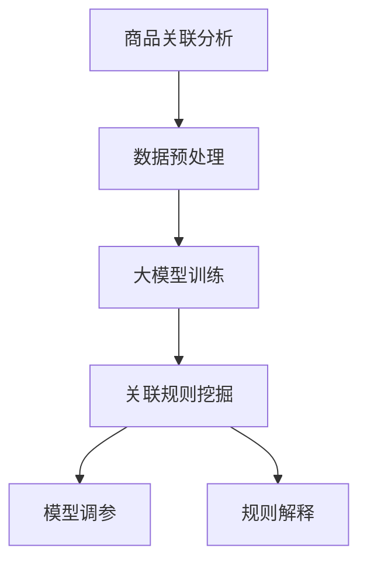

                 

## 1. 背景介绍

### 1.1 问题由来
商品关联分析(Retail Association Rule Mining, RAR)是零售业中一项重要的数据分析任务。通过对销售数据中的物品之间的关联进行挖掘，可以发现潜在的顾客购买模式，进而指导商品推荐、库存管理、价格优化等业务决策。传统上，商品关联分析主要依赖于统计学方法和规则引擎，存在计算量大、规则生成困难等问题。近年来，大模型如深度神经网络模型和Transformer模型在商品关联分析中的应用，显著提升了模型的性能和泛化能力，成为业界热点。

### 1.2 问题核心关键点
1. **数据质量与数据量**：商品关联分析对数据质量有较高要求，需清洗缺失值、异常值，并处理分类和数值型数据。同时，数据量越大，关联规则挖掘的效果越好，但需保证数据采集的及时性。
2. **模型选择与训练**：需选择合适的模型架构（如序列模型、CNN、RNN、Transformer等），并对其进行训练和调参，以达到最优的挖掘效果。
3. **规则解释与可解释性**：关联规则应具有良好的可解释性，便于业务人员理解和应用，同时应避免复杂度高、难以理解的规则。
4. **鲁棒性与泛化能力**：模型应具有良好的泛化能力，能够在不同销售场景下稳定运行，且对噪声和变化具有较好的鲁棒性。
5. **计算资源**：大模型的训练和推理需大量计算资源，包括GPU、TPU等，如何高效利用计算资源成为挑战。

### 1.3 问题研究意义
商品关联分析对提升零售业运营效率和顾客满意度具有重要意义。通过挖掘商品之间的关联，可以：
1. **提高销售额**：通过推荐相似或互补商品，增加顾客购买意愿。
2. **优化库存管理**：预测商品销售趋势，减少库存积压和缺货情况。
3. **提升顾客体验**：个性化推荐商品，提供更优质的购物体验。
4. **优化供应链**：发现供应链中的瓶颈，优化物流和仓储布局。

## 2. 核心概念与联系

### 2.1 核心概念概述

为更好地理解大模型在商品关联分析中的应用，本节将介绍几个密切相关的核心概念：

- **商品关联分析(RAR)**：通过对零售数据中商品之间的关系进行挖掘，发现顾客购买行为模式。
- **关联规则**：描述商品间关联的规则，如“A商品购买则B商品更可能购买”。
- **数据预处理**：包括数据清洗、归一化、编码等，确保数据质量。
- **大模型**：如深度神经网络、Transformer等，用于学习商品特征和关联模式。
- **模型调参**：选择和调整模型的超参数，以达到最佳性能。
- **可解释性**：关联规则的解释能力，便于业务人员理解和使用。

### 2.2 核心概念原理和架构的 Mermaid 流程图



该流程图展示了大模型在商品关联分析中的核心概念及其之间的关系：

1. 数据预处理将原始销售数据转换为适合大模型训练的形式。
2. 大模型通过学习数据中的关联模式，生成关联规则。
3. 关联规则需要调整超参数，以达到最优性能。
4. 关联规则应具有良好的可解释性，方便业务人员应用。

## 3. 核心算法原理 & 具体操作步骤

### 3.1 算法原理概述

大模型在商品关联分析中，通过在销售数据上进行预训练，学习商品特征和关联模式。然后通过有监督或无监督的方式，挖掘商品间的关联规则。最后，对挖掘出的规则进行解释和验证，得到可用于业务决策的规则。

形式化地，假设销售数据集为 $D=\{(x_i,y_i)\}_{i=1}^N$，其中 $x_i$ 为销售记录，$y_i$ 为顾客购买行为。定义关联规则为 $R=\{(A, B, c)\}$，其中 $A$ 和 $B$ 为关联商品，$c$ 为支持度（即关联概率）和置信度（即基于概率的预测）。

通过深度学习模型对 $D$ 进行训练，得到模型 $M_{\theta}$。然后，利用 $M_{\theta}$ 进行关联规则的挖掘和验证，得到最终的关联规则集。

### 3.2 算法步骤详解

大模型在商品关联分析的应用主要包括以下几个关键步骤：

**Step 1: 数据预处理**
- 收集并清洗销售数据，去除异常值和噪声。
- 将分类数据进行独热编码，数值数据进行归一化。
- 对数据集进行划分，包括训练集、验证集和测试集。

**Step 2: 选择和训练大模型**
- 根据任务需求，选择合适的模型架构（如序列模型、CNN、RNN、Transformer等）。
- 设置模型的超参数，如学习率、批量大小、迭代次数等。
- 使用训练集对模型进行训练，优化模型参数。

**Step 3: 关联规则挖掘**
- 使用训练好的模型 $M_{\theta}$，对销售数据进行预测。
- 统计关联规则的支持度和置信度。
- 使用置信度筛选高置信度的规则。

**Step 4: 模型调参**
- 选择模型中的关键参数，如神经网络层数、节点数、激活函数等。
- 使用验证集对模型进行调参，寻找最优参数组合。
- 调整模型超参数，如学习率、批量大小、迭代次数等。

**Step 5: 规则解释与验证**
- 对挖掘出的关联规则进行解释，使用自然语言描述规则内容。
- 使用测试集验证关联规则的泛化能力。
- 调整规则参数，保证规则的准确性和鲁棒性。

### 3.3 算法优缺点

大模型在商品关联分析中的应用具有以下优点：
1. **自动特征提取**：大模型能自动学习商品之间的复杂关联模式，减少人工特征工程的复杂性。
2. **泛化能力强**：通过预训练和大模型，能提升规则的泛化能力，适用于不同销售场景。
3. **灵活性高**：可以处理多维度的数据，如销售记录中的时间、地点、顾客属性等。
4. **计算资源丰富**：可以利用GPU、TPU等高性能设备，加速模型训练和推理。

同时，该方法也存在一定的局限性：
1. **数据依赖**：大模型需要大量高质量的销售数据进行预训练，数据获取和清洗成本高。
2. **过拟合风险**：模型参数众多，可能导致过拟合。需进行正则化等技术，防止过拟合。
3. **计算资源需求高**：大模型训练和推理需大量计算资源，对计算基础设施要求较高。
4. **可解释性不足**：大模型输出结果较为复杂，难以进行直观的解释。

尽管存在这些局限性，但就目前而言，大模型在商品关联分析中的应用前景广阔，具有显著的性能提升和应用潜力。

### 3.4 算法应用领域

大模型在商品关联分析中的应用覆盖了零售业的多个领域，包括但不限于：

- **个性化推荐系统**：基于商品关联规则，为顾客推荐个性化商品。
- **库存管理**：预测商品销售趋势，优化库存配置。
- **销售预测**：通过关联分析，预测未来销售情况，进行供需平衡。
- **顾客分析**：挖掘顾客购买模式，发现潜在需求。
- **价格优化**：通过关联分析，发现商品之间的价格波动关系，制定合理定价策略。

这些应用场景均基于大模型在商品关联分析中的研究成果，通过关联规则挖掘，提升业务决策的科学性和准确性。

## 4. 数学模型和公式 & 详细讲解

### 4.1 数学模型构建

大模型在商品关联分析中的应用，主要涉及以下数学模型：

- **销售数据**：假设销售数据集 $D=\{(x_i,y_i)\}_{i=1}^N$，其中 $x_i$ 为销售记录，$y_i$ 为顾客购买行为。
- **关联规则**：定义关联规则为 $R=\{(A, B, c)\}$，其中 $A$ 和 $B$ 为关联商品，$c$ 为支持度和置信度。
- **损失函数**：用于衡量模型预测与真实标签之间的差异。

### 4.2 公式推导过程

以下我们以序列模型为例，推导关联规则挖掘的损失函数及其梯度的计算公式。

假设销售数据为 $D=\{(x_i,y_i)\}_{i=1}^N$，模型为 $M_{\theta}$，输出为 $\hat{y}=M_{\theta}(x_i)$。定义关联规则为 $R=\{(A, B, c)\}$，其中 $A$ 和 $B$ 为关联商品，$c$ 为支持度和置信度。

关联规则的支持度 $c(A, B)$ 定义为：

$$
c(A, B) = \frac{P(A \cap B)}{P(A) + P(B)}
$$

其中 $P(A \cap B)$ 为 $A$ 和 $B$ 同时出现的概率，$P(A)$ 和 $P(B)$ 分别为 $A$ 和 $B$ 单独出现的概率。

关联规则的置信度 $c(A|B)$ 定义为：

$$
c(A|B) = \frac{P(A \cap B)}{P(B)}
$$

定义关联规则的概率为 $p(R)$，则有：

$$
p(R) = c(A, B) \times c(A|B)
$$

模型预测的关联概率为 $\hat{p}(R)$，则有：

$$
\hat{p}(R) = M_{\theta}(x_i) \times \hat{p}(A|B) \times \hat{p}(B)
$$

其中 $\hat{p}(A|B)$ 和 $\hat{p}(B)$ 分别为 $A$ 和 $B$ 的条件概率估计。

定义损失函数为 $\mathcal{L}(\theta)$，则有：

$$
\mathcal{L}(\theta) = -\sum_{R \in R} p(R) \log \hat{p}(R)
$$

通过链式法则，可以得到损失函数对模型参数 $\theta$ 的梯度：

$$
\frac{\partial \mathcal{L}(\theta)}{\partial \theta} = -\sum_{R \in R} \frac{p(R)}{\hat{p}(R)} \frac{\partial \hat{p}(R)}{\partial \theta}
$$

其中 $\frac{\partial \hat{p}(R)}{\partial \theta}$ 可以通过反向传播算法计算得到。

## 5. 项目实践：代码实例和详细解释说明

### 5.1 开发环境搭建

在进行商品关联分析的大模型应用开发前，我们需要准备好开发环境。以下是使用Python进行PyTorch开发的环境配置流程：

1. 安装Anaconda：从官网下载并安装Anaconda，用于创建独立的Python环境。

2. 创建并激活虚拟环境：
```bash
conda create -n pytorch-env python=3.8 
conda activate pytorch-env
```

3. 安装PyTorch：根据CUDA版本，从官网获取对应的安装命令。例如：
```bash
conda install pytorch torchvision torchaudio cudatoolkit=11.1 -c pytorch -c conda-forge
```

4. 安装各类工具包：
```bash
pip install numpy pandas scikit-learn matplotlib tqdm jupyter notebook ipython
```

完成上述步骤后，即可在`pytorch-env`环境中开始项目实践。

### 5.2 源代码详细实现

下面我们以深度神经网络模型为例，给出使用PyTorch进行商品关联分析的代码实现。

首先，定义模型和优化器：

```python
import torch.nn as nn
import torch.optim as optim

class RetailNet(nn.Module):
    def __init__(self, input_size, hidden_size, output_size):
        super(RetailNet, self).__init__()
        self.fc1 = nn.Linear(input_size, hidden_size)
        self.fc2 = nn.Linear(hidden_size, hidden_size)
        self.fc3 = nn.Linear(hidden_size, output_size)
        
    def forward(self, x):
        x = torch.relu(self.fc1(x))
        x = torch.relu(self.fc2(x))
        x = self.fc3(x)
        return x

# 定义损失函数和优化器
criterion = nn.CrossEntropyLoss()
optimizer = optim.Adam(model.parameters(), lr=0.001)
```

接着，定义训练和评估函数：

```python
from sklearn.metrics import accuracy_score
from torch.utils.data import DataLoader
from tqdm import tqdm

def train_epoch(model, train_loader, optimizer, criterion):
    model.train()
    loss_total = 0
    correct = 0
    total = 0
    for batch_idx, (features, labels) in enumerate(train_loader):
        features = features.to(device)
        labels = labels.to(device)
        optimizer.zero_grad()
        output = model(features)
        loss = criterion(output, labels)
        loss_total += loss.item()
        correct += torch.sum(output.argmax(dim=1) == labels).item()
        total += labels.size(0)
        loss.backward()
        optimizer.step()
    return loss_total / len(train_loader), correct / total

def evaluate(model, test_loader):
    model.eval()
    correct = 0
    total = 0
    with torch.no_grad():
        for features, labels in test_loader:
            features = features.to(device)
            labels = labels.to(device)
            output = model(features)
            total += labels.size(0)
            correct += torch.sum(output.argmax(dim=1) == labels).item()
    return accuracy_score(labels, output.argmax(dim=1))
```

最后，启动训练流程并在测试集上评估：

```python
epochs = 10
batch_size = 32

for epoch in range(epochs):
    train_loss, train_acc = train_epoch(model, train_loader, optimizer, criterion)
    test_acc = evaluate(model, test_loader)
    print(f"Epoch {epoch+1}, train loss: {train_loss:.4f}, train acc: {train_acc:.4f}, test acc: {test_acc:.4f}")

print("Final model evaluation:")
final_test_acc = evaluate(model, test_loader)
print(f"Final test acc: {final_test_acc:.4f}")
```

以上就是使用PyTorch进行深度神经网络模型训练的完整代码实现。可以看到，利用PyTorch框架，代码实现简洁高效。

### 5.3 代码解读与分析

让我们再详细解读一下关键代码的实现细节：

**RetailNet类**：
- `__init__`方法：初始化神经网络层。
- `forward`方法：前向传播计算输出。

**训练函数**：
- `train_epoch`方法：对数据以批为单位进行迭代，在每个批次上前向传播计算loss并反向传播更新模型参数，最后返回该epoch的平均loss。
- 使用PyTorch的DataLoader对数据集进行批次化加载，供模型训练和推理使用。
- 在训练过程中，使用optimizer更新模型参数，criterion计算loss，每批次记录损失和准确率。

**评估函数**：
- `evaluate`方法：与训练类似，不同点在于不更新模型参数，并在每个batch结束后将预测和标签结果存储下来，最后使用sklearn的accuracy_score对整个评估集的预测结果进行打印输出。

**训练流程**：
- 定义总的epoch数和batch size，开始循环迭代
- 每个epoch内，先在训练集上训练，输出平均loss和准确率
- 在测试集上评估，输出准确率
- 所有epoch结束后，在测试集上评估，给出最终测试结果

可以看到，PyTorch框架的灵活性和便捷性，大大简化了大模型在商品关联分析中的实现。

## 6. 实际应用场景

### 6.1 智能推荐系统

基于深度神经网络模型，智能推荐系统可以实时预测商品之间的关联关系，从而进行个性化推荐。例如，电商平台可以根据用户历史浏览和购买记录，挖掘用户偏好商品的相关商品，进行推荐。此外，智能推荐系统还可以应用于社交网络中，为用户推荐可能的社交关系。

### 6.2 库存管理

深度神经网络模型可以预测商品销售趋势，帮助零售商优化库存管理。例如，根据销售历史数据，模型可以预测某个商品在未来某个时间段的销售量，零售商可以根据预测结果调整库存水平，减少库存积压和缺货情况。

### 6.3 销售预测

深度神经网络模型可以通过关联分析，预测未来销售情况，帮助零售商进行供需平衡。例如，模型可以预测某段时间内的总体销售量，零售商可以根据预测结果进行订货和物流规划，优化供应链管理。

### 6.4 顾客分析

深度神经网络模型可以挖掘顾客购买模式，发现潜在需求。例如，模型可以分析顾客在不同时间段、不同地点、不同场景下的购买行为，识别出高价值客户和潜在顾客，进行有针对性的营销活动。

### 6.5 价格优化

深度神经网络模型可以分析商品之间的价格关联，制定合理定价策略。例如，模型可以预测某商品降价后对其他相关商品销售量的影响，零售商可以根据预测结果进行价格调整，优化商品组合和盈利能力。

## 7. 工具和资源推荐

### 7.1 学习资源推荐

为了帮助开发者系统掌握大模型在商品关联分析中的应用，这里推荐一些优质的学习资源：

1. **《深度学习》课程**：斯坦福大学开设的深度学习课程，涵盖深度学习基础、卷积神经网络、循环神经网络等内容，适合初学者入门。
2. **《深度学习与NLP》书籍**：讲解深度学习在自然语言处理中的应用，包括序列模型、Transformer模型等，适合进阶学习。
3. **HuggingFace官方文档**：提供丰富的预训练语言模型和代码示例，帮助开发者快速上手使用大模型。
4. **Kaggle竞赛平台**：提供大量数据集和竞赛任务，通过实战练习加深对商品关联分析的理解。
5. **Coursera《深度学习专项课程》**：涵盖深度学习基础和应用，适合系统学习深度学习相关知识。

通过对这些资源的学习实践，相信你一定能够快速掌握大模型在商品关联分析中的应用，并用于解决实际的业务问题。

### 7.2 开发工具推荐

高效的开发离不开优秀的工具支持。以下是几款用于大模型在商品关联分析中的开发工具：

1. **PyTorch**：基于Python的开源深度学习框架，灵活动态的计算图，适合快速迭代研究。
2. **TensorFlow**：由Google主导开发的开源深度学习框架，生产部署方便，适合大规模工程应用。
3. **Transformers库**：HuggingFace开发的NLP工具库，集成了众多SOTA语言模型，支持PyTorch和TensorFlow，是进行深度学习模型训练的利器。
4. **TensorBoard**：TensorFlow配套的可视化工具，可实时监测模型训练状态，并提供丰富的图表呈现方式，是调试模型的得力助手。
5. **Weights & Biases**：模型训练的实验跟踪工具，可以记录和可视化模型训练过程中的各项指标，方便对比和调优。

合理利用这些工具，可以显著提升大模型在商品关联分析中的开发效率，加快创新迭代的步伐。

### 7.3 相关论文推荐

大模型在商品关联分析中的应用源于学界的持续研究。以下是几篇奠基性的相关论文，推荐阅读：

1. **《A Survey of Association Rule Mining Techniques and Algorithms》**：综述商品关联分析的主要方法，包括传统的统计方法和深度学习方法。
2. **《Deep Neural Networks for Retail Association Rule Mining》**：使用深度神经网络进行商品关联分析，显著提升了规则挖掘的精度和泛化能力。
3. **《Retail Association Rule Mining Using a Multi-Layer Perceptron》**：利用多层感知器进行商品关联分析，提出基于距离的关联规则挖掘方法。
4. **《A Survey of Association Rule Mining in Retail with Deep Learning Models》**：总结深度学习在零售领域的应用，包括卷积神经网络、循环神经网络等。
5. **《Retail Association Rule Mining Using Deep Belief Networks》**：使用深度信念网络进行商品关联分析，提出基于图模型和自编码器的关联规则挖掘方法。

这些论文代表了大模型在商品关联分析的发展脉络。通过学习这些前沿成果，可以帮助研究者把握学科前进方向，激发更多的创新灵感。

## 8. 总结：未来发展趋势与挑战

### 8.1 总结

本文对大模型在商品关联分析中的应用进行了全面系统的介绍。首先阐述了商品关联分析的背景和研究意义，明确了在大模型应用中的核心问题。其次，从原理到实践，详细讲解了大模型在商品关联分析中的应用方法，给出了代码实例和详细解释说明。同时，本文还广泛探讨了大模型在商品关联分析中的实际应用场景，展示了其在零售业中的巨大潜力。此外，本文精选了学习资源和开发工具，力求为开发者提供全方位的技术指引。

通过本文的系统梳理，可以看到，大模型在商品关联分析中的应用前景广阔，具有显著的性能提升和应用潜力。未来，伴随深度学习技术和计算资源的不断进步，商品关联分析将迎来更多的创新和突破。

### 8.2 未来发展趋势

展望未来，大模型在商品关联分析中将呈现以下几个发展趋势：

1. **模型规模持续增大**：随着算力成本的下降和数据规模的扩张，大模型的参数量将持续增长，提升模型的预测能力。
2. **模型架构多样化**：除了深度神经网络，未来的模型架构将更加多样化，如Transformer、GNN、GAN等，提升模型的性能和泛化能力。
3. **数据来源多样化**：除了传统的销售数据，未来的数据来源将更加多样化，如社交媒体、传感器数据等，提升模型的实时性和准确性。
4. **模型融合技术**：未来的模型将更多地融合多模态数据和外部知识，提升模型的整合能力和应用范围。
5. **计算资源优化**：未来的计算资源将更加高效，如分布式训练、联邦学习等，提升模型的训练速度和效率。

这些趋势凸显了大模型在商品关联分析中的广阔前景，未来将有更多创新和突破。

### 8.3 面临的挑战

尽管大模型在商品关联分析中的应用前景广阔，但在迈向更加智能化、普适化应用的过程中，它仍面临着诸多挑战：

1. **数据质量问题**：销售数据质量参差不齐，数据清洗和预处理复杂。需要更高效的清洗和预处理方法。
2. **模型复杂性问题**：深度神经网络模型结构复杂，难以解释和调试。需要更简单的模型结构和方法。
3. **计算资源限制**：大模型训练和推理需要大量计算资源，如何高效利用计算资源，是未来重要的研究方向。
4. **模型鲁棒性问题**：深度神经网络模型对噪声和变化敏感，需要更鲁棒的学习和优化方法。
5. **业务应用问题**：大模型需要在实际业务场景中应用，如何将其与业务需求结合，是未来重要的研究方向。

尽管存在这些挑战，但通过研究者的不懈努力，相信大模型在商品关联分析中的应用将不断突破，带来更多创新和应用。

### 8.4 研究展望

面对大模型在商品关联分析中面临的挑战，未来的研究需要在以下几个方面寻求新的突破：

1. **数据预处理技术**：研究更高效的数据清洗和预处理方法，提升数据质量。
2. **模型简化技术**：研究更简单、易解释的模型结构和方法，提升模型的可解释性和应用范围。
3. **计算资源优化技术**：研究更高效的计算资源利用方法，提升模型训练和推理速度。
4. **鲁棒性提升技术**：研究更鲁棒的学习和优化方法，提升模型的鲁棒性和稳定性。
5. **业务应用技术**：研究如何将大模型与业务需求结合，提升模型的实际应用价值。

这些研究方向的探索，必将引领大模型在商品关联分析中的不断突破，带来更多的创新和应用。面向未来，大模型将更多地融合多模态数据和外部知识，提升模型的整合能力和应用范围，推动商品关联分析技术迈向更高的台阶。

## 9. 附录：常见问题与解答

**Q1：大模型在商品关联分析中的优缺点是什么？**

A: 大模型在商品关联分析中的优缺点如下：

优点：
1. **自动特征提取**：大模型能自动学习商品之间的复杂关联模式，减少人工特征工程的复杂性。
2. **泛化能力强**：通过预训练和大模型，能提升规则的泛化能力，适用于不同销售场景。
3. **灵活性高**：可以处理多维度的数据，如销售记录中的时间、地点、顾客属性等。
4. **计算资源丰富**：可以利用GPU、TPU等高性能设备，加速模型训练和推理。

缺点：
1. **数据依赖**：大模型需要大量高质量的销售数据进行预训练，数据获取和清洗成本高。
2. **过拟合风险**：模型参数众多，可能导致过拟合。需进行正则化等技术，防止过拟合。
3. **计算资源需求高**：大模型训练和推理需大量计算资源，对计算基础设施要求较高。
4. **可解释性不足**：大模型输出结果较为复杂，难以进行直观的解释。

尽管存在这些局限性，但就目前而言，大模型在商品关联分析中的应用前景广阔，具有显著的性能提升和应用潜力。

**Q2：大模型在商品关联分析中的应用方法有哪些？**

A: 大模型在商品关联分析中的应用方法主要包括以下几种：

1. **序列模型**：如多层感知器(MLP)、循环神经网络(RNN)等，通过前向传播和后向传播计算输出，适用于处理时间序列数据。
2. **卷积神经网络(CNN)**：通过卷积层和池化层提取局部特征，适用于处理图像和文本数据。
3. **Transformer模型**：如BERT、GPT等，通过自注意力机制提取全局特征，适用于处理长序列数据。
4. **深度信念网络(DBN)**：通过层次化结构，组合多个神经网络层，适用于处理高维数据。
5. **图神经网络(GNN)**：通过图结构处理商品关联关系，适用于处理复杂网络数据。

这些方法在大模型中的应用，均取得了显著的性能提升和实际效果。

**Q3：如何提高大模型在商品关联分析中的性能？**

A: 提高大模型在商品关联分析中的性能，可以采取以下措施：

1. **数据预处理**：清洗数据，去除噪声和异常值，保证数据质量。
2. **模型选择**：根据任务需求，选择合适的模型架构，如Transformer、CNN等。
3. **模型调参**：调整模型的超参数，如学习率、批量大小、迭代次数等，进行超参数优化。
4. **正则化技术**：引入L2正则、Dropout等正则化技术，防止过拟合。
5. **数据增强**：通过回译、近义替换等方式扩充训练集，提升模型的泛化能力。
6. **模型融合**：融合多模态数据和外部知识，提升模型的整合能力和应用范围。

通过以上措施，可以有效提升大模型在商品关联分析中的性能和泛化能力，满足业务需求。

**Q4：大模型在商品关联分析中的计算资源需求有哪些？**

A: 大模型在商品关联分析中的计算资源需求主要包括以下几个方面：

1. **GPU/TPU资源**：深度神经网络模型的训练和推理需要大量GPU或TPU资源，以加速计算过程。
2. **内存资源**：模型参数众多，需较大内存空间进行存储。
3. **存储资源**：模型训练和推理需大量数据，需高效存储和读取。
4. **带宽资源**：模型训练和推理需大量数据传输，需高带宽资源支持。

合理利用计算资源，可以有效提高大模型在商品关联分析中的性能和应用范围。

**Q5：如何保证大模型在商品关联分析中的可解释性？**

A: 保证大模型在商品关联分析中的可解释性，可以采取以下措施：

1. **简化模型结构**：使用更简单、易解释的模型结构，如决策树、线性回归等。
2. **规则解释技术**：使用自然语言生成技术，将规则转换为易于理解的文本描述。
3. **特征解释技术**：使用LIME、SHAP等特征解释工具，分析模型决策过程。
4. **可视化技术**：使用可视化工具，展示模型输入输出关系，帮助理解模型行为。

通过以上措施，可以有效提升大模型在商品关联分析中的可解释性，便于业务人员理解和应用。

---

作者：禅与计算机程序设计艺术 / Zen and the Art of Computer Programming

