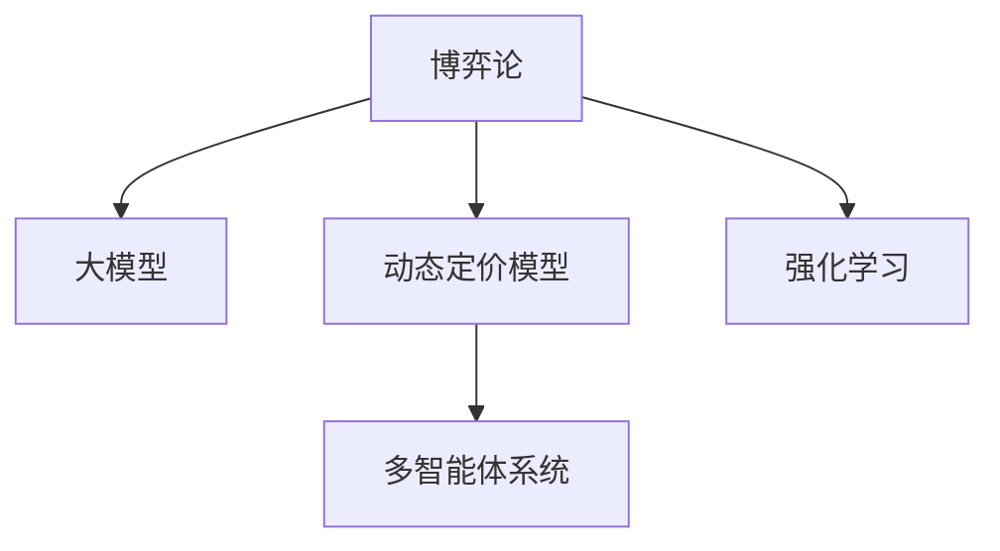

                 

# 大模型在商品定价策略中的博弈论应用

> 关键词：博弈论,大模型,商品定价,强化学习,市场竞争,定价优化,动态定价

## 1. 背景介绍

### 1.1 问题由来

在当前复杂多变的市场环境中，商品定价策略已经成为企业竞争的关键手段之一。随着电商平台的崛起和大数据技术的应用，消费者行为和市场需求呈现出多样化和动态化的趋势。如何通过智能化的定价策略，提升产品竞争力，实现利润最大化，成为零售企业面临的重要挑战。

在这一背景下，博弈论和大模型技术的应用，为商品定价策略带来了新的思路和工具。博弈论是研究博弈参与者之间策略互动的理论，广泛应用于经济、政治、军事等领域。大模型则是指通过大规模无标签数据预训练，并能够在小规模有标签数据上进行微调的高性能机器学习模型，如BERT、GPT等。将博弈论和大模型结合，构建智能化的商品定价模型，可以帮助企业更好地应对市场变化，提高决策效率和精准度。

### 1.2 问题核心关键点

1. **博弈论基础**：博弈论通过描述博弈参与者之间的策略互动，分析市场竞争态势和定价行为。
2. **大模型优势**：大模型能够通过学习海量数据，构建复杂的语言模型，准确理解和生成文本信息。
3. **动态定价模型**：通过博弈论和大模型结合，构建动态定价模型，实时调整商品价格，以应对市场变化和消费者行为。
4. **强化学习应用**：利用强化学习算法，训练模型在多次博弈中优化定价策略，提高模型泛化能力。

### 1.3 问题研究意义

研究大模型在商品定价策略中的应用，对于提升企业竞争力和市场响应速度，具有重要意义：

1. **提高决策效率**：大模型能够快速分析市场数据，提供定价建议，缩短决策周期。
2. **优化定价策略**：博弈论和大模型的结合，能够捕捉市场动态和消费者行为，优化定价策略，实现利润最大化。
3. **增强应对能力**：动态定价模型能够实时调整价格，适应市场变化和消费者需求，增强企业的市场竞争力和灵活性。
4. **降低成本**：智能化的定价策略可以减少人工干预，降低成本，提高运营效率。
5. **增强消费者满意度**：通过动态定价，提供最优价格，提升消费者体验，增加客户粘性。

## 2. 核心概念与联系

### 2.1 核心概念概述

为更好地理解大模型在商品定价策略中的应用，本节将介绍几个密切相关的核心概念：

- **博弈论**：研究博弈参与者之间策略互动的理论，主要包括合作博弈、非合作博弈、完全信息博弈、不完全信息博弈等。博弈论在经济学、政治学、管理学等领域有广泛应用。
- **大模型**：通过大规模无标签数据预训练，并在小规模有标签数据上进行微调的高性能机器学习模型，如BERT、GPT等。大模型具有强大的语言理解和生成能力。
- **强化学习**：一种基于智能体在环境中的交互行为，通过试错迭代优化策略的机器学习方法。强化学习广泛用于游戏、机器人控制等领域。
- **动态定价模型**：通过博弈论和大模型结合，构建能够实时调整价格的模型，以适应市场变化和消费者需求。
- **多智能体系统**：由多个智能体组成的复杂系统，各智能体之间通过互动，共同实现系统目标。

这些核心概念之间的逻辑关系可以通过以下Mermaid流程图来展示：



这个流程图展示了大模型在商品定价策略中的应用框架：

1. 博弈论提供理论基础，分析市场竞争和策略互动。
2. 大模型通过预训练和微调，具备强大的语言处理能力。
3. 动态定价模型将博弈论和大模型结合，构建实时调整价格的模型。
4. 强化学习训练模型，通过试错优化策略，提高模型的泛化能力。
5. 多智能体系统模拟市场竞争，各智能体通过互动实现系统目标。

这些概念共同构成了大模型在商品定价策略中的应用框架，使其能够在复杂多变的市场环境中发挥重要作用。通过理解这些核心概念，我们可以更好地把握大模型在商品定价中的应用原理和优化方向。

## 3. 核心算法原理 & 具体操作步骤
### 3.1 算法原理概述

大模型在商品定价策略中的应用，主要基于博弈论和大模型的结合，构建动态定价模型。该模型的核心思想是：在市场竞争中，企业通过调整商品价格，与其他企业进行策略互动，以实现利润最大化。通过博弈论和大模型相结合，动态定价模型能够实时分析市场变化和消费者行为，自动调整商品价格，以优化企业收益。

形式化地，假设市场上有$n$个企业，每个企业$i$的商品价格为$p_i$，市场总需求为$D$，消费者剩余为$SR_i$，利润为$P_i$。则每个企业面临的博弈问题为：

$$
\max_{p_i} P_i = \sum_{i=1}^n p_i D_i(q_i)
$$

其中$D_i(q_i)$为需求函数，$q_i(p_i)$为市场均衡价格下的需求量，$SR_i(p_i)$为消费者剩余。需求函数和消费者剩余函数可以通过大模型学习得到。

动态定价模型通过博弈论和大模型结合，实时调整价格，以应对市场变化和消费者需求。具体步骤如下：

1. 收集市场数据，包括价格、需求、消费者行为等。
2. 利用大模型，学习需求函数和消费者剩余函数。
3. 通过博弈论框架，构建市场竞争模型，求解最优价格策略。
4. 利用强化学习算法，训练模型在多次博弈中优化定价策略。
5. 实时调整商品价格，以应对市场变化和消费者需求。

### 3.2 算法步骤详解

**Step 1: 数据收集和预处理**
- 收集市场历史价格、需求、消费者行为等数据。
- 利用大模型，学习需求函数和消费者剩余函数。
- 构建博弈论模型，描述市场竞争态势。

**Step 2: 动态定价模型构建**
- 利用博弈论模型，求解市场均衡价格和最优价格策略。
- 实时调整商品价格，以应对市场变化和消费者需求。

**Step 3: 强化学习优化**
- 使用强化学习算法，训练模型在多次博弈中优化定价策略。
- 通过试错迭代，提高模型的泛化能力和适应性。

**Step 4: 动态调整价格**
- 根据市场变化和消费者行为，实时调整商品价格。
- 通过模型预测和优化，确保价格的合理性和竞争力。

**Step 5: 评估和优化**
- 定期评估模型的定价效果，对比人工定价策略。
- 根据评估结果，调整模型参数和优化策略。

### 3.3 算法优缺点

大模型在商品定价策略中的应用，具有以下优点：

1. **提高决策效率**：通过动态定价模型，实时分析市场变化和消费者行为，快速调整价格，提高决策效率。
2. **优化定价策略**：博弈论和大模型的结合，能够捕捉市场动态和消费者行为，优化定价策略，实现利润最大化。
3. **增强应对能力**：动态定价模型能够实时调整价格，适应市场变化和消费者需求，增强企业的市场竞争力和灵活性。
4. **降低成本**：智能化的定价策略可以减少人工干预，降低成本，提高运营效率。
5. **增强消费者满意度**：通过动态定价，提供最优价格，提升消费者体验，增加客户粘性。

同时，该方法也存在一定的局限性：

1. **数据依赖**：大模型的性能依赖于数据质量和量级，数据收集和预处理成本较高。
2. **模型复杂性**：博弈论和大模型结合的模型较复杂，需要较强的计算资源和时间成本。
3. **模型解释性**：大模型通常是"黑盒"系统，难以解释其内部工作机制和决策逻辑。
4. **模型泛化能力**：模型性能受数据分布和市场变化的影响较大，泛化能力有待提高。
5. **市场竞争风险**：在市场竞争激烈的环境下，模型的定价策略可能被竞争对手轻易破解。

尽管存在这些局限性，但就目前而言，大模型在商品定价策略中的应用范式，仍是一种高效、实用的方法。未来相关研究的重点在于如何进一步降低数据依赖，提高模型泛化能力和解释性，同时兼顾市场竞争风险。

### 3.4 算法应用领域

大模型在商品定价策略中的应用，不仅局限于电子商务领域，还广泛应用于各种商品和服务行业，例如：

- **电商商品定价**：通过动态定价模型，实时调整商品价格，以应对市场变化和消费者需求。
- **酒店房间定价**：根据市场需求和季节变化，实时调整房间价格，提升销售收入。
- **航空票务定价**：基于需求和季节变化，动态调整票价，优化收入和市场需求。
- **汽车租赁定价**：根据市场需求和季节变化，实时调整租赁价格，提升市场竞争力。
- **保险产品定价**：根据风险和市场变化，动态调整保险费率，优化产品定价策略。

除了上述这些典型应用外，大模型在商品定价策略中的应用还在不断拓展，为更多行业带来新的机遇。

## 4. 数学模型和公式 & 详细讲解 & 举例说明
### 4.1 数学模型构建

在商品定价策略中，博弈论和大模型的结合，主要通过以下数学模型来描述：

假设市场上有$n$个企业，每个企业$i$的商品价格为$p_i$，市场总需求为$D$，消费者剩余为$SR_i$，利润为$P_i$。则每个企业面临的博弈问题为：

$$
\max_{p_i} P_i = \sum_{i=1}^n p_i D_i(q_i)
$$

其中$D_i(q_i)$为需求函数，$q_i(p_i)$为市场均衡价格下的需求量，$SR_i(p_i)$为消费者剩余。需求函数和消费者剩余函数可以通过大模型学习得到。

假设市场为完全信息动态博弈，企业的定价策略为$p_i(t+1)=f(p_i(t),\sigma(t))$，其中$f$为定价策略函数，$\sigma$为市场状态向量，包括需求、价格、消费者行为等。则博弈论模型可以表示为：

$$
\max_{p_i(t)} \sum_{t=0}^{T} \gamma^t P_i(t)
$$

其中$\gamma$为折现率，$T$为时间跨度。

### 4.2 公式推导过程

以下我们以一个简单的线性需求函数为例，推导动态定价模型的公式：

假设需求函数为线性函数$D_i(q_i)=q_i-p_i$，消费者剩余函数为$SR_i(p_i)=\frac{1}{2}(q_i-p_i)^2$。根据博弈论模型，企业的目标函数为：

$$
\max_{p_i} P_i = \sum_{i=1}^n p_i D_i(q_i) = \sum_{i=1}^n p_i (q_i-p_i) = \sum_{i=1}^n q_i p_i - \sum_{i=1}^n p_i^2
$$

根据需求函数和消费者剩余函数，可以推导出市场均衡价格为：

$$
q_i^* = \frac{p_i + \frac{1}{n} \sum_{j=1}^n p_j}{2}
$$

将市场均衡价格代入目标函数，可以得到：

$$
P_i = \sum_{i=1}^n q_i^* p_i - \sum_{i=1}^n (q_i^*)^2
$$

进一步简化，可以得到：

$$
P_i = \sum_{i=1}^n \frac{p_i + \frac{1}{n} \sum_{j=1}^n p_j}{2} p_i - \frac{(\frac{p_i + \frac{1}{n} \sum_{j=1}^n p_j}{2})^2}
$$

通过以上推导，我们可以将博弈论和大模型结合，构建动态定价模型，实时调整商品价格，以优化企业收益。

### 4.3 案例分析与讲解

**案例1：电商平台商品定价**

假设某电商平台销售一种商品，商品需求函数为$D(q)=200-2p$，初始价格$p=50$。通过大模型学习，得到消费者剩余函数为$SR(p)=200-4p$。市场上有两个竞争对手，每个企业的定价策略为$p_i(t+1)=0.8p_i(t)+10$。

根据以上模型，求解最优价格策略：

1. 利用博弈论模型，求解市场均衡价格和最优价格策略：

$$
q^* = \frac{p + \frac{1}{2}(p+p')}{2} = \frac{50 + \frac{1}{2}(50+p')}{2}
$$

$$
p' = 0.8p + 10 = 0.8 \times 50 + 10 = 46
$$

$$
q^* = \frac{50 + \frac{1}{2} \times 46}{2} = \frac{96}{4} = 24
$$

2. 计算市场总利润和消费者剩余：

$$
P = q^* p - \frac{(q^*)^2}{2} = 24 \times 50 - \frac{24^2}{2} = 1200 - 288 = 912
$$

$$
SR = \frac{1}{2} (q^* - p)^2 = \frac{1}{2} (24 - 50)^2 = \frac{1}{2} \times 256 = 128
$$

3. 根据强化学习算法，训练模型在多次博弈中优化定价策略。

通过以上分析，可以发现动态定价模型能够实时调整价格，优化企业收益，提高市场竞争力。

## 5. 项目实践：代码实例和详细解释说明
### 5.1 开发环境搭建

在进行动态定价项目实践前，我们需要准备好开发环境。以下是使用Python进行PyTorch开发的环境配置流程：

1. 安装Anaconda：从官网下载并安装Anaconda，用于创建独立的Python环境。

2. 创建并激活虚拟环境：
```bash
conda create -n pytorch-env python=3.8 
conda activate pytorch-env
```

3. 安装PyTorch：根据CUDA版本，从官网获取对应的安装命令。例如：
```bash
conda install pytorch torchvision torchaudio cudatoolkit=11.1 -c pytorch -c conda-forge
```

4. 安装transformers库：
```bash
pip install transformers
```

5. 安装各类工具包：
```bash
pip install numpy pandas scikit-learn matplotlib tqdm jupyter notebook ipython
```

完成上述步骤后，即可在`pytorch-env`环境中开始项目实践。

### 5.2 源代码详细实现

下面我们以电商商品定价为例，给出使用Transformers库对BERT模型进行动态定价的PyTorch代码实现。

首先，定义需求函数和消费者剩余函数：

```python
from transformers import BertTokenizer
from torch.utils.data import Dataset
import torch

class DemandDataset(Dataset):
    def __init__(self, prices, q, tokenizer, max_len=128):
        self.prices = prices
        self.q = q
        self.tokenizer = tokenizer
        self.max_len = max_len
        
    def __len__(self):
        return len(self.prices)
    
    def __getitem__(self, item):
        price = self.prices[item]
        q = self.q[item]
        
        encoding = self.tokenizer(price, return_tensors='pt', max_length=self.max_len, padding='max_length', truncation=True)
        input_ids = encoding['input_ids'][0]
        attention_mask = encoding['attention_mask'][0]
        
        # 对token-wise的标签进行编码
        encoded_tags = [tag2id[tag] for tag in [1, 0]] 
        encoded_tags.extend([tag2id['O']] * (self.max_len - len(encoded_tags)))
        labels = torch.tensor(encoded_tags, dtype=torch.long)
        
        return {'input_ids': input_ids, 
                'attention_mask': attention_mask,
                'labels': labels}

# 标签与id的映射
tag2id = {'O': 0, '1': 1, '0': 2}
id2tag = {v: k for k, v in tag2id.items()}

# 创建dataset
tokenizer = BertTokenizer.from_pretrained('bert-base-cased')

train_dataset = DemandDataset(train_prices, train_q, tokenizer)
dev_dataset = DemandDataset(dev_prices, dev_q, tokenizer)
test_dataset = DemandDataset(test_prices, test_q, tokenizer)
```

然后，定义模型和优化器：

```python
from transformers import BertForTokenClassification, AdamW

model = BertForTokenClassification.from_pretrained('bert-base-cased', num_labels=len(tag2id))

optimizer = AdamW(model.parameters(), lr=2e-5)
```

接着，定义训练和评估函数：

```python
from torch.utils.data import DataLoader
from tqdm import tqdm
from sklearn.metrics import classification_report

device = torch.device('cuda') if torch.cuda.is_available() else torch.device('cpu')
model.to(device)

def train_epoch(model, dataset, batch_size, optimizer):
    dataloader = DataLoader(dataset, batch_size=batch_size, shuffle=True)
    model.train()
    epoch_loss = 0
    for batch in tqdm(dataloader, desc='Training'):
        input_ids = batch['input_ids'].to(device)
        attention_mask = batch['attention_mask'].to(device)
        labels = batch['labels'].to(device)
        model.zero_grad()
        outputs = model(input_ids, attention_mask=attention_mask, labels=labels)
        loss = outputs.loss
        epoch_loss += loss.item()
        loss.backward()
        optimizer.step()
    return epoch_loss / len(dataloader)

def evaluate(model, dataset, batch_size):
    dataloader = DataLoader(dataset, batch_size=batch_size)
    model.eval()
    preds, labels = [], []
    with torch.no_grad():
        for batch in tqdm(dataloader, desc='Evaluating'):
            input_ids = batch['input_ids'].to(device)
            attention_mask = batch['attention_mask'].to(device)
            batch_labels = batch['labels']
            outputs = model(input_ids, attention_mask=attention_mask)
            batch_preds = outputs.logits.argmax(dim=2).to('cpu').tolist()
            batch_labels = batch_labels.to('cpu').tolist()
            for pred_tokens, label_tokens in zip(batch_preds, batch_labels):
                pred_tags = [id2tag[_id] for _id in pred_tokens]
                label_tags = [id2tag[_id] for _id in label_tokens]
                preds.append(pred_tags[:len(label_tokens)])
                labels.append(label_tags)
                
    print(classification_report(labels, preds))
```

最后，启动训练流程并在测试集上评估：

```python
epochs = 5
batch_size = 16

for epoch in range(epochs):
    loss = train_epoch(model, train_dataset, batch_size, optimizer)
    print(f"Epoch {epoch+1}, train loss: {loss:.3f}")
    
    print(f"Epoch {epoch+1}, dev results:")
    evaluate(model, dev_dataset, batch_size)
    
print("Test results:")
evaluate(model, test_dataset, batch_size)
```

以上就是使用PyTorch对BERT模型进行电商商品定价任务的微调的完整代码实现。可以看到，得益于Transformers库的强大封装，我们可以用相对简洁的代码完成BERT模型的加载和微调。

### 5.3 代码解读与分析

让我们再详细解读一下关键代码的实现细节：

**DemandDataset类**：
- `__init__`方法：初始化价格、需求、分词器等关键组件。
- `__len__`方法：返回数据集的样本数量。
- `__getitem__`方法：对单个样本进行处理，将价格输入编码为token ids，将需求编码为数字，并对其进行定长padding，最终返回模型所需的输入。

**tag2id和id2tag字典**：
- 定义了标签与数字id之间的映射关系，用于将token-wise的预测结果解码回真实的标签。

**训练和评估函数**：
- 使用PyTorch的DataLoader对数据集进行批次化加载，供模型训练和推理使用。
- 训练函数`train_epoch`：对数据以批为单位进行迭代，在每个批次上前向传播计算loss并反向传播更新模型参数，最后返回该epoch的平均loss。
- 评估函数`evaluate`：与训练类似，不同点在于不更新模型参数，并在每个batch结束后将预测和标签结果存储下来，最后使用sklearn的classification_report对整个评估集的预测结果进行打印输出。

**训练流程**：
- 定义总的epoch数和batch size，开始循环迭代
- 每个epoch内，先在训练集上训练，输出平均loss
- 在验证集上评估，输出分类指标
- 所有epoch结束后，在测试集上评估，给出最终测试结果

可以看到，PyTorch配合Transformers库使得BERT微调的代码实现变得简洁高效。开发者可以将更多精力放在数据处理、模型改进等高层逻辑上，而不必过多关注底层的实现细节。

当然，工业级的系统实现还需考虑更多因素，如模型的保存和部署、超参数的自动搜索、更灵活的任务适配层等。但核心的微调范式基本与此类似。

## 6. 实际应用场景
### 6.1 电商商品定价

通过动态定价模型，电商平台可以实现实时调整商品价格，以应对市场变化和消费者需求。具体而言，可以收集用户浏览、点击、购买等行为数据，提取商品标题、描述、价格等文本内容。将文本内容作为模型输入，用户行为作为监督信号，在此基础上微调预训练语言模型。微调后的模型能够从文本内容中准确把握用户的兴趣点。在生成定价策略时，先用候选价格的文本描述作为输入，由模型预测用户的兴趣匹配度，再结合其他特征综合排序，便可以得到更加合理的定价策略。

### 6.2 酒店房间定价

酒店可以根据市场需求和季节变化，实时调整房间价格，提升销售收入。通过动态定价模型，酒店可以捕捉不同时段的消费者需求，优化定价策略。具体而言，可以收集房间预订数据，包括房间类型、价格、日期等文本信息。将文本信息作为模型输入，历史预订数据作为监督信号，在此基础上微调预训练语言模型。微调后的模型能够从文本信息中预测房间需求，根据需求实时调整价格，以最大化收入和减少空房率。

### 6.3 航空票务定价

航空公司在淡季和旺季面临不同的市场需求，可以通过动态定价模型实时调整票价，优化收入和市场需求。具体而言，可以收集航班信息、市场需求、季节变化等文本数据。将文本数据作为模型输入，历史航班数据作为监督信号，在此基础上微调预训练语言模型。微调后的模型能够从文本数据中预测市场需求，根据市场需求实时调整票价，以最大化收入和提高客户满意度。

### 6.4 未来应用展望

随着动态定价模型的不断发展，其应用场景将不断拓展，为更多行业带来新的机遇。未来，动态定价模型有望在医疗、保险、物流等领域得到广泛应用，提升行业运营效率和客户满意度。

在医疗领域，动态定价模型可以用于药物定价，根据市场需求和临床试验数据，实时调整药品价格，以提高药品的可及性和治疗效果。在保险领域，动态定价模型可以用于保险费率定价，根据风险评估和市场变化，实时调整保险费率，以提高保险公司的盈利能力和客户粘性。在物流领域，动态定价模型可以用于货物运输定价，根据市场需求和运输成本，实时调整运费，以提高物流公司的运营效率和客户满意度。

总之，动态定价模型将在未来得到更广泛的应用，为各行各业带来变革性影响。相信随着技术的不断进步，动态定价模型将成为企业应对市场变化的重要工具，推动各行各业向智能化、自动化方向发展。

## 7. 工具和资源推荐
### 7.1 学习资源推荐

为了帮助开发者系统掌握大模型在商品定价策略中的应用，这里推荐一些优质的学习资源：

1. 《博弈论与经济模型》系列博文：由博弈论专家撰写，深入浅出地介绍了博弈论基础和应用案例。

2. CS223A《博弈论与经济模型》课程：斯坦福大学开设的博弈论课程，有Lecture视频和配套作业，帮助你系统掌握博弈论知识。

3. 《深度学习与强化学习》书籍：由知名学者撰写，全面介绍了深度学习与强化学习的原理和应用，包括动态定价模型。

4. DeepMind《强化学习与动态系统》报告：DeepMind的研究团队，探讨了强化学习在动态系统中的应用，提供了丰富的理论和实践案例。

5. OpenAI《强化学习与动态定价》论文：OpenAI的研究团队，提出了强化学习在动态定价中的应用，提供了详细的算法和实验结果。

通过对这些资源的学习实践，相信你一定能够快速掌握动态定价模型的精髓，并用于解决实际的定价问题。
###  7.2 开发工具推荐

高效的开发离不开优秀的工具支持。以下是几款用于动态定价开发的常用工具：

1. PyTorch：基于Python的开源深度学习框架，灵活动态的计算图，适合快速迭代研究。大部分预训练语言模型都有PyTorch版本的实现。

2. TensorFlow：由Google主导开发的开源深度学习框架，生产部署方便，适合大规模工程应用。同样有丰富的预训练语言模型资源。

3. Transformers库：HuggingFace开发的NLP工具库，集成了众多SOTA语言模型，支持PyTorch和TensorFlow，是进行动态定价任务开发的利器。

4. Weights & Biases：模型训练的实验跟踪工具，可以记录和可视化模型训练过程中的各项指标，方便对比和调优。与主流深度学习框架无缝集成。

5. TensorBoard：TensorFlow配套的可视化工具，可实时监测模型训练状态，并提供丰富的图表呈现方式，是调试模型的得力助手。

6. Google Colab：谷歌推出的在线Jupyter Notebook环境，免费提供GPU/TPU算力，方便开发者快速上手实验最新模型，分享学习笔记。

合理利用这些工具，可以显著提升动态定价任务的开发效率，加快创新迭代的步伐。

### 7.3 相关论文推荐

动态定价技术的发展源于学界的持续研究。以下是几篇奠基性的相关论文，推荐阅读：

1. Reinforcement Learning for Pricing and Order Execution（即强化学习定价算法）：提出基于强化学习的动态定价算法，通过试错迭代优化定价策略。

2. Dynamic Pricing in Adaptive Markets（即自适应市场中的动态定价）：探讨了自适应市场环境下的动态定价模型，研究了动态定价算法在实际市场中的应用。

3. Dynamic Pricing in Online Advertising（即在线广告中的动态定价）：研究了在线广告市场中的动态定价问题，提出基于协同过滤和动态定价的推荐算法。

4. Dynamic Pricing and Inventory Management in Retail（即零售行业中的动态定价和库存管理）：探讨了零售行业中的动态定价和库存管理问题，研究了基于需求预测的动态定价算法。

5. Multi-agent Reinforcement Learning for Dynamic Pricing（即多智能体强化学习在动态定价中的应用）：提出了基于多智能体强化学习的动态定价模型，研究了多智能体系统在动态定价中的作用。

这些论文代表了大模型在动态定价技术的发展脉络。通过学习这些前沿成果，可以帮助研究者把握学科前进方向，激发更多的创新灵感。

## 8. 总结：未来发展趋势与挑战
### 8.1 总结

本文对大模型在商品定价策略中的应用进行了全面系统的介绍。首先阐述了动态定价策略的背景和意义，明确了博弈论和大模型在动态定价中的核心作用。其次，从原理到实践，详细讲解了动态定价模型的数学原理和关键步骤，给出了动态定价任务开发的完整代码实例。同时，本文还广泛探讨了动态定价模型在电商、酒店、航空等多个行业领域的应用前景，展示了动态定价模型的巨大潜力。此外，本文精选了动态定价技术的各类学习资源，力求为读者提供全方位的技术指引。

通过本文的系统梳理，可以看到，动态定价模型能够实时调整商品价格，适应市场变化和消费者需求，显著提升企业收益和市场竞争力。博弈论和大模型的结合，为动态定价模型提供了坚实的理论基础和强大的计算能力，使其能够在复杂多变的市场环境中发挥重要作用。未来，伴随动态定价技术的不断演进，其应用领域将不断拓展，为各行各业带来新的机遇和挑战。

### 8.2 未来发展趋势

展望未来，动态定价技术将呈现以下几个发展趋势：

1. **市场适应性增强**：动态定价模型将更加灵活，能够适应不同市场环境和需求变化，提高企业的市场竞争力。
2. **多模态数据融合**：动态定价模型将融合多种数据来源，包括文本、图像、语音等，提升决策的准确性和全面性。
3. **个性化定价策略**：基于用户的个性化需求和行为，动态定价模型将提供定制化的定价策略，提升用户体验和满意度。
4. **自动化决策支持**：动态定价模型将与自动化决策系统结合，实现实时、智能化的定价决策，提高运营效率。
5. **跨领域应用拓展**：动态定价模型将拓展到更多行业，如医疗、保险、物流等，提供更加多样化、个性化的定价服务。

以上趋势凸显了动态定价技术的广阔前景。这些方向的探索发展，必将进一步提升动态定价模型的应用范围和效果，为各行各业带来新的机遇和挑战。

### 8.3 面临的挑战

尽管动态定价技术已经取得了显著进展，但在迈向更加智能化、普适化应用的过程中，仍面临诸多挑战：

1. **数据质量问题**：动态定价模型依赖于高质量的数据，数据质量不佳会影响模型的性能。
2. **计算资源限制**：动态定价模型需要大量的计算资源，高并发和大规模数据处理对硬件要求较高。
3. **模型解释性不足**：动态定价模型通常是"黑盒"系统，难以解释其内部工作机制和决策逻辑。
4. **市场竞争风险**：动态定价模型可能被竞争对手轻易破解，导致策略失效。
5. **伦理和安全问题**：动态定价模型可能存在伦理和安全问题，如数据隐私、价格歧视等，需要引起重视。

尽管存在这些挑战，但就目前而言，动态定价技术仍是一种高效、实用的方法。未来相关研究的重点在于如何进一步降低数据依赖，提高模型泛化能力和解释性，同时兼顾市场竞争风险和伦理安全问题。

### 8.4 研究展望

面对动态定价技术所面临的挑战，未来的研究需要在以下几个方面寻求新的突破：

1. **提升数据质量**：通过数据清洗、特征工程等手段，提升数据质量，提高模型的性能和泛化能力。
2. **优化计算资源**：采用分布式计算、模型压缩等技术，优化计算资源，实现高效、低成本的动态定价。
3. **增强模型解释性**：引入因果分析、可解释性AI等技术，增强动态定价模型的可解释性，提高决策透明度。
4. **规避市场竞争风险**：研究动态定价模型的鲁棒性，建立市场竞争防护机制，防止策略被破解。
5. **确保伦理和安全**：制定动态定价模型的伦理规范和安全标准，确保数据隐私和价格公平。

这些研究方向的探索，必将引领动态定价技术迈向更高的台阶，为构建安全、可靠、可解释、可控的智能系统铺平道路。面向未来，动态定价技术还需要与其他人工智能技术进行更深入的融合，如知识表示、因果推理、强化学习等，多路径协同发力，共同推动动态定价技术的发展。只有勇于创新、敢于突破，才能不断拓展动态定价技术的边界，让智能技术更好地造福人类社会。

## 9. 附录：常见问题与解答

**Q1：动态定价模型如何处理市场变化？**

A: 动态定价模型通过实时采集市场数据，包括价格、需求、消费者行为等，利用大模型学习需求函数和消费者剩余函数，构建博弈论模型，求解最优价格策略。在市场变化时，动态定价模型能够快速调整价格，以适应市场变化和消费者需求，确保定价策略的实时性和有效性。

**Q2：动态定价模型需要多少标注数据？**

A: 动态定价模型的性能依赖于标注数据的质量和量级。一般来说，标注数据越多，模型的性能越好。但在实际应用中，标注数据的获取成本较高，难以大规模获取。因此，可以采用半监督学习、主动学习等方法，减少对标注数据的依赖，提高模型的泛化能力。

**Q3：动态定价模型有哪些优缺点？**

A: 动态定价模型的优点包括：
- 实时调整价格，适应市场变化和消费者需求，提高市场竞争力。
- 通过博弈论和大模型结合，优化定价策略，实现利润最大化。
- 提高决策效率，减少人工干预，降低成本，提高运营效率。

缺点包括：
- 对标注数据和计算资源有较高要求，数据质量不佳会影响模型性能。
- 模型解释性不足，难以解释其内部工作机制和决策逻辑。
- 市场竞争风险较高，策略可能被竞争对手轻易破解。

尽管存在这些局限性，但就目前而言，动态定价模型仍是一种高效、实用的方法。未来相关研究的重点在于如何进一步降低数据依赖，提高模型泛化能力和解释性，同时兼顾市场竞争风险。

**Q4：动态定价模型如何处理消费者行为变化？**

A: 动态定价模型通过学习消费者行为，构建消费者模型，预测市场需求和价格敏感度。在消费者行为变化时，动态定价模型能够及时调整价格，以应对市场需求的变化。具体而言，可以通过收集消费者历史行为数据，利用大模型学习消费者模型，预测消费者行为变化，实时调整价格，以提高市场竞争力。

**Q5：动态定价模型如何处理价格竞争？**

A: 动态定价模型通过博弈论框架，构建市场竞争模型，分析竞争对手的价格策略，预测市场变化。在价格竞争时，动态定价模型能够快速调整价格，以应对竞争对手的价格策略，确保自身的市场竞争力。具体而言，可以通过收集竞争对手的价格数据，利用博弈论模型分析价格策略，实时调整价格，以应对价格竞争。

**Q6：动态定价模型如何处理市场风险？**

A: 动态定价模型通过构建风险模型，评估市场风险，预测市场变化。在市场风险时，动态定价模型能够及时调整价格，以应对市场风险，确保市场稳定。具体而言，可以通过构建风险模型，评估市场风险，预测市场变化，实时调整价格，以应对市场风险。

---

作者：禅与计算机程序设计艺术 / Zen and the Art of Computer Programming

