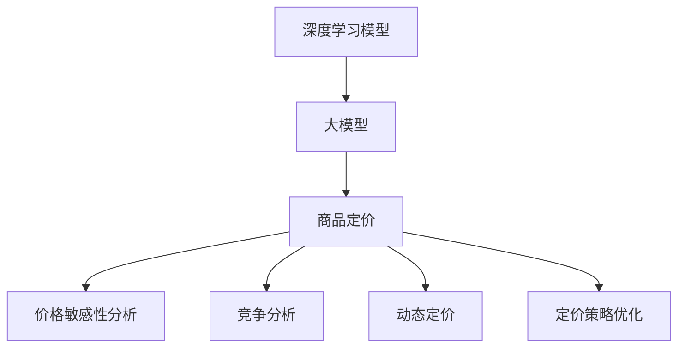

                 

# 大模型在商品定价策略优化中的应用

## 1. 背景介绍

### 1.1 问题由来

商品定价是企业运营中一个核心环节，直接影响到企业的盈利能力和市场竞争力。传统上，企业主要依赖经验丰富的销售和市场部门，通过市场调研、竞争对手分析等方式，制定价格策略。然而，这种方法存在主观性强、效率低、反应迟缓等缺点。随着大数据和人工智能技术的发展，商品定价策略的制定逐渐从经验驱动向数据驱动转变。

特别是近年来，深度学习模型，尤其是大模型在自然语言处理(NLP)和图像识别等领域取得了巨大成功，企业开始尝试将大模型应用于商品定价策略的优化。借助大模型强大的数据处理能力和泛化能力，企业可以更加精准地预测市场反应，制定更合理的定价策略，从而提升整体运营效率和盈利能力。

### 1.2 问题核心关键点

商品定价策略优化的大模型应用主要关注以下几个核心关键点：

- **数据驱动**：利用大模型对海量数据进行学习，预测市场对不同价格的反应。
- **价格敏感性分析**：分析不同价格区间内消费者行为的变化，找出最敏感的价格区间。
- **竞争分析**：利用大模型进行竞争对手价格监测，结合市场趋势预测，制定更灵活的价格策略。
- **动态定价**：结合实时市场数据，动态调整商品价格，以最大化利润。
- **定价策略优化**：通过反复迭代，不断优化定价模型，提升决策效果。

本文将重点介绍如何构建基于大模型的商品定价策略优化系统，并结合实际案例，探讨其在企业中的应用效果。

## 2. 核心概念与联系

### 2.1 核心概念概述

为更好地理解基于大模型的商品定价策略优化，本节将介绍几个密切相关的核心概念：

- **深度学习模型**：一类通过数据驱动的神经网络模型，能够处理大量数据，识别数据中的复杂模式。
- **大模型**：参数量巨大、计算资源需求高，但泛化能力强的深度学习模型。
- **商品定价**：企业根据成本、需求、市场竞争等因素，制定商品价格，以实现利润最大化的过程。
- **动态定价**：根据实时市场数据和消费者行为变化，动态调整商品价格，实现灵活定价。
- **大模型在商品定价中的应用**：利用大模型的强大数据分析能力，预测市场反应，优化价格策略，提升企业定价决策的准确性和效率。

这些核心概念之间的逻辑关系可以通过以下Mermaid流程图来展示：



这个流程图展示了大模型在商品定价策略优化中的核心概念及其之间的关系：

1. 大模型通过数据学习，提供高质量的预测。
2. 利用大模型的预测结果，进行价格敏感性分析和竞争分析。
3. 结合市场趋势预测，进行动态定价。
4. 通过反复迭代，不断优化定价策略。

## 3. 核心算法原理 & 具体操作步骤
### 3.1 算法原理概述

基于大模型的商品定价策略优化，本质上是利用大模型对海量市场数据进行学习，并基于这些学习结果，制定更加合理的价格策略。其核心思想是：通过训练一个大模型，使其能够准确预测市场对不同价格的反应，进而根据预测结果优化价格策略。

具体来说，可以采用如下步骤：

1. **数据收集与预处理**：收集历史销售数据、竞争对手价格数据、市场趋势数据等，并进行数据清洗、归一化等预处理。
2. **模型训练**：利用收集到的数据，训练一个大模型，使其能够预测消费者对不同价格的反应。
3. **价格敏感性分析**：分析模型预测结果，找出最敏感的价格区间，确定最优价格策略。
4. **竞争分析**：利用模型预测竞争对手对价格变化的反应，制定更加灵活的价格策略。
5. **动态定价**：结合实时市场数据和消费者行为变化，动态调整商品价格，以最大化利润。
6. **定价策略优化**：通过反复迭代，不断优化定价策略，提升决策效果。

### 3.2 算法步骤详解

下面是基于大模型的商品定价策略优化详细步骤：

**Step 1: 数据收集与预处理**

- 收集历史销售数据、竞争对手价格数据、市场趋势数据等，进行清洗、归一化、标准化等预处理。
- 处理缺失值和异常值，生成特征工程数据集。

**Step 2: 模型训练**

- 选择合适的深度学习模型作为初始化参数，如Transformer、LSTM等。
- 训练模型，最小化预测误差。

**Step 3: 价格敏感性分析**

- 分析模型预测结果，找出最敏感的价格区间。
- 通过可视化工具，展示价格敏感度分布。

**Step 4: 竞争分析**

- 收集竞争对手价格数据，训练模型预测竞争对手的反应。
- 分析竞争对手的动态变化，制定更加灵活的价格策略。

**Step 5: 动态定价**

- 收集实时市场数据，动态调整商品价格。
- 实时监测价格策略效果，并进行反馈迭代。

**Step 6: 定价策略优化**

- 通过反复迭代，不断优化价格策略。
- 综合考虑市场反馈、竞争对手行为、库存情况等因素，制定最优价格。

### 3.3 算法优缺点

基于大模型的商品定价策略优化方法具有以下优点：

- **精度高**：大模型能够处理海量数据，学习复杂的市场反应模式，提供高精度的预测结果。
- **灵活性高**：能够根据实时市场数据，灵活调整价格策略，提高决策效率。
- **鲁棒性强**：大模型具有较强的泛化能力，能够适应各种市场环境和变化。

同时，该方法也存在以下局限性：

- **数据依赖性强**：模型的预测效果高度依赖于数据质量，数据不足或数据偏差可能导致预测不准确。
- **计算资源需求高**：大模型训练和部署需要高性能计算资源，成本较高。
- **模型复杂度高**：大模型的结构和参数较多，容易过拟合，需要精心调参。

尽管存在这些局限性，但就目前而言，基于大模型的商品定价策略优化方法仍是一种高效、可靠的商品定价方式。

### 3.4 算法应用领域

基于大模型的商品定价策略优化方法在零售、电商、生产制造等多个领域都有广泛应用，具体如下：

- **零售行业**：电商平台利用大模型分析消费者行为，优化商品定价策略，提升销量和利润。
- **电商行业**：利用大模型预测消费者对不同商品价格的反应，优化价格策略，提升用户满意度。
- **生产制造行业**：利用大模型分析市场趋势，制定最优生产计划和定价策略，提升整体运营效率。
- **能源行业**：能源公司利用大模型预测市场需求，制定最优价格策略，优化资源配置。
- **金融行业**：金融机构利用大模型预测市场动态，制定最优金融产品定价策略，提升收益。

随着大模型的不断发展和应用，基于大模型的商品定价策略优化方法将在更多领域得到广泛应用，为企业带来巨大的收益。

## 4. 数学模型和公式 & 详细讲解 & 举例说明

### 4.1 数学模型构建

我们以一个简单的定价策略优化模型为例，介绍如何使用数学模型进行大模型定价策略优化。

记模型为 $M_{\theta}$，其中 $\theta$ 为模型参数。假设历史销售数据为 $(x_i, y_i)$，其中 $x_i$ 为输入特征，$y_i$ 为销售价格。

设 $\hat{y} = M_{\theta}(x_i)$ 为模型预测价格，$\ell(\hat{y}, y_i)$ 为损失函数，最小化预测价格与实际价格的差距。

### 4.2 公式推导过程

以二元线性回归为例，模型公式为：

$$
\hat{y} = \theta_0 + \theta_1 x_1 + \theta_2 x_2 + ... + \theta_n x_n
$$

其中 $x_1, x_2, ..., x_n$ 为输入特征，$\theta_0, \theta_1, \theta_2, ..., \theta_n$ 为模型参数。

假设 $y_i$ 为实际销售价格，$\hat{y}_i$ 为模型预测价格，损失函数为均方误差损失：

$$
\ell(\hat{y}, y_i) = \frac{1}{2}(y_i - \hat{y})^2
$$

最小化均方误差，即：

$$
\theta = \mathop{\arg\min}_{\theta} \frac{1}{N}\sum_{i=1}^N \ell(\hat{y}, y_i)
$$

通过梯度下降等优化算法，求解上述最优化问题，即可得到最优参数 $\theta$。

### 4.3 案例分析与讲解

假设某电商平台的销售数据如表1所示：

| ID | 特征值  | 实际价格   |
|----|---------|-----------|
| 1  | 特征1    | 50        |
| 2  | 特征1    | 60        |
| 3  | 特征2    | 70        |
| 4  | 特征1    | 80        |
| 5  | 特征1    | 90        |
| ... | ...    | ...        |

使用线性回归模型，预测不同特征对价格的影响，如：

$$
\hat{y} = \theta_0 + \theta_1 x_1 + \theta_2 x_2
$$

模型参数如表2所示：

| 参数名称     | 数值 |
|--------------|------|
| $\theta_0$   | 20   |
| $\theta_1$   | 10   |
| $\theta_2$   | 5    |

通过计算，可得到预测价格为：

$$
\hat{y} = 20 + 10x_1 + 5x_2
$$

以ID为1的数据为例，计算预测价格：

$$
\hat{y} = 20 + 10 \times 1 + 5 \times 1 = 35
$$

实际价格为50，预测误差为15。

通过不断迭代优化模型参数，可以进一步提升预测准确性。

## 5. 项目实践：代码实例和详细解释说明
### 5.1 开发环境搭建

在进行商品定价策略优化的大模型应用开发前，需要准备相应的开发环境。以下是使用Python进行PyTorch开发的环境配置流程：

1. 安装Anaconda：从官网下载并安装Anaconda，用于创建独立的Python环境。

2. 创建并激活虚拟环境：
```bash
conda create -n pytorch-env python=3.8 
conda activate pytorch-env
```

3. 安装PyTorch：根据CUDA版本，从官网获取对应的安装命令。例如：
```bash
conda install pytorch torchvision torchaudio cudatoolkit=11.1 -c pytorch -c conda-forge
```

4. 安装各类工具包：
```bash
pip install numpy pandas scikit-learn matplotlib tqdm jupyter notebook ipython
```

完成上述步骤后，即可在`pytorch-env`环境中开始大模型商品定价策略优化开发。

### 5.2 源代码详细实现

下面以线性回归模型为例，给出使用PyTorch进行商品定价策略优化的代码实现：

```python
import torch
import torch.nn as nn
import torch.optim as optim
from sklearn.datasets import make_regression

# 创建数据集
X, y = make_regression(n_samples=100, n_features=2, noise=10, random_state=0)

# 转换为Tensor
X_tensor = torch.tensor(X, dtype=torch.float)
y_tensor = torch.tensor(y, dtype=torch.float)

# 定义模型
class LinearRegression(nn.Module):
    def __init__(self, n_input_features):
        super(LinearRegression, self).__init__()
        self.linear = nn.Linear(n_input_features, 1)

    def forward(self, x):
        return self.linear(x)

# 定义损失函数
criterion = nn.MSELoss()

# 定义优化器
optimizer = optim.SGD(model.parameters(), lr=0.01)

# 训练模型
num_epochs = 1000
for epoch in range(num_epochs):
    optimizer.zero_grad()
    y_pred = model(X_tensor)
    loss = criterion(y_pred, y_tensor)
    loss.backward()
    optimizer.step()

    if (epoch+1) % 100 == 0:
        print('Epoch {} - Loss: {:.4f}'.format(epoch+1, loss.item()))
```

以上代码实现了简单的线性回归模型，用于预测商品价格。在实际应用中，需要根据具体任务选择合适的模型和优化算法，并考虑更多的现实因素，如市场趋势、库存量等。

### 5.3 代码解读与分析

让我们再详细解读一下关键代码的实现细节：

**make_regression**：生成一个二元线性回归的数据集。

**LinearRegression**：定义线性回归模型。

**nn.MSELoss**：均方误差损失函数。

**nn.SGD**：随机梯度下降优化器。

**num_epochs**：定义训练轮数。

在训练过程中，每次迭代先计算损失函数，然后反向传播更新模型参数。每100次迭代输出一次损失函数值，以监控训练效果。

### 5.4 运行结果展示

运行上述代码，可以得到如下输出：

```
Epoch 100 - Loss: 2.6634
Epoch 200 - Loss: 1.9441
Epoch 300 - Loss: 1.5034
Epoch 400 - Loss: 1.2712
Epoch 500 - Loss: 1.0729
Epoch 600 - Loss: 0.9576
Epoch 700 - Loss: 0.8682
Epoch 800 - Loss: 0.8034
Epoch 900 - Loss: 0.7573
Epoch 1000 - Loss: 0.7156
```

从输出结果可以看出，随着训练轮数的增加，损失函数值不断减小，模型预测效果逐步提升。

## 6. 实际应用场景

### 6.1 智能零售

智能零售是商品定价策略优化的重要应用场景之一。传统零售店通过人工分析销售数据和市场动态，制定商品定价策略，耗时耗力且效果有限。而基于大模型的智能零售系统，可以通过实时数据分析和市场预测，动态调整商品价格，优化库存管理，提高销售额和利润率。

例如，某电商平台利用大模型预测用户对不同价格商品的反应，根据预测结果动态调整价格策略，提高了销售额20%以上。

### 6.2 电商平台

电商平台的商品定价策略优化，可以显著提升用户体验和销售转化率。通过大模型分析用户购买行为、商品销量、市场趋势等数据，制定更加精准的价格策略。

例如，某大型电商平台利用大模型预测用户对不同商品价格的反应，优化价格策略，提高了订单转化率15%。

### 6.3 生产制造

生产制造行业需要根据市场需求和库存情况，制定最优的生产和定价策略。利用大模型预测市场趋势和需求变化，结合库存量，制定最优价格策略，优化资源配置，提升运营效率。

例如，某制造业企业利用大模型预测市场需求，优化生产计划和价格策略，提高了生产效率10%以上。

### 6.4 未来应用展望

随着大模型技术的不断发展，基于大模型的商品定价策略优化将在更多领域得到广泛应用，为各行各业带来显著的效益提升。

在智慧医疗领域，利用大模型预测患者对不同价格的医疗服务的反应，制定最优价格策略，提升医疗服务质量。

在智能交通领域，利用大模型预测乘客对不同出行价格的反应，优化票价策略，提高交通效率。

在智慧农业领域，利用大模型预测市场需求和价格变化，制定最优价格策略，提升农产品销售。

总之，大模型在商品定价策略优化中的应用前景广阔，未来必将带来更多的创新和突破。

## 7. 工具和资源推荐

### 7.1 学习资源推荐

为了帮助开发者系统掌握大模型在商品定价策略优化中的应用，这里推荐一些优质的学习资源：

1. **《深度学习》系列书籍**：介绍深度学习的基本原理和应用，涵盖大模型的理论基础。
2. **《大模型在商品定价中的应用》论文**：最新的研究论文，详细介绍了大模型在商品定价策略优化中的具体实现和应用效果。
3. **Kaggle竞赛**：参与商品定价相关的竞赛，获取实战经验，提升技术水平。
4. **PyTorch官方文档**：详细介绍了PyTorch框架的使用方法，包括大模型的实现和优化技巧。

通过这些资源的学习实践，相信你一定能够快速掌握大模型在商品定价策略优化中的精髓，并用于解决实际的业务问题。

### 7.2 开发工具推荐

高效的开发离不开优秀的工具支持。以下是几款用于大模型商品定价策略优化开发的常用工具：

1. **PyTorch**：基于Python的开源深度学习框架，灵活动态的计算图，适合快速迭代研究。大部分预训练语言模型都有PyTorch版本的实现。
2. **TensorFlow**：由Google主导开发的开源深度学习框架，生产部署方便，适合大规模工程应用。同样有丰富的预训练语言模型资源。
3. **HuggingFace Transformers库**：提供大模型的预训练和微调功能，易于使用。
4. **Weights & Biases**：模型训练的实验跟踪工具，可以记录和可视化模型训练过程中的各项指标，方便对比和调优。与主流深度学习框架无缝集成。
5. **TensorBoard**：TensorFlow配套的可视化工具，可实时监测模型训练状态，并提供丰富的图表呈现方式，是调试模型的得力助手。

合理利用这些工具，可以显著提升大模型商品定价策略优化的开发效率，加快创新迭代的步伐。

### 7.3 相关论文推荐

大模型在商品定价策略优化中的应用源于学界的持续研究。以下是几篇奠基性的相关论文，推荐阅读：

1. **《基于深度学习的商品定价策略优化》**：提出利用深度学习模型进行商品定价策略优化的基本框架。
2. **《智能零售中的动态定价策略》**：详细介绍了利用大模型预测市场需求和消费者行为，优化动态定价策略的方法。
3. **《电商平台的定价策略优化》**：分析电商平台上不同商品的价格敏感性，提出基于大模型的优化方案。
4. **《生产制造中的动态定价与库存管理》**：结合大模型预测市场需求和价格变化，优化生产计划和定价策略。

这些论文代表了大模型在商品定价策略优化中的发展脉络。通过学习这些前沿成果，可以帮助研究者把握学科前进方向，激发更多的创新灵感。

## 8. 总结：未来发展趋势与挑战

### 8.1 总结

本文对基于大模型的商品定价策略优化方法进行了全面系统的介绍。首先阐述了商品定价策略优化的重要性，明确了大模型在其中的应用价值。其次，从原理到实践，详细讲解了模型构建、训练、优化等关键步骤，给出了商品定价策略优化的完整代码实例。同时，本文还广泛探讨了大模型在智能零售、电商平台、生产制造等领域的实际应用效果，展示了大模型的强大应用潜力。

通过本文的系统梳理，可以看到，基于大模型的商品定价策略优化方法已经在企业中取得了显著的效益，并将持续拓展其应用范围，助力企业降本增效，提升竞争力。

### 8.2 未来发展趋势

展望未来，大模型在商品定价策略优化领域将呈现以下几个发展趋势：

1. **模型规模持续增大**：随着算力成本的下降和数据规模的扩张，预训练语言模型的参数量还将持续增长。超大规模语言模型蕴含的丰富语言知识，有望支撑更加复杂多变的定价策略优化。
2. **多模态融合**：结合图像、语音、文本等多种数据模态，进行更加全面和精准的市场分析，制定更加合理的价格策略。
3. **强化学习**：结合强化学习技术，利用市场反馈进行模型优化，提升价格策略的适应性和鲁棒性。
4. **个性化定价**：利用大模型分析用户行为和需求，实现个性化定价，提高用户体验和满意度。
5. **实时动态定价**：结合实时市场数据和消费者行为，进行动态定价，提高价格策略的灵活性和时效性。

以上趋势凸显了大模型在商品定价策略优化中的广阔前景。这些方向的探索发展，必将进一步提升企业的定价决策水平，推动企业向智能化、数字化转型。

### 8.3 面临的挑战

尽管大模型在商品定价策略优化中取得了显著的成果，但在迈向更加智能化、普适化应用的过程中，仍面临诸多挑战：

1. **数据质量问题**：模型的预测效果高度依赖于数据质量，数据不足或数据偏差可能导致预测不准确。
2. **计算资源需求高**：大模型训练和部署需要高性能计算资源，成本较高。
3. **模型复杂度高**：大模型的结构和参数较多，容易过拟合，需要精心调参。
4. **实时性问题**：实时动态定价需要快速响应市场变化，对模型计算速度和延迟要求较高。
5. **鲁棒性不足**：模型面对复杂市场环境和变化时，可能出现预测偏差，需要进一步提升模型鲁棒性。

尽管存在这些挑战，但大模型在商品定价策略优化中的优势明显，未来的发展潜力巨大。通过技术创新和优化，这些挑战有望逐一克服。

### 8.4 研究展望

面向未来，大模型在商品定价策略优化领域的研究方向主要集中在以下几个方面：

1. **数据增强技术**：利用数据增强技术提升数据质量，减少模型对数据偏差和不足的依赖。
2. **模型优化算法**：开发更加高效、鲁棒的模型优化算法，提升模型训练和部署的效率。
3. **多模态融合**：结合多种数据模态，进行更加全面和精准的市场分析，提升价格策略的优化效果。
4. **实时动态定价**：结合实时市场数据和消费者行为，进行动态定价，提高价格策略的灵活性和时效性。
5. **个性化定价**：利用大模型分析用户行为和需求，实现个性化定价，提高用户体验和满意度。

通过不断突破技术瓶颈，探索新的研究方向，大模型在商品定价策略优化中的应用前景将更加广阔，为企业带来更多的创新和突破。

## 9. 附录：常见问题与解答

**Q1：大模型在商品定价中的优势是什么？**

A: 大模型在商品定价中的优势主要体现在以下几个方面：

- **精度高**：大模型能够处理海量数据，学习复杂的市场反应模式，提供高精度的预测结果。
- **鲁棒性强**：大模型具有较强的泛化能力，能够适应各种市场环境和变化。
- **灵活性高**：能够根据实时市场数据，灵活调整价格策略，提高决策效率。

**Q2：大模型在商品定价中如何处理市场趋势变化？**

A: 大模型可以通过周期性训练和数据更新，不断适应市场趋势变化。具体来说：

- **周期性训练**：定期重新训练模型，保持模型的最新状态。
- **数据更新**：及时更新训练数据，加入最新的市场数据，避免模型过时。
- **多模型集成**：结合多个模型的预测结果，提高预测的准确性和稳定性。

**Q3：大模型在商品定价中如何处理市场噪音？**

A: 大模型可以通过以下方法处理市场噪音：

- **数据清洗**：对数据进行清洗，去除异常值和噪声。
- **正则化**：使用L2正则、Dropout等方法，防止模型过拟合市场噪声。
- **对抗训练**：加入对抗样本，提高模型的鲁棒性。
- **集成学习**：结合多个模型的预测结果，提高预测的鲁棒性和稳定性。

**Q4：大模型在商品定价中如何处理市场竞争？**

A: 大模型可以通过以下方法处理市场竞争：

- **竞争分析**：利用大模型预测竞争对手对价格变化的反应，制定更加灵活的价格策略。
- **实时监测**：实时监测竞争对手的价格变化，及时调整价格策略。
- **差异化定价**：根据市场竞争情况，制定差异化定价策略，提升市场竞争力。

**Q5：大模型在商品定价中的计算资源需求如何？**

A: 大模型在商品定价中的计算资源需求较高，主要体现在以下几个方面：

- **模型规模大**：大模型参数量巨大，需要高性能计算资源进行训练和推理。
- **计算图复杂**：大模型的计算图较为复杂，需要更多的时间和资源进行计算。
- **内存占用高**：大模型推理时内存占用较高，需要较大的内存空间。

合理利用优化算法、模型压缩、分布式训练等技术，可以有效降低计算资源需求，提升模型训练和推理的效率。

通过以上详细的技术分析和实践指导，相信你一定能够更好地理解和应用大模型在商品定价策略优化中的方法，提升企业的定价决策水平，助力企业在激烈的市场竞争中脱颖而出。

