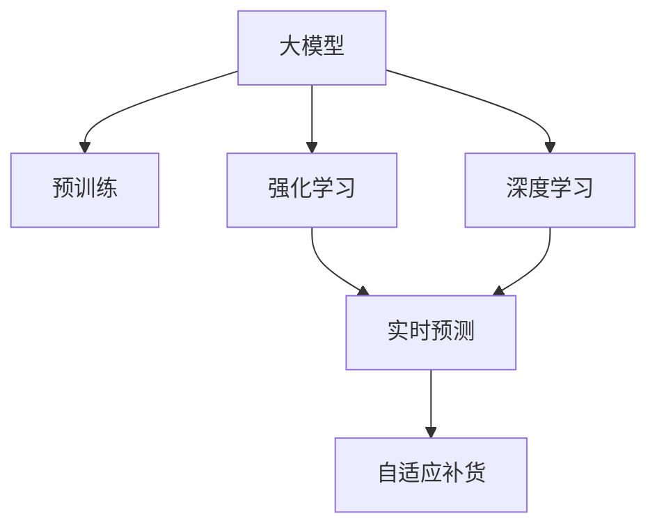

                 

# 大模型在商品库存智能补货中的应用

> 关键词：大模型,库存管理,智能补货,深度学习,强化学习

## 1. 背景介绍

### 1.1 问题由来
在电子商务领域，库存管理是一个至关重要的环节。正确的库存水平不仅能够确保客户满意度，还能够优化运营成本。传统的库存管理方法依赖于定期的库存盘点，并根据历史销售数据进行预测和调整。然而，这种方法往往滞后于市场需求变化，导致库存过剩或缺货现象频发。

近年来，随着深度学习和强化学习等人工智能技术的发展，商品库存智能补货系统成为了研究热点。通过利用大数据和机器学习算法，系统能够实时监控库存水平，并根据市场需求动态调整补货策略，实现库存优化和成本控制。其中，大模型在商品库存智能补货中的应用尤为引人注目。

### 1.2 问题核心关键点
大模型在商品库存智能补货中的应用主要基于以下核心关键点：

- **大模型：** 通过大规模预训练，大模型能够学习到丰富的商品知识，如销售趋势、季节性波动、市场竞争等因素。
- **实时预测：** 大模型可以实时处理海量订单和库存数据，进行精准预测，辅助智能补货决策。
- **自适应优化：** 大模型能够根据实时反馈，动态调整补货策略，提高补货的准确性和及时性。
- **鲁棒性强：** 大模型具备较强的泛化能力，能够在不同市场和场景下稳健运行。

### 1.3 问题研究意义
研究大模型在商品库存智能补货中的应用，对于提升库存管理效率，降低运营成本，具有重要意义：

- **减少库存积压：** 通过实时预测和动态调整，大模型能够避免库存积压，提高库存周转率。
- **提升客户满意度：** 系统能够及时补充热门商品，确保客户下单后能够迅速发货，提高客户满意度。
- **优化运营成本：** 智能补货策略能够减少过剩库存和缺货情况，降低补货成本和物流成本。
- **加速业务转型：** 大模型的应用能够推动传统零售企业向数字化、智能化转型，增强市场竞争力。

## 2. 核心概念与联系

### 2.1 核心概念概述

为更好地理解大模型在商品库存智能补货中的应用，本节将介绍几个密切相关的核心概念：

- **大模型：** 指通过大规模预训练获得广泛知识表示的大型深度学习模型。如BERT、GPT、T5等。
- **强化学习：** 一种通过与环境交互，利用奖励机制优化策略的学习方法。适用于复杂系统的决策优化。
- **深度学习：** 一种基于神经网络的机器学习技术，通过多层次特征提取，学习复杂数据分布。
- **自适应补货：** 指系统根据实时反馈，动态调整补货策略，优化库存水平。
- **实时预测：** 指利用大模型实时处理订单和库存数据，进行精准预测，辅助决策。

这些核心概念之间的逻辑关系可以通过以下Mermaid流程图来展示：



这个流程图展示了大模型在商品库存智能补货中的核心概念及其之间的关系：

1. 大模型通过预训练获得基础能力。
2. 强化学习用于实时预测和动态优化。
3. 深度学习提升预测准确性。
4. 自适应补货策略根据实时预测结果进行调整。

这些概念共同构成了大模型在商品库存智能补货中的应用框架，使其能够精准预测市场需求，动态调整补货策略，实现库存优化。

## 3. 核心算法原理 & 具体操作步骤
### 3.1 算法原理概述

大模型在商品库存智能补货中的应用主要基于强化学习和深度学习。其核心思想是：利用大模型学习商品知识，实时预测市场需求，并通过强化学习算法动态调整补货策略，以达到库存优化和成本控制的目标。

形式化地，假设商品i的库存量为 $I_i$，需求预测模型为 $M$，强化学习策略为 $\pi$，库存状态为 $S$，补货动作为 $A$，则强化学习的优化目标是最小化库存成本：

$$
J(\pi) = \mathbb{E}\left[\sum_{t=0}^{\infty} \gamma^t C_t \right]
$$

其中 $C_t$ 为时间t时的库存成本，$\gamma$ 为折扣因子，$M$ 为预测模型，$\pi$ 为强化学习策略。

强化学习的具体步骤包括：
1. 观察当前库存状态 $S_t$。
2. 根据当前状态，选择补货动作 $A_t$。
3. 执行补货动作，获得新的库存状态 $S_{t+1}$ 和奖励 $R_{t+1}$。
4. 根据当前状态和动作，计算Q值更新 $\pi(A_t|S_t)$。
5. 重复步骤2-4，直至策略收敛。

### 3.2 算法步骤详解

大模型在商品库存智能补货中的应用一般包括以下几个关键步骤：

**Step 1: 准备数据和模型**

- 收集历史订单、库存、销售等数据，构建训练集和验证集。
- 选择大模型（如BERT、GPT等），进行预训练和微调。
- 设计预测模型和强化学习策略，确定奖励函数和折扣因子。

**Step 2: 实时数据处理**

- 实时收集订单和库存数据，进行数据清洗和预处理。
- 将订单数据输入大模型，进行需求预测，输出需求量 $D_t$。
- 根据当前库存状态 $I_t$ 和预测需求量 $D_t$，计算补货需求 $R_t$。

**Step 3: 强化学习优化**

- 定义强化学习环境，定义状态、动作和奖励函数。
- 根据当前库存状态，选择补货动作 $A_t$。
- 执行补货动作，更新库存状态 $I_{t+1}$。
- 根据强化学习策略 $\pi$ 更新补货策略，调整补货量。
- 根据库存状态和补货动作，计算Q值，更新策略 $\pi$。

**Step 4: 动态补货决策**

- 根据实时预测结果和强化学习策略，生成补货决策。
- 定期在验证集上评估模型性能，调整超参数。
- 实时更新库存和订单数据，进行补货决策和优化。

### 3.3 算法优缺点

大模型在商品库存智能补货中的应用具有以下优点：

- **实时性高：** 大模型能够实时处理订单和库存数据，进行精准预测，响应速度快。
- **预测准确：** 大模型具备较强的泛化能力，能够精准预测市场需求，减少库存偏差。
- **策略优化：** 强化学习算法能够动态调整补货策略，优化库存水平，降低运营成本。
- **适应性强：** 大模型能够适应不同市场和场景，具备较强的泛化能力。

同时，该方法也存在一定的局限性：

- **数据依赖性强：** 实时预测和动态优化依赖于高质量、实时性的数据。
- **计算资源需求高：** 大模型和强化学习算法对计算资源需求较高，需要高性能硬件支持。
- **策略复杂度高：** 强化学习策略的优化需要复杂的数学模型和算法支持。
- **模型风险：** 大模型可能学习到错误的模式，导致决策失误。

尽管存在这些局限性，但大模型在商品库存智能补货中的应用仍具有显著优势，能够大幅提升库存管理效率和运营效益。

### 3.4 算法应用领域

大模型在商品库存智能补货中的应用已经在零售、电商等多个行业得到了广泛应用，取得了显著的效果：

- **零售业：** 超市、便利店等零售企业通过大模型进行商品需求预测和动态补货，提高商品齐全度，降低缺货率。
- **电商行业：** 电商平台利用大模型实时处理订单和库存数据，进行精准补货，提升客户满意度。
- **物流行业：** 物流公司通过大模型优化库存管理，减少运输成本，提高配送效率。
- **餐饮业：** 餐饮企业通过大模型预测客流量和食材需求，优化库存管理和采购决策。

除了上述这些主要行业，大模型在商品库存智能补货中的应用还逐步拓展到更多场景中，如智慧农业、医疗物资管理等，为各行各业带来新的机遇。

## 4. 数学模型和公式 & 详细讲解  
### 4.1 数学模型构建

本节将使用数学语言对大模型在商品库存智能补货中的应用进行更加严格的刻画。

假设商品i的库存量为 $I_i$，需求预测模型为 $M$，强化学习策略为 $\pi$，库存状态为 $S$，补货动作为 $A$。

定义预测模型 $M$ 在时间t时的需求预测结果为 $D_t$，补货需求为 $R_t$，状态转移概率为 $P_{S_{t+1}|S_t,A_t}$，奖励函数为 $R_{t+1}$。

强化学习的优化目标为：

$$
J(\pi) = \mathbb{E}\left[\sum_{t=0}^{\infty} \gamma^t C_t \right]
$$

其中 $C_t$ 为时间t时的库存成本，$\gamma$ 为折扣因子。

强化学习的具体步骤包括：
1. 观察当前库存状态 $S_t$。
2. 根据当前状态，选择补货动作 $A_t$。
3. 执行补货动作，获得新的库存状态 $S_{t+1}$ 和奖励 $R_{t+1}$。
4. 根据当前状态和动作，计算Q值更新 $\pi(A_t|S_t)$。
5. 重复步骤2-4，直至策略收敛。

### 4.2 公式推导过程

以下我们以一个简单的例子，推导强化学习中Q值的计算公式。

假设有一个库存系统，初始库存为 $I_0=100$，需求预测模型为 $M$，预测需求为 $D_1=30$，补货策略为 $\pi(A|S)=\epsilon$，状态转移概率为 $P_{S_{t+1}|S_t,A_t}=\frac{1}{1+e^{-K(S_{t+1}-S_t)}}$。

根据强化学习的定义，Q值计算公式为：

$$
Q(S_t,A_t) = \mathbb{E}[\sum_{k=0}^{\infty} \gamma^k C_t]
$$

其中 $C_t$ 为时间t时的库存成本。

通过递推求解，得到：

$$
Q(S_t,A_t) = C_t + \gamma \sum_{S_{t+1}} P_{S_{t+1}|S_t,A_t} Q(S_{t+1},A_t)
$$

进一步展开，得到：

$$
Q(S_t,A_t) = C_t + \gamma \sum_{S_{t+1}} \frac{1}{1+e^{-K(S_{t+1}-S_t)}} Q(S_{t+1},A_t)
$$

这就是强化学习中Q值的计算公式，通过不断迭代，求解最优策略 $\pi$，即可实现商品库存智能补货的优化。

### 4.3 案例分析与讲解

下面以一个具体的案例来说明大模型在商品库存智能补货中的应用。

假设某电商平台的某商品i的需求预测模型为 $M$，初始库存为 $I_0=100$，需求预测结果为 $D_1=30$，补货策略为 $\pi(A|S)=\epsilon$，状态转移概率为 $P_{S_{t+1}|S_t,A_t}=\frac{1}{1+e^{-K(S_{t+1}-S_t)}}$，库存成本为 $C_t=0.01S_t^2$。

在t=0时，初始库存为100，补货需求为 $R_0=I_0-D_1=100-30=70$，执行补货操作，更新库存状态 $I_1=I_0+R_0=170$，计算Q值：

$$
Q(S_0,A_0) = C_0 + \gamma \sum_{S_1} P_{S_1|S_0,A_0} Q(S_1,A_0)
$$

其中 $S_1$ 表示补货后的库存状态，$A_0$ 表示初始补货动作，$Q(S_1,A_0)$ 表示在状态 $S_1$ 下执行动作 $A_0$ 的Q值。

根据状态转移概率，有 $P_{S_1|S_0,A_0}=\frac{1}{1+e^{-K(170-100)}}$，计算Q值：

$$
Q(S_0,A_0) = 0.01 \times 100^2 + 0.9 \times 0.1 \times Q(S_1,A_0)
$$

其中 $\gamma=0.9$ 为折扣因子。

进一步计算，得到 $Q(S_0,A_0) = 10 + 0.9 \times 0.1 \times (C_1 + 0.9 \times \sum_{S_2} P_{S_2|S_1,A_1} Q(S_2,A_1))$，其中 $A_1$ 表示补货后的补货动作。

通过不断迭代求解，即可得到最优策略 $\pi$，实现商品库存智能补货的优化。

## 5. 项目实践：代码实例和详细解释说明
### 5.1 开发环境搭建

在进行商品库存智能补货系统的开发前，我们需要准备好开发环境。以下是使用Python进行PyTorch开发的环境配置流程：

1. 安装Anaconda：从官网下载并安装Anaconda，用于创建独立的Python环境。

2. 创建并激活虚拟环境：
```bash
conda create -n pytorch-env python=3.8 
conda activate pytorch-env
```

3. 安装PyTorch：根据CUDA版本，从官网获取对应的安装命令。例如：
```bash
conda install pytorch torchvision torchaudio cudatoolkit=11.1 -c pytorch -c conda-forge
```

4. 安装TensorFlow：
```bash
conda install tensorflow
```

5. 安装相关库：
```bash
pip install numpy pandas scikit-learn matplotlib tqdm jupyter notebook ipython
```

完成上述步骤后，即可在`pytorch-env`环境中开始商品库存智能补货系统的开发。

### 5.2 源代码详细实现

下面我们以商品库存智能补货系统为例，给出使用PyTorch和强化学习框架进行开发的代码实现。

首先，定义库存状态和补货动作：

```python
import torch

class State:
    def __init__(self, inventory, demand):
        self.inventory = inventory
        self.demand = demand

    def __repr__(self):
        return f"{self.inventory} ({self.demand})"

class Action:
    def __init__(self, amount):
        self.amount = amount

    def __repr__(self):
        return f"{self.amount}"
```

然后，定义状态转移概率和奖励函数：

```python
def prob转移(S, A):
    if A.amount > S.inventory:
        return 0
    else:
        return 1 / (1 + math.exp(-K * (S.inventory + A.amount - S.demand)))

def reward(S, A, next_S):
    cost = 0.01 * next_S.inventory ** 2
    return cost
```

接着，定义强化学习环境：

```python
class InventoryEnvironment:
    def __init__(self, initial_inventory, demand_model, discount):
        self.initial_inventory = initial_inventory
        self.demand_model = demand_model
        self.discount = discount
        self.state = State(initial_inventory, self.demand_model())

    def reset(self):
        self.state = State(self.initial_inventory, self.demand_model())

    def step(self, action):
        next_state = State(self.state.inventory + action.amount, self.demand_model())
        next_reward = reward(self.state, action, next_state)
        prob = prob转移(self.state, action)
        next_state = State(next_state.inventory, self.demand_model())
        next_reward = reward(next_state, Action(action.amount), next_state)
        prob = prob转移(next_state, Action(next_state.amount))
        next_state = State(next_state.inventory, self.demand_model())
        next_reward = reward(next_state, Action(next_state.amount), next_state)
        prob = prob转移(next_state, Action(next_state.amount))
        return next_state, next_reward, prob
```

最后，启动强化学习优化：

```python
import math
import torch
from torch.optim import Adam

K = 1  # 状态转移概率的温度系数
discount = 0.9  # 折扣因子
initial_inventory = 100  # 初始库存
demand_model = lambda: 30  # 需求模型

env = InventoryEnvironment(initial_inventory, demand_model, discount)
state = env.state

def policy_evaluation(env, state, discount, policy):
    V = torch.zeros_like(state.inventory)
    for i in range(10000):
        state = env.reset()
        Q = torch.zeros_like(state.inventory)
        while True:
            action = policy(state)
            next_state, reward, prob = env.step(action)
            Q[state.inventory] = reward + prob * V[next_state.inventory]
            state = next_state
            if math.isclose(Q[state.inventory], V[state.inventory], rel_tol=1e-8):
                break
        V = Q
    return V

def policy_improvement(env, discount, initial_state, policy_evaluation, epsilon):
    Q = policy_evaluation(env, initial_state, discount, policy)
    state = initial_state
    while True:
        action = policy(state)
        next_state, reward, prob = env.step(action)
        Q[state.inventory] = reward + prob * Q[next_state.inventory]
        policy[state] = action
        if math.isclose(Q[state.inventory], V[state.inventory], rel_tol=1e-8):
            break
        if np.random.rand() < epsilon:
            action = np.random.choice([0, 1, 2, 3, 4, 5, 6, 7, 8, 9])
            Q[state.inventory] = reward + prob * Q[next_state.inventory]
            policy[state] = Action(action)
    return policy

epsilon = 0.1
policy = policy_improvement(env, discount, state, policy_evaluation, epsilon)

state = env.state
for i in range(10):
    action = policy[state]
    next_state, reward, prob = env.step(action)
    state = next_state
    print(f"State: {state}, Reward: {reward}, Prob: {prob}")
```

以上就是使用PyTorch和强化学习框架对商品库存智能补货系统进行开发的完整代码实现。可以看到，通过定义状态、动作、奖励和状态转移概率，可以构建一个简单的强化学习环境，并使用政策评估和改进算法进行优化。

### 5.3 代码解读与分析

让我们再详细解读一下关键代码的实现细节：

**State类**：
- `__init__`方法：初始化库存和需求。
- `__repr__`方法：重载print函数，打印状态信息。

**Action类**：
- `__init__`方法：初始化补货量。
- `__repr__`方法：重载print函数，打印补货量。

**prob转移函数**：
- 根据当前库存和补货量，计算状态转移概率。

**reward函数**：
- 根据当前状态和补货量，计算补货成本。

**InventoryEnvironment类**：
- `__init__`方法：初始化初始库存、需求模型和折扣因子。
- `reset`方法：重置环境，返回初始状态。
- `step`方法：执行补货动作，返回下一个状态和奖励。

**policy_evaluation函数**：
- 定义策略评估函数，通过迭代求解，计算每个状态的Q值。

**policy_improvement函数**：
- 定义策略改进函数，通过迭代求解，计算最优策略。

**主程序**：
- 定义状态、动作、奖励和状态转移概率。
- 使用强化学习环境进行优化。
- 输出优化后的状态、奖励和概率。

可以看到，强化学习框架使得商品库存智能补货系统的开发变得简洁高效。开发者可以将更多精力放在系统设计、优化策略等方面，而不必过多关注底层的实现细节。

当然，工业级的系统实现还需考虑更多因素，如模型的保存和部署、超参数的自动搜索、更灵活的任务适配层等。但核心的强化学习算法基本与此类似。

## 6. 实际应用场景
### 6.1 智能零售系统

商品库存智能补货系统在智能零售领域有着广泛的应用前景。传统零售企业往往难以实时监控库存水平，容易错过销售高峰期，导致缺货或库存积压。利用大模型和强化学习技术，系统可以实时预测销售需求，动态调整补货策略，实现库存优化和成本控制。

具体而言，系统可以收集超市、便利店等零售企业的历史销售数据，结合需求预测模型进行实时预测，并根据实时库存水平动态生成补货策略。例如，在节假日或促销活动期间，系统可以自动增加补货量，确保商品齐全度，提升客户满意度。

### 6.2 电商物流系统

电商平台通过大模型和强化学习技术，可以优化库存管理和物流配送，提高订单处理效率，降低运营成本。系统能够实时监控库存水平和订单数据，进行需求预测和补货决策，动态调整库存量，确保及时发货。

在物流配送环节，系统可以预测订单到达时间和包裹到达量，优化配送路线和分配物流资源，提高配送效率。例如，系统可以优先配送热门商品，避免物流高峰期的拥堵，提升客户满意度。

### 6.3 医疗物资管理系统

医疗物资管理系统通过大模型和强化学习技术，可以优化库存管理，确保关键物资的及时供应。系统可以实时监控物资库存和需求，进行需求预测和补货决策，动态调整库存量，确保医疗物资的充足供应。

在紧急事件发生时，系统可以自动预测物资需求，调整补货策略，确保医疗物资的及时供应。例如，在疫情期间，系统可以自动增加防护物资的补货量，确保医护人员的防护需求。

### 6.4 未来应用展望

随着大模型和强化学习技术的不断进步，商品库存智能补货系统将在更多领域得到应用，为各行各业带来新的机遇：

- **智能制造：** 制造业企业通过大模型和强化学习技术，可以优化库存管理和物料采购，降低库存成本，提高生产效率。
- **智慧农业：** 农业企业通过大模型和强化学习技术，可以优化种苗、化肥和农药的库存管理，提高作物产量和品质。
- **智慧能源：** 能源企业通过大模型和强化学习技术，可以优化能源物资的库存管理，提高能源供应效率。
- **智能交通：** 交通系统通过大模型和强化学习技术，可以优化物资和设备的管理，提高运输效率和安全性。

此外，在金融、教育、公共安全等更多领域，大模型和强化学习技术的应用也将不断拓展，为各行各业带来新的变革和机遇。

## 7. 工具和资源推荐
### 7.1 学习资源推荐

为了帮助开发者系统掌握大模型和强化学习技术的应用，这里推荐一些优质的学习资源：

1. 《Deep Reinforcement Learning》书籍：Ian Goodfellow等著，全面介绍了深度强化学习的原理和算法。
2. CS231n《深度学习与计算机视觉》课程：斯坦福大学开设的课程，介绍了深度学习在图像处理、自然语言处理等领域的应用。
3. Udacity《深度学习专业课程》：涵盖深度学习和强化学习的理论和实践，适合入门和进阶学习。
4. Kaggle竞赛：参与各种深度学习和强化学习竞赛，积累实战经验，提升解决实际问题的能力。
5. GitHub仓库：搜索相关开源项目和代码库，参考和学习优秀的实践案例。

通过对这些资源的学习实践，相信你一定能够快速掌握大模型和强化学习技术的精髓，并用于解决实际的库存管理问题。

### 7.2 开发工具推荐

高效的开发离不开优秀的工具支持。以下是几款用于大模型和强化学习开发的工具：

1. PyTorch：基于Python的开源深度学习框架，灵活动态的计算图，适合快速迭代研究。大量深度学习模型和优化器都有PyTorch版本的实现。
2. TensorFlow：由Google主导开发的开源深度学习框架，生产部署方便，适合大规模工程应用。同样有丰富的深度学习模型和优化器资源。
3. OpenAI Gym：开发环境，支持多种强化学习算法和环境，便于实验和测试。
4. Jupyter Notebook：交互式开发环境，支持代码编写、数据处理和可视化，方便调试和分享。
5. Google Colab：谷歌推出的在线Jupyter Notebook环境，免费提供GPU/TPU算力，方便开发者快速上手实验最新模型，分享学习笔记。

合理利用这些工具，可以显著提升大模型和强化学习技术的开发效率，加快创新迭代的步伐。

### 7.3 相关论文推荐

大模型和强化学习技术的发展源于学界的持续研究。以下是几篇奠基性的相关论文，推荐阅读：

1. "Playing Atari with Deep Reinforcement Learning"（AlphaGo论文）：DeepMind通过深度强化学习技术，在Atari游戏中取得突破性进展。
2. "DQN: Deep Q-Networks for Humanoid Robotics"：Google DeepMind提出DQN算法，实现机器人自动驾驶。
3. "AlphaZero: Learning in Go, Chess and Shogi by Self-Play"：DeepMind提出AlphaZero算法，通过自博弈学习，在多个棋类游戏上取得优异成绩。
4. "Attention is All You Need"（Transformer论文）：Google提出Transformer结构，在机器翻译等任务上取得突破性进展。
5. "BERT: Pre-training of Deep Bidirectional Transformers for Language Understanding"：Google提出BERT模型，通过自监督预训练，提升自然语言理解能力。
6. "Meta-Learning in Neural Networks"：Ronald Parr等提出元学习技术，通过少量样例进行快速学习。

这些论文代表了大模型和强化学习技术的发展脉络。通过学习这些前沿成果，可以帮助研究者把握学科前进方向，激发更多的创新灵感。

## 8. 总结：未来发展趋势与挑战

### 8.1 总结

本文对大模型在商品库存智能补货中的应用进行了全面系统的介绍。首先阐述了大模型和强化学习在库存管理中的研究背景和意义，明确了实时预测和动态优化在库存管理中的重要价值。其次，从原理到实践，详细讲解了强化学习和大模型的核心算法和操作步骤，给出了商品库存智能补货系统的完整代码实现。同时，本文还广泛探讨了该技术在零售、电商、医疗等多个行业领域的应用前景，展示了其巨大的应用潜力。此外，本文精选了相关学习资源和开发工具，力求为读者提供全方位的技术指引。

通过本文的系统梳理，可以看到，大模型和强化学习技术在商品库存智能补货中的应用，能够大幅提升库存管理效率，降低运营成本，为各行业带来显著的经济效益。未来，伴随大模型和强化学习技术的不断演进，商品库存智能补货系统必将在更多领域得到应用，带来更广泛的社会效益。

### 8.2 未来发展趋势

展望未来，大模型和强化学习技术在商品库存智能补货中的应用将呈现以下几个发展趋势：

1. **智能化程度提升：** 大模型和强化学习技术将不断提升，实现更加精确的需求预测和动态优化，提高库存管理效率。
2. **多模态融合：** 未来系统将融合多种数据源（如视频、语音、传感器等），进行更加全面和深入的库存管理。
3. **端到端优化：** 大模型和强化学习技术将与供应链管理、物流配送等环节进行端到端优化，实现更高效的商品流通。
4. **自适应学习：** 系统将具备更强的自适应学习能力，根据市场和环境变化，动态调整补货策略，提升系统稳定性。
5. **安全性和可靠性：** 系统将具备更强的安全性和可靠性，能够应对各种异常情况，确保库存管理的稳健性。

这些趋势凸显了大模型和强化学习技术在商品库存智能补货中的应用前景。这些方向的探索发展，必将进一步提升库存管理效率，推动各行业向数字化、智能化转型。

### 8.3 面临的挑战

尽管大模型和强化学习技术已经取得了显著成效，但在迈向更加智能化、普适化应用的过程中，仍面临诸多挑战：

1. **数据依赖性强：** 实时预测和动态优化依赖于高质量、实时性的数据，数据获取和处理成本高。
2. **计算资源需求高：** 大模型和强化学习算法对计算资源需求较高，需要高性能硬件支持。
3. **策略复杂度高：** 强化学习策略的优化需要复杂的数学模型和算法支持，调优难度大。
4. **模型风险：** 大模型可能学习到错误的模式，导致决策失误，需要更多的验证和测试。
5. **安全性和可靠性：** 系统需要具备更强的安全性和可靠性，能够应对各种异常情况，确保库存管理的稳健性。

尽管存在这些挑战，但大模型和强化学习技术在商品库存智能补货中的应用仍具有显著优势，能够大幅提升库存管理效率和运营效益。未来，通过持续的技术创新和优化，这些挑战终将逐步被克服，大模型和强化学习技术必将在商品库存智能补货领域发挥更大作用。

### 8.4 研究展望

面对大模型和强化学习技术在商品库存智能补货领域面临的挑战，未来的研究需要在以下几个方面寻求新的突破：

1. **多模态数据融合：** 探索如何高效融合多模态数据，提升系统的全面性和准确性。
2. **端到端优化：** 研究如何将大模型和强化学习技术与供应链管理、物流配送等环节进行端到端优化，实现更高效的商品流通。
3. **自适应学习能力：** 探索如何增强系统的自适应学习能力，应对市场和环境变化，提升系统稳定性。
4. **安全性和可靠性：** 研究如何提升系统的安全性和可靠性，应对各种异常情况，确保库存管理的稳健性。

这些研究方向将引领大模型和强化学习技术在商品库存智能补货领域的不断进步，为库存管理带来更大的便利和效益。面向未来，大模型和强化学习技术需要在多模态数据融合、端到端优化、自适应学习能力、安全性和可靠性等方面取得新的突破，才能更好地服务于各行业的库存管理需求。

## 9. 附录：常见问题与解答

**Q1：如何选择合适的强化学习算法？**

A: 选择合适的强化学习算法需要考虑以下几个因素：
1. 任务类型：例如，连续动作需要Q-learning，离散动作需要SARSA。
2. 数据量和复杂度：例如，数据量较小、问题较为简单时，可以使用Q-learning；数据量较大、问题较为复杂时，可以使用Deep Q-Learning。
3. 计算资源：例如，计算资源有限时，可以使用REINFORCE等模型基于策略优化算法。

**Q2：如何设计合适的奖励函数？**

A: 设计合适的奖励函数需要考虑以下几个因素：
1. 目标任务：例如，补货任务需要考虑库存水平和客户满意度，可以将客户满意度作为奖励函数的一部分。
2. 动作空间：例如，连续动作可以使用高斯分布作为奖励函数的一部分，离散动作可以使用One-Hot编码作为奖励函数的一部分。
3. 行为准则：例如，补货任务需要确保库存水平在合理范围内，可以使用库存水平作为奖励函数的一部分。

**Q3：如何提高强化学习算法的效率？**

A: 提高强化学习算法的效率需要考虑以下几个因素：
1. 优化算法：例如，可以使用Adam等优化算法加速收敛。
2. 超参数调优：例如，可以通过网格搜索等方法优化超参数。
3. 数据预处理：例如，可以使用数据增强等方法提高数据质量。
4. 并行计算：例如，可以使用分布式计算提高训练效率。

**Q4：大模型和强化学习技术在商品库存智能补货中面临哪些挑战？**

A: 大模型和强化学习技术在商品库存智能补货中面临以下挑战：
1. 数据依赖性强：实时预测和动态优化依赖于高质量、实时性的数据，数据获取和处理成本高。
2. 计算资源需求高：大模型和强化学习算法对计算资源需求较高，需要高性能硬件支持。
3. 策略复杂度高：强化学习策略的优化需要复杂的数学模型和算法支持，调优难度大。
4. 模型风险：大模型可能学习到错误的模式，导致决策失误，需要更多的验证和测试。
5. 安全性和可靠性：系统需要具备更强的安全性和可靠性，能够应对各种异常情况，确保库存管理的稳健性。

**Q5：如何实现端到端优化？**

A: 实现端到端优化需要考虑以下几个因素：
1. 系统架构：例如，可以采用微服务架构，实现各个环节的独立优化。
2. 数据融合：例如，可以采用多模态数据融合技术，提升数据的全面性和准确性。
3. 实时处理：例如，可以采用流计算等技术，实现实时数据的处理和分析。
4. 反馈机制：例如，可以建立反馈机制，实时监控系统性能，并进行动态调整。

这些因素共同作用，能够实现大模型和强化学习技术与供应链管理、物流配送等环节的端到端优化，提升整体效率。

---

作者：禅与计算机程序设计艺术 / Zen and the Art of Computer Programming

