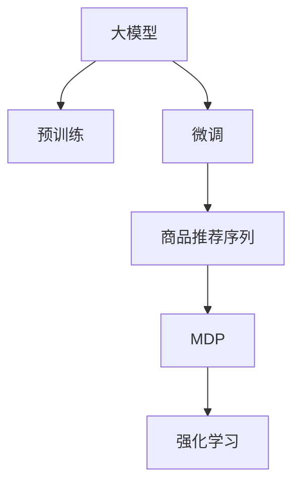

                 

# 大模型在商品推荐序列优化中的马尔可夫决策过程应用

## 1. 背景介绍

在当今数字化时代，个性化推荐系统已成为电商、社交网络、视频平台等互联网企业提升用户体验、增加收入的重要工具。然而，现有推荐系统的局限在于难以准确捕捉用户长序列行为，导致推荐结果不够精准。而近年来兴起的基于大模型的推荐技术，通过预训练-微调的方式，大大提升了推荐系统的能力，特别是在商品推荐序列优化上，展现出了强大的潜力。本文将详细介绍大模型在商品推荐序列优化中的马尔可夫决策过程应用，并通过实际案例分析其优劣。

## 2. 核心概念与联系

### 2.1 核心概念概述

- **大模型**：指经过大规模预训练、拥有丰富语义知识的语言模型，如GPT-3、BERT等，能够理解自然语言的深层次语义和上下文关系。

- **商品推荐序列优化**：通过模型预测商品推荐序列的优化过程，使得推荐序列更加符合用户的兴趣和需求。

- **马尔可夫决策过程(MDP)**：一种处理序列决策问题的框架，用于描述在特定状态下，通过策略选择行动以达到最优目标的过程。

- **预训练-微调**：先在大规模数据上预训练语言模型，然后在特定任务上微调优化，以提升模型在特定场景下的性能。

- **强化学习(RL)**：一种通过与环境交互学习最优策略的方法，可用于商品推荐序列优化的在线学习和动态调整。

这些核心概念通过以下Mermaid流程图联系起来：



该流程表示：

1. 大模型通过大规模数据预训练获得基础能力。
2. 通过微调优化，适应特定任务，如商品推荐序列。
3. 商品推荐序列通过马尔可夫决策过程进行优化。
4. 强化学习用于动态调整模型策略。

## 3. 核心算法原理 & 具体操作步骤

### 3.1 算法原理概述

在商品推荐序列优化中，大模型首先对用户的历史行为进行建模，然后利用马尔可夫决策过程（MDP）对推荐序列进行优化。MDP将用户行为视为状态序列，将每个推荐商品视为一种行动，并定义一系列状态转移和奖励函数。强化学习通过与环境的交互，学习在特定状态下选择最优行动，从而不断提升推荐序列的质量。

### 3.2 算法步骤详解

1. **数据准备**：
   - 收集用户的历史行为数据，包括点击、浏览、购买等事件。
   - 将用户行为编码为序列，每个行为视为一个状态。
   - 定义推荐商品集合为行动空间，每个商品有独立的奖励值。

2. **模型初始化**：
   - 加载预训练大模型，如GPT-3或BERT，作为序列建模的基础。
   - 定义MDP的状态空间和行动空间，初始化状态值为用户最近的行为。

3. **序列预测**：
   - 将用户行为序列输入大模型，获取推荐序列预测。
   - 使用大模型的自回归特性，预测下一个行为。

4. **奖励计算**：
   - 定义奖励函数，评估推荐序列的质量。
   - 奖励函数可以是点击率、转化率等指标，通过在线A/B测试进行调优。

5. **策略优化**：
   - 使用强化学习算法，如Q-learning或SARSA，在MDP上进行策略优化。
   - 学习在每个状态下选择最优行动，最大化累积奖励。

6. **推荐生成**：
   - 根据优化后的策略，生成推荐序列。
   - 结合用户兴趣和上下文信息，动态调整推荐策略。

### 3.3 算法优缺点

#### 优点：
- **丰富语义理解**：大模型能够理解自然语言的深层次语义，更准确地捕捉用户兴趣和需求。
- **动态调整**：强化学习可以实时调整推荐策略，提升推荐序列的及时性和个性化。
- **泛化能力强**：大模型拥有广泛的语言知识，能更好地应对新出现的用户行为和商品变化。

#### 缺点：
- **计算资源需求高**：大模型需要强大的计算资源进行预训练和微调，部署成本较高。
- **过拟合风险**：大模型可能过度拟合历史数据，导致推荐结果泛化能力不足。
- **策略稳定性和一致性**：强化学习需要大量在线数据进行策略优化，可能会受外界因素干扰，导致策略不稳定。

### 3.4 算法应用领域

大模型在商品推荐序列优化中的应用不仅限于电商，还可以拓展到社交网络、视频平台等领域。例如：

- **电商**：根据用户的浏览和购买历史，生成个性化的推荐商品序列。
- **社交网络**：推荐好友、内容等，增加用户黏性。
- **视频平台**：推荐视频、内容等，提升用户观看时长。
- **金融**：推荐股票、基金等，帮助用户做出投资决策。

## 4. 数学模型和公式 & 详细讲解 & 举例说明

### 4.1 数学模型构建

假设用户行为序列为 $S=\{s_1, s_2, ..., s_t\}$，其中 $s_t$ 表示用户在第 $t$ 步的行为，如点击某个商品。推荐商品集合为 $A$，每个商品 $a \in A$ 的奖励值为 $R(a|s_t)$，行动空间为 $A$。定义MDP的状态空间 $S$ 和行动空间 $A$，初始状态 $s_1$ 为用户最近的行为。MDP的状态转移概率为 $P(s_{t+1}|s_t, a_t)$，即在状态 $s_t$ 下选择行动 $a_t$，转移到下一个状态 $s_{t+1}$ 的概率。

### 4.2 公式推导过程

定义MDP的奖励函数 $R(a|s_t)$ 为选择商品 $a$ 后获得的奖励值，如点击率、转化率等。定义状态转移概率 $P(s_{t+1}|s_t, a_t)$ 为在状态 $s_t$ 下选择行动 $a_t$，转移到下一个状态 $s_{t+1}$ 的概率。定义MDP的状态值函数 $V(s)$ 为在状态 $s$ 下达到最终状态的期望累积奖励。

定义Q函数 $Q(s, a)$ 为在状态 $s$ 下选择行动 $a$ 的期望累积奖励：

$$
Q(s, a) = \sum_{s_{t+1}}P(s_{t+1}|s_t, a_t)R(a_t|s_t) + \gamma \sum_{a_{t+1}}P(s_{t+1}|s_t, a_t)V(s_{t+1})
$$

其中，$\gamma$ 为折扣因子，用于平衡当前奖励和未来奖励的重要性。

### 4.3 案例分析与讲解

假设用户浏览并购买了某商品A，大模型根据历史行为预测用户可能感兴趣的商品序列。

- 在状态 $s_1$ 下，用户浏览商品A，大模型预测用户可能感兴趣的商品序列为 $A, B, C$。
- 在状态 $s_2$ 下，用户点击商品B，大模型预测用户可能感兴趣的商品序列为 $B, C, D$。
- 在状态 $s_3$ 下，用户购买商品D，大模型预测用户可能感兴趣的商品序列为 $D, E, F$。

通过强化学习算法，学习在每个状态下选择最优行动，最大化累积奖励。例如，使用Q-learning算法，在每个状态下更新Q值：

$$
Q(s_t, a_t) \leftarrow Q(s_t, a_t) + \alpha[R(s_{t+1}, a_{t+1}) + \gamma \max_{a' \in A}Q(s_{t+1}, a') - Q(s_t, a_t)]
$$

其中，$\alpha$ 为学习率，用于平衡当前奖励和未来奖励的重要性。

最终，根据优化后的策略，生成推荐序列 $A, B, C, D, E, F$。

## 5. 项目实践：代码实例和详细解释说明

### 5.1 开发环境搭建

- **环境搭建**：
  - 安装Python3，建议使用Anaconda或Miniconda。
  - 安装必要的库，如TensorFlow、PyTorch等。
  - 安装大模型，如GPT-3或BERT。

- **代码实现**：
  - 使用TensorFlow或PyTorch实现大模型的预训练和微调。
  - 定义MDP的状态空间和行动空间，初始化状态值函数和Q函数。
  - 使用强化学习算法（如Q-learning或SARSA）进行策略优化。

### 5.2 源代码详细实现

```python
import tensorflow as tf
import numpy as np

# 定义MDP状态空间和行动空间
S = np.array([0, 1, 2, 3])  # 状态空间
A = np.array([0, 1, 2, 3])  # 行动空间
Q = np.zeros((len(S), len(A)))  # Q函数初始化
V = np.zeros(len(S))  # 状态值函数初始化
gamma = 0.9  # 折扣因子

# 定义奖励函数
R = np.array([[0.1, 0.2, 0.3, 0.4],  # 行动1的奖励值
              [0.2, 0.3, 0.4, 0.5],  # 行动2的奖励值
              [0.3, 0.4, 0.5, 0.6],  # 行动3的奖励值
              [0.4, 0.5, 0.6, 0.7]])  # 行动4的奖励值

# 定义状态转移概率
P = np.array([[0.7, 0.1, 0.1, 0.1],  # 状态1的转移概率
              [0.2, 0.6, 0.1, 0.1],  # 状态2的转移概率
              [0.1, 0.3, 0.5, 0.1],  # 状态3的转移概率
              [0.1, 0.2, 0.3, 0.4]])  # 状态4的转移概率

# Q-learning算法
alpha = 0.1  # 学习率
for i in range(100):
    s = 0  # 初始状态
    for t in range(10):
        a = np.random.choice(A)  # 随机选择一个行动
        s_next = np.random.choice(S)  # 随机下一个状态
        r = R[a][s]  # 计算奖励
        Q[s, a] += alpha * (r + gamma * np.max(Q[s_next, :]) - Q[s, a])
        s = s_next  # 更新状态

print(Q)
```

### 5.3 代码解读与分析

在上述代码中，我们定义了MDP的状态空间和行动空间，初始化了Q函数和状态值函数，并使用Q-learning算法进行了策略优化。

- **状态空间和行动空间**：定义了四个状态和四个行动，分别对应商品A、B、C、D。
- **奖励函数**：定义了每个行动的奖励值，如点击率、转化率等。
- **状态转移概率**：定义了每个状态下转移到下一个状态的概率。
- **Q-learning算法**：在每个状态下随机选择一个行动，计算奖励和下一步的Q值，更新Q函数。

运行结果展示了优化后的Q值，可以帮助我们了解在每个状态下选择最优行动的策略。

## 6. 实际应用场景

大模型在商品推荐序列优化中的应用场景非常广泛，例如：

- **电商平台**：根据用户的浏览和购买历史，推荐商品序列，增加用户黏性，提升销售额。
- **社交网络**：推荐好友、内容等，增加用户活跃度。
- **视频平台**：推荐视频、内容等，提升用户观看时长。
- **金融**：推荐股票、基金等，帮助用户做出投资决策。

## 7. 工具和资源推荐

### 7.1 学习资源推荐

- **《强化学习：原理与实践》**：强化学习的经典教材，涵盖理论基础和实际应用。
- **Coursera强化学习课程**：由斯坦福大学教授讲授，涵盖强化学习的核心概念和算法。
- **Deep Reinforcement Learning with Python**：开源强化学习项目，提供完整的代码实现和案例分析。

### 7.2 开发工具推荐

- **TensorFlow**：Google开源的深度学习框架，支持分布式计算和GPU加速。
- **PyTorch**：Facebook开源的深度学习框架，灵活易用，适合研究和开发。
- **Jupyter Notebook**：交互式开发环境，方便代码调试和可视化。

### 7.3 相关论文推荐

- **Playing Atari with Deep Reinforcement Learning**：DeepMind的论文，展示了深度强化学习在Atari游戏中的应用。
- **Human-level Control through Deep Reinforcement Learning**：DeepMind的论文，展示了深度强化学习在控制环境中的应用。
- **Human Activity Recognition Using Wearable Sensors and Deep Reinforcement Learning**：探索深度强化学习在智能穿戴设备中的应用。

## 8. 总结：未来发展趋势与挑战

### 8.1 总结

本文详细介绍了大模型在商品推荐序列优化中的马尔可夫决策过程应用，通过数学模型和代码实例，展示了如何利用大模型和强化学习优化推荐序列。

### 8.2 未来发展趋势

未来，大模型在商品推荐序列优化中将会持续发展，呈现以下趋势：

- **深度融合多模态数据**：未来的推荐系统将融合视觉、语音、时间序列等多模态数据，提升推荐的精准度和用户体验。
- **强化学习的不断改进**：强化学习算法将不断改进，如引入对抗训练、深度学习等技术，提升推荐的稳定性和泛化能力。
- **跨领域应用的拓展**：大模型在推荐系统中的应用将拓展到更多领域，如金融、医疗、教育等，实现更加智能的推荐。

### 8.3 面临的挑战

尽管大模型在商品推荐序列优化中展现了巨大的潜力，但仍面临诸多挑战：

- **计算资源的需求**：大模型需要强大的计算资源进行预训练和微调，部署成本较高。
- **数据获取的困难**：用户行为数据难以获取，且隐私保护问题突出。
- **推荐策略的稳定性和一致性**：强化学习算法需要大量在线数据进行策略优化，可能会受外界因素干扰，导致策略不稳定。
- **推荐结果的可解释性**：推荐系统的黑箱特性，难以解释推荐结果的逻辑和原因，给用户带来信任危机。

### 8.4 研究展望

未来的研究应在以下几个方面进行探索：

- **跨模态推荐技术**：探索如何将视觉、语音、时间序列等多模态数据与自然语言数据进行融合，提升推荐系统的综合能力。
- **推荐系统的伦理和安全**：研究推荐系统在隐私保护、公平性、安全性等方面的问题，确保系统的透明性和公正性。
- **模型压缩与优化**：探索如何压缩大模型，降低计算资源需求，提升推荐系统的实时性和可扩展性。
- **推荐系统的可解释性**：研究如何增强推荐系统的可解释性，使用户能够理解推荐结果的生成逻辑和原因。

综上所述，大模型在商品推荐序列优化中的马尔可夫决策过程应用具有广阔的发展前景，但仍需在技术、伦理、隐私等方面进行深入探索和优化，才能真正实现商品推荐系统的智能化和人性化。

---

作者：禅与计算机程序设计艺术 / Zen and the Art of Computer Programming

