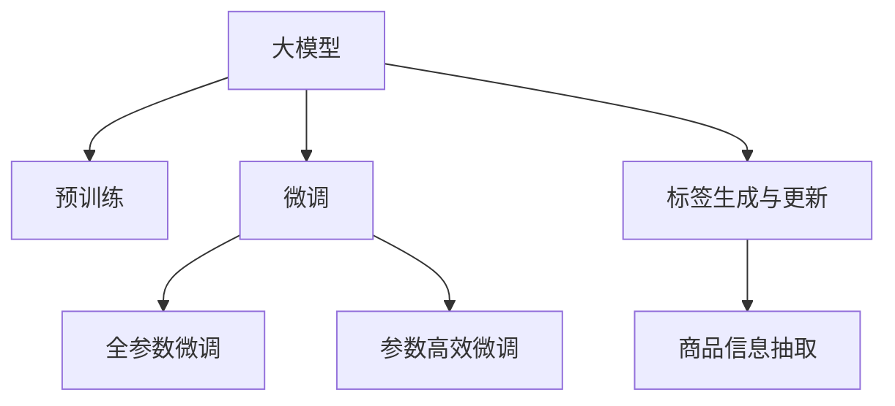

                 

# 大模型在商品标签自动生成与更新中的应用

## 1. 背景介绍

### 1.1 问题由来
随着电子商务的迅猛发展，商品标签自动生成与更新成为了零售业重要的需求之一。传统的人工标注方式成本高、效率低，无法满足日益增长的在线交易需求。为了降低人工标注的依赖，提升标签的生成和更新效率，商家开始利用自然语言处理(NLP)技术，借助大模型进行自动标签生成与更新。

### 1.2 问题核心关键点
本文将详细讨论基于大模型的商品标签自动生成与更新方法。商品标签通常包括商品名称、规格、描述、价格等关键信息，这些标签的准确性和一致性直接影响到用户的购物体验和商家的销售业绩。

## 2. 核心概念与联系

### 2.1 核心概念概述

为更好地理解基于大模型的商品标签生成与更新方法，本节将介绍几个密切相关的核心概念：

- 大模型(Large Model)：指具有大规模参数和复杂结构的深度学习模型，如GPT、BERT等。这些模型通过在大规模无标签数据上进行预训练，学习到丰富的语言知识和表达能力。
- 预训练(Pre-training)：指在大规模无标签数据上，通过自监督学习任务训练模型的过程。常见的预训练任务包括语言建模、掩码预测等。
- 自监督学习(Self-supervised Learning)：指使用数据自身的特性（如上下文信息、文本序列等）进行无监督学习，无需标注数据。
- 微调(Fine-tuning)：指在预训练模型基础上，使用标注数据对模型进行有监督学习，调整模型参数以适应特定任务。
- 标签生成与更新：指使用NLP技术，从产品描述或用户评论中提取关键信息，自动生成或更新商品标签。
- 商品信息抽取(Information Extraction)：指从非结构化文本中抽取出特定的结构化信息，如实体识别、关系抽取等。

这些核心概念之间的逻辑关系可以通过以下Mermaid流程图来展示：



这个流程图展示了大模型的核心概念及其之间的关系：

1. 大模型通过预训练获得基础能力。
2. 微调是对预训练模型进行任务特定的优化，可以分为全参数微调和参数高效微调（PEFT）。
3. 标签生成与更新利用大模型的理解能力，自动生成商品标签。
4. 商品信息抽取提取商品描述中的关键信息，辅助标签生成与更新。

## 3. 核心算法原理 & 具体操作步骤

### 3.1 算法原理概述

基于大模型的商品标签生成与更新，本质上是利用大模型的预训练能力，在标注数据上进行有监督学习，优化模型输出标签的准确性。

具体来说，假设大模型为 $M_{\theta}$，其中 $\theta$ 为预训练得到的模型参数。给定商品描述 $D$，目标是学习函数 $f(D)$，使其生成最合适的商品标签 $L$。即找到最优函数 $f$：

$$
f^* = \mathop{\arg\min}_{f} \mathcal{L}(f(D), L)
$$

其中 $\mathcal{L}$ 为标签生成损失函数，衡量模型生成的标签与实际标签之间的差异。常用的损失函数包括交叉熵损失、余弦相似度损失等。

### 3.2 算法步骤详解

基于大模型的商品标签生成与更新一般包括以下几个关键步骤：

**Step 1: 准备预训练模型和数据集**
- 选择合适的预训练模型 $M_{\theta}$ 作为初始化参数，如 GPT、BERT 等。
- 准备商品描述数据集 $D$，其中每个样本包含商品描述和对应的标签。

**Step 2: 设计标签生成模型**
- 根据商品描述，设计适合的大模型作为标签生成器。
- 对于二分类任务，使用二元交叉熵损失函数；对于多分类任务，使用多类交叉熵损失函数。
- 设定合适的优化算法和超参数，如学习率、批大小等。

**Step 3: 训练标签生成器**
- 将商品描述数据集 $D$ 分批次输入模型，计算损失函数。
- 反向传播更新模型参数，最小化损失函数。
- 在验证集上评估模型性能，确定是否停止训练。

**Step 4: 使用标签生成器**
- 对于新的商品描述，输入到训练好的标签生成器中，生成标签。
- 根据生成的标签，自动更新商品信息，或用于推荐系统、搜索优化等场景。

### 3.3 算法优缺点

基于大模型的商品标签生成与更新方法具有以下优点：
1. 生成速度快：相较于人工标注，基于大模型的生成方法可以快速生成大量标签。
2. 准确率高：大模型的预训练能力和微调优化，使其能够生成高质量的标签。
3. 可扩展性强：适用于多种商品描述类型和标签生成任务。
4. 成本低：大大降低了人工标注的劳动成本。

同时，该方法也存在一定的局限性：
1. 依赖标注数据：生成标签的准确性依赖于标注数据的数量和质量。
2. 数据多样性：不同商品描述的多样性可能影响标签生成效果。
3. 模型复杂性：大模型的复杂结构可能导致训练和推理成本高。
4. 模型泛化能力：模型在生成未见过的商品描述时，可能无法保持一致性。

尽管存在这些局限性，但就目前而言，基于大模型的商品标签生成与更新方法仍是一种高效、可靠的技术手段。未来相关研究的重点在于如何进一步降低标注数据的依赖，提高模型的泛化能力，同时兼顾成本和性能等因素。

### 3.4 算法应用领域

基于大模型的商品标签生成与更新方法在电商、零售、物流等多个领域都有广泛的应用，具体包括：

- 商品推荐：基于商品描述，生成标签，用于推荐系统推荐商品。
- 库存管理：自动生成商品信息，辅助库存管理和采购决策。
- 客户服务：从客户反馈中提取信息，生成标签，用于客户服务和售后支持。
- 供应链管理：提取商品描述中的关键信息，生成标签，用于供应链优化和协同。
- 搜索优化：生成商品标签，优化搜索引擎和内容推荐。

这些应用场景展示了基于大模型的商品标签生成与更新方法，在提升电商业务效率和用户体验方面的巨大潜力。

## 4. 数学模型和公式 & 详细讲解  
### 4.1 数学模型构建

本节将使用数学语言对基于大模型的商品标签生成与更新过程进行更加严格的刻画。

记预训练语言模型为 $M_{\theta}$，其中 $\theta$ 为预训练得到的模型参数。假设商品描述为 $D$，标签为 $L$。定义模型 $M_{\theta}$ 在商品描述 $D$ 上的标签生成函数为 $f(D)$，则标签生成损失函数 $\mathcal{L}$ 定义为：

$$
\mathcal{L}(f(D), L) = \mathcal{L}_{ce}(f(D), L)
$$

其中 $\mathcal{L}_{ce}$ 为交叉熵损失函数，用于衡量生成标签 $f(D)$ 与实际标签 $L$ 之间的差异。

假设 $f(D)$ 生成标签 $L$ 的概率分布为 $P(L|D) = \frac{exp(f(D))}{Z}$，其中 $Z$ 为归一化常数。则损失函数可进一步表示为：

$$
\mathcal{L}(f(D), L) = -\log P(L|D) = -f(D) + \log Z
$$

为了优化标签生成器，我们需要最小化上述损失函数：

$$
f^* = \mathop{\arg\min}_{f} \mathcal{L}(f(D), L)
$$

### 4.2 公式推导过程

以下我们以二分类任务为例，推导交叉熵损失函数及其梯度的计算公式。

假设模型 $M_{\theta}$ 在商品描述 $D$ 上的输出为 $\hat{y}=M_{\theta}(D) \in [0,1]$，表示商品标签为正类的概率。真实标签 $L \in \{0,1\}$。则二分类交叉熵损失函数定义为：

$$
\ell(f(D), L) = -[L\log \hat{y} + (1-L)\log (1-\hat{y})]
$$

将其代入标签生成损失函数，得：

$$
\mathcal{L}(f(D), L) = -\ell(f(D), L)
$$

根据链式法则，损失函数对参数 $\theta_k$ 的梯度为：

$$
\frac{\partial \mathcal{L}(f(D), L)}{\partial \theta_k} = -\frac{\partial \ell(f(D), L)}{\partial f(D)} \frac{\partial f(D)}{\partial \theta_k}
$$

其中 $\frac{\partial f(D)}{\partial \theta_k}$ 为模型对输入 $D$ 的导数，可通过自动微分技术完成计算。

在得到损失函数的梯度后，即可带入参数更新公式，完成模型的迭代优化。重复上述过程直至收敛，最终得到适应商品标签生成任务的最优模型参数 $f^*$。

## 5. 项目实践：代码实例和详细解释说明
### 5.1 开发环境搭建

在进行商品标签自动生成与更新任务的开发前，我们需要准备好开发环境。以下是使用Python进行PyTorch开发的环境配置流程：

1. 安装Anaconda：从官网下载并安装Anaconda，用于创建独立的Python环境。

2. 创建并激活虚拟环境：
```bash
conda create -n pytorch-env python=3.8 
conda activate pytorch-env
```

3. 安装PyTorch：根据CUDA版本，从官网获取对应的安装命令。例如：
```bash
conda install pytorch torchvision torchaudio cudatoolkit=11.1 -c pytorch -c conda-forge
```

4. 安装Transformers库：
```bash
pip install transformers
```

5. 安装各类工具包：
```bash
pip install numpy pandas scikit-learn matplotlib tqdm jupyter notebook ipython
```

完成上述步骤后，即可在`pytorch-env`环境中开始项目实践。

### 5.2 源代码详细实现

这里我们以商品描述分类任务为例，给出使用Transformers库对BERT模型进行商品标签生成与更新的PyTorch代码实现。

首先，定义商品描述分类任务的数据处理函数：

```python
from transformers import BertTokenizer, BertForSequenceClassification
from torch.utils.data import Dataset, DataLoader
import torch

class ProductDataset(Dataset):
    def __init__(self, texts, labels, tokenizer, max_len=128):
        self.texts = texts
        self.labels = labels
        self.tokenizer = tokenizer
        self.max_len = max_len
        
    def __len__(self):
        return len(self.texts)
    
    def __getitem__(self, item):
        text = self.texts[item]
        label = self.labels[item]
        
        encoding = self.tokenizer(text, return_tensors='pt', max_length=self.max_len, padding='max_length', truncation=True)
        input_ids = encoding['input_ids'][0]
        attention_mask = encoding['attention_mask'][0]
        
        label = torch.tensor(label, dtype=torch.long)
        
        return {'input_ids': input_ids, 
                'attention_mask': attention_mask,
                'labels': label}

# 标签与id的映射
label2id = {'O': 0, 'Fashion': 1, 'Electronics': 2, 'Books': 3, 'Home': 4, 'Health': 5}

# 创建dataset
tokenizer = BertTokenizer.from_pretrained('bert-base-cased')

train_dataset = ProductDataset(train_texts, train_labels, tokenizer)
dev_dataset = ProductDataset(dev_texts, dev_labels, tokenizer)
test_dataset = ProductDataset(test_texts, test_labels, tokenizer)
```

然后，定义模型和优化器：

```python
from transformers import AdamW

model = BertForSequenceClassification.from_pretrained('bert-base-cased', num_labels=len(label2id))

optimizer = AdamW(model.parameters(), lr=2e-5)
```

接着，定义训练和评估函数：

```python
from tqdm import tqdm

device = torch.device('cuda') if torch.cuda.is_available() else torch.device('cpu')
model.to(device)

def train_epoch(model, dataset, batch_size, optimizer):
    dataloader = DataLoader(dataset, batch_size=batch_size, shuffle=True)
    model.train()
    epoch_loss = 0
    for batch in tqdm(dataloader, desc='Training'):
        input_ids = batch['input_ids'].to(device)
        attention_mask = batch['attention_mask'].to(device)
        labels = batch['labels'].to(device)
        model.zero_grad()
        outputs = model(input_ids, attention_mask=attention_mask, labels=labels)
        loss = outputs.loss
        epoch_loss += loss.item()
        loss.backward()
        optimizer.step()
    return epoch_loss / len(dataloader)

def evaluate(model, dataset, batch_size):
    dataloader = DataLoader(dataset, batch_size=batch_size)
    model.eval()
    preds, labels = [], []
    with torch.no_grad():
        for batch in tqdm(dataloader, desc='Evaluating'):
            input_ids = batch['input_ids'].to(device)
            attention_mask = batch['attention_mask'].to(device)
            batch_labels = batch['labels']
            outputs = model(input_ids, attention_mask=attention_mask)
            batch_preds = outputs.logits.argmax(dim=2).to('cpu').tolist()
            batch_labels = batch_labels.to('cpu').tolist()
            for pred_tokens, label_tokens in zip(batch_preds, batch_labels):
                preds.append(pred_tokens[:len(label_tokens)])
                labels.append(label_tokens)
                
    print(classification_report(labels, preds))
```

最后，启动训练流程并在测试集上评估：

```python
epochs = 5
batch_size = 16

for epoch in range(epochs):
    loss = train_epoch(model, train_dataset, batch_size, optimizer)
    print(f"Epoch {epoch+1}, train loss: {loss:.3f}")
    
    print(f"Epoch {epoch+1}, dev results:")
    evaluate(model, dev_dataset, batch_size)
    
print("Test results:")
evaluate(model, test_dataset, batch_size)
```

以上就是使用PyTorch对BERT进行商品描述分类任务微调的完整代码实现。可以看到，得益于Transformers库的强大封装，我们可以用相对简洁的代码完成BERT模型的加载和微调。

### 5.3 代码解读与分析

让我们再详细解读一下关键代码的实现细节：

**ProductDataset类**：
- `__init__`方法：初始化文本、标签、分词器等关键组件。
- `__len__`方法：返回数据集的样本数量。
- `__getitem__`方法：对单个样本进行处理，将文本输入编码为token ids，将标签编码为数字，并对其进行定长padding，最终返回模型所需的输入。

**label2id字典**：
- 定义了标签与数字id之间的映射关系，用于将模型预测结果解码回真实的标签。

**训练和评估函数**：
- 使用PyTorch的DataLoader对数据集进行批次化加载，供模型训练和推理使用。
- 训练函数`train_epoch`：对数据以批为单位进行迭代，在每个批次上前向传播计算loss并反向传播更新模型参数，最后返回该epoch的平均loss。
- 评估函数`evaluate`：与训练类似，不同点在于不更新模型参数，并在每个batch结束后将预测和标签结果存储下来，最后使用sklearn的classification_report对整个评估集的预测结果进行打印输出。

**训练流程**：
- 定义总的epoch数和batch size，开始循环迭代
- 每个epoch内，先在训练集上训练，输出平均loss
- 在验证集上评估，输出分类指标
- 重复上述过程直至收敛
- 所有epoch结束后，在测试集上评估，给出最终测试结果

可以看到，PyTorch配合Transformers库使得BERT微调的代码实现变得简洁高效。开发者可以将更多精力放在数据处理、模型改进等高层逻辑上，而不必过多关注底层的实现细节。

当然，工业级的系统实现还需考虑更多因素，如模型的保存和部署、超参数的自动搜索、更灵活的任务适配层等。但核心的微调范式基本与此类似。

## 6. 实际应用场景
### 6.1 商品推荐

基于大模型的商品标签生成与更新，可以应用于商品推荐系统。通过分析商品描述，自动生成商品标签，推荐系统可以根据标签匹配用户兴趣，提升推荐效果。

在技术实现上，可以收集用户浏览、点击、评论等行为数据，提取商品描述中的关键信息，生成商品标签。同时，将标签与用户兴趣进行关联，训练推荐模型，实现精准的商品推荐。

### 6.2 库存管理

商品标签自动生成与更新在库存管理中也有广泛应用。通过自动标注商品信息，辅助库存管理和采购决策，可以降低人工工作量，提升库存准确性。

例如，当收到新的商品到货时，自动生成商品标签，更新库存信息。同时，通过自动生成的标签，快速检索库存，辅助补货、配送等操作，提高库存管理效率。

### 6.3 客户服务

客户服务是电商平台上重要的环节之一，而商品标签自动生成与更新可以大大提升客户服务效率。

例如，当客户询问某个商品时，自动生成商品标签，快速获取商品描述、价格、规格等信息，帮助客户了解商品细节。同时，可以自动生成常见问题（FAQ）标签，提高客服响应速度和准确性。

### 6.4 未来应用展望

随着大模型和微调方法的不断发展，基于大模型的商品标签生成与更新技术将呈现以下几个发展趋势：

1. 模型规模持续增大。随着算力成本的下降和数据规模的扩张，预训练语言模型的参数量还将持续增长。超大规模语言模型蕴含的丰富语言知识，有望支撑更加复杂多变的商品标签生成任务。

2. 微调方法日趋多样。除了传统的全参数微调外，未来会涌现更多参数高效的微调方法，如Adapter等，在固定大部分预训练参数的情况下，只更新极少量的任务相关参数，提升微调效率。

3. 持续学习成为常态。随着商品描述的不断变化，商品标签生成器需要持续学习新知识以保持性能。如何在不遗忘原有知识的同时，高效吸收新样本信息，将成为重要的研究课题。

4. 标注样本需求降低。受启发于提示学习(Prompt-based Learning)的思路，未来的商品标签生成方法将更好地利用大模型的语言理解能力，通过更加巧妙的任务描述，在更少的标注样本上也能实现理想的生成效果。

5. 多模态微调崛起。当前的商品标签生成主要聚焦于文本数据，未来会进一步拓展到图像、视频、语音等多模态数据微调。多模态信息的融合，将显著提升商品标签生成器的泛化能力和实用性。

6. 知识整合能力增强。现有的商品标签生成模型往往局限于商品描述，难以灵活吸收和运用更广泛的先验知识。如何让商品标签生成过程更好地与外部知识库、规则库等专家知识结合，形成更加全面、准确的信息整合能力，还有很大的想象空间。

以上趋势凸显了大模型商品标签生成与更新技术的广阔前景。这些方向的探索发展，必将进一步提升电商业务效率和用户体验，推动智能化零售的普及。

## 7. 工具和资源推荐
### 7.1 学习资源推荐

为了帮助开发者系统掌握大模型在商品标签生成与更新领域的应用，这里推荐一些优质的学习资源：

1. 《Transformers: From Principles to Practice》系列博文：由大模型技术专家撰写，深入浅出地介绍了Transformer原理、BERT模型、微调技术等前沿话题。

2. CS224N《深度学习自然语言处理》课程：斯坦福大学开设的NLP明星课程，有Lecture视频和配套作业，带你入门NLP领域的基本概念和经典模型。

3. 《Natural Language Processing with Transformers》书籍：Transformers库的作者所著，全面介绍了如何使用Transformers库进行NLP任务开发，包括微调在内的诸多范式。

4. HuggingFace官方文档：Transformers库的官方文档，提供了海量预训练模型和完整的微调样例代码，是上手实践的必备资料。

5. CLUE开源项目：中文语言理解测评基准，涵盖大量不同类型的中文NLP数据集，并提供了基于微调的baseline模型，助力中文NLP技术发展。

通过对这些资源的学习实践，相信你一定能够快速掌握大模型在商品标签生成与更新技术的应用，并用于解决实际的NLP问题。
###  7.2 开发工具推荐

高效的开发离不开优秀的工具支持。以下是几款用于大模型商品标签生成与更新开发的常用工具：

1. PyTorch：基于Python的开源深度学习框架，灵活动态的计算图，适合快速迭代研究。大部分预训练语言模型都有PyTorch版本的实现。

2. TensorFlow：由Google主导开发的开源深度学习框架，生产部署方便，适合大规模工程应用。同样有丰富的预训练语言模型资源。

3. Transformers库：HuggingFace开发的NLP工具库，集成了众多SOTA语言模型，支持PyTorch和TensorFlow，是进行商品标签生成与更新任务开发的利器。

4. Weights & Biases：模型训练的实验跟踪工具，可以记录和可视化模型训练过程中的各项指标，方便对比和调优。与主流深度学习框架无缝集成。

5. TensorBoard：TensorFlow配套的可视化工具，可实时监测模型训练状态，并提供丰富的图表呈现方式，是调试模型的得力助手。

6. Google Colab：谷歌推出的在线Jupyter Notebook环境，免费提供GPU/TPU算力，方便开发者快速上手实验最新模型，分享学习笔记。

合理利用这些工具，可以显著提升大模型商品标签生成与更新任务的开发效率，加快创新迭代的步伐。

### 7.3 相关论文推荐

大模型在商品标签生成与更新技术的发展源于学界的持续研究。以下是几篇奠基性的相关论文，推荐阅读：

1. Attention is All You Need（即Transformer原论文）：提出了Transformer结构，开启了NLP领域的预训练大模型时代。

2. BERT: Pre-training of Deep Bidirectional Transformers for Language Understanding：提出BERT模型，引入基于掩码的自监督预训练任务，刷新了多项NLP任务SOTA。

3. Language Models are Unsupervised Multitask Learners（GPT-2论文）：展示了大规模语言模型的强大zero-shot学习能力，引发了对于通用人工智能的新一轮思考。

4. Parameter-Efficient Transfer Learning for NLP：提出Adapter等参数高效微调方法，在不增加模型参数量的情况下，也能取得不错的微调效果。

5. Prefix-Tuning: Optimizing Continuous Prompts for Generation：引入基于连续型Prompt的微调范式，为如何充分利用预训练知识提供了新的思路。

6. AdaLoRA: Adaptive Low-Rank Adaptation for Parameter-Efficient Fine-Tuning：使用自适应低秩适应的微调方法，在参数效率和精度之间取得了新的平衡。

这些论文代表了大模型商品标签生成与更新技术的发展脉络。通过学习这些前沿成果，可以帮助研究者把握学科前进方向，激发更多的创新灵感。

## 8. 总结：未来发展趋势与挑战

### 8.1 总结

本文对基于大模型的商品标签自动生成与更新方法进行了全面系统的介绍。首先阐述了商品标签生成与更新的背景和重要性，明确了微调在大模型商品标签生成中的核心作用。其次，从原理到实践，详细讲解了商品标签生成与更新的数学模型和核心算法，给出了微调任务开发的完整代码实例。同时，本文还广泛探讨了商品标签生成与更新方法在电商、零售、物流等多个领域的应用前景，展示了微调范式的巨大潜力。

通过本文的系统梳理，可以看到，基于大模型的商品标签生成与更新方法在提升电商业务效率和用户体验方面的巨大潜力。随着大模型和微调方法的不断演进，未来在商品标签生成与更新领域的深度学习技术将不断突破，带来更加智能化、普适化的应用场景。

### 8.2 未来发展趋势

展望未来，大模型商品标签生成与更新技术将呈现以下几个发展趋势：

1. 模型规模持续增大。随着算力成本的下降和数据规模的扩张，预训练语言模型的参数量还将持续增长。超大规模语言模型蕴含的丰富语言知识，有望支撑更加复杂多变的商品标签生成任务。

2. 微调方法日趋多样。除了传统的全参数微调外，未来会涌现更多参数高效的微调方法，如Adapter等，在固定大部分预训练参数的情况下，只更新极少量的任务相关参数，提升微调效率。

3. 持续学习成为常态。随着商品描述的不断变化，商品标签生成器需要持续学习新知识以保持性能。如何在不遗忘原有知识的同时，高效吸收新样本信息，将成为重要的研究课题。

4. 标注样本需求降低。受启发于提示学习(Prompt-based Learning)的思路，未来的商品标签生成方法将更好地利用大模型的语言理解能力，通过更加巧妙的任务描述，在更少的标注样本上也能实现理想的生成效果。

5. 多模态微调崛起。当前的商品标签生成主要聚焦于文本数据，未来会进一步拓展到图像、视频、语音等多模态数据微调。多模态信息的融合，将显著提升商品标签生成器的泛化能力和实用性。

6. 知识整合能力增强。现有的商品标签生成模型往往局限于商品描述，难以灵活吸收和运用更广泛的先验知识。如何让商品标签生成过程更好地与外部知识库、规则库等专家知识结合，形成更加全面、准确的信息整合能力，还有很大的想象空间。

以上趋势凸显了大模型商品标签生成与更新技术的广阔前景。这些方向的探索发展，必将进一步提升电商业务效率和用户体验，推动智能化零售的普及。

### 8.3 面临的挑战

尽管大模型商品标签生成与更新技术已经取得了瞩目成就，但在迈向更加智能化、普适化应用的过程中，它仍面临着诸多挑战：

1. 标注成本瓶颈。虽然生成标签的准确性依赖于标注数据的数量和质量，但标注成本仍然较高，难以在实际应用中普及。如何进一步降低标注数据的依赖，将是一个重要课题。

2. 模型鲁棒性不足。生成标签的准确性在商品描述的多样性、噪声等因素下可能降低，特别是在生成未见过的商品描述时，模型的鲁棒性还需要进一步提升。

3. 数据多样性。不同商品描述的多样性可能影响标签生成效果，特别是对于特殊领域或小众商品，模型可能无法生成准确标签。如何提高模型的泛化能力，需要更多的数据和更强的算法。

4. 资源消耗高。大模型在生成标签时，需要消耗大量计算资源，特别是在多模态融合、知识整合等方面，资源消耗更大。如何在保证性能的同时，优化资源利用，是未来研究的一个重要方向。

5. 模型安全性。生成的商品标签可能包含误导性、歧视性的输出，特别是在商品评论、用户反馈等场景下，需要确保模型的安全性。如何防止模型生成有害信息，需要更严格的训练和评估。

6. 模型公平性。商品标签生成器可能带有偏见，生成的标签不符合所有用户的实际需求。如何确保模型的公平性，需要更多的公平性评估和调整。

这些挑战需要未来研究者从数据、算法、工程、业务等多个维度协同发力，才能真正实现大模型商品标签生成与更新技术的广泛应用。

### 8.4 研究展望

面对大模型商品标签生成与更新所面临的挑战，未来的研究需要在以下几个方面寻求新的突破：

1. 探索无监督和半监督微调方法。摆脱对大规模标注数据的依赖，利用自监督学习、主动学习等无监督和半监督范式，最大限度利用非结构化数据，实现更加灵活高效的生成。

2. 研究参数高效和计算高效的微调范式。开发更加参数高效的微调方法，在固定大部分预训练参数的情况下，只更新极少量的任务相关参数，减小计算消耗，提升生成效率。

3. 融合因果和对比学习范式。通过引入因果推断和对比学习思想，增强生成器的稳定性和泛化能力，学习更加普适、鲁棒的语言表征，从而提升标签生成器的性能。

4. 引入更多先验知识。将符号化的先验知识，如知识图谱、逻辑规则等，与神经网络模型进行巧妙融合，引导生成过程学习更准确、合理的标签。同时加强不同模态数据的整合，实现视觉、语音等多模态信息与文本信息的协同建模。

5. 结合因果分析和博弈论工具。将因果分析方法引入生成器，识别出生成过程的关键特征，增强输出解释的因果性和逻辑性。借助博弈论工具刻画人机交互过程，主动探索并规避生成器的脆弱点，提高系统稳定性。

6. 纳入伦理道德约束。在生成器训练目标中引入伦理导向的评估指标，过滤和惩罚有偏见、有害的输出倾向。同时加强人工干预和审核，建立生成器的监管机制，确保输出的安全性。

这些研究方向的探索，必将引领大模型商品标签生成与更新技术迈向更高的台阶，为构建安全、可靠、可解释、可控的智能系统铺平道路。面向未来，大模型商品标签生成与更新技术还需要与其他人工智能技术进行更深入的融合，如知识表示、因果推理、强化学习等，多路径协同发力，共同推动自然语言理解和智能交互系统的进步。只有勇于创新、敢于突破，才能不断拓展语言模型的边界，让智能技术更好地造福人类社会。

## 9. 附录：常见问题与解答

**Q1：大模型在商品标签自动生成与更新中是否存在任何局限性？**

A: 大模型在商品标签自动生成与更新中也存在一些局限性，主要包括：

1. 数据依赖：商品标签的准确性依赖于标注数据的数量和质量，标注成本较高。
2. 模型泛化能力：当商品描述存在多样性或噪声时，模型可能无法生成准确的标签。
3. 资源消耗：大模型在生成标签时，需要消耗大量的计算资源，特别是在多模态融合、知识整合等方面，资源消耗更大。
4. 模型鲁棒性：当生成未见过的商品描述时，模型的鲁棒性可能降低。

尽管存在这些局限性，但就目前而言，基于大模型的商品标签自动生成与更新方法仍是一种高效、可靠的技术手段。

**Q2：如何进一步降低标注数据的依赖？**

A: 降低标注数据的依赖，可以通过以下方法实现：

1. 自监督学习：利用商品描述的自语言特性（如上下文关联、语言序列等）进行无监督学习，提升模型的泛化能力。
2. 主动学习：通过选择有代表性的商品描述进行标注，最大化标注数据的信息量，提升标注效率。
3. 半监督学习：结合少量标注数据和大量未标注数据，进行半监督学习，提升模型的泛化能力。
4. 弱监督学习：利用弱标注数据（如用户评价、商品描述标签等）进行训练，提升模型的鲁棒性和泛化能力。
5. 伪标签生成：利用模型自身的预测结果作为伪标签，进行半监督学习，提升模型的泛化能力。

这些方法可以结合使用，进一步降低标注数据的依赖，提升生成器的性能。

**Q3：如何提高模型的鲁棒性？**

A: 提高模型的鲁棒性，可以通过以下方法实现：

1. 数据增强：对商品描述进行数据增强，如回译、近义替换等，增加数据多样性。
2. 对抗训练：引入对抗样本，训练模型对噪声、干扰具有更高的鲁棒性。
3. 正则化：使用L2正则、Dropout等正则化技术，防止模型过拟合。
4. 迁移学习：在多个相关任务上进行迁移学习，提升模型的泛化能力。
5. 多模型集成：训练多个生成器，取平均输出，降低单一生成器的脆弱性。

这些方法可以结合使用，提升模型的鲁棒性和泛化能力，避免生成器在面对新数据时出现过大波动。

**Q4：如何降低资源消耗？**

A: 降低资源消耗，可以通过以下方法实现：

1. 参数高效微调：只更新少量的任务相关参数，减小模型大小，降低计算消耗。
2. 计算图优化：优化生成器的计算图，减少前向传播和反向传播的资源消耗，实现更加轻量级、实时性的部署。
3. 混合精度训练：采用混合精度训练（如16位精度），减小模型内存占用和计算资源消耗。
4. 模型压缩：使用模型压缩技术（如剪枝、量化等），减小模型大小，降低计算消耗。
5. 分布式训练：利用分布式计算技术，加速模型训练，提升资源利用率。

这些方法可以结合使用，降低生成器的计算消耗，提升模型的实时性。

**Q5：如何确保模型的公平性和安全性？**

A: 确保模型的公平性和安全性，可以通过以下方法实现：

1. 公平性评估：使用公平性评估指标（如性别、种族、年龄等）评估生成器的输出是否公平。
2. 数据清洗：清洗标注数据中的偏见信息，防止模型学习到有害的先验知识。
3. 对抗训练：训练模型对对抗样本具有更高的鲁棒性，防止生成有害信息。
4. 模型监控：实时监控生成器的输出，发现并及时纠正有害信息。
5. 用户反馈：收集用户反馈，及时调整生成器的参数和输出策略。

这些方法可以结合使用，确保生成器的公平性和安全性，避免有害信息的传播。

通过以上方法，可以有效应对大模型商品标签自动生成与更新技术面临的挑战，提升模型的性能和应用效果。

---

作者：禅与计算机程序设计艺术 / Zen and the Art of Computer Programming

